# Лекции ```АИС```

## Оглавление

- [Лекции ```АИС```](#лекции-аис)
	- [Оглавление](#оглавление)
	- [Проверка](#проверка)
- [1. Информационная система. Определение информационной системы, архитектуры информационной системы. Компоненты информационных систем](#1-информационная-система-определение-информационной-системы-архитектуры-информационной-системы-компоненты-информационных-систем)
- [2. Структура информационных систем](#2-структура-информационных-систем)
- [3. Свойства информационных систем. Особенности современных информационных систем](#3-свойства-информационных-систем-особенности-современных-информационных-систем)
	- [Потребительские свойства ИС:](#потребительские-свойства-ис)
	- [Особенности современных ИС:](#особенности-современных-ис)
- [4. Классификация информационных систем](#4-классификация-информационных-систем)
- [5. Основополагающие принципы создания информационных систем](#5-основополагающие-принципы-создания-информационных-систем)
- [6. Частные (дополнительные) принципы создания информационных систем](#6-частные-дополнительные-принципы-создания-информационных-систем)
- [7. Организационно-технологические принципы создания информационных систем](#7-организационно-технологические-принципы-создания-информационных-систем)
- [8. Жизненный цикл информационной системы. Структура жизненного цикла](#8-жизненный-цикл-информационной-системы-структура-жизненного-цикла)
- [9. Модели жизненного цикла](#9-модели-жизненного-цикла)
	- [**Каскадная**](#каскадная)
	- [**Инкрементная**](#инкрементная)
	- [**Спиральная**](#спиральная)
- [10. CASE-технология. Современные CASE-средства, ориентированные на проектирование ИС.](#10-case-технология-современные-case-средства-ориентированные-на-проектирование-ис)
- [11. Особенности структурного (функционально-ориентированного) подхода](#11-особенности-структурного-функционально-ориентированного-подхода)
- [12. Особенности объектно-ориентированного проектирования](#12-особенности-объектно-ориентированного-проектирования)
- [13. Метод IDEF0. Нотация IDEF0. Правила соединения блоков.](#13-метод-idef0-нотация-idef0-правила-соединения-блоков)
- [14. Метод IDEF0. Туннелирование. Порядок построения модели IDEF0](#14-метод-idef0-туннелирование-порядок-построения-модели-idef0)
- [15. Диаграммы потоков данных DFD. Элементы DFD в нотациях Гейна-Сарсона и Йордана-Де Марко.](#15-диаграммы-потоков-данных-dfd-элементы-dfd-в-нотациях-гейна-сарсона-и-йордана-де-марко)
- [16. Диаграммы потоков данных DFD. Порядок построения иерархии](#16-диаграммы-потоков-данных-dfd-порядок-построения-иерархии)
- [17. Метод IDEF3. Основные графические элементы. Соединения синхронные и асинхронные.](#17-метод-idef3-основные-графические-элементы-соединения-синхронные-и-асинхронные)
	- [Основные графические элементы](#основные-графические-элементы)
- [18. Совместное использование IDEF0, DFD и IDEF3.](#18-совместное-использование-idef0-dfd-и-idef3)
- [19. Методы модульного проектирования. Структурные карты Константайна](#19-методы-модульного-проектирования-структурные-карты-константайна)
- [20. Проектирование программных модулей. Критерии](#20-проектирование-программных-модулей-критерии)
	- [Связность модуля](#связность-модуля)
	- [Сцепление модулей](#сцепление-модулей)
- [21. Методы модульного проектирования. FLOW-формы](#21-методы-модульного-проектирования-flow-формы)
- [22. UML – универсальный язык моделирования. Виды моделей UML. Представления модели UML](#22-uml--универсальный-язык-моделирования-виды-моделей-uml-представления-модели-uml)
- [23. UML – универсальный язык моделирования. Элементы UML – сущности](#23-uml--универсальный-язык-моделирования-элементы-uml--сущности)
	- [Структурные](#структурные)
	- [Поведенческие](#поведенческие)
	- [Групирующие](#групирующие)
	- [Аннотационные](#аннотационные)
- [24. UML – универсальный язык моделирования. Элементы UML – отношения](#24-uml--универсальный-язык-моделирования-элементы-uml--отношения)
- [25. UML – универсальный язык моделирования. Диаграммы прецедентов](#25-uml--универсальный-язык-моделирования-диаграммы-прецедентов)
- [26. UML – универсальный язык моделирования. Диаграммы классов](#26-uml--универсальный-язык-моделирования-диаграммы-классов)
- [27. UML – универсальный язык моделирования. Диаграммы состояний.](#27-uml--универсальный-язык-моделирования-диаграммы-состояний)
- [28. UML – универсальный язык моделирования. Диаграммы деятельности.](#28-uml--универсальный-язык-моделирования-диаграммы-деятельности)
- [29. UML – универсальный язык моделирования. Диаграммы последовательности действий](#29-uml--универсальный-язык-моделирования-диаграммы-последовательности-действий)
- [30. UML – универсальный язык моделирования. Диаграммы сотрудничества](#30-uml--универсальный-язык-моделирования-диаграммы-сотрудничества)
- [31. UML – универсальный язык моделирования. Диаграммы компонентов.](#31-uml--универсальный-язык-моделирования-диаграммы-компонентов)
- [32. UML – универсальный язык моделирования. Диаграммы развёртывания.](#32-uml--универсальный-язык-моделирования-диаграммы-развёртывания)
- [33. BPMS. Основные стадии внедрения процессов.](#33-bpms-основные-стадии-внедрения-процессов)
	- [Стадии внедрения:](#стадии-внедрения)
- [34. Основные элементы в нотации BPMN: действия, шлюзы, события.](#34-основные-элементы-в-нотации-bpmn-действия-шлюзы-события)
- [35. Основные элементы в нотации BPMN: пул, дорожка, события.](#35-основные-элементы-в-нотации-bpmn-пул-дорожка-события)
- [36. Использование подпроцессов в BPMN.](#36-использование-подпроцессов-в-bpmn)

## Проверка

1. Информационная система. Определение информационной системы, архитектуры информационной системы. Компоненты информационных систем
   - Определение ИС
   - Определение БД
   - Определение АИС
   - Компоненты и примеры
2. Структура информационных систем.
	 - функциональная
	 - обеспечивающая (обеспечение)
    	 - информационное
    	 - программное
    	 - лингвистическое
    	 - математическое
    	 - техническое
    	 - организационное
    	 - правовое
3. Свойства информационных систем. Особенности современных информационных систем
   - Потребительские свойства ИС:
     - функциональная полнота
     - функциональная надежность
     - временная обеспеченность
     - эффективность
     - адаптивность
     - иерархичность
   - Особенности ИС.
4. Классификация информационных систем
   1. По степени формализации
   2. По назначению
   3. По уровню управлению
   4. По степени автоматизации
   5. По сфере применения
   6. По характеру использования информации
   7. По масштабу
5. Основополагающие принципы создания информационных систем
   1. Системность
   2. Развитие
   3. Совместимость
   4. Стандартизация
   5. Эффективность
   6. Концептуальная общность
6. Частные (дополнительные) принципы создания информационных систем
   1. Принцип декомпозиции
   2. Принцип первого руководителя
   3. Принцип новых задач
   4. Принцип автоматизации проектирования
   5. Принцип автоматизации информационных потоков и документооборота
7. Организационно-технологические принципы создания информационных систем
   1. Принцип абстрагирования
   2. Принцип формализации
   3. Принцип непротиворечивости и полноты
   4. Принцип доступа конечного пользователя
   5. Принцип независимости данных
   6. Принцип структурирования данных
8. Жизненный цикл информационной системы. Структура жизненного цикла
   - Анализ
   - Проектирование
   - Реализация
   - Внедрение 
   - Эксплуатация (сопровождение)

9.  Модели жизненного цикла
   - Каскадная
   - Инкрементная
   - Спиральная 
  
10.  CASE-технология. Современные CASE-средства, ориентированные на проектирование ИС
	 - Репозиторий
	 - Графический редактор диаграмм
	 - Нотация
	 - Верификацтя диаграмм
	 - Документатор проекта
	 - Сервисы


11. Особенности структурного (функциональноориентированного) подхода
	 - Сущность и определение
	 - Принципы
    	 - Декомпозиция
    	 - Иерархическое упорядочивание уровней
    	 - Абстрагирование
    	 - Формализация
    	 - Непротиворечивость
    	 - Структурирование данных

12. Особенности объектно-ориентированного проектирования
    - Суть
    - Понятия
    - Обьект
      	- Класс
      	- Атрибут
      	- Метод
    - Основные принципы
      - Инкапсуляция
      - Наследование
      - Полиморфизм
      - Модульность
      - Абстрагирование

13. Метод IDEF0. Нотация IDEF0. Правила соединения блоков.
	 - Определение
	 - Задача
	 - Графические обьекты
  	 - Блок
    	 - Вход (I)
    	 - Управление (C)
    	 - Выход (O)
    	 - Механизм (M)
  	 - Стрелки	
    	 - входа
    	 - управления
    	 - выхода
    	 - механизма

14. Метод IDEF0. Туннелирование. Порядок построения модели IDEF0
	 - Суть метода
	 - Контекстная диаграмма и следующие уровни
	 - Порядок построения
	 - Туннелирование и его вариации

15. Диаграммы потоков данных DFD. Элементы DFD в нотациях Гейна-Сарсона и Йордана-Де Марко
	 - Значение DFD
	 - Основные элементы:
    	 - Система и подсистема
    	 - Внешняя сущность
    	 - Процесс
    	 - Накопитель данных
    	 - Поток данных

16. Диаграммы потоков данных DFD. Порядок построения иерархии
	 - Создание диаграммы
	 - Детализация
	 - Завершение детализации
	 - Верификация

17.  Метод IDEF3. Основные графические элементы. Соединения синхронные и асинхронные.
	 - Определение
	 - Виды моделей
    	 - Process Flow Description Diagrams
    	 - Object State Transition Network
	 - Графические элементы:
    	 - Действие
    	 - Unit of Behavior (Единицы поведения)
    	 - Object
    	 - Go-To
    	 - Связи
        	 - Временное предшествование
        	 - Поток данных
        	 - Нечеткое отношение
    	 - Узлы
        	 - И
        	 - ИЛИ
        	 - ИСКЛЮЧАЮЩЕЕ ИЛИ
        	 - Синхронные и асинхронные 

18. Совместное использование IDEF0, DFD и IDEF3
	 - Внешняя
	 - Дальнейшая детализация
	 - Детальная спецификация

19. Методы модульного проектирования. Структурные карты Константайна
	 - Подсистема
	 - Библиотека
	 - Область данных
	 - Как вызвать модуль
	 - Связь с бизнес-функцией
	 - Связь с данными и связь по управлению

20. Проектирование программных модулей.Критерии
	 - Связность
    	 - Функциональная
    	 - Последовательная
    	 - Информационная
    	 - Процедурная
    	 - Временная
    	 - Логическая
    	 - Случайная
	 - Сцепление
    	 - Независимое
    	 - По данным
    	 - По типу
    	 - По общей области
    	 - По управлению
    	 - По внешним ссылкам
    	 - По кодам

21. Методы модульного проектирования. FLOW-формы
	 - Определение
	 - Вид блоков
	 - Типы блоков

22. UML – универсальный язык моделирования. Виды моделей UML. Представления модели UML
	 - Виды:
    	 - Диаграмма Прецендентов
    	 - Диаграмма Состояний
    	 - Диаграмма Классов
    	 - Диаграмма Последовательности действий
    	 - Диаграмма Сотрудничества
    	 - Диаграмма Компонентов
    	 - Диаграмма Развертывания
  
	 - Модели:
    	 - Вариантов использования
    	 - Анализа
    	 - Проектирования
    	 - Реализации

23. UML – универсальный язык моделирования. Элементы UML – сущности
    - Структурные
       - Класс
       - Интерфейс
       - Прецендет использования
       - Кооперация
       - Компонент
       - Узел
       - Актер
    - Поведенчиские 
       - Взаимодействие
       - Автомат
    - Аннотационные
      - Примечание

24. UML – универсальный язык моделирования. Элементы UML – отношения

	- Отношение
	- Зависимость
	- Ассоциация
    	- Наименование
    	- Роль
    	- Кратность
    	- Агрегирование
  	- Обобщение
  	- Реализация

25. UML – универсальный язык моделирования. Диаграммы прецедентов

	- Определение
	- Назначение
	- Элементы
    	- Преценденты
    	- Актёры
    	- Отношения

26. UML – универсальный язык моделирования. Диаграммы классов

	- Определение
	- Задача
	- На чем основана
	- Элементы
    	- Класс
    	- Интерфейс
    	- Обьект
    	- Пакет
    	- Отношения

27. UML – универсальный язык моделирования. Диаграммы состояний.

	- Назначение
	- Элементы
    	- Начальные состояния
    	- Конечные состояния
    	- Переходы между состояниями
    	- Состояние
  
28. UML – универсальный язык моделирования. Диаграммы деятельности.

	- Определение
	- Назначение
	- Отличие от диаграммы состояний
	- Элементы
    	- Начальные и конечные состояния
    	- Состояния действий
    	- Переходы
    	- Точки ветвления
    	- Разделение/слияние параллельных потоков

29. UML – универсальный язык моделирования. Диаграммы последовательности действий

	- Определение и назначение
	- Элементы
    	- Обьекты
    	- Сообщения
    	- Линии жизни
    	- Фокус управления
    	- Символ уничтожения

30. UML – универсальный язык моделирования. Диаграммы сотрудничества

	- Определение
	- Назначение
	- Элементы
    	- Обьекты
    	- Сообщения
    	- Связи
    	- Актеры

31. UML – универсальный язык моделирования. Диаграммы компонентов.

	- Определение и назначение
  	- Элементы
    	- Компоненты
    	- Интерфейсы
    	- Зависимости

32. UML – универсальный язык моделирования. Диаграммы развёртывания.

	- Назначение
	- Узлы

33. BPMS. Основные стадии внедрения процессов

	- BPMS определение
	- BPMS цель
	- Что такое бизнес-процесс
	- Стадии внедрения
    	- Проектирование
    	- Исполнение
    	- Мониторинг и контроль
    	- Улучшение

34. Основные элементы в нотации BPMN: действия, шлюзы, события.

	- Что такое BPMN
	- Действие
    	- Пользовательская задача
    	- Ручное выполнение
    	- Задача-сценарий
  	- Шлюз
    	- единственного выбора
    	- множественного выбора
    	- сложного выбора
    	- параллельного исполнения
  	- События
    	- Стартовые
    	- Конечные
    	- Промежуточные

35. Основные элементы в нотации BPMN: пул, дорожка, события.

	- Пул
	- Дорожка
	- События
    	- Не определен
    	- Таймер
    	- Ошибка
    	- Сообщение
    	- Правило
    	- Завершение

36. Использование подпроцессов в BPMN.

	- Определение подпроцесса
	- Назначение подпроцесса
	- Случаи использования

---

# 1. Информационная система. Определение информационной системы, архитектуры информационной системы. Компоненты информационных систем

**Информационная система** - совокупность содержащейся в <u>базе данных</u> информации и информационных технологий, а также технических средств, обеспечивающих ее обработку.

**База данных** – совокупность данных, организованных в соответствии с концептуальной структурой, описывающей характеристики этих данных и взаимоотношения между ними.

**Архитектура информационной системы** - концепция, определяющая модель, структуру, выполняемые функции и взаимосвязь компонентов информационной системы.

**Компоненты ИС**:
- Информация (БД/Хранилище информации, источники информации и т.д.)
- Процедуры (Алгоритмы, функции, инструкции и т.д.)
- Оборудование (Сервера, ПК, камеры, телефоны и т.д.)
- Персонал (Сотрудники, администраторы, пользователи и т.д.)

# 2. Структура информационных систем

В информационных системах принято выделять две <u>взаимодействующие</u> части:

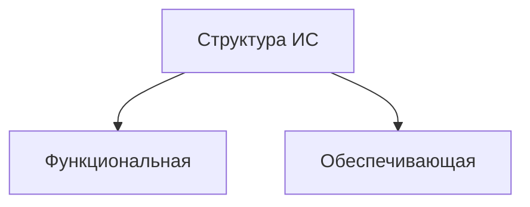

**Функциональная часть** - решает комплекс прикладных задач,характеризующийся высокой степенью информационных обменов между задачами.
- Подзадачи
- Задачи
- Модели и алгоритмы

**Обеспечивающая часть** - является средством реализации управления системы. В ее состав входят следующие виды **обеспечения**:
1. **информационное** обеспечение, в состав ИС которого входят классификаторы технико-экономической информации, нормативно-справочная информация, форма представления и организация данных в системе, протоколы обмена данными;
2. **программное** обеспечение : (программные средства с программной документацией на них)
3. **лингвистическое** обеспечение (тезаурусы, языки описания и манипулирования данными)
4. **математическое** обеспечение: методы решения задач управления, модели и алгоритмы; 
5. **техническое** обеспечение: технические средства, необходимые для реализаций функций ИС (ЭВМ, принтеры, многоф. устр-ва);
6. **организационное** обеспечение: документы, определяющие функции подразделений управления, действия и взаимодействие персонала ИС; 
7. **правовое** обеспечение: нормативные документы, определяющие правовой статус ИС, персонала ИС, правил функционирования ИС и нормативы на автоматически формируемые документы.

# 3. Свойства информационных систем. Особенности современных информационных систем

Каждая система обладает свойствами делимости и целостности.

## Потребительские свойства ИС:

- **Функциональная полнота** – способность системы обеспечивать получение всей необходимой пользователю информации на некотором заданном интервале времени
- **Функциональная надёжность** – способность системы обеспечивать получение безошибочной/неискаженной информации в заданные сроки
- **Временная обеспеченность** – способность системы обеспечивать получение нужной информации в требуемое время
- **Эффективность** – способность системы решать поставленные задачи в минимальные сроки ИЛИ способность системы приносить пользу
- **Адаптивность** – способность системы приспосабливаться к частично изменившимся условиям и обеспечивать устойчивое функционирование на большом интервале времени
- **Иерархичность** – способность системы быть составной частью системы более высокого уровня или содержать в себе системы более низкого уровня

## Особенности современных ИС:

- **сложность описания** (достаточно большое количество функций, процессов, элементов данных и сложные взаимосвязи между ними, требующая тщательного моделирования и анализа данных и процессов). 
- **наличие** совокупности **тесно взаимодействующих компонентов**(имеющих локальные задачи и цели функционирования)
- **отсутствие полных аналогов**,ограничивающее возможность использования каких-либо типовых проектных решений и прикладных систем.
- **функционирование в неоднородной среде**.
- необходимость интеграции существующих и вновь разрабатываемых приложений.

# 4. Классификация информационных систем

1. По степени **формализации задачи**:
	 - **Формализованные** – известны все элементы задачи и взаимосвязи между ними, имеется чёткий алгоритм решения, математическая модель, роль человека минимальна (бухгалтерские ИС, банковские ИС, логистические ИС).
	 - **Неформализованные** – элементы задачи и взаимосвязи между ними (почти) неизвестны, задачу невозможно либо очень сложно описать алгоритмически, возможности использования системы ограничены, роль человека максимальна (ИС оценки на базе мнений или психологических портретов).
	 - **Частично формализованные** - известны не все элементы задачи и взаимосвязи между ними, алгоритм решения или некоторые его этапы нечётки, роль человека значительна, такой класс ИС встречается чаще всего (экспертные ИС, репортинговые ИС).
  
2. По **назначению**:
	 - **Маркетинговые** – основные задачи: анализ рынка и продаж, организация рекламной кампании
	 - **Производственные** – основные задачи: создание и внедрение научно-технических новшеств
	 - **Финансовые и учётные** – основные задачи: контроль, анализ и управление финансовыми ресурсами, бухгалтерия и статистика
	 - **Кадровые** – основные задачи: подбор и расстановка персонала, определение функций сотрудников
	 - **Прочие**

3. По уровню **управления**:
	 - **Стратегические** – системы поддержки топ-менеджмента. Назначение систем – поддержка в принятии решений по реализации перспективных стратегических целей компании. 
	 - **Тактические** – системы поддержки менеджеров среднего звена. Назначение систем – анализ показателей, работа с архивной информацией, статистический анализ, составление отчётов за средний промежуток времени.
	 - **Операционные** – системы поддержки специалистов/исполнителей, учёта сделок/событий. Назначение систем – отвечать на запросы о текущем состоянии, отслеживать поток сделок в фирме, составлять отчёты о произошедших события.

4. По степени **автоматизации**:
	 - **Автоматизированные** – неполная автоматизация. Требуется постоянное участие персонала
	 - **Автоматические** – полная автоматизация. Участие персонала не требуется или требуется относительно редко

5. По **сфере применения**:
	 - **ИС управления технологическими процессами** для автоматизации функций производственного персонала. Они широко используются при организации поточных линий, изготовлении микросхем, на сборке, для поддержания технологического процесса в судостроительной, электронной, металлургической и машиностроительной промышленности
	 - **ИС автоматизированного проектирования** предназначены для автоматизации функций инженеров-проектировщиков, конструкторов, архитекторов, дизайнеров при создании новой техники или технологии
	 - **Интегрированные (корпоративные) ИС** для автоматизации всех функций фирмы и охватывающие весь цикл работ от проектирования до сбыта продукции. Создание таких систем весьма затруднительно, поскольку требует системного подхода с позиций главной 11 цели, например, получения прибыли, завоевания рынка сбыта и т. д.

6. По **характеру использования информации**:
	 - **Управляющие** – обеспечивают получение решения на основе автоматизации информационных процессов в сфере управления, на основе которой человек принимает решение (1С:Предприятие)
	 - **Информационно-справочные системы** – производят ввод, систематизацию, хранение, выдачу информации по запросу пользователя без сложных преобразований данных (Библиотечная система)
	 - **GIS** – системы, работающие с географическими данными, позиционированием, картами и т.д. (2GIS) 
	 - Информационно-поисковые (ИПС) – осуществляют поиск информации без её обработки (гугл)
	 - Документальные (документографические) ИПС – осуществляют создание, хранение, обработку и поиск документов. Отличительная черта – присвоение каждому документу уникального кода, составляющего поисковый образ (библиотечная система)
	 - Фактографическая ИПС – работает по принципу документальной, но вместо документов использует факты/выдержки, проассоциированные с содержимым (википедия)
	 - Информационно-решающие системы – помимо поиска осуществляют функции вычисления некоторых значений на базе хранящейся информации или иных способов её обработки (КонсультантПлюс)
	 - Советующие – Вырабатывают информацию, которая принимается человеком к сведению и не превращается немедленно в серию конкретных действий. Эти системы обладают более высокой степенью интеллекта, так как для них характерна обработка знаний, а не данных (системы постановки мед. диагноза)

7. По **масштабу**:
	 - **Локальная** – предназначена для решения некоторого круга задач одного человека или одного уровня предприятия
	 - **Корпоративная** – автоматизирует все бизнес-процессы целого предприятия или их значительную часть (такие системы иногда называют информационными системами предприятия и системами комплексной автоматизации предприятия)

# 5. Основополагающие принципы создания информационных систем 

**Системность:** должны быть установлены такие связи между структурными компонентами системы, которые обеспечивают цельность её и взаимодействие с другими системами. Нельзя разрабатывать какую-либо задачу автономно от других и реализовывать только отдельные её аспекты. Задача должна рассматриваться комплексно со всеми возможными информационными связями.

**Развитие:** внесение в систему изменений должно осуществляться только путём дополнения системы без переделки уже созданного, без нарушения её функционирования.

**Совместимость:** при создании системы должны быть реализованы информационные интерфейсы, благодаря которым она может взаимодействовать с другими системами согласно установленным правилам.

**Стандартизация:**  при создании системы должны быть рационально использованы типовые, унифицированные и стандартизованные элементы, проектные решения, пакеты прикладных программ и т.д.

**Эффективность:** между затратами на создание системы и целевыми эффектами должно быть достигнуто рациональное соотношение.

**Концептуальная общность:** единая методология на всех этапах создания ИС.

# 6. Частные (дополнительные) принципы создания информационных систем 

**Принцип декомпозиции:** ИС можно до определённой степени разделить на подсистемы для более эффективного анализа и проектирования.

**Принцип первого руководителя:** Непосредственно руководить созданием автоматизированной системы должен первый руководитель объекта автоматизации (если создаётся интегрированная автоматизированная система управления предприятием, то руководить должен генеральный директор предприятия. Если создаётся АСУ цехом, то руководить созданием АСУ цехом должен начальник цеха).

**Принцип новых задач:** Должен осуществляться постоянный поиск расширения возможностей системы, совершенствование процесса управления и методов оптимизации.

**Принцип автоматизации проектирования:** Заключается в повышении эффективности процесса проектирования и создание ИС на всех уровнях, обеспечивая при этом сокращение временных, трудовых и стоимостных затрат за счёт внедрения индустриальных методов.

**Принцип автоматизации информационных потоков и документооборота:** Заключается в комплексном использовании технических средств на всех стадиях прохождения информации через ИС.

# 7. Организационно-технологические принципы создания информационных систем

**Принцип абстрагирования:** заключается в выделении существенных аспектов системы и отвлечения от несущественных для представления проблемы в более простом общем виде, удобном для анализа и проектирования

**Принцип формализации:** заключается в применении формализованных методов описания и моделирования изучаемых и проектируемых процессов

**Принцип концептуальной общности:** заключается в неукоснительном следовании единой методологии на всех этапах проектирования ИС

**Принцип непротиворечивости и полноты:** заключается в наличии всех необходимых элементов в проектируемой системе и согласованном их взаимодействии

**Принцип доступа конечного пользователя:** заключается в том, что пользователь должен иметь средства доступа к данным, которые он может использовать непосредственно (без программирования)

**Принцип независимости данных:** предполагает, что модели данных должны быть спроектированы независимо от процессов их обработки, а также от их физической структуры и распределения в технической среде

**Принцип структурирования данных:** необходимость структурирования и иерархической организации элементов информационной базы системы

# 8. Жизненный цикл информационной системы. Структура жизненного цикла

**Жизненный цикл информационной системы** - весь период существования ИС, начиная от выработки решения о ее создании, до прекращения её использования.

**Этапы жизненного цикла:**
1.	**Анализ** – исследование и анализ предметной области и существующих ИС, определение требований к создаваемой ИС и оформление технико-экономического обоснования и технического задания на разработку ИС.
2.	**Проектирование** – разработка состава автоматизируемых функций, состава обеспечивающих подсистем, оформление технического проекта ИС.
3.	**Реализация** – разработка и настройка программ, создание и наполнение баз данных, создание рабочих инструкций для персонала, оформление рабочего проекта.
4.	**Внедрение** – комплексная отладка подсистем, обучение персонала, поэтапное внедрение ИС по подразделениям предприятиям, оформление акта о приёмо-сдаточных испытаниях ИС.
5.	**Эксплуатация** (сопровождение) – сбор рекламаций и статистики о функционировании ИС, исправление ошибок и недоработок, оформление требований к модернизации ИС и её выполнение (повторение этапов 2-5).


# 9. Модели жизненного цикла

## **Каскадная**

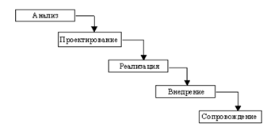  

Особенности:
- На каждом этапе формируется законченный набор проектной документации.
- Имеется возможность планирования сроков завершения всех работ и соответствующих затрат.
- Реальный процесс создания ИС никогда полностью не укладывается в такую жёсткую схему.
- В начале проекта требования заказчика реально определены лишь частично.
- Результаты разработки доступны заказчику только в конце проекта.

## **Инкрементная**

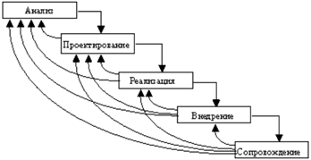  

Особенности:
- Подразумевает разработку ИС в несколько инкрементов, т.е. с запланированным улучшением продукта.
- В отличие от классической стратегии заказчик может раньше увидеть результаты.
- Используется при разработке сложных и комплексных систем.

## **Спиральная**

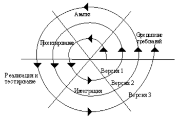  

Особенности:
- Позволяет быстрее показать заказчику работоспособный продукт
- Допускает изменение требований при разработке ИС
- Обеспечивает большую гибкость в управлении проектом
- Позволяет совершенствовать процесс разработки
- Уменьшаются риски заказчика
- Затруднены операции временного и ресурсного планирования всего проекта в целом

# 10. CASE-технология. Современные CASE-средства, ориентированные на проектирование ИС.

**CASE-технология** представляет собой совокупность методологий анализа, проектирования, разработки и сопровождения сложных ИС, поддерживаемую комплексом взаимоувязанных средств автоматизации.

**Современные CASE-средства, ориентированные на проектирование ИС**:
- **Репозиторий** – ядро любого CASE-средства, разделяемая корпоративная БД, содержащая информацию об объектах проектирования, надмножество словарей метаданных.
- **Графический редактор диаграмм** – предназначен для создания, модификации и отображения диаграмм, которые описывают модель ИС или её компоненты.
- **Нотация** - отображение структур системы с помощью специальных графических символов.
- **Верификатор диаграмм** - часть ПО, контролирующая правильность построения диаграмм в рамках определённого метода.
- **Документатор проекта** – отвечает за построение различных отчётов 
- **Сервисы** – утилиты по обслуживанию репозитория (архивация, восстановление, создание, удаление).

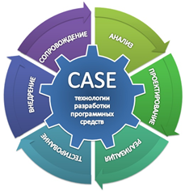

# 11. Особенности структурного (функционально-ориентированного) подхода

Сущность структурного подхода к разработке ИС заключается в её **декомпозиции на автоматизируемые функции**: система разбивается на функциональные подсистемы, которые в свою очередь делятся на подфункции, подразделяемые на задачи, и т.д.

В рамках этого подхода отдельно и независимо строятся **функциональные модели** и **модели данных**:

**Принципы:**
- **Декомпозиция** – принцип решения сложных проблем путём их разбиения на множество меньших независимых задач, лёгких для понимания и решения.
- **Иерархическое упорядочивания уровней** – принцип организации составных частей проблемы в иерархические древовидные структуры с добавлением новых деталей на каждом уровне.
- **Абстрагирование** – выделение существенных аспектов системы и отвлечения от несущественных.
- **Формализация** – необходимость строгого методического подхода к решению проблемы.
- **Непротиворечивость** – обоснованность и согласованность элементов
- **Структурирование данных** – данные должны быть структурированы и иерархически организованы.

# 12. Особенности объектно-ориентированного проектирования

**Суть:**
- Система разбивается на набор **объектов**, которые, как правило, соответствуют объектам реального мира, взаимодействующих между собой путём посылки сообщений
- Иерархия выстраивается с использованием двух отношений: **композиции и наследования**. При этом «объект-часть» может включаться сразу в несколько «объектов-целое». Таким образом, модуль представляется в виде ориентированного графа

**Понятия:**
- **Объект** – абстракция или любая вещь с чётко очерченными границами, имеющая смысл в контексте рассматриваемой прикладной области. Все объекты отличны один от другого.
- **Класс объектов** – абстрактное понятие, объединяющее объекты. Общий шаблон.
- **Атрибут объекта** – значение, характеризующее свойство объекта (цвет, форма, вес и т.д.). 
- **Метод** – реализация операции/действия для/над объектом класса.

**Основные принципы:**
- **Инкапсуляция** – сокрытие информации, разделение элементов абстракции на секции с различной видимостью.
- **Наследование** – возможность создавать из классов новые классы по принципу «от общего к частному». Наследование позволяет новым классам при сохранении всех свойств классов-родителей добавлять свои черты.
- **Полиморфизм** – способность объектов выбирать метод на основе типов данных, применяемых в сообщении. Каждый объект может реагировать по-своему на одно и то же сообщение.
- **Модульность** – способность подвергаться декомпозиции на ряд сильно связанных и слабо сцепленных модулей.
- **Абстрагирование** – заключается в фиксации основных значимых характеристик объекта. Эти характеристики отличают его от других объектов и позволяют сформировать ясные границы понятия объекта.

# 13. Метод IDEF0. Нотация IDEF0. Правила соединения блоков.

> 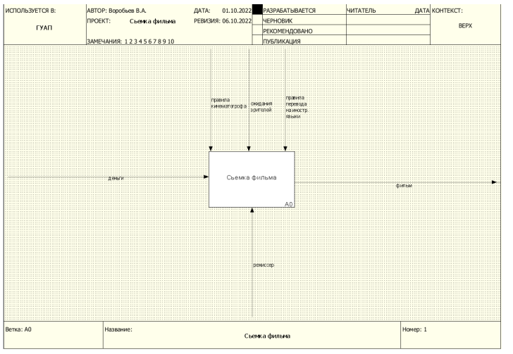  

> 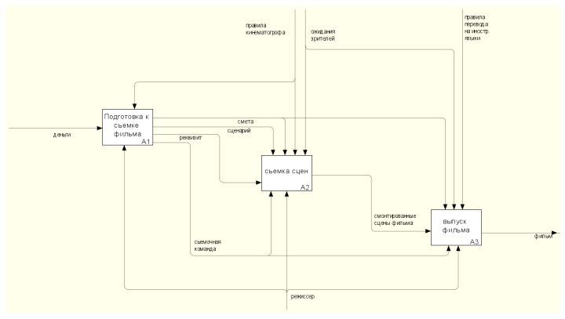
  
**IDEF0** – это метод создания функциональной модели, отображающей структуру и функции системы, а также потоки информации и материальных объектов, связывающие эти функции.

Функции системы исследуются независимо от объектов, обеспечивающих их выполнение. Такая сугубо «функциональная» точка зрения позволяет чётко отделить аспекты назначения системы от вопросов её реализации.

IDEF0 определяет два графических объекта:
- **Блок**, с помощью которого обозначается некоторая функция (действие)
- **Стрелка**, с помощью которой указываются информационные или материальные объекты

На IDEF0-диаграммах с помощью стрелок можно показывать до четырёх типов объектов:
- **Вход** (Input, I)
- **Управление, или контроль** (Control, C)
- **Выход** (Output, O)
- **Исполняющий механизм** (Mechanism, M)

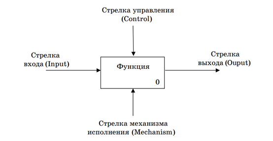  

**Стрелки входа** – это информация или сырье, потребляемое или преобразуемте функциональным блоком для производства выхода. Стрелки входа всегда направлены в левую сторону прямоугольника функционального блока. Наличие у некоторого блока входных стрелок не является обязательным, т. к. возможно, что некоторые блоки ничего явным образом не изменяют и не преобразуют

**Стрелки управления** определяют, чем регулируется выполнение функции. Стрелки управления всегда входят в функциональный блок сверху. Управление контролирует поведение функционального блока для обеспечения получения желаемого выхода. Поэтому каждый блок должен иметь как минимум одну стрелку управления. Управление обычно представляет собой правила, инструкции, стандарты и т. п. Управление можно рассматривать как специфический вид входа. 

**Стрелки выхода** – информация или продукция, получаемые в результате выполнения функционального блока. Каждый блок должен иметь как минимум одну стрелку выхода. Важно, чтобы наименования входных и выходных стрелок различались. Например, если блок «Проверить оформление документов» имеет вход «Документы», то выходную стрелку можно обозначить как «Проверенные документы»

**Стрелки механизма исполнения** – это объекты, с помощью которых и посредством которых выполняется моделируемое действие. Пример механизма исполнения: персонал, оборудование. Стрелки механизма исполнения часто могут не указываться, если их отображение не способствует достижению цели моделирования

# 14. Метод IDEF0. Туннелирование. Порядок построения модели IDEF0

Модель IDEF0 представляет собой набор взаимоувязанных диаграмм. Каждая диаграмма является описанием системы или её отдельных функциональных блоков в рамках некоторого **уровня детализации**.

**Контекстная диаграмма** – диаграмма самого верхнего уровня иерархии, дающая самое общее представление о системе. На контекстной диаграмме отображается только один функциональный блок

Далее **контекстная функция декомпозируется** на основные функции системы с помощью отдельной диаграммы. В свою очередь каждая такая функция может быть разложена на более мелкие и т. д. При построении модели нужно соотнести каждый функциональный блок более низкого уровня с функциональным блоком более высокого уровня

Следует всегда помнить, что некоторый функциональный блок и диаграмма его декомпозиции суть одно и то же, но рассматриваемое с разной степенью детализации. Отсюда следует, что все стрелки, связанные с рассматриваемым функциональным блоком, **должны присутствовать на декомпозирующей его диаграмме**. Исключения из этого правила взаимоувязывания стрелок возможно только в случае использования механизма **туннелирования**.

**Порядок построения модели:**
1. Определение цели моделирования
2. Определение точки зрения
3. Построение контекстной диаграммы
4. Декомпозиции
   
**Туннелирование**: Если необходимо нарушить правило взаимоувязывания стрелок на родительской диаграмме и диаграмме декомпозиции, то следует воспользоваться механизмом туннелирования. Туннели позволяют **избавиться от загромождения родительских диаграмм стрелками**, несущественными для их уровня.

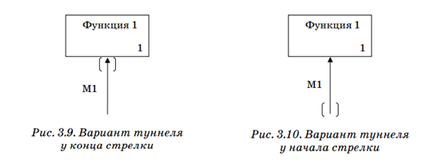

# 15. Диаграммы потоков данных DFD. Элементы DFD в нотациях Гейна-Сарсона и Йордана-Де Марко.

>   

**DFD** описывает асинхронный процесс преобразования информации от её ввода в систему до выдачи пользователю.

**Основные элементы DFD:**

- **Система и подсистема** – При построении модели сложной ИС она может быть представлена в общем виде на так называемой контекстной диаграмме в виде одного блока (то есть системы) либо декомпозирована на ряд подсистем. Система и подсистема – это частный случай процесса. Наименование системы и подсистемы представляет собой существительное или некоторое предложение с подлежащим
- **Внешняя сущность** – материальный предмет или физическое лицо, представляющие собой источник или приёмник информации. Внешняя сущность находится за пределами анализируемой части системы. В процессе анализа некоторые внешние сущности могут переноситься внутрь диаграммы анализируемой системы. Или, наоборот, часть процессов ИС может переноситься за границы моделирования и представляться как внешние сущности
- **Процесс** – преобразование входных потоков данных в выходные в соответствии с определенным алгоритмом. Физически процесс может реализовываться посредством персонала организации, аппаратуры, программы и т. п. Наименование процесса: активный глагол в неопределённой форме, за которым следует дополнение в виде существительного в винительном падеже («вычислить квадратный корень» и т. п.)
- **Накопитель данных** – абстрактное устройство для хранения информации. Накопитель данных часто является прообразом будущей БД. Наименование накопителя данных представляет собой существительное
- **Поток данных** – информация, передаваемая от источника к приёмнику по некоторому каналу

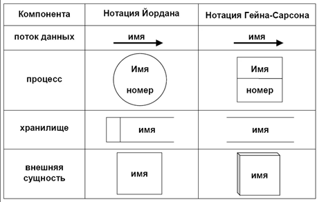

# 16. Диаграммы потоков данных DFD. Порядок построения иерархии

**Кратко:**
1. **Создание контекстной диаграммы**. Обычно для простой ИС строится одна диаграмма со звездообразной топологией: центр звезды – система, углы – внешние сущности
2. **Детализация системы и процессов**. При этом должно соблюдаться правило балансировки: на диаграмме детализации могут указываться только те источники и приёмники информации, которые показаны для детализируемой системы (процесса). Правило нумерации процессов: номер имеет вид типа X.Y, где Y – порядковый номер процесса, детализирующего процесс X. 
3. **Завершение детализации**. Детализация процесса не выполняется в следующих случаях:  небольшое число входных и выходных потоков данных (2–3 потока) – можно описать процесс преобразования данных последовательным алгоритмом – преобразование входной информации в выходную описывается единственной логической функцией
4. **Верификация (проверка на корректность)**. Должно выполняться правило сохранения информации: все поступающие данные должны быть считаны, все считываемые – записаны

**Подробно:**
1. Разложить множество требований в крупные группы по функциональному признаку, получить в результате основные функциональные группы
2. Выявить все важные внешние объекты
3. Определить основные виды передаваемой информации
4. Разработать предварительную контекстную диаграмму (КД). Основные функциональные группы станут процессами, внешние объекты – внешними сущностями, основные виды информации – потоками данных
5. Изучить предварительную КД, внести требуемые изменения
6. Построить КД путём объединения всех процессов предварительной диаграммы в один процесс, который станет системой, и группирования потоков данных
7. Сформировать диаграмму первого уровня детализации на базе процессов предварительной КД
8. Проверить корректность DFD первого уровня
9. Описать каждый процесс текущей диаграммы с помощью детализирующей диаграммы или миниспецификации
10. Параллельно с детализацией процессов выполнить декомпозицию потоков, занести определения новых потоков в словарь данных
11. Проверить соблюдения основных требований для текущей диаграммы
12. Писать миниспецификацию в тех случаях, если функцию сложно или невозможно выразить через комбинацию процессов.

# 17. Метод IDEF3. Основные графические элементы. Соединения синхронные и асинхронные.

>  


**IDEF3** – это способ описания процесса как упорядоченной последовательности событий вместе с описанием объектов, имеющих отношение к этому процессу. Часто используется как детализация методов IDEF0 и DFD.

**IDEF3 позволяет описывать:**
- Объекты
- Роли, выполняемые объектами
- Отношения между объектами в ходе выполнения процесса
- Состояния объектов
- Изменения, которым подвергаются объекты
- Время выполнения работ, контрольные точки синхронизации работ
- Ресурсы, необходимые для выполнения работ

В IDEF3 определены два типа взаимосвязанных схем (моделей):
- **Process Flow Description Diagrams** – описание процесса как логической последовательности действий.
- **Object State Transition Network** – сеть переходов состояний объекта.

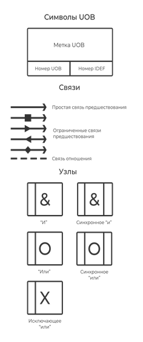  

## Основные графические элементы

- **Действия** – соответствуют по смыслу функции IDEF0 или процессу DFD:
- **UOB (Unit Of Beheavor) – Единицы поведения**. Любые виды действия, процессы
- **Object** – Ссылочный объект, описывает элемент необходимый для работы, но не выполняющий конкретного действия (не имеет номера UOB)
- **GOTO** – Используется для реализации цикличности выполнения некоторого действия (не имеет номера UOB)
- **Связи** – это связующее звено между функциональными элементами (UOB), отражающие порядок протекания процессов:
	 - **Временное предшествование** – указывает на то что один процесс A выполняется после другого B
	 - **Поток данных (объектный поток)** – указывает на то что на вход A подаётся результат работы B
	 - **Нечёткое отношение** – почдеркивает возможную, связь A и B, не несущую строгих ограничений
- **Узлы** – это точки, в которых могут сходиться несколько связей, после чего снова расходиться. Используются для распараллеливания процесса, бывают синхронными и асинхронными:
	 - **И** – указывает, что все действия ведущие в этот узел должны завершиться, либо все действия выходящие из этого узла должны начаться
	 - **ИЛИ** – после узла могут запускаться один или несколько подпроцессов, в зависимости от условия, которое выполняется в узле
	 - **ИСКЛЮЧАЮЩЕЕ ИЛИ** – выполняется только одна ветка, в точности подходящая под нужные условия
	
	 Также узлы деляться на:
	 - **Синхронное соединение** – действия должны начаться/завершиться одновременно.
	 - **Асинхронное соединение** – действия не обязаны начаться/завершиться одновременно.

# 18. Совместное использование IDEF0, DFD и IDEF3.

При решении практических задач построения функциональных моделей, предназначенных как для проектирования ИС, так и для анализа некоторых процессов, обычно используются несколько методов:

Трёхступенчатая схема разработки и представления функциональных моделей:
1. **Внешний (концептуальный)** уровень создаётся с помощью **IDEF0**. На этом этапе определяются базовые функции, основные передаваемые и используемые объекты
2. **Дальнейшая детализация** производится с помощью средств **DFD**. На этом уровне большее внимание уделяется структуре передаваемых и хранимых данных, топологии сети информационного обмена
3. **Детальная спецификация** состава и порядка выполнения отдельных функций производится **с помощью IDEF3**. Если разрабатываемая модель предназначена для нужд проектирования и разработки ИС, то вместо IDEF3 часто используют такие визуальные средства спецификации передач управления, как блок-схемы и FLOW-формы

# 19. Методы модульного проектирования. Структурные карты Константайна

Структурные карты Константайна позволяют указывать сос**тав и взаимосвязи программных модулей**, а также взаимосвязи между функциями системы и реализующими их модулями

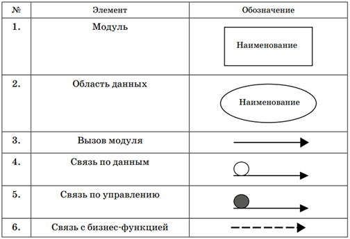

Среди модулей выделяют:
- **Подсистему** – модуль, определённый в другом месте диаграммы путём декомпозиции на составные модули.
- **Библиотеку** – внешний для системы модуль.
- **Область данных** – модуль, содержащий только данные.

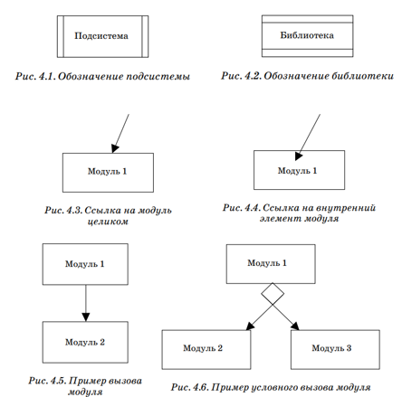  

**Вызов модуля** может производиться через некоторый стандартный интерфейс модуля, то есть посредством ссылки на модуль целиком.

**Связь с бизнес-функцией** позволяет указать, какие именно модули реализуют функции системы.

**Связь по данным и связь по управлению** позволяют конкретизировать тип вызова модуля и указать параметры вызова.

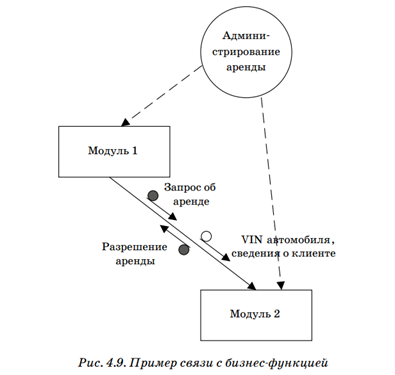

# 20. Проектирование программных модулей. Критерии

## Связность модуля

**Связность модуля** - это мера независимости его частей. Чем более зависимы части, тем выше связность. Считается, что чем выше связность модуля, тем лучше результат проектирования.

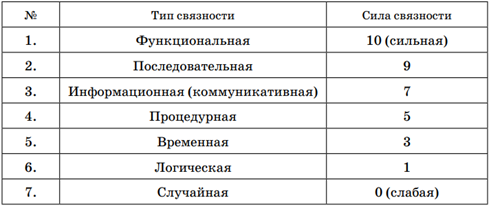  

1. **Функциональная** – выполняет единственную функцию и реализуется последовательностью операций в виде единого цикла. Не может быть разбит на функциональные части
2. **Последовательная** – может быть разбит на последовательные части, выполняющие независимые подфункции, но совместно реализующие единственную функцию
3. **Информационная** – модуль составлен из независимых модулей, разделяющих одни и те же данные. Общая структура данных является основой организации модуля
4. **Процедурная** – соответствует «лобовому» разбиению действий алгоритма программы на модули. Например, такая структура может возникнуть при расчленении длинной программы на части в точках передачи управления, но без учёта каких-то функциональных критериев при выборе разделительных точек, так что решение какой-то подфункции может «размазываться» по нескольким модулям
5. **Временная** – содержит конструкции, которые функционально не связаны, но необходимы в один и тот же момент обработки
6. **Логическая** – объединяет процедуры по признаку их функционального подобия 
7. **Случайная** – его элементы объединены произвольным образом. Такой тип связности свидетельствует об ошибках проектирования

## Сцепление модулей

**Сцепление модулей** – это мера относительной независимости модулей. Данная характеристика является до некоторой степени обратной связности модулей. Чем слабее сцепление тем лучше

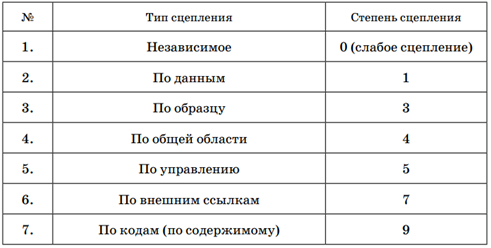  

1. **Независимое** – модули не вызывают друг друга и не используют общих данных. Такие модули не сцеплены.
2. **По данным** – модули имеют общие переменные, передаваемые от одного к другому как параметры.
3. **По образцу (по типу)** – параметры представляют собой структуры данных. Сцепление сильнее, чем в предыдущем случае, поскольку оба модуля должны знать о внутренней структуре данных, потенциально подверженной изменениям.
4. **По общей области** – модули используют одну и ту же глобальную переменную (структуру данных).
5. **По управлению** – один из модулей управляет вычислительным процессом другого с помощью передачи флагов или переключателей. То есть один из модулей «знает» внутреннюю структуру другого.
6. **По внешним ссылкам** – один модуль имеет доступ к данным другого через внешнюю точку входа.
7. **По кодам (по содержимому)** – один модуль может передавать управление внутренним областям другого без обращения к некоторым точкам входа. Такое сцепление часто возникают при программировании на языках низкого уровня при оптимизации кода по критерию размера и/или времени выполнения.

# 21. Методы модульного проектирования. FLOW-формы

**FLOW-формы** позволяют изображать поток передачи управление не с помощью явного указания линий переходов по управлению, а с помощью вложенности типовых структур.

Каждый символ FLOW-формы является блоком обработки.

Каждый символ имеет вид прямоугольника (блока) и может быть вписан в любой внутренний блок любого другого символа.

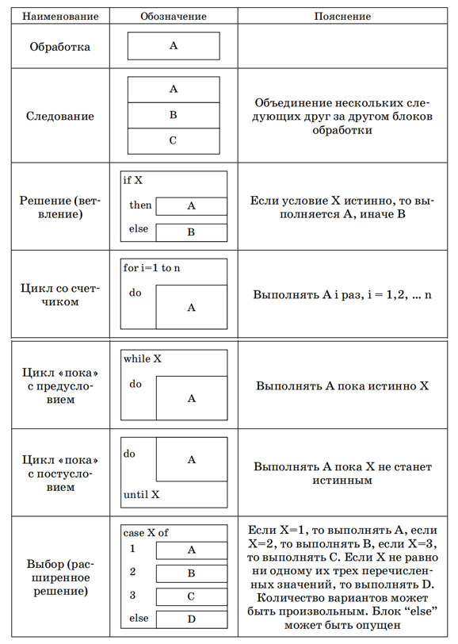  

# 22. UML – универсальный язык моделирования. Виды моделей UML. Представления модели UML
UML – это язык построения графических диаграмм, описывающих взаимодействие как естественных, так и искусственных элементов

Виды UML-диаграмм содержат представления

Модель вариантов использования – предназначена для функционального моделирования системы:
- Диаграмма Прецедентов
- Диаграмма Состояний
- Диаграмма Классов
- Диаграмма Последовательности действий
- Диаграмма Сотрудничества

Модель анализа – уточняет требования системы с учётом внутренней организации:
- Диаграмма Классов
- Диаграмма Последовательности действий
- Диаграмма Сотрудничества

Модель проектирования – детализировано описывает внутреннюю архитектуру и алгоритмы работы системы:
- Диаграмма Классов
- Диаграмма Деятельности

Модель реализации – определяет логическую и физическую организацию классов в виде компонентов и подсистем, а также топологию информационной системы
- Диаграмма Классов
- Диаграмма Компонентов
- Диаграмма Развёртывания

# 23. UML – универсальный язык моделирования. Элементы UML – сущности

**Сущности** – это некоторые абстрактные объекты. Сущности являются основными элементами UML

## Структурные

**Структурные** – представляют статические части модели, соответствующие концептуальным или физическим элементам системы
- **Класс** – описание совокупности объектов с общими атрибутами, операциями, отношениями и семантикой. В зависимости от назначения диаграммы (модели), класс может отображаться с той или иной степени детальности, например, может указываться только наименование
- **Интерфейс** – описание совокупности методов, которые определяют набор услуг, предоставляемых классом или компонентом
- **Прецедент использования** – описание последовательности выполняемых системой действий, которые приводят к наблюдаемому результату, значимому для какого-либо действующего лица (актёра)
- **Кооперация (сотрудничество)** – это совокупность классов, интерфейсов и других элементов, эффект от работы которых не сводится к сумме простых слагаемых 
- **Компонент** – физическая заменяемая часть системы, которая соответствует некоторому набору интерфейсов и обеспечивает их реализацию. Компонент — это физическая «обёртка» для классов, пакетов, других компонентов
- **Узел** — это вычислительный элемент реальной системы, который обладает машинной памятью некоторого объёма и способностью обработки (принтер)
- **Актёр** — согласованная совокупность ролей, которые играет пользователь системы при взаимодействии с ней. Актёром может быть как одушевленный предмет (человек-оператор), так и не одушевленный (другие ИС)

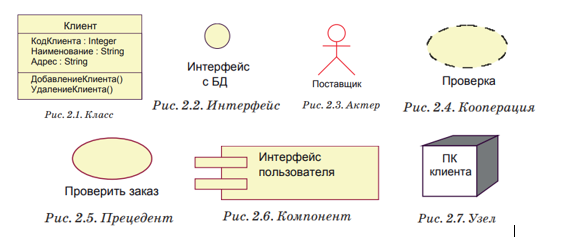  

## Поведенческие

**Поведенческие** – являются динамическими составляющими модели UML. Они описывают поведение модели во времени и в пространстве.

- **Взаимодействие** — поведение, состоящее в обмене сообщениями между объектами в рамках конкретного контекста для достижения определённой цели
- **Автомат** — алгоритм поведения, определяющий последовательность состояний, через которые проходят объект или процесс (взаимодействие)

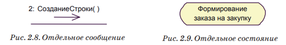

## Групирующие

**Группирующие** – являются организующими частями модели UML. Это блоки, на которые можно разложить модель.
- **Пакет** – организует элементы в группы. Пакеты существуют только во время разработки модели, в отличие от компонентов, которые тоже выполняют функции агрегации элементов.
   
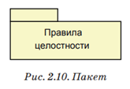  

## Аннотационные

**Аннотационные** – это пояснительные части модели UML
- **Примечание** – используется для словесного описания чего-либо на диаграмме.

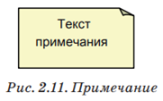  

# 24. UML – универсальный язык моделирования. Элементы UML – отношения

**Отношения** – это связи между сущностями.

**Зависимость** – семантическое отношение, которое показывает, что изменение спецификации независимой (или целевой) сущности влияет на .зависимую.

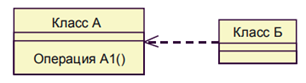

**Ассоциация** – структурное отношение, описывающее значимую связь между двумя и более сущностями
Четыре основные характеристики ассоциации: 
- **Наименование** – символьная строка, описывающая смысл отношения.
- **Роль** – описание того значения, которое имеет класс в контексте данной ассоциации.
- **Кратность** – описание числа объектов (экземпляров класса), которые могут быть связаны одним экземпляром ассоциации.
- **Агрегирование** – знак того, что ассоциация имеет характер отношения «часть-целое».

  

**Обобщение** – структурное отношение типа «наследование», оно показывает, что объект-потомок наследует структуру и поведение родителя.

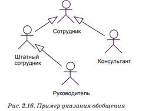

**Реализация** – семантическое отношение, показывающее такую зависимость, когда один из элементов определяет запрос (контракт), а другой обеспечивает его выполнение.

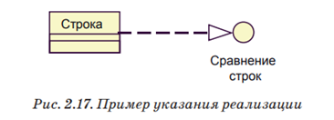

# 25. UML – универсальный язык моделирования. Диаграммы прецедентов

> 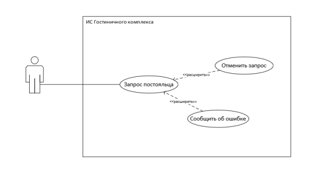  

Позволяют описать совокупность операций, которые выполняет система. На основе набора таких диаграмм формализуется и визуализируется список требований к системе и определяется множество выполняемых системой функций.

Каждая такая диаграмма — это **описание сценария поведения**, которому следуют действующие лица, или актёры.

Данный тип диаграмм применяется на начальных этапах проектирования и используется для определения требований к системе, выявления действующих в системе объектов и их основных функций.

**Элементы диаграммы: **
- **Прецеденты использования**
- **Актёры**
- **Отношения** между этими сущностями (зависимость, обобщение, ассоциация)

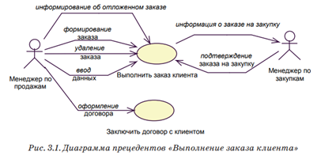  

# 26. UML – универсальный язык моделирования. Диаграммы классов

> 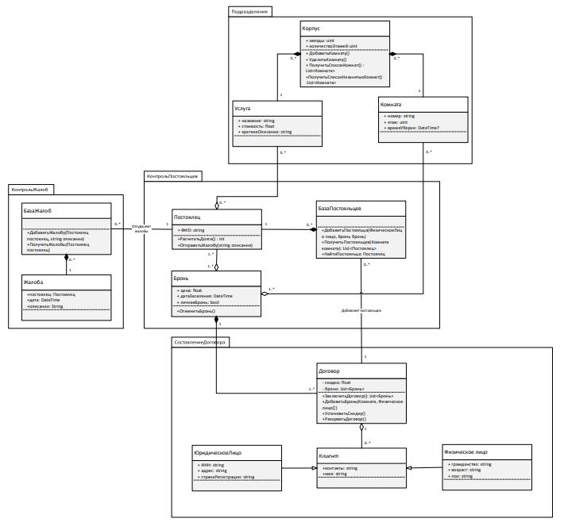  

**Диаграмма классов** – это граф, узлами которого являются элементы статической структуры проекта системы (классы, интерфейсы и т.п.), а дугами – отношения между узлами (ассоциации, наследование, зависимости)

Позволяют описывать структурные отношения между сущностями предметной области и создавать логическое представление системы как совокупности классов, пакетов и интерфейсов, связанных статическими отношениями, обычно структурного типа

Диаграмма классов основана на распространённой модели **«сущность-связь»** (Entity Relationship Diagram, ERD)

Диаграммы классов являются основным средством моделирования статического вида системы

**Элементы диаграммы:** 
- Класс
- Интерфейс
- Объект – экземпляр класса
- Пакет
- Отношения (ассоциация, обобщение, зависимость)

Диаграммы такого типа могут использоваться при проектировании БД, Коопераций и Словарей предметной области.

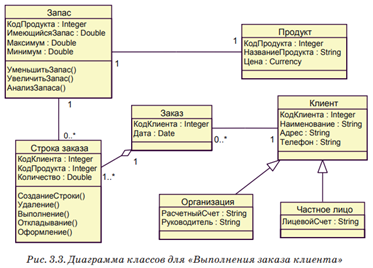

# 27. UML – универсальный язык моделирования. Диаграммы состояний.

Диаграмма состояний используется для описания эволюции объектов со сложным поведением. Диаграмма представляет собой граф, вершины которого – состояния объекта, дуги – переходы между состояниями

**Элементы диаграммы:**
- Начальные/конечные состояния
- Состояния объекта
- Переходы между состояниями

Переходы помечаются в соответствии со шаблоном: 
Событие(аргументы) \[условие] / 
Действие ^ Отправляемое_сообщение(аргументы)

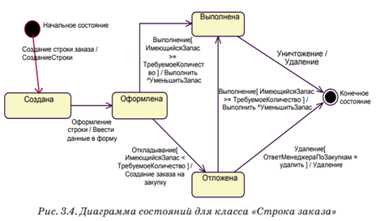  

# 28. UML – универсальный язык моделирования. Диаграммы деятельности.

> 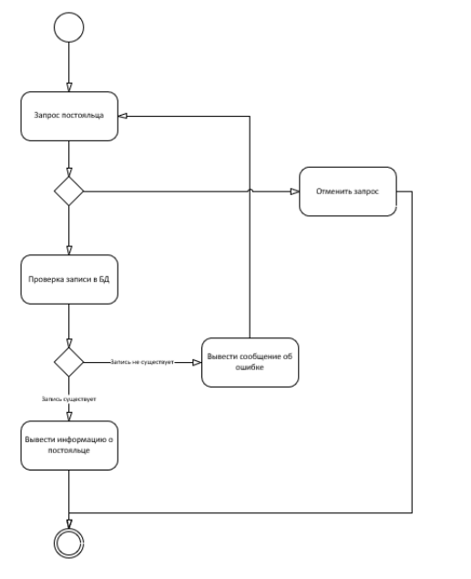  

Показывают переход потока управления от одной деятельности (работы) к другой. Можно рассматривать как аналог блок-схем

Этот тип диаграмм сходен с диаграммами состояний, и поэтому может быть использован для описания изменений состояния объекта. В диаграммах деятельности состояния являются некоторыми работами, и переходы в другое состояние выполняются после завершения деятельности, связанной с исходным состоянием

Таким образом, диаграмма деятельности представляет собой конечный автомат некоторой последовательности действий

**Элементы диаграммы:** 
- Начальные/конечные состояния
- Состояния действий
- Переходы
- Точки ветвления
- Разделения/слияния параллельных потоков

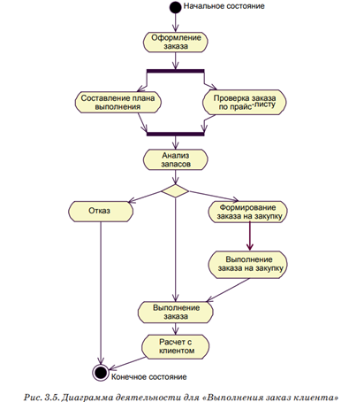  

# 29. UML – универсальный язык моделирования. Диаграммы последовательности действий

> 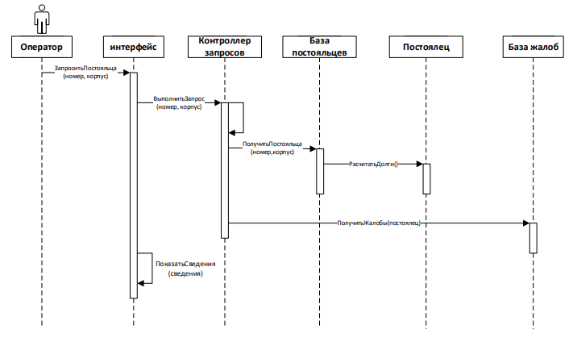  

Это вид диаграммы взаимодействия, в котором внимание акцентируется на временной упорядоченности сообщений

С помощью диаграмм последовательности действий удобно моделировать простые потоки управления, не содержащие сложных ветвлений и циклов
На одной диаграмме последовательности можно показать только один поток управления (или один сценарий). Поэтому обычно создают несколько диаграмм

**Элементы диаграммы:** 
- Объекты
- Сообщения
- Линия жизни объектов
- Фокус управления (активность)
- Символ уничтожения

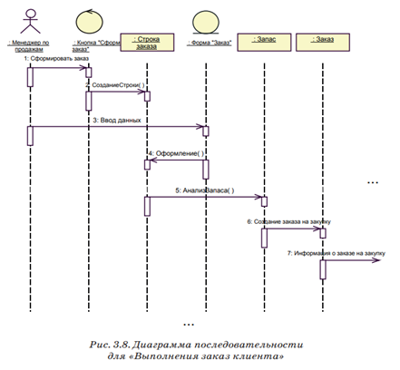  

# 30. UML – универсальный язык моделирования. Диаграммы сотрудничества

Это вид диаграммы взаимодействия, в котором основное внимание сосредоточено на структуре взаимосвязей объектов, принимающих и отправляющих сообщения

Диаграмма сотрудничества представляет собой граф, вершинами которого являются объекты, а рёбрами — связи

Связи именуются сообщениями, которые объекты посылают и принимают

Диаграмма сотрудничества иллюстрирует поток управления с точки зрения структуры взаимодействия объектов

**Элементы диаграммы: **
- Объекты
- Сообщения
- Связи
- Актёры

Сообщения имеют порядковый номер для указания временной последовательности сообщений. Для каждой связи можно показать несколько сообщений, и каждое из них должно иметь уникальный номер

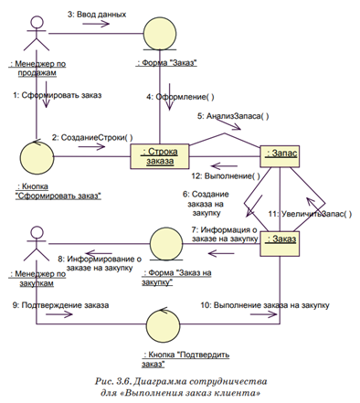  

# 31. UML – универсальный язык моделирования. Диаграммы компонентов.

Диаграммы компонентов используются при физическом проектировании ИС. 
Это статические структурные диаграммы, которые показывают разбиение программной системы на структурные компоненты и связи (зависимости) между компонентами. В качестве физических компонентов могут выступать файлы, библиотеки, модули, исполняемые файлы, пакеты и т. п. 

Данный тип диаграмм можно рассматривать как аналог диаграмм модулей, используемых в структурном программировании

Элементы диаграммы: 
- Компоненты
- Интерфейсы (предоставляемые, требуемые, соединительные)
- Зависимости

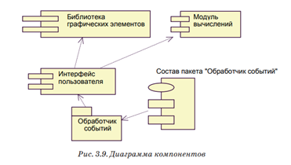  

# 32. UML – универсальный язык моделирования. Диаграммы развёртывания.

> Например, чтобы описать веб-сайт, диаграмма развертывания должна показывать, какие аппаратные компоненты («узлы») существуют (например, веб-сервер, сервер базы данных, сервер приложения), какие программные компоненты («артефакты») работают на каждом узле (например, веб-приложение, база данных), и как различные части этого комплекса соединяются друг с другом (например, JDBC, REST, RMI).

Предназначены для спецификации аппаратной части системы, размещения компонентов по аппаратным узлам и позволяют описать топологию аппаратных средств ИС

**Элементы диаграммы:**
- Узлы
- Коммуникационная ассоциация
- Артефакты (библиотеки например)

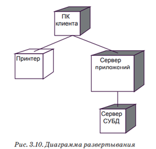  

# 33. BPMS. Основные стадии внедрения процессов.

**BPMS (Business Process Management System)** - системы управления бизнес-процессами; это основная технология для поддержки концепции BPM в компании. Система управления бизнес-процессами позволяет моделировать процессы компании и автоматизировать их исполнение, предоставляет возможность контролировать работу на всех этапах и быстро вносить улучшения.

**Основная цель BPMS** — осуществление программной поддержки процессного управления в организациях.

**Бизнес-процесс** – это логическая последовательность действий человека (или нескольких человек) в коллективе.

## Стадии внедрения:

1. **Проектирование** (моделирование) процесса с помощью встроенного дизайнера бизнес-процессов. Как правило все современные BPMS работают с нотацией BPMN и визуализируют готовый процесс в виде блок схемы. Это позволяет понимать и работать со схемами не только профильным специалистам и бизнес-аналитикам, но и людям бизнеса
2. **Исполнение** процесса с помощью движка (ядра) BPM. После старта процесса система автоматически разошлёт уведомление всем участникам, сопровождая их задачей и регламентом срока на выполнение. BPMS может взаимодействовать со сторонними ИТ-системами для повышения эффективности. На данном этапе очень важна скорость работы BPM-движка так как в крупных компаниях одновременно могут выполняться сотни, а иногда и тысячи процессов
3. **Мониторинг и контроль** за выполнением с помощью удобных графических дашбордов. BPM-система уведомит ответственного за процесс об отклонении от временных и других плановых показателей. Руководитель получает информацию о проблемных процессах, их участниках для скорейшего принятия решения в режиме реального времени
4. **Улучшение** процесса на основе полученных данных после выполнения процессов. Возможность гибкой настройки, масштабирования и быстрой адаптации BPMS к новым бизнес-условиям делает данный инструмент особо важным в современном мире

# 34. Основные элементы в нотации BPMN: действия, шлюзы, события.

> 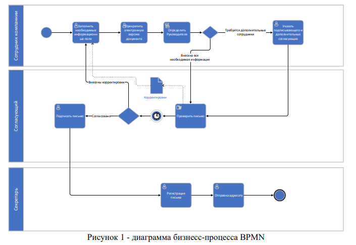  


BPMN (Business Process Model and Notation) – это определённый набор символов, которые позволяют наглядно отобразить последовательность выполнения задач и взаимосвязь рабочих операций — в формате, понятном разной аудитории

**Действия** (изображаются прямоугольниками с закруглёнными углами):
- **Пользовательская задача** – самая распространённая Задача, где человек участвует в качестве исполнителя
- **Ручное выполнени**е – представляет собой Задачу, выполнение которой подразумевает действия человека и исключает использование каких-либо автоматизированных механизмов исполнения или приложений
- **Задача-сценарий** – выполняюется без участия человека, обозначает выполнение в процессе некоторого автоматизированного действия
Составные действия называются подпроцессами

Шлюзы (изображаются ромбами и представляют точки принятия решений в процессе)

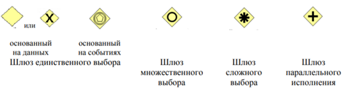  


**События BPMN** служат для обозначения различных событий, которые могут начать, прервать и закончить ход процесса. Изображается в виде круга со свободным центром. 

События разделяются на: 
- **Стартовые** (начальные) – указывают на то, в какой точке берет начало тот или иной процесс
- **Конечные** – указывают на то, в какой точке завершается тот или иной процесс. Конечное событие представляет собой круг, выполненный одиночной, жирной линией. Толщина линии должна быть жирной настолько, чтобы без труда можно было отличить Конечное событие от Стартового. 
- **Промежуточные** – указывает на то, что происходит на отрезке Процесса, ограниченном Стартовым и Конечным событиями. Промежуточное событие влияет на ход Процесса, однако, не может являться его началом или непосредственным завершением. Промежуточное событие представляет собой круг, который должен быть выполнен двойной тонкой линией  
События могут быть снабжены триггерами (некоторыми условиями или ограничениями), которые отражают причину события

# 35. Основные элементы в нотации BPMN: пул, дорожка, события.

**Пул** графически определяет область бизнес-процесса как общую зону ответственности за его исполнение

Внутри пула выделяются **дорожки** — зоны ответственности отдельных участников бизнес-процесса. Любые элементы схем в нотации, размещённые на той или иной дорожке, будут выполняться конкретными исполнителями Дорожки могут располагаться горизонтально или вертикально.

Любая диаграмма бизнес-процесса в нотации BPMN содержит **как минимум один пул**, однако в случае единственного пула его границы, как правило, не показывают. Более того, на диаграммах, содержащих более одного пула, не обязательно изображать границы «главного» пула, соответствующего бизнес-единице, для которой рассматриваемый процесс является внутренним.

**События:**

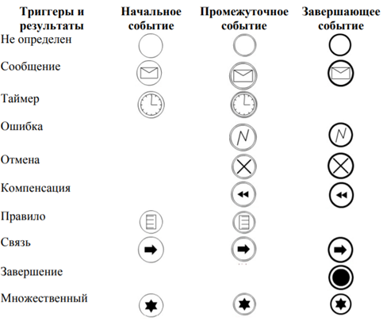  

# 36. Использование подпроцессов в BPMN.

**Подпроцессы** – составные действия, которые сами могут быть представлены в виде бизнес-процесса

**Подпроцессы** могут быть изображены на диаграмме в свёрнутом или развёрнутом виде

Подпроцессы используется в основном в двух случаях:
1. Для декомпозиции и повышения читаемости и наглядности схем (диаграмм);
2. Для описания повторяющихся действий. Единожды описанный Подпроцесс может многократно вызываться (использоваться) внутри различных процессов

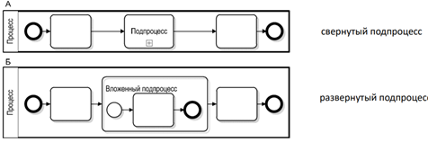  

