**ОГЛАВЛЕНИЕ** Воробьев Влад 4128
- [Самопроверка](#самопроверка)
- [Информационная технология. Определение, средства ее реализации.](#информационная-технология-определение-средства-ее-реализации)
- [Классификация информационных процессов](#классификация-информационных-процессов)
- [Классификация базовых информационных технологий.](#классификация-базовых-информационных-технологий)
- [Информационная технология обработки данных.](#информационная-технология-обработки-данных)
- [Информационная технология управления.](#информационная-технология-управления)
- [Информационная технология "Автоматизация офиса".](#информационная-технология-автоматизация-офиса)
- [Информационная технология поддержки принятия решения.](#информационная-технология-поддержки-принятия-решения)
  - [Стратегические](#стратегические)
  - [Тактические](#тактические)
  - [Оперативные модели](#оперативные-модели)
  - [Математические модели](#математические-модели)
- [Информационная технология экспертных систем](#информационная-технология-экспертных-систем)
  - [Структура](#структура)
- [Производительность компьютера и влияющие на нее факторы](#производительность-компьютера-и-влияющие-на-нее-факторы)
  - [Процессор](#процессор)
  - [Кеш-память](#кеш-память)
- [Разновидности внешней памяти персонального компьютера](#разновидности-внешней-памяти-персонального-компьютера)
  - [Накопители на жестких магнитных дисках (HDD) (НЖМД)](#накопители-на-жестких-магнитных-дисках-hdd-нжмд)
  - [Флеш-память](#флеш-память)
  - [Твёрдотельные накопители (SSD)](#твёрдотельные-накопители-ssd)
  - [Оптические запоминающие устройства](#оптические-запоминающие-устройства)
- [Основные характеристики HDD](#основные-характеристики-hdd)
- [RAID-массивы. Архитектуры их построения.](#raid-массивы-архитектуры-их-построения)
  - [**RAID 0**. Дисковый массив с чередованием без отказоустойчивости](#raid-0-дисковый-массив-с-чередованием-без-отказоустойчивости)
  - [**RAID 1**. Зеркало](#raid-1-зеркало)
  - [**RAID 3**. Отказоустойчивый массив с битовым чередованием и чётностью](#raid-3-отказоустойчивый-массив-с-битовым-чередованием-и-чётностью)
  - [**RAID 5**. Дисковый массив с чередованием и распределённой чётностью](#raid-5-дисковый-массив-с-чередованием-и-распределённой-чётностью)
- [Умные таблицы. Технологии построения дашборда.](#умные-таблицы-технологии-построения-дашборда)
- [Топология компьютерных сетей](#топология-компьютерных-сетей)
  - [Полносвязная](#полносвязная)
  - [Общая шина](#общая-шина)
  - [Звезда](#звезда)
  - [Топология дерево (иерархическая звезда)](#топология-дерево-иерархическая-звезда)
  - [Кольцевая топология](#кольцевая-топология)
  - [Ячеистая топология](#ячеистая-топология)
  - [Пересекающиеся кольца](#пересекающиеся-кольца)
- [Методы доступа к среде связи в информационных системах](#методы-доступа-к-среде-связи-в-информационных-системах)
- [Классификация компьютерных сетей](#классификация-компьютерных-сетей)
    - [Классификация по **территориальному признаку**](#классификация-по-территориальному-признаку)
    - [Классификация по **среде передачи данных**](#классификация-по-среде-передачи-данных)
    - [Класификация по **признаку первичности**](#класификация-по-признаку-первичности)
    - [Классификация по признаку **типу пользователей**](#классификация-по-признаку-типу-пользователей)
    - [Классификация **функциональной роли в составной сети**](#классификация-функциональной-роли-в-составной-сети)
    - [Классификация по **способу коммутации**](#классификация-по-способу-коммутации)
    - [Классификация по **распределению ролей между компьютерами**](#классификация-по-распределению-ролей-между-компьютерами)
- [Требования, предъявляемые к информационным сетям](#требования-предъявляемые-к-информационным-сетям)
  - [Производительность](#производительность)
  - [Надежность](#надежность)
  - [Безопасность](#безопасность)
  - [Расширяемость и масштабируемость](#расширяемость-и-масштабируемость)
  - [Совместимость](#совместимость)
  - [Управляемость](#управляемость)
  - [Поддержка разных видов трафика](#поддержка-разных-видов-трафика)
- [Понятия открытой системы, протокола и интерфейса](#понятия-открытой-системы-протокола-и-интерфейса)
  - [Свойства открытых систем](#свойства-открытых-систем)
- [Базовая эталонная модель взаимодействия открытых систем (OSI). Уровни модели OSI](#базовая-эталонная-модель-взаимодействия-открытых-систем-osi-уровни-модели-osi)
  - [Многоуровневое представление средств сетевого взаимодействия](#многоуровневое-представление-средств-сетевого-взаимодействия)
  - [Уровни модели OSI](#уровни-модели-osi)
- [Формы представления сигналов. Структурная схема цифровой обработки сигналов](#формы-представления-сигналов-структурная-схема-цифровой-обработки-сигналов)
    - [Аналоговый](#аналоговый)
    - [Дискретный сигнал](#дискретный-сигнал)
    - [Цифровой сигнал](#цифровой-сигнал)
- [Аналого-цифровое преобразование сигнала](#аналого-цифровое-преобразование-сигнала)
  - [Дискретизация сигнала](#дискретизация-сигнала)
    - [Спектр сигнала](#спектр-сигнала)
  - [Квантование сигнала по уровню](#квантование-сигнала-по-уровню)
- [Спектр периодического сигнала](#спектр-периодического-сигнала)
- [Спектр непериодического сигнала](#спектр-непериодического-сигнала)
- [Принцип цифро-аналогового преобразования](#принцип-цифро-аналогового-преобразования)
- [Аналоговая модуляция сигнала](#аналоговая-модуляция-сигнала)
    - [Амплитудная модуляция](#амплитудная-модуляция)
    - [Частотная модуляция](#частотная-модуляция)
    - [Фазовая модуляция](#фазовая-модуляция)
- [Цифровое кодирование данных](#цифровое-кодирование-данных)
  - [Код NRZ](#код-nrz)
  - [Код NRZI](#код-nrzi)
  - [Код AMI](#код-ami)
  - [Код  RZ](#код--rz)
  - [Манчестерский код](#манчестерский-код)
- [Основные характеристики линий связи информационных систем](#основные-характеристики-линий-связи-информационных-систем)

---
# Самопроверка
- Информационная технология. Определение, средства её реализации.
  - Что такое ИТ?
  - Связь ИТ с ИС.
  - Средства реализации ИТ.
    - Методические
    - Технические
    - Информационные
    - Программные
    - Математические
- Классификация информационных процессов
  - Определение информационного процесса
  - Виды информационных процессов:
    - Извлечение
    - Хранение
    - Транспортирование
    - Представление
    - Обработка
- Классификация базовых ИТ
  - Примеры ИТ
  - Базовые ИТ, их цель и методы:
    - Мультимедиатехнологии
    - Геоинформационные
    - Технологии защиты информации
      - Активные угрозы
      - Пасивные угрозы
    - CASE-технологии
    - Телекоммуникационные
    - Технологии ИИ
- Информационная технология обработки данных.
  - Задачи
  - Типы задач
  - Для чего используется
- ИТ управления
  - Цель
  - Методы
  - Пример
  - Необходимые задачи
- ИТ "Автоматизация офиса"
  - Цель
  - Основные компоненты
  - Цель
  - Примеры
- ИТ поддержки принятия решений
  - Взаимодействие человека и вычислительного звена
  - Пример
  - Особенности
  - Что такое модель
  - Типы моделей:
    - Стратегическая
    - Тактическая
    - Оперативная
    - Математическая
  - Отличие от ИТ экспертной системы
- ИТ экспертных систем
  - Цель
  - Задачи
  - Компоненты:
    - База знаний
      - Условие
      - Действие
    - Интерпретатор
    - Модуль создания системы
  - Отличие от ИТ принятия решений
- Производительность компьютера
  - В чем измеряется
  - Текущая производительность
  - Основные влияющие факторы
    - Процессор
      - Многопоточность
    - Кеш-память
- Разновидность внешней памяти
  - HDD
    - Механим работы
    - Преимущества
  - Флеш-память
    - Механизм работы
    - Плюсы
    - Недостатки
  - SSD
    - Механизм
    - Плюсы
    - Недостатки
  - Оптические запоминающие устройства
- Основные характеристики HDD
  - Быстродействие
  - Емкость
  - Обьем кеш-памяти
  - Время безотказной работы
  - Потребление энергии
  - Уровень шума
  - Форм-фактор
  - Интерфейс
- Raid-массивы
  - Строение
  - Задачи
  - Плюсы и минусы
    - RAID 0
    - RAID 1
    - RAID 3
    - RAID 5
- Умные таблицы и дешборды
  - Что такое умная таблица
  - Как создать умную таблицу
  - Что такое дешборд
  - Как создается
  - Для чего используются
  - Польза дешборда
- Топология сетей
  - Что такое топология
  - Опредление топологий:
    - Полносвязная
    - Шинная
    - Кольцевая
    - Древовидная
    - Ячеистая
    - Гибридная
- Методы доступа к среде связи в ИС
  - Зачем нужны методы связи
  - Что такое метод доступа
  - Классификация методов доступа:
    - По принципу управления
      - Централизованные
      - Децентрализованные
    - По конфликтности
      - Состязательные (CSMA)
      - Неконфликтные
    - По группе методов
      - Селективные
        - Циклического опроса
        - Резервирование времени
        - Маркер
          - Что такое маркер
      - На принципе соперничества (CSMA)
- Классификация компьютерных систем
  - территориальный
    - WAN
    - MAN
    - LAN
    - PAN
  - среде передачи
    - проводные
    - беспроводные
  - первичности
    - Первичные
    - Наложенные
  - типу пользователей
    - Сети операторов связи
    - Корпоративные
  - функциональной роле
    - сеть доступа
    - сеть агрегирования трафика
    - магистральная сеть
  - по комутации
    - каналов
    - пакетов
      - дейтаграммные сети
      - на основе логических соединений
      - виртуальные каналы
  - по роли клиента
    - одноранговые
    - клиент-серверные
- Требования, предьявляемые к ИС
  - Что такое QoS
  - Производительность
    - Время реакции
    - Максимальное время ожидания
    - Мгновенная скорость
    - Задержка передачи
  - Надежность
    - Доступность
    - Отказоустойчивость
  - Безопасность
    - Конфиденциальность
    - Доступность
    - Целостность
  - Управляемость
  - Масштабируемость/расширяемость
  - Совместимость
  - Поддержка разных видов трафика
    - Чувствительность
    - Нечувствительность
- Понятие открытой системы, протокла и интерфейса
  - Что такое открытая система
  - Что такое протокол
  - Что такое интерфейс
  - Свойства открытых систем
    - Дружелюбность
    - Расширяемость
    - Мобильность
    - Стандартизация
    - Взаимодействие(интероперабельность)
  - Что такое OSI
- Базовая эталонная модель OSI. Уровни модели OSI.
  - Что такое OSI
  - Зачем нужна OSI
  - Что такое протокол и интерфейс
  - Уровни модели
    - Физический
    - Канальный
    - Сетевой
    - Транспортный
    - Сеансовый
    - Представительский
    - Приложения
  - Деление уровней
    - Сетенезависимые
    - Сетезависимые
- Формы представления сигналов
  - Аналоговый
  - Дискретный 
  - Цифровой
  - Процессы переходов
    - АЦП
    - ЦП
    - ЦАП
    - СФ (Сглаживающий фильтр)
- Аналаго-цифровое преобразование
  - Дискретизация
    - Как берутся осчеты
    - Что такое частота дискретизации
    - Теорема Котельникова
    - Что такое спектр сигнала 
  - Квантование
    - Связь уровня квантования и разрядов кода
- Спектр периодического сигнала
  - Что такое периодический сигнал
  - Формула Эйлера и описание гармони
  - Что такое совокупность амплитуд гаромник ряда Фурье (амплитудный спектр)
  - Формула комплексной амплитуды гаромники
  - Пример спектра любой функции
- Спектр непериодического сигнала
  - Что такое непериодичнский сигнал
  - Формула спектра сигнала ( спектральной плотностью ) - прямое преобразование Фурьье
  - Что такое спектр непериодической функции
  - Пример спектра непериодической функции
- Принцип цифро-аналогового преобразования (ЦАП)
  - Краткая формула преобразования
    - Значение всех переменных
  - Рассписанная краткая формуда
  - Что эти формулы значат
  - Как их можно построить
- Аналоговая модуляция сигнала
  - Зачем нужна
  - Параметры модуляции сигнала
    - амплитуда
    - частота
    - фаза
  - Амплитудная модуляция
  - Частотная модуляция
  - Фазовая модуляция
    - Что такое модем
    - Что такое бод
    - Для чего он нужен
- Цифровое кодирование данных
  - Что это такое
  - Что учитывается
  - Методы построения
  - Синхронизирующиеся и несинхронизирующиеся сигналы
  - Виды и их достоинства:
    - NRZ (Non Return to Zero)
    - NRZI (Non Return to Zero Inverted)
    - AMI (Alternative Mark Inversion)
    - RZ (Return to Zero)
    - Манчестерский код
- Основные характеристики линий связи ИС
  - Что это такое и зачем
  - Аппаратура передачи данных (АПД)
  - Промежуточное оборудование линий связи (ПОЛС)
  - Назначение АПД
  - Назначние ПОЛС
  - Основные характеристики линий связи
    - Пропускная способность
      - Формула Клода Шеннона
    - Полоса затухания
    - АЧХ (Амплитудно-частотная характеристика)
      - Коэф. передачи
      - Полоса пропускания
      - Ширина полосы
    - Затухание
      - Формула затухания
    - Помехоустойчивость
    - Достоверность передачи
    - Удельная стоимость

---

# Информационная технология. Определение, средства ее реализации.

**Информационная система** – это взаимосвязанная совокупность средств, методов и персонала используемых для хранения, обработки и выдачи информации в интересах достижения поставленной
цели.
*Структура ИС*:
- **Техническое обеспечение** - комплекс технических средств, предназначенных для работы информационной системы, а также соответствующая документация на эти средства и технологические процессы.
- **Математическое и программное обеспечение** - совокупность математических методов, моделей, алгоритмов и программ для реализации целей и задач информационной системы (средства моделирования процессов управления, методы математического программирования, математической статистики, теории массового обслуживания и др).
- **Организационное обеспечение** - анализ существующей системы управления организацией, где будет использоваться ИС, выявление задач, подлежащих автоматизации разработку управленческих решений, направленных на повышение эффективности системы управления и др.
- **Правовое обеспечение**. В его состав входят законы, указы, постановления государственных органов власти, приказы, инструкции и другие нормативные документы министерств, ведомств, организаций, местных органов власти. 
  
***

**Информационные технологии** - это процесс, использующий совокупность средств и методов сбора, обработки и передачи данных (первичной информации) для получения информации нового качества о состоянии объекта, процесса или явления (информационного продукта). **Цель информационной технологии** - производство информации для ее анализа человеком и принятия на его основе
решения по выполнению какого-либо действия.

Информационная технология тесно связана с информационными системами, которые являются для нее основной средой.

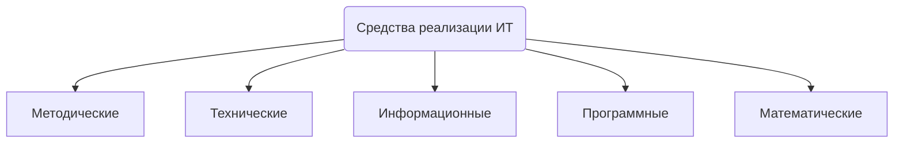

1) **Методические средства** определяют требования при разработке, внедрении и эксплуатации информационных технологий, обеспечивая их совместимость. При этом наиболее важными являются требования по стандартизации и унификации.
   *Стандартизация* предусматривает установление норм и правил с целью упорядочения деятельности в той или иной области. Применительно к информационным технологиям задачей стандартизации является создание системы нормативно-справочной документации, определяющей требования к разработке, внедрению и использованию всех компонентов информационных технологий. 
> Пример: стандартизация ISO (International Standards Organization) – органзиация выпуска стандартов, создавшая базовую эталонную модель взаимодействия открытых систем (OSI – Open System Interconnection).

2) **Технические средства** информационных технологий. Основой технического обеспечения информационных технологий являются вычислительная техника, средства телекоммуникаций, средства оргтехники. К средствам телекоммуникаций относятся средства связи, обеспечивающие передачу данных между удаленными друг от друга объектами.
3) **Информационные средства** обеспечивают эффективное представление предметной области. К ним относятся информационные модели, системы классификации и кодирования информации.
4) **Математические средства** включают в себя модели решения функциональных задач и модели организации информационных процессов. На этой основе разрабатываются алгоритмы, а затем и программы для реализации информационных технологий.
5) **Базовые программные средства** включают в себя операционные системы, языки программирования, программные среды, системы управления базами данных (СУБД).

# Классификация информационных процессов

**Информационный процесс** — процесс получения, создания, сбора, обработки, накопления, хранения, поиска, распространения и использования информации.

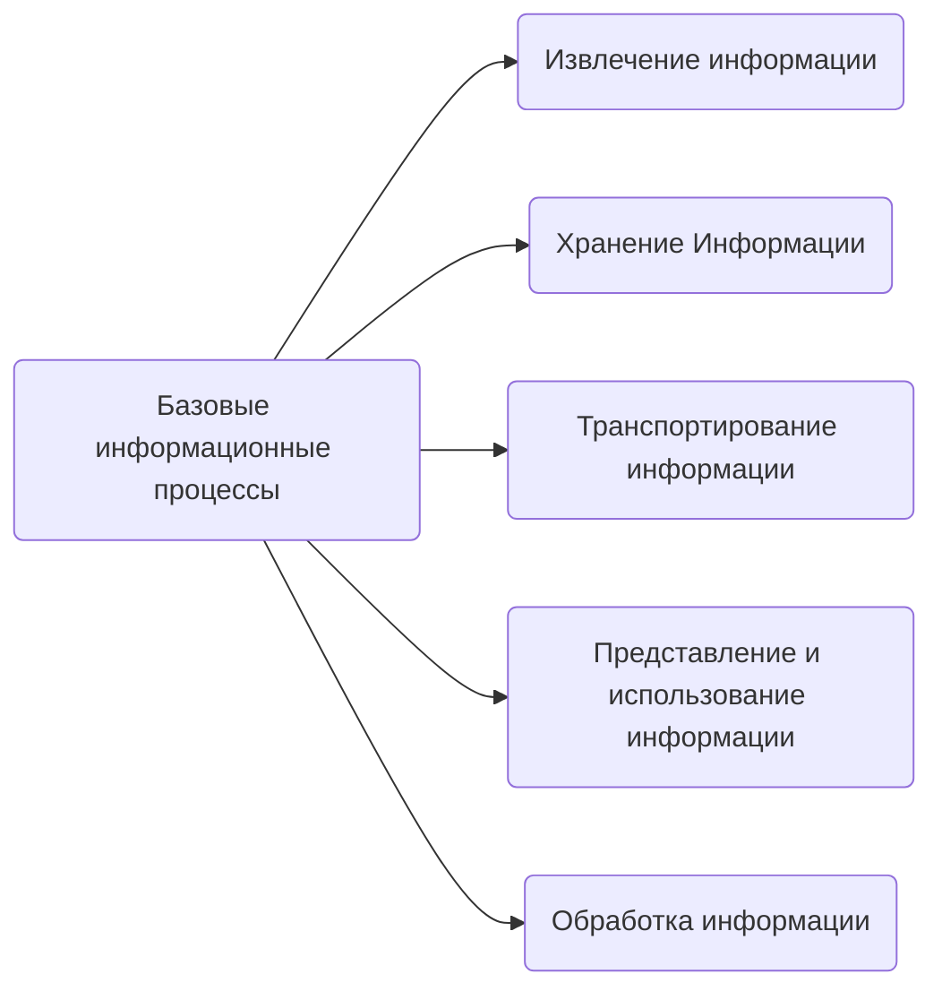

- **Извлечение информации** - переход от реального представления предметной области к его описанию в формальном виде и в виде данных, которые отражают это представление. Для извлечения (сбора) информации могут производиться конкретные действия над материальными объектами, такие как: измерение, подсчет, взвешивание и т.п. Полученная информация, как правило, регистрируется, т.е. фиксируется на материальном носителе.
  - классифицирование (распознавание), осуществляемое путем поиска критериев, по которым можно было бы отнести объект (события, процессы) к той или иной категории.
  - кластеризация, основанная на группировании объектов по каким-либо признакам.
  - выявление скрытых закономерностей по наборам данных.
  - прогнозирование событий и т.д.
- **Транспортирование информации** – осуществляется передача информации на расстояние. С этой целью используются инфокоммуникационные системы и сети. Для обеспечения совместимости сетей используются международные стандарты в области сетевого информационного обмена. 
- **Обработка информации** – этот процесс состоит в получении одних информационных объектов из других информационных объектов (путем выполнения некоторых алгоритмов, направленных на решение поставленных задач).
- **Процесс хранения информации** связан с необходимостью накопления и долговременного хранения данных, обеспечением их актуальности, целостности, безопасности и доступности. Для обеспечения этого процесса используются, в частности, базы данных и системы управления базами данных (СУБД).
- **Представление и использование информации** - процесс направлен на решение задачи доступа к информации в удобной для пользователя форме.

# Классификация базовых информационных технологий.
Примерами прикладных ИТ являются:
- Корпоративные ИТ
- ИТ в дизайне
- ИТ в медиаиндустрии
- ИТ в бизнесе

Можно выделить ряд базовых ИТ:
- **Мультимедиатехнологии** - объединение многокомпонентной информационной среды в однородном цифровом представлении. Основные компоненты: текст, графика, звук, видео., в совокупности интерфейс.
- **Геоинформационные технологии** - предназначены для широкого внедрения в практику методов и средств работы с пространственно-временными данными, представляемыми в виде системы электронных карт, и предметно-ориентированных сред обработки разнородной информации для различных категорий пользователей. Направлены на решение разл. задач науки и производства.
- **Технологии защиты информации** - защита информации от угроз. Угрозы бывают преднамеренные и случайные. Преднамеренные разделяют на пассивные и активные. 
  - **Пассивные угрозы** - несанкционированное использование информационных ресурсов (например, прослушка). 
  - **Активные** направлены на нарушение нормальной работы системы. Случайные угрозы связаны с отказами и нарушениями работоспособности программных и аппаратных средств. 
- **CASE-технологии** (Computer-Aided  Software Engineering)- технологии представляют собой набор инструментов и методов программной инженерии для проектирования программного обеспечения, который помогает обеспечить высокое качество программ, отсутствие ошибок и простоту в обслуживании программных продуктов.
  - средства анализа
  - средства проектирования баз данных
  - средства разработки приложений
  - средства реинжиниринга
  - средства планирования и управления проектом
  - средства конфигурационного управления
  - средства тестирования
  - средства документирования
- **Телекоммуникационные технологии** - Термин «телекоммуникация» обозначает дальнюю дистанционную связь и дистанционную передачу информации. Поэтому телекоммуникационные технологии подразумевают использование телекоммуникационных сетей, к которым относятся, в частности, телефонные, телевизионные, радиосети и т.д. Благодаря объединению компьютеров в сети появилась возможность совместного использования сетевых ресурсов. Часть компьютеров (серверы) владеет ресурсами, такими как, например, база данных, и предоставляет эти ресурсы для общего использования. Другие компьютеры (клиенты) используют сетевые ресурсы. Иногда один и тот же компьютер может одновременно играть роли и клиента, и сервера. *Клиент - сервер*.
- **Технологии ИИ** -  машинный перевод, информационный поиск, системы речевого общения и др. Важным компонентом интеллектуальной системы, с помощью которого осуществляется первая из перечисленных функций, является **база знаний**, в ней могут храниться знания различных типов.

# Информационная технология обработки данных. 

Информационная технология обработки данных предназначена для решения задач, по которым имеются необходимые входные данные и известны алгоритмы, а также стандартные процедуры их обработки. Такие задачи называются хорошо структурированными, или формализованными.

В управленческой деятельности данный вид технологии используется для автоматизации рутинных, постоянно повторяющихся операций с целью повышения производительности труда персонала. Эта технология подразумевает выполнение вычислительных процедур над данными, их группировку, сортировку, агрегирование (реализуется в форме расчетов итоговых или средних значений). В сфере управления она используется, например, для обработки данных над операциями, производимыми фирмой, и создания разного рода отчетов.
   

# Информационная технология управления.

Эта технология ориентирована на работу в среде информационной системы управления. Она направлена на создание различных видов отчетов. Ее целью является удовлетворение информационных потребностей сотрудников, имеющих дело с принятием решений.
>Например: регулярные и специальые отчеты

Использование отчётов для поддержки управления оказывается особенно эффективным при реализации управления по отклонениям. Оно предполагает, что главным содержанием получаемых управленцем данных должны являться отклонения состояния хозяйственной деятельности организации от запланированного состояния.

Для обеспечения своевременности принятия решений на уровне управленческого контроля информация должна быть представлена в агрегированном виде и в динамике (во времени), чтобы просматривались тенденции изменения данных. Кратко говоря, по графику.

**В этой технологии необходимо:**
+ оценить планируемое состояние объекта управления,
+ определить отклонения от планируемого состояния
+ выявить причины возникших отклонений
+ выявить причины возникших отклонений

  

# Информационная технология "Автоматизация офиса".

**Цель:** рациональная автоматизация управленческого труда и наилучшего обеспечения управленцев информацией.

**Основные компоненты**
|     Компьютерные      |  Некомпьютерные  |
| :-------------------: | :--------------: |
|      База данных      | Видеоконференции |
|         Word          |       Факс       |
|         Excel         |       ...        |
| Электронный календарь |                  |
|          ...          |                  |

Данный вид технологии направлен на организацию и поддержку информационных процессов как внутри организации, так и при  реализации взаимодействия с внешней средой с использованием  современных аппаратных  и  программных  средств. Последние  бывают  особенно востребованы в крупных компаниях, когда отдельные подразделения фирмы территориально удалены друг от друга.

> Примерами  программных  продуктов,  обеспечивающих автоматизацию  офисной деятельности, являются текстовый и табличный процессоры,  системы управления базами данных, электронная почта, электронный календарь и т. д. Кроме того, с целью автоматизации офисной  деятельности могут применяться и некомпьютерные средства, например, ксерокс,  факс,  технические  средства,  обеспечивающие  проведение  аудио– и  видеоконференций. Последние  бывают  особенно востребованы в крупных компаниях, когда отдельные подразделения фирмы территориально удалены друг от друга.

# Информационная технология поддержки принятия решения.

Эта технология предусматривает взаимодействие **человека** и **вычислительного звена**.

В роли объекта управления выступает **вычислительное звено**.

**Человек** как управляющее звено задает входные данные и оценивает полученный результат вычислений. Если результат его устраивает, решение принимается, если нет, то вводит в вычислительное звено измененные исходные данные. Этот процесс является итерационным и может быть завершен по воле человека.
> Пример: Решение задачи определения наиболее выгодной производственной программы выпуска нескольких видов продукции при заданных ограничениях на ресурсы.

К особенностям данной технологии следует отнести ее ориентацию на решение слабо структурированных задач, а также широкое использование *математических моделей*, предназначенных для описания и оптимизации некоторого объекта или процесса.

  

Состоят такие ИТ из баз данных и моделей.
**Модели**, базируясь на математической интерпретации проблемы, при помощи определённых алгоритмов способствуют нахождению информации, полезной для принятия правильных решений.
>Пример: модель линейного программирования даёт возможность определить наиболее выгодную производственную программу выпуска нескольких видов продукции при заданных ограничениях на ресурсы.

---

Типы моделей:
- Стратегические
- Тактические
- Оперативные
- Математические
  
## Стратегические
используются на высших уровнях управления для установления целей организации, объемов ресурсов, необходимых для их достижения, а также политики приобретения и использования этих ресурсов. Для стратегических моделей характерны значительная широта охвата, множество переменных, представление данных в сжатой агрегированной форме. Горизонт планирования в стратегических моделях, как правило, измеряется в годах.

## Тактические
применяются управляющими среднего уровня для распределения и контроля использования имеющихся ресурсов. Среди возможных сфер их использования следует указать: финансовое планирование, планирование увеличения продаж и т.д. Временной горизонт, охватываемый тактическими моделями, ≈ от одного месяца до двух лет. 

## Оперативные модели
Используются на низших уровнях управления для поддержки принятия оперативных решений
с горизонтом, измеряемым днями и неделями. Возможные применения этих моделей включают в себя календарное
производственное планирование, управление запасами и т.д.

## Математические модели 
Cостоят из совокупности модельных блоков, модулей и процедур, реализующих
математические методы. Сюда могут входить процедуры линейного программирования, статистического анализа
временных рядов, регрессионного анализа и т.п.
Модели можно классифицировать по:
1) Цели
   - оптимизационные (поиск максимума чего-то)
   - описательные ( описывают поведение системы )
2) По способу оценки:
   - детерминистские (при конкретных значениях исходных данных)
   - стохастические (если исходные данные заданы вероятностными характеристиками)
3) По области возможных приложений:
   - специализированные (для использования только одной системы, они более точные, но и более дорогие)
   - универсальные
  
# Информационная технология экспертных систем

**Главная идея использования** технологии экспертных систем заключается в том, чтобы получить от эксперта его знания и, загрузив их в память компьютера, использовать всякий раз, когда в этом возникнет необходимость. 

Экспертные системы основаны на использовании **искусственного интеллекта**. Экспертные системы представляют собой компьютерные программы, трансформирующие опыт экспертов в какойлибо области знаний в форму **эвристических правил**.

## Структура

ИТ экспертной системы состоит из:
1. **База знаний** - содержит факты, описывающие проблемнюу область, а также логическую взаимосвязь этих фактов. Центральное место в базе знаний - **правило**. Правило описывают, что делать в конкретной ситуации, и состоит из двух частей: 
   1. Условие
   2. Действие
  
   Используемые в система правила образуют **систему правил**. 
2. **Интерпретатор** - часть системы, произволяющая в определенном порядке обработку знаний, находящихся в базе знаний.
3. **Модуль создания системы** - служит для создания набора правил. Существует два подхода в основу модуля создания системы:
   1) Использование алгоритмических языков программирования (Lisp, Prolog и тд) 
   2) Использование оболочек экспертных систем (готовую программную среду, которая может быть приспособлена к решению определенной проблемы путем создания соответствующей базы знаний. В большинстве случаев использование оболочек позволяет создавать экспертные системы быстрее и легче в сравнении с программированием.)

#	Производительность компьютера и влияющие на нее факторы

Производительность компьютера обычно измеряется во FLOPS`ах (количество операций с плавающей точкой в секунду).
> FLOPS — FLoating-point Operations Per Second

Cреднестатистический  современный  настольный  компьютер  имеет производительность порядка 0.1 терафлопса. К суперкомпьютерам в настоящее время принято причислять системы с вычислительной мощностью  более  10  терафлопсов.  На  сегодняшний  день достигнута  производительность  компьютерной  системы,  превышающая  33,8  петафлопсов. Использование  суперкомпьютеров считают одним из важных показателей технологической вооружённости

Производительность компьютера зависит от многих факторов, но в наибольшей степени определяется характеристиками процессора: тактовой частотой, объемом кэш-памяти, разрядностью и т.д. Важную роль играют многоядерность и многопоточность.

## Процессор

На протяжении многих лет основным способом повышения производительности было постоянное увеличение тактовой частоты. Тактовая частота характеризует кол-во вычислений, которые процессор может выполнить за одну секунду. Но даже при одинаковой тактовой частоте производительность компьютера может отличаться.

Большинство современных процессоров имеют тактовую частоту от 900 до 4700 МГц. Однако с увеличением частоты начинает  нелинейно возрастать тепловыделение, что следует принимать во внимание. Поэтому дальнейшие усилия по увеличению производительности компьютера были направлены, в частности, по пути  параллельных вычислений и на разработку многоядерных процессоров. Сегодня уже подавляющее большинство современных компьютеров используют многоядерные процессоры. В многоядерных системах потоки могут выполняться одновременно, при этом каждое ядро будет обрабатывать отдельный поток.

## Кеш-память

**Кеш** - промежуточный буфер с быстрым доступом к нему, содержащий информацию, которая может быть запрошена с наибольшей вероятностью. Он располагается непосредственно на ядре и служит  для повышения производительности, так как в нём данные обрабатываются со значительно большей скоростью, чем в случае с оперативной памятью. 

Кэш-память подразделяется на несколько уровней:
-	**Кэш-память первого уровня (L1)** – это блок высокоскоростной памяти,  расположенный  прямо  на ядре  процессора.  Объем  кэш-памяти первого уровня составляет от 8 до 128 Кб. В него копируются данные, извлеченные из оперативной памяти. Сохранение основных  команд позволяет повысить производительность процессора за счет  более высокой скорости обработки данных. Для многоядерных моделей указывается объем кэш-памяти первого уровня для одного ядра.
- **Кэш-память второго уровня (L2)** – это блок высокоскоростной памяти, выполняющий те же функции, что и кэш L1, однако имеющий более низкую скорость и больший объем. Объем кэш-памяти  второго уровня (L2) составляет от 128 до 16384 Кб. Если процессор  требуется для выполнения ресурсоемких задач, то модель с большим объемом кэша L2 оказывается более предпочтительной. Для многоядерных  процессоров  указывается  суммарный  объем  кэш-памяти второго уровня.
- **Кэш-память третьего уровня (L3):** обьем  составляет  от 0 до 46080 Кб. Интегрированная кэш-память L3 в сочетании с быстрой системной шиной формирует высокоскоростной канал  обмена данными с системной памятью. Как правило, кэш-памятью  третьего уровня комплектуются только топовые процессоры и серверные решения.

# Разновидности внешней памяти персонального компьютера

## Накопители на жестких магнитных дисках (HDD) (НЖМД)

  

Винчестер содержит несколько магнитных дисков.
Плотность записи накопителей на жестких дисках (HDD) определяется размером и конструкцией головок чтения/записи.

Магниторезистивный эффект используется только для построения головки чтения. Для записи используются другие головки.

**Принцип работы головки**: 
В составе магниторезистивной головки чтения имеется добавочная обмотка, в которой создается постоянный измерительный ток. В момент, когда головка проходит над зоной намагниченности, сопротивление этой обмотки изменяется, а соответственно изменяется падение напряжения на ней. Это и происходит при считывании данных – реактивное сопротивление такой головки оказывается различным при прохождении над участками с различными значениями остаточной намагниченности. Таким образом, магниторезистивная головка представляет собой резистивный датчик магнитного поля.

## Флеш-память

Принцип работы флеш-памяти основан на изменении и регистрации электрического заряда в изолированной области («карман») полупроводниковой структуры.

  
USB-флеш-накопитель. На переднем плане видна микросхема NAND-флеш-памяти, на заднем — её контроллер.

**Плюсы:** компактность, дешивизна, механическая прочность, устойчивость к внешним воздействиям, большой объём (128 Гб), высокая скорость работы, низкое энергопотребление, информация может многократно обновляться: чтение - любое кол-во раз, запись примерно 100 тысяч раз.

**Минусы:** ограниченный ресурс носителей, а также чувствительность к электростатическому разряду

## Твёрдотельные накопители (SSD)
По сравнению с традиционными жёсткими дисками твердотельные накопители имеют меньший размер и вес, являются бесшумными, а также многократно более устойчивы к повреждениям (например, при падении) и имеют гораздо бóльшую скорость производимых операций. В то же время, они имеют в несколько раз бóльшую стоимость в пересчёте на гигабайт и меньшую износостойкость (ресурс записи).

Хранение информации основано на флеш-памяти.

Минимальный размер доступной для чтения информации, одна ячейка. Процесс чтения очень быстр, так как твердотельные накопители всегда лучше читают, чем пишут. По этой причине жесткий диск SSD прилично ускорит загрузку операционной системы и запуск приложений, так как в этом случае большинство происходящих операций - чтение.

Процесс записи отличается от процесса чтения. Минимальный размер доступной информации аналогичен процессу чтения. Если ячейка пуста, запись идет напрямую. Если ячейка уже содержит информацию и требуется перезапись, ячейка сначала очищается. Проблема в том, что очищение производится на уровне блоков, а не ячеек.

## Оптические запоминающие устройства

Оптическими запоминающими устройствами, или оптическими накопителями, называются устройства, в которых запись данных на носитель и считывание с него осуществляются с помощью лазера, генерирующего монохроматические электромагнитные колебания оптического диапазона в виде узконаправленного пучка света.

Носителями данных ЗУ служат оптические компакт-диски (Compact Disks – CD)

При считывании информации с оптических дисков луч лазера, установленного в дисководе, падает на поверхность вращающегося диска и отражается. Так как поверхность оптического диска имеет участки с различными коэффициентами отражения, то отраженный луч также меняет свою интенсивность (логические 0 или 1).

# Основные характеристики HDD

1) Быстродействие
   - Среднее время поиска (мс) - среднестатистическое время для перемещения головки из текущего положения в новое,требуемое для считывания очередной порции информации.
   - Скорость передачи данных (Мб/с), которая, в свою очередь зависит, от:
     - типа интерфейса
     - скорости вращения шпинделя (например, 7200 оборотов в минуту)
     - от плотности записи данных
2) Емкость накопителя
3) Объем кэш-памяти
   Кэш-память является промежуточным звеном хранения информации. Она обеспечивает временное сохранение данных, чтобы при следующем обращении жесткий диск смог моментально получить их. Необходимость в такой технологии возникает потому, что скорость чтения и записи обычно отличается и возникает задержка. У моделей размером 3.5 дюймов объем кэш-памяти составляет от 8 до 128 мегабайт.
4) Время безотказной работы В среднем оно должен быть равен одному миллиону часов и более.
5) Потребление энергии
6) Уровень шума (Тихими накопителями считаются устройства с уровнем шума около 26 дБ и ниже)
7) Форм-фактор

Интерфейс для HDD: в основном SATA.

# RAID-массивы. Архитектуры их построения.

**Идея:** несколько дисков, объединенных вместе, могут не только увеличить объем накопителя, но и
повысить надежность хранения информации, а также скорость передачи данных. Предназначен для повышения надёжности хранения данных и/или для повышения скорости чтения/записи
информации.

**RAID** – это массив из нескольких дисков, управляемых контроллером, взаимосвязанных скоростными
каналами и воспринимаемых внешней системой как единое целое. В зависимости от типа используемого
массива может обеспечивать различные степени отказоустойчивости и быстродействи

## **RAID 0**. Дисковый массив с чередованием без отказоустойчивости

  

Данные разбиваются на блоки (размер блока можно задавать при создании массива) и
затем записываются на отдельные диски.

Также этот режим называется «чередование», поскольку при записи блоков данных
чередуются диски, на которые осуществляется запись. Соответственно, читаются блоки
тоже поочерёдно. Таким образом, происходит параллельное выполнение операций
ввода/вывода, что приводит к большей производительности. 

Основным плюсом данного режима является высокая скорость передачи данных. В этом
режиме избыточности нет. Если один из дисков выходит из строя, то, очевидно, теряется
вся информация.

**Достоинство** – скорость считывания файлов увеличивается в n раз, где n — количество дисков. Однако, такая оптимальная
производительность достигается только для больших запросов, когда фрагменты файла находятся на каждом из дисков. 

**Недостаток** – увеличивается вероятность потери данных: если вероятность отказа одного диска равна p, то вероятность
выхода из строя массива RAID 0 из двух дисков практически в два раза больше. 

## **RAID 1**. Зеркало

  

Технология, позволяющая повысить надежность системы. В RAID массиве с зеркальным дублированием данных все данные одновременно пишутся не на один, а на два жестких диска. То есть создается «зеркало» данных. При выходе из строя одного из дисков вся информация остается сохраненной на втором. Это
достоинство.

## **RAID 3**. Отказоустойчивый массив с битовым чередованием и чётностью

В массиве RAID 3 из 
*n* дисков данные разбиваются на куски размером меньше сектора (разбиваются на байты) и распределяются по *n* - 1 дискам.

Eщё один диск используется для хранения блоков чётности. В RAID 2 для этой цели применялось = log(n) дисков, но большая часть информации на контрольных дисках использовалась для коррекции ошибок «на лету», в то же время большинство пользователей устраивает простое восстановление информации в случае её повреждения (с применением операции XOR), для чего хватает данных, умещающихся на одном выделенном жёстком диске.

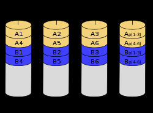  

**Достоинства:**
- возможность работы массива при отказе одного из дисков
-	высокая скорость чтения и записи данных 

**Недостатки:**
-	низкая скорость при работе с мелкими файлами и множеством запросов.
-	невозможность производить параллельные операции записи, так как для хранения информации о чётности используется отдельный контрольный диск.
-	большая нагрузка на контрольный диск, и, как следствие, его надёжность сильно падает по сравнению с дисками, хранящими данные.

## **RAID 5**. Дисковый массив с чередованием и распределённой чётностью

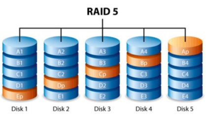  

Он является наиболее распространенным в системах хранения данных. Характеризуется применением чередования и четности. Блоки данных и контрольные суммы циклически записываются на все диски массива. Если в массиве выходит из строя один диск, то массив остаётся работоспособным.

**Достоинства:** высокие скорости чтения и записи данных, как при больших объёмах, так и при большом числе запросов, экономичность.

**Недостатки:** невысокая производительность и сложное восстановление данных. При выходе из строя одного диска надёжность сразу снижается до уровня RAID 0. Для возвращения массива к нормальной работе требуется длительный процесс восстановления.

# Умные таблицы. Технологии построения дашборда.

**Умная таблица** - диапазон ячеек в Excel, отформатированных как таблица.

**Dashbord**(«аналитическая панель») - cхема, таблица или график (или все вместе), показывающий аналитические данные, добытые из разных источников, но связанные между собой. Обычно эти данные подаются в виде интерактивного цифрового поля и используются в бизнес-среде.

**Преимущества дашборда**:
- Отображение необходимых показателей в едином окне без необходимости перемещаться от одного интерфейса к другому. Все, что интересует пользователей дашборда, можно разместить на одном поле без необходимости переключать слайды и менять графики.
- Интерактивность. Возможность корректировать визуализацию и показатели в соответствии с задачами пользователя. Например, показывать данные о здоровье людей за выбранный период времени или информацию о продаже товара на конкретной территории.
- Возможность в ходе первичного анализа данных сопоставлять их друг с другом и сравнивать.
- Идентификация проблем, которые могли бы оставаться вне поля зрения руководства.

**Типы отчетов**:
- **Оперативные** – визуализируют постоянно меняющуюся информацию. Такие отчеты не отличить от интерактивных. Они постоянно показывают актуальные данные, зачастую предлагают взаимодействие с ними. Что-то в духе радара, помогающего не упускать из виду критически важные аспекты работы.
- **Стратегические** – помогает получить информацию на определенном этапе развития бизнеса или его работы. Такой отчет дает возможность оценить прогресс. Понять, какая работа уже была сделана, а какую предстоит сделать. Главная задача этого типа отчетов – дать владельцам бизнеса возможность скорректировать стратегию для повышения прибыли.
- **Аналитические** – демонстрирует большой объем аналитических данных и статистики, необходимой для оценки эффективности действующего бизнеса в целом. Такие показатели не оказывают какого-то моментального влияния на ситуацию, но помогают уловить определенные тренды в долгосрочной перспективе.

**Советы по построению**:
- Группировать информацию. Делить на категории схожие данные и демонстрировать их в определенном участке визуализации.
- Агрегировать полученные данные. Собирать полученные значения в какие-то общие суммы, помогающие сделать выводы без дополнительных расчетов, анализа и длительного изучения цифр, представленных в сводке.
- Сортировать показатели и значения из аналитики, чтобы реципиентам было проще ориентироваться в представленных данных.
- Фильтровать информацию, чтобы можно было исключить из визуальной презентации часть показателей. Это помогает сосредоточиться на значениях, которые показались наблюдателям более значимыми в определенный момент времени.
- Производить необходимые вычисления и получить новый тип данных, если он понадобится. Например, вычислять возраст человека по дате рождения в соответствии с текущей датой.
- Работать с такими сущностями, как таблицы, схемы, инфографики, диаграммы, карты и т.п.

  

  

  

# Топология компьютерных сетей
**Топология вычислительной сети** - это конфигурация графа, вершинам которого соответствуют компьютерные сети (или другое оборудование, например, концентраторы), а ребрам - физические связи между ними

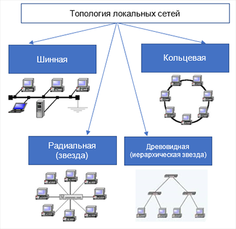  

## Полносвязная
Полносвязная топология (каждый с каждым) Каждый комп связан со всеми остальными.
- каждый компьютер должен иметь много коммуникационных портов для связи с остальными компьютерами сети.
-	для каждой пары компьютеров должна быть выделена отдельная электрическая линия связи.

Остальные разновидности топологий **неполносвязны**, т.е. для обмена данными между двумя компьютерами сети может потребоваться передача данных через другие узлы.

## Общая шина
Компьютеры подключаются к одной линии связи. Информация распространяется в обе стороны.

**Плюсы**:
- низкая стоимость и простота разводки кабеля по помещениям;
- унификация подключения различных модулей;
- почти мгновенное обращение ко всем станциям сети;

**Минусы**:
- Низкая надёжность (любой дефект кабеля или одного из разъемов полностью парализует сеть;

## Звезда
Каждый компьютер подключается отдельным кабелем к общему устройству - коммутатору (концентратору), который находится в центре сети. Центральный узел информацию, передаваемую от некоторого компьютера, одному либо всем остальным компьютерам сети.

**Плюсы**:
- большая надежность
- повреждение передающего кабеля или поломка одного элемента (кроме центрального) не снижает работоспособность сети
- высокая скорость и большой объём обмена данными
- широкие возможности для расширения, достаточно смонтировать новый кабель или настроить доступ на коммутаторе
- простая диагностика и ремонт
- легкий монтаж и сопровождение

**Минусы**:
- дополнительные затраты
- поломка коммутатора приводит к неработоспособности всего оборудования
- число подключаемых устройств и объём передаваемой информации зависит от его характеристик (ограниченность наращивания количества узлов в сети количеством портов коммутатора)

## Топология дерево (иерархическая звезда)
Это комбинация нескольких звёзд, предусматривающая прямое соединение коммутаторов.

## Кольцевая топология
Данные передаются от одного компьютера к другому по кольцу в одном направлении. Если компьютер распознаёт данные как “свои”, он копирует их себе в буфер.

**Плюсы**: возможность контролировать процесс доставки адресату, так как новые данные, сделав полный оборот, возвращаются к узлу-источнику. Это свойство кольца используется для тестирования связности сети и поиска некорректно работающего узла.

**Минусы**: необходимость спец.мер, чтобы в случае выхода из строя какой-либо станции, не нарушалась связь между остальными компьютерами.

## Ячеистая топология
Непосредственно связаны только те компьютеры, между которыми происходит интенсивный обмен данными. Остальные компьютеры обмениваются данными через промежуточные узлы.

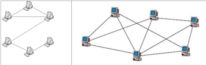  

## Пересекающиеся кольца
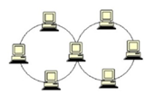  

# Методы доступа к среде связи в информационных системах
При использовании общей линии связи несколькими абонентами (источниками сообщений) возникает проблема доступа к ней. Если все устройства в сети будут передавать информацию по мере готовности данных без всяких правил получения доступа к каналу связи, то эти передачи могут накладываться во времени, при этом происходят коллизии, приводящие к потере данных *(Collision – столкновение)*. Для решения этой проблемы разработано большое количество методов, определяющих правила доступа к разделяемой среде передачи данных.

**Метод доступа** – это способ определения того, какая из рабочих станций сети может использовать ресурсы сети. Метод доступа существенно зависит от топологии локальной сети.

Классификация **методов доступа**:

1. По используемому **принципу управления**:
  - **централизованные** – все управление доступом сосредоточено в одном узле сети. Центральный узел всегда имеет возможность предоставить право на передачу только одному абоненту, поэтому отсутствие конфликтов является достоинством этих методов. Однако при централизованном управлении невозможно оперативно реагировать на все события в сети, следовательно, возможны частые отказы в доступе

  - **децентрализованные** - центр управления отсутствует и управление доступом полностью предоставлено абонентам сети, т.е. каждый узел самостоятельно обнаруживает и предотвращает все возможные конфликты. Достоинства этих методов – высокая устойчивость к отказам и большая гибкость.

2. По **конфликтности**:
   - **Конфликтные(созтязательные)**  (CSMA/CA , CSMA/CD) - предпологают колизиии.
     > Если прослушивающая станция обнаруживает передачу сигнала (от другой станции), то она воздерживается от передачи информации и будет пытаться повторить ее позже. Признаком незанятости канала является отсутствие в нем сигнала несущей частоты (обычно 5-10 МГц). Эти протоколы называются протоколами множественного доступа с контролем (опознаванием) несущей (Carrier Sense Multiple Access, CSMA). 
   - **Неконфликтные** (Селективные, на резервировании времени)

3. По группе **методов**:
   - **Селективные методы**, при которых передча начинается после получение соответсвующего разрешения:
     - **Метод циклического опроса** - центральное устройство по очереди опрашивает все остальные устройства (вторичные) в некотором предопределенном порядке, чтобы узнать, имеют ли они информацию для передачи. Чтобы получить данные от вторичного устройства, первичное устройство направляет ему соответствующий запрос, а затем получает данные от вторичного устройства и направляет их устройству-получателю. Затем первичное устройство опрашивает другое вторичное устройство, принимает данные от него, и так далее. Протокол ограничивает количество данных, которое может передать после опроса каждое вторичное устройство.
     - **Метод с передачек маркера**, когда разрешение передается от станции к станции. 
       > **Маркер** — это специальное сообщение, которое передает временное управление средой передачи устройству, владеющему маркером. Передача маркера распределяет управление доступом между устройствами сети. Каждое устройство знает, от какого устройства оно получает маркер и какому устройству должно его передать
     
       > Все узлы играют активную роль, участвуя в усилении, анализе модификации и ретрансляции приходящих сигналов.В данном методе маркер не имеет адреса, он снабжается полем занятости, в котором записывается код, обозначающий свободен или занят маркер.
       >
       > Свободный маркер означает, что канал свободен и любая станция можетего использовать. Если ни один из узлов не имеет данных для передачи, свободный маркер циркулирует по кольцу (обычно против часовой стрелки)
       >
       >Если станция имеет данные для передачи, то, получив свободный маркер, она меняет его состояние на «занятый» ипередает дальше по кольцу с добавленным кадром. Занятый маркер с кадром совершает полный оборот по кольцу и возвращается к станции-отправителю. По пути станция-получатель снимает копию с кадра
   - **На резервировании времени** - Рабочая станция осуществляет передачу только в течение зарезервированных для нее временных интервалов (слотов).
   - **На принципе соперничества** - когда каждая станция перед началом передачи пытается получить доступ к линии связи. Эту группу составляют методы состязаний:
     - с прослушиванием линии связи до передачи
     - прослушиванием до передачи и во время передачи и ряд других

# Классификация компьютерных сетей

Можно выделить такие признаки, как:
1. Территориальный признак
2. Среда передачи данных
3. Первичность
4. Тип пользователей
5. Функциональная роль
6. Роль клиента
7. По способу комутации   

### Классификация по **территориальному признаку**

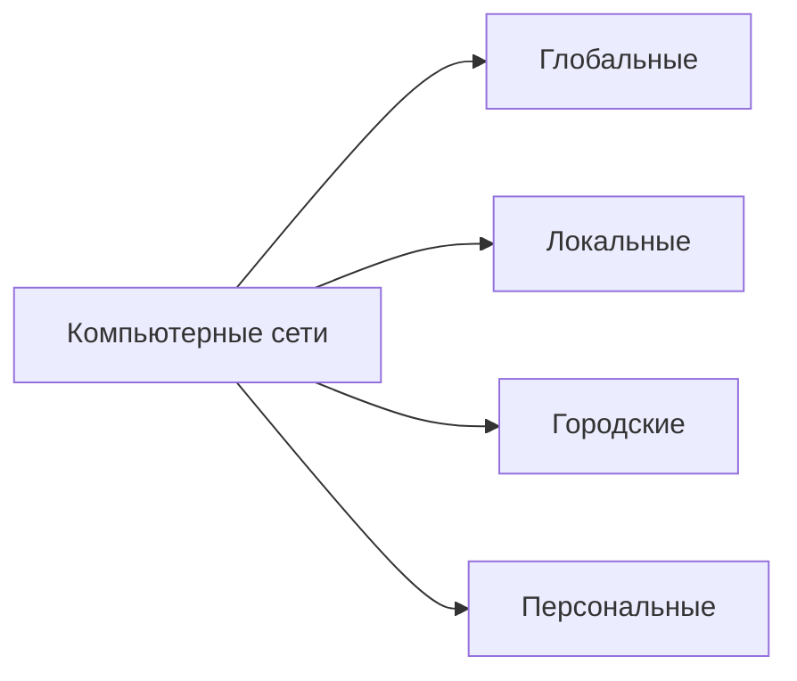
- **Глобальные сети** (WAN – Wide Area Networks), объединяющие компьютеры, рассредоточенные на расстоянии
сотен и тысяч километров;
- **Городские сети** (MAN - Metropolitan Area Networks) занимают промежуточное положение между локальными и
глобальными сетями;
- **Локальные сети** (LAN - Local Area Networks), они сосредоточены на территории не больше 1–2 км; 
- **Персональные сети** (Personal Area Network - PAN), предназначенные для взаимодействия различных устройств,
принадлежащих одному владельцу.

### Классификация по **среде передачи данных**
- **Проводные**. В каналах связи которых используются различного типа кабели (коаксиальный кабель, витая пара, волоконно-оптический) или провода;
- **Беспроводные**. В них передача информации осуществляется с использованием электромагнитных волн
различных частотных диапазонов.

   В беспроводных сетях для передачи информации могут быть использованы диапазон радиоволн (до 300 ГГц),  микроволновый (300 МГц - 300 ГГц, т.е. он относится к радиодиапазону, но выделяется в отдельный класс систем, объединяющий спутниковую связь, радиорелейные линии связи и др.), инфракрасный и системы видимого света. 

### Класификация по **признаку первичности**

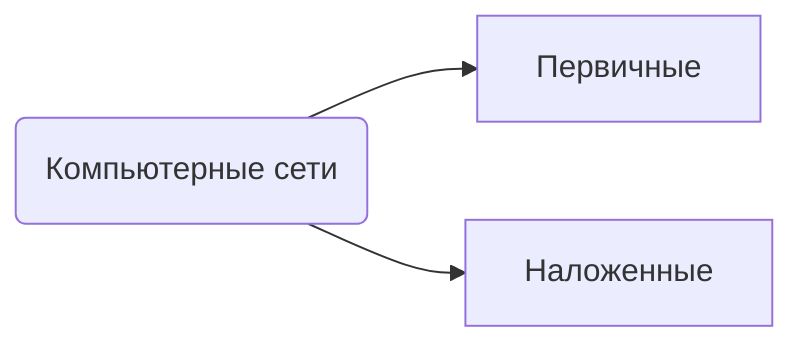
- **Первичные сети** предназначены для создания постоянных физических каналов для других сетей, и потому
являются вспомогательными; они включают в свой состав и необходимое коммуникационное оборудование.
- **Наложенные сети** предоставляют услуги конечным пользователям. Они строятся на основе первичных сетей, как
бы «накладываются» поверх них и именно поэтому называются наложенными. Например, телефонные, телевизионные и
компьютерные сети можно отнести к наложенным.

### Классификация по признаку **типу пользователей**

- **Сети операторов связи** предоставляют телекоммуникационные услуги (телефония, электронная почта, webхостинг, IP-телефония и др.) любому индивидуальному пользователю либо организации на основе заключения соответствующего коммерческого договора;
- **Корпоративные сети** предоставляют услуги только сотрудникам предприятия, владеющего данной сетью. Особенностью корпоративной сети (Интранет) является то, что она объединяет локальные сети отделений и предприятий, принадлежащих одной корпорации (организации). Корпоративная сеть использует протоколы TCP/IP Интернета. В настоящее время наблюдается бурное развитие этого типа сетей, поскольку они являются основой функционирования ИС предприятий.

### Классификация **функциональной роли в составной сети**

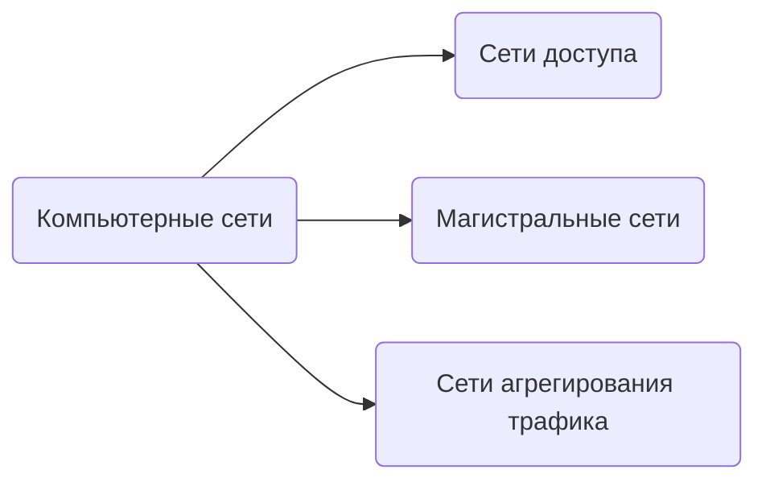
- **Cети доступа** предоставляют доступ абонентам от их помещений до пункта присутствия оператора связи;
- **Магистральные сети** представляют собой наиболее скоростную часть глобальной сети, объединяющей сети доступа(Магистральные территориальные сети должны обеспечивать высокую пропускную способность, так как на
магистрали объединяются потоки большого количества подсетей. Кроме того, магистральные сети должны
быть постоянно доступны, то есть обеспечивать очень высокий коэффициентом готовности, так как по ним
передается трафик многих критически важных для успешной работы предприятия приложени).
- **Сети агрегирования трафика** предназначены для агрегирования данных от многочисленных сетей доступа для
компактной передачи их по небольшому числу каналов связи в магистраль. Их обычно используют в крупных глобальных
сетях, где они помогают магистральной сети обрабатывать трафик, поступающий от большого количества сетей доступа.

<!-- Это надо дописать, я с другого конспекта списал не вчитываясь -->
### Классификация по **способу коммутации**

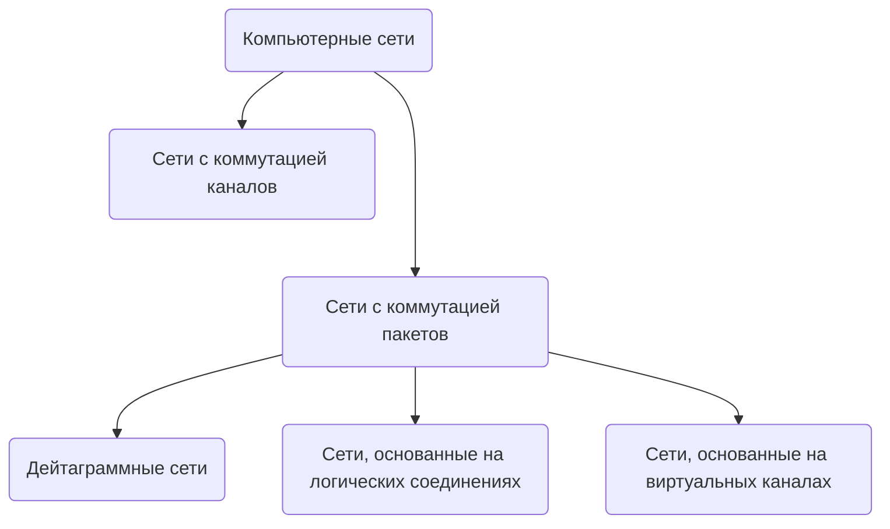

- **Сети с коммутацией каналов** - образование непрерывного составного канала из последовательно соединенных отдельных канальных участков для прямой передачи данных между узлами.
-	**Сети с коммутацией пакетов**, которые, в свою очередь, делятся на дейтаграммные сети, на сети, основанные на логических соединениях и сети, основанные на виртуальных каналах.
   > **Дейтаграммные** - аналогия почта и почтовый ящик.
   >
   > **Логических соединения** - если известна топология. (IP)
   >
   > **Виртуальные каналы** - канал связи в сети коммутации пакетов, соединяющий двух и более абонентов, и состоящий из последовательных физических звеньев системы передачи между узлами связи (коммутаторами)

### Классификация по **распределению ролей между компьютерами**

- **Одноранговые** - все компьютеры равноправые, и каждый может выступать как *сервером*, так и *клиентом*.
- **Клиент-серверные** - выделяется один или несколько компьютеров, называем серверами, задача которых обработка других компьютеров - клиентов.

# Требования, предъявляемые к информационным сетям

Тремя наиболее важными характеристиками являются:
- Производительность
- Надежность
- Безопасность

Эти характеристики включены в понятие *"качество обслуживания» информационных сетей (QoS – Quality of Service)"*

**QoS (Quality of Service)** рассматривается как "суммарный эффект рабочих характеристик обслуживания, который определяет степень удовлетворенности пользователя этой службой".
- *Задача* - обеспечить заданное качество обслуживания.
- *Условие* - заданное качество обслуживания должны поддерживать все сетевые устройства на всем сквозном соединении.

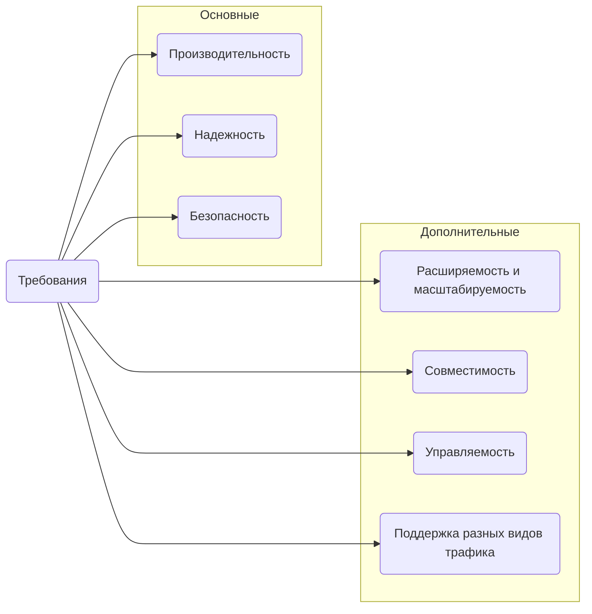
## Производительность

**Производительность сети** зависит от *быстродействия* всех её компонентов, участвующих в передаче и обработке информации.

Основные характеристики производительности:
- **Время реакции** - это интервал времени между отправкой запроса пользователя к какой-либо сетевой службе и получением ответа на этот запрос. Время реакции можно описать соотношением на картинке: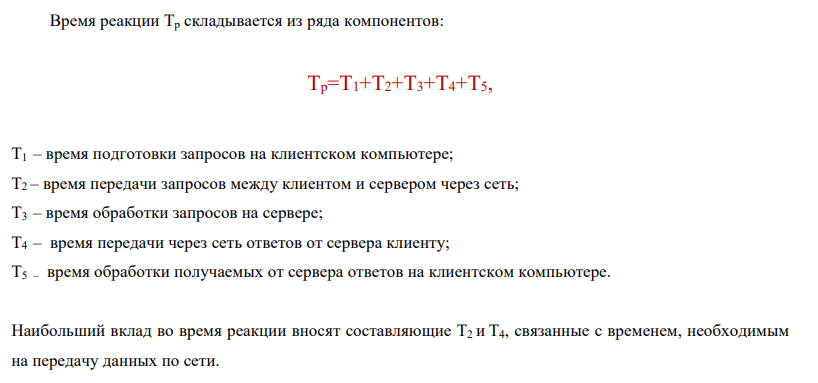  
- **Скорость передачи данных** измеряется на каком-либо промежутке времени как частное от деления объема переданных данных за этот промежуток времени на длительность этого промежутка. Если измерение производится за достаточно длительный интервал времени (час, сутки), то получаемые данные характеризуют среднюю скорость передачи.
  - **Мгновенная скорость** - скорость передачи на маленьком промежутке времени
  - **Максимальная скорость (пропускная)** - максимальная скорость передачи данных за время наблюдения. 
  - **Задержка передчи данных** - это время между моментом поступлением данных на вход какого-то сетевого устройства и моментом появления этих данных на выходе. 
   Участки с низкой скоростью передачи данных - **узкие места**.

Характеристики производительности сети (например, задержка пакета) являются случайными величинами. Поэтому при оценке характеристик производительности должны использоваться **статистические методы** ( медиана, СКО, плотность распредления, гистограмма).

## Надежность
Информационная сеть является сложной системой, состоящей из многих компонентов, причем выход одного из них может не привести к полной потере работоспособности всей сети. Для оценки надежности такого рода сложных систем могут быть использованы такие характеристики, как *доступность* и *отказоустойчивость*.

- **Доступность** - доля времени, в течение которого система находится в работоспособном состоянии. Она измеряется на большом промежутке времени, например, месяц или год. К примеру, если доступность равна 0,99999, то это соответствует 5 минутам простоя в год.
- **Отказоустойчивость** - свойство технической системы сохранять свою работоспособность после отказа одной или нескольких её составных частей. Отказоустойчивость определяется количеством единичных отказов составных элементов системы, после наступления которых сохраняется работоспособность системы в целом. 
> Кластер — группа серверов, объединенных каналами связи.
> Отказоустойчивый кластер – кластер, отказ сервера в
котором не приводит к полной неработоспособности
всего кластера.

## Безопасность

Под информационной безопасностью понимают состояние защищенности информационной системы. Информационная система является защищенной, если обеспечены ее *конфиденциальность*, *доступность* и *целостность*.

- **Конфиденциальность** подразумевает доступность секретных данных только тем пользователям, которым этот доступ разрешен.
- **Доступность** – это гарантия того, что авторизованные пользователи всегда получат доступ к данным. Свойство доступности устройства означает его готовность работать всякий раз, когда в этом возникает необходимость.
- **Целостностью** - сохранность данными правильных значений. По отношению к устройству целостность может быть определена как неизменность параметров этого устройства.

---

## Расширяемость и масштабируемость

- **Расширяемость** характеризует возможность сравнительно простого добавления в информационную сеть новых элементов (пользователей, компьютеров, приложений, служб), наращивания длины сегментов кабелей и замены существующей аппаратуры более мощной.
- **Масштабируемость** означает, что сеть позволяет наращивать количество узлов и протяженность связей в очень широких пределах без снижения производительности сети. Чтобы сделать сеть масштабируемой, необходимо применять дополнительное оборудование и специальным образом
структурировать сеть. 
  > Ярким примером хорошо масштабируемой сети является Интернет.

## Совместимость

**Совместимость или интегрируемость**, сети означает, что информационная сеть способна включать в себя разнообразное программное и аппаратное обеспечение (например, это могут быть различные
операционные системы, поддерживающие разные стеки коммуникационных протоколов, а также
аппаратные средства от разных производителей). Такие сети называются неоднородными, или гетерогенными.

*Основной путь обеспечения совместимости* – это использование открытых стандартов и спецификаций.

## Управляемость

**Управляемость** - возможность централизованно
контролировать состояние основных элементов сети, выявлять и устранять проблемы, возникающие в сети, анализировать производительность и планировать развитие сети.Управляемость может быть обеспечена с помощью автоматизированных средств администрирования информационной сети, выполняющих наблюдение и контроль за каждым элементом сети. Система администрирования при обнаружении проблемы должна исправлять ситуацию, сообщать администратору о случившемся и накапливать данные, на основании которых можно планировать развитие
информационной сети.

## Поддержка разных видов трафика

В последние годы наблюдается тенденция сближения компьютерных и телекоммуникационных сетей различных видов. Это привело к интеграции разнородных сетей в единую мультисервисную сеть, предназначенную для приема и передачи данных, звука, графических изображений, видео и т.д.

В общем существует 2 вида трафика: 
- компьютерный (носит пульсирующий характер)
- мультимедийный (накладывает жесткие требования к синхронизации передаваемых данных)
> К примеру, если посредством IP-телефонии передается речь, то запаздывание сигнала будет приводить к заметным для получателя информации искажениям. А небольшие задержки в доставке сообщений электронной почты оказываются вполне допустимыми. В соответствии с этим весь трафик можно подразделить на **чувствительный** к задержкам и **эластичный**, т.е. допускающий задержки в весьма
широких пределах.

Для обеспечения возможности передавать трафик разного типа предназначены сети с интегрированным обслуживанием. К такого рода сетям относятся сети, основанные на применении технологии асинхронного режима передачи (ATM – Asynchronous Transfer Mode).

В рамках технологии ATM передача информации осуществляется *небольшими пакетами* фиксированной длины в 53 байта, называемых ячейками. Небольшой размер ячеек позволяет снизить время задержки для ячеек с высоким приоритетом. В результате эта технология обеспечивает обмен информации как с постоянной скоростью, что важно, например, для передачи аудио- и видеоинформации, так и с переменной скоростью. 

# Понятия открытой системы, протокола и интерфейса

**Открытая система** - система с общедоступной спецификацией на интерфейсы, службы и форматы данных, поддерживаемой открытым, гласным согласительным процессом, направленным на постоянную адаптацию новой технологии и достаточным для того, чтобы обеспечить: расширяемость, мобильность, интероперабельность, дружественность к пользователю.

**Открытая система** - исчерпывающий и согласованный набор международных стандартов ИТ и профилей функциональных стандартов, которые специфицируют интерфейсы, службы и поддерживающие их форматы, чтобы обеспечить интероперабельность и мобильность приложений, данных и персонала.

## Свойства открытых систем
1. **Расширяемость** - возможность сравнительно легкого добавления отдельных элементов сети, наращивания длины сегментов сети и замены существующей аппаратуры более мощной
2. **Мобильность/переносимость** - способность адекватно и своевременно, в том числе, с опережением реагировать на воздействия негативных факторов и устранять сбои в системе.
3. **Стандартизируемость** - проектируется и разрабатывается на основе согласованных международных стандартов и предложений, реализация открытости осуществляется на базе функциональных стандартов (профилей) в области ИТ;
4. **Дружественность** - свойство интерфейса пользователя, обеспечивающее ясность, доступность, легкую управляемость.
5. **Интероперабельность(взаимдойствие)** - сособность к взаимодействию двух и более систем или компонентов для обмена информацией и использованию этой системы.

Правила взаимодействия модулей (сетевых компонентов), лежащих на одном уровне, но в разных узлах, называются **протоколом**.

Правила, в соответствии с которыми взаимодействуют модули, находящиеся в одном узле, но на соседних уровнях, называются **интерфейсом**.

Любая ЭВМ, в которой реализована модель **OSI** (описывает схему взаимодействия сетевых объектов, определяет перечень задач и правила передачи данных), будет **открытой**, т.е. способной соединяться со всеми другими подобными системами во всём мире.

>Пример: Internet

# Базовая эталонная модель взаимодействия открытых систем (OSI). Уровни модели OSI

В 1978 г. Международная организация по стандартизации (International Organization for Standardization ISO) предложила семиуровневую эталонную модель взаимодействия открытых систем, сыгравшую огромную роль в развитии сетей. Модель **OSI (OPEN SYSTEM INTERCONNECTION)** описывает схему взаимодействия сетевых объектов, определяет перечень задач и правила передачи данных.

## Многоуровневое представление средств сетевого взаимодействия

С целью упрощения организации взаимодействия между устройствами в сети используется прием декомпозиции, когда сложная задача разбивается на несколько более простых модулей. При этом должны быть четко определены функции каждого модуля, и интерфейсов между ними.

Все множество модулей разбивается на **уровни**, которые образуют иерархическую структуру, т.е. имеются выше и нижележащие.

  

Иерархически организованный набор протоколов, достаточный для организации взаимодействия узлов в сети, называется **стеком коммуникационных протоколов**.

Можно сказать, что 2 компьютера могут взаимодействовать друг с другом на конкретном уровне модели OSI, если их ПО, реализующее сетевые функции этого уровня, одинаково интерпретирует одни и те же
данные. Такое взаимодействие между двумя компьютерами называется **“точка - точка”**.

> Пример работы открытой системы:
> 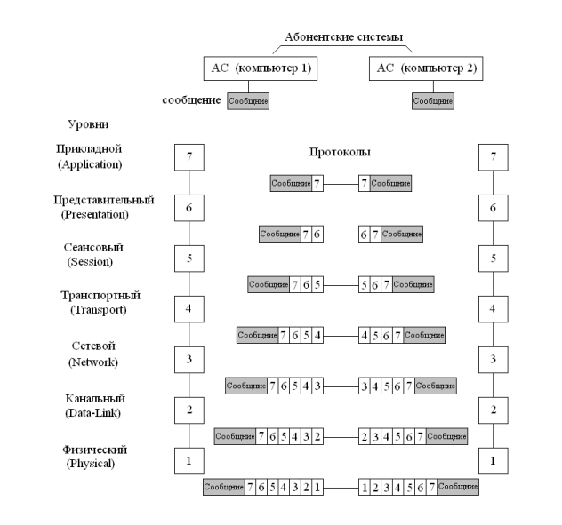  

## Уровни модели OSI

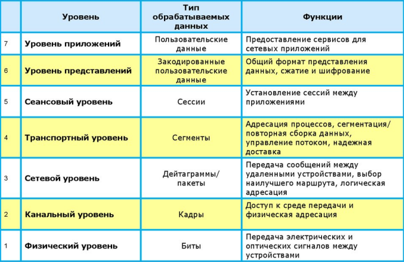  

1. **Физический**
   На нем реализуется установление, поддержка и расторжение соединения с физическим каналом, осуществляется передача битов по каналу связи.
   > Пример:  Электрические и механические характеристики физических сред передачи данных (полоса пропускания, помехозащищенность); Физические топологии сети; Типы разъемов, назначения контактов; Характеристики электрических сигналов (уровни напряжения для 0 и 1).
2. **Канальный уровень**
   Он определяет правила совместного использования физического уровня узлами (компьютерами) сети, а именно логическую топологию сети, правила получения доступа к среде передачи, правила идентификации компьютеров по их физическим адресам.
   Его функции:
   - проверка доступности среды передачи и реализация выбранного метода доступа к общесетевым ресурсам;
   - обнаружение и исправление ошибок;
   - отключение канала при его неисправности и восстановление передачи после ремонта и т.д.
3. **Сетевой уровень**
   Его главная функция – маршрутизация – выбор наилучшего пути для передачи сообщений (с учетом пропускной способности каналов связи и интенсивности трафика).
   
   Сообщения на сетевом уровне называются **пакетами**.
   К сетевому уровню относятся:
    - Сетевые протоколы (они реализуют продвижение пакетов через сеть);
       > Пример протокола сетевого уровня – протокол межсетевого взаимодействия IP стека TCP/IP.
    - Протоколы маршрутизации (они определяют топологию межсетевых соединений).
4. **Транспортный уровень**
   Он отделяет пользователя от физических и функциональных аспектов сети (т.е. изолирует верхние уровни от, каких- либо, изменений в аппаратной технологии). Его главная задача – **управление трафиком**. Транспортный уровень обеспечивает передачу данных верхним уровням с той степенью надежности, которая им требуется.

   Транспортный уровень часто компенсирует отсутствие надежного сервиса соединений на нижних уровнях. Если данные не доставлены правильно, то транспортный уровень может осуществить повторную передачу или информировать верхние уровни о невозможности доставки. Верхние уровни могут затем предпринять необходимые корректирующие действия или обеспечить пользователя возможностью выбора.
   > Пример протокола транспортного уровня – это протоколы TCP и UDP (User Datagram Protocol) стека TCP/IP (Transmission Control Protocol/Internet Protocol).
  
Рассмотренные 4 нижних уровня обобщенно называют **транспортной подсистемой**, т.к. на них полностью решается задача транспортировки сообщений с заданным уровнем качества в составных сетях с произвольной топологией и различными технологиями.

---

Остальные 3 верхних уровня решают з**адачи предоставления прикладных сервисов**.

5. **Сеансовый уровень**
   - управление очередностью передачи данных и их приоритетом
   - синхронизация отдельных событий.
   - выбор формы диалога пользователей (симплексная, полудуплексная либо дуплексная передача).
   - администрирование сеанса связи между двумя сетевыми объектами, состоящее из установления соединения, передачи данных, завершения соединения.
   
   Синхронизация здесь заключается в следующем. Если передается большой файл, а связь разрывается, то после восстановления связи необходимо не повторять уже переданные данные, а возобновить передачу с определенной точки. Для этого сеансовый уровень сохраняет контрольные точки потока данных и возобновляет передачу с последней контрольной точки.
6. **Представительный уровень (Уровень представления)**
   **Основная задача** – преобразование данных во взаимно согласованные форматы, понятные всем сетевым приложениям и компьютерам.

   Он преобразует информацию к виду, который требуют прикладные процессы пользователей(например, прием данных в коде ASCII и выдача их на экран дисплея в виде страницы текста с заданным числом строк и их длиной). Выше этого уровня поля данных имеют смысловую форму, а ниже его поля данных рассматриваются как некий передаточный груз, и их смысловое значение не влияет на обработку.
   > Secure Socket Layer (SSL), который обеспечивает секретный обмен сообщениями для протоколов прикладного уровня стека TCP/IP.
7. **Прикладной уровень**
   Обеспечивает интерфейс пользователя с коммуникационной системой.Прикладной уровень – это набор разнообразных протоколов, с помощью которых пользователи сети получают доступ к разделяемым ресурсам (файлы, принтеры, web – страницы). Если 6 нижних уровней объединяют задачи и технологии, обеспечивающие общую поддержку сетевого сервиса, то прикладной уровень обеспечивает протоколы, необходимые для выполнения конкретных функций сетевого сервиса.  
   > Пример: e-mail, распределенные базы данных (БД), сетевые операционные системы (ОС). 

---
Все, кроме транспортного, перечисленные уровни модели OSI можно разделить на:
  - **Сетезависимые** – это значит, что протоколы данных уровней тесно связаны с технической реализацией сети и используемым коммуникационным оборудованием.
  - **Сетенезависимые** - ориентированы на приложения и мало зависят от технических особенностей построения сети (ее топологии, технологии, оборудования).

# Формы представления сигналов. Структурная схема цифровой обработки сигналов 

Сигналы можно разделить на три типа:
1. Аналоговые
2. Дискретные
3. Цифровые

### Аналоговый

**Аналоговый сигнал** - является непрерывной функцией непрерывного аргумента, т.е. определен для любого значения аргумента, например, времени. Именно такие сигналы формируются большинством датчиков сигнала.

### Дискретный сигнал

**Дискретный сигнал** – это сигнал, представленный последовательностью отсчетов, т.е. значений сигнала в дискретные моменты времени.

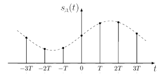 

### Цифровой сигнал

**Цифровой сигнал** – это сигнал дискретный во времени и квантованный по уровню. Значения цифрового сигнала могут быть представлены числом конечной разрядности в одной из систем счисления, например, в двоичной. Именно с цифровыми сигналами оперируют вычислительные устройства, в которых производится обработка сигналов. 

---

Таким образом, для того чтобы компьютер мог выполнить обработку сигнала (это может быть сигнал изображения, звуковой сигнал или сигнал с выхода любого другого датчика, например, датчика температуры), необходимо выполнить преобразование сигнала из одной формы в другую – а именно: из аналоговой в цифровую. А затем зачастую тоже самое, но в обратную сторону.

  

# Аналого-цифровое преобразование сигнала
Аналого-цифровое преобразование включает в себя 2 этапа:
1. дискретизацию сигнала (во времени, в пространстве)
2. квантование.

## Дискретизация сигнала

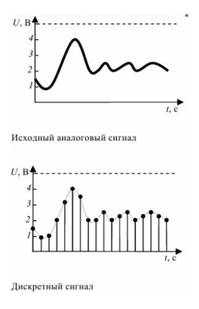  

На этапе дискретизации берутся отсчеты сигнала с некоторым периодом (шагом, интервалом) дискретизации – T. 

Величина обратная периоду – это частота дискретизации (т.е. частота взятия отсчетов) fд = 1/ T.

Процесс получения отсчета входного сигнала должен занимать малую часть периода дискретизации, чтобы снизить динамические ошибки преобразования, обусловленные изменением сигнала за время взятия отсчета.

Частота дискретизации выбирается исходя из теоремы Котельникова (в англоязычной литературе — теорема Найквиста — Шеннона, теорема отсчётов).
> В ней утверждается, что для того, чтобы по отсчетам сигнала можно было бы сколь угодно точно восстановить непрерывный сигнал, необходимо, чтобы частота дискретизации не менее чем в 2 раза превосходила верхнюю частоту спектра дискретизируемого сигнала (это сильно сокращенный вариант теоремы)

### Спектр сигнала

**Спектральное представление сигнала** – это представление в виде суммы (интеграла) гармонических составляющих (синусоид и косинусоид) различных частот, взятых с определенными коэффициентами (т.е. имеющих определенную амплитуду).

Для периодических сигналов это будет сумма гармонических составляющих, а для непериодических интегралов. Переход к спектру сигнала осуществляется с помощью прямого преобразования Фурье.

## Квантование сигнала по уровню

  

Выбор количества уровней квантования выполняется на основе компромиссного подхода, учитывающего, с одной стороны, необходимость обеспечения достаточного уровня качества представления сигнала (а качество тем выше, чем больше уровней квантования), а с другой стороны, количество уровней должно выбираться как можно меньшим, чтобы разрядность кода, описывающего значение отсчета, была бы минимальной.

  

# Спектр периодического сигнала

  

  

  

# Спектр непериодического сигнала

  

  

# Принцип цифро-аналогового преобразования

Цифро-аналоговое преобразование служит для преобразования кода в напряжение. На выходе ЦАП(Цифро-аналоговый преобразователь) вырабатывается напряжение,пропорциональное входному двоичному числу N.

  

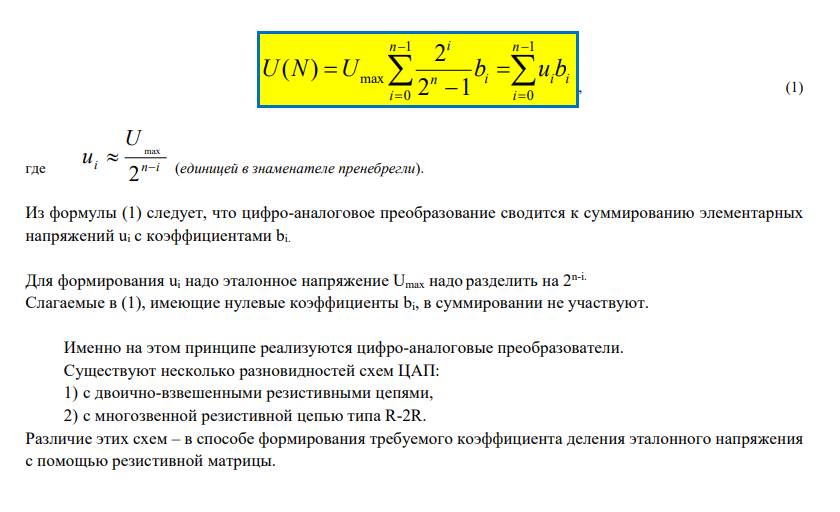  

# Аналоговая модуляция сигнала

Поскольку в качестве несущего сигнала используется синусоидальное колебание, которое характеризуется тремя параметрами: **амплитудой**, **частотой** и **фазой**, то для передачи информации необходимо осуществлять изменение одного их этих параметров или их комбинации.

В соответствии с тем, изменением какого параметра кодируется информация, выделяют **амплитудную, частотную и фазовую модуляции**.

  

### Амплитудная модуляция 

В этом случае меняется только амплитуда несущей синусоиды. Значениям потенциала нуля и единицы соответствуют две **различные амплитуды** сигнала.

### Частотная модуляция

Для передачи логических нулей и единиц используются **синусоиды различных частот**.

### Фазовая модуляция

В данном случае при изменении модулирующего сигнала происходит **скачкообразное изменение фазы** несущей синусоиды. На рисунке показан случай изменения фазы на 180 градусов.

Для выполнения **модуляции** на передающей стороне и **демодуляции** на приемной стороне между компьютером, в котором данные хранятся в цифровом виде, и аналоговой телефонной линией используется устройство, называемое **модемом**. 
> В низкоскоростных модемах может быть использована частотная модуляция, в высокоскоростных обычно применяют комбинированные методы модуляции, например, амплитудную в сочетании с фазовой.

Cовершенствование модемов предусматривает увеличение количества битов, приходящихся на 1 бод.

**Бод** -  количество изменений информационного параметра несущего сигнала в секунду. Если параметр сигнала при изменении принимает одно из двух различимых значений, то каждое изменение параметра несущего сигнала соответствует одному биту. 
>Если параметр может принимать более двух различимых значений, то любое его изменение соответствует большему количеству битов. В этом случае пропускная способность линии в битах в секунду будет выше числа бод. 

Например, для обеспечения 3 бит/бод используется комбинированная модуляция, при которой используется 4 значения фазового сдвига (0, 90, 180, 270) и два уровня амплитуды для каждого сдвига.

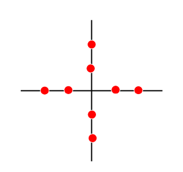  

Если модуляционная технология предусматривает 16 различных комбинаций значений амплитуды и фазовых сдвигов, то тем самым будет обеспечена передача 4 бит/бод. Этот случай называется квадратурной амплитудной модуляцией. 

  

===

Аналоговая модуляция обычно используется при передаче информации по каналу с узкой полосой пропускания, например, по телефонным линиям в глобальных сетях, а также в радиоканалах, что позволяет обеспечивать связь между многими пользователями одновременно. В локальных кабельных сетях аналоговое кодирование практически не используется из-за высокой сложности и стоимости как кодирующего, так и декодирующего оборудования.

# Цифровое кодирование данных

Для цифрового кодирования данных в информационных сетях используются потенциальные коды (для представления логических нулей и единиц используются только значения потенциала сигнала) и импульсные коды (двоичные данные представляются либо импульсами определенной полярности, либо перепадом потенциала определенного направления.

При выборе способа цифрового кодирования учитывают целый ряд факторов:
- обеспечение синхронизации между передатчиком и приемником,
- способность распознавать ошибки,
- обеспечение наименьшей ширины спектра результирующего сигнала при одной и той же битовой
скорости,
- отсутствие в передаваемом сигнале постоянной составляющей,
- низкая стоимость реализации и т.п.

Для того чтобы приемник считывал информацию с линии связи в строго определенные моменты времени необходимо обеспечить синхронизацию передатчика и приемника. Эта задача может быть решена несколькими методами: методом синхронной передачи, методом асинхронной передачи, методом передачи с автоподстройкой. Последний метод применяется в современных высокоскоростных системах передачи данных. Синхронизация в соответствии с этим методом достигается за счет использования
самосинхронизирующихся кодов, в которых указанием для синхронизации передатчика с приемником служат **резкие перепады сигнала**, т.е. фронты импульсов. Чем чаще перепады сигнала, тем надежнее синхронизация, а, следовательно, достовернее идентификация принимаемых битов данных. 

  

## Код NRZ

В простейшем случае потенциального кодирования логическую единицу можно представлять высоким потенциалом, а логический нуль — низким. Подобный способ представления сигнала получил
название «кодирование без возврата к нулю, или кодирование **NRZ (Non Return to Zero)**. Под термином
«без возврата» в данном случае понимается то, что на протяжении всего тактового интервала не происходит изменения уровня сигнала. 

**Плюсы:** Метод NRZ прост в реализации, обладает хорошей распознаваемостью ошибок, но не обладает свойством самосинхронизации. Cравнительно низкая частота основной гармоники его спектра (она равна N/2, где N – битовая скорость передачи дискретных данных), что обеспечивает достаточно высокую пропускную способность линии связи.

**Минусы:** Отсутствие самосинхронизации приводит к тому, что при появлении длинных последовательностей нулей или единиц приемник лишен возможности определять по входному сигналу те моменты времени, когда нужно в очередной раз считывать данные. Незначительное рассогласование тактовых частот приемника и передатчика может приводить к появлению ошибок, если приемник считывает данные не в тот момент времени, когда это нужно. Приемник может привязывать момент начала приема только к первому (стартовому) биту пакета, а в течение приема пакета он вынужден пользоваться только внутренним тактовым генератором (внутренними часами). Другим недостатком кода NRZ является наличие низкочастотной составляющей в спектре сигнала при появлении длинных последовательностей нулей или единиц.

## Код NRZI

Другим типом кодирования является несколько видоизмененный NRZ-код, называемый NRZI (Non Return to Zero with ones Inverted). Код NRZI является простейшей реализацией принципа кодирования сменой уровня сигнала или дифференциального кодирования. При таком кодировании **при передаче нуля уровень сигнала не меняется**, то есть потенциал сигнала остается таким же, как и в предыдущем такте. При **передаче единицы потенциал инвертируется на противоположный**. 

Сравнение кодов NRZ и NRZI показывает, что код NRZI обладает лучшей самосинхронизацией в том случае, если в кодируемой информации логических единиц больше, чем логических нулей. Таким образом, этот код позволяет «бороться» с длинными последовательностями единиц, но не обеспечивает должной самосинхронизации при появлении длинных последовательностей логических нулей. Его часто используют в комбинации с дополнительным кодированием, позволяющим улучшить самосинхронизацию. Код NRZI применяется в оптоволоконных сетях (FDDI и 100BASE-FX).

## Код AMI

**Биполярный код AMI**(Alternate Mark Inversion) - кодирование с альтернативной инверсией. Это модификация кода NRZ. Имеются 3 уровня потенциала. Логическая "1" кодируется либо положительным, либо отрицательным потенциалом, причем потенциал каждой новой единицы противоположен потенциалу предыдущей.

**Достоинства:** достаточно узкий спектр сигнала (уже, чем у кода NRZ), что обеспечивает большую пропускную способность линии связи, возможность распознавания ошибочных сигналов при нарушении строгого чередования полярности сигналов.

**Минусы:** необходимость увеличения мощности передатчика, так как необходимо обеспечить надежное распознавание не двух, а трех уровней сигнала. При использовании этого кода самосинхронизация нарушается только в случае длинных последовательностей нулей.

## Код  RZ

**Код RZ** (Return to Zero – с возвратом к нулю) – этот трехуровневый код получил такое название потому, что после значащего уровня сигнала в первой половине битового интервала следует **возврат к некоему «нулевому»**, среднему уровню (например, к нулевому потенциалу). **Переход к нему происходит в середине каждого битового интервала**. Логическому нулю, таким образом, соответствует **положительный импульс, логической единице – отрицательный (или наоборот) в первой половине битового интервала**.

В центре битового интервала всегда есть переход сигнала (положительный или отрицательный),
следовательно, из этого кода приемник легко может выделить синхроимпульс (строб). Возможна
временная привязка не только к началу пакета, как в случае кода NRZ, но и к каждому отдельному биту,
поэтому **потери синхронизации не произойдет при любой длине пакета**.

**Плюсы:** синхронизирован, простая временная привязка приема, как к началу последовательности, так и к ее концу.

**Недостатки:** ребуется вдвое большая полоса пропускания канала при той же скорости передачи по сравнению с NRZ (так как здесь на один битовый интервал приходится два изменения уровня сигнала). Например, для скорости передачи информации 10 Мбит/с требуется пропускная способность линии связи 10 МГц, а не 5 МГц, как при коде NRZ.

## Манчестерский код

В манчестерском коде для кодирования нулей и единиц используется перепад потенциала, то есть кодирование осуществляется **фронтом импульса**. Перепад потенциала происходит на середине тактового импульса, при этом единица кодируется перепадом от низкого потенциала к высокому, а нуль — наоборот.В начале каждого такта в случае появления нескольких нулей или единиц подряд может возникать служебный перепад потенциала.

**Достоинства:** обладает лучшей самосинхронизацией, поскольку перепад сигнала происходит как минимум один раз за такт. Именно поэтому манчестерский код используется в сетях Ethernet со скоростью передачи 10 Мбит/с (10Ваsе 5, 10Ваsе 2, 10Bаsе-Т).
> Важным достоинством манчестерского кода является то, что постоянная составляющая у него равна нулю (высокий уровень имеет положительную величину, а низкий – такую же отрицательную). Это дает возможность легко применять для гальванической развязки импульсные трансформаторы. При этом не требуется дополнительного источника питания для линии связи (как, например, в случае использования оптронной гальванической развязки), резко уменьшается влияние низкочастотных помех, которые не проходят через трансформатор.

# Основные характеристики линий связи информационных систем

В состав линии связи кроме физической среды, по которой передается информация, входят следующию компоненты:
- **аппаратура передачи данных (АПД)**
- **промежуточной оборудование линии связи (ПОЛС)**

**Назначение АПД** - передавать сигналы требуемой формы и мощности и физическую среду и принимать их.

**Назначение ПОЛС**:
- улучшение качества сигнала (например, усиление - при передаче на большие расстояния, улучшение формы импульсов - в цифровых линиях связи)
- создание постоянного составного канала между двумя абонентами сети.
  
**Основные характеристики линии связи**:
- пропускная способность
- полоса затухания
- АЧХ (амплитудно-частотная характеристика)
- затухание
- помехоустойчивость
- достоверность передачи данных
- удельная стоимость и др

Для определения характеристики линии связи обычно используют её реакцию на некоторое эталонное воздействие, в кач-ве которого чаще всего используют синусоиду.

Если какая-либо синусоида будет неправильно передана, то это приводит к искажениям. В комп. сетях передаются импульсные сигналы. Неправильная передача синусоид приведет к искажению импульсов, они станут непрямоугольными и их распознавание затрудняется.

Степень искажения синусоидальных сигналов линией связи оценивается с помощью след. характеристик:
- **АЧХ (амплитудно-частотная характеристика)** 
   
- **Полоса пропускания** - диапазон частот, для которого коэффициент передачи превышает некоторое установленное значение (обычно 0,7 или 0,5).
  
   **Ширина полосы** пропускания влияет на максимально возможную скорость передачи информации по линии связи.
   **Затухание** - относительное уменьшение амплитуды или мощности сигнала определенной частоты при передаче по линии связи.
     
- **Пропускная способность** - максимально возможная скорость передачи данных по линии связи (бит/с). Пропускная способность зависит от ряда факторов и характеристик самой линии связи, а также от спектра передаваемых сигналов.
   
  > К физ. кодированию относятся кол-во разл. состояний сигнала, кол-во изменений в секунду информационного параметра несущего сигнала. Например, витая пара при одном способе кодирования обеспечивает пропускную способность 10 Мбит/с, а при другом способе - 100 Мбит/с. Примеры лог. кодирования: шифрация данных для обеспечения их конфиденциальности, добавление к каждому байту информации одного бита четности для обнаружения ошибок.
   **Пропускная способность** линии связи связана с полосой пропускания этой линии известной **формулой Клода Шеннона**, в соответствии с которой максимально возможная пропускная способность вне зависимости от способа физ. кодирования определяется след. образом:  
   
   Чем больше ширина полосы пропускания, тем шире спектры сигналов, которые будут без искажения переданы по линии.

   Повысить пропускную способность линии можно двумя путями:
   - За счет увел. мощности передатчика (растут габариты и стоимость)
   - За счет снижения уровня шума
     **Помехоустойчивость** - способность линии связи снижать уровень помех, создаваемых во внешней среде и во внутренних проводниках. Достоверность передачи данных характеризует вероятность искажения для каждого передаваемого бита данных.
     >   

