# Билеты

- [Билеты](#билеты)
  - [1. Назначение, компоненты базы, банка данных, СУБД. Роль и место баз данных в информационных системах](#1-назначение-компоненты-базы-банка-данных-субд-роль-и-место-баз-данных-в-информационных-системах)
    - [Компоненты](#компоненты)
    - [Назначение банка данных](#назначение-банка-данных)
    - [Компоненты баз данных](#компоненты-баз-данных)
    - [Компоненты СУБД](#компоненты-субд)
    - [Роль БД в инофрмационных системах](#роль-бд-в-инофрмационных-системах)
  - [2. Этапы развития БД. Системы распределенного доступа. Настольные СУБД](#2-этапы-развития-бд-системы-распределенного-доступа-настольные-субд)
    - [1. Этап распределённого доступа к данным](#1-этап-распределённого-доступа-к-данным)
    - [2. Эпоха Персональных Компьютеров](#2-эпоха-персональных-компьютеров)
    - [3. Этапы развития БД. Распределенные БД. Технология интранет](#3-этапы-развития-бд-распределенные-бд-технология-интранет)
    - [Использование технологии доступа к данным Интранет](#использование-технологии-доступа-к-данным-интранет)
    - [4. Архитектура БД](#4-архитектура-бд)
  - [5. Процесс прохождения пользовательского запроса](#5-процесс-прохождения-пользовательского-запроса)
  - [6. Классификация моделей данных. Документальные модели](#6-классификация-моделей-данных-документальные-модели)
    - [Документальные модели](#документальные-модели)
  - [7. Теоретико-графовые модели данных. Иерархическая модель данных](#7-теоретико-графовые-модели-данных-иерархическая-модель-данных)
    - [Иерархическая модель](#иерархическая-модель)
    - [Основные информационные единицы иерархической модели](#основные-информационные-единицы-иерархической-модели)
  - [8. Теоретико-графовые модели данных. Сетевая модель](#8-теоретико-графовые-модели-данных-сетевая-модель)
    - [Сетевая модель данных](#сетевая-модель-данных)
  - [9. Реляционная модель. Основные определения](#9-реляционная-модель-основные-определения)
    - [Реляционная модель данных](#реляционная-модель-данных)
  - [10. Реляционная алгебра. Основные операции: объединение, вычитание, декартово произведение](#10-реляционная-алгебра-основные-операции-объединение-вычитание-декартово-произведение)
    - [Реляционная алгебра и язык запросов реляционной алгебры](#реляционная-алгебра-и-язык-запросов-реляционной-алгебры)
    - [**1. Объединение**](#1-объединение)
    - [**2. Вычитание**](#2-вычитание)
    - [**3. Декартово произведение**](#3-декартово-произведение)
  - [11. Реляционная алгебра. Основные операции: проекция, селекция](#11-реляционная-алгебра-основные-операции-проекция-селекция)
    - [**4. Проекция (Project)**](#4-проекция-project)
    - [**5. Выбор(SELECT)**](#5-выборselect)
  - [12. Реляционная алгебра. Дополнительные операции: пересечение, деление, соединение](#12-реляционная-алгебра-дополнительные-операции-пересечение-деление-соединение)
  - [13. Функциональные зависимости атрибутов](#13-функциональные-зависимости-атрибутов)
    - [Функциональная зависимость между атрибутами](#функциональная-зависимость-между-атрибутами)
    - [Три Аксиомы Армстронга](#три-аксиомы-армстронга)
  - [14. Этапы проектирования реляционной БД](#14-этапы-проектирования-реляционной-бд)
  - [15. Системный анализ предметной области. Пример](#15-системный-анализ-предметной-области-пример)
    - [Пример](#пример)
  - [16. Инфологическое проектирование. Модель «сущность – связь»](#16-инфологическое-проектирование-модель-сущность--связь)
  - [17. Даталогическое проектирование. **Первая нормальная форма**](#17-даталогическое-проектирование-первая-нормальная-форма)
    - [Ненормализованная форма (НФ)](#ненормализованная-форма-нф)
    - [Первая нормальная форма (1НФ)](#первая-нормальная-форма-1нф)
  - [18. Даталогическое проектирование. **Вторая нормальная форма**](#18-даталогическое-проектирование-вторая-нормальная-форма)
  - [19. Даталогическое проектирование. **Третья нормальная форма**](#19-даталогическое-проектирование-третья-нормальная-форма)
  - [20. Даталогическое проектирование. **Нормальная форма Бойса-Кодда**](#20-даталогическое-проектирование-нормальная-форма-бойса-кодда)
  - [21. Преобразование ER-модели в реляционную модель данных](#21-преобразование-er-модели-в-реляционную-модель-данных)
    - [Разрешение связей типа "многие-ко-многим"](#разрешение-связей-типа-многие-ко-многим)
  - [22. Язык SQL. Типы данных](#22-язык-sql-типы-данных)
  - [23. Язык SQL. Операторы определения данных DDL](#23-язык-sql-операторы-определения-данных-ddl)
    - [Операторы DDL с заданием ограничений целостности](#операторы-ddl-с-заданием-ограничений-целостности)
    - [Оператор модификации таблиц](#оператор-модификации-таблиц)
      - [```ALTER TABLE```](#alter-table)
      - [```DROP TABLE```](#drop-table)
  - [Язык SQL. Операторы манипулирования данными DML](#язык-sql-операторы-манипулирования-данными-dml)
  - [25. Язык SQL. Оператор выбора DQL](#25-язык-sql-оператор-выбора-dql)
    - [SELECT](#select)
    - [Агрегатные функии](#агрегатные-функии)
  - [26. Язык SQL. Средства администрирования данных](#26-язык-sql-средства-администрирования-данных)
  - [27. Защита информации в базах данных](#27-защита-информации-в-базах-данных)
  - [28. Реализация реляционной модели данных в СУБД](#28-реализация-реляционной-модели-данных-в-субд)
  - [29. Распределенная обработка данных. Клиент-серверная архитектура](#29-распределенная-обработка-данных-клиент-серверная-архитектура)
    - [Распределенная обработка данных](#распределенная-обработка-данных)
    - [Клиент-серверная архитектура](#клиент-серверная-архитектура)
  - [30. Файл-серверная архитектура. Модель удаленного управления данными](#30-файл-серверная-архитектура-модель-удаленного-управления-данными)
  - [31. Двухуровневая клиент-серверная архитектура. Модель удаленного доступа к данным](#31-двухуровневая-клиент-серверная-архитектура-модель-удаленного-доступа-к-данным)
  - [32. Двухуровневая клиент-серверная архитектура. Модель сервера баз данных](#32-двухуровневая-клиент-серверная-архитектура-модель-сервера-баз-данных)
  - [33. Трехуровневая клиент-серверная архитектура. Модель сервера приложений](#33-трехуровневая-клиент-серверная-архитектура-модель-сервера-приложений)
  - [34. Трехуровневая клиент-серверная архитектура. Модель доступа через Internet/Intranet](#34-трехуровневая-клиент-серверная-архитектура-модель-доступа-через-internetintranet)
  - [35. Варианты моделей серверов баз данных](#35-варианты-моделей-серверов-баз-данных)
  - [36. Типы параллелизма в многопотоковой архитектуре](#36-типы-параллелизма-в-многопотоковой-архитектуре)
  - [Самопроверка](#самопроверка)

## 1. Назначение, компоненты базы, банка данных, СУБД. Роль и место баз данных в информационных системах

**Назначение банков данных:** банк данных предназначен для хранения больших массивов информации, быстрого поиска нужных сведений и документов. Ядром банка являются базы данных и базы знаний.

### Компоненты

- **База данных** является ядром банка данных. База данных содержит *структурированные данные*, организованные в таблицы, схемы и связи между ними.
- **Технические средства БнД:** *универсальные ЭВМ и периферийные средства* для ввода информации в базу данных и вывода информации. Если банк данных реализуется в сети, то необходимы технические средства для обеспечения ее работы.
- **Программные средства:** *комплекс программ*, обеспечивающих взаимодействие и функционирование всех частей информационной системы. Основу программных средств БнД составляют СУБД. Важной компонентой СУБД являются трансляторы или компиляторы для используемых ею языковых средств.
- **Языковые средства:** *языки программирования и запросов*, которые позволяют пользователям взаимодействовать с базой данных. Это могут быть структурированные языки запросов, такие как SQL (Structured Query Language), а также языки программирования для разработки приложений, связанных с базой данных.
- **Организационно-методические средства:** инструкции, *методические и регламентирующие материалы*, предназначенные для пользователей разных категорий, взаимодействующих с банком данных

### Назначение банка данных

- обеспечивать получение общих и/или детализированных отчетов по итогам работы;
- позволять легко определять тенденции изменения важнейших показателей;
- обеспечивать получение информации, критической по времени, без существенных задержек
- выполнять точный и полный анализ данных.

### Компоненты баз данных

- **Поле** — *минимальный элемент базы данных*, содержащий одну неделимую единицу информации. Каждое поле имеет имя и тип хранящихся в нем данных.
- **Запись** — *совокупность разнородных полей*, описывающая некоторую сущность предметной области.
- **Таблица базы данных** — *набор однородных записей*, который позволяет читать, изменять, добавлять и удалять записи, а также сортировать их по определенному условию и осуществлять поиск по заданным значениям.
- **Триггеры** – хранимые процедуры, которые *автоматически срабатывают при модификации данных* в таблице базы данных, с которой он связан: добавлении INSERT, удалении DELETE строки в заданной таблице, или изменении UPDATE данных в определенном столбце заданной таблицы РБД. Они нужны для обеспечения целостности данных и реализации сложной бизнес-логики.
- **Индексы**: объект базы данных, создаваемый *для повышения производительности поиска данных*. Индекс формируется из значений одного или нескольких столбцов таблицы и указателей на соответствующие строки таблицы и позволяет искать строки, удовлетворяющие критерию поиска. Ускорение работы достигается в первую очередь за счёт того, что индекс имеет структуру, оптимизированную под поиск — например, *сбалансированного дерева*.
- **Хранимая процедура**: *набор SQL - инструкций*, который компилируется один раз и хранится на сервере. Хранимые процедуры очень похожи на обыкновенные процедуры языков высокого уровня, у них могут быть входные и выходные параметры и локальные переменные, в них могут производиться числовые вычисления и операции над символьными данными, результаты которых могут присваиваться переменным и параметрам. В хранимых процедурах могут выполняться стандартные операции с базами данных (как DDL, так и DML). Кроме того, в хранимых процедурах возможны циклы и ветвления, то есть в них могут использоваться инструкции управления процессом исполнения.
- **Генератор**: генераторы предназначены для получения последовательностей уникальных чисел. Такие числа обычно используются как идентификаторы записи в таблицах, имеющих суррогатный первичный ключ.

### Компоненты СУБД

**Назначение СУБД:** СУБД должна предоставить пользователю базы данных возможность работать с ней, не вникая в детали на уровне аппаратного обеспечения. Иными словами, СУБД позволяет конечному пользователю рассматривать базу данных как объект более высокого уровня по сравнению с аппаратным обеспечением, а также предоставляет в его распоряжение набор операций, выражаемых в терминах языка высокого уровня (например, SQL)

- **Процессор запросов:** Это основной компонент СУБД, который *преобразует запросы в последовательность низкоуровневых инструкций* для контроллера базы данных;
- **Контроллер базы данных:** взаимодействует с пользователями прикладных программ и запросов. Контроллер базы данных принимает запросы и проверяет внешние и концептуальные схемы для определения тех концептуальных записей, которые *необходимы для удовлетворения требований запросов*. Затем контроллер базы данных вызывает контроллер файлов для выполнения поступившего запроса.
- **Контроллер файлов:** управляет файлами, предназначенными для хранения данных, и распределяет дисковое пространство. Он *создает и поддерживает список структур и индексов*, определенных во внутренней схеме. Если используются хешированные файлы, то в его обязанности входит и вызов функций хеширования для генерации адресов записей. Однако контроллер файлов не управляет физическим вводом и выводом данных непосредственно, а лишь передает запросы соответствующим методам доступа, которые считывают данные в системные буферы или записывают их оттуда на диск;
- **Препроцессор языка DML:** преобразует *операторы языка DML (язык для манипулирования данными) в вызовы стандартных процедур* базового языка. Для генерации соответствующего кода препроцессор языка DML должен взаимодействовать с процессором запросов;
- **Компилятор языка DDL:** преобразует *DDL-команды в набор таблиц*, содержащих метаданные. Затем эти таблицы сохраняются в системном каталоге, а управляющая информация – в заголовках файлов с данными;
- **Контроллер словаря:** *управляет доступом к системному каталогу* и обеспечивает работу с ним. Системный каталог доступен большинству компонентов СУБД.

### Роль БД в инофрмационных системах

1. **Хранение данных:** БД предоставляют *структурированное и надежное хранилище для хранения данных*, которые могут быть доступны множеству пользователей и приложений. Они обеспечивают удобное и эффективное хранение больших объемов данных, таких как клиентская информация, продуктовые каталоги, финансовые данные и другие.
2. **Централизация данных:** БД позволяют *централизованно хранить данные*, что обеспечивает единое и точное представление информации для всех пользователей и систем в организации. Это помогает избежать дублирования данных и обеспечивает согласованность и целостность информации.
3. **Обеспечение доступа к данным:** БД предоставляют механизмы для эффективного доступа к данным. *Пользователи и приложения могут выполнять запросы к БД, чтобы получать нужные данные*, обновлять их или выполнять аналитические операции. БД также обеспечивают механизмы безопасности, чтобы контролировать доступ пользователей к данным и защищать информацию от несанкционированного доступа.
4. **Поддержка бизнес-процессов:** БД являются *основой для реализации бизнес-процессов* в информационных системах. Они позволяют организациям автоматизировать и управлять своими операциями, хранить и анализировать данные, принимать решения на основе информации и обеспечивать взаимодействие с клиентами и партнерами.
5. **Поддержка принятия решений:** БД предоставляют данные и *аналитические возможности для поддержки принятия решений* в организациях. Пользователи могут выполнять сложные запросы и анализировать данные, чтобы выявлять тенденции, прогнозировать результаты, оптимизировать процессы и принимать обоснованные решения.

## 2. Этапы развития БД. Системы распределенного доступа. Настольные СУБД

### 1. Этап распределённого доступа к данным

Базы данных хранились во внешней памяти центральной ЭВМ, пользователями этих баз данных были задачи, **запускаемые в пакетном режиме**.

Интерактивный режим доступа обеспечивался **с помощью консольных терминалов**.

Программы доступа к БД писались на различных языках и запускались как обычные числовые программы. Мощные операционные системы обеспечивали возможность условно параллельного выполнения всего множества задач Эти системы распределенного доступа - **база данных была централизованной**, хранилась на устройствах внешней памяти одной центральной ЭВМ, а доступ к ней поддерживался от многих пользователей-задач.

### 2. Эпоха Персональных Компьютеров

- Появляется **большое количество СУБД**, которые стали называться настольными СУБД. (предназначены для работы неподготовленными пользователями).
- Эти СУБД рассчитаны на создание и р**аботу с БД в монопользовательском режиме**.
- Встал **вопрос экспорта/импорта** данных.
- Эти СУБД имели **развитый и удобный интерфейс**.
- В этих СУБД поддерживался только **внешний уровень представления** реляционной модели.
- В них отсутствовали средства поддержки ссылочной и структурной целостности БД.
- Настольные СУБД привели к **вырождению функций администрирования БД**.
- Эти СУБД предъявляли скромные требования к аппаратному обеспечению.

### 3. Этапы развития БД. Распределенные БД. Технология интранет

Появляется множество локальных сетей. Всё больше информации передаётся между компьютерами.

**Транзакция** - последовательность операций над БД, переводящая её из одного непротиворечивого состояния в другое непротиворечивое состояние.

Все СУБД этого этапа обеспечивают **поддержку полной реляционной модели БД**, а именно:

- Структурной целостности (допустимыми в таких БД являются данные, представленные в виде отношений реляционной модели).
- Языковой целостности (языки не ниже стандарта SQL).
- Ссылочной целостности - большинство СУБД рассчитаны на многоплатформенную архитектуру.

Развитие средств администрирования БД с реализацией общей концепции средств защиты данных. Создаётся **первый стандарт SQL** (1989г.)

> Примеры:
>
> - MS Access
> - MS SQL Server
> - Oracle DB

### Использование технологии доступа к данным Интранет

**Интранет** *(англ. Intranet)* — в отличие от Интернета, это *внутренняя частная сеть*, принадлежащая, как правило, частному лицу, организации или крупному государственному ведомству.

**Характерные особенности:**

- Нет необходимости использовать специализированное клиентского ПО.
- Для работы с удалённой БД используется браузер.
- В HTML странице встраивается код, который отслеживает все действия пользователя, транслирует их в SQL запросы.

Однако алгоритмически сложные задачи рекомендуется реализовывать в архитектуре клиент-сервер с разработкой специализированного клиентского ПО.

### 4. Архитектура БД

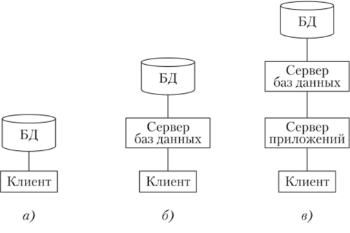  

Трёхуровневая архитектура БД (самая стабильная).

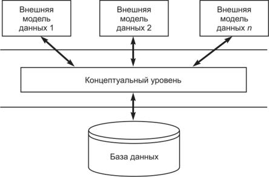  

**Внешний уровень** — представляет *данные для каждого пользователя в удобной для него форме*. Он содержит внешние представления базы данных, которые интересны конкретному пользователю. Внешнее представление содержит только те сущности, атрибуты и связи, которые интересны пользователю.

**Концептуальный уровень** — это обобщающее представление БД. Этот уровень описывает то, *какие данные хранятся в БД, а также связи, существующие между ними*. Этот уровень содержит логическую структуру всей БД (с точки зрения администратора БД). На концептуальном уровне представлены следующие компоненты:

- Все сущности, их атрибуты и связи;
- Накладываемые на данные ограничения;
- Семантическая информация о данных (связанная со значением, смыслом);
- Информация о мерах обеспечения безопасности и поддержки целостности данных.

**Физическая БД** описывает, *как данные хранятся на физических носителях*. Он оптимизирует производительность и использование дискового пространства. На этом уровне описывается структура данных, организация файлов и детали хранения записей. На физическом уровне хранится следующая информация:

- Распределение дискового пространства для хранения данных и индексов;
- Описание подробностей сохранения записей;
- Сведения о размещении записей;
- Сведения о сжатии данных и выбранных методах их шифрования.

Между **внешним и концептуальным** уровнями существует логическая независимость, что означает, что изменения на концептуальном уровне не должны влиять на внешние представления.

Между **концептуальным и физическим** уровнями существует физическая независимость, что означает, что изменения на физическом уровне не должны влиять на концептуальное представление.

## 5. Процесс прохождения пользовательского запроса

**База метаданных** - база, где хранится вся *информация об используемых структурах данных*, логической организации данных, правах доступа пользователей и физическом расположении данных.

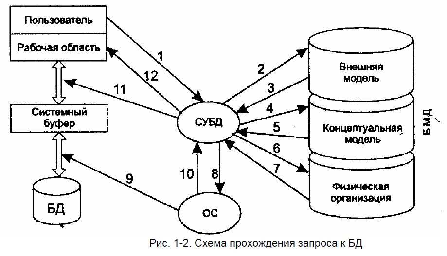  

*Описание:*

1. Пользователь посылает СУБД **запрос на получение данных** из БД.
2. **Анализ прав пользователя и внешней модели данных**, соответствующей данному пользователю, подтверждает или запрещает доступ данного пользователя к запрошенным данным.
3. В случае запрета на доступ к данным СУБД сообщает пользователю об этом (линия 12) и прекращает дальнейший процесс обработки данных, в противном случае СУБД **определяет часть концептуальной модели**, которая затрагивается запросом пользователя.
4. **СУБД запрашивают информацию о части концептуальной модели.**
5. **СУБД получает информацию о запрошенной части концептуальной модели.**
6. СУБД запрашивает **информацию о местоположении данных на физическом уровне** (файлы или физические адреса).
7. В СУБД **возвращается информация о местоположении данных** в терминах операционной системы.
8. СУБД п**росит операционную систему предоставить необходимые данные**, используя средства операционной системы.
9. Операционная система **осуществляет перекачку информации** из устройств хранения и пересылает ее в системный буфер.
10. Операционная система **оповещает СУБД об окончании пересылки**.
11. СУБД выбирает из доставленной информации, находящейся в системном буфере, только то, что нужно пользователю, и **пересылает эти данные в рабочую область пользователя**.

## 6. Классификация моделей данных. Документальные модели

**Модель данных** – это некоторая *абстракция*, которая, будучи приложима к конкретным данным позволяет *трактовать их как информацию*, т.е. сведения, содержащие не только данные, но и взаимосвязи между ними.

Классификация моделей данных (в соответствии с трехуровневым представлением БД):

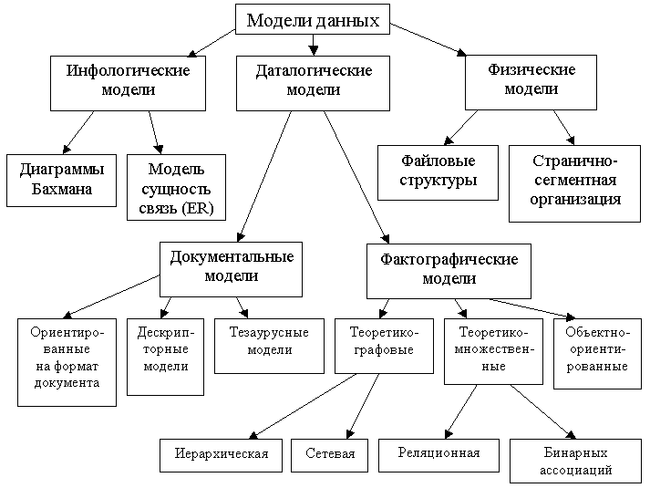  

- **Инфологические модели** представляют **информацию о предметной области независимо от конкретной базы данных**. Они описывают объекты, их свойства и связи в понятной и естественной форме на уровне абстракции информации. Инфологические модели помогают фиксировать и описывать структуру и отношения данных, *не привязываясь к конкретной технической реализации или СУБД.*
- **Физическая модель** данных (ФМД) – это **модель данных, описанная с помощью средств конкретной СУБД**. ФМД строится на базе даталогической путем добавления особенностей конкретной СУБД.
- **Даталогическая модель**, отражающая **логические взаимосвязи между элементами данных безотносительно их содержания и физической организации**. При этом даталогическая модель разрабатывается с учетом конкретной реализации СУБД, также с учетом специфики конкретной предметной области на основе ее инфологической модели.

### Документальные модели

**Относятся к датологическим моделям данных** и работают со слабоструктурированной информацией, основанногй на свободном формате документа или текста на его естественном языке.

Три вида:

- **Ориентированные на формат документа:** Связаны прежде всего со **стандартным общим языком разметки документов**, который позволяет организовывать информацию, содержащуюся в документах, и представлять ее в определенном стандартном виде.
- **Дескрипторные модели:** Каждому документу соответствует **дескриптор или описатель**, который имеет жесткую структуру и описывает документ в соответствии с теми характеристиками, которые требуются для работы с документами.
- **Тезаурусные модели:** Основаны на принципе организации словарей, описывающих **языковые выражения и их взаимосвязи**. Под тезаурусом понимается иерархический словарь понятий и отношений между ними, что позволяет представлять исходный текст документа в виде системы этих понятий.

## 7. Теоретико-графовые модели данных. Иерархическая модель данных

**Теоретико-графовые модели данных.** Эти модели отражают совокупность объектов реального мира в виде *графа взаимосвязанных информационных объектов*.

### Иерархическая модель

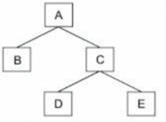

Является наиболее простой из всех даталогических моделей. В *реальном мире очень многие связи соответствуют иерархии*, когда один объект выступает как родительский, а с ним может быть связано множество подчинённых объектов. Иерархия проста и естественна в отображении взаимосвязи между классами объектов.

**Эти модели представляются в виде графов взаимосвязанных информационных объектов.**

### Основные информационные единицы иерархической модели

- **Поле данных** – это *минимальная неделимая единица данных*, доступная пользователю с помощью СУБД. Разработчик сам выбирает что будет выступать в качестве поля. Примеры: адрес.
- **Сегмент** – *совокупность полей, который называют записью.* В иерархической модели выделяют: тип сегмента и экземпляр сегмента (разница между ними тип переменной и сама переменная).
- **Тип сегмента** – поименованная *совокупность типов элементов данных, в него входящих.* Каждый тип сегмента в рамках иерархической модели образует некоторый набор однородных записей.
- **Экземпляр сегмента** – образуется из *конкретных значений полей* или элементов данных, в него входящих. Пример: Группа (№ группы, староста) 5831, Свистунов Ю. 5836, Влад С.

Для **возможности различия отдельных записей** в данном наборе каждый тип сегмента должен иметь ключ или набор ключевых атрибутов (полей, элементов данных) - набор элементов данных, **однозначно определяющих экземпляр сегмента.**

Схема иерархической БД представляет собой **совокупность отдельных деревьев**, каждое дерево в рамках модели называется физической базой данных.

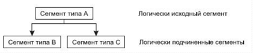  

Каждая физическая БД удовлетворяет следующим **иерархическим ограничениям:**

- В каждом физическом БД существует **один корневой сегмент**
- Каждый логически исходный сегмент **может быть связан с произвольным числом** логически подчиненных сегментов
- Каждый логический сегмент может быть **связан только с одним логически исходным (родительским) сегментом**

  

Каждый тип сегмента может иметь множество соответствующих ему экземпляров. Между экземплярами сегментов также существуют **иерархические связи**.

Экземпляры-потомки одного типа, связанные с одним экземпляром, **называются близнецами**. Набор всех экземпляров сегментов, подчинённых одному экземпляру корневого сегмента, называют физической записью.

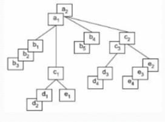  

> Пример:
>
> 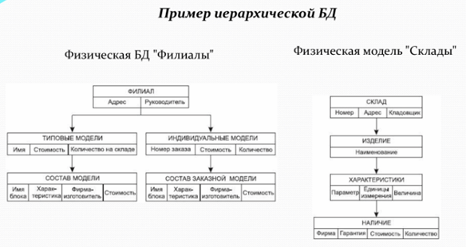  

## 8. Теоретико-графовые модели данных. Сетевая модель

### Сетевая модель данных

- **Элемент данных** - *минимальная информационная единица*, доступная пользователю с использованием СУБД.
- **Агрегат данных** соответствует *следующему уровню обобщения в модели*. Имеет имя, и в системе допустимо обращение к агрегату по имени. В модели определены агрегаты двух типов:
  - *Вектор*. Пример вектора: Адрес (Город, улица, дом, корпус, квартира)
  - *Повторяющаяся группа*. Это совокупность векторов 12 штук (для примера).
    > Пример: Зарплата (Месяц, сумма (оклад, бонус, премия, штраф))
- **Запись** - *совокупность агрегатов* или элементов данных, моделирующая некоторый класс объектов реального мира. Для записи вводятся понятия типа записи и экземпляра записи (аналогия с сегментом).
- **Набор данных** - *двухуровневый граф, связывающий отношением "один-ко-многим" два типа записи*. Набор фактически отражает иерархическую связь между двумя типами записей.

Родительский тип связи в данном наборе называется **владельцем набора**, а дочерний тип записи - **членом набора**.

Для двух типов записи может быть задано любое количество наборов, которые их связывают. Фактически наличие подобных возможностей позволяет промоделировать отношение **"многие-ко-многим"** между двумя объектами реального мира, что *выгодно отличает сетевую модель от иерархической.*

Существенным ограничением набора является то, что один и тот же тип записи **не может быть одновременно и владельцем, и членом набора.**

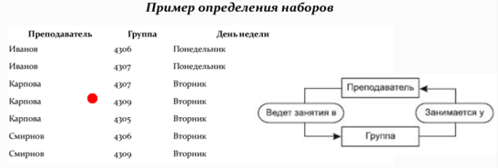  

> Пример сетевой БД
>
> 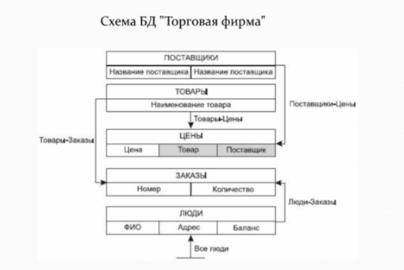  

## 9. Реляционная модель. Основные определения

**Теоретико-множественные** модели *основаны на теории множеств*, опираются на свойства множеств и операции, которые производятся над множествами. Эти модели наиболее перспективны для создания БД.

### Реляционная модель данных

**Основной** структурой данных в модели является **отношение**.

  

> **Опр. N-арным отношением R** называют подмножество декартова произведения D₁ x D₂ x ... x Dₙ множеств D₁, D₂, ..., Dₙ (n> 1), необязательно различных. Исходные множества D₁, D₂, ..., Dₙ называют в модели доменами.
>
> 
> Полное декартово произведение - набор всевозможных сочетаний из n элементов каждое, где каждый элемент берётся из своего домена. **Пример** - Декартовая прямоугольная система координат.

Отношение R моделирует реальную ситуацию, и оно может содержать, допустим, только 5 строк, которые соответствуют результатам сессии (Крылов экзамен по Базам данных ещё не сдавал):

> Отношение может быть представлено в виде таблицы, столбцы которой соответствуют вхождениям доменов в отношение, а строки - наборам из n значений, взятых из исходных доменов, которые расположены в строго определённом порядке в соответствии с заголовком. Такие наборы из n значений часто называют n-ками.

  

**Таблица обладает рядом специфических свойств:**

- В таблице нет двух одинаковых строк
- Таблица имеет столбцы, соответствующие атрибутам отношений
- Каждый атрибут в отношении имеет уникальное имя
- Порядок строк в таблице произвольный

**Атрибут** - вхождение домена в отношение.

**Кортеж** - строки отношения.

**Степень (ранг) отношения** - количество атрибутов в отношении.

В отношении **не может быть двух одинаковых кортежей**. Два отношения, отличающиеся только порядком строк или порядком столбцов, будут интерпретироваться в рамках реляционной модели как одинаковые.

Реляционная модель представляет **базу данных в виде множества** взаимосвязанных отношений.

В этой модели поддерживаются иерархические связи между отношениями. В каждой связи **одно отношение может выступать как основное, а другое отношение выступает в роли подчинённого.**

Для поддержки этих связей **оба отношения должны содержать наборы атрибутов, по которым они связаны**. В основном отношении это **первичный ключ** отношения `(PRIMARY KEY)`, который однозначно определяет кортеж основного отношения. В подчинённом отношении для моделирования связей должен присутствовать набор атрибутов, соответствующий первичному ключу основного отношения. Данный набор атрибутов в подчинённом отношении принято называть **внешним ключом** `(FOREIGN KEY)`.

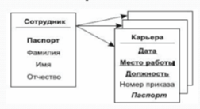  

## 10. Реляционная алгебра. Основные операции: объединение, вычитание, декартово произведение

### Реляционная алгебра и язык запросов реляционной алгебры

В реляционной алгебре определяются **5 основных операций** над отношениями, на основе которых можно сконструировать язык запросов (язык манипулирования данными - ЯМД) реляционной алгебры. Результатом операции также является отношение.

> **Запрос** - операция над отношениями, результатом которой также является отношение.

### **1. Объединение**

**Объединение (Union) отношений** R и S даёт множество кортежей, которые принадлежат R или S, или им обоим. REZ = R ∪ S

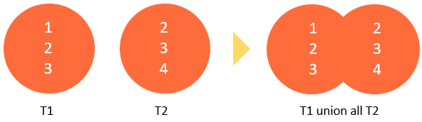  

Имена атрибутов отношений-операндов могут быть различными. Соответствующие значения компонент кортежей должны принадлежать одному домену.

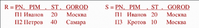  

### **2. Вычитание**

**Вычитание (MINUS)** - в результирующее отношение включаются кортежи из R, не принадлежащие S, и Krez = Kr = Ks.

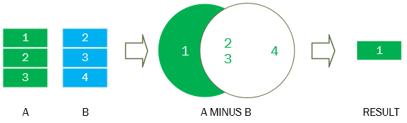  

Операция вычитания используется для удаления ненужных кортежей отношения.

### **3. Декартово произведение**

**Декартово произведение (TIMES)** - результирующее отношение состоит из кортежей, Первые Kr компонент которых - кортежи из R, а последние Ks компонент - кортежи из S и Krez = Kr + Ks ("склеивание" кортежей операндов)

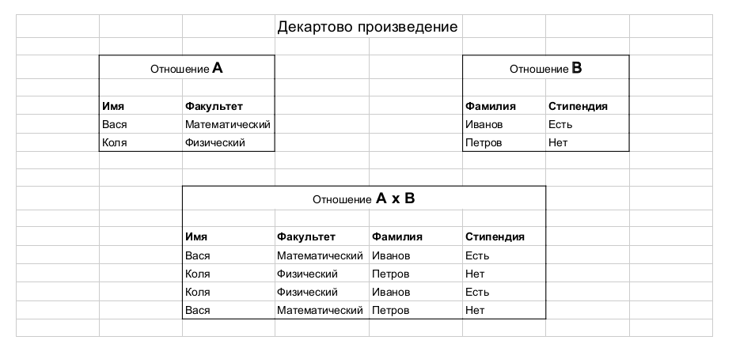  

## 11. Реляционная алгебра. Основные операции: проекция, селекция

Продолжение предыдущего билета.

### **4. Проекция (Project)**

**Проекция (Project)** даёт настроить *вертикальное подмножество* отношения. Применяется к одному конкретному отношению.

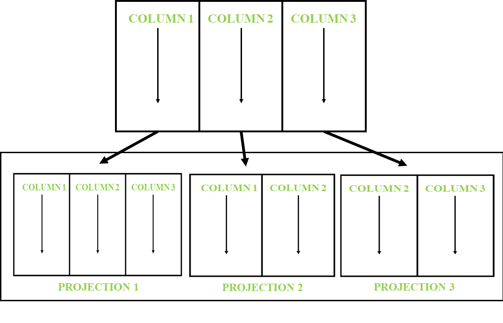  


### **5. Выбор(SELECT)**

**Селекция или выбор (SELECT)** даёт возможность *построить горизонтальное подмножество отношения*. Отбор кортежей может производиться с использованием операций. (арифметических, логических и т.д.)

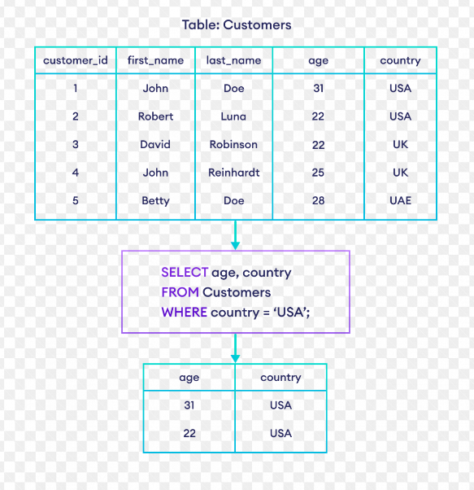 

## 12. Реляционная алгебра. Дополнительные операции: пересечение, деление, соединение

1. **Пересечение (INTERSECTION)** (REZ = R ∩ S): отношений R и S даёт множество кортежей, которые принадлежат как R, так и S. Эта операция осуществляется при Krez = Kr = Ks.
    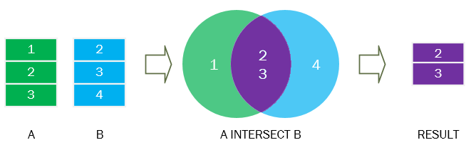  

2. **Деление (DIVISION)** (REZ = R ÷ S): Деление выполнимо, если делитель S # ∅, и атрибуты делителя образуют некоторое подмножество атрибутов делимого R, и Kr> Ks. Арности частного, делимого и делителя связаны отношением Krez = Kr - Ks.
    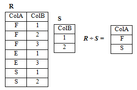

    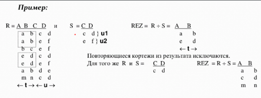  

3. **Соединение (JOIN)** (REZ = R ⨝ S): отношений осуществляется с использованием операций отношения(<≤ = # ≥>).
    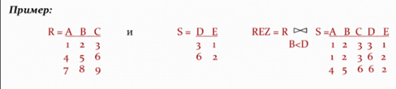  
  
    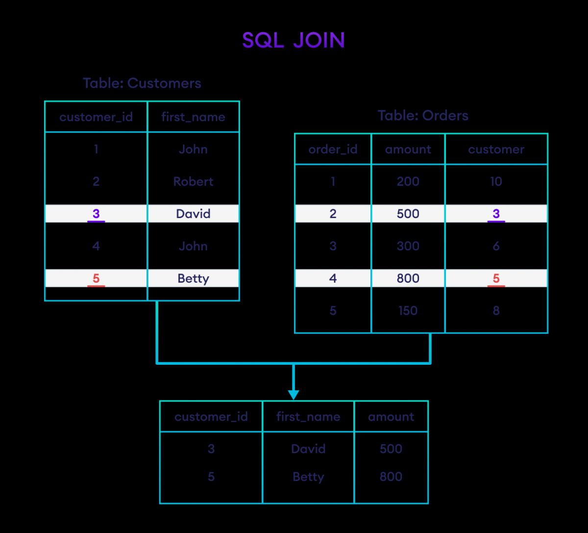  
  
    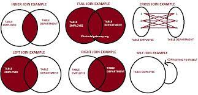  

4. **Естественное соединение (JOIN)** - тоже, что и 3.

> 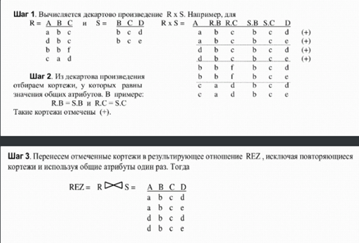  

## 13. Функциональные зависимости атрибутов

**Нормализация** – это процесс, направленный на *снижение избыточности информации* в реляционных базах данных.

В основу нормализации положена концепция *функциональных зависимостей.*

Нормализация отношений модели предметной области позволяет создать логическую модель реляционной БД.

### Функциональная зависимость между атрибутами

**Функциональной зависимостью** набора атрибутов В отношения R от набора атрибутов А того же отношения, обозначаемый как R.A → R.B или A → B, называется такое отношение проекций R[A] и R[B], при котором в каждый момент времени любому элементу проекции R[A] соответствует только один элемент проекции R[B], входящий вместе с ним в какой-либо кортеж отношения R.

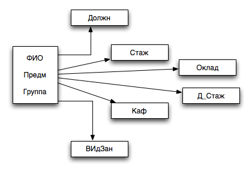  

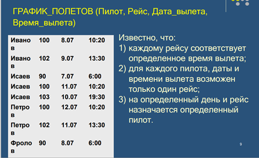  

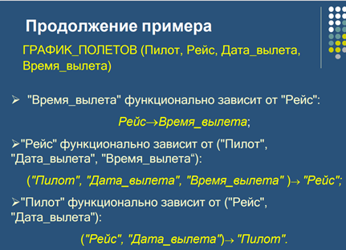  

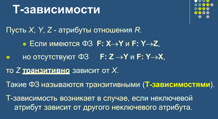  

```none
Грубо говоря, нормализация это выявление функциональной зависимости.
```

### Три Аксиомы Армстронга

Применяя эти аксиомы, из заданного множества функциональных зависимостей можно вывести все возможные функциональные зависимости.

- **Рефлективность** Если В является подмножеством А, то можно сказать, что В функционально зависит от А (А → В)
- **Дополнение** Если В функционально зависит от А (). Если A → B то A.C → B.C
- **Транзитивность** Если A → C → B, то A → B

**Возможным ключом** отношения называется набор атрибутов отношения, который полностью, и **однозначно определяет значения всех остальных** атрибутов отношения (то есть возможный ключ - набор атрибутов, однозначно определяющий кортеж отношения, и при этом при удалении любого атрибута из этого набора, его свойство однозначной идентификации кортежа теряется).

В общем случае в отношении, может быть, несколько возможных ключей. Среди возможных ключей отношения обычно выбирают один, который **считается главным** и который называют **первичным ключом отношения**

**Неключевым атрибутом** называется любой атрибут отношения, не входящий в состав **ни одного возможного ключа отношения**.

**Взаимно-независимые атрибуты** - такие атрибуты, которые не зависят функционально один от другого.

## 14. Этапы проектирования реляционной БД

Этот билет коррелирует с `13. Функциональные зависимости атрибутов`, `15.Системный анализ предметной области. Пример.` и `Нормальными формами`.

Процесс проектирования базы данных (БД) включает переход от **неформального описания структуры предметной области к формализованному описанию объектов** предметной области в терминах выбранной модели данных. Проектирование реляционных БД на основе принципов нормализации

**Инфологическая модель** ориентирована на пользователя и определяет информационные объекты, их атрибуты и связи между ними.

**Логическое проектирование** включает создание схемы БД на основе конкретной модели данных, например, реляционной модели.

Важным шагом является выбор **эффективного размещения БД** на внешних носителях для оптимальной работы приложения.

Результирующий проект реляционной БД представляет собой набор взаимосвязанных отношений с определенными атрибутами, первичными ключами и дополнительными свойствами, связанными с поддержкой целостности данных.

## 15. Системный анализ предметной области. Пример

С точки зрения проектирования БД в рамках системного анализа необходимо провести подробное словесное описание объектов предметной области и **реальных связей**, которые присутствуют между описываемыми объектами.

Системный анализ должен заканчиваться:

- подробным **описанием информации об объектах предметной области**, которая требуется для решения конкретных задач, и которая должна храниться в БД
- **формулировкой конкретных задач**, которые будут решаться с использованием данной БД с кратким описанием алгоритмов их решения
- **описанием выходных документов**, которые должны генерироваться в системе
- **описанием входных документов, которые служат основанием для заполнения данными БД**

### Пример

```r
TL:DR
```

Пусть требуется разработать информационную систему для автоматизации учёта получения и выдачи книг в библиотеке. Система должна предусматривать режимы ведения системного каталога, отражающего перечень областей знаний, по которым имеются книги в библиотеке.
Внутри библиотеки области знаний в систематическом каталоге могут иметь уникальный внутренний номер и полное наименование.

Каждая книга может содержать сведения из нескольких областей знаний. Каждая книга в библиотеке может присутствовать в нескольких экземплярах.

Каждая книга, хранящаяся в библиотеке, характеризуется следующими параметрами:

- Уникальный шифр (серийный номер)
- Название
- Фамилии авторов (могут отсутствовать)
- Место издания (город)
- Издательство
- Год издания
- Количество страниц
- Стоимость книги
- Количество экземпляров книги в библиотеке

Книги могут иметь одинаковые названия, но они различаются по своему уникальному шифру (ISBN - International Standard Book Number).
В библиотеке ведётся картотека читателей.

На каждого читателя в картотеку заносятся следующие сведения:

- ФИО
- Домашний адрес
- Телефон (будем считать, что у нас 2 телефона - рабочий и домашний)
- Дата рождения

Каждому читателю присваивается уникальный номер читательского билета. Каждая книга в библиотеке может присутствовать в нескольких экземплярах. Каждый экземпляр имеет следующие характеристики:

- Уникальный инвентарный номер
- Шифр книги, который совпадает с уникальным шифром из описания книг
- Место размещения в библиотеке

В случае выдачи экземпляра книги читателю в библиотеке хранится специальный вкладыш, в котором должны быть записаны следующие сведения:

- Номер билета читателя, который взял книгу
- Дата выдачи книги
- Дата возврата

Предусмотреть следующие ограничения на информацию в системе:

1. Книга может не иметь ни одного автора
2. В библиотеке должны быть записаны читатели не моложе 17 лет
3. В библиотеке присутствуют книги, изданные начиная с 1960 по текущий год
4. Каждый читатель может держать на руках не более 5 книг
5. Каждый читатель при регистрации в библиотеке должен дать телефон для связи: он может быть рабочим или домашним
6. Каждая область знаний может содержать ссылки на множество книг, но каждая книга может относиться к различным областям знаний

С данной системой должны работать следующие группы пользователей:

- Библиотекари
- Читатели
- Администрация библиотеки

Читатель должен иметь возможность решать следующие задачи:

1. Просматривать системный каталог
2. По выбранной области знаний получить полный перечень книг, которые числятся в библиотеке
3. Для выбранной книги получить инвентарный номер свободного экземпляра книги или сообщение о том, что свободных экземпляров книги нет
4. Для выбранного автора получить список книг, которые числятся в библиотеке

Библиотекарь должен иметь возможность решать следующие задачи:

1. Принимать новые книги и регистрировать их в библиотеке.
2. Относить книги к одной или нескольким областям знаний.
3. Проводить назначение новых инвентарных номеров вновь принятым книгам, и запоминать место размещения каждого экземпляра.
4. Проводить списание старых и не пользующихся спросом книг. Списывать можно только книги, ни один экземпляр которых не находится у читателей. Списание проводится по специальному акту списания, который утверждается администрацией библиотеки.
5. Вести учёт выданных книг читателям, при этом предполагается два режима работы: Выдача книг читателю и приём от него возвращаемых им книг обратно в библиотеку.
6. Проводить списание утерянных читателем книг по специальному акту списания, подписанному администрацией библиотеки.
7. Проводить закрытие абонемента читателя, если читатель хочет выписаться из библиотеки и не является её должником.

Администрация библиотеки должна иметь возможность получать сведения о:

- должниках - читателях библиотеки
- сведения о книгах, которые не являются популярными
- Сведения о стоимости конкретной книги, для того чтобы установить возможность возмещения стоимости утерянной книги

## 16. Инфологическое проектирование. Модель «сущность – связь»

В настоящий момент **ER-модель** ("сущность-связь") стала фактическим стандартом при инфологическом моделировании БД. Большинство современных CASE-средств содержат инструментальные средства для описания данных в формализме этой модели. Кроме того, разработаны методы автоматического преобразования **проекта БД из ER-модели в реляционную**.

В основе ER-модели лежат следующие базовые понятия:

- **Сущность**, с помощью которой моделируется класс однотипных объектов. Сущность *имеет имя, уникальное в пределах моделируемой системы*. Предполагается, что в системе существует множество экземпляров данной сущности.
- Объект, которому соответствует понятие сущности, имеет свой набор **атрибутов** - *характеристик, определяющих свойства данного представителя класса*. При этом набор атрибутов должен быть таким, чтобы можно было различать конкретные экземпляры сущности.
    > Набор атрибутов, **однозначно идентифицирующий** конкретный экземпляр сущности, называют **ключевым**.
- Между сущностями могут быть установлены **связи** - *бинарные ассоциации, показывающие, каким образом сущности соотносятся или взаимодействуют между собой.* Связь может существовать между двумя разными сущностями или между сущностью и ею самой (рекурсивная связь). Она показывает, как связаны экземпляры сущностей между собой.

  Связи делятся на три типа по множественности:
  
  - **один-к-одному (1:1)** означает, что экземпляр одной сущности связан только с одним экземпляром другой сущности.
  - **один-ко-многим (1: М**) означает, что один экземпляр сущности, расположенный слева по связи, может быть связан с несколькими экземплярами сущности, расположенными справа по связи
  - **многие-ко-многим (М: М)** означает, что один экземпляр первой сущности может быть связан с несколькими экземплярами второй сущности, и наоборот, один экземпляр второй сущности может быть связан с несколькими экземплярами первой сущности.

  >   

  Связи бывают **обязательными и необязательными**:

  - Обязательные обозначаются перпендикулярной чертой. 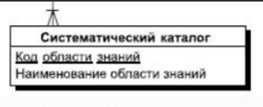  
  - Необязательные обозначаются пустым кругом. 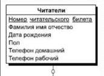  

> Пример ER модели:
>
> 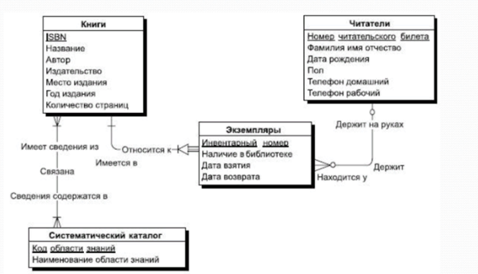  

ER-модель допускает **принцип категоризации сущности**: *сущность может быть представлена в виде нескольких своих подтипов-сущностей*, каждая из которых может иметь общие атрибуты и отношения, которые определяются однажды, на верхнем уровне, и наследуются на нижнем уровне. При этом все подтипы одной сущности рассматривать как взаимоисключающие.

Сущность, на основе которой строятся подтипы, называется **суперсущность (супертип)**. Любой экземпляр супертипа должен относиться к конкретному типу.

---

```md
Далее пойдут **нормальные формы**, знать очень важно!
```

---

## 17. Даталогическое проектирование. **Первая нормальная форма**

**Нормализация** – это метод проектирования базы данных, который позволяет привести базу данных **к минимальной избыточности**.

**Избыточность данных** создает предпосылки для появления различных аномалий, снижает производительность, и делает управление данными не гибким и не очень удобным.

### Ненормализованная форма (НФ)

**Ненормализованная форма (НФ)** - это форма организации данных в реляционной базе данных, в которой таблицы **содержат повторяющиеся группы данных и/или непростые значения в столбцах.**

Пример таблицы в ненормализованной форме:

| CustomerID | CustomerName | OrderID | OrderDate | ProductID | ProductName | Quantity |
|------------|--------------|---------|-----------|-----------|-------------|----------|
| 1          | John         | 101     | 2021-01-01| 1         | Apple       | 3        |
| 1          | John         | 101     | 2021-01-01| 2         | Banana      | 2        |
| 2          | Lisa         | 102     | 2021-01-02| 1         | Apple       | 1        |
| 2          | Lisa         | 102     | 2021-01-02| 3         | Orange      | 4        |

В этом примере таблица **содержит повторяющиеся значения для каждого заказа.** Для каждого заказа существует дублирование информации о клиенте. Также каждая строка содержит информацию о конкретном продукте, включая его название, но название продукта также повторяется для каждого заказа, где этот продукт присутствует.

Это неэффективное использование хранения данных, так как дублирование может привести к проблемам, таким как сложности обновления информации и непоследовательность данных.

**Основная цель нормализации данных состоит в том, чтобы избавиться от повторяющихся данных и устранить аномалии, возникающие при обновлении и вставке данных.**

### Первая нормальная форма (1НФ)

**Первая нормальная форма (1НФ)** - это первый уровень нормализации данных в реляционной базе данных. В 1НФ **все значения в таблице являются атомарными, то есть они не могут быть разделены на более мелкие части.**

Критерии для достижения 1НФ:

1. Каждая ячейка в таблице должна содержать **только одно значение**.
2. **Уникальный идентификатор** должен быть определен для каждой строки (обычно это первичный ключ).

Пример таблицы в ненормализованной форме:

| CustomerID | CustomerName | OrderID | OrderDate | ProductID | ProductName | Quantity |
|------------|--------------|---------|-----------|-----------|-------------|----------|
| 1          | John         | 101     | 2021-01-01| 1, 2      | Apple, Banana | 3, 2  |
| 2          | Lisa         | 102     | 2021-01-02| 1, 3      | Apple, Orange | 1, 4  |

Пример таблицы в первой нормальной форме:

**Таблица Customers:**

| CustomerID | CustomerName |
|------------|--------------|
| 1          | John         |
| 2          | Lisa         |

**Таблица Orders:**

| OrderID | CustomerID | OrderDate   |
|---------|------------|-------------|
| 101     | 1          | 2021-01-01  |
| 102     | 2          | 2021-01-02  |

**Таблица OrderItems:**

| OrderID | ProductID | ProductName | Quantity |
|---------|-----------|-------------|----------|
| 101     | 1         | Apple       | 3        |
| 101     | 2         | Banana      | 2        |
| 102     | 1         | Apple       | 1        |
| 102     | 3         | Orange      | 4        |

В этом примере изначальная таблица была разделена на три таблицы в первой нормальной форме. Таблица Customers содержит информацию о клиентах, таблица Orders содержит информацию о заказах, а таблица OrderItems содержит информацию о продуктах, связанных с каждым заказом.

```none
В результате получается структура данных, где значения столбцов являются атомарными, и каждая таблица имеет уникальный идентификатор (первичный ключ), что соответствует критериям 1НФ.
```

## 18. Даталогическое проектирование. **Вторая нормальная форма**

**Вторая нормальная форма (2НФ)** - это второй уровень нормализации данных в реляционной базе данных. В 2НФ таблица должна быть в 1НФ, **и все неключевые атрибуты должны полностью зависеть от первичного ключа**.

Критерии для достижения 2НФ:

1. Таблица должна быть в 1НФ.
2. Все неключевые атрибуты **должны полностью зависеть от каждой части составного первичного ключа**.

Пример таблицы в первой нормальной форме:

**Таблица Orders:**

| OrderID | CustomerID | OrderDate   | ProductID | ProductName | Quantity |
|---------|------------|-------------|-----------|-------------|----------|
| 101     | 1          | 2021-01-01  | 1         | Apple       | 3        |
| 101     | 1          | 2021-01-01  | 2         | Banana      | 2        |
| 102     | 2          | 2021-01-02  | 1         | Apple       | 1        |
| 102     | 2          | 2021-01-02  | 3         | Orange      | 4        |

Пример таблицы во второй нормальной форме:

**Таблица Customers:**

| CustomerID | CustomerName |
|------------|--------------|
| 1          | John         |
| 2          | Lisa         |

**Таблица Orders:**

| OrderID | CustomerID | OrderDate   |
|---------|------------|-------------|
| 101     | 1          | 2021-01-01  |
| 102     | 2          | 2021-01-02  |

**Таблица Products:**

| ProductID | ProductName |
|-----------|-------------|
| 1         | Apple       |
| 2         | Banana      |
| 3         | Orange      |

**Таблица OrderItems:**

| OrderID | ProductID | Quantity |
|---------|-----------|----------|
| 101     | 1         | 3        |
| 101     | 2         | 2        |
| 102     | 1         | 1        |
| 102     | 3         | 4        |

В этом примере таблица **Orders была разделена на три таблицы**: Customers, Orders и OrderItems. Таблица Customers содержит информацию о клиентах, таблица Orders содержит информацию о заказах, а таблица OrderItems содержит информацию о продуктах и их количестве в каждом заказе.

```none
Теперь все атрибуты полностью зависят от первичного ключа. Каждая таблица содержит только те атрибуты, которые непосредственно связаны с соответствующими сущностями, что соответствует критериям 2НФ.
```

## 19. Даталогическое проектирование. **Третья нормальная форма**

**Третья нормальная форма (3НФ)** - это третий уровень нормализации данных в реляционной базе данных. В 3НФ таблица должна быть в 2НФ, и **все неключевые атрибуты должны зависеть только от первичного ключа, а не от других неключевых атрибутов.**

Критерии для достижения 3НФ:

1. Таблица должна быть в 2НФ.
2. Все неключевые атрибуты должны зависеть только от каждого отдельного первичного ключа, а не от других неключевых атрибутов.

Пример таблицы во второй нормальной форме:

**Таблица Customers:**

| CustomerID | CustomerName | CustomerAddress |
|------------|--------------|-----------------|
| 1          | John         | 123 Main St     |
| 2          | Lisa         | 456 Elm St      |

**Таблица Orders:**

| OrderID | CustomerID | OrderDate   |
|---------|------------|-------------|
| 101     | 1          | 2021-01-01  |
| 102     | 2          | 2021-01-02  |

**Таблица Products:**

| ProductID | ProductName | ProductPrice |
|-----------|-------------|--------------|
| 1         | Apple       | 1.99         |
| 2         | Banana      | 0.99         |
| 3         | Orange      | 1.49         |

**Таблица OrderItems:**

| OrderID | ProductID | Quantity |
|---------|-----------|----------|
| 101     | 1         | 3        |
| 101     | 2         | 2        |
| 102     | 1         | 1        |
| 102     | 3         | 4        |

Пример таблицы в третьей нормальной форме:

**Таблица Customers:**

| CustomerID | CustomerName | CustomerAddress |
|------------|--------------|-----------------|
| 1          | John         | 123 Main St     |
| 2          | Lisa         | 456 Elm St      |

**Таблица Orders:**

| OrderID | CustomerID | OrderDate   |
|---------|------------|-------------|
| 101     | 1          | 2021-01-01  |
| 102     | 2          | 2021-01-02  |

**Таблица Products:**

| ProductID | ProductName |
|-----------|-------------|
| 1         | Apple       |
| 2         | Banana      |
| 3         | Orange      |

**Таблица OrderItems:**

| OrderID | ProductID | Quantity |
|---------|-----------|----------|
| 101     | 1         | 3        |
| 101     | 2         | 2        |
| 102     | 1         | 1        |
| 102     | 3         | 4        |

**Таблица ProductPrices:**

| ProductID | ProductPrice |
|-----------|--------------|
| 1         | 1.99         |
| 2         | 0.99         |
| 3         | 1.49         |

В этом примере таблица Products была разделена на две таблицы: Products и ProductPrices. Таблица Products содержит только атрибуты, связанные с продуктами, а таблица ProductPrices содержит информацию о ценах на продукты.

```none
Теперь все неключевые атрибуты зависят только от первичного ключа каждой таблицы, а не от других неключевых атрибутов, что соответствует критериям 3НФ. Это способствует избежанию аномалий и обеспечивает более эффективную структуру данных.
```

## 20. Даталогическое проектирование. **Нормальная форма Бойса-Кодда**

**Нормальная форма Бойса-Кодда (НФБК)** - это четвёртый уровень нормализации данных в реляционной базе данных. В НФБК таблица должна быть в третьей нормальной форме (3НФ) и **не должна иметь зависимостей между неключевыми атрибутами.**

Критерии для достижения НФБК:

1. Таблица должна быть в 3НФ.
2. **Не должно быть транзитивных зависимостей** между неключевыми атрибутами.

Пример таблицы в третьей нормальной форме:

**Таблица Customers:**

| CustomerID | CustomerName | CustomerAddress |
|------------|--------------|-----------------|
| 1          | John         | 123 Main St     |
| 2          | Lisa         | 456 Elm St      |

**Таблица Orders:**

| OrderID | CustomerID | OrderDate   |
|---------|------------|-------------|
| 101     | 1          | 2021-01-01  |
| 102     | 2          | 2021-01-02  |

**Таблица Products:**

| ProductID | ProductName |
|-----------|-------------|
| 1         | Apple       |
| 2         | Banana      |
| 3         | Orange      |

**Таблица OrderItems:**

| OrderID | ProductID | Quantity |
|---------|-----------|----------|
| 101     | 1         | 3        |
| 101     | 2         | 2        |
| 102     | 1         | 1        |
| 102     | 3         | 4        |

Пример таблицы в нормальной форме Бойса-Кодда:

**Таблица Customers:**

| CustomerID | CustomerName | CustomerAddress |
|------------|--------------|-----------------|
| 1          | John         | 123 Main St     |
| 2          | Lisa         | 456 Elm St      |

**Таблица Orders:**

| OrderID | CustomerID | OrderDate   |
|---------|------------|-------------|
| 101     | 1          | 2021-01-01  |
| 102     | 2          | 2021-01-02  |

**Таблица Products:**

| ProductID | ProductName |
|-----------|-------------|
| 1         | Apple       |
| 2         | Banana      |
| 3         | Orange      |

**Таблица OrderItems:**

| OrderID | OrderItemID | ProductID | Quantity |
|---------|-------------|-----------|----------|
| 101     | 1           | 1         | 3        |
| 101     | 2           | 2         | 2        |
| 102     | 1           | 1         | 1        |
| 102     | 2           | 3         | 4        |

```none
В этом примере таблица OrderItems была дополнена новым атрибутом OrderItemID, который служит первичным ключом для таблицы OrderItems. Такая структура позволяет избежать транзитивных зависимостей между неключевыми атрибутами, что соответствует критериям НФБК.
```

---

```none
Всего существует 7 нормальных форм, но эти 4 являются фундаментальными.
```

**Для примера 4:**

**Четвёртая нормальная форма (4НФ)** - это четвёртый уровень нормализации данных в реляционной базе данных. В 4НФ таблица должна быть в третьей нормальной форме (3НФ) и не должна иметь многозначных зависимостей.

Критерии для достижения 4НФ:

1. Таблица должна быть в 3НФ.
2. Не должно быть многозначных зависимостей.

Многозначная зависимость - это ситуация, когда один или более атрибутов в таблице зависят от других атрибутов, образуя множество возможных значений для каждого набора ключевых атрибутов.

Пример таблицы в третьей нормальной форме:

**Таблица Students:**

| StudentID | StudentName | Course       | Instructor |
|-----------|-------------|--------------|------------|
| 1         | John        | Math         | Smith      |
| 2         | Lisa        | Science      | Johnson    |
| 3         | Mark        | Math         | Smith      |
| 4         | Emily       | History      | Brown      |

Пример таблицы в четвёртой нормальной форме:

**Таблица Students:**

| StudentID | StudentName |
|-----------|-------------|
| 1         | John        |
| 2         | Lisa        |
| 3         | Mark        |
| 4         | Emily       |

**Таблица Courses:**

| CourseID | Course      |
|----------|-------------|
| 1        | Math        |
| 2        | Science     |
| 3        | History     |

**Таблица Instructors:**

| InstructorID | Instructor |
|--------------|------------|
| 1            | Smith      |
| 2            | Johnson    |
| 3            | Brown      |

**Таблица StudentCourses:**

| StudentID | CourseID |
|-----------|----------|
| 1         | 1        |
| 2         | 2        |
| 3         | 1        |
| 4         | 3        |

В этом примере таблица Students была разделена на несколько таблиц: Students, Courses и Instructors. Затем была создана отдельная таблица StudentCourses для связи студентов с курсами, удалив тем самым многозначные зависимости. Каждая таблица содержит только уникальные значения атрибутов, что соответствует критериям 4НФ.

---

## 21. Преобразование ER-модели в реляционную модель данных

1. Каждой сущности ставится в соответствие **отношение реляционной** модели данных. При этом имена сущности и отношения могут быть различными (имена отношений могут быть ограничены требованиями конкретной СУБД).
2. Каждый **атрибут сущности** становится атрибутом соответствующего отношения. Переименование атрибутов должно происходить в соответствии с теми же правилами, что и переименование отношений в п.1. Для каждого атрибута задаётся конкретный допустимый в СУБД тип данных и допустимость или недопустимость NULL значений для него.
3. **Первичный ключ** сущности становится PRIMARY KEY соответствующего отношения. Атрибуты, входящие в первичный ключ отношения, автоматически получают свойство обязательности (NOT NULL). В каждое отношение, соответствующее **подчинённой сущности**, добавляется набор атрибутов основной сущности, являющейся первичным ключом основной сущности. В отношении, соответствующем подчинённой сущности, этот набор атрибутов становится **внешним ключом** (FOREIGN KEY).
    > Пример 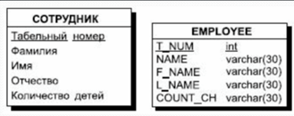  
4. Для моделирования необязательного типа связи на физическом уровне у атрибутов, соответствующих внешнему ключу, устанавливается свойство допустимости неопределённых значений (признак NULL). При обязательном типе связи атрибуты получают свойство отсутствия неопределённых значений (признак NOT NULL).
5. Для отражения категоризации сущностей при переходе к реляционной модели возможны несколько вариантов представления:
    - Возможно создать только одно отношение для всех подтипов одного супертипа. В него включают все атрибуты всех подтипов. Однако тогда для ряда экземпляров ряд атрибутов не будет иметь смысла. Достоинство - создаётся всего одно отношение.
    - При втором способе для каждого подтипа и для супертипа создаются свои отдельные отношения. Недостаток - создаётся много отношений, однако работа ведётся только со значимыми атрибутами подтипа. Кроме того, для возможности переходов к подтипам от супертипа необходимо в супертип включить идентификатор связи.
  
    Необходимо указать тип дескриминатора - взаимоисключающий (М/Е, mutuallly exclusive) или нет. Тип М/Е означает, что один экземпляр сущности супертипа связан только с одним экземпляром сущности подтипа и для каждого экземпляра сущности супертипа существует потомок. Также необходимо указать, что наследуется в подтипы - только идентификатор супертипа или все атрибуты супертипа.

### Разрешение связей типа "многие-ко-многим"

Используется специальный механизм преобразования - вводится специальное дополнительное связующее отношение, которое связано с каждым исходным связью "один-ко-многим", атрибутами этого отношения являются первичные ключи связываемых отношений.

При этом каждый из атрибутов нового отношения является внешним ключом (FOREIGN KEY), а вместе они образуют первичный ключ (PRIMARY KEY) нового связующего отношения.

Теория нормализации применима к модели "сущность-связь". Поэтому нормализацию можно проводить и на уровне инфологической (семантической) модели и смысл её аналогичен нормализации реляционной модели.

## 22. Язык SQL. Типы данных

**SQL (Structured Query Language)** – структурирлованный язык запросов – стандартный язык запросов по работе с реляционными БД.

**Структура SQL:**

- Операторы определения данных - Data Definition Language (DDL)
- Операторы манипулирования данными Data Manipulation Language (DML) (базируется на операциях реляционной алгебры)
- Язык запросов Data Query Language (DQL) (базируются на языках реляционной алгебры)
- Средства управления транзакциями
- Средства администрирования данных

В коммерческих СУБД набор основных операторов расширен. В большинство СУБД включены операторы определения и запуска хранимых процедур и операторы определения триггеров.

**Типы данных:**

  

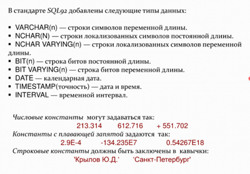  

В СУБД также могут существовать и специальные **системные константы**. Стандарт SQL/89 определяет только одну системную константу USER – имя, под которым пользователь подключился к БД.

## 23. Язык SQL. Операторы определения данных DDL

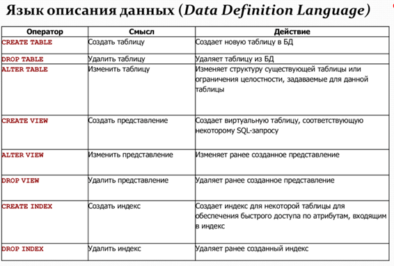  

### Операторы DDL с заданием ограничений целостности

**Целостность** - одно из основополагающих понятий в технологии БД. Это соответствие *информационной модели предметной области*, хранимой в БД, объектам реального мира и их взаимосвязи в любой момент времени.

Любое значимое изменение в предметной области должно отражаться в БД, и при этом должна сохраняться однозначная интерпретация информационной модели в терминах предметной области.

**Поддержка целостности** в реляционной модели данных включает в себя 4 аспекта:

1. **Поддержка структурной целостности** - реляционная СУБД должна допускать работу только с однородными структурами данных типа "реляционное отношение"
2. **Поддержка языковой целостности** - реляционная СУБД должна обеспечивать языки описания и манипулирования данными не ниже стандарта SQL
3. **Поддержка ссылочной целостности** - обеспечение одного из заданных принципов взаимосвязи между экземплярами кортежей взаимосвязанных отношений: каскадное изменение и удаление.
4. **Семантическая целостность** - (используется, когда предыдущие 3 не выполняются) может быть обеспечена 2 путями: декларативный и процедурный.
    - Декларативный связан с наличием механизмов в рамках СУБД, которые обеспечивают проверку и выполнения ряда декларативных правил-ограничений. Например, ограничение целостности атрибута. Мы его по умолчанию задаем, можем задать обязательность (необязательность), пределы. Декларативные ограничения – немедленно проверяемые.
    - Процедурные ограничения – откладываемые, они осуществляются с помощью транзакций и триггеров.

Эти виды целостности определяют правила работы СУБД с РБД. **Каждая СУБД должна уметь это делать**, а разработчики должны это учитывать при построении РБД.

Набор операторов языка SQL принято называть **скриптом**.

Тогда скрипт для некоторых таблиц БД "Библиотека" будет выглядеть следующим образом:

```sql
CREATE TABLE BOOKS
(
ISBN (название) varchar (120) (тип данных) NOT NULL (доп.оограничение столбца), PRIMARY KEY (ограничение уникальности столбца),
TITLE varchar (120) NOT NULL,
YEAR_PUBL smallint DEFAULT (Year (Now)) (значение по умолчанию),
PUBLICH varchar (20) NULL,
PAGES smallint CHECK (PAGES >=5 AND PAGES <= 1000) (условие проверки на допустимость),
)
```

### Оператор модификации таблиц

#### ```ALTER TABLE```

```sql
ALTER TABLE table_name
ADD column_name datatype;
```

- позволяет выполнить следующие операции изменения для схемы таблиц:
- Добавить новый столбец в уже существующую заполненную таблицу
- Изменить значение по умолчанию для какого-либо столбца
- Удалить столбец из существующей таблицы
- Добавить или удалить первичный ключ таблицы
- Добавить или удалить внешний ключ таблицы
- Добавить или удалить условие уникальности
- Добавить или удалить условие проверки для любого столбца или для таблицы в целом

#### ```DROP TABLE```

Синтаксис: `DROP TABLE` <имя таблицы> [`CASCADE` | `RESTRICT`]

- `CASCADE` – при удалении таблицы будут удаляться все связанные с ней объекты.
- `RESTRICT` – все объекты, связанные с таблицей, не будут уничтожены.

Удаление таблицы, не должно нарушать целостности БД. Удаляем в порядке обратном созданию.

```sql
DROP DATABASE testDB;
```

## Язык SQL. Операторы манипулирования данными DML

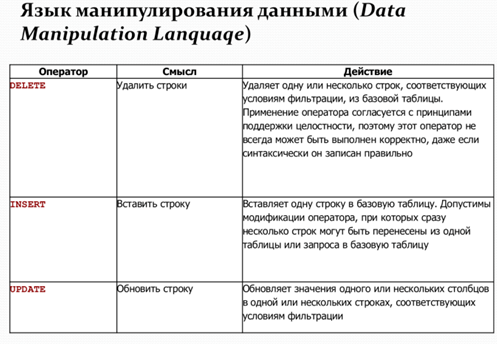  

- **DELETE** - statement is used to delete existing records in a table.

```sql
DELETE FROM table_name WHERE condition;
```

- **INSERT INTO** - statement is used to insert new records in a table.

```sql
INSERT INTO Customers (CustomerName, ContactName, Address, City, PostalCode, Country)
VALUES ('Cardinal', 'Tom B. Erichsen', 'Skagen 21', 'Stavanger', '4006', 'Norway');
```

- **UPDATE** - statement is used to modify the existing records in a table.

```sql
UPDATE table_name
SET column1 = value1, column2 = value2, ...
WHERE condition;
```

## 25. Язык SQL. Оператор выбора DQL

### SELECT

Единственный оператор выбора **SELECT** реализует все операции реляционной алгебры. Один и тот же запрос может быть реализован несколькими способами.

```sql
SELECT [ALL|DISTINCT](<Список полей>|*)

FROM <Список таблиц>

[WHERE<Предикат-условие выборки или соединения>]

[GROUP BY<Список полей результата>]

[HAVING<Предикат-условие для группы>]

[ORDER BY<Список полей, по которым упорядочить вывод>]
```

```sql
SELECT column1, column2, ...
FROM table_name;
```

The **HAVING** clause was added to SQL because the WHERE keyword cannot be used with aggregate functions.

```sql
SELECT COUNT(CustomerID), Country
FROM Customers
GROUP BY Country
HAVING COUNT(CustomerID) > 5
ORDER BY COUNT(CustomerID) DESC;
```

### Агрегатные функии

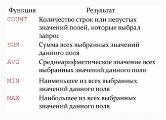  

```sql
SELECT R1. Оценка, R1. Дисциплина, COUNT (*), AVG(Оценка)
FROM R1, R2
WHERE R1. ФИО = R2. ФИО
AND R1. Оценка IS NOT NULL
AND R1. Оценка> 2
GROUP BY R1. Оценка R1. Дисциплина
```

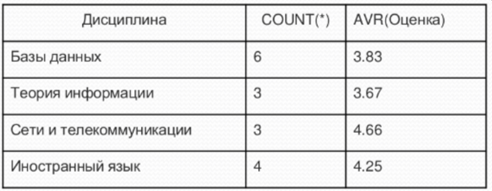  

## 26. Язык SQL. Средства администрирования данных

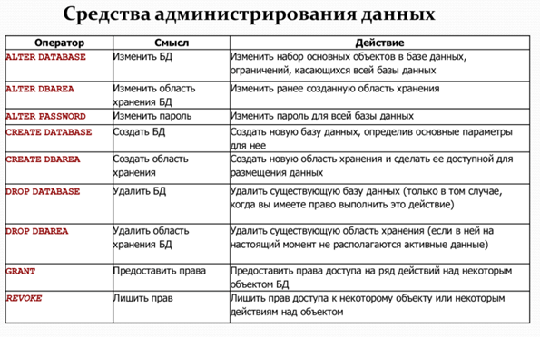  

The **CREATE TABLE** statement is used to create a new table in a database.

```sql
CREATE TABLE Persons (
    PersonID int,
    LastName varchar(255),
    FirstName varchar(255),
    Address varchar(255),
    City varchar(255)
);
```

**PASSWORD** используется системой аутентификации в MySQL для генерации хэшированного пароля из строки пароля обычного текста с использованием более мощных методов хеширования.

Команда **GRANT** используется для назначения привилегий пользователям.

>Пример: передача прав на SELECT STUDENT
>
> ```sql
> GRANT SELECT ON Student TO P2;
> ```

## 27. Защита информации в базах данных

В современных СУБД поддерживается один из двух подходов к вопросу обеспечения безопасности данных: **избирательный подход** и **обязательный подход**.

В обоих подходах единицей данных или «объектом данных», для которых должна быть создана система безопасности, может быть как вся база данных целиком, так и любой объект внутри базы данных.

Необходимо поддерживать два фундаментальных принципа:

- **Проверка полномочий** – каждому пользователю соответствует набор действий, которые он может выполнять по отношению к определенным объектам.

- **Проверка подлинности** – достоверное подтверждение того, что пользователь, пытающийся выполнить санкционированное действие, действительно тот, за кого он себя выдает.

При избирательном подходе в БД **добавляется** новый объект – **пользователь**, которому присваивается уникальный пароль и идентификатор. Сисадмину доступен идентификатор пользователя. Пользователи могут быть объединены в группы (или несколько групп) с разными правами. **PUBLIC – минимальный набор прав (группа по умолчанию).**

```WITH GRANT OPTION``` – определяется режим, при котором передаются не только права на указанные действия, но и право передавать эти права другим пользователям.

## 28. Реализация реляционной модели данных в СУБД

Реляционная модель данных является основой для большинства современных систем управления базами данных (СУБД). Она представляет данные в виде таблиц, состоящих из строк и столбцов, где каждая строка представляет отдельную запись, а каждый столбец представляет отдельное поле данных.

1. Каждой сущности ставится в соответствие отношение реляционной модели данных. При этом имена сущности и отношения могут быть различными (имена отношений могут быть ограничены требованиями конкретной СУБД).
2. Каждый атрибут сущности становится атрибутом соответствующего отношения. Переименование атрибутов должно происходить в соответствии с теми же правилами, что и переименование отношений в п.1. Для каждого атрибута задается конкретный допустимый в СУБД тип данных и обязательность или необязательность данного атрибута (то есть допустимость или недопустимость NULL значений для него).
3. Первичный ключ сущности становится PRIMARY KEY соответствующего отношения. Атрибуты, входящие в первичный ключ отношения, автоматически получают свойство обязательности (NOT NULL).
4. В каждое отношение, соответствующее подчиненной сущности, добавляется набор атрибутов основной сущности, являющейся первичным ключом основной сущности. В отношении, соответствующем подчиненной сущности, этот набор атрибутов становится внешним ключом (FOREIGN KEY).
5. Для моделирования необязательного типа связи на физическом уровне у атрибутов, соответствующих внешнему ключу, устанавливается свойство допустимости неопределенных значений (признак NULL). При обязательном типе связи атрибуты получают свойство отсутствия неопределенных значений (признак NOT NULL).
6. Для отражения категоризации сущностей при переходе к реляционной модели возможны несколько вариантов представления.
    - Возможно создать только одно отношение для всех подтипов одного супертипа. В него включают все атрибуты всех подтипов. Однако тогда для ряда экземпляров ряд атрибутов не будет иметь смысла.Достоинство - создается всего одно отношение.
    - При втором способе для каждого подтипа и для супертипа создаются свои отдельные отношения. Недостаток - создается много отношений, однако работа ведется только со значимыми атрибутами подтипа. Кроме того, для возможности переходов к подтипам от супертипа необходимо в супертип включить идентификатор связи.

Необходимо указать тип дискриминатора -взаимоисключающий (M/E, mutually exclusive) или нет. Тип M/E означает, что один экземпляр сущности супертипа связан только с одним экземпляром сущности подтипа и для каждого экземпляра сущности супертипа существует потомок. Также необходимо указать, что наследуется в подтипы - только идентификатор супертипа или все атрибуты супертипа.

## 29. Распределенная обработка данных. Клиент-серверная архитектура

### Распределенная обработка данных

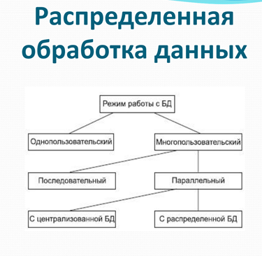  

### Клиент-серверная архитектура

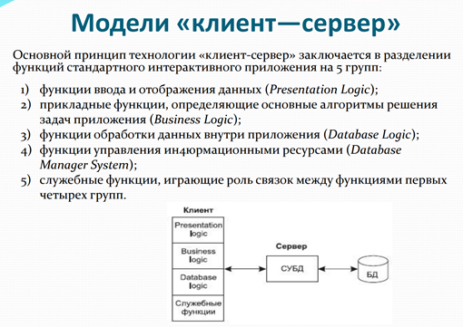  

## 30. Файл-серверная архитектура. Модель удаленного управления данными

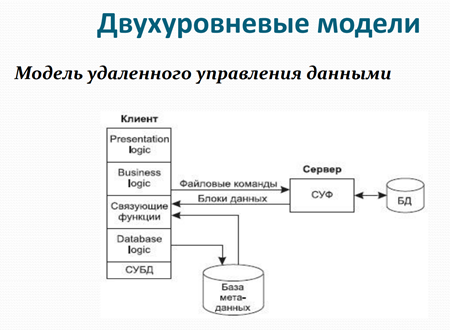  

  

## 31. Двухуровневая клиент-серверная архитектура. Модель удаленного доступа к данным

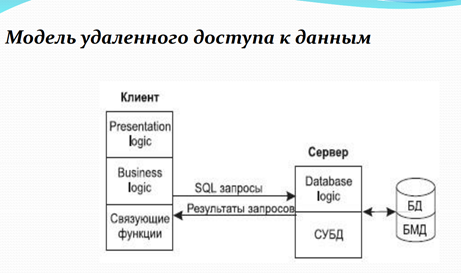  

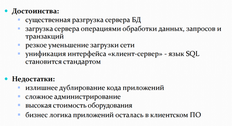  

## 32. Двухуровневая клиент-серверная архитектура. Модель сервера баз данных

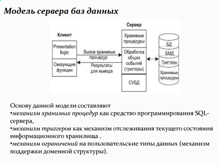  

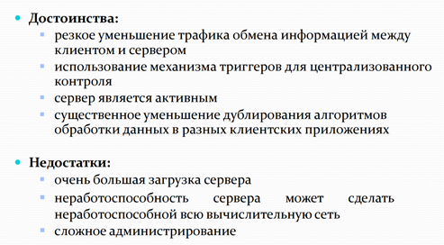  

## 33. Трехуровневая клиент-серверная архитектура. Модель сервера приложений

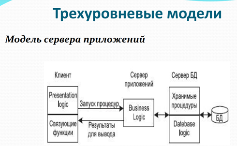  

  

## 34. Трехуровневая клиент-серверная архитектура. Модель доступа через Internet/Intranet

  

## 35. Варианты моделей серверов баз данных

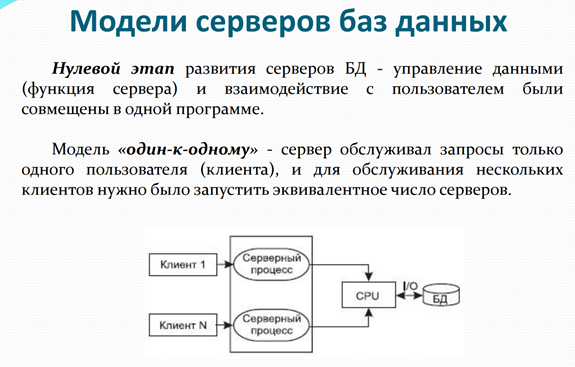  

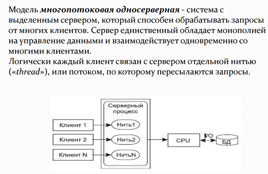  

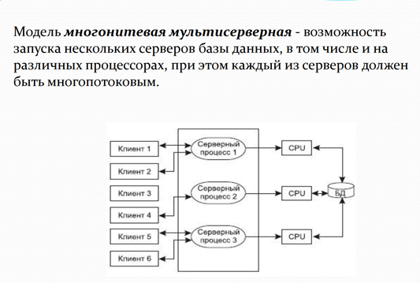  

## 36. Типы параллелизма в многопотоковой архитектуре

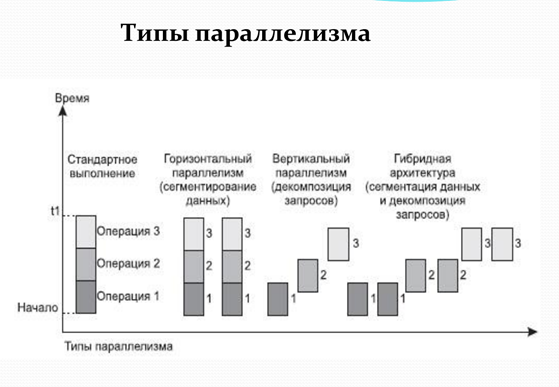  

  

## Самопроверка

- 1. Назначение, компоненты базы, банка данных, СУБД. Роль и место баз данных в информационных системах
  - Назначение
  - Компоненты
  - Компоненты БД
  - Компоненты СУБД
  - Роль БД
- 2. Этапы развития БД. Системы распределенного доступа.
Настольные СУБД
  - Этап распределённого доступа к данным
  - Эпоха Персональных Компьютеров
  - Этапы развития БД. Распределенные БД. Технология интране
- 4. Архитектура БД
  - Трехуровневая
  - Внешний уровень
  - Концептуальный уровень
  - Физическая БД
- 5. Процесс прохождения пользовательского запроса
  - База метаданных
  - Рисунок
  - Шаги с 1 по 12
- 6. Классификация моделей данных. Документальные модели
  - Модели данных
  - Инфологическая
  - Даталогическая
    - Документальные
      - Ориентированные на формат документа
      - Дескрипторные
      - Тезарусные
    - Фактографические
  - Физические
- 7. Теоретико-графовые модели данных. Иерархическая модель
данных
  - Иерархическая модель
  - Компоненты в модели
  - Ограничения
  - Связи
- 8. Теоретико-графовые модели данных. Сетевая модель
  - Элементы
  - Тип связи
  - Ограничения
  - Пример
- 9. Реляционная модель. Основные определения
  - Отношение
  - Вид
  - Компоненты
  - Ограничения
  - Связи
- 10. Реляционная алгебра. Основные операции: объединение,
вычитание, декартово произведение
  - UNION
  - MINUS
  - TIMES
- 11. Реляционная алгебра. Основные операции: проекция, селекция
  - PROJECT
  - SELECT
- 12. Реляционная алгебра. Дополнительные операции: пересечение,
деление, соединение
  - INTERSECTION
  - DIVISION
  - JOIN
- 13. Функциональные зависимости атрибутов
  - Нормализация
  - Функциональные зависимости
  - Зачем нужно?
  - Пример
- 14. Этапы проектирования реляционной БД
  - Системные анализ
  - Нормальные формы
  - Описание предметной области
  - Инфологическая модель
  - Логическое проектирование
  - Физическая модель
- 15. Системный анализ предметной области. Пример
  - Связи
  - Описание
  - Пример
- 16. Инфологическое проектирование. Модель «сущность – связь»
  - ER-модель
  - Компоненты
    - Сущность
    - Атрибуты
    - Связи
  - Пример
- 17. Даталогическое проектирование. Первая нормальная форма
  - НФ
  - Зачем нужно
  - Критерии
  - Итог
- 18. Даталогическое проектирование. Вторая нормальная форма
  - Зачем нужно
  - Критерии
  - Итог
- 19. Даталогическое проектирование. Третья нормальная форма
  - Зачем нужно
  - Критерии
  - Итог
- 20. Даталогическое проектирование. Нормальная форма Бойса-Кодда
  - Зачем нужно
  - Критерии
  - Итог
- 21. Преобразование ER-модели в реляционную модель данных
  - Шаги
  - Соответствие отношений
  - Атрибуты сущностей
  - Главные и подчиненные сущности
  - Ограничения
  - Способы отражения категоризации
  - Разрешение связей "многие-ко-многим"
- 22. Язык SQL. Типы данных
  - Что это
  - Структура SQL
  - Типы данных
- 23. Язык SQL. Операторы определения данных DDL
  - Что такое DDL
  - Целостность
  - Поддержка целостности
  - Операторы
- 24. Язык SQL. Операторы манипулирования данными DML
  - DELETE
  - INSERT
  - UPDATE
- 25. Язык SQL. Оператор выбора DQL
  - SELECT
    - SYNTAX
  - Агрегатные функции
- 26. Язык SQL. Средства администрирования данных
  - ALTER
  - DROP
  - GRANT
  - REVOKE
- 27. Защита информации в базах данных
  - Два подхода: избирательный и обязательный
  - Два функциональных принципа: проверка полномочий и проверка подлинности
- 28. Реализация реляционной модели данных в СУБД.
- 29. Распределенная обработка данных. Клиент-серверная архитектура
  - Однопользовательский
  - Многопользовательский
    - Последовательный
    - Параллельный
      - С центр. БД
      - С распр. БД
  - Клиент-Сервер
    - Функции клиента
- 30. Файл-серверная архитектура. Модель удаленного управления данными
  - Рисунок
  - Достоинства
  - Недостатки
- 31. Двухуровневая клиент-серверная архитектура. Модель удаленного доступа к данным
  - Рисунок
  - Достоинства
  - Недостатки
- 32. Двухуровневая клиент-серверная архитектура. Модель сервера баз данных
  - Рисунок
  - Механизм
  - Достоинства
  - Недостатки
- 33. Трехуровневая клиент-серверная архитектура. Модель сервера приложений
  - Рисунок
  - Механизм
  - Достоинства
  - Недостатки
- 34. Трехуровневая клиент-серверная архитектура. Модель доступа через Internet/Intranet
  - Клиент
  - Браузер
  - Особенности
- 35. Варианты моделей серверов баз данных
  - Один-к-одному
  - Многопоточная на потоках
  - Многопоточная мультисервисная
  - Рисунок
- 36. Типы параллелизма в многопотоковой архитектуре
  - Стандартное
  - Горизонтальное
  - Вертикальная
  - Гибридная
  - Рисунки
