# Технологии Программирования

## Основные принципы и понятия ООП

**ООП (объектно-ориентированное программирование)** - это парадигма программирования, которая позволяет организовывать код в виде объектов, объединяющих данные и функциональность в одном блоке. В ООП данные и функции, работающие с этими данными, объединяются в классы, которые затем используются для создания экземпляров объектов. Ниже приведены основные принципы и понятия ООП.

### Классы и объекты

- **Классы** - это шаблоны или определения, которые описывают состояние (переменные) и поведение (методы) объектов, которые будут созданы на их основе. Класс определяет структуру объекта, но сам по себе не является объектом.
- **Объекты** - это экземпляры классов. Они представляют собой конкретные данные и функциональность, которые определены в классе. Объекты могут взаимодействовать друг с другом через методы или через доступ к их состоянию.
  
### **Столпы ООП**

### 1. Инкапсуляция

- **Инкапсуляция** - это механизм, позволяющий объединить данные и методы, работающие с этими данными, внутри класса и скрыть их от прямого доступа извне. В ООП данные и методы класса могут быть объявлены с различными уровнями доступа, такими как публичный, приватный или защищенный, чтобы определить, какие части кода могут использовать или изменять данные и вызывать методы объекта.

### 2. Наследование

- **Наследование** - это механизм, позволяющий создавать новые классы на основе уже существующих. Класс, который наследует свойства и методы другого класса, называется **подклассом** или **производным классом**, а класс, от которого наследуются свойства и методы, называется **суперклассом** или **базовым классом**. Подкласс может добавлять новые свойства и методы или изменять существующие, расширяя или специализируя функциональность суперкласса.

### 3. Полиморфизм

- **Полиморфизм** - это возможность объектов с одним и тем же интерфейсом иметь различную реализацию. Это позволяет использовать объекты разных классов с общим интерфейсом без необходимости знать их конкретный тип. Полиморфизм позволяет работать с объектами, исходя из их общих абстракций, что способствует гибкости и переиспользованию кода.

### 4. Абстракция

- **Абстракция** - это процесс выделения существенных характеристик объекта, игнорируя незначительные детали. В ООП абстракция используется для определения классов и интерфейсов, которые описывают общие характеристики группы объектов. Абстрактный класс или интерфейс определяют общие свойства и методы, но сами по себе не могут быть инстанциированы.

---

## Принципы SOLID

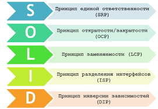

**Принципы SOLID** - это набор принципов, разработанных Робертом Мартином (также известным как "Дядя Боб"), которые помогают разработчикам создавать гибкие, расширяемые и поддерживаемые программные системы. Эти принципы являются основой для достижения высокого уровня архитектурного качества в объектно-ориентированном программировании. Давайте рассмотрим каждый из принципов SOLID:

### 1. Принцип единственной ответственности (Single Responsibility Principle - SRP)

**Принцип SRP** гласит, что каждый класс должен быть ответственен только за одну задачу или иметь только одну причину для изменения. Это означает, что класс должен иметь одну и только одну основную ответственность. Если класс имеет более одной ответственности, изменения в одной из них могут привести к сложностям и непредсказуемому поведению.

### 2. Принцип открытости/закрытости (Open/Closed Principle - OCP)

**Принцип OCP** заключается в том, что программные сущности, такие как классы, модули и функции, должны быть открыты для расширения, но закрыты для модификации. Вместо того чтобы изменять существующий код, он должен быть расширяем путем добавления нового кода или функциональности. Это позволяет избежать негативного влияния изменений на уже работающую систему.

### 3. Принцип подстановки Барбары Лисков (Liskov Substitution Principle - LSP)

**Принцип LSP** утверждает, что объекты должны быть заменяемыми на экземпляры их подтипов без изменения корректности программы. Другими словами, если S является подтипом T, то объекты типа T могут быть заменены объектами типа S без изменения свойств программы. Этот принцип гарантирует, что наследуемые классы не нарушают ожидаемое поведение базовых классов.

### 4. Принцип разделения интерфейса (Interface Segregation Principle - ISP)

**Принцип ISP** говорит о том, что клиенты не должны зависеть от интерфейсов, которые они не используют. Вместо того чтобы создавать общие интерфейсы, которые содержат множество методов, следует создавать специфические интерфейсы, предназначенные для конкретных клиентов. Это позволяет клиентам использовать только те методы, которые им необходимы, и избежать зависимости от неиспользуемого функционала.

### 5. Принцип инверсии зависимостей (Dependency Inversion Principle - DIP)

**Принцип DIP** гласит, что модули верхнего уровня не должны зависеть от модулей нижнего уровня. Оба должны зависеть от абстракций. Это также означает, что абстракции не должны зависеть от деталей, а детали должны зависеть от абстракций. Принцип DIP способствует созданию слабосвязанных и переиспользуемых компонентов, упрощая изменения в системе и улучшая тестируемость.

Конечно! Давайте рассмотрим теоретические аспекты архитектуры проекта, основанной на принципах Clean Architecture и паттерне MVC.

---

## Архитектура проекта. Файловая структура проекта

### Clean Architecture

**Clean Architecture** - это подход к проектированию программных систем, который ставит акцент на разделение кода на независимые слои с четкими границами ответственности. Главная цель Clean Architecture - создать гибкую и расширяемую архитектуру, которая будет устойчива к изменениям внешних факторов, таких как базы данных, фреймворки UI и т.д.

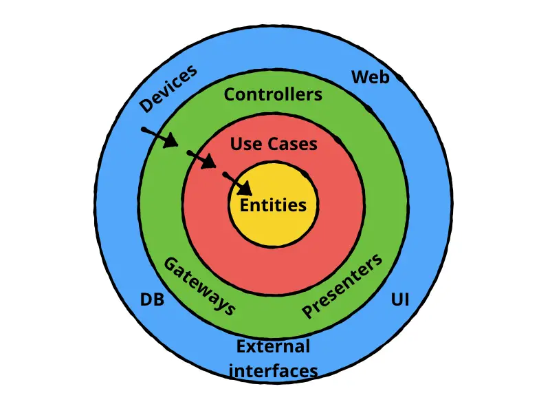  

Основная идея Clean Architecture - это разделение системы на следующие слои:

1. **Domain Layer (Слой домена)**:
   - Содержит бизнес-логику и правила приложения.
   - Независим от внешних фреймворков и инструментов.
   - Содержит модели данных (Entities) и бизнес-сущности (Use Cases).

2. **Use Case Layer (Слой прецедентов)**:
   - Содержит конкретные прецеденты использования (Use Cases) или интеракторы.
   - Определяет специфические сценарии использования для системы.
   - Отвечает за координацию работы между слоем домена и слоем интерфейса.

3. **Interface Adapters (Слой адаптеров интерфейса)**:
   - Содержит адаптеры, которые связывают систему с внешними фреймворками и инструментами.
   - Включает преобразователи данных (Mappers), контроллеры (Controllers) и представления (Views) для обработки взаимодействия с внешними интерфейсами.

4. **Frameworks & Drivers (Слой фреймворков и драйверов)**:
   - Содержит фреймворки, инструменты и драйверы баз данных, UI и т.д.
   - Отвечает за подключение системы к конкретным реализациям внешних интерфейсов.

#### Папки под MVC (Model-View-Controller)

MVC - это популярный паттерн проектирования, используемый для построения пользовательского интерфейса. Он разделяет систему на три основных компонента:

1. **Модель (Model)**:
   - Содержит бизнес-логику и данные приложения.
   - Обрабатывает запросы от контроллера и взаимодействует с базой данных или другими источниками данных.
   - Не зависит от представления и контроллера.

2. **Представление (View)**:
   - Отображает данные пользователю и предоставляет интерфейс для взаимодействия.
   - Получает данные от модели и отображает их в удобном для пользователя виде.
   - Не содержит бизнес-логики и обрабатывает только пользовательские действия.

3. **Контроллер (Controller)**:
   - Принимает пользовательские запросы и управляет потоком данных между моделью и представлением.
   - Обрабатывает пользовательские действия и взаимодействует с моделью для получения или обновления данных.
   - Не содержит бизнес-логики и не обрабатывает прямое взаимодействие с базой данных.

---

## Архитектура проекта. MV-шаблоны. Шаблон MVC

  

### MV-шаблоны (Model-View Templates)

MV-шаблоны - это паттерны проектирования, которые помогают организовать разделение ответственности между различными компонентами проекта, такими как модели данных, представления и контроллеры. Они облегчают разработку и поддержку проекта, позволяя разделить логику приложения и отображение данных.

### Шаблон MVC (Model-View-Controller)

Шаблон MVC - это один из наиболее популярных MV-шаблонов, который широко используется для разработки пользовательского интерфейса. В шаблоне MVC основные компоненты разделены следующим образом:

1. **Модель (Model)**:
   - Модель представляет данные и бизнес-логику приложения.
   - Она обрабатывает данные и содержит методы для их получения, обновления и удаления.
   - Модель независима от представления и контроллера.

2. **Представление (View)**:
   - Представление отображает данные пользователю и предоставляет интерфейс для взаимодействия.
   - Оно получает данные от модели и отображает их пользователю в удобной форме (например, HTML-страница).
   - Представление не содержит бизнес-логики и не обрабатывает прямое взаимодействие с моделью.

3. **Контроллер (Controller)**:
   - Контроллер обрабатывает пользовательские действия и управляет потоком данных между моделью и представлением.
   - Он получает запросы от представления, вызывает соответствующие методы модели и обновляет представление с новыми данными.
   - Контроллер не содержит бизнес-логики и не обрабатывает непосредственное взаимодействие с базой данных или другими источниками данных.

Шаблон MVC позволяет достичь хорошей структуры проекта, разделить логику приложения и отображение данных, а также облегчить поддержку и расширение проекта. Он наиболее часто используется в веб-приложениях, но также может быть применен и в других типах проектов, где требуется разделение логики и представления данных.

---

## Шаблон MVP

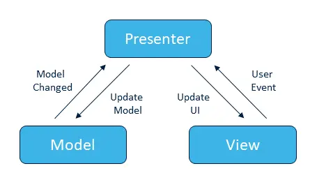  

**Шаблон MVP** - это один из MV-шаблонов, который широко используется для разработки пользовательского интерфейса. Он расширяет шаблон MVC, добавляя презентер (Presenter) в архитектуру. В шаблоне MVP основные компоненты разделены следующим образом:

1. **Модель (Model)**:
   - Модель представляет данные и бизнес-логику приложения.
   - Она обрабатывает данные и содержит методы для их получения, обновления и удаления.
   - Модель независима от представления и презентера.

2. **Представление (View)**:
   - Представление отображает данные пользователю и предоставляет интерфейс для взаимодействия.
   - Оно получает данные от модели и отображает их пользователю в удобной форме (например, HTML-страница).
   - Представление не содержит бизнес-логики и не обрабатывает прямое взаимодействие с моделью.

3. **Презентер (Presenter)**:
   - Презентер служит посредником между моделью и представлением.
   - Он получает запросы от представления, обрабатывает их и взаимодействует с моделью для получения или обновления данных.
   - Презентер не содержит бизнес-логики и не обрабатывает непосредственное взаимодействие с базой данных или другими источниками данных.

Шаблон MVP позволяет достичь хорошей структуры проекта, разделить логику приложения и отображение данных, а также облегчить тестирование и поддержку проекта. Он активно используется в клиентских приложениях, особенно в технологиях, где имеется четкое разделение между пользовательским интерфейсом и бизнес-логикой приложения.

---

## Шаблон MVVM

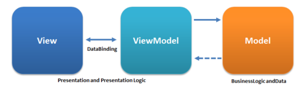  

**Шаблон MVVM** является одним из MV-шаблонов, который широко применяется при разработке пользовательского интерфейса, особенно в клиент-серверных и мобильных приложениях. Он включает в себя следующие компоненты:

1. **Модель (Model)**:
   - Модель представляет бизнес-логику и данные приложения.
   - Она содержит структуру данных, методы для получения и обновления данных, а также бизнес-правила приложения.
   - Модель независима от представления и ViewModel.

2. **Представление (View)**:
   - Представление отображает пользовательский интерфейс и отражает состояние данных из ViewModel.
   - Оно не содержит бизнес-логики, а лишь отвечает за отображение данных и обработку пользовательских действий.
   - В представлении используется двустороннее связывание данных для автоматического обновления при изменении данных в ViewModel.

3. **ViewModel**:
   - ViewModel является посредником между моделью и представлением.
   - Он содержит логику, отвечающую за обработку пользовательских действий, получение и обновление данных из модели, а также подготовку данных для отображения в представлении.
   - ViewModel обычно поддерживает уведомления об изменении своих свойств для автоматического обновления представления.

Шаблон MVVM позволяет достичь четкого разделения логики, представления и данных в приложении. Он обеспечивает хорошую переиспользуемость кода, облегчает тестирование и поддержку приложения, а также способствует улучшению разработки интерфейса пользователя.

---

## Паттерны проектирования и их назначение. Порождающие паттерны

**Паттерны проектирования** - это повторяемые решения для часто возникающих проблем при проектировании программного обеспечения. Они представляют собой bewusst сложение лучших практик и опыта разработчиков, которые разработали и применяли эти решения в различных сценариях. Паттерны проектирования помогают улучшить структуру и организацию кода, повысить его гибкость, переиспользуемость и поддерживаемость.

Паттерны проектирования можно разделить на несколько категорий, и одна из них - это порождающие паттерны. Порождающие паттерны отвечают за создание объектов или групп объектов. Они помогают сделать этот процесс более гибким и управляемым, избегая жесткой зависимости между клиентским кодом и создаваемыми объектами.

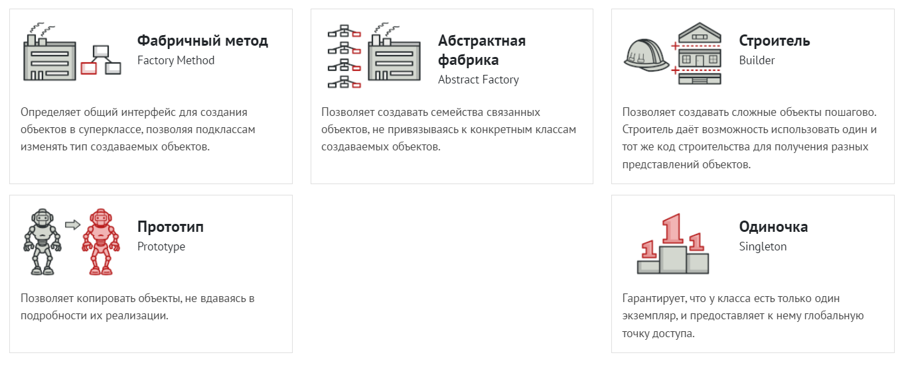  

### Паттерны

1. **Фабричный метод (Factory Method)**: Определяет интерфейс для создания объектов, но позволяет подклассам решать, какие классы создавать. Таким образом, он делегирует создание экземпляров подклассам.

   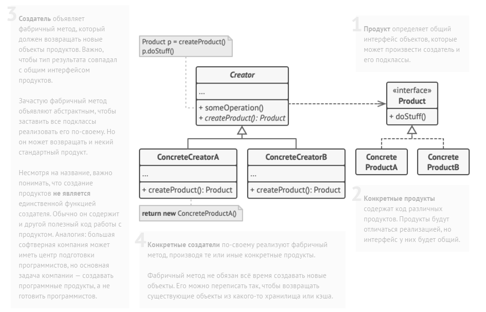  

2. **Абстрактная фабрика (Abstract Factory)**: Предоставляет интерфейс для создания семейств взаимосвязанных объектов без указания их конкретных классов. Он позволяет создавать объекты семейства вместо создания отдельных объектов.

3. **Строитель (Builder)**: Разделяет процесс создания сложного объекта от его представления, позволяя одному и тому же процессу создания использоваться для создания разных представлений.

4. **Прототип (Prototype)**: Определяет прототип объекта, который может быть использован для создания новых объектов путем копирования существующего экземпляра. Это позволяет избежать создания объектов путем явного указания их класса.

5. **Одиночка (Singleton)**: Гарантирует, что класс имеет только один экземпляр, и предоставляет глобальную точку доступа к этому экземпляру. Это полезно, когда требуется иметь только один экземпляр класса, обеспечивая одноразовую инициализацию.

Порождающие паттерны помогают сделать создание объектов более гибким, масштабируемым и управляемым. Они позволяют избегать жесткой зависимости между клиентским кодом и создаваемыми объектами, обеспечивая более слабую связанность и улучшенную переиспользуемость.

---

## Структурные паттерны

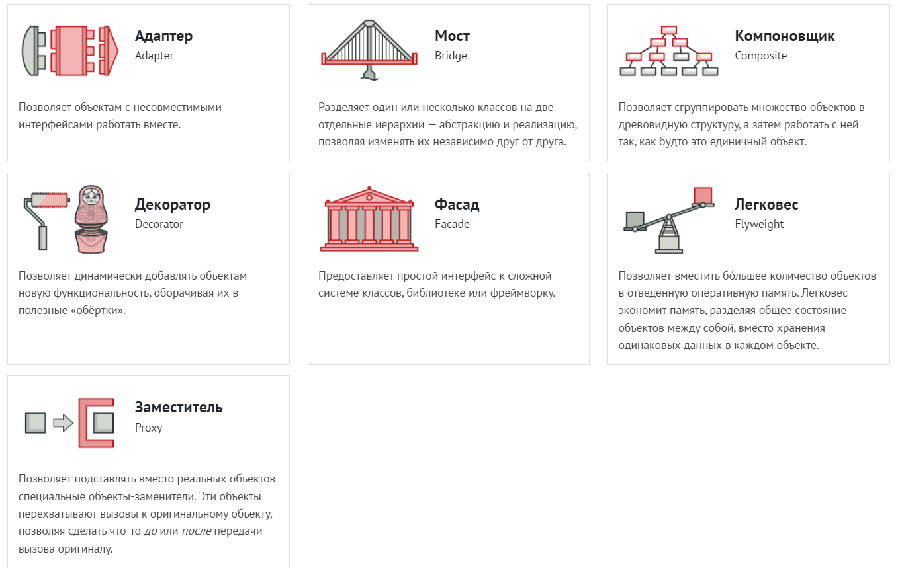  

**Структурные паттерны** - это паттерны проектирования, которые помогают организовать объекты и классы в более гибкую и эффективную структуру. Они предоставляют способы компоновки объектов и классов для решения конкретных проблем, связанных с структурой системы.

1. **Адаптер (Adapter)**: Позволяет объектам с несовместимыми интерфейсами работать вместе. Адаптер оборачивает один интерфейс в другой, чтобы сделать их совместимыми.

   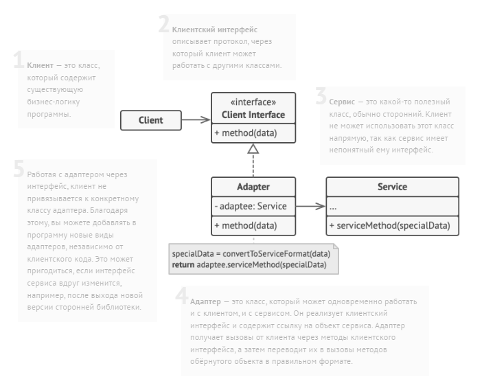  

2. **Мост (Bridge)**: Разделяет абстракцию и реализацию так, чтобы они могли изменяться независимо друг от друга. Мост позволяет связывать различные абстракции и реализации во время выполнения.

3. **Компоновщик (Composite)**: Группирует объекты в древовидные структуры для представления иерархии "часть-целое". Компоновщик позволяет клиентам одинаково работать с отдельными объектами и их группами.

4. **Декоратор (Decorator)**: Динамически добавляет дополнительное поведение объекту, оборачивая его в декорирующий объект. Декоратор предоставляет гибкую альтернативу наследованию для расширения функциональности объекта.

   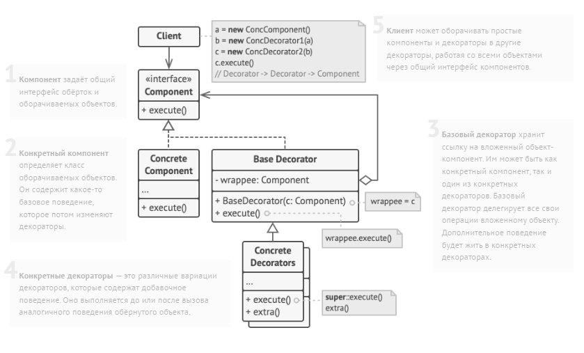  

5. **Фасад (Facade)**: Предоставляет унифицированный интерфейс для набора интерфейсов в системе. Фасад упрощает использование сложной системы, предоставляя более высокоуровневый интерфейс для взаимодействия с ней.

6. **Приспособленец (Flyweight)**: Разделяет объекты на легковесные (flyweight) и разделяемые части, чтобы снизить расходы по памяти при работе с большим количеством объектов.

   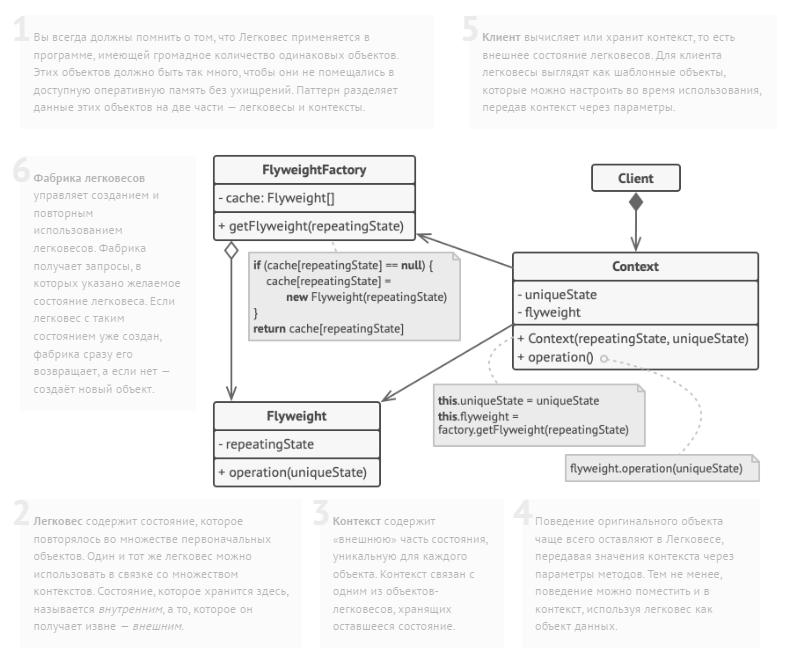  

7. **Заместитель (Proxy)**: Предоставляет заменитель или заполнитель для другого объекта, чтобы контролировать доступ к нему или добавить дополнительную логику.

   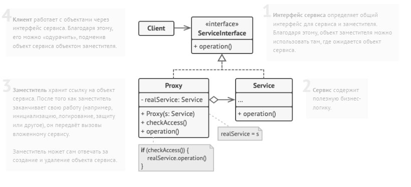  

Структурные паттерны позволяют улучшить организацию кода, обеспечить гибкость и переиспользуемость компонентов, а также упростить взаимодействие между объектами.

---

## Поведенческие паттерны

**Поведенческие паттерны** - это паттерны проектирования, которые управляют взаимодействием между объектами и классами, определяя и организуя поведение системы. Они помогают улучшить гибкость, расширяемость и поддерживаемость кода, связанного с поведением объектов.

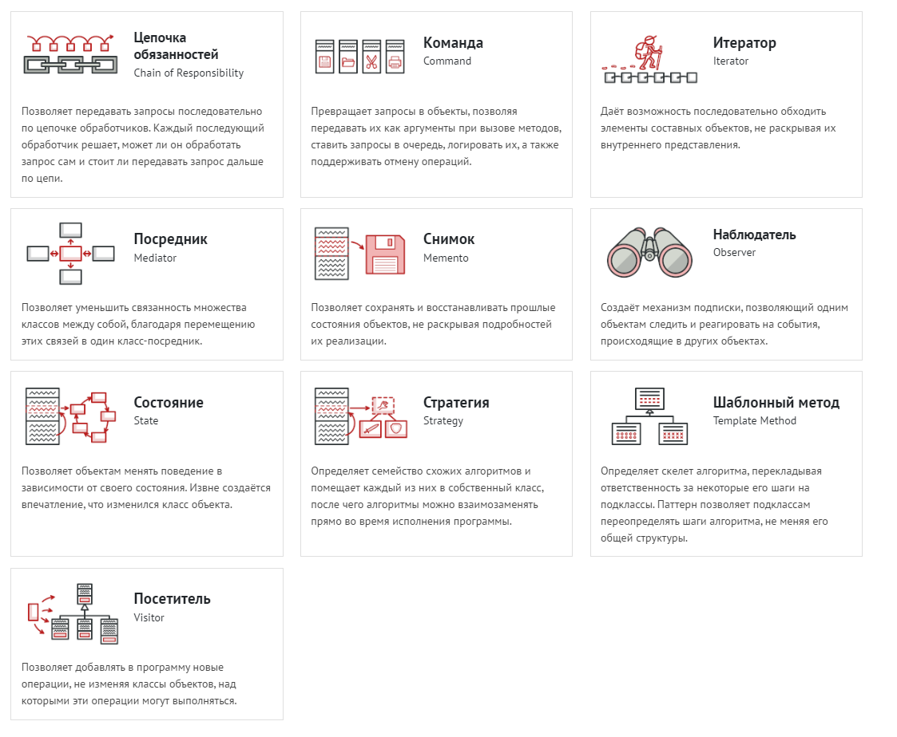

1. **Цепочка обязанностей (Chain of Responsibility)**: Позволяет создавать цепочку объектов-обработчиков, где каждый объект принимает решение о том, может ли он обработать запрос, и передает его следующему объекту в цепочке.

   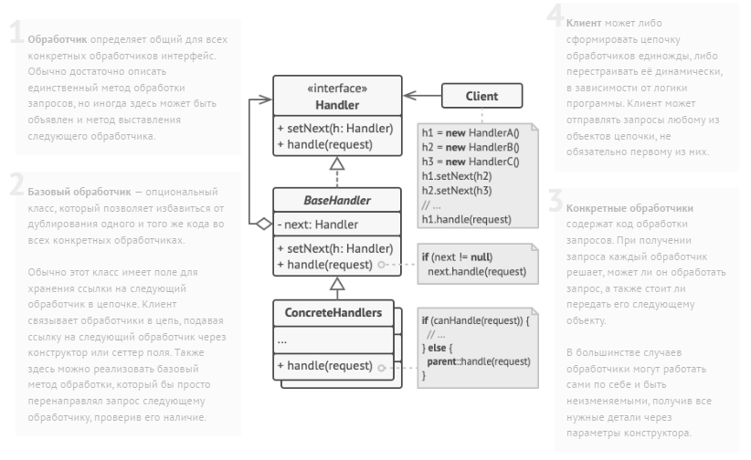  

2. **Команда (Command)**: Инкапсулирует запрос в виде объекта, позволяя клиентам параметризовать операции и откладывать их выполнение, ставить в очередь или регистрировать в журнале.

3. **Итератор (Iterator)**: Предоставляет способ последовательного доступа к элементам коллекции без раскрытия ее внутренней структуры.

4. **Посредник (Mediator)**: Определяет объект, который инкапсулирует взаимодействие между группой объектов. Посредник способствует слабой связанности между объектами, управляет и координирует их взаимодействие.

5. **Снимок (Memento)**: Фиксирует и сохраняет внутреннее состояние объекта так, чтобы позднее можно было восстановить его в этом состоянии.

   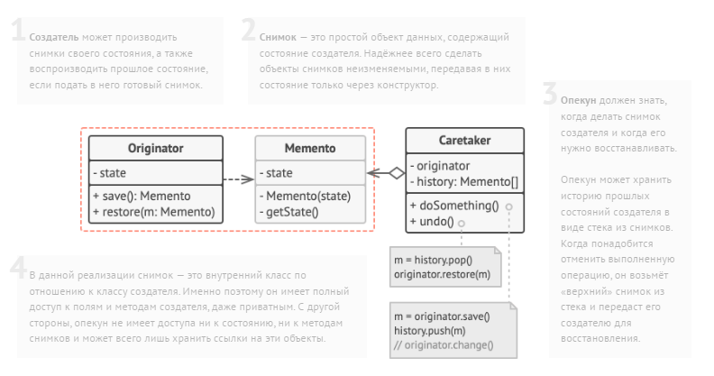  

6. **Наблюдатель (Observer)**: Определяет зависимость "один-ко-многим" между объектами, так что при изменении состояния одного объекта все зависящие от него объекты автоматически уведомляются и обновляются.

7. **Состояние (State)**: Позволяет объекту изменять свое поведение в зависимости от внутреннего состояния. Он делегирует выполнение операций связанным состояниям, что позволяет объекту менять свое поведение без изменения своего класса.

   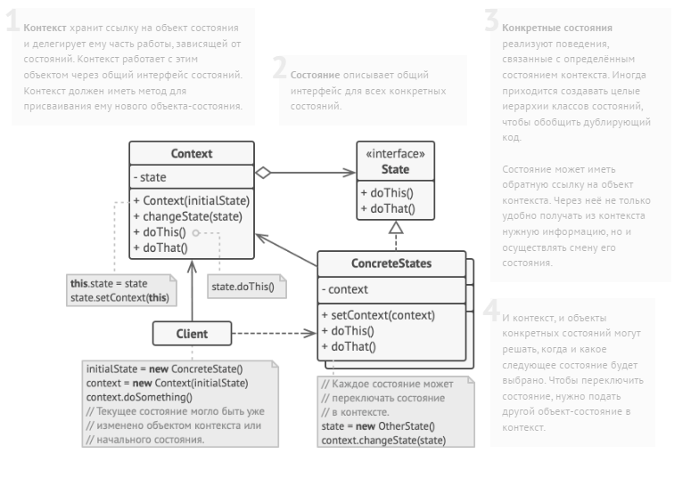  

8. **Стратегия (Strategy)**: Определяет семейство алгоритмов, инкапсулирует каждый из них и делает их взаимозаменяемыми. Стратегия позволяет изменять алгоритмы независимо от клиентов, которые их используют.

9. **Шаблонный метод (Template Method)**: Определяет скелет алгоритма в базовом классе, позволяя подклассам переопределять некоторые шаги алгоритма без изменения его структуры.

   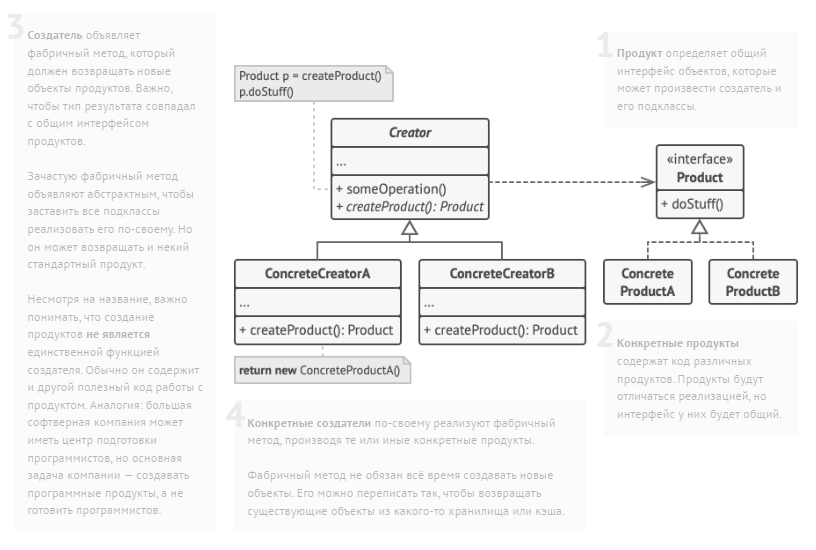  

10. **Посетитель (Visitor)**: Позволяет добавлять новые операции к объектам без изменения их классов. Посетитель позволяет разделить алгоритм от объектной структуры, по которой он оперирует.

   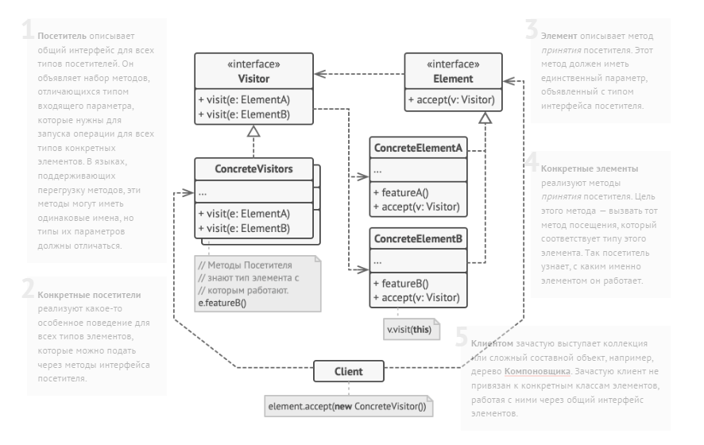  

Поведенческие паттерны помогают управлять взаимодействием между объектами, делают код более гибким и поддерживаемым, а также улучшают его расширяемость и переиспользуемость.

---

## Системы контроля версий. Локальные, централизованные и распределенные

**Система контроля версий (СКВ)** - это инструмент, который позволяет отслеживать изменения в файловой системе и управлять версиями файлов. Он записывает все изменения, сделанные над файлами и позволяет возвращаться к предыдущим версиям файлов или объединять изменения, сделанные разными людьми.

- **Локальные системы контроля версий:** Локальные СКВ представляют собой простые инструменты, которые сохраняют изменения непосредственно на жестком диске компьютера. Они предоставляют возможность отслеживать изменения в файлах, создавать резервные копии и возвращаться к предыдущим версиям файлов. Примером локальной СКВ может служить простая система, такая как RCS (Revision Control System).

- **Централизованные системы контроля версий:** Централизованные СКВ используют центральный репозиторий, в котором хранятся все версии файлов и история изменений. Разработчики работают с локальными копиями файлов, скачивая их из центрального репозитория и загружая изменения обратно в него. Это позволяет нескольким разработчикам совместно работать над проектом, синхронизировать свои изменения и отслеживать историю версий. Примерами централизованных СКВ являются Subversion (SVN) и Perforce.

- **Распределенные системы контроля версий:** Распределенные СКВ предоставляют каждому разработчику полную копию репозитория. Каждый разработчик имеет локальную копию проекта со всей историей изменений. Это позволяет работать над проектом даже без подключения к центральному серверу и делать коммиты локально. Распределенные СКВ обеспечивают более высокую гибкость и отказоустойчивость, так как каждая локальная копия репозитория может служить в качестве резервной копии и точки восстановления. Примерами распределенных СКВ являются Git и Mercurial.

Каждый тип системы контроля версий имеет свои преимущества и подходит для различных сценариев разработки. Локальные СКВ просты в использовании, но не подходят для совместной работы над проектом. Централизованные СКВ обеспечивают синхронизацию изменений между разработчиками, но требуют подключения к центральному серверу. Распределенные СКВ позволяют разработчикам работать независимо и иметь гибкость в управлении версиями файлов.

---

## Система контроля версий Git. Основные понятия для работы с Git

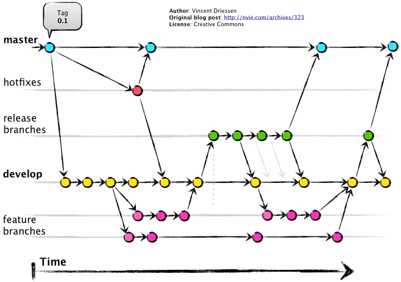  

**Git** - это распределенная система контроля версий, широко используемая в разработке программного обеспечения. Вот некоторые основные понятия, которые вам понадобятся для работы с Git:

1. **Репозиторий (Repository)**: Репозиторий в Git представляет собой хранилище всех файлов, истории изменений и метаданных проекта. Репозиторий может быть локальным (на вашем компьютере) или удаленным (на сервере или в облачном хранилище).

2. **Коммит (Commit)**: Коммит в Git представляет собой сохраненное состояние репозитория в определенный момент времени. Каждый коммит содержит информацию о внесенных изменениях, авторе, дате и времени.

3. **Ветка (Branch)**: Ветка в Git представляет собой отдельную линию разработки, которая идет от определенного коммита. Ветка позволяет работать над новыми функциями или исправлениями ошибок, не затрагивая основную линию разработки. Вы можете создавать, переключаться между ветками, сливать их и удалять.

4. **Хэш-код коммита (Commit Hash)**: Хэш-код коммита представляет собой уникальный идентификатор, который используется для идентификации каждого коммита в репозитории. Хэш-код состоит из длинной строки символов и цифр.

5. **Стэш (Stash)**: Стэш в Git позволяет временно сохранить незавершенные изменения в отдельном месте, чтобы переключиться на другую ветку или коммит без необходимости фиксировать изменения. Стэш можно применить позже, чтобы вернуться к сохраненным изменениям.

6. **Слияние (Merge)**: Слияние в Git позволяет объединить изменения из одной ветки в другую. При слиянии Git автоматически объединяет изменения и разрешает конфликты, если они возникают.

7. **Ветвление (Branching)**: Ветвление в Git позволяет создавать новые ветки для независимой разработки. Вы можете создавать ветки для новых функций, исправлений ошибок или экспериментов.

8. **Клонирование (Cloning)**: Клонирование в Git позволяет создать локальную копию удаленного репозитория. Клонирование создает полностью функциональную копию репозитория со всей его историей и ветками.

9. **Отправка (Pushing)**: Отправка в Git означает загрузку локальных коммитов и изменений в удаленный репозиторий.

10. **Получение (Pulling)**: Получение в Git означает загрузку коммитов и изменений из удаленного репозитория в локальный репозиторий.

Это только некоторые основные понятия Git, которые помогут вам начать работу с системой контроля версий Git. Однако Git предлагает еще много других функций и команд, которые позволяют эффективно управлять версиями и сотрудничать в проектах.

---

## Модель ветвления `GitFlow`

**Модель ветвления GitFlow** - это стратегия организации веток и управления процессом разработки в Git. Она предлагает определенную структуру ветвей и набор правил для управления выпусками, разработкой новых функций и исправлением ошибок. Вот основные компоненты модели ветвления GitFlow:

1. **Основные ветки**:

   - `master`: Ветка `master` представляет стабильную и продакшн-готовую версию проекта. В нее сливаются только проверенные и готовые к выпуску коммиты.

   - `develop`: Ветка `develop` служит ветвью разработки, в которой ведется активная работа над новыми функциями и исправлениями ошибок. Все остальные ветки создаются от ветки `develop`.

2. **Вспомогательные ветки**:

   - `feature`: Ветки `feature` используются для разработки новых функций или изменений, которые добавляются в проект. Они создаются от ветки `develop` и после завершения работы сливаются обратно в нее.

   - `release`: Ветки `release` используются для подготовки к выпуску новой версии проекта. Они создаются от ветки `develop`, и в них происходит финальное тестирование, исправление ошибок и подготовка документации перед выпуском. После завершения подготовки, ветка `release` сливается и в ветку `master`, и в ветку `develop`.

   - `hotfix`: Ветки `hotfix` используются для быстрого исправления критических ошибок в текущей стабильной версии проекта, находящейся в ветке `master`. Они создаются от ветки `master`, и после исправления ошибок сливаются обратно в ветку `master` и в ветку `develop`.

3. **Тэги**:

   - Тэги используются для маркировки конкретных коммитов, обозначая определенные версии или важные моменты в истории проекта.

Модель ветвления GitFlow обеспечивает структуру и контроль над разработкой проекта, позволяя параллельно работать над несколькими функциями или исправлениями, а также упрощает управление выпусками и обработку ошибок. Она стала популярной стратегией использования Git в коммерческой разработке программного обеспечения.

---

## Линейные и нелинейные структуры данных

**Линейные и нелинейные структуры данных** - это два основных типа структур данных, которые используются в программировании для организации и хранения данных. Они различаются по способу организации элементов и доступа к ним. Вот их основные характеристики:

1. **Линейные структуры данных**:

   - Линейные структуры данных организуют элементы в линейную последовательность, где каждый элемент имеет одного предшественника и одного преемника (за исключением первого и последнего элементов).

   - Примеры линейных структур данных включают массивы (списки), связанные списки, стеки и очереди.

   - Доступ к элементам в линейных структурах данных осуществляется последовательно, начиная с первого элемента и продвигаясь по порядку.

   - Операции, обычно выполняемые с линейными структурами данных, включают вставку (добавление нового элемента), удаление (удаление элемента) и поиск (поиск элемента).

2. **Нелинейные структуры данных**:

   - Нелинейные структуры данных не организуют элементы в линейную последовательность. Вместо этого они позволяют элементам иметь более одного предшественника и/или более одного преемника.

   - Примеры нелинейных структур данных включают деревья, графы и хеш-таблицы.

   - Нелинейные структуры данных обеспечивают более сложные отношения между элементами, такие как иерархия, связи или отношения "многие-ко-многим".

   - Доступ к элементам в нелинейных структурах данных может быть более сложным, требуя обхода структуры с использованием различных алгоритмов (например, обход в глубину или обход в ширину для деревьев).

   - Операции, выполняемые с нелинейными структурами данных, зависят от конкретной структуры, но они могут включать добавление, удаление, поиск и обход элементов.

---

## Деревья, бинарные деревья

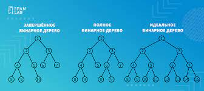  

**Дерево** - это структура данных, которая состоит из набора узлов (вершин) и связей (ребер). Каждый узел может иметь ноль или более дочерних узлов, кроме одного узла, который называется корневым узлом и не имеет родителя. Дерево используется для представления иерархических отношений между элементами.

**Бинарное дерево** - это частный случай дерева, в котором каждый узел имеет не более двух дочерних узлов, которые обычно называются "левым" и "правым" дочерними узлами.

### Основные понятия

1. **Узел (Node)**: Каждый элемент в дереве называется узлом. Узел может содержать данные (информацию) и ссылки на его дочерние узлы или родительский узел.

2. **Корневой узел (Root Node)**: Это особый узел, который является вершиной дерева и не имеет родителя. В бинарном дереве может быть только один корневой узел.

3. **Лист (Leaf)**: Узлы, которые не имеют дочерних узлов, называются листьями или терминальными узлами. Они находятся на самом нижнем уровне дерева.

4. **Внутренний узел (Internal Node)**: Узлы, которые имеют одного или более дочерних узлов, называются внутренними узлами. Они находятся между корневым узлом и листьями.

5. **Родительский узел (Parent Node)**: Узел, от которого исходят один или более дочерних узлов, называется родительским узлом.

6. **Дочерний узел (Child Node)**: Узел, который имеет связь с родительским узлом, называется дочерним узлом.

7. **Поддерево (Subtree)**: Поддерево - это часть дерева, состоящая из узла и всех его потомков (дочерних узлов).

8. **Уровень (Level)**: Уровень - это номер, который указывает на расстояние между корневым узлом и данного узла. Уровень корневого узла обычно равен 0, а каждый следующий уровень увеличивается на 1.

9. **Глубина (Depth)**: Глубина - это максимальный уровень дерева, то есть наибольшее расстояние от корневого узла до любого другого узла.

10. **Высота (Height)**: Высота - это максимальное количество уровней в дереве, начиная от корневого узла до самого дальнего узла.

11. **Префиксный обход (Preorder Traversal)**: Префиксный обход дерева означает, что сначала обрабатывается текущий узел, затем его левое поддерево и затем правое поддерево.

12. **Инфиксный обход (Inorder Traversal)**: Инфиксный обход дерева означает, что сначала обрабатывается левое поддерево текущего узла, затем текущий узел и, наконец, правое поддерево.

13. **Постфиксный обход (Postorder Traversal)**: Постфиксный обход дерева означает, что сначала обрабатываются оба поддерева текущего узла, а затем текущий узел.

  

---

## Обход деревьев в ширину и в глубину

**Обход деревьев в ширину (BFS) и в глубину (DFS)** являются двумя основными методами обхода узлов в деревьях. Они отличаются порядком, в котором узлы посещаются во время обхода. Вот более подробное описание каждого из них:

1. **Обход в ширину (BFS - Breadth-First Search)**:

   - Обход в ширину начинается с корневого узла, а затем посещает все узлы на одном уровне перед переходом на следующий уровень.
   - Обход в ширину использует очередь для хранения узлов. Начиная с корневого узла, все его дочерние узлы добавляются в очередь. Затем первый узел из очереди извлекается и посещается, а его дочерние узлы добавляются в конец очереди. Этот процесс повторяется до тех пор, пока очередь не станет пустой.
   - В результате обхода в ширину узлы обрабатываются по уровням: сначала посещаются все узлы на первом уровне, затем все узлы на втором уровне и так далее.
   - Обход в ширину часто используется для поиска кратчайшего пути или для поиска в деревьях без циклов.

2. **Обход в глубину (DFS - Depth-First Search)**:

   - Обход в глубину начинается с корневого узла и спускается по дереву, посещая каждый узел на пути до самого нижнего уровня, прежде чем вернуться и посетить другие узлы.
   - В отличие от обхода в ширину, обход в глубину не требует использования очереди. Вместо этого обход в глубину использует стек для хранения узлов. Начиная с корневого узла, он добавляет все его дочерние узлы в стек. Затем верхний узел из стека извлекается, посещается и его дочерние узлы также добавляются в стек. Этот процесс повторяется до тех пор, пока стек не станет пустым.
   - Обход в глубину может быть реализован в нескольких вариантах, включая префиксный (preorder), инфиксный (inorder) и постфиксный (postorder) обходы. Эти варианты определяют порядок обработки текущего узла относительно его дочерних узлов.

Какой метод обхода выбрать зависит от конкретной задачи и требований к обработке узлов дерева. Обход в ширину обеспечивает равномерное покрытие узлов на каждом уровне, в то время как обход в глубину позволяет углубиться в структуру дерева и выполнить действия на каждом узле в определенном порядке.

---

## Графы. Основные понятия

**Граф** - это абстрактная структура данных, которая состоит из набора вершин (узлов) и ребер, которые связывают эти вершины. Графы используются для представления отношений между объектами или сущностями.

Вот основные понятия, связанные с графами:

1. **Вершина (Node)**: Каждый элемент в графе называется вершиной или узлом. Вершина может представлять собой любой объект, данные или сущность, связанную с графом.

2. **Ребро (Edge)**: Ребро - это связь между двумя вершинами в графе. Ребро может быть направленным или ненаправленным. В направленном графе ребро имеет определенное направление от одной вершины к другой, а в ненаправленном графе ребро не имеет определенного направления и связывает вершины взаимно.

3. **Соседние вершины (Adjacent Nodes)**: Вершины, связанные ребром, называются соседними вершинами. В направленном графе можно выделить входящие и исходящие соседние вершины.

4. **Степень вершины (Degree)**: Степень вершины - это количество ребер, связанных с данной вершиной. Для направленных графов различают входящую и исходящую степень вершины.

5. **Путь (Path)**: Путь представляет собой последовательность вершин, связанных ребрами. Путь может быть простым (вершины не повторяются) или циклическим (начальная и конечная вершины совпадают).

6. **Цикл (Cycle)**: Цикл - это путь, который начинается и заканчивается в одной и той же вершине. Цикл может быть простым или содержать повторяющиеся вершины.

7. **Связный граф (Connected Graph)**: Связный граф - это граф, в котором между любыми двумя вершинами существует путь.

8. **Ориентированный граф (Directed Graph)**: Ориентированный граф (также называемый орграфом) - это граф, в котором каждое ребро имеет определенное направление от одной вершины к другой.

9. **Взвешенный граф (Weighted Graph)**: Взвешенный граф - это граф, в котором каждое ребро имеет ассоциированное с ним значение (вес), которое может представлять стоимость, длину, время или любую другую характеристику.

10. **Дерево (Tree)**: Дерево - это особый тип графа, в котором нет циклов, а каждая пара вершин соединена только одним ребром. Дерево имеет корневую вершину и иерархическую структуру, где каждая вершина имеет потомков (дочерние вершины).

Графы широко используются в различных областях, таких как компьютерные науки, математика, сетевые технологии, алгоритмы и многих других, где требуется представление и анализ связей между объектами или данных.

---

## Графы. Поиск в ширину и в глубину

**Поиск в ширину (BFS - Breadth-First Search) и поиск в глубину (DFS - Depth-First Search)** являются алгоритмами обхода графа или дерева, которые используются для поиска определенной вершины или выполнения операций на каждой вершине.

1. **Поиск в ширину (BFS)**:
   - Поиск в ширину начинается с заданной вершины и посещает все смежные с ней вершины на одном уровне перед переходом к следующему уровню.
   - Алгоритм использует очередь для хранения вершин. Начиная с исходной вершины, она добавляется в очередь. Затем извлекается первая вершина из очереди, и все ее смежные вершины добавляются в очередь. Этот процесс продолжается до тех пор, пока очередь не опустеет.
   - В результате обхода в ширину вершины посещаются по уровням: сначала посещаются все вершины на первом уровне, затем на втором уровне и так далее.
   - Поиск в ширину обеспечивает нахождение кратчайшего пути между двумя вершинами и широко используется для поиска в графах без циклов.

2. **Поиск в глубину (DFS)**:
   - Поиск в глубину начинается с заданной вершины и спускается вниз по дереву или графу, посещая каждую вершину на пути до самого нижнего уровня, прежде чем вернуться и продолжить обход других смежных вершин.
   - Алгоритм использует стек для хранения вершин. Начиная с исходной вершины, она добавляется в стек. Затем верхняя вершина стека извлекается, и все ее смежные вершины добавляются в стек. Этот процесс повторяется до тех пор, пока стек не опустеет.
   - Поиск в глубину может быть реализован в нескольких вариантах, включая префиксный (preorder), инфиксный (inorder) и постфиксный (postorder) обходы. Эти варианты определяют порядок обработки текущей вершины относительно ее смежных вершин.
   - Поиск в глубину позволяет глубоко исследовать структуру графа и может использоваться для решения задач, таких как поиск циклов, топологическая сортировка и генерация подмножеств.

Оба алгоритма имеют свои особенности и применяются в разных ситуациях, в зависимости от требований задачи и структуры графа или дерева, которые нужно обойти.

---

## Поиск кратчайших путей. Алгоритм Флойда-Уоршелла

**Алгоритм Флойда-Уоршелла** является алгоритмом динамического программирования, который используется для нахождения всех кратчайших путей между каждой парой вершин во взвешенном ориентированном или неориентированном графе. Он обрабатывает все возможные пути между парами вершин и находит кратчайший путь с учетом всех промежуточных вершин.

Основная идея алгоритма Флойда-Уоршелла состоит в следующем:

1. Создать матрицу смежности, которая представляет собой исходный граф. Если две вершины не связаны ребром, то в соответствующей ячейке матрицы будет бесконечное значение или очень большое число.
2. Инициализировать матрицу расстояний, которая будет содержать текущие кратчайшие расстояния между всеми парами вершин. Изначально эта матрица будет полностью совпадать с матрицей смежности.
3. Для каждой вершины графа последовательно рассмотреть все пары вершин (i, j) и попытаться обновить кратчайшее расстояние между ними через промежуточную вершину k. Если текущее расстояние между вершинами i и j больше, чем сумма расстояний от i до k и от k до j, то обновить расстояние.
4. Повторить шаг 3 для каждой промежуточной вершины k и каждой пары вершин (i, j). После завершения этого шага, матрица расстояний будет содержать кратчайшие пути между всеми парами вершин.
5. Получить кратчайшие пути между вершинами, используя матрицу расстояний.

Алгоритм Флойда-Уоршелла имеет временную сложность O(n^3), где n - количество вершин в графе. Он может быть применен как к графам без отрицательных циклов, так и к графам с отрицательными ребрами, но без отрицательных циклов. Если в графе есть отрицательный цикл, то алгоритм не сможет корректно работать.

Алгоритм Флойда-Уоршелла широко применяется в различных областях, где требуется нахождение кратчайших путей между всеми парами вершин, таких как сетевое планирование, маршрутизация пакетов, оптимизация транспортных систем и др.

---

## Поиск кратчайших путей. Алгоритм Беллмана-Форда

**Алгоритм Беллмана-Форда** - это алгоритм поиска кратчайших путей в графе с отрицательными ребрами и возможными циклами отрицательного веса. Он работает для ориентированных и неориентированных графов.

Основная идея алгоритма Беллмана-Форда состоит в том, чтобы рассмотреть все ребра графа и обновить расстояния от начальной вершины до всех остальных вершин. Алгоритм выполняет это обновление поэтапно, причем на каждом этапе обрабатываются все ребра графа.

1. Инициализируем расстояния до всех вершин, кроме начальной, значением "бесконечность". Расстояние до начальной вершины устанавливается равным 0.
2. Повторяем следующие шаги n-1 раз, где n - количество вершин в графе:
   - Проходим по всем ребрам графа и обновляем расстояния до вершин. Если текущее расстояние до вершины v плюс вес ребра e меньше, чем текущее расстояние до вершины e.to, то обновляем расстояние до вершины e.to.
3. Проверяем наличие отрицательных циклов. Проходим по всем ребрам графа еще раз и если найдено расстояние, которое можно уменьшить, то граф содержит отрицательный цикл.
4. Алгоритм завершается, и мы получаем кратчайшие расстояния до всех вершин, либо информацию о наличии отрицательного цикла.

Временная сложность алгоритма Беллмана-Форда составляет O(V * E), где V - количество вершин, E - количество ребер в графе. Этот алгоритм полезен в ситуациях, когда граф содержит отрицательные ребра или отрицательные циклы, для которых алгоритм Дейкстры не применим. Однако, алгоритм Беллмана-Форда менее эффективен, чем алгоритм Дейкстры, и обычно используется в случаях, когда другие алгоритмы неприменимы.

---

## Поиск кратчайших путей. Алгоритм Дейкстры

**Алгоритм Дейкстры** - это алгоритм поиска кратчайших путей от одной начальной вершины ко всем остальным вершинам во взвешенном графе без отрицательных ребер. Он использует жадный подход, выбирая каждый раз вершину с наименьшим текущим расстоянием и обновляя расстояния до соседних вершин.

Вот как работает алгоритм Дейкстры:

1. Инициализируем расстояния до всех вершин, кроме начальной, значением "бесконечность". Расстояние до начальной вершины устанавливается равным 0.
2. Создаем приоритетную очередь (например, с использованием мин-кучи) для хранения вершин и их текущих расстояний. Помещаем начальную вершину в очередь.
3. Пока очередь не пуста:
   - Извлекаем вершину с наименьшим текущим расстоянием из очереди.
   - Рассматриваем все соседние вершины этой вершины.
   - Если расстояние до соседней вершины через текущую вершину меньше текущего расстояния до соседней вершины, обновляем расстояние.
   - Обновляем приоритет очереди, если расстояние до соседней вершины изменилось.
4. По окончании алгоритма получаем кратчайшие расстояния до всех вершин от начальной вершины.

Алгоритм Дейкстры гарантирует нахождение кратчайших путей, при условии отсутствия отрицательных ребер в графе. Если в графе есть ребра с отрицательными весами, алгоритм Дейкстры не будет работать корректно.

Временная сложность алгоритма Дейкстры зависит от способа реализации. С использованием мин-кучи она составляет O((V + E) log V), где V - количество вершин, E - количество ребер в графе. Алгоритм Дейкстры широко применяется в различных областях, таких как маршрутизация в компьютерных сетях, оптимизация планирования задач, поиск кратчайших путей в графах и других задачах, связанных с нахождением оптимальных маршрутов.

  

---

## Тестирование. Назначение, основные понятия. Виды тестирования

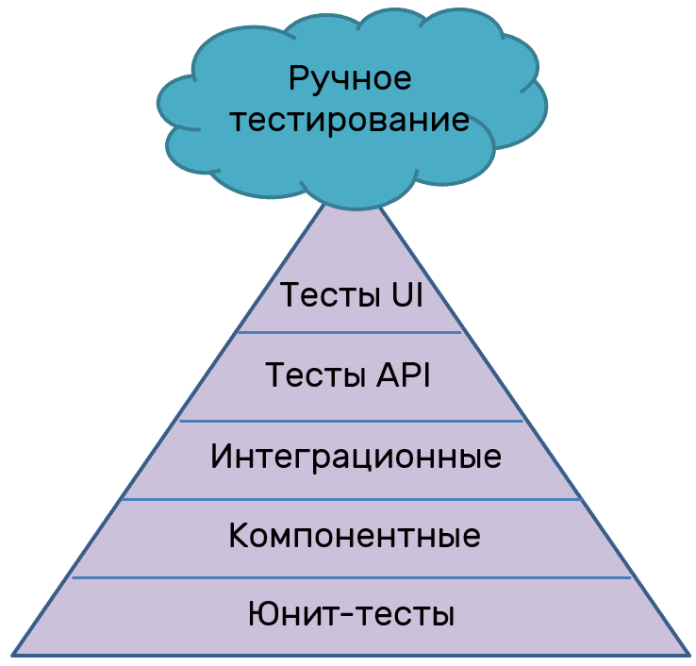  

**Тестирование** - это процесс проверки программного продукта с целью выявления ошибок, дефектов и недостатков, а также оценки его качества. Оно играет важную роль в разработке программного обеспечения, поскольку позволяет обнаружить и исправить проблемы, улучшить функциональность и надежность продукта, а также обеспечить удовлетворение требований пользователей.

Основные понятия и аспекты тестирования:

1. Тестовый случай (Test Case): Это набор шагов, предусловий и ожидаемых результатов, разработанных для проверки конкретного аспекта программного продукта. Каждый тестовый случай должен быть независимым и воспроизводимым.

2. Тестовый сценарий (Test Scenario): Это последовательность связанных тестовых случаев, которые тестируют определенную функциональность или поведение программного продукта. Тестовый сценарий описывает поток выполнения и может содержать информацию о взаимодействии с пользователем или другими системами.

3. Модульное тестирование (Unit Testing): Это проверка отдельных модулей или компонентов программного продукта на корректность и работоспособность. Модульное тестирование обычно проводится разработчиками и использует юнит-тесты, которые проверяют функциональность отдельных методов или классов.

4. Интеграционное тестирование (Integration Testing): Это проверка взаимодействия между различными модулями или компонентами программного продукта. Целью интеграционного тестирования является обнаружение ошибок, связанных с передачей данных, взаимодействием и интерфейсами между компонентами.

5. Системное тестирование (System Testing): Это проверка всей системы в целом, включая все ее компоненты и подсистемы. Системное тестирование проводится с целью проверить работоспособность системы в ее окружении, соответствие требованиям и оценку ее производительности.

6. Тестирование производительности (Performance Testing): Это проверка производительности программного продукта в условиях нагрузки. Целью такого тестирования является определение времени отклика, пропускной способности, нагрузочной способности и эффективности системы при различных условиях использования.

7. Ручное тестирование (Manual Testing): Это тестирование, проводимое вручную, где тестировщик выполняет тестовые случаи, используя интерфейс программного продукта и взаимодействуя с ним как обычный пользователь. Ручное тестирование позволяет обнаружить ошибки, которые могут быть упущены при автоматизированном тестировании.

8. Автоматизированное тестирование (Automated Testing): Это использование специальных инструментов и программ для выполнения тестовых случаев и создания отчетов о результатах тестирования. Автоматизированное тестирование позволяет повысить эффективность и скорость тестирования, а также упростить повторяемость тестов.

**Вулкан тестирования** - это термин, который иногда используется для описания ситуации, когда большое количество ошибок или дефектов обнаруживается и исправляется в программном продукте за короткий промежуток времени. Это может быть вызвано, например, интенсивным тестированием перед выпуском новой версии продукта или обнаружением критических проблем в рабочей системе, требующих немедленного исправления.

---

## Описание цикла жизни ПО

**Цикл жизни программного обеспечения (ПО)** представляет собой последовательность этапов и активностей, которые выполняются в процессе разработки, развертывания, поддержки и удаления программного продукта. Он охватывает всю жизненный цикл ПО, начиная с его концепции и заканчивая его выводом из эксплуатации. Общепринятая модель цикла жизни ПО включает следующие основные этапы:

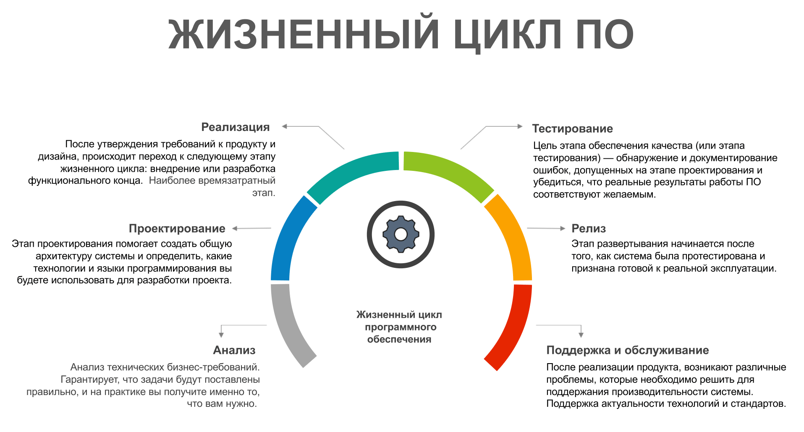  

1. Анализ и планирование: На этом этапе определяются требования и цели проекта. Выполняется анализ рынка, потребностей пользователей, исследуется техническая и финансовая осуществимость проекта. Планируются ресурсы, расписание работ и определяется общая стратегия разработки.

2. Проектирование: На этом этапе разрабатывается архитектура и дизайн программного продукта. Определяются компоненты, интерфейсы, структура данных, алгоритмы, а также производится выбор технологий и инструментов разработки. Создается подробное техническое задание, которое будет использоваться разработчиками в процессе кодирования.

3. Разработка: На этом этапе программное обеспечение фактически создается. Разработчики пишут код, реализуют функциональность, выполняют модульное и интеграционное тестирование. Разработка может включать итерации, когда функциональность добавляется и уточняется по мере продвижения проекта.

4. Тестирование: На этом этапе проводится тестирование программного продукта с целью выявления ошибок, дефектов и проверки его соответствия требованиям. Тестирование может включать функциональное тестирование, интеграционное тестирование, системное тестирование, тестирование производительности и другие виды тестирования. Ошибки, обнаруженные в этой фазе, исправляются и повторно тестируются.

5. Внедрение и поддержка: После успешного завершения тестирования программное обеспечение готово для внедрения. Оно развертывается в рабочей среде или предоставляется конечным пользователям. На этом этапе также осуществляется поддержка и обновление программного продукта, включая исправление ошибок, добавление новых функций и обеспечение его стабильной работы.

6. Удаление: В конечном счете, программное обеспечение может быть выведено из эксплуатации, если оно устарело, больше не поддерживается или есть потребность в замене. На этом этапе выполняются необходимые действия для вывода продукта из использования, включая сохранение данных, архивирование или перенос на другую платформу.

Цикл жизни ПО является итеративным и повторяющимся процессом, где каждый этап может быть детализирован и расширен в зависимости от конкретных требований и методологий разработки, таких как водопадная модель, гибкая разработка (Agile), DevOps и др.

---

## Стадии разработки ПО

**Стадии разработки программного обеспечения (ПО)** могут различаться в зависимости от выбранной методологии разработки и специфики проекта. Однако, общепринятая модель включает следующие основные стадии:

1. Анализ требований: На этой стадии происходит сбор и анализ требований к программному продукту. Взаимодействуя с заказчиком или заинтересованными сторонами, разработчики определяют функциональные и нефункциональные требования, выявляют особенности системы, ее цели и ограничения.

2. Проектирование: На этой стадии разрабатывается общая архитектура программного продукта. Определяются компоненты системы, их взаимодействие, структура базы данных, интерфейсы пользователя и другие аспекты проектирования. Результатом этой стадии является подробный план и описание системы.

3. Разработка: На этой стадии осуществляется непосредственное программирование. Разработчики пишут код в соответствии с требованиями и проектным планом. Здесь может быть использована выбранная методология разработки, например, Agile или Waterfall. Разработка может включать создание модулей, тестирование и интеграцию компонентов.

4. Тестирование: На этой стадии проводятся различные виды тестирования для обнаружения ошибок и проверки работоспособности программного продукта. Это может включать модульное тестирование, интеграционное тестирование, системное тестирование, тестирование производительности и другие виды тестирования. Цель - обеспечить высокое качество и соответствие требованиям.

5. Внедрение и поддержка: На этой стадии программное обеспечение развертывается в рабочей среде или предоставляется конечным пользователям. Она включает подготовку к выпуску, установку, настройку и обучение пользователей. После внедрения осуществляется поддержка и обновление программного продукта, включая исправление ошибок, добавление новых функций и обеспечение его стабильной работы.

Кроме того, в различных методологиях разработки могут быть дополнительные стадии или подходы, такие как планирование и оценка, релизы и итерации, контроль изменений, документирование и

---

## Модели и методологии разработки ПО

Существует несколько моделей и методологий разработки программного обеспечения (ПО), каждая из которых предлагает свой подход к организации и управлению разработкой. Некоторые из наиболее распространенных моделей и методологий включают:

1. Водопадная модель (Waterfall model): Это классическая последовательная модель разработки, где каждая стадия выполняется поочередно, без возможности возврата к предыдущей стадии. Она включает этапы анализа, проектирования, разработки, тестирования и внедрения.

   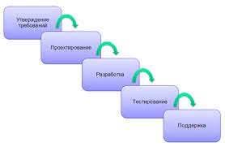  

2. Модель спирального развития (Spiral model): Эта модель комбинирует последовательные и итерационные элементы, позволяя разработчикам постепенно уточнять требования и риски, применяя прототипирование и проверку в каждом цикле разработки.

   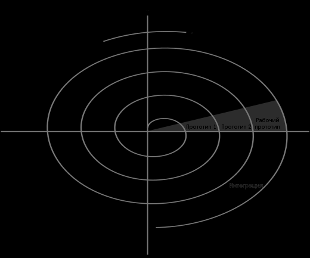  

3. Модель гибкой разработки (Agile model): Agile-методологии, такие как Scrum и Kanban, ставят акцент на итеративность, коллаборацию и быструю адаптацию к изменениям. Они основаны на работе в небольших командах, частой коммуникации с заказчиком и гибкой планировке задач.

4. Разработка по принципам DevOps: DevOps - это подход, который объединяет разработку (Development) и эксплуатацию (Operations) программного обеспечения. Он нацелен на улучшение сотрудничества и коммуникации между разработчиками и операционными командами, автоматизацию процессов разработки и развертывания, а также повышение качества и надежности ПО.

5. Прототипирование и инкрементальное развитие: Эти методы фокусируются на создании быстрых прототипов и поэтапном наращивании функциональности и возможностей ПО. Они позволяют быстро получать обратную связь от заказчика и гибко адаптировать проект к его потребностям.

6. Модель каскадной итерации (Iterative Waterfall model): Это модификация водопадной модели, где каждая стадия выполняется итеративно. После завершения каждой итерации происходит обратная связь, а результаты используются для уточнения требований и корректировки проекта.
