# FITMI Подготовка к диф. зачету

## Ответы

### **1. Двумерная растровая модель изображения**

Двумерная растровая модель изображения основана на матрице пикселей, представляющей интенсивность участков изображения. Ортогональное расположение пикселей является наиболее распространенным, где размеры пикселей одинаковы в обоих направлениях. Также существуют растры с альтернативными расположениями, такими как шахматное или диагональное, но они применяются редко.

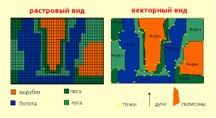  

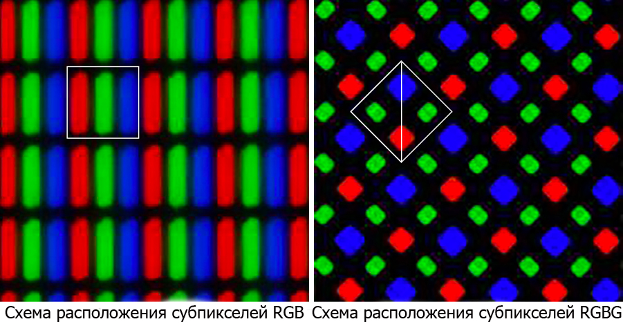  

### **2. Что такое разрешение растрового изображения, его выбор. Параметры, характеризующие качество изображений**

Разрешение растрового изображения определяется количеством пикселей на единицу длины. Большее количество пикселей на единицу длины обеспечивает более высокое разрешение и возможность воспроизведения мелких деталей на изображении. (dp)

При выборе разрешения изображения учитывается требование к незаметности растровой структуры для зрителя. Это связано с остротой зрения, поскольку объекты, угловое расстояние между которыми меньше одной угловой минуты, сливаются в один объект.

Для определения количества пикселей в изображении, принимая линейные размеры пикселей ∆ одинаковыми в обоих направлениях, можно использовать следующие формулы:

Общее количество пикселей N в изображении: N = hl/∆^2
Число строк zстр в изображении: zстр = h/∆
Количество пикселей и их разрядность влияют на объем памяти, необходимый для хранения изображения. Для черно-белого полутонового изображения требуется 8N бит памяти, а для цветного изображения с реальными цветами требуется 24N бита памяти.

### **3. Векторная модель представления двумерных изображений**

Векторные изображения используют контуры, представленные кривыми линиями, называемыми векторами. Каждый контур векторного изображения представляет отдельный объект и может быть редактирован независимо. Векторные файлы содержат инструкции для построения контуров, что обеспечивает масштабируемость без потери качества. Они также компактнее по сравнению с растровыми изображениями и удобны для передачи и хранения. Однако векторные изображения не подходят для полутоновых изображений, таких как фотографии.

Векторное изображение состоит из объектов, каждый из которых содержит один или несколько контуров. Контуры могут быть замкнутыми или открытыми и состоят из сегментов - отрезков прямых или кривых линий. Замкнутые контуры могут быть заполнены заливкой, добавляя цвет или текстуру. Однако векторная модель имеет ограничения в воспроизведении плавных переходов яркости.

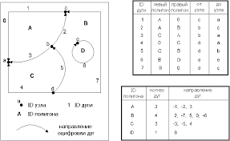  

### **4. Динамические изображения. Определение критической частоты мельканий**

Для создания ощущения движения объекта не требуется, чтобы его проекция на сетчатку непрерывно смещалась. Ощущение движения достигается путем быстрой смены последовательных фаз его движения на сетчатке глаза. Однако, для того чтобы движение изображения объекта воспринималось плавным, необходимо, чтобы частота смены изображений с различными фазами движения была достаточно высокой.

Критическая частота мельканий является важным показателем восприятия движущихся изображений. Она определяет минимальную частоту, ниже которой мелькания начинают восприниматься как отдельные сменяющиеся кадры. При частотах мелькания выше критической, мелькания становятся незаметными, и яркость мелькающего поля воспринимается такой же, как его средняя яркость.

Критическая частота мельканий зависит от угловых размеров мелькающего поля и его средней яркости. Исследования показали, что для угловых размеров экрана, на котором демонстрируется движущееся изображение, эта зависимость может быть описана эмпирической формулой или законом Тальбота, который позволяет рассчитать среднюю яркость мелькающего поля.

### **5. LCD- мониторы. Принцип действия ЖК-ячейки**

LCD-мониторы используют ЖК-ячейки для создания изображения. ЖК-ячейка состоит из тонкого слоя жидкого кристалла, заключенного между двумя подложками из специального стекла. Одна подложка называется поляризатором, а другая - анализатором.

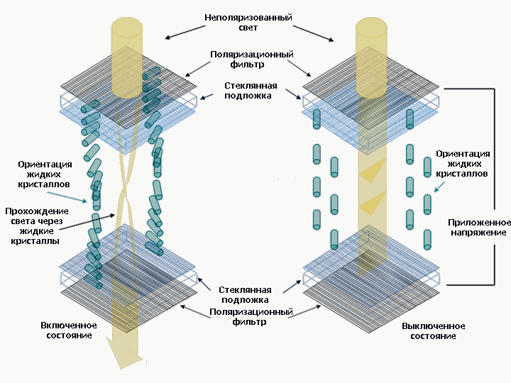  

Принцип работы ЖК-ячейки основан на изменении ориентации молекул жидкого кристалла при наличии внешнего электрического поля. Когда поле отсутствует, молекулы ЖК-вещества ориентированы параллельно подложкам, и свет проходит через ячейку без изменений, делая ее прозрачной.

Однако, при приложении напряжения к подложкам, ориентация молекул изменяется, и свет сталкивается с измененным показателем преломления. Это приводит к изменению пропускания света через анализатор и делает ЖК-ячейку непрозрачной.

Для создания изображения на LCD-мониторе используется внутренняя подсветка, которая освещает ЖК-ячейки, делая их видимыми для наблюдателя.

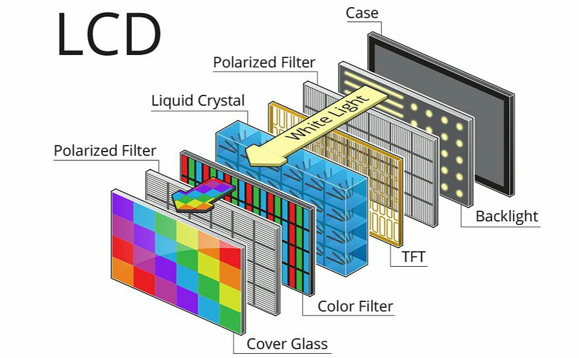  

### **6. Управление ЖК-ячейками. Технология TFT**

Управление ЖК-ячейками в LCD-мониторах осуществляется с помощью технологии Thin-Film Transistor (TFT), которая использует динамическую матричную адресацию. Каждый элемент изображения располагается на пересечении строки и столбца. Информация о яркости передается на столбцовые драйверы в цифровом виде, которые затем преобразуют ее в аналоговое напряжение для соответствующих ЖК-ячеек.

Однако матричная адресация имеет недостаток: при активации определенных ячеек, соседние ячейки частично активируются, что ухудшает контрастность изображения. Для решения этой проблемы была разработана технология активных ЖК-ячеек, в которых каждая ячейка имеет собственный ключ. Эти ключи позволяют коммутировать сигналы управления с низким уровнем напряжения (примерно 0,7 В) для контроля напряжения в десятках вольт. Таким образом, проблема частичной активации соседних пикселей успешно решается.

Технология активных ЖК-ячеек значительно улучшила такие параметры LCD-мониторов, как яркость, контрастность и углы обзора.

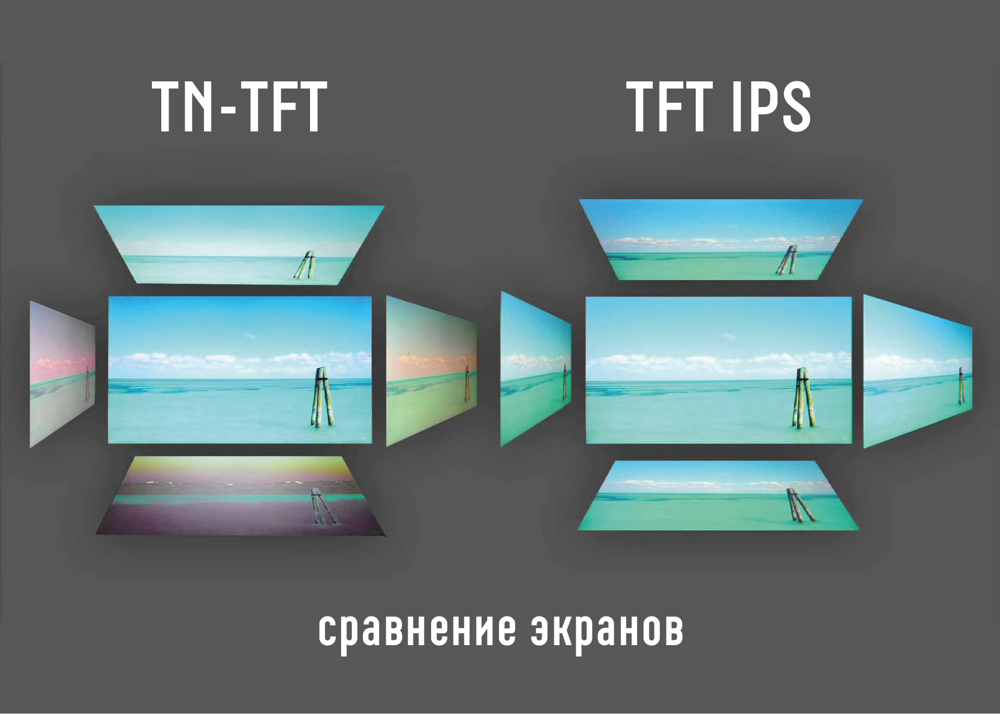  

### **7. Типы подсветки в LCD мониторах**

| Тип подсветки | Описание | Преимущества | Недостатки |
| --- | --- | --- | --- |
| Боковая | Светодиоды расположены сверху, снизу или по всему периметру LCD матрицы. В данном типе подсветки применяются только белые светодиоды. Для равномерного распространения света по всей площади ЖК-панели используется специальная рассеивающая подложка. | - Дешевизна исполнения. - Возможность создания тонких моделей мониторов и телевизоров. - Низкое энергопотребление. | - Сложность достижения равномерности подсветки. - Невозможность динамического управления. |
| Матричная | Светодиоды размещены равномерно по всей площади ЖК-панели. Матричная подсветка может быть выполнена при помощи белых светодиодов или цветных светодиодов. При использовании белых светодиодов они равномерно распределяются по площади, и в каждой ячейке используется только один светодиод. При использовании цветных светодиодов они организованы в так называемые "триады", и в зависимости от цвета выводимого изображения, соответствующий участок подсвечивается нужным цветом светодиода. | - Более равномерное освещение матрицы дисплея. - Возможность динамического управления подсветкой отдельных участков матрицы. | - Высокая стоимость. - Большая толщина мониторов и телевизоров. - Высокое энергопотребление. |

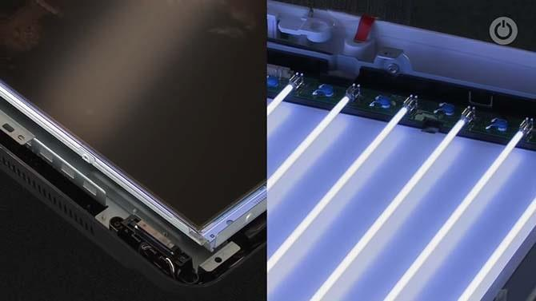  

### **8. Характеристики LCD –мониторов. Сравнение разных типов матриц LCD –мониторов**

TN (Twisted Nematic):

- При отсутствии напряжения молекулы поворачиваются, и ячейка становится прозрачной.
- Битые пиксели отображаются в белом цвете.
- Хорошее время отклика и высокая частота обновления.
- Узкий угол обзора и ограниченая цветопередача.
- Общая дешевизна и низкое энергопотребление.

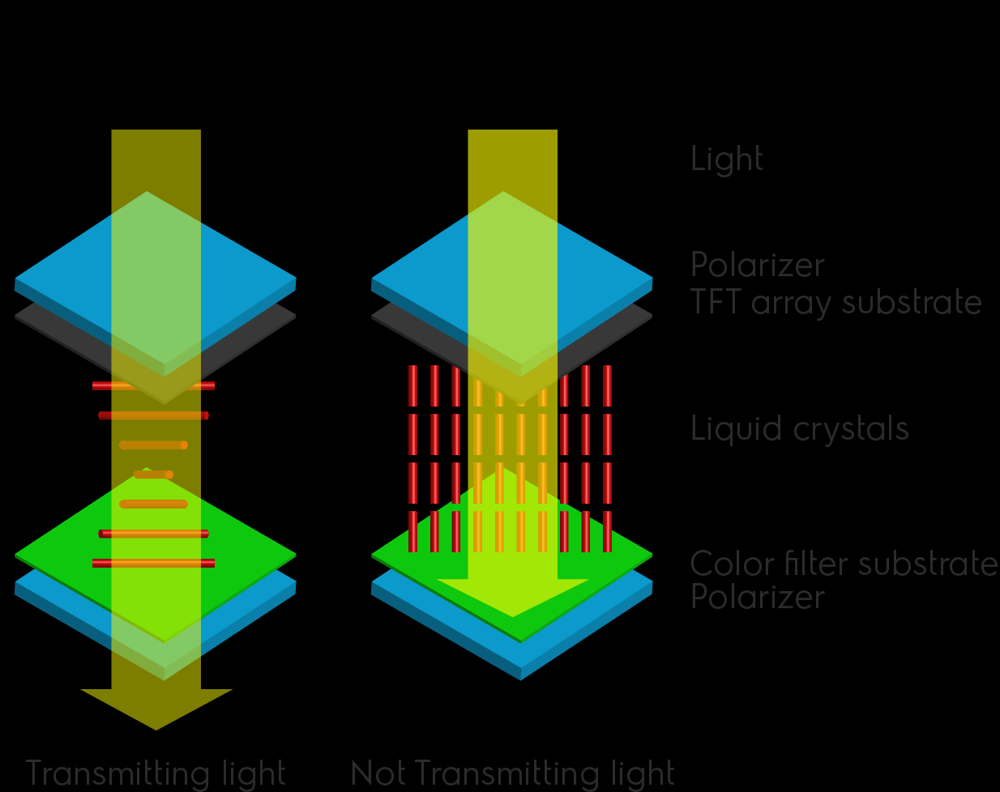  

VA (Vertical Alignment) / MVA (Multi-Domain Vertical Alignment):

- Молекулы ориентированы перпендикулярно основанию стеклянной подложки.
- При отсутствии напряжения молекулы не поворачиваются, и ячейка становится непрозрачной.
- Второй поляризационный фильтр полностью задерживает свет, обеспечивая глубокий черный цвет.
- Хороший угол обзора и отличная цветопередача.
- Более высокая цена и ниже скорость отклика по сравнению с TN-матрицами.

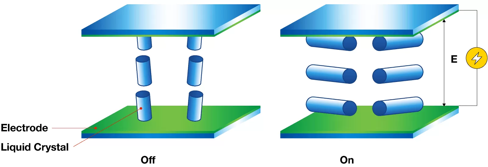  

IPS (In-Plane Switching):

- Молекулы выравниваются горизонтально, параллельно основанию подложки.
- При отсутствии напряжения молекулы не поворачиваются, и ячейка становится непрозрачной (битые пиксели отображаются в черном цвете).
- При подаче напряжения молекулы поворачиваются в той же плоскости на угол, зависящий от напряженности поля.
- Очень хороший угол обзора и отличная цветопередача.
- Более высокая цена и немного более медленная скорость отклика по сравнению с TN-матрицами.

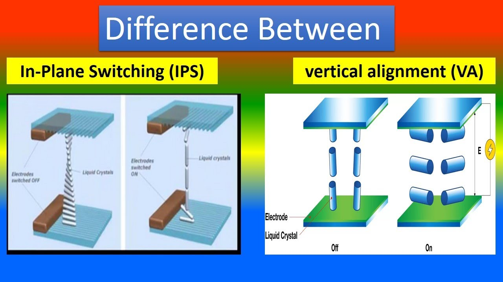  

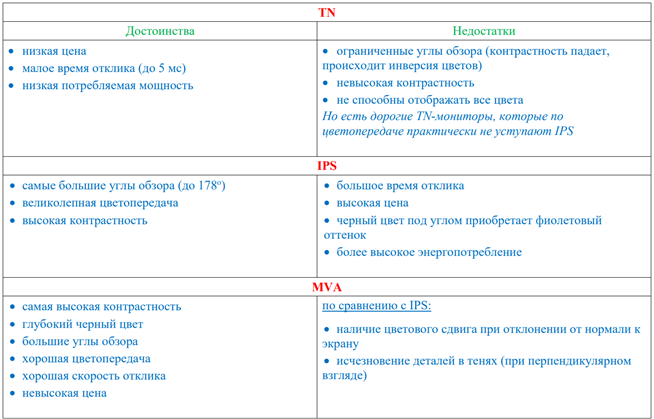  

### **9. Технология OLED. Преимущества и основные проблемы дисплеев OLED по сравнению с LCD**

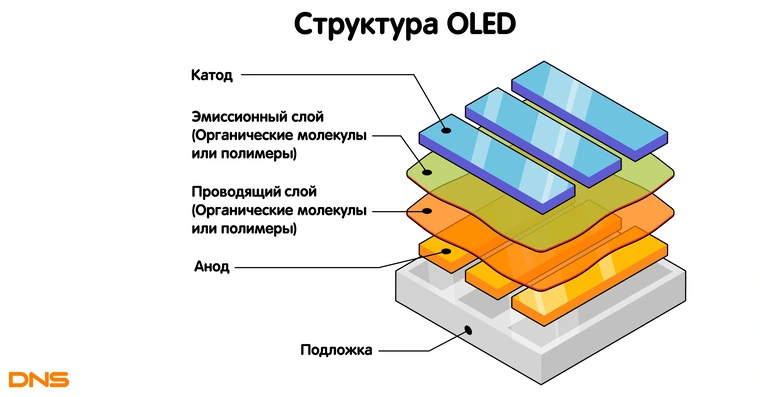  

**OLED (органический светодиод):**

- Технология, использующая многослойные тонкопленочные структуры из органических соединений, которые эффективно излучают свет при пропускании через них электрического тока.
- OLED состоит из подложки (стекла или пластика), слоя прозрачного анода, органического вещества и катода.
- Подача низкого напряжения (2-10 В) на анод и катод вызывает эффект люминесценции (фосфоресцирования) в органическом слое, что приводит к излучению света.
- Множество диодов красного, зеленого и синего свечения позволяют создавать сложные цветные изображения высокого разрешения.
- Яркость свечения пропорциональна протекающему току.

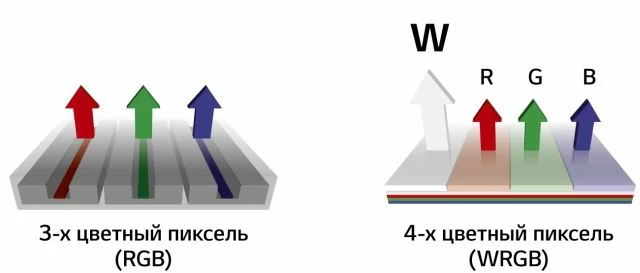  

**Преимущества OLED по сравнению с LCD:**

- Меньшие габариты и вес.
- Отсутствие необходимости в подсветке (ключевое отличие).
- Отсутствие ограничений угла обзора.
- Более качественная цветопередача.
- Более низкое энергопотребление при той же яркости.
- Возможность создания гибких экранов.
- Более высокое быстродействие.

**Основные проблемы OLED:**

- Ограниченный срок службы, особенно для "синего" OLED, что может привести к искажению изображения.
- Дороговизна технологии.

### **10. Разновидности технологии OLED и области применения**

**Разновидности технологии OLED и области применения:**

1. **PHOLED (Phosphorescent OLED):** Использует электрофосфоресценцию для преобразования до 100% электрической энергии в свет. Потенциальное использование PHOLED включает освещение и создание гигантских дисплеев для равномерного свечения.

2. **TOLED (Transparent and Top-emitting OLED):** Позволяет создавать прозрачные дисплеи и достигать высокого уровня контрастности. Используется в прозрачных дисплеях, направление излучения света которых может быть вверх, вниз или в оба направления. Может быть креплен на лобовое стекло автомобиля.

3. **FOLED (Flexible OLED):** Гибкий OLED-дисплей, где пластик или гибкая металлическая пластина используется в качестве подложки. Преимущества FOLED включают ультратонкость, низкий вес, прочность, долговечность и гибкость.

4. **SOLED (Staked OLED):** Использует сложенную архитектуру, где изображение подпикселей складывается вертикально. Каждым элементом подпикселя можно управлять независимо, и цвет пикселя можно регулировать изменением тока.

**Области применения OLED:**

- Мобильные телефоны, GPS-навигаторы и другие портативные устройства.
- Приборы ночного видения.
- Телевизоры и мониторы.
- Освещение и гигантские дисплеи.
- Автомобильные дисплеи, включая лобовые стекла.
- Медицинское оборудование.
- Виртуальная и дополненная реальность.
- Гибкие и складные устройства.
- Переносные гаджеты и носимая электроника.

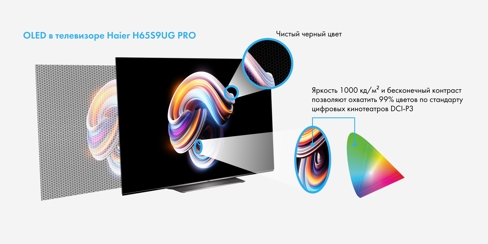  

### **11. Мониторы QLED**

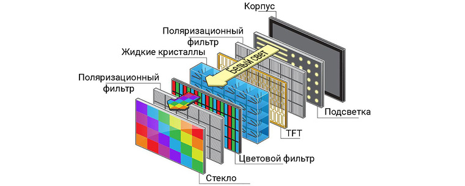  

Мониторы QLED (Quantum dot LED) являются разновидностью дисплеев, в которых используются квантовые точки в качестве добавочной прослойки между жидкокристаллическим слоем и светодиодами синего цвета дисплейной подсветки. Квантовые точки поглощают излучение светодиодов и ретранслируют его с заданной длиной волны, что позволяет получить более качественные и чистые базовые цвета RGB по сравнению с обычными матрицами.

Одним из преимуществ мониторов QLED является исключение светофильтров, что позволяет получить насыщенное по цвету и яркое изображение. Такое улучшение достигается за счет устранения преломления света и потери его интенсивности при прохождении через светофильтры. Благодаря этому, яркость экрана возрастает, цветовой охват расширяется, а потребление энергии остается прежним или даже снижается.

Однако, у мониторов QLED также есть некоторые недостатки:

- Склонность к выгоранию квантовых точек: В ходе эксплуатации квантовые точки могут показывать признаки выгорания, что приводит к потере качества и точности воспроизведения цветов. Несмотря на то, что это явление происходит гораздо меньше, чем у OLED-дисплеев, оно всё же может быть присутствовать.
- Сравнительно высокая цена: В настоящее время мониторы QLED могут быть дороже по сравнению с другими технологиями. Однако с развитием и освоением данной технологии ожидается, что стоимость устройств с использованием QLED будет снижаться и станет более доступной.

Мониторы QLED широко применяются в различных областях, включая домашний и офисный сегменты, профессиональную графику и дизайн, игровые системы и развлекательные центры. Они предлагают яркое, насыщенное цвета и высокое качество изображения, что делает их популярными среди пользователей, которые ценят точность цвет

### **12. Сравнение характеристик мониторов LED, OLED, QLED**

Время отклика: OLED является лидером в этом аспекте, так как пиксели самостоятельно меняют цвет и свет, что позволяет достигнуть времени отклика до 0,1 мс. QLED и LED отстают по времени отклика, при этом LED обычно имеет более высокое время отклика по сравнению с QLED.

Яркость: OLED может достичь наивысшей яркости среди всех трех технологий подсветки. Однако высокая яркость сокращает срок службы OLED экранов. QLED и LED дисплеи имеют примерно одинаковую яркость, поскольку оба используют подсветку светодиодами. Однако QLED-устройства могут использовать новые технологии для повышения яркости.

Контрастность и глубина черного: OLED-телевизоры имеют самую высокую контрастность и позволяют достичь почти бесконечную глубину черного. QLED и LED дисплеи имеют более низкую контрастность, связанную с методикой подсветки пикселей блоками или сегментами.

Цветовой охват: Модели с технологией HDR на всех типах дисплеев могут достичь высокой цветопередачи. QLED-телевизоры обычно поддерживают мульти-HDR, в то время как OLED может обеспечивать более естественные и реалистичные цвета без использования HDR. Цветопередача на обычных LED-моделях зависит от наличия HDR.

Углы обзора: OLED дисплеи имеют наибольшие углы обзора, поскольку диоды сами представляют матрицу и не приводят к искажению цветов или затенению изображения при изменении угла обзора.

Энергоэффективность: В среднем все три технологии имеют примерно одинаковое энергопотребление. В OLED-телевизорах энергия расходуется на каждый пиксель, в то время как в LED и QLED технологиях основная часть энергопотребления связана с подсветкой. Различий в энергопотреблении между ними нет.

Срок службы: OLED технология имеет ограниченный срок службы из-за износа пикселей, которые со временем теряют яркость. QLED и LED матрицы могут работать долго без существенной потери качества изображения.

---

### **13. Понятие статистической избыточности**

Статистическая избыточность относится к излишней информации в сигнале, которую можно сжать или устранить без потери важной информации. Виды статистической избыточности включают межэлементную и кодовую избыточность.

Межэлементная избыточность связана со статистическими связями между смежными элементами сигнала. Можно использовать разности между соседними элементами для более эффективного представления изображения и снижения этой избыточности.

Кодовая избыточность связана с вероятностными распределениями значений сигнала. Часто встречающиеся значения могут быть представлены более короткими кодами, в то время как редкие значения требуют более длинных кодовых комбинаций.

В случае видео, межкадровая статистическая избыточность возникает из-за статистических связей между значениями яркости соседних пикселей в последовательности кадров. Эта избыточность может быть уменьшена путем учета статистических связей между кадрами при сжатии.

Устранение статистической избыточности обычно выполняется путем сжатия данных с использованием методов, таких как декорреляция сигнала и оптимальное кодирование значений сигнала. Это позволяет сократить объем данных, сохраняя важную информацию.

### **14. Понятие психофизической избыточности**

Психофизическая избыточность изображений связана с особенностями зрительной системы человека. Учет этих особенностей позволяет сжимать данные изображений, исключая невидимые для зрителя детали из-за ограничений контрастной чувствительности. Это позволяет значительно сократить цифровой поток.

Метод сжатия данных с потерями информации, связанный с психофизической избыточностью, изменяет распределение яркости в восстановленном изображении по сравнению с исходным. В результате возникают искажения и потеря информации, но это касается лишь информации, недоступной для восприятия зрительной системой. Заметные искажения возникают только при высоких степенях сжатия, связанных с побочными эффектами алгоритма сжатия.

Учет особенностей зрительного восприятия является эффективным. Однако алгоритмы компрессии с потерями не рекомендуется использовать в печати высокого качества или для обработки программами распознавания образов.

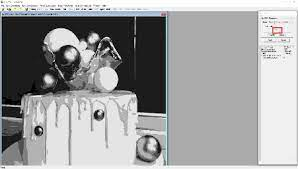  

### **15. Методы оценки качества изображений**

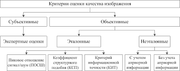  

**Единица ухудшения качества** (impaired unit) - понятие, используемое Международным консультативным комитетом по радио (МККР) для оценки качества изображений. Оно измеряется в импах (impairment) и связано с уровнем искажений, вызванных различными факторами. Ухудшение качества воспроизведения изображения суммируется для различных видов искажений, и результирующее ухудшение выражается в импах.

Для оценки заметности искажений используется **пятибалльная шкала** с оценками от 1 до 5, где 5 - незаметно, а 1 - очень раздражает. Минимальное количество наблюдателей-экспертов должно быть не менее 15.

Пиковое отношение сигнала к шуму (**PSNR**) - это метрика, используемая для измерения качества изображений. Она выражается в децибелах и рассчитывается как отношение максимального значения сигнала пиксела к среднеквадратичной ошибке между исходным и искаженным изображениями.

**Индекс структурного сходства** (**SSIM**) - метрика, используемая для оценки сходства между двумя изображениями. Он учитывает восприятие искажений как изменения структурной информации. Расчет SSIM может выполняться для различных размеров окон, учитывая среднее, дисперсию и ковариацию между пикселами в окнах.

Обе метрики, PSNR и SSIM, используются для оценки качества изображений, однако SSIM более полно учитывает восприятие искажений, так как учитывает структурную информацию.

### **16. Энтропия, относительная энтропия**

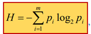

Максимальное значение.

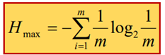

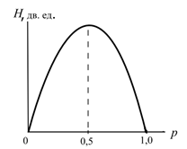  

Клод Шеннон ввел понятие энтропии, которая представляет собой меру неопределенности или неожиданности появления символа из алфавита. Она измеряет среднее количество информации, необходимое для кодирования каждого символа в сообщении. Энтропия определяется для независимых символов с вероятностями появления каждого символа. Когда вероятности всех символов одинаковы, энтропия достигает своего максимального значения. Она позволяет определить минимальное количество бит, необходимых для кодирования символов в алфавите.

Относительная энтропия, или дивергенция Кульбака-Лейблера, используется для измерения разницы между двумя вероятностными распределениями. Она показывает, насколько одно распределение отличается от другого. Относительная энтропия положительна и равна нулю только в случае идентичных распределений.

Таким образом, энтропия и относительная энтропия являются важными понятиями в теории информации, которые помогают измерять неопределенность и разницу между символами и вероятностными распределениями.

### **17. Коэффициент сжатия, избыточность**

Избыточность сигнала определяется сравнением энтропии с ее максимальным значением. В случае, когда вероятности появления всех символов одинаковы, энтропия достигает своего максимального значения, и избыточность отсутствует.

**Избыточность:**

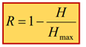

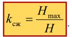  

Коэффициент сжатия показывает, во сколько раз можно уменьшить количество бит, необходимых для кодирования сообщений, по сравнению с кодированием символов одинаковой длины. Он вычисляется как отношение энтропии к длине кодирования. Коэффициент сжатия позволяет оценить эффективность сжатия данных.

В случае изображений, где элементы взаимно коррелированы, энтропия будет меньше, чем в случае статистически независимых значений. В результате этого достижимый коэффициент сжатия увеличивается. Поэтому первым шагом при сжатии данных обычно является устранение статистических связей между отсчетами сигнала, а затем применяется энтропийное кодирование статистически независимых значений.

### **18. Декорреляция изображений**

Декорреляция изображений является первым шагом при сжатии с использованием энтропийного кодирования. Статистическая избыточность изображения связана с наличием сильных корреляционных связей между значениями яркости соседних пикселей, а также с неравномерностью распределения плотности вероятности их значений.

Простейшим методом декорреляции является преобразование последовательности яркостей пикселей изображения в последовательность приращений яркости. Это достигается путем вычисления разницы между значениями яркости двух соседних пикселей: ΔL(n) = L(n+1) - L(n). Затем эта последовательность приращений подвергается кодированию.

При кодировании последовательности приращений более часто встречающиеся значения сигнала могут быть описаны более короткими кодовыми комбинациями, в то время как редко встречающиеся значения требуют более длинных кодовых комбинаций. Таким образом, декорреляция позволяет уменьшить статистическую избыточность и повысить эффективность сжатия изображений.

### **19. Кодирование длин серий**

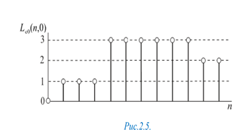  

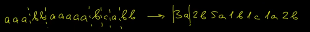  

Коэф. сжатия:

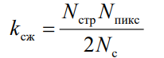  

Кодирование длин серий (Run-Length Encoding, RLE) - метод сжатия данных, который основывается на обнаружении и кодировании последовательностей повторяющихся значений. Многие графические изображения содержат однородные области с одинаковыми значениями яркости или цвета, и использование RLE позволяет сжать такие области, записывая только длину серии (количество повторяющихся отсчетов) и значение яркости, с которого начинается серия.

Пример кодирования длин серий показывает следующую кодовую последовательность: 1,0; 3,1; 6,3; 2,2. Это означает, что первая серия имеет длину 1 и начинается с яркости 0, вторая серия имеет длину 3 и начинается с яркости 1, и так далее.

При использовании метода кодирования длин серий корреляционные связи в кодируемом сигнале устраняются или ослабляются. Это позволяет достичь сжатия данных.

Коэффициент сжатия при использовании RLE может быть определен следующим образом:
коэффициент сжатия = (размер исходных данных) / (размер сжатых данных).

На практике часто используется кодирование, при котором серии повторяющихся значений отсчетов кодируются двумя байтами: длиной серии и значением яркости отсчета. Общее количество серий в изображении, размер которых меньше максимального значения счетчика серии, обозначается как Nc. При восьмиразрядном кодировании коэффициент сжатия можно вычислить по формуле:

коэффициент сжатия = (8 * Nc + 16) / 8

Этот коэффициент показывает, во сколько раз размер сжатых данных меньше размера исходных данных.

### **20. Кодирование методом Хаффмана**

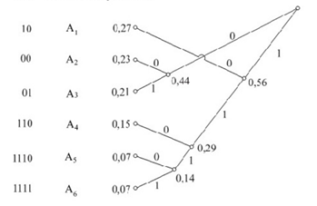  

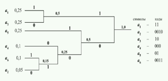  

Кодирование методом Хаффмана использует переменные кодовые слова, где наиболее вероятным символам присваиваются короткие коды, а менее вероятным – длинные. Алгоритм начинается с построения кодовой таблицы путем объединения символов с наименьшими вероятностями в кодовое дерево. Процесс объединения символов продолжается до тех пор, пока ветви дерева не сойдутся к одной вершине. Затем ветви дерева обозначаются нулями или единицами в зависимости от направления расхода от узла. Для каждого символа определяется его кодовое слово, пройдя от вершины дерева к данному символу и записывая пройденные ветви как нули или единицы. В результате часто встречающиеся символы кодируются короткими кодами, а редко встречающиеся – длинными кодами.

### **21. Алгоритм кодирования LZW**

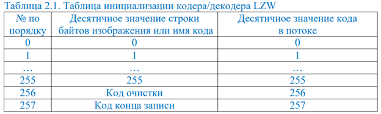  

Алгоритм кодирования LZW использует переменные кодовые слова и позволяет сжимать данные. При использовании этого алгоритма комбинации из двух-трех символов, каждый из которых имеет свой 8-разрядный код в таблице, кодируются более компактно. Вместо 16 или 24 битов длина полученных кодов будет существенно меньше.

Алгоритм сжатия данных LZW может быть описан следующим образом:

Инициализировать алгоритм.
Очистить таблицу кодов.
Очистить буфер строки и буфер символов.
Далее в цикле:

1. Прочитать очередной байт кодируемых данных в буфер символов.
2. Объединить содержимое строки и буфера символов и поместить результат в буфер тестирования (Test).
3. Проверить, есть ли в таблице кодов код, соответствующий содержимому буфера тестирования (Test):

Если есть, то переписать содержимое буфера тестирования (Test) в строку и вернуться к началу цикла.
Если нет, то добавить в таблицу кодов новую комбинацию, соответствующую содержимому буфера тестирования (Test), присвоив ей следующий доступный порядковый номер. Затем вывести в выходной поток код, соответствующий содержимому строки, переписать содержимое буфера символов в строку и вернуться к началу цикла.
Завершить работу программы, записав в выходной поток код содержимого строки и код конца записи.
Особенностью LZW является то, что для декомпрессии данных не требуется сохранять таблицу строк в файле для распаковки. Алгоритм построен таким образом, что таблица строк может быть восстановлена только с использованием потока кодов.

### **22. Арифметическое кодирование**

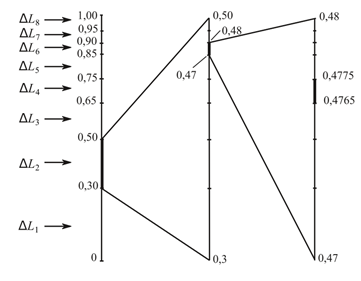  

Арифметическое кодирование - метод сжатия без потерь, который обеспечивает максимальную степень сжатия последовательности символов. Он основан на использовании вероятностей появления символов и представляет каждый символ как интервал на числовой прямой. При кодировании значения отсчетов сигнала заменяются дробями, попадающими в соответствующие интервалы и имеющими самые короткие двоичные коды мантиссы. Для декодирования необходимо знать таблицу вероятностей символов и длину закодированной последовательности.

Пример:
Пусть у нас есть последовательность из трех символов ΔL2, ΔL6, ΔL4 с соответствующими вероятностями. Мы строим интервалы на числовой прямой, каждый символ имеет свой интервал пропорциональный его вероятности. Затем кодируем значения последовательности, выбирая дроби, попадающие в интервалы. Например, для последовательности ΔL2, ΔL6, ΔL4 интервал будет равен 0,4765 - 0,4775. Мы выбираем дробь с наименьшим количеством знаков, попадающую в этот интервал, и получаем код 0111101.

Достоинством арифметического кодирования является эффективное устранение статистической избыточности из сигнала.

### **23. Разделение кодируемого сигнала на контексты**

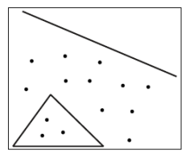  

Разделение кодируемого сигнала на контексты позволяет более эффективно кодировать изображение. В данном случае имеется изображение с 14 точками и 4 линиями. Его можно кодировать попиксельно, но это потребовало бы передачи большого количества значений.

Однако, если мы рассмотрим точки как вектора с нулевой длиной, мы сможем уменьшить количество передаваемых данных. При условии Nстр=1000 и Nпикс=1000, на передачу каждой координаты вектора потребуется 10 двоичных единиц. Таким образом, общее количество двоичных единиц составит 18220=720.

Если мы разделим изображение на точки и вектора, то затраты на передачу снизятся. Для векторов (4 вектора по 2 координаты) потребуется 4220=160 двоичных единиц. А для точек (14 точек по 20 двоичных единиц на каждую) потребуется 14*20=280 двоичных единиц. В итоге, общее количество передаваемых двоичных единиц составит 160+280=440.

Таким образом, разделение кодируемого сигнала на контексты позволяет сократить объем передаваемых данных и обеспечить более эффективное кодирование изображения.

### **24. Обзор методов сжатия изображений без потери информации**

Методы сжатия изображений без потери информации имеют свои особенности и применяются для устранения статистической избыточности и декорреляции сигнала изображения.

Одним из первых шагов при сжатии изображений с использованием энтропийного кодирования является декорреляция кодируемой последовательности. Она позволяет устранить статистические связи между кодируемыми отсчетами и кодировать статистически независимые отсчеты. Простейшим методом декорреляции является преобразование последовательности отсчетов яркости пикселей изображения в последовательность отсчетов приращений этой яркости.

Метод кодирования Хаффмана, предложенный в 1952 году Дэвидом Хаффманом, используется для получения кодов с минимальной средней длиной при заданном распределении вероятностей значений некоррелированных отсчетов сигналов. Он использует коды переменной длины, где наиболее вероятным символам присваиваются более короткие кодовые слова.

Кодирование длин серий (Run-Length Encoding или RLE) является простым методом, широко применяемым при записи графических изображений в файлы. Он основан на обнаружении однородных областей в изображении, где последовательности отсчетов с одинаковыми значениями заменяются на информацию о длине серии и значении яркости, с которого она начинается.

Метод кодирования LZW (Lempel-Ziv-Welch) использует адаптивные коды переменной длины. Он был разработан в 70-х годах прошлого века и доработан Терри Уэлчем. LZW позволяет сжимать данные без сохранения таблицы строк для распаковки и использует поток кодов для восстановления таблицы строк.

Каждый из этих методов имеет свои преимущества и недостатки и широко применяется в различных алгоритмах сжатия изображений.

### **25. Принципы кодирования изображений с использованием ортогональных преобразований**

Принципы кодирования изображений с использованием ортогональных преобразований имеют следующие особенности:

Кодирование спектральных коэффициентов: Кодируются значения спектральных коэффициентов, получаемых при ортогональном преобразовании изображения. Это позволяет более эффективно представлять информацию об изображении.

Декорреляция изображения: Ортогональные преобразования снижают корреляцию между пикселями изображения, декоррелируя его.

Неравномерное распределение энергии: Энергия распределяется неравномерно между спектральными коэффициентами, сосредотачиваясь в коэффициентах с малыми индексами, представляющих низкие пространственные частоты.

Квантование и отбор коэффициентов: Для сжатия изображений квантуются коэффициенты с малой амплитудой или отбрасываются, используя коды с меньшим числом двоичных единиц.

Существуют два метода отбора спектральных коэффициентов:

Зональный метод: Выделяются зоны в матрице коэффициентов, и коэффициенты в каждой зоне квантуются на одно и то же число уровней.

Пороговый метод: Сохраняются только коэффициенты, чья амплитуда превышает установленный порог.

Ортогональные преобразования сохраняют метрику: размерность массивов изображения и спектральных коэффициентов одинакова.

### **26. Сжатие изображений в формате JPEG**

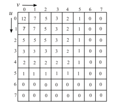

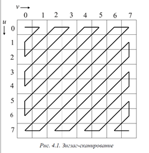  

Сжатие изображений в формате JPEG осуществляется следующим образом:

Разбиение изображения: Исходное изображение разбивается на блоки размером 16x16 пикселей. Каждый блок обрабатывается независимо от остальных.

Преобразование цветовых пространств: В каждом блоке происходит переход от матрицы отсчетов для красного (R), зеленого (G) и синего (B) компонентов изображения к яркостному (Y) и двум цветностным (Cb и Cr) компонентам, используя дискретное косинусное преобразование (ДКП).

Разделение и прореживание матриц: Матрица яркостного компонента размером 16x16 разделяется на 4 матрицы размером 8x8. Цветностные компоненты Cb и Cr прореживаются, и из них исключаются каждая вторая строка и каждый второй столбец, чтобы получить матрицы размером 8x8.

Применение ДКП: Каждая из шести полученных матриц размером 8x8 подвергается дискретному косинусному преобразованию, что позволяет представить их в виде спектральных коэффициентов.

Квантование: После преобразования коэффициенты квантуются, то есть делятся на значения из матрицы квантования. Матрица квантования определяет степень потерь и управляет степенью сжатия. Обычно используются стандартные матрицы квантования, определенные в стандарте JPEG.

Зигзаг-сканирование: Квантованные спектральные коэффициенты 8x8 преобразуются в вектор из 64 элементов с использованием зигзаг-сканирования. Это упорядочивает коэффициенты таким образом, чтобы длинные последовательности нулей находились в конце вектора.

Кодирование длин серий (RLE): Полученный вектор подвергается кодированию длин серий, где ненулевые коэффициенты и их длины записываются вместе в пары чисел. Более вероятным значениям назначаются более короткие коды.

Кодирование Хаффмана: Закодированные данные проходят через кодирование Хаффмана, где каждая пара чисел заменяется соответствующим битовым кодом. Кодирование Хаффмана использует статистическую модель для назначения более коротких кодов часто встречающимся значениям и более длинных кодов редким значениям.

Сохранение и восстановление: Полученные битовые данные сохраняются в файл, который может быть восстановлен для отображения сжатого изображения.

Важно отметить, что процесс сжатия JPEG является потерянным, то есть некоторая информация изначального изображения теряется в результате квантования и удаления некоторых высокочастотных компонент. Однако степень потерь контролируется уровнем квантования, что позволяет достигнуть баланса между качеством изображения и его размером.

### **27. Вейвлет-преобразование**

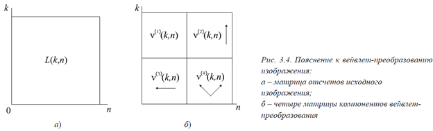  

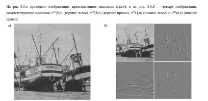  

Вейвлет-преобразование является методом анализа сигналов и изображений, который позволяет представить их в виде компонент с различными пространственными частотами. Применение вейвлет-преобразования к двумерным массивам данных, таким как изображения, позволяет разделить их на различные частотные диапазоны и компоненты.

Процесс вейвлет-преобразования для двумерного массива данных (изображения) выглядит следующим образом:

1. Разделение изображения: Исходное изображение разбивается на группы пикселей размером 2x2. Каждая группа содержит четыре пикселя, обозначенных как Lc(2k, 2n), Lc(2k+1, 2n), Lc(2k, 2n+1), Lc(2k+1, 2n), где k - номер строки, n - номер столбца.
2. Расфильтровка: Для каждой группы пикселей происходит операция расфильтровки, где исходное изображение свертывается с импульсными характеристиками hL(.) и hH(.). Свертка с hL(.) устраняет высокочастотные составляющие (верхние частоты), а свертка с hH(.) устраняет низкочастотные составляющие (нижние частоты). Это позволяет разделить изображение на частотные диапазоны.
3. Прореживание: Результаты расфильтровки прореживаются, что означает, что в каждой окончательной матрице сохраняется только каждый второй отсчет по строке и каждый второй отсчет по столбцу. Это уменьшает размерность данных и позволяет сосредоточиться на наиболее значимых компонентах.
4. Получение компонент: В результате преобразования получаются четыре компонента: ν(1)(k,n), ν(2)(k,n), ν(3)(k,n), ν(4)(k,n). Компоненты ν(2)(k,n), ν(3)(k,n) и ν(4)(k,n) называются деталями и содержат информацию о резких границах и деталях изображения, ориентированных вертикально, горизонтально и по диагонали соответственно. Компонента ν(1)(k,n) представляет собой полусумму исходных пикселей в группе.
5. Восстановление: Исходное изображение может быть восстановлено из компонент. Вначале каждый компонент разложения интерполируется для восстановления удаленных отсчетов, а затем все компоненты суммируются, чтобы получить исходное изображение.

Вейвлет-преобразование позволяет анализировать и извлекать информацию о различных пространственных частотах изображения, что имеет широкий спектр применений, включая сжатие данных, обработку изображений и распознавание образов.

### **28. Сжатие изображений на основе вейвлет-преобразования**

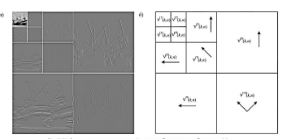  

Метод сжатия данных на основе вейвлет-преобразования для черно-белых полутоновых изображений включает следующие шаги:

Вейвлет-преобразование: Исходное изображение подвергается трехкратному вейвлет-преобразованию путем последовательного применения преобразования. На первом этапе преобразования изображение разделяется на четыре матрицы отсчетов. Затем преобразование применяется к аппроксимации (низкочастотной компоненте), полученной на первом этапе, и процесс повторяется на третьем этапе к полученной на втором этапе аппроксимации. Каждый этап преобразования включает свертку и децимацию.

Квантование: После вейвлет-преобразования полученные компоненты квантуются. Высокочастотные компоненты (детали) квантуются на меньшее число уровней, в то время как низкочастотные компоненты (аппроксимации) квантуются на большее число уровней. Квантование позволяет уменьшить точность представления данных и убрать ненужную информацию, что способствует сжатию.

Энтропийное кодирование: Проквантованные отсчеты подвергаются энтропийному кодированию. Это процесс, в ходе которого каждому символу или группе символов присваивается код с переменной длиной, чтобы использовать меньше битов для кодирования наиболее вероятных символов и больше битов для кодирования менее вероятных символов. Энтропийное кодирование дополнительно сжимает данные.

В результате применения данного метода сжатия данных на основе вейвлет-преобразования достигается высокая степень сжатия, обычно в диапазоне от 30 до 50 раз. Это возможно благодаря удалению ненужной информации в высокочастотных компонентах, квантованию и энтропийному кодированию.

### **29. Сжатие изображений в формате JPEG-2000**

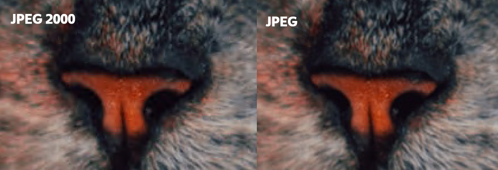  

Формат JPEG-2000 использует вейвлет-преобразования вместо дискретных косинусных преобразований, которые применяются в формате JPEG. Это позволяет избежать блочной структуры размером 8x8 пикселей и предотвратить появление неприятных артефактов при высоких уровнях сжатия.

Одним из дополнительных преимуществ JPEG-2000, обеспечиваемых вейвлет-преобразованиями, является прогрессивная визуализация изображения во время его загрузки. Это означает, что изображение может быть постепенно отображено с увеличивающимся качеством по мере получения дополнительных данных, что особенно полезно при работе с большими изображениями или при медленном интернет-соединении.

При компрессии в JPEG-2000 обеспечивается произвольный доступ к кодовому потоку, позволяющий обрабатывать независимо различные области изображения. Исходное изображение может быть разделено на прямоугольные области, которые могут сжиматься и декомпрессироваться независимо друг от друга. Благодаря доступу к отдельным областям непосредственно из потока данных, различные области изображения могут быть декодированы и отображены независимо друг от друга.

Алгоритм JPEG-2000 включает следующие этапы:

Сдвиг по интенсивности: Каждый компонент RGB изображения сдвигается по интенсивности перед преобразованием в цветовое пространство YUV.

Обратное преобразование: При декомпрессии выполняется обратное преобразование, чтобы восстановить исходное изображение.

Преобразование в цветовое пространство YUV: Сигналы из цветового пространства RGB преобразуются в цветовое пространство YUV.

Дискретное вейвлет-преобразование: Выполняется вейвлет-преобразование для яркостной и двух цветоразностных матриц. Матрицы яркости и цветоразностей обрабатываются независимо друг от друга.

Квантование: Коэффициенты, полученные после вейвлет-преобразования, делятся на заданное число. Большее значение делителя приводит к снижению динамического диапазона коэффициентов и позволяет достичь более высоких уровней сжатия.

Энтропийное кодирование: Полученные данные сжимаются с использованием энтропийного кодера, такого как MQ-кодер. Кодирование выполняется путем декорреляции отсчетов и арифметического кодирования.

В результате этих этапов достигается сжатие изображений в формате JPEG-2000, сочетающее высокую степень сжатия, отсутствие блочных артефактов и возможность прогрессивной визуализации при загрузке изображения.

---

### **30. Основные сферы медиаиндустрии. Медиарынок России. Особенности и тенденции развития**

Основные сферы медиаиндустрии включают телевидение, радио, прессу, кино, интернет и новые медиа. Медиаиндустрия играет важную роль в обществе, предоставляя информацию, развлечения и связь между людьми.

Медиарынок России является одним из крупнейших в мире и охватывает широкий спектр медиаплатформ и компаний. Он включает государственные и частные телекомпании, издательства, интернет-порталы, киностудии и другие организации, занимающиеся производством и распространением медиаконтента.

Особенности развития медиарынка России включают наличие медиа-конгломератов, государственное вмешательство и регулирование, конкуренцию на рынке, а также изменения в потребительском поведении и технологические инновации. Тенденции развития медиарынка включают переход к цифровым и онлайн-платформам, увеличение потребления контента через мобильные устройства, рост стриминговых сервисов, персонализацию контента и расширение интерактивных возможностей.

Важно отметить, что медиарынок постоянно меняется и приспосабливается к новым технологиям и потребительским требованиям. Влияние медиа на общество и культуру остается значительным, и развитие индустрии продолжает предоставлять новые возможности и вызовы для медиакомпаний и профессионалов.

Таким образом, основные сферы медиаиндустрии включают телевидение, радио, прессу, кино, интернет и новые медиа. Медиарынок России является крупным и разнообразным, с особенностями в виде медиа-конгломератов, государственного вмешательства и конкуренции. Тенденции развития включают переход к цифровым платформам, рост онлайн-потребления контента и инновации в области стриминговых сервисов и персонализации контента.

### **31. Виды рекламы в СМИ**

Виды рекламы в СМИ разнообразны и включают следующие:

1. Телереклама: Это форма рекламы, которая транслируется по телевидению. Телереклама может быть разного формата, включая рекламные ролики, спонсорские блоки или встраивание продуктов в телевизионные программы.

2. Радиореклама: Реклама, которая звучит по радио. Радиореклама обычно состоит из аудиороликов, в которых привлекают внимание к продукту или услуге.

3. Печатная реклама: Включает рекламу в газетах, журналах, журналах и брошюрах. Это может быть в виде объявлений, статей-рекламы или специальных разделов, посвященных рекламируемому продукту или услуге.

4. Интернет-реклама: Включает рекламу на веб-сайтах, включая баннеры, текстовые объявления, видеорекламу и контекстную рекламу. Интернет-реклама может быть настроена на целевую аудиторию с помощью различных таргетинговых методов.

5. Социальная реклама: Это реклама, которая распространяется через социальные медиа-платформы, такие как Facebook, Instagram, Twitter и YouTube. Она может быть в форме объявлений, видеороликов, рекламных постов или спонсорского контента.

6. Наружная реклама: Реклама, размещаемая на улицах, на зданиях, на транспорте и других общественных местах. Это могут быть билборды, рекламные щиты, вывески, постеры и прочие рекламные конструкции.

Каждый вид рекламы имеет свои особенности и преимущества, и их выбор зависит от целевой аудитории, бюджета, целей рекламной кампании и других факторов. Эффективность рекламы в СМИ зависит от правильного позиционирования, привлекательности контента, учета потребностей и интересов целевой аудитории, а также использования правильных медиа-каналов для достижения желаемого эффекта.
