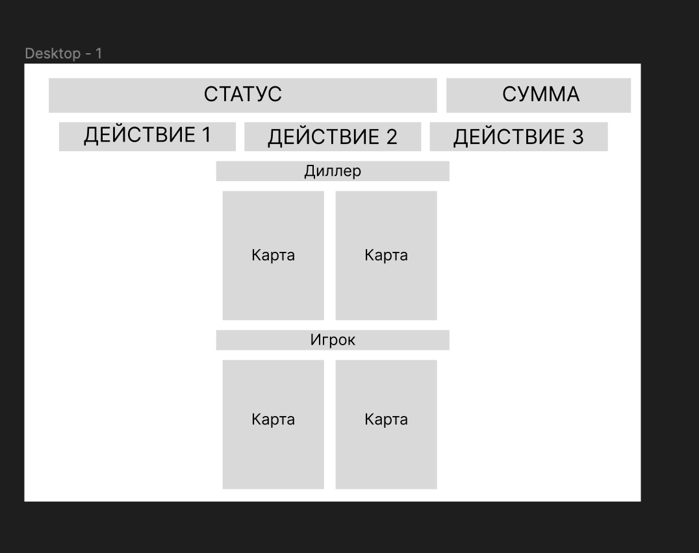
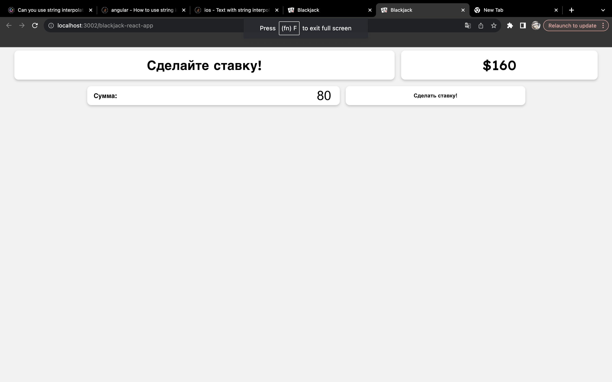
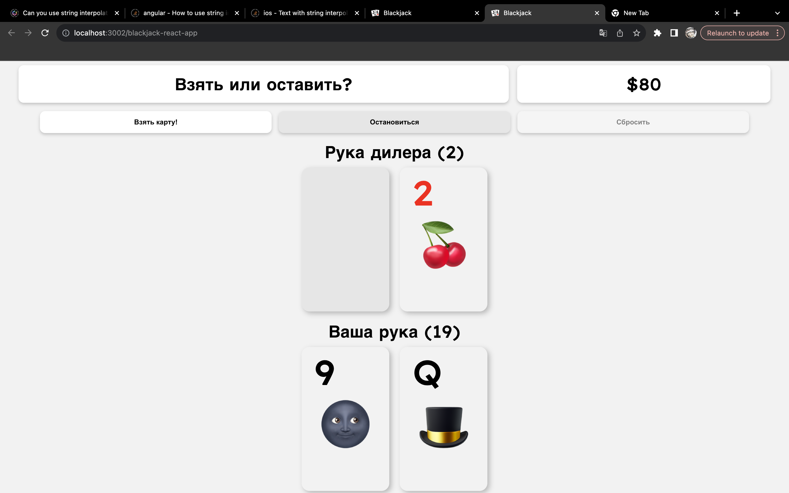
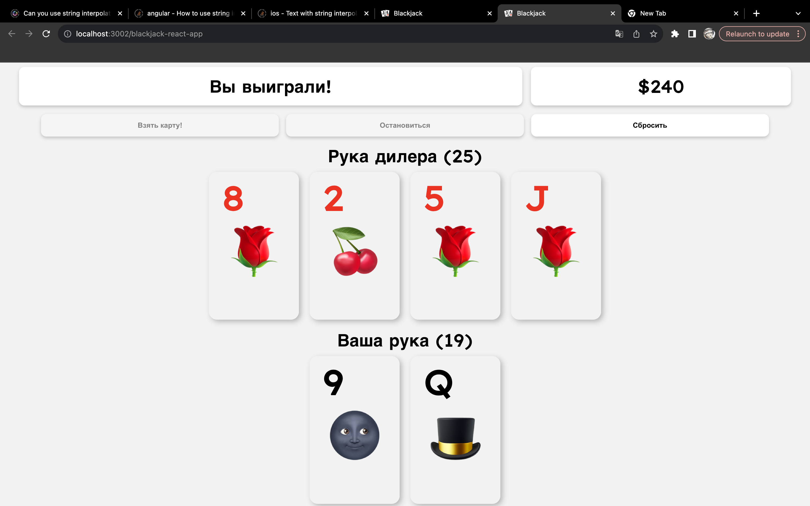
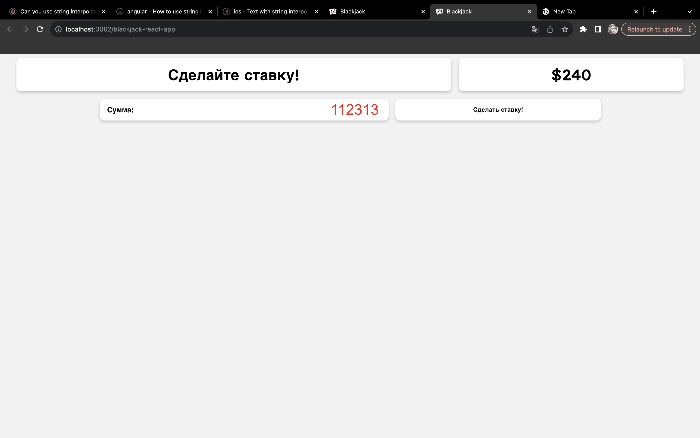
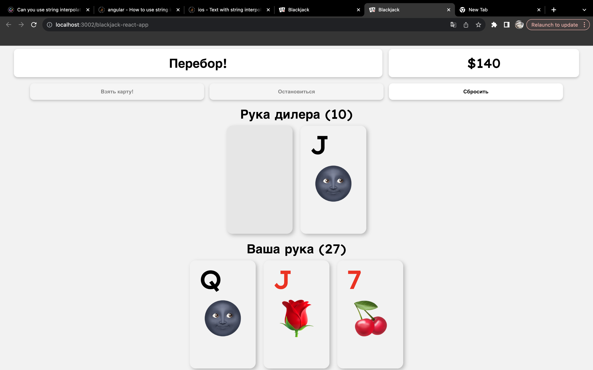
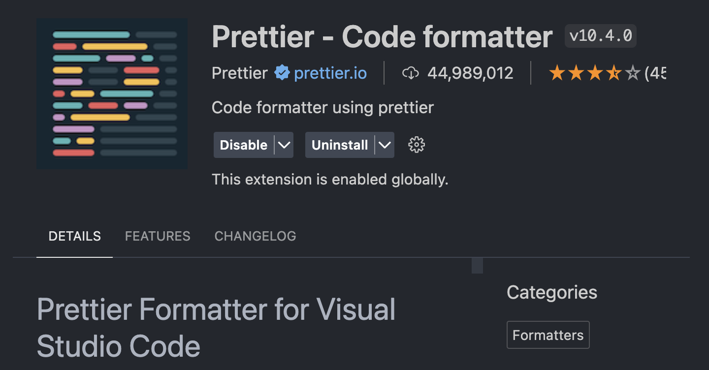

# ВВЕДЕНИЕ

В современном мире веб-технологии играют важную роль в развитии информационных систем и коммуникаций. Разработка сайтов стала неотъемлемой частью бизнеса, образования и повседневной жизни людей. В связи с этим возникает необходимость изучения основ веб-технологий и овладения навыками создания качественных и функциональных веб-ресурсов.

Целью данной курсовой работы является изучение основных принципов и методов разработки веб-сайтов, а также практическое применение полученных знаний для создания собственного сайта. В ходе выполнения работы будут рассмотрены различные аспекты веб-разработки, включая проектирование структуры сайта, создание страниц с использованием HTML и CSS, а также разработку интерактивных элементов с применением TypeScript и React.

Согласно уточненным требованиям, нами осуществлена разработка сайта, предназначенного исключительно для игры в блекджек без необходимости регистрации и онлайн-режима.

Сайт представляет собой игровую платформу, на которой пользователи могут свободно играть в блекджек без использования виртуальной валюты или участия профессионального дилера. Игровой процесс реализован в соответствии с международными правилами и стандартами, что обеспечивает пользователям честную и прозрачную игру.

Интерфейс сайта выполнен в минималистичном стиле и не содержит ненужных элементов, что позволяет пользователям сосредоточиться на игровом процессе. Сайт не предусматривает сбора персональных данных пользователей и не требует регистрации, что гарантирует сохранение конфиденциальности и анонимности игроков.

Таким образом, данный сайт представляет собой простую и удобную платформу для игры в блекджек без необходимости регистрации, обеспечивающую  честной и прозрачной игрой в соответствии с международными стандартами.

# Модель сайта

Макет сайта был реализован в `Figma` и изображен на рисунке \ref{fig:Дизайн в Figma}.



Макет состоит из:

1) Статуса. Отображает текущее состояния игрока во время партии.
2) Денег. Виртуальная валюта, необходимая для игры.
3) Кнопок действия. Кнопки, с помощью которых игрок может предпринимать действия.
4) Руки дилера и игрока. Отображает текущий счет и карты.

Дизайн является адаптивным и с помощью медиазапров изменяется размер элементов сайта.

## Применение CSS

Для реализации красивого дизайна похожего на дизайн-систему Cupertino было решено применить CSS.

Выделю главные преимущства, которое нам дало CSS.

Определение цветов темы:

```css
:root {
  --card-bg: #f2f2f2;
  --card-shadow: rgba(0, 0, 0, 0.25);
  --hidden-card-bg: rgb(230, 230, 230);
  --text-black: black;
  --text-red: red;
}


* {
  margin: 0;
  padding: 0;
}

body {
  background: var(--background-color);
  margin: 0;
  font-family: 'Lexend Exa', sans-serif;
  -webkit-font-smoothing: antialiased;
}
```

Определение цветов кнопок.

```css
:root {
  --primary-color: #fff;
  --secondary-color: #000;
  --shadow-color: rgba(0, 0, 0, 0.2);
  --background-color: #f2f2f2;
}

.controlsContainer {
  display: flex;
  justify-content: center;
  margin: 0.5em 1em 1em 1em;
  background-color: var(--background-color);
}

.betContainer {
  display: flex;
  align-items: center;
  margin: 0 0.5em;
  padding: 0 1em;
  width: 40%;
  border-radius: 10px;
  background-color: var(--primary-color);
  box-shadow: 0px 3px 6px var(--shadow-color);
}

.input {
  width: 1px;
  flex-grow: 1;
  margin: 0 0 0 0.5em;
  font-size: 200%;
  text-align: right;
  margin: 5px;
  padding: 0;
  border: 0;
  outline: 0;
  background-color: var(--primary-color);
  color: var(--secondary-color);
}

.inputError {
  width: 1px;
  flex-grow: 1;
  margin: 0 0 0 0.5em;
  font-size: 200%;
  text-align: right;
  margin: 5px;
  padding: 0;
  border: 0;
  outline: 0;
  background-color: var(--primary-color);
  color: red;
}

.input::-webkit-inner-spin-button,
.inputError::-webkit-inner-spin-button {
  margin: 0;
  -webkit-appearance: none;
}

.button {
  color: var(--secondary-color);
  font-weight: bold;
  margin: 0 0.5em;
  padding: 1em;
  width: 30%;
  outline: none;
  background-color: var(--primary-color);
  border-radius: 10px;
  box-shadow: 0px 3px 6px var(--shadow-color);
  text-align: center;
  cursor: pointer;
  border: none;
  transition: all 0.3s ease;
}

@media (hover: hover) {
  .button:hover {
    background: rgba(0, 0, 0, 0.05);
  }
}

.button:disabled {
  color: gray;
  background: rgb(245, 245, 245);
}

@media screen and (max-width: 992px) {
  .betContainer {
    width: 50%;
  }
}

@media screen and (max-width: 600px) {
  .betContainer {
    width: 70%;
  }

  .betContainer h4 {
    font-size: 75%;
  }

  .betContainer input {
    font-size: 125%;
  }
}
```

Определение дизайна карт.

```css
:root {
  --primary-color: #fff;
  --secondary-color: #000;
  --shadow-color: rgba(0, 0, 0, 0.2);
  --background-color: #f2f2f2;
}

.controlsContainer {
  display: flex;
  justify-content: center;
  margin: 0.5em 1em 1em 1em;
  background-color: var(--background-color);
}

.betContainer {
  display: flex;
  align-items: center;
  margin: 0 0.5em;
  padding: 0 1em;
  width: 40%;
  border-radius: 10px;
  background-color: var(--primary-color);
  box-shadow: 0px 3px 6px var(--shadow-color);
}

.input {
  width: 1px;
  flex-grow: 1;
  margin: 0 0 0 0.5em;
  font-size: 200%;
  text-align: right;
  margin: 5px;
  padding: 0;
  border: 0;
  outline: 0;
  background-color: var(--primary-color);
  color: var(--secondary-color);
}

.inputError {
  width: 1px;
  flex-grow: 1;
  margin: 0 0 0 0.5em;
  font-size: 200%;
  text-align: right;
  margin: 5px;
  padding: 0;
  border: 0;
  outline: 0;
  background-color: var(--primary-color);
  color: red;
}

.input::-webkit-inner-spin-button,
.inputError::-webkit-inner-spin-button {
  margin: 0;
  -webkit-appearance: none;
}

.button {
  color: var(--secondary-color);
  font-weight: bold;
  margin: 0 0.5em;
  padding: 1em;
  width: 30%;
  outline: none;
  background-color: var(--primary-color);
  border-radius: 10px;
  box-shadow: 0px 3px 6px var(--shadow-color);
  text-align: center;
  cursor: pointer;
  border: none;
  transition: all 0.3s ease;
}

@media (hover: hover) {
  .button:hover {
    background: rgba(0, 0, 0, 0.05);
  }
}

.button:disabled {
  color: gray;
  background: rgb(245, 245, 245);
}

@media screen and (max-width: 992px) {
  .betContainer {
    width: 50%;
  }
}

@media screen and (max-width: 600px) {
  .betContainer {
    width: 70%;
  }

  .betContainer h4 {
    font-size: 75%;
  }

  .betContainer input {
    font-size: 125%;
  }
}
```

## Графическое оформление web-страницы

Ниже представлен визуал страниц:












# Web-сценарии сайта на языке TypeScript

Для реализации динамического поведения, которое необходимо для проекта такой направленной было решено выбрать TypeScript.

Выбор обусловлен:

1) Наличием строгой типизации.
2) Приятным и удобным синтаксисом.
3) Поддержка современными библиотеками.

## Назначение TypeScript

В данном коде TypeScript используется для указания типов переменных и аргументов функций. Например, для переменной `deck` указан тип `any[]`, что означает, что она может содержать массив любых значений. Для переменных `userCards` и `dealerCards` также указан тип `any[]`.

Для аргументов функций также указаны типы. Например, для функции `placeBet` указан тип аргумента `amount` как `number`, что означает, что в эту функцию можно передать только числовое значение.

Кроме того, в коде использованы перечисления (enum) `GameState` и `Deal`, которые позволяют явно указать допустимые значения для соответствующих переменных и улучшить читаемость кода.

Наконец, в коде используются конструкции `useState` и `useEffect` из библиотеки React, для которых также указаны типы аргументов и возвращаемых значений с помощью TypeScript.

## Разработка TS скриптов

Этот код представляет собой компонент React, который реализует игру в блэкджек. Он включает в себя несколько подкомпонентов, таких как `Status`, `Controls` и `Hand`. Состояние игры и ее логика управляются с помощью хуков React `useState` и `useEffect`.

Игра начинается с того, что игрок делает ставку, затем выдаются две карты как игроку, так и дилеру. Ход игрока идет первым, и он может выбрать взять еще одну карту (hit) или закончить свой ход (stand). Если сумма очков игрока превышает 21, он проигрывает (bust). Если игрок остановился, наступает ход дилера. Дилер обязан брать карты, пока сумма его очков не достигнет 17 или более. Победитель определяется на основе того, кто имеет большую сумму очков, не превышая 21.

Компонент использует массив объектов карт для представления колоды, и включает функции для выдачи карт, подсчета очков и определения победителя. Также отслеживается и обновляется текущий баланс и сумма ставки в зависимости от результата каждой игры.

## State-management

В этом коде используется управление состоянием React с помощью хуков `useState` и `useEffect` для управления игрой в блэкджек.

Хук `useState` используется для создания нескольких переменных состояния, таких как `deck`, `userCards`, `userScore`, `dealerCards`, `dealerScore`, `balance`, `bet`, `gameState`, `message` и `buttonState`. Эти переменные состояния используются для хранения текущего состояния игры, включая колоду карт, карты игрока и дилера, текущий счет, баланс, ставку, сообщение и состояние кнопок.

Хук `useEffect` используется для выполнения побочных эффектов в зависимости от изменений в состоянии. Например, когда изменяется состояние `gameState`, вызывается функция `drawCard` для выдачи карт. Когда изменяются `userCards` или `dealerCards`, вызывается функция `calculate` для подсчета очков.

Кроме того, в этом коде используются другие функции для управления состоянием игры, такие как `resetGame`, `placeBet`, веб-страниц на соответствие стандартам разметки, определенным Консорциумом Всемирной паутины (W3C). Валидация кода важна для обеспечения правильной работы сайта во всех браузерах и устройствах, а также для улучшения SEO-оптимизации. Ошибки в коде могут приводить к плохому отображению сайта, медленной загрузке и низкому рейтингу в поисковых системах.
`drawCard`, `dealCard`, `revealCard`, `hit`, `stand`, `bust` и `checkWin`. Все эти функции обновляют состояние игры, вызывая соответствующие функции обновления состояния, переданные из хука `useState`.

Общий подход к управлению состоянием в этом коде состоит в том, чтобы хранить все необходиные данные в состоянии React и обновлять их с помощью функций обновления состояния при необходимости. Это позволяет React отслеживать изменения состояния и автоматически обновлять компонент, когда это необходимо.

# Валидация кода и продвижение сайта

**Форматтер**

Форматтер - это инструмент, который автоматически форматирует код в соответствии с определенными стандартами и правилами. Использование форматтера помогает сохранять код чистым, упорядоченным и легко читаемым, что облегчает его поддержку и сопровождение. Кроме того, форматтер может помочь избежать ошибок, связанных с неправильным форматированием кода.

В качестве форматера используется `Prettier`.



**Метаданные сайта**

Метаданные - это информация о сайте, которая не отображается на странице, но используется поисковыми системами и другими веб-сервисами для определения содержания и цели сайта. Метаданные могут включать в себя заголовок страницы, описание, ключевые слова, язык, авторство и другие сведения. Правильное использование метаданных может улучшить SEO-оптимизацию сайта и повысить его рейтинг в результатах поиска.

## Использование приемов продвижения

Были использованы следующие метаданные. Также `React` из коробки поддерживает некоторые SEO оптимизации для поддержки поиска по сайту.

```html
<meta name="description"
    content="Learn, play and master Blackjack with us. We offer tips, strategies and the best Blackjack games online." />
<meta name="keywords" content="Blackjack, online Blackjack, Blackjack strategies, Blackjack tips, Blackjack games" />
<meta name="author" content="Your Name or Your Company Name" />
```

# Заключение

В ходе этой работы были изучены основы создания веб-сайтов с использованием React и TypeScript. Было пройдено несколько этапов, включая создание компонентов, работу с состоянием и пропсами, управление жизненным циклом компонентов.

Одним из ключевых моментов в этой работе было изучение методов продвижения сайта, включая оптимизацию метаданных для поисковых систем, использование ключевых слов и SEO-стратегий.

Благодаря этой работе я приобрел навыки разработки веб-приложений с использованием современных инструментов и библиотек, а также навыки продвижения сайтов в поисковых системах. Эти навыки являются необходимыми для разработки и продвижения конкурентоспособных веб-приложений.

<!-- # СПИСОК ИСПОЛЬЗОВАННЫХ ИСТОЧНИКОВ 
<suaidoc-center> -->

# ПРИЛОЖЕНИЕ <suaidoc-center>

\lstinputlisting{src/components/styles/Card.module.css}

\lstinputlisting{src/components/styles/Controls.module.css}

\lstinputlisting{src/components/styles/Hand.module.css}

\lstinputlisting{src/components/styles/Status.module.css}

\lstinputlisting{src/components/Card.tsx}

\lstinputlisting{src/components/Controls.tsx}

\lstinputlisting{src/components/Hand.tsx}

\lstinputlisting{src/components/Status.tsx}

\lstinputlisting{src/components/App.tsx}

\lstinputlisting{src/components/Localization.tsx}

\lstinputlisting{src/index.css}

\lstinputlisting{src/deck.json}
