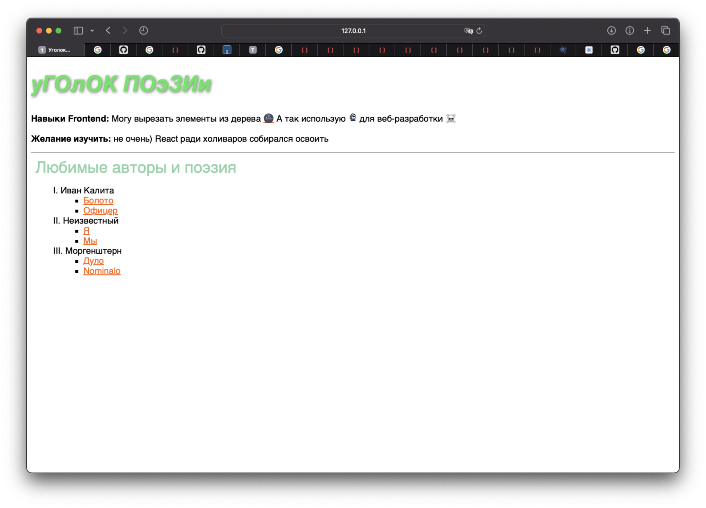

# Постановка задачи

**Цель работы:** изучение технологии каскадных таблиц стилей и приобретение навыков ее использования.

## Задание

Для выполнения задания по данной лабораторной работе следует воспользоваться web-страницами, созданными в предыдущей лабораторной работе. Перед выполнением задания необходимо изучить материал, представленный в списке рекомендуемых источников.

В процессе выполнения заданий требуется создать внешнюю таблицу стилей (одну или несколько), внутреннюю таблицу, а также продемонстрировать умение применять встроенные стили (для конкретного тега). Кроме того, следует использовать различные типы селекторов.

1. Примените атрибуты стиля применительно к следующим параметрам шрифта:

   - имя
   - размер (с заданием размера с применением абсолютных и относительных единиц измерения),
   - жирность (с заданием нескольких различных значений),
   - стиль (начертание),
   - цвет
   - Задайте размер шрифта и цвет к имеющимся на 1-ой странице заголовкам 1-го и 2-го уровней.

2. Примените атрибуты стиля применительно к следующим параметрам текста (для этого на 2-ой странице можно создать отдельный контейнер или несколько контейнеров с использованием парного тега `
` и вставить туда удобный для экспериментов текст):

   1. оформление (подчеркнутый и др.),
   2. горизонтальное выравнивание,
   3. вертикальное выравнивание (создайте примеры текста с верхними и нижними индексами, а также с размещением графического изображения внутри строки),
   4. высота строки,
   5. дополнительное расстояние между символами,
   6. дополнительное расстояние между словами,
   7. отступ красной строки,
   8. тень у текста.
   9. В процессе выполнения данного задания необходимо использовать различные значения, предусмотренные тем или иным параметрам.

3. Примените атрибуты стиля применительно к следующим параметрам списков:

   1. вид маркеров
   2. вид нумерации
   3. позиция маркера.

4. Примените атрибуты стиля к следующим параметрам обрамления контейнера на 2-ой веб-странице:

   1. тип рамки,
   2. цвет рамки,
   3. толщина рамки,
   4. скругление углов.

5. Задайте разный цвет фона для созданных веб-страниц.

6. Примените псевдоклассы для изменения цвета гиперссылок и для изменения прозрачности изображения при наведении курсора

# Выполнение работы

## Ход выполнения

В ходе выполнения работы был написан стиль, используя CSS, а также использованы HTML страницы. Код файлов представлен в приложении A и на [GitHub](ы).Для выполнения задания мы модифицировали следующие элементы страницы.

1. **Шрифт:**
   Применили атрибуты стиля к параметрам шрифта, включая имя, размер с использованием как абсолютных, так и относительных единиц измерения, жирность с разными значениями, начертание, цвет. Задали размер шрифта и цвет заголовкам 1-го и 2-го уровней на первой странице.

2. **Текст:**
   Применили стили к параметрам текста, таким как оформление (включая подчеркивание и другие), горизонтальное и вертикальное выравнивание, высота строки, расстояния между символами и словами, отступ красной строки, а также добавили тень к тексту. Создали контейнеры для экспериментов с различными текстами на второй странице.

3. **Списки:**
   Задали стили для различных параметров списков, включая вид маркеров, вид нумерации и позицию маркера.

4. **Обрамление контейнера:**
   Применили стили к обрамлению контейнера на второй веб-странице, включая тип рамки, цвет, толщину и скругление углов.

5. **Цвет фона:**
   Задали разные цвета фона для созданных веб-страниц, обеспечивая их визуальное разнообразие.

6. **Псевдоклассы:**
   Эффективно использовали псевдоклассы для изменения цвета гиперссылок и прозрачности изображения при наведении курсора, обеспечивая более интерактивный пользовательский опыт.

## Демонстрация работы

Результат применения CSS изображен на рисуках \ref{fig:Cтраница main} - \ref{fig:Прозрачность при наведении}.

# Вывод

В результате выполнения работы, мы успешно освоили технологию каскадных таблиц стилей (CSS) и приобрели значительные навыки в их использовании для оформления веб-страниц. В процессе экспериментов с различными параметрами стилей, мы создали внешние и внутренние таблицы стилей, а также эффективно применяли встроенные стили для конкретных тегов.

При работе с параметрами шрифта мы задавали разнообразные характеристики, такие как имя, размер (используя абсолютные и относительные единицы измерения), жирность, стиль начертания и цвет. Особое внимание уделили заголовкам первого и второго уровней, применяя к ним определенные размеры шрифта и цвета, что придало страницам более эстетичный и читаемый вид.

Также мы успешно модифицировали параметры текста, включая оформление (подчеркнутый и другие стили), горизонтальное и вертикальное выравнивание, высоту строки, расстояние между символами и словами, а также добавили тень. Создание контейнеров с использованием тега `
` позволило нам легко структурировать и применять стили к различным частям текста, что повысило гибкость и управляемость веб-страниц.

В области списков мы успешно контролировали вид маркеров, нумерацию и позицию маркера, что дополнило визуальное восприятие контента. Обрамление контейнера на второй веб-странице также было эффективно настроено с учетом типа рамки, ее цвета, толщины и скругления углов, что придало страницам структурированный и профессиональный вид.

Полученные знания в области CSS технологий позволят нам более гибко управлять стилями веб-страниц, обеспечивая их красочность, структурированность и легкость восприятия.

# Приложение <suaidoc-center>

**Листинг style.css**

\lstinputlisting{2/style.css}\hfill \break

**Листинг main.html**

\lstinputlisting{2/main.html}\hfill \break

**Листинг poetry.html**

\lstinputlisting{2/poetry.html}\hfill \break