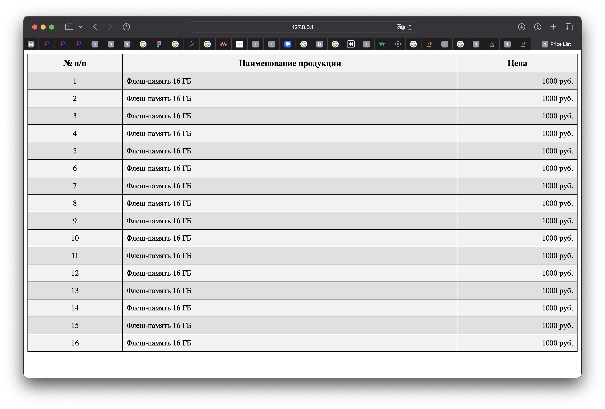

# Постановка задачи

**Цель работы:** изучение приемов создания таблиц в web-документах, а также использования графики в качестве фона.

## Задание

1. Для 1-ой web-страницы, созданной в процессе выполнения предыдущих лабораторных работ, задать фоновое изображение, которое будет повторяться по обеим осям. С этой целью рекомендуется использовать бесшовные фоны (паттерны), которые можно скачать, например, с сайта http://bgrounds.ru.

2. Для 2-ой web-страницы, созданной в процессе выполнения предыдущих лабораторных работ, задать фоновое изображение таким образом, чтобы оно занимало всю доступную площадь.

3. Создать web-страницу с расположенной на ней таблицей в соответствии с вариантом задания, номер которого совпадает с номером компьютера. Варианты задания приведены ниже. При выполнении задания необходимо обратить внимание на размеры и стиль шрифтов, расположение текста в ячейках.

4. Создать многострочную таблицу (10-15 строк) в виде прайс-листа, состоящую из трех столбцов. Содержание таблицы может быть любым (например, цена на флеш- память или жесткие диски). Для экономии времени все представленные данные могут быть вымышленными.

    В первом столбце таблицы указать № п/п и обеспечить выравнивание номеров по центру. Во втором столбце указать наименование продукции и обеспечить выравнивание текста по левому краю. В последнем столбце требуется указать цены представленной продукции и для этого столбца сделать выравнивание текста по правому краю.

    Все нечетные строки выделить одним цветом, а четные - другим. С этой целью рекомендуется использовать псевдоклассы. Для шапки таблицы установить более крупный размер шрифта и отличный от последующих строк цвет фона. Рамка таблицы должна быть сплошной, в ячейках таблицы следует предусмотреть одинаковые со всех сторон поля

## Вариант задания

- выделите нижнюю ячейку зеленым цветом,
- рамка таблицы должна быть сплошной, красного цвета и иметь толщину 2 пиксела,
- поля в ячейках таблицы должны составлять 5 пикселов.

# Выполнение работы

В ходе выполнения работы был реализован web-документ, содержащий таблицу и графическое изображение.

Сначала мы создали HTML-файл и указали в нём необходимые теги для определения структуры документа. Затем мы разместили в нём таблицу, используя тег table, и задали ей необходимые атрибуты с помощью CSS. Далее мы добавили в таблицу заголовок и несколько строк с данными, используя соответствующие теги.

Затем мы разместили в web-документе графическое изображение, используя тег img, и указали путь к файлу с изображением. Для того, чтобы изображение отображалось корректно, мы также задали ему необходимые атрибуты с помощью CSS.

В результате мы получили web-документ, содержащий таблицу и графическое изображение, которые отображаются корректно при просмотре документа в браузере. Исходный код доступен в Приложении и на [GitHub]()

## Демонстрация работы

Результат применения CSS изображен на рисунках \ref{fig:Страница main} - \ref{fig:Страница form}.

# Вывод

В результате выполнения лабораторной работы мы изучили приёмы создания таблиц в web-документах, а также использования графики в качестве фона.

Мы научились задавать фоновое изображение для web-страницы, которое может повторяться по обеим осям или занимать всю доступную площадь. Для этого мы использовали бесшовные фоны (паттерны), которые можно скачать с различных ресурсов в интернете.

Также мы научились создавать таблицы в web-документах, используя соответствующие теги и атрибуты. Мы изучили, как задавать размеры и стиль шрифтов, выравнивание текста в ячейках, а также как выделять четные и нечетные строки таблицы с помощью псевдоклассов.

В процессе выполнения работы мы приобрели практические навыки работы с HTML и CSS, необходимые для создания web-документов с таблицами и графикой. Эти навыки могут быть использованы при создании сайтов, веб-приложений и других интернет-ресурсов.

# Приложение <suaidoc-center>

**Листинг style.css**

\lstinputlisting{3/style.css}\hfill \break

**Листинг main.html**

\lstinputlisting{3/main.html}\hfill \break

**Листинг poetry.html**

\lstinputlisting{3/poetry.html}\hfill \break

**Листинг table.html**

\lstinputlisting{3/table/table.html}\hfill \break

**Листинг table.css**

\lstinputlisting{3/table/table.css}\hfill \break

**Листинг form.html**

\lstinputlisting{3/form/form.html}\hfill \break

**Листинг form.css**

\lstinputlisting{3/form/form.css}\hfill \break
