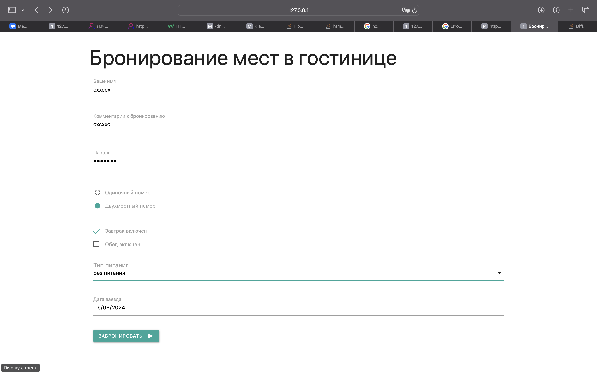
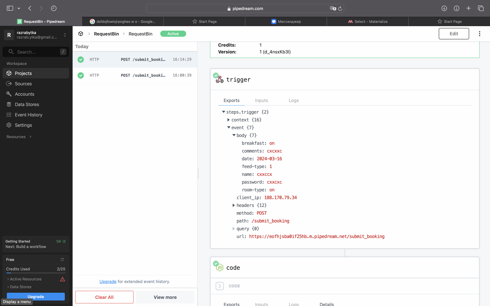

# Постановка задачи

**Цель работы:** изучение приемов создания таблиц в web-документах, а также использования графики в качестве фона.

## Задание

Создать web-документ, содержащий форму, в которой должны быть представлены: текстовое поле, текстовая область, поле пароля, две группы радиокнопок, две группы флажков с независимой фиксацией,обычный или раскрывающийся список, поле ввода для выбора даты,кнопки действия.

Элементы управления формы (поля ввода) должны быть снабжены связанными с ними текстовыми надписями. Необходимо продемонстрировать умение добавлять подсказки (подстановочный текст), обозначать обязательность заполнения поля, создавать группы функционально связанных элементов управления. Поля ввода должны быть расположены строго друг под другом, вне зависимости от того, сколько букв содержится в расположенной рядом с ними метке.

Тематика, для которой создается форма, определяется в соответствии с номером компьютера в лаборатории:

1. Дистанционное обучение;
2. Электронный магазин бытовой техники;
3. Электронный магазин компьютерной техники;
4. Фитнес-клуб;
5. Бронирование мест в гостинице;
6. Туристическое агентство;
7. Агентство недвижимости (продажа объектов);
8. Агентство недвижимости (аренда объектов);
9. Заказ билетов в театр;
10. Заказ билетов на самолет (поезд).

# Выполнение работы

В ходе выполнения работы был реализован web-документ, содержащий форму для бронирования мест в гостинице.

Сначала мы создали HTML-файл и указали в нём необходимые теги для определения структуры документа. Затем мы разместили в нём форму, используя тег form, и задали ей необходимые атрибуты с помощью CSS. Далее мы добавили в форму текстовое поле, текстовую область, поле пароля, две группы радиокнопок, две группы флажков с независимой фиксацией, обычный список, поле ввода для выбора даты и кнопки действия.

Мы также снабдили элементы управления формы связанными с ними текстовыми надписями и продемонстрировали умение добавлять подсказки (подстановочный текст), обозначать обязательность заполнения поля, создавать группы функционально связанных элементов управления.

Для того, чтобы форма отображалась корректно, мы также подключили необходимые CSS-библиотеки, используя тег link.

В результате мы получили web-документ, содержащий форму для бронирования мест в гостинице, которая отображается корректно при просмотре документа в браузере. Исходный код доступен в Приложении и на [GitHub](https://github.com/vladcto/suai-labs/tree/main/6_semester/Web/4).

## Демонстрация работы

Результат применения CSS изображен на рисунках \ref{fig:Страница main} - \ref{fig:Результат работы}.

# Вывод

В результате выполнения лабораторной работы мы изучили приёмы создания таблиц и форм в web-документах, а также использования графики в качестве фона.

Мы научились создавать таблицы с помощью тега table и задавать им необходимые атрибуты с помощью CSS. Также мы изучили, как задавать фоновое изображение для web-страницы, которое может повторяться по обеим осям или занимать всю доступную площадь.

Кроме того, мы научились создавать формы с помощью тега form и добавлять в них различные элементы управления, такие как текстовые поля, текстовые области, поля пароля, радиокнопки, флажки и т.д. Мы изучили, как снабжать элементы управления формы связанными с ними текстовыми надписями и продемонстрировали умение добавлять подсказки (подстановочный текст), обозначать обязательность заполнения поля, создавать группы функционально связанных элементов управления.

В процессе выполнения работы мы приобрели практические навыки работы с HTML и CSS, необходимые для создания web-документов с таблицами и формами. Эти навыки могут быть использованы при создании сайтов, веб-приложений и других интернет-ресурсов.

# Приложение <suaidoc-center>

**Листинг main.html**

\lstinputlisting{4/main.html}\hfill \break

**Листинг submit.js**

\lstinputlisting{4/scripts/submit.js}\hfill \break
