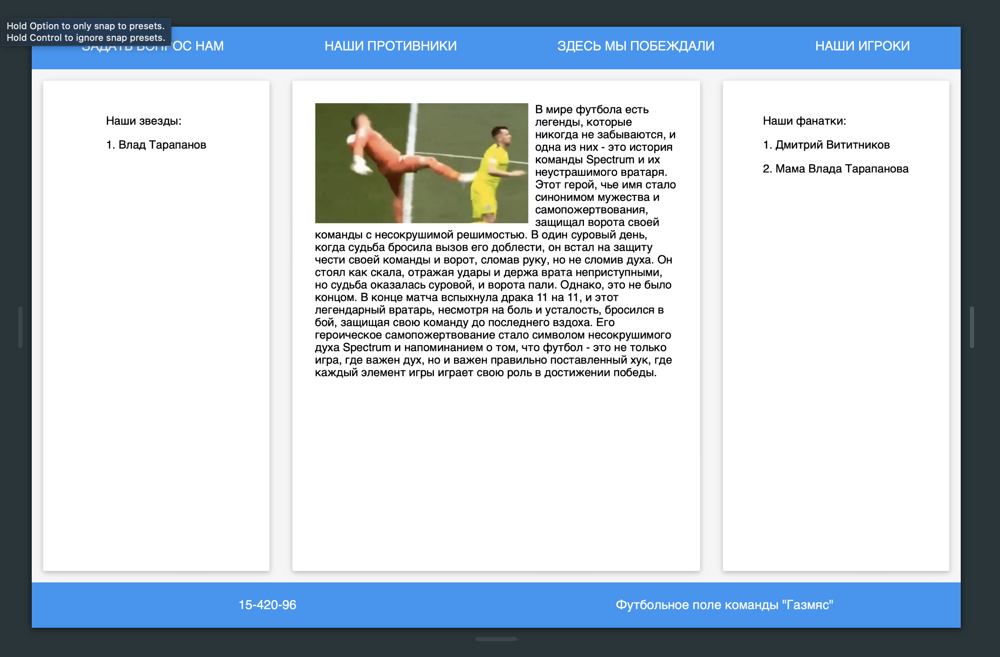
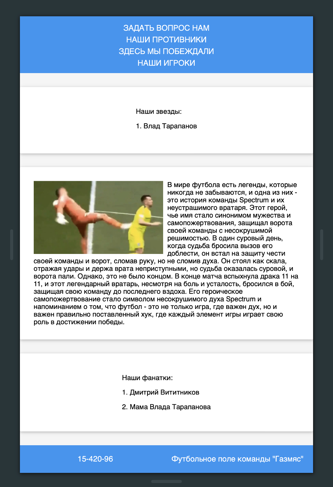

# Постановка задачи

**Цель работы:** изучение принципов блочной верстки web-страниц, приобретение навыков практического использования технологии Flexbox и  медиазапросов.

## Задание

Требуется создать страницу, на которой расположить 3 flex-контейнера

1) В первом flex-контейнере должна быть помещена горизонтальная навигационная панель с 4 гиперссылками, которые должны быть равномерно распределены по всей строке с одинаковым пространством вокруг них, пустое пространство перед первой и после последней должно быть равно половине пространства между двумя соседними элементами.

2) Во втором flex-контейнере необходимо расположить 3 блока с текстом, причем в центральном блоке должно быть изображение и обтекающий его с правой стороны текст. Левый и правый блоки должны иметь ширину примерно в 2 раза меньшую, чем ширина центрального блока. Блоки должны иметь такой размер по вертикали, чтобы занять всё доступное пространство flex-контейнера вдоль поперечной оси.

3) В третьем flex-контейнере должен находиться подвал с контактной информацией, расположенной в двух блоках: слева телефон, справа – адрес.

Требования к адаптивности страницы следующие.

- При изменении ширины экрана до величины меньшей 800 px  гиперссылки 1-го flex-контейнера и блоки 2-го flex-контейнера должны расположиться друг по другом, ширина блоков при этом становится одинаковой.
- Блоки подвала при сужении экрана перестраиваться не должны, они могут менять только свою ширину.
- Ширина изображения не должна становиться меньше, чем 200 px.

# Выполнение работы

В ходе выполнения работы был создан HTML-документ, в котором размещены три flex-контейнера. Первый flex-контейнер содержит горизонтальную навигационную панель с четырьмя гиперссылками, которые равномерно распределены по всей строке с одинаковым пространством вокруг них. Второй flex-контейнер разделен на три блока с текстом, причем в центральном блоке расположено изображение и обтекающий его с правой стороны текст. Левый и правый блоки имеют ширину примерно в два раза меньшую, чем ширина центрального блока. Блоки имеют такой размер по вертикали, чтобы занять все доступное пространство flex-контейнера вдоль поперечной оси. Третий flex-контейнер содержит подвал с контактной информацией, расположенной в двух блоках: слева телефон, справа – адрес.

Стилизация страницы осуществлена с использованием CSS. Для flex-контейнеров заданы необходимые свойства, обеспечивающие их правильное отображение и поведение при изменении ширины экрана. Для гиперссылок и блоков с текстом также заданы необходимые стили.

Для обеспечения адаптивности страницы используются медиазапросы. При изменении ширины экрана до величины меньшей 800 px гиперссылки первого flex-контейнера и блоки второго flex-контейнера располагаются друг по другу, ширина блоков при этом становится одинаковой. Блоки подвала при сужении экрана перестраиваться не должны, они могут менять только свою ширину. Ширина изображения не должна становиться меньше, чем 200 px.

В результате мы получили web-документ, выполняющий поставленные задачи. Исходный код доступен в Приложении и на [GitHub](https://github.com/vladcto/suai-labs/tree/main/6_semester/Web/5).

## Демонстрация работы

Результат работы изображен на рисунках \ref{fig:Страница main} - \ref{fig:Результат работы}.

# Вывод

В результате выполнения лабораторной работы мы изучили приёмы создания таблиц и форм в web-документах, а также использования графики в качестве фона.

Мы научились создавать таблицы с помощью тега table и задавать им необходимые атрибуты с помощью CSS. Также мы изучили, как задавать фоновое изображение для web-страницы, которое может повторяться по обеим осям или занимать всю доступную площадь.

Кроме того, мы научились создавать формы с помощью тега form и добавлять в них различные элементы управления, такие как текстовые поля, текстовые области, поля пароля, радиокнопки, флажки и т.д. Мы изучили, как снабжать элементы управления формы связанными с ними текстовыми надписями и продемонстрировали умение добавлять подсказки (подстановочный текст), обозначать обязательность заполнения поля, создавать группы функционально связанных элементов управления.

В процессе выполнения работы мы приобрели практические навыки работы с HTML и CSS, необходимые для создания web-документов с таблицами и формами. Эти навыки могут быть использованы при создании сайтов, веб-приложений и других интернет-ресурсов.

# Приложение <suaidoc-center>

**Листинг main.html**

\lstinputlisting{4/main.html}\hfill \break

**Листинг submit.js**

\lstinputlisting{4/scripts/submit.js}\hfill \break
