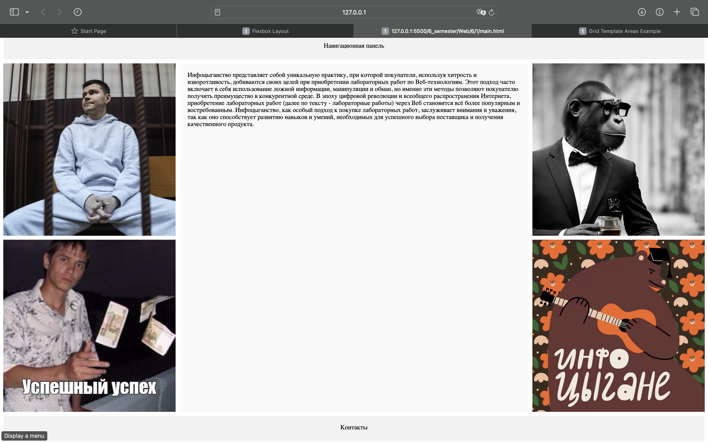
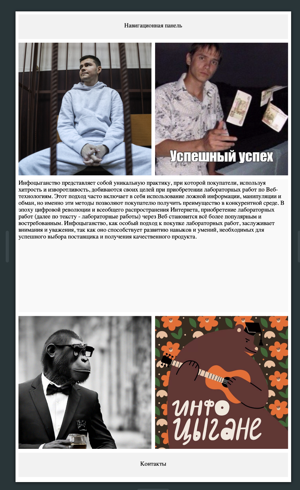
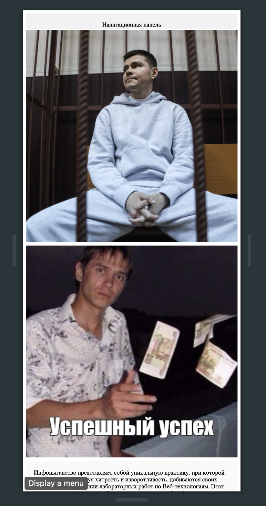
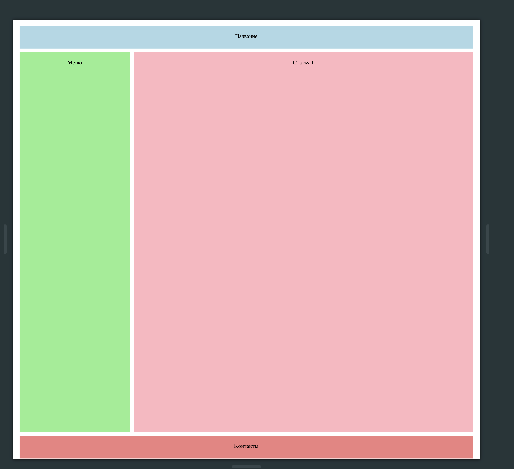
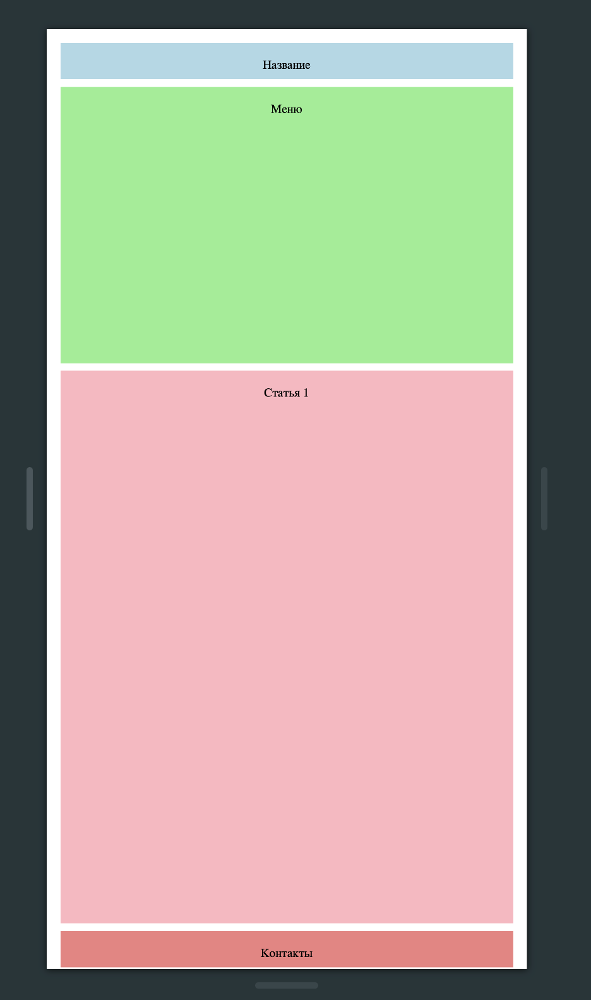

# Постановка задачи

**Цель работы:** приобретение навыков практического использования технологии CSS Grid и медиазапросов для реализации отзывчивого дизайна web-страницы.

## Задание

Задание состоит из 2-х частей, в каждой из которых должен быть реализован свой подход к созданию макета, основанный на использовании конкретных указанных свойств grid-контейнера.

В блоках, помеченных Фото 1 – Фото 4, следует разместить изображения. В блоке Статья должен быть помещен текст.
Макет должен быть создан путем размещения элементов web- страницы в ячейках сетки с использованием свойств:

- grid-row-start
- grid-row-end
- grid-column-start
- grid-column-end

При выполнении этого задания необходимо устанавливать гибкие размеры дорожек, используя единицу измерения, обозначаемую fr (fractional unit), а также там, где это целесообразно, относительные единицы измерения, вычисляемые относительно размеров окна браузера (vh, vw, vmin, vmax).

Требования к адаптивности страницы:

1) Для ширине экрана 900 px до 700 свой разметка.
2) при ширине экрана до величины меньшей 700 px все элементы страницы должны выстроиться в одну колонку друг под другом.

Также на базе технологии CSS Grid с использованием имен для областей сетки.

# Выполнение работы

В результате выполнения лабораторной работы был создан макет web-страницы с использованием технологии CSS Grid и медиазапросов для реализации отзывчивого дизайна. Были использованы свойства grid-row-start, grid-row-end, grid-column-start, grid-column-end для размещения элементов страницы в ячейках сетки. Устанавливались гибкие размеры дорожек с использованием единицы измерения fr, а также относительные единицы измерения, вычисляемые относительно размеров окна браузера (vh, vw, vmin, vmax). Были реализованы требования к адаптивности страницы: при ширине экрана 900 px до 700 px страница приобретала нужный вид, при ширине экрана до величины меньшей 700 px все элементы страницы выстраивались в одну колонку друг под другом.

В результате мы получили web-документ, выполняющий поставленные задачи. Исходный код доступен в Приложении и на [GitHub](https://github.com/vladcto/suai-labs/tree/main/6_semester/Web/6).

## Демонстрация работы

Результат работы изображен на рисунках \ref{fig:Страница при >900 px} - \ref{fig:Страница второго задания при <800 px}.

<l>

<m>

<l>

<l>

# Вывод

В ходе выполнения лабораторной работы были приобретены навыки практического использования технологии CSS Grid и медиазапросов для реализации отзывчивого дизайна web-страницы. Было продемонстрировано, что с помощью CSS Grid можно создавать сложные сетки и гибко настраивать их для различных устройств. Было показано, что использование медиазапросов позволяет создавать адаптивные страницы, которые будут корректно отображаться на различных устройствах с различными размерами экрана.

# Приложение <suaidoc-center>

\lstinputlisting{6/1/main.html}\hfill \break

\lstinputlisting{6/1/style.css}\hfill \break

\lstinputlisting{6/2/main.html}\hfill \break

\lstinputlisting{6/2/style.css}\hfill \break
