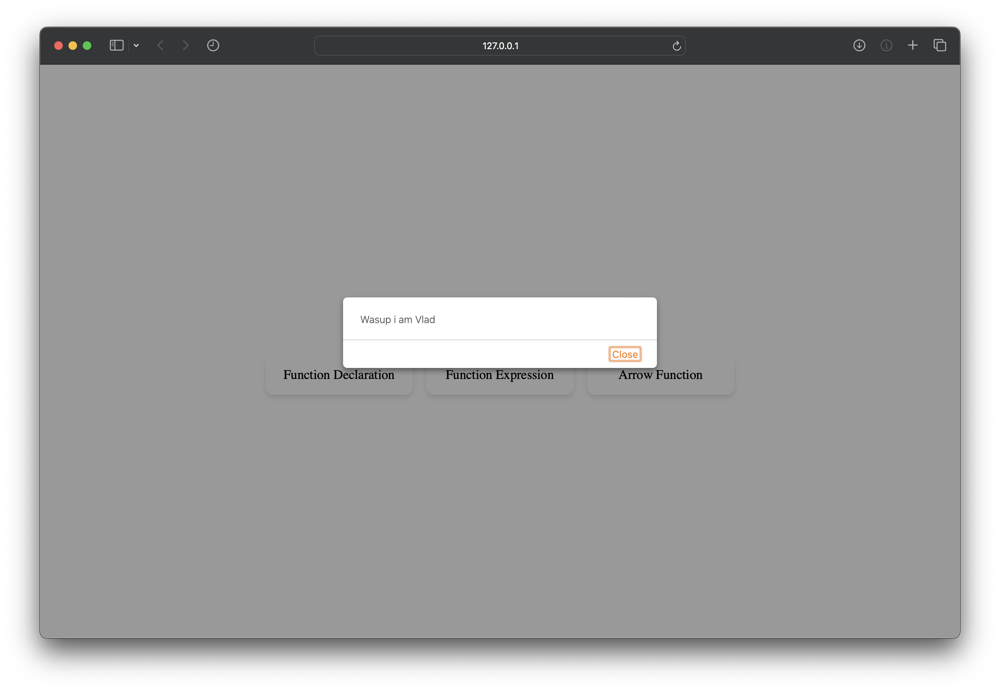
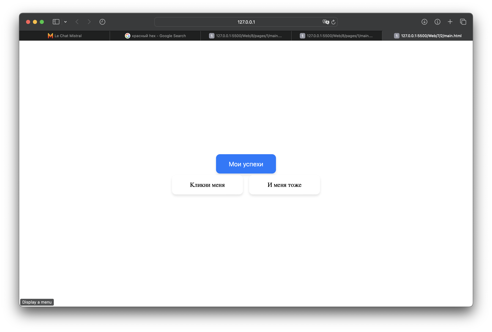

# Постановка задачи

**Цель работы:** с использованием языка JavaScript научиться создавать различные сценарии, выполняемые в web-страницах.

## Задание

Задание состоит из двух частей. 1-я часть одинаковая для всех содержит два пункта.

### Задание 1

Создайте и подключите к HTML-документу внешний скрипт, выводящий сообщение типа alert с текстом «Здравствуйте! Меня зовут…». Укажите свои фамилию и имя.

Напишите коды объявления функций, используя 3 способа:

- Function Declaration,
- Function Expression,
- Стрелочная функция (arrow function).

### Задание 2

**Вариант:** 5

- Создайте веб-страницу с кнопкой, на которой написано «Мои успехи». По клику на кнопке должны поочередно выводиться модальные окна типа "alert" с сообщениями о том, сколько лабораторных работ сдано в текущем семестре по каждой из изучаемых дисциплин.
- Разместите на веб-странице 2 разноцветных блока с текстом (созданных с помощью тега `
`), по щелчку на каждом из которых должны меняться текстовое содержимое и цвет фона данного блока.

# Выполнение работы

В ходе выполнения лабораторной работы мы приступили к реализации поставленной задачи, которая заключалась в создании и подключении внешнего скрипта к HTML-документу, а также в написании кодов объявления функций с использованием различных способов.

Был создан внешний скрипт, который успешно подключен к HTML-документу. Данный скрипт обеспечивает вывод сообщения типа alert с текстом, содержащим имя студента. 

Далее мы перешли к написанию кодов объявления функций тремя различными способами: Function Declaration, Function Expression и стрелочной функцией (arrow function). Каждый из этих способов был реализован в соответствии с синтаксисом языка JavaScript и требованиями лабораторной работы.  Исходный код доступен в Приложении и на [GitHub](https://github.com/vladcto/suai-labs/tree/main/6_semester/Web/7).

## Демонстрация работы

Результат работы изображен на рисунках \ref{fig:Верстка первого задания} - \ref{fig:Смена текста и цвета при клике}.

<l>

<l>

<l>

<l>

<l>

<l>

# Вывод

В процессе выполнения лабораторной работы были приобретены и укреплены навыки создания и подключения внешних скриптов к HTML-документам, что является важным аспектом разработки веб-страниц. Было продемонстрировано владение тремя способами объявления функций в языке JavaScript: Function Declaration, Function Expression и стрелочными функциями.

Приобретенный опыт позволит в будущем эффективно использовать полученные знания при создании более сложных и функциональных веб-приложений, а также способствует глубокому пониманию основ языка JavaScript и его особенностей.

# Приложение <suaidoc-center>

\lstinputlisting{7/1/main.html}\hfill \break

\lstinputlisting{7/1/script.js}\hfill \break

\lstinputlisting{7/1/main.html}\hfill \break

\lstinputlisting{7/2/script.js}\hfill \break

\lstinputlisting{7/style.css}\hfill \break
