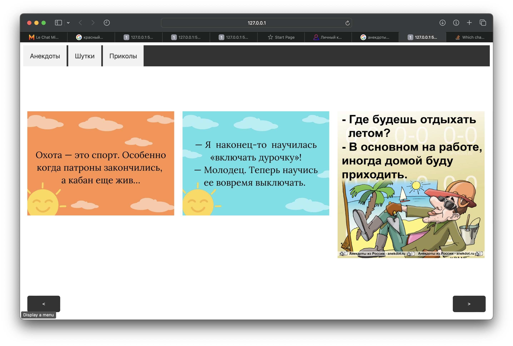
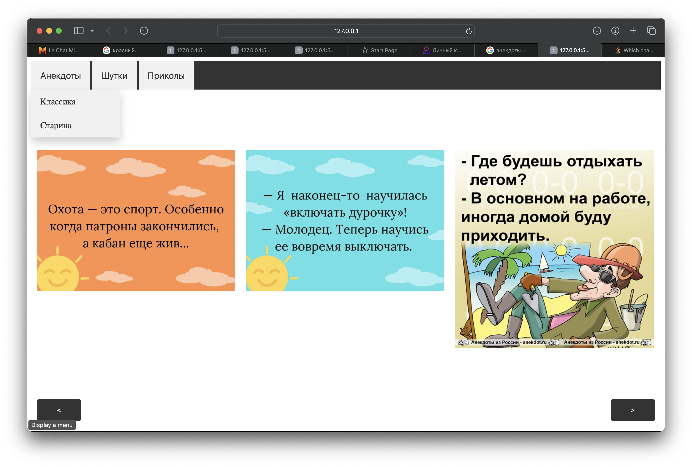
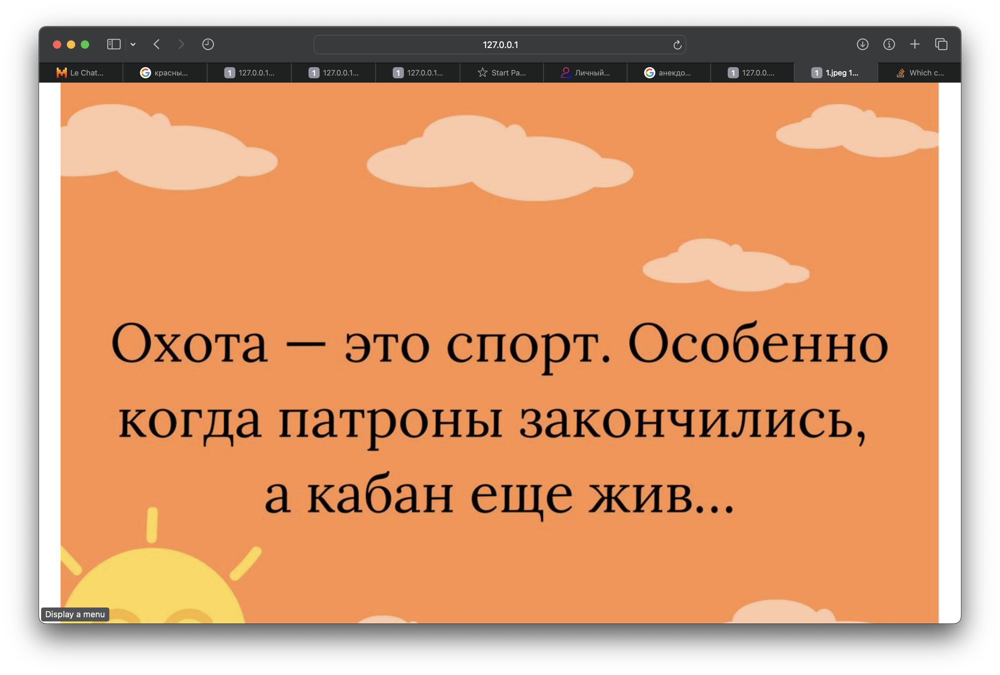
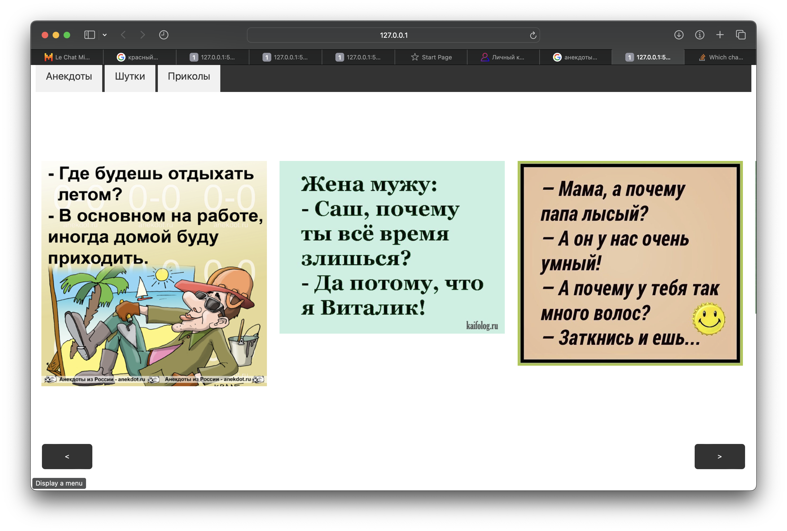

# Постановка задачи

**Цель работы:** научиться управлять позиционированием и отображением
элементов с использованием языка JavaScript.

## Задание

Задание состоит из двух частей.

### Задание 1

Требуется создать веб-страницу с раздвижным меню, содержащим не менее 3-х вертикально расположенных пунктов (гиперссылок). По щелчку на каждой из гиперссылок под данным пунктом меню должно появиться подменю из двух гиперссылок. По щелчку на каждой гиперссылке на веб-странице должно открываться соответствующее изображение либо появляться сообщение с текстовой информацией.

При наведении курсора на гиперссылки должно изменяться их стилевое оформление (цвет фона, шрифта и т.д.). При этом стиль оформления должен быть одинаковым для всех пунктов меню. Для элементов подменю стиль оформления также должен быть единообразным и меняющимся в зависимости от действий пользователя.

### Задание 2

Требуется создать галерею, содержащую не менее 7 изображений, с одновременно видимыми тремя изображениями. Слева и справа должны находиться кнопки, обеспечивающие прокрутку изображений влево-вправо.
Разрешается создать галерею другого типа, если она будет в большей степени соответствовать концепции оформления веб-сайта, разрабатываемого в ходе выполнения курсовой работы по данной дисциплине.

# Выполнение работы

В рамках лабораторной работы были выполнены два задания, направленных на управление позиционированием и отображением элементов при помощи JavaScript.

В первом задании была создана веб-страница с горизонтальным меню, включающим выпадающие подменю. Были реализованы функции смены стилевого оформления при наведении курсора и открытия изображений при клике на гиперссылки. Во втором задании была создана веб-страница с раздвижным вертикальным меню, содержащим подменю. Также были реализованы функции смены стиля при наведении курсора и отображения изображений или текстовой информации при клике на гиперссылки.

В результате мы получили web-документ, выполняющий поставленные задачи. Исходный код доступен в Приложении и на [GitHub](https://github.com/vladcto/suai-labs/tree/main/6_semester/Web/8).

## Демонстрация работы

Результат работы изображен на рисунках \ref{fig:Верстка страницы} - \ref{fig:Прокрутка списка}.

# Вывод

В результате выполнения лабораторной работы были приобретены практические навыки управления позиционированием и отображением элементов на веб-страницах с использованием языка JavaScript. Были реализованы функции создания горизонтального и вертикального меню с выпадающими подменю, динамической сменой стилевого оформления и взаимодействием с содержимым страницы при клике на гиперссылки. Приобретенный опыт способствует глубокому пониманию механизмов работы JavaScript и подготавливает к решению более сложных задач в области веб-разработки.

# Приложение <suaidoc-center>

\lstinputlisting{8/main.html}\hfill \break

\lstinputlisting{8/scripts.js}\hfill \break

\lstinputlisting{8/styles.css}\hfill \break
