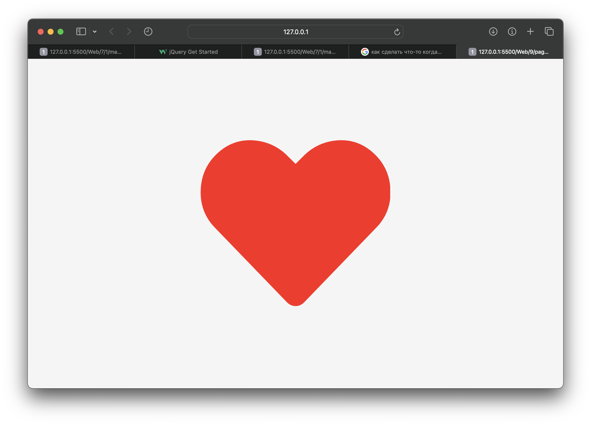
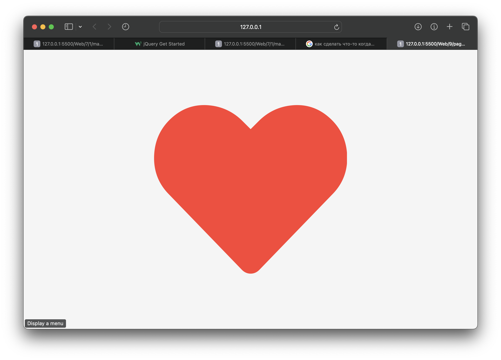
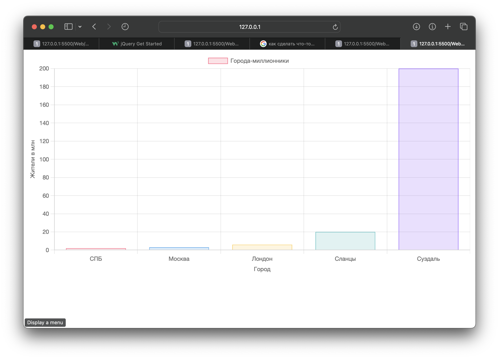

# Постановка задачи

**Цель работы:** с использованием библиотек языка JavaScript научиться создавать анимационные эффекты и строить графики на веб-странице.

## Задание

Задание состоит из двух пунктов. В процессе выполнения можно использовать любые библиотеки языка JavaScript, включая те, работа с которыми была рассмотрена в лекционном курсе (jQuery и Chart.js).

1. Создать анимационный эффект на веб-странице, установив такие параметры анимации, как длительность, функцию плавности (ее часто называют функцией смягчения, или кривой анимации, представляющей собой график изменения параметра анимации в зависимости от времени) и др.
2. Поместить на веб-страницу график (диаграмму), отображающий данные в соответствии с тематикой, соответствующей варианту задания.

# Выполнение работы

В результате выполнения лабораторной работы были созданы теги для анимации,
а также показан график населения городов.

В результате мы получили web-документ, выполняющий поставленные задачи. Исходный код доступен в Приложении и на [GitHub](https://github.com/vladcto/suai-labs/tree/main/6_semester/Web/9).

## Демонстрация работы

Результат работы изображен на рисунках \ref{fig:Анимация сердца 1} - \ref{fig:Графики}.

<l>

<l>

<l>

# Вывод

В ходе выполнения лабораторной работы были приобретены практические навыки использования библиотек языка JavaScript для создания анимационных эффектов и построения графиков на веб-страницах. Были освоены настройки параметров анимации и методы работы с библиотекой Chart.js. Приобретенный опыт способствует расширению возможностей в веб-разработке и может быть применен при решении различных практических задач.

# Приложение <suaidoc-center>

\lstinputlisting{9/pages/1/main.html} \hfill \break

\lstinputlisting{9/pages/1/scripts.js} \hfill \break

\lstinputlisting{9/pages/1/styles.css} \hfill \break

\lstinputlisting{9/pages/2/main.html} \hfill \break

\lstinputlisting{9/pages/2/scripts.js} \hfill \break
