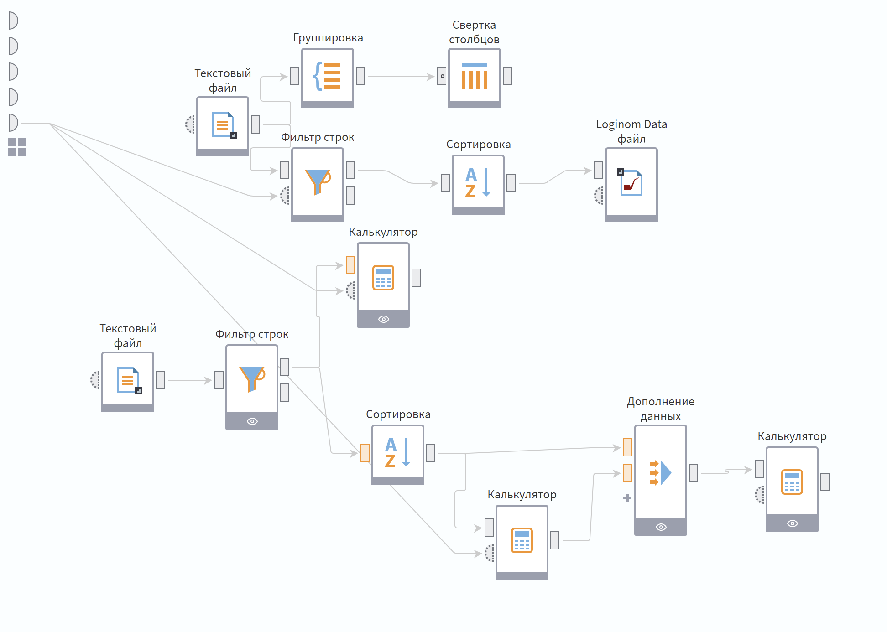
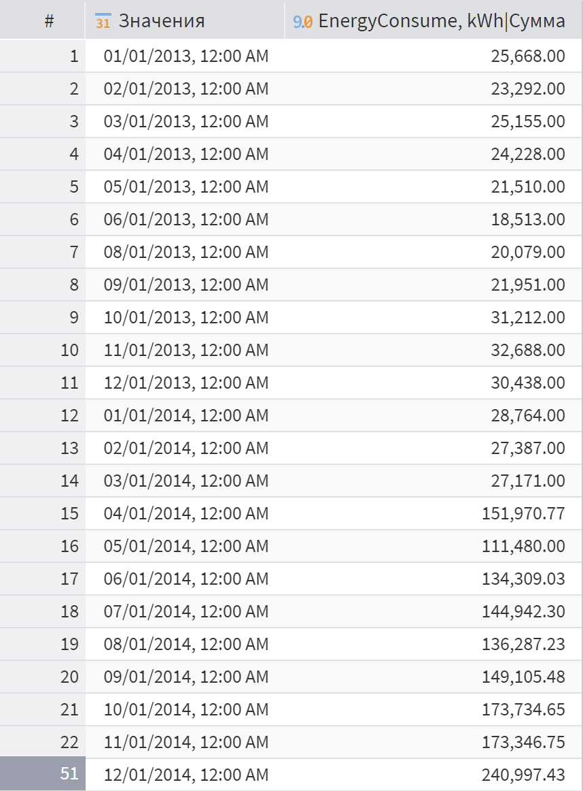
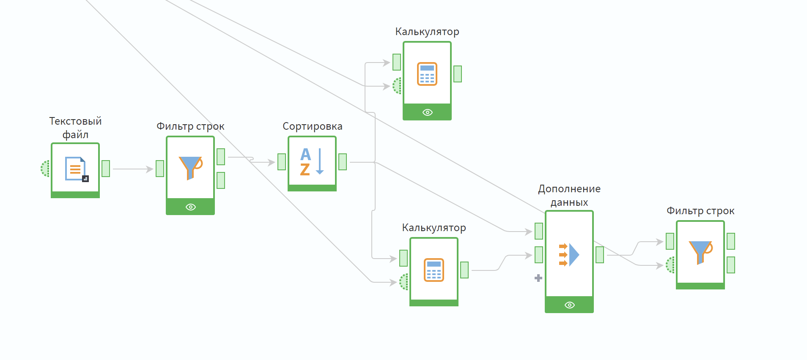
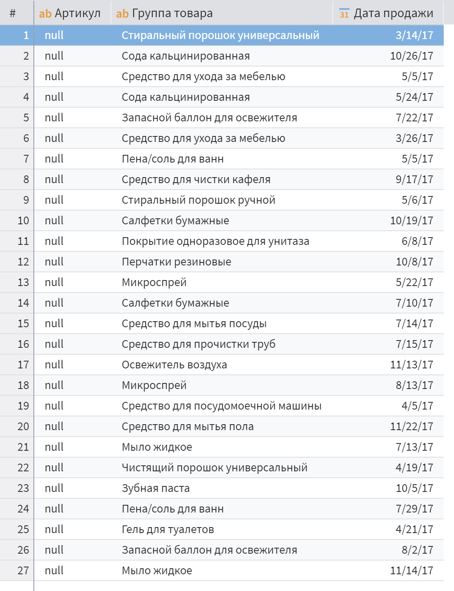
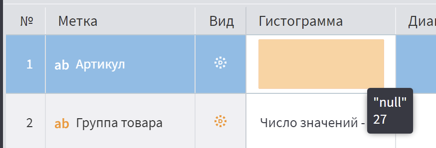
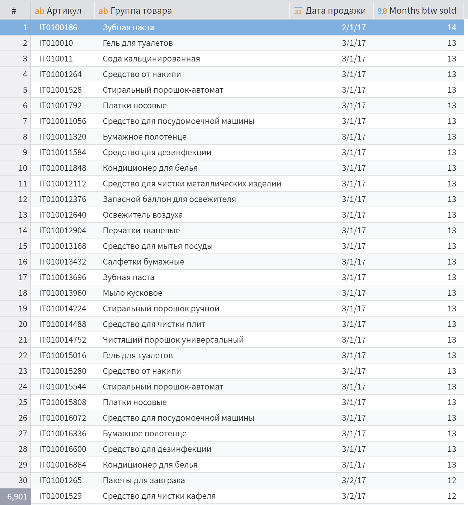
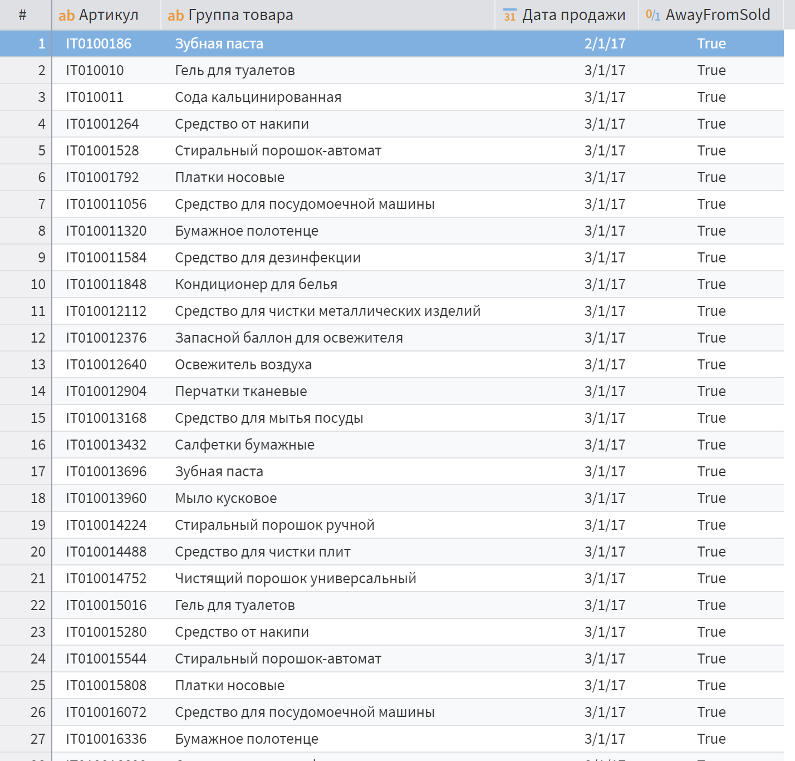
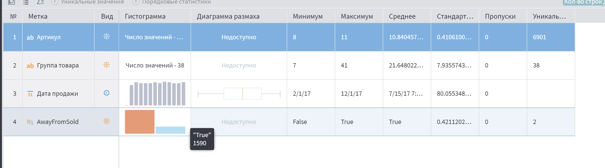
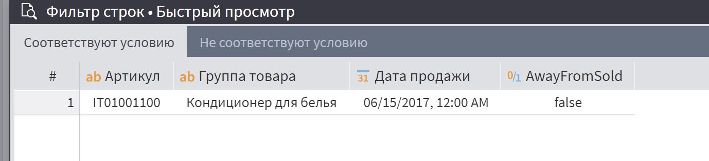

<!-- markdown-lint disable>

# Постановка задания

Ознакомится с базовым функционалом Loginom. Научится работать с визуализатором, калькулятором, сортировкой и переменными.

## Требования к отчету

- Обосновать группировку из 1 задания.

- Включить иллюстрации выполнения 2 задания, включая ответы на вопросы:
  - У какого количества товаров отсутствует артикул?

  - Сколько месяцев прошло с продажи конкретного товара, например, товара IT01001100 (любого другого товара).

  - Какие товары не продавались дольше всего? Как долго?

  - Какое количество товаров пора выводить из продажи? Принимайте решение самостоятельно.

# Выполнение работы

В результате выполнения лабораторной работы мы получили схему, изображенную на рисунке \ref{fig:Итоговая схема}.

## 1 задание

Я решил выполнить группировку по датам изображенную на рисунке \ref{fig:Группировка по датам}. Это позволит нам проанализировать в какие дни потреблялось больше всего энергии и в зависимости от этого, скорректировать энергопотребление.

## 2 задание

# Вывод

В результате выполнения лабораторной работе мы смогли проанализировать информацию о товарах. При выполнения мы воспользовались платформой для аналитики Loginom. Использование этой платформы позволило в удобном нам формате обработать данные. Также ма научились работать с визуализатором, экспортом, калькулятором, сортировкой, фильтром.

Полученные знания пригодятся для выполнения анализа и визуализирования данных бизнеса.
