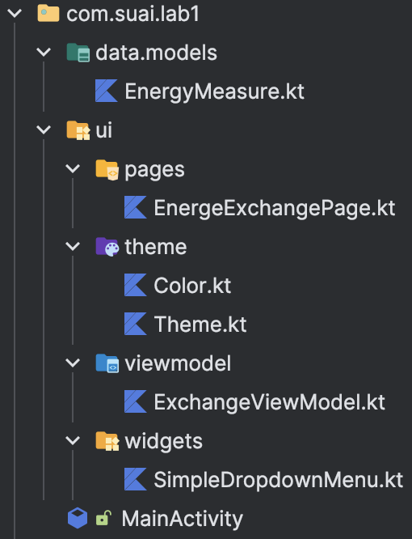
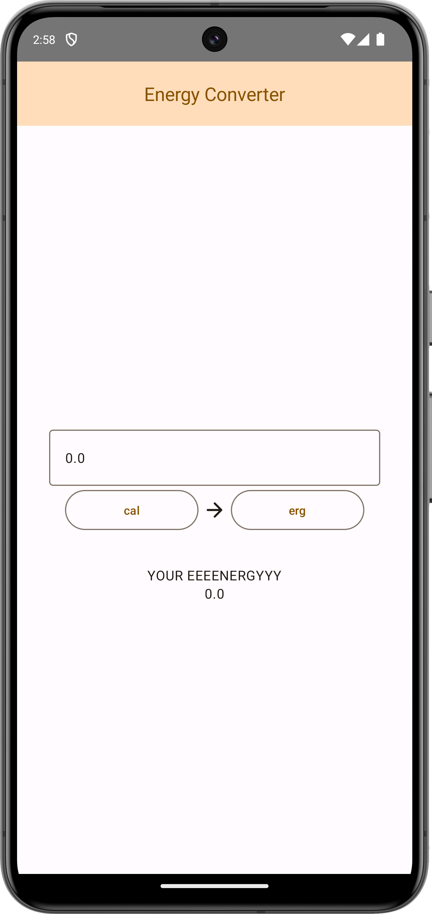
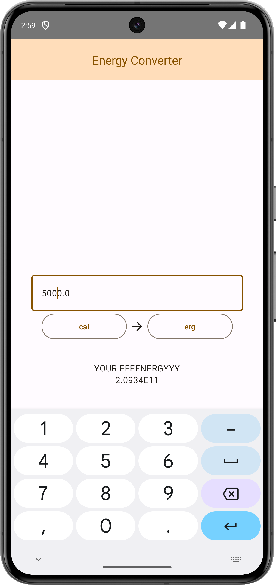
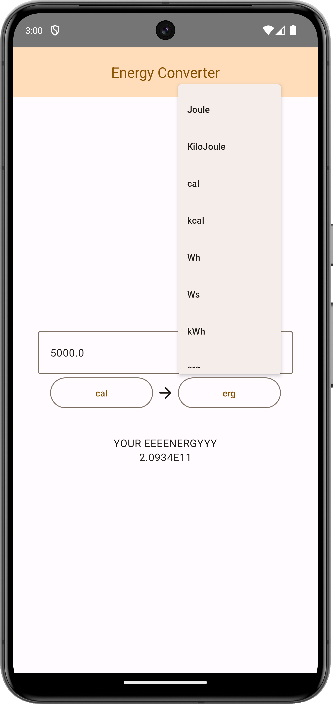
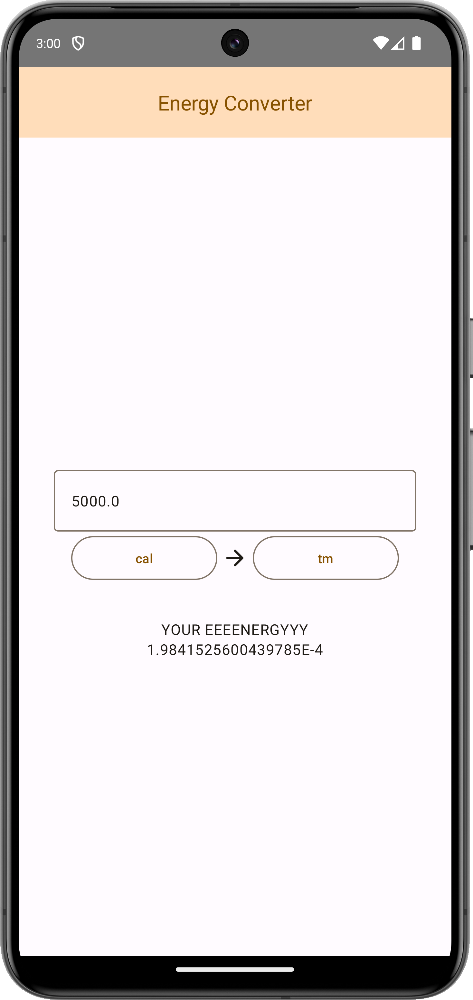

# Постановка задачи

**Цель работы:** получить практические навыки разработки простых мобильных приложений с использованием Android SDK.

## Задание

Разработайте калькулятор для арифметических операций в соответствии с вариантом. Интерфейс должен быть интуитивно понятным, результат вычислений должен выводиться пользователю в Activity, все цифры и математические операции должны иметь отдельные кнопки.

Чтобы подобрать вариант необходимо найти число N = (номер группы + номер студента в журнале) mod количество_вариантов + 1. где mod – остаток от деления, N - номер варианта.

**Вариант** $=1 + (4128+5)\bmod15=9$

Преобразователь энергии (не менее 10 направлений перевода)

# Выполнение работы

Для выполнения работы был выбран фреймворк `Jetpack Compose` в виду простоты его использования.

Итоговая структура проекта изображена рисунке \ref{fig:Структура проекта}

<m>

Код итоговый проект доступен в Приложении и на [GitHub](https://github.com/vladcto/suai-labs/tree/fdff415d04e1ec00bceb77f5288fad5343444772/6_semester/%D0%98%D0%A2%D0%9C/lab1).

Бизнес логика преобразования энергии находится в файле `EnergyMeasure.kt`. Главная для понимания часть представлена на листинге ниже.

```kotlin
val energyMeasurementRepository: List<EnergyMeasure> = listOf(
    EnergyMeasure("Joule", 1.0),
    EnergyMeasure("KiloJoule", 1000.0),
    EnergyMeasure("cal", 4.1868),
    EnergyMeasure("kcal", 4186.8),
    EnergyMeasure("Wh", 3600.0),
    EnergyMeasure("Ws", 1.0),
    EnergyMeasure("kWh", 3600000.0),
    EnergyMeasure("erg", .0000001),
    EnergyMeasure("kgf-m", 9.80665),
    EnergyMeasure("tm", 105506000.0),
)

data class EnergyMeasure(val name: String, val joule: Double) {
    fun convertTo(count: Double, output: EnergyMeasure): Double {
        return count * this.joule / output.joule
    }

    override fun toString() = name
}
```

Затем эта модель используется в `ExchangeViewModel`.

```kotlin
data class ExchangeState(
    val inputMeasure: EnergyMeasure,
    val inputCount: Double,
    val outputMeasure: EnergyMeasure,
) {
    val outputCount: Double = inputMeasure.convertTo(inputCount, outputMeasure)
}

class ExchangeViewModel : ViewModel() {
    private val _state = MutableStateFlow(
        ExchangeState(
            inputMeasure = energyMeasurementRepository[0],
            inputCount = 0.0,
            outputMeasure = energyMeasurementRepository[1],
        )
    )
    val state = _state.asStateFlow()

    fun setInputMeasure(measure: EnergyMeasure) {
        _state.update { state ->
            state.copy(inputMeasure = measure)
        }
    }

    fun setOutputMeasure(measure: EnergyMeasure) {
        _state.update { state ->
            state.copy(outputMeasure = measure)
        }
    }

    fun setInputCount(count: Double) {
        _state.update { state ->
            state.copy(inputCount = count)
        }
    }
}
```

## Демонстрация работы

На рисунках \ref{fig:Начальный экран} - \ref{fig:Смена единицы измерения} представлен результат работы приложения.

<m>

<m>

<m>

<m>

# Вывод

В результате выполнения работы были получены практические навыки разработки мобильных приложений с использованием Android SDK. Для реализации поставленной задачи был выбран фреймворк Jetpack Compose, обоснованный своей простотой использования.

Демонстрация работы приложения подчеркивает интуитивную понятность интерфейса. Начиная с открытия приложения, пользователь может вводить количество энергии и выбирать единицы измерения как входных, так и выходных данных.

Полученные навыки разработки мобильных приложений, особенно с использованием Jetpack Compose, представляют собой ценный опыт. Работа с библиотеками, архитектурные решения, и управление состоянием в приложении - все это важные аспекты, которые были освоены в ходе выполнения данной задачи. Эти навыки могут быть успешно применены в будущих проектах, требующих разработки мобильных приложений под Android.

# Листинг <suaidoc-center>

```kotlin
ExchangeViewModel.kt
package com.suai.lab1.ui.viewmodel

import androidx.lifecycle.ViewModel
import com.suai.lab1.data.models.EnergyMeasure
import com.suai.lab1.data.models.energyMeasurementRepository
import kotlinx.coroutines.flow.MutableStateFlow
import kotlinx.coroutines.flow.asStateFlow
import kotlinx.coroutines.flow.update

data class ExchangeState(
    val inputMeasure: EnergyMeasure,
    val inputCount: Double,
    val outputMeasure: EnergyMeasure,
) {
    val outputCount: Double = inputMeasure.convertTo(inputCount, outputMeasure)
}

class ExchangeViewModel : ViewModel() {
    private val _state = MutableStateFlow(
        ExchangeState(
            inputMeasure = energyMeasurementRepository[0],
            inputCount = 0.0,
            outputMeasure = energyMeasurementRepository[1],
        )
    )
    val state = _state.asStateFlow()

    fun setInputMeasure(measure: EnergyMeasure) {
        _state.update { state ->
            state.copy(inputMeasure = measure)
        }
    }

    fun setOutputMeasure(measure: EnergyMeasure) {
        _state.update { state ->
            state.copy(outputMeasure = measure)
        }
    }

    fun setInputCount(count: Double) {
        _state.update { state ->
            state.copy(inputCount = count)
        }
    }
}
Color.kt
package com.example.compose

import androidx.compose.ui.graphics.Color

val md_theme_light_primary = Color(0xFF875200)
val md_theme_light_onPrimary = Color(0xFFFFFFFF)
val md_theme_light_primaryContainer = Color(0xFFFFDDBA)
val md_theme_light_onPrimaryContainer = Color(0xFF2B1700)
val md_theme_light_secondary = Color(0xFF715A41)
val md_theme_light_onSecondary = Color(0xFFFFFFFF)
val md_theme_light_secondaryContainer = Color(0xFFFDDDBD)
val md_theme_light_onSecondaryContainer = Color(0xFF281805)
val md_theme_light_tertiary = Color(0xFF8F4E00)
val md_theme_light_onTertiary = Color(0xFFFFFFFF)
val md_theme_light_tertiaryContainer = Color(0xFFFFDCC1)
val md_theme_light_onTertiaryContainer = Color(0xFF2E1500)
val md_theme_light_error = Color(0xFFBA1A1A)
val md_theme_light_errorContainer = Color(0xFFFFDAD6)
val md_theme_light_onError = Color(0xFFFFFFFF)
val md_theme_light_onErrorContainer = Color(0xFF410002)
val md_theme_light_background = Color(0xFFFFFBFF)
val md_theme_light_onBackground = Color(0xFF1F1B16)
val md_theme_light_surface = Color(0xFFFFFBFF)
val md_theme_light_onSurface = Color(0xFF1F1B16)
val md_theme_light_surfaceVariant = Color(0xFFF1DFD0)
val md_theme_light_onSurfaceVariant = Color(0xFF50453A)
val md_theme_light_outline = Color(0xFF827568)
val md_theme_light_inverseOnSurface = Color(0xFFFAEFE7)
val md_theme_light_inverseSurface = Color(0xFF352F2A)
val md_theme_light_inversePrimary = Color(0xFFFFB866)
val md_theme_light_shadow = Color(0xFF000000)
val md_theme_light_surfaceTint = Color(0xFF875200)
val md_theme_light_outlineVariant = Color(0xFFD4C4B5)
val md_theme_light_scrim = Color(0xFF000000)

val md_theme_dark_primary = Color(0xFFFFB866)
val md_theme_dark_onPrimary = Color(0xFF482900)
val md_theme_dark_primaryContainer = Color(0xFF673D00)
val md_theme_dark_onPrimaryContainer = Color(0xFFFFDDBA)
val md_theme_dark_secondary = Color(0xFFE0C1A3)
val md_theme_dark_onSecondary = Color(0xFF3F2D17)
val md_theme_dark_secondaryContainer = Color(0xFF58432C)
val md_theme_dark_onSecondaryContainer = Color(0xFFFDDDBD)
val md_theme_dark_tertiary = Color(0xFFFFB779)
val md_theme_dark_onTertiary = Color(0xFF4C2700)
val md_theme_dark_tertiaryContainer = Color(0xFF6C3A00)
val md_theme_dark_onTertiaryContainer = Color(0xFFFFDCC1)
val md_theme_dark_error = Color(0xFFFFB4AB)
val md_theme_dark_errorContainer = Color(0xFF93000A)
val md_theme_dark_onError = Color(0xFF690005)
val md_theme_dark_onErrorContainer = Color(0xFFFFDAD6)
val md_theme_dark_background = Color(0xFF1F1B16)
val md_theme_dark_onBackground = Color(0xFFEBE1D9)
val md_theme_dark_surface = Color(0xFF1F1B16)
val md_theme_dark_onSurface = Color(0xFFEBE1D9)
val md_theme_dark_surfaceVariant = Color(0xFF50453A)
val md_theme_dark_onSurfaceVariant = Color(0xFFD4C4B5)
val md_theme_dark_outline = Color(0xFF9D8E81)
val md_theme_dark_inverseOnSurface = Color(0xFF1F1B16)
val md_theme_dark_inverseSurface = Color(0xFFEBE1D9)
val md_theme_dark_inversePrimary = Color(0xFF875200)
val md_theme_dark_shadow = Color(0xFF000000)
val md_theme_dark_surfaceTint = Color(0xFFFFB866)
val md_theme_dark_outlineVariant = Color(0xFF50453A)
val md_theme_dark_scrim = Color(0xFF000000)


val seed = Color(0xFFFFA52A)

Theme.kt
package com.suai.lab1.ui.theme

import androidx.compose.foundation.isSystemInDarkTheme
import androidx.compose.material3.MaterialTheme
import androidx.compose.material3.darkColorScheme
import androidx.compose.material3.lightColorScheme
import androidx.compose.runtime.Composable
import com.example.compose.md_theme_dark_background
import com.example.compose.md_theme_dark_error
import com.example.compose.md_theme_dark_errorContainer
import com.example.compose.md_theme_dark_inverseOnSurface
import com.example.compose.md_theme_dark_inversePrimary
import com.example.compose.md_theme_dark_inverseSurface
import com.example.compose.md_theme_dark_onBackground
import com.example.compose.md_theme_dark_onError
import com.example.compose.md_theme_dark_onErrorContainer
import com.example.compose.md_theme_dark_onPrimary
import com.example.compose.md_theme_dark_onPrimaryContainer
import com.example.compose.md_theme_dark_onSecondary
import com.example.compose.md_theme_dark_onSecondaryContainer
import com.example.compose.md_theme_dark_onSurface
import com.example.compose.md_theme_dark_onSurfaceVariant
import com.example.compose.md_theme_dark_onTertiary
import com.example.compose.md_theme_dark_onTertiaryContainer
import com.example.compose.md_theme_dark_outline
import com.example.compose.md_theme_dark_outlineVariant
import com.example.compose.md_theme_dark_primary
import com.example.compose.md_theme_dark_primaryContainer
import com.example.compose.md_theme_dark_scrim
import com.example.compose.md_theme_dark_secondary
import com.example.compose.md_theme_dark_secondaryContainer
import com.example.compose.md_theme_dark_surface
import com.example.compose.md_theme_dark_surfaceTint
import com.example.compose.md_theme_dark_surfaceVariant
import com.example.compose.md_theme_dark_tertiary
import com.example.compose.md_theme_dark_tertiaryContainer
import com.example.compose.md_theme_light_background
import com.example.compose.md_theme_light_error
import com.example.compose.md_theme_light_errorContainer
import com.example.compose.md_theme_light_inverseOnSurface
import com.example.compose.md_theme_light_inversePrimary
import com.example.compose.md_theme_light_inverseSurface
import com.example.compose.md_theme_light_onBackground
import com.example.compose.md_theme_light_onError
import com.example.compose.md_theme_light_onErrorContainer
import com.example.compose.md_theme_light_onPrimary
import com.example.compose.md_theme_light_onPrimaryContainer
import com.example.compose.md_theme_light_onSecondary
import com.example.compose.md_theme_light_onSecondaryContainer
import com.example.compose.md_theme_light_onSurface
import com.example.compose.md_theme_light_onSurfaceVariant
import com.example.compose.md_theme_light_onTertiary
import com.example.compose.md_theme_light_onTertiaryContainer
import com.example.compose.md_theme_light_outline
import com.example.compose.md_theme_light_outlineVariant
import com.example.compose.md_theme_light_primary
import com.example.compose.md_theme_light_primaryContainer
import com.example.compose.md_theme_light_scrim
import com.example.compose.md_theme_light_secondary
import com.example.compose.md_theme_light_secondaryContainer
import com.example.compose.md_theme_light_surface
import com.example.compose.md_theme_light_surfaceTint
import com.example.compose.md_theme_light_surfaceVariant
import com.example.compose.md_theme_light_tertiary
import com.example.compose.md_theme_light_tertiaryContainer


private val LightColors = lightColorScheme(
    primary = md_theme_light_primary,
    onPrimary = md_theme_light_onPrimary,
    primaryContainer = md_theme_light_primaryContainer,
    onPrimaryContainer = md_theme_light_onPrimaryContainer,
    secondary = md_theme_light_secondary,
    onSecondary = md_theme_light_onSecondary,
    secondaryContainer = md_theme_light_secondaryContainer,
    onSecondaryContainer = md_theme_light_onSecondaryContainer,
    tertiary = md_theme_light_tertiary,
    onTertiary = md_theme_light_onTertiary,
    tertiaryContainer = md_theme_light_tertiaryContainer,
    onTertiaryContainer = md_theme_light_onTertiaryContainer,
    error = md_theme_light_error,
    errorContainer = md_theme_light_errorContainer,
    onError = md_theme_light_onError,
    onErrorContainer = md_theme_light_onErrorContainer,
    background = md_theme_light_background,
    onBackground = md_theme_light_onBackground,
    surface = md_theme_light_surface,
    onSurface = md_theme_light_onSurface,
    surfaceVariant = md_theme_light_surfaceVariant,
    onSurfaceVariant = md_theme_light_onSurfaceVariant,
    outline = md_theme_light_outline,
    inverseOnSurface = md_theme_light_inverseOnSurface,
    inverseSurface = md_theme_light_inverseSurface,
    inversePrimary = md_theme_light_inversePrimary,
    surfaceTint = md_theme_light_surfaceTint,
    outlineVariant = md_theme_light_outlineVariant,
    scrim = md_theme_light_scrim,
)


private val DarkColors = darkColorScheme(
    primary = md_theme_dark_primary,
    onPrimary = md_theme_dark_onPrimary,
    primaryContainer = md_theme_dark_primaryContainer,
    onPrimaryContainer = md_theme_dark_onPrimaryContainer,
    secondary = md_theme_dark_secondary,
    onSecondary = md_theme_dark_onSecondary,
    secondaryContainer = md_theme_dark_secondaryContainer,
    onSecondaryContainer = md_theme_dark_onSecondaryContainer,
    tertiary = md_theme_dark_tertiary,
    onTertiary = md_theme_dark_onTertiary,
    tertiaryContainer = md_theme_dark_tertiaryContainer,
    onTertiaryContainer = md_theme_dark_onTertiaryContainer,
    error = md_theme_dark_error,
    errorContainer = md_theme_dark_errorContainer,
    onError = md_theme_dark_onError,
    onErrorContainer = md_theme_dark_onErrorContainer,
    background = md_theme_dark_background,
    onBackground = md_theme_dark_onBackground,
    surface = md_theme_dark_surface,
    onSurface = md_theme_dark_onSurface,
    surfaceVariant = md_theme_dark_surfaceVariant,
    onSurfaceVariant = md_theme_dark_onSurfaceVariant,
    outline = md_theme_dark_outline,
    inverseOnSurface = md_theme_dark_inverseOnSurface,
    inverseSurface = md_theme_dark_inverseSurface,
    inversePrimary = md_theme_dark_inversePrimary,
    surfaceTint = md_theme_dark_surfaceTint,
    outlineVariant = md_theme_dark_outlineVariant,
    scrim = md_theme_dark_scrim,
)

@Composable
fun AppTheme(
    useDarkTheme: Boolean = isSystemInDarkTheme(),
    content: @Composable() () -> Unit
) {
    val colors = if (!useDarkTheme) {
        LightColors
    } else {
        DarkColors
    }

    MaterialTheme(
        colorScheme = colors,
        content = content
    )
}
EnergeExchangePage.kt
package com.suai.lab1.ui.pages

import androidx.compose.foundation.layout.Arrangement
import androidx.compose.foundation.layout.Column
import androidx.compose.foundation.layout.ExperimentalLayoutApi
import androidx.compose.foundation.layout.FlowRow
import androidx.compose.foundation.layout.Spacer
import androidx.compose.foundation.layout.fillMaxSize
import androidx.compose.foundation.layout.fillMaxWidth
import androidx.compose.foundation.layout.height
import androidx.compose.foundation.layout.padding
import androidx.compose.foundation.text.KeyboardOptions
import androidx.compose.material.icons.Icons
import androidx.compose.material.icons.rounded.ArrowForward
import androidx.compose.material3.CenterAlignedTopAppBar
import androidx.compose.material3.ExperimentalMaterial3Api
import androidx.compose.material3.Icon
import androidx.compose.material3.MaterialTheme
import androidx.compose.material3.OutlinedTextField
import androidx.compose.material3.Scaffold
import androidx.compose.material3.Text
import androidx.compose.material3.TopAppBarDefaults
import androidx.compose.runtime.Composable
import androidx.compose.runtime.collectAsState
import androidx.compose.runtime.getValue
import androidx.compose.ui.Alignment
import androidx.compose.ui.Modifier
import androidx.compose.ui.platform.LocalFocusManager
import androidx.compose.ui.text.input.KeyboardType
import androidx.compose.ui.tooling.preview.Devices
import androidx.compose.ui.tooling.preview.Preview
import androidx.compose.ui.unit.dp
import com.suai.lab1.data.models.energyMeasurementRepository
import com.suai.lab1.ui.viewmodel.ExchangeViewModel
import com.suai.lab1.ui.theme.AppTheme
import com.suai.lab1.ui.widgets.SimpleDropdownMenu

@OptIn(ExperimentalLayoutApi::class, ExperimentalMaterial3Api::class)
@Composable
fun EnergyExchangePage(
    exchangeViewModel: ExchangeViewModel = ExchangeViewModel()
) {
    val space = @Composable {
        Spacer(
            modifier = Modifier.height(32.dp)
        )
    }
    val measurements = energyMeasurementRepository
    val exchangeState by exchangeViewModel.state.collectAsState()
    val focusManager = LocalFocusManager.current

    Scaffold(
        topBar = {
            CenterAlignedTopAppBar(
                title = { Text("Energy Converter") },
                colors = TopAppBarDefaults.centerAlignedTopAppBarColors(
                    containerColor = MaterialTheme.colorScheme.primaryContainer,
                    titleContentColor = MaterialTheme.colorScheme.primary,
                ),
            )
        }
    ) { innerPadding ->
        Column(
            modifier = Modifier
                .padding(innerPadding)
                .padding(32.dp)
                .fillMaxSize(),
            horizontalAlignment = Alignment.CenterHorizontally,
            verticalArrangement = Arrangement.Center,
        ) {
            space()
            OutlinedTextField(
                value = exchangeState.inputCount.toBigDecimal().toPlainString(),
                onValueChange = {
                    if (it.replace("\n", "q").toDoubleOrNull() == null) {
                        focusManager.clearFocus()
                        return@OutlinedTextField
                    }
                    exchangeViewModel.setInputCount(it.toDouble())
                    println(exchangeState.outputCount)
                },
                keyboardOptions = KeyboardOptions(
                    keyboardType = KeyboardType.Number,
                ),
                modifier = Modifier.fillMaxWidth()
            )
            FlowRow(
                modifier = Modifier.padding(horizontal = 16.dp),
                horizontalArrangement = Arrangement.spacedBy(4.dp)
            ) {
                SimpleDropdownMenu(
                    item = exchangeState.inputMeasure,
                    options = measurements,
                    onOptionSelected = exchangeViewModel::setInputMeasure,
                    modifier = Modifier.weight(1f)
                )
                Icon(
                    Icons.Rounded.ArrowForward,
                    contentDescription = "",
                    modifier = Modifier.align(Alignment.CenterVertically)
                )
                SimpleDropdownMenu(
                    item = exchangeState.outputMeasure,
                    options = measurements,
                    onOptionSelected = exchangeViewModel::setOutputMeasure,
                    modifier = Modifier.weight(1f)
                )

            }
            space()
            Text(text = "YOUR EEEENERGYYY")
            Text(exchangeState.outputCount.toString())
        }
    }
}

@Preview(showBackground = true, device = Devices.PIXEL_4)
@Composable
fun EnergyExchangePagePreview() {
    AppTheme {
        EnergyExchangePage()
    }
}
SimpleDropdownMenu.kt
@file:OptIn(ExperimentalMaterial3Api::class)

package com.suai.lab1.ui.widgets

import androidx.compose.foundation.layout.fillMaxWidth
import androidx.compose.material3.DropdownMenuItem
import androidx.compose.material3.ExperimentalMaterial3Api
import androidx.compose.material3.ExposedDropdownMenuBox
import androidx.compose.material3.OutlinedButton
import androidx.compose.material3.Text
import androidx.compose.runtime.Composable
import androidx.compose.runtime.getValue
import androidx.compose.runtime.mutableStateOf
import androidx.compose.runtime.remember
import androidx.compose.runtime.setValue
import androidx.compose.ui.Modifier
import androidx.compose.ui.tooling.preview.Preview

@Composable
fun <T> SimpleDropdownMenu(
    item: T,
    options: List<T>,
    onOptionSelected: (T) -> Unit,
    modifier: Modifier = Modifier
) {
    var expanded by remember { mutableStateOf(false) }

    ExposedDropdownMenuBox(
        expanded = expanded,
        onExpandedChange = {
            expanded = !expanded
        },
        modifier = modifier.fillMaxWidth(),
    ) {
        OutlinedButton(
            onClick = {},
            modifier = Modifier
                .menuAnchor()
                .fillMaxWidth(),
        ) {
            Text(text = item.toString())
        }
        ExposedDropdownMenu(expanded = expanded, onDismissRequest = {
            expanded = false
        }) {
            options.forEach { selectionOption ->
                DropdownMenuItem(
                    text = { Text(text = selectionOption.toString()) },
                    onClick = {
                        onOptionSelected(selectionOption)
                        expanded = false
                    },
                )
            }
        }
    }
}

@Preview(widthDp = 200, heightDp = 400)
@Composable
fun SimplePreview() {
    val options = listOf("Option 1", "Option 2", "Option 3", "Option 4")
    var selected by remember {
        mutableStateOf(options[0])
    }
    SimpleDropdownMenu(item = selected, options = options, onOptionSelected = { selected = it })
}

MainActivity.kt
package com.suai.lab1

import android.os.Bundle
import androidx.activity.ComponentActivity
import androidx.activity.compose.setContent
import androidx.activity.enableEdgeToEdge
import com.suai.lab1.ui.pages.EnergyExchangePage
import com.suai.lab1.ui.theme.AppTheme

class MainActivity : ComponentActivity() {
    override fun onCreate(savedInstanceState: Bundle?) {
        super.onCreate(savedInstanceState)
        enableEdgeToEdge()
        setContent {
            AppTheme {
                EnergyExchangePage()
            }
        }
    }
}
EnergyMeasure.kt
package com.suai.lab1.data.models

val energyMeasurementRepository: List<EnergyMeasure> = listOf(
    EnergyMeasure("Joule", 1.0),
    EnergyMeasure("KiloJoule", 1000.0),
    EnergyMeasure("cal", 4.1868),
    EnergyMeasure("kcal", 4186.8),
    EnergyMeasure("Wh", 3600.0),
    EnergyMeasure("Ws", 1.0),
    EnergyMeasure("kWh", 3600000.0),
    EnergyMeasure("erg", .0000001),
    EnergyMeasure("kgf-m", 9.80665),
    EnergyMeasure("tm", 105506000.0),
)

data class EnergyMeasure(val name: String, val joule: Double) {
    fun convertTo(count: Double, output: EnergyMeasure): Double {
        return count * this.joule / output.joule
    }

    override fun toString() = name
}
```