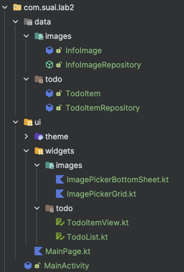
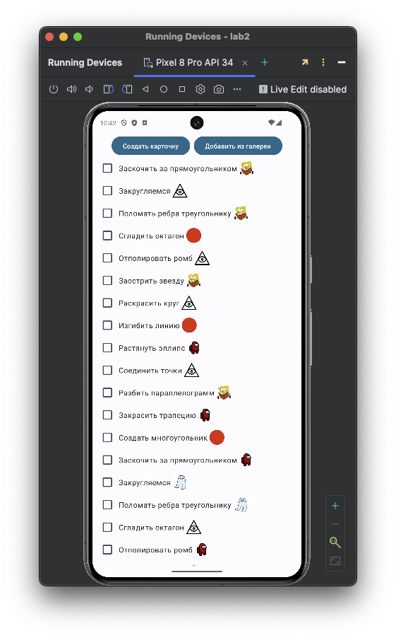
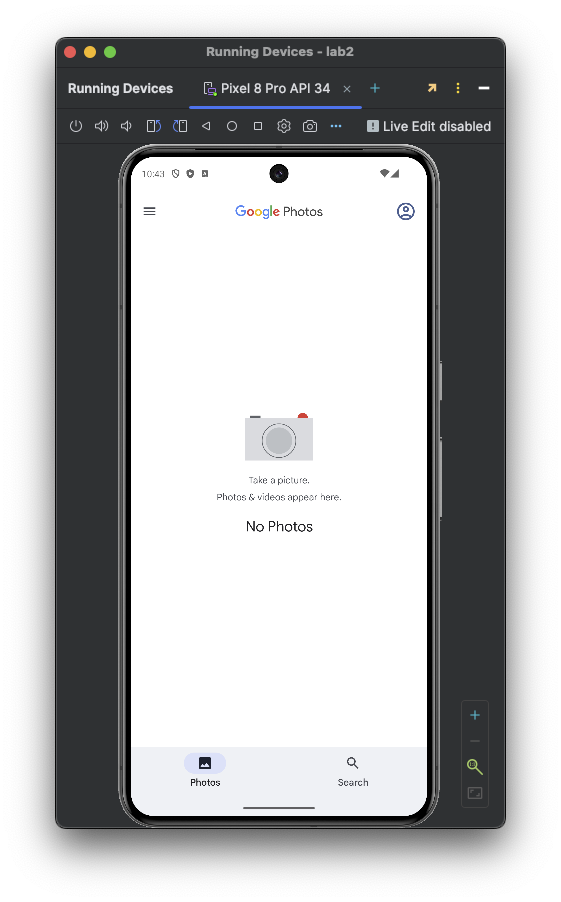
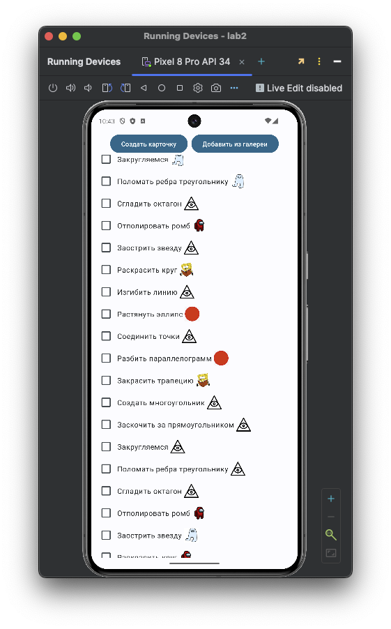
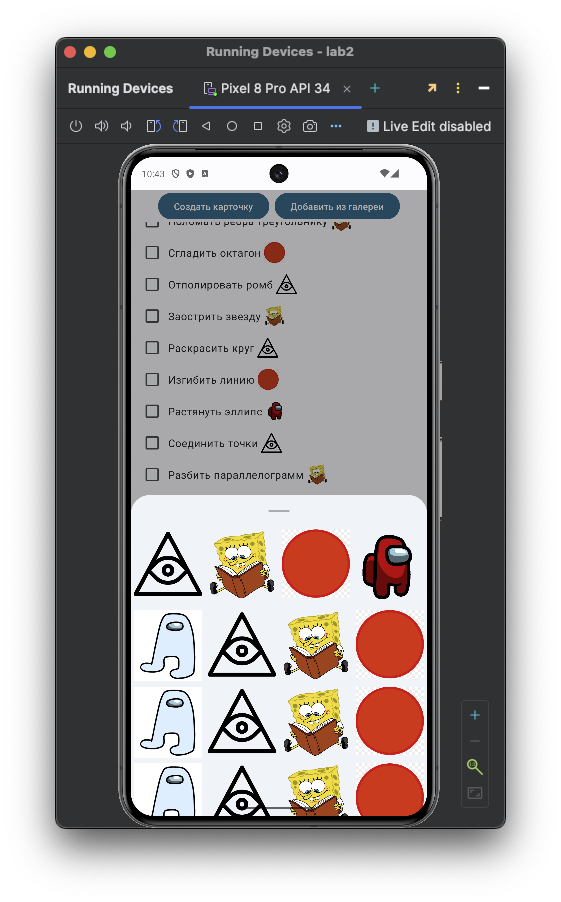
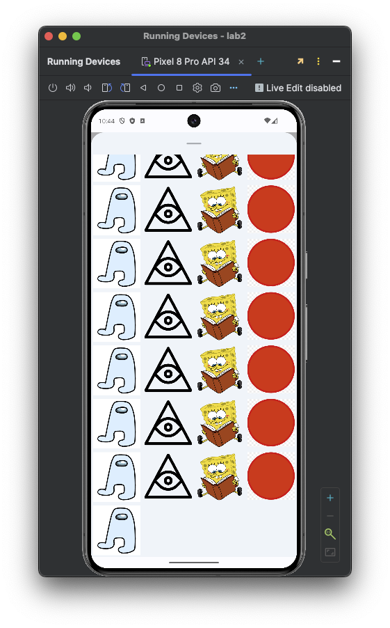
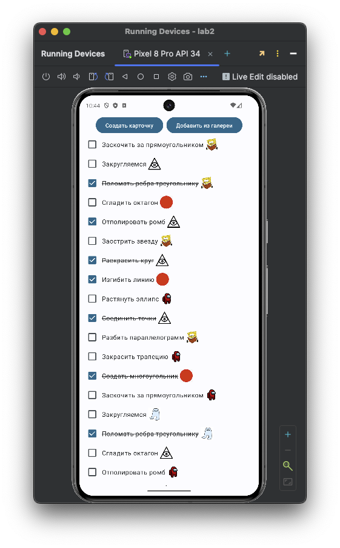

# Постановка задачи

## Цель работы

Выполнить проектирование и разработку мобильного приложения под ОС Android на языке программирования высокого уровня Kotlin.

## Задание

1. Создайте приложение для управления списком задач в соответствии с вариантом (предметной областью) – для определенного класса. Пользователь должен иметь возможность добавлять, удалять и отмечать задачи как выполненные. Используйте RecyclerView для отображения списка задач.

2. Разработайте галерею изображений (в соответствии с вариантом (предметной областью) – для определенного класса), где пользователь может просматривать изображения, а также добавлять новые изображения из галереи устройства. Используйте RecyclerView для отображения изображений в виде сетки.

Чтобы подобрать вариант необходимо найти число N = (номер группы + номер студента в журнале) mod количество_вариантов + 1. где mod – остаток от деления, N - номер варианта.

Вариант: геометрические фигуры.

# Выполнение работы

Для выполнения работы был выбран фреймворк `Jetpack Compose` в виду простоты его использования.

Итоговая структура проекта изображена на рисунке \ref{fig:Структура проекта}

<m>

Код итоговый проект доступен в Приложении и на [GitHub](https://github.com/vladcto/suai-labs/tree/main/6_semester/ИТМ/lab2).

Демонстрация работы представлена на рисунках \ref{fig:Список ToDo} - \ref{fig:Выполнение ToDo}.













# Вывод

В результате выполнения лабораторной работы было успешно разработано мобильное приложение под ОС Android на языке программирования Kotlin с использованием фреймворка Jetpack Compose. Приложение включает в себя функционал управления списком задач и галерею изображений для геометрических фигур.

Выполненная лабораторная работа способствовала углублению знаний и навыков в области разработки мобильных приложений, а также позволила оценить преимущества и недостатки использования фреймворка Jetpack Compose для создания пользовательского интерфейса.

# ПРИЛОЖЕНИЕ <suaidoc-center>

```kotlin
MainPage.kt
package com.suai.lab2.ui

import android.content.Intent
import androidx.compose.foundation.layout.Box
import androidx.compose.foundation.layout.Column
import androidx.compose.foundation.layout.Row
import androidx.compose.foundation.layout.fillMaxWidth
import androidx.compose.foundation.layout.width
import androidx.compose.material3.Button
import androidx.compose.material3.ExperimentalMaterial3Api
import androidx.compose.material3.Text
import androidx.compose.material3.rememberModalBottomSheetState
import androidx.compose.runtime.Composable
import androidx.compose.runtime.getValue
import androidx.compose.runtime.mutableStateOf
import androidx.compose.runtime.remember
import androidx.compose.runtime.setValue
import androidx.compose.ui.Alignment
import androidx.compose.ui.Modifier
import androidx.compose.ui.platform.LocalContext
import androidx.compose.ui.unit.dp
import com.suai.lab2.ui.widgets.images.ImagePickerBottomSheet
import com.suai.lab2.ui.widgets.todo.TodoList

@OptIn(ExperimentalMaterial3Api::class)
@Composable
fun MainPage(modifier: Modifier = Modifier) {
    val ctx = LocalContext.current
    val sheetState = rememberModalBottomSheetState()
    var showBottomSheet by remember { mutableStateOf(false) }

    Column(
        horizontalAlignment = Alignment.CenterHorizontally,
        modifier = modifier.fillMaxWidth()
    ) {
        if (showBottomSheet) {
            ImagePickerBottomSheet(
                onDismiss = { showBottomSheet = false },
                sheetState = sheetState
            )
        }
        // Just mock :3
        Row {
            Button(onClick = { showBottomSheet = !showBottomSheet }) {
                Text(text = "Cоздать карточку")
            }
            Box(
                modifier = Modifier.width(8.dp)
            )
            Button(onClick = {
                val intent = Intent(Intent.ACTION_VIEW)
                intent.type = "image/*"
                intent.flags = Intent.FLAG_ACTIVITY_NEW_TASK
                ctx.startActivity(intent)
            }) {
                Text(text = "Добавить из галереи")
            }
        }
        TodoList()
    }
}
Color.kt
package com.suai.lab2.ui.theme

import androidx.compose.ui.graphics.Color

val Purple80 = Color(0xFFD0BCFF)
val PurpleGrey80 = Color(0xFFCCC2DC)
val Pink80 = Color(0xFFEFB8C8)

val Purple40 = Color(0xFF6650a4)
val PurpleGrey40 = Color(0xFF625b71)
val Pink40 = Color(0xFF7D5260)
Theme.kt
package com.suai.lab2.ui.theme

import android.app.Activity
import android.os.Build
import androidx.compose.foundation.isSystemInDarkTheme
import androidx.compose.material3.MaterialTheme
import androidx.compose.material3.darkColorScheme
import androidx.compose.material3.dynamicDarkColorScheme
import androidx.compose.material3.dynamicLightColorScheme
import androidx.compose.material3.lightColorScheme
import androidx.compose.runtime.Composable
import androidx.compose.ui.platform.LocalContext

private val DarkColorScheme = darkColorScheme(
    primary = Purple80,
    secondary = PurpleGrey80,
    tertiary = Pink80
)

private val LightColorScheme = lightColorScheme(
    primary = Purple40,
    secondary = PurpleGrey40,
    tertiary = Pink40

    /* Other default colors to override
    background = Color(0xFFFFFBFE),
    surface = Color(0xFFFFFBFE),
    onPrimary = Color.White,
    onSecondary = Color.White,
    onTertiary = Color.White,
    onBackground = Color(0xFF1C1B1F),
    onSurface = Color(0xFF1C1B1F),
    */
)

@Composable
fun Lab2Theme(
    darkTheme: Boolean = isSystemInDarkTheme(),
    // Dynamic color is available on Android 12+
    dynamicColor: Boolean = true,
    content: @Composable () -> Unit
) {
    val colorScheme = when {
        dynamicColor && Build.VERSION.SDK_INT >= Build.VERSION_CODES.S -> {
            val context = LocalContext.current
            if (darkTheme) dynamicDarkColorScheme(context) else dynamicLightColorScheme(context)
        }

        darkTheme -> DarkColorScheme
        else -> LightColorScheme
    }

    MaterialTheme(
        colorScheme = colorScheme,
        typography = Typography,
        content = content
    )
}
Type.kt
package com.suai.lab2.ui.theme

import androidx.compose.material3.Typography
import androidx.compose.ui.text.TextStyle
import androidx.compose.ui.text.font.FontFamily
import androidx.compose.ui.text.font.FontWeight
import androidx.compose.ui.unit.sp

// Set of Material typography styles to start with
val Typography = Typography(
    bodyLarge = TextStyle(
        fontFamily = FontFamily.Default,
        fontWeight = FontWeight.Normal,
        fontSize = 16.sp,
        lineHeight = 24.sp,
        letterSpacing = 0.5.sp
    )
    /* Other default text styles to override
    titleLarge = TextStyle(
        fontFamily = FontFamily.Default,
        fontWeight = FontWeight.Normal,
        fontSize = 22.sp,
        lineHeight = 28.sp,
        letterSpacing = 0.sp
    ),
    labelSmall = TextStyle(
        fontFamily = FontFamily.Default,
        fontWeight = FontWeight.Medium,
        fontSize = 11.sp,
        lineHeight = 16.sp,
        letterSpacing = 0.5.sp
    )
    */
)
ImagePickerGrid.kt
package com.suai.lab2.ui.widgets.images

import android.icu.text.IDNA.Info
import androidx.compose.foundation.clickable
import androidx.compose.foundation.layout.Box
import androidx.compose.foundation.layout.fillMaxSize
import androidx.compose.foundation.layout.padding
import androidx.compose.foundation.lazy.grid.GridCells
import androidx.compose.foundation.lazy.grid.LazyVerticalGrid
import androidx.compose.foundation.lazy.grid.items
import androidx.compose.runtime.Composable
import androidx.compose.ui.Alignment
import androidx.compose.ui.Modifier
import androidx.compose.ui.layout.ContentScale
import androidx.compose.ui.tooling.preview.Preview
import androidx.compose.ui.unit.dp
import coil.compose.AsyncImage
import com.suai.lab2.data.images.InfoImage
import com.suai.lab2.data.images.InfoImageRepository

@Composable
fun ImagePickerGrid(onChoose: (InfoImage) -> Unit, modifier: Modifier = Modifier) {
    LazyVerticalGrid(
        columns = GridCells.Fixed(4),
        modifier = modifier,
    ) {
        items(InfoImageRepository.images) { infoImage ->
            ImageCard(infoImage = infoImage, onChoose = onChoose)
        }
    }
}

@Composable
fun ImageCard(infoImage: InfoImage, onChoose: (InfoImage) -> Unit, modifier: Modifier = Modifier) {
    Box(
        contentAlignment = Alignment.Center,
        modifier = modifier
            .padding(4.dp)
            .fillMaxSize()
            .clickable { onChoose(infoImage) }
    ) {
        AsyncImage(
            model = infoImage.src,
            contentDescription = "Image from network",
            contentScale = ContentScale.Crop,
            modifier = Modifier.fillMaxSize()
        )
    }
}

@Preview
@Composable
fun PreviewImagePickerGrid() {
    ImagePickerGrid({
    })
}
ImagePickerBottomSheet.kt
package com.suai.lab2.ui.widgets.images

import androidx.compose.material3.ExperimentalMaterial3Api
import androidx.compose.material3.ModalBottomSheet
import androidx.compose.material3.SheetState
import androidx.compose.runtime.Composable
import androidx.compose.ui.Modifier

@OptIn(ExperimentalMaterial3Api::class)
@Composable
fun ImagePickerBottomSheet(
    onDismiss: () -> Unit,
    modifier: Modifier = Modifier,
    sheetState: SheetState,
) {
    ModalBottomSheet(
        onDismissRequest = onDismiss,
        sheetState = sheetState,
        modifier = modifier,
    ) {
        ImagePickerGrid(
            onChoose = {}
        )
    }
}
TodoItemView.kt
package com.suai.lab2.ui.widgets.todo

import androidx.compose.foundation.clickable
import androidx.compose.foundation.layout.Box
import androidx.compose.foundation.layout.Row
import androidx.compose.foundation.layout.fillMaxWidth
import androidx.compose.foundation.layout.height
import androidx.compose.foundation.layout.width
import androidx.compose.material.icons.Icons
import androidx.compose.material.icons.rounded.ShoppingCart
import androidx.compose.material3.Checkbox
import androidx.compose.material3.Icon
import androidx.compose.material3.Text
import androidx.compose.runtime.Composable
import androidx.compose.ui.Alignment
import androidx.compose.ui.Modifier
import androidx.compose.ui.input.pointer.pointerInput
import androidx.compose.ui.text.style.TextDecoration
import androidx.compose.ui.tooling.preview.Preview
import androidx.compose.ui.unit.dp
import coil.compose.AsyncImage
import com.suai.lab2.data.images.InfoImage
import com.suai.lab2.data.todo.TodoItem

@Composable
fun TodoItemView(
    onCheckChange: () -> Unit, item: TodoItem, modifier: Modifier = Modifier
) {
    Row(
        modifier = modifier
            .fillMaxWidth()
            .clickable(
                onClick = onCheckChange,
            ),
        verticalAlignment = Alignment.CenterVertically,
    ) {
        Checkbox(
            checked = item.closed,
            onCheckedChange = {},
            modifier = Modifier.pointerInput(Unit) {})
        Text(
            text = item.title,
            textDecoration = if (item.closed) TextDecoration.LineThrough else null
        )
        Box(modifier = Modifier.width(4.dp))
        AsyncImage(
            model = item.image.src,
            contentDescription = "Item image",
            modifier = Modifier
                .height(32.dp)
                .width(32.dp)
        )
    }
}

@Preview
@Composable
private fun TodoItemPreviewOpened() {
    TodoItemView(
        item = TodoItem(title = "Длинный title", closed = false, image = InfoImage("")),
        onCheckChange = {},
    )
}

@Preview
@Composable
private fun TodoItemPreviewClosed() {
    TodoItemView(
        item = TodoItem(title = "Длинный title", closed = true, image = InfoImage("")),
        onCheckChange = {},
    )
}
TodoList.kt
package com.suai.lab2.ui.widgets.todo

import androidx.compose.foundation.layout.Column
import androidx.compose.foundation.layout.padding
import androidx.compose.foundation.rememberScrollState
import androidx.compose.foundation.verticalScroll
import androidx.compose.runtime.Composable
import androidx.compose.runtime.mutableStateListOf
import androidx.compose.runtime.remember
import androidx.compose.ui.Modifier
import androidx.compose.ui.unit.dp
import com.suai.lab2.data.todo.TodoItem
import com.suai.lab2.data.todo.TodoItemRepository


@Composable
fun TodoList(modifier: Modifier = Modifier) {
    val items = remember {
        mutableStateListOf<TodoItem>().apply {
            addAll(TodoItemRepository.items)
        }
    }

    val verticalScroll = rememberScrollState()

    Column(
        modifier = modifier
            .verticalScroll(verticalScroll)
            .padding(horizontal = 8.dp)
    ) {
        items.onEachIndexed { i, item ->
            TodoItemView(
                item = item,
                onCheckChange = {
                    items[i] = items[i].copy(closed = !items[i].closed)
                },
            )
        }
    }
}
MainActivity.kt
package com.suai.lab2

import android.os.Bundle
import androidx.activity.ComponentActivity
import androidx.activity.compose.setContent
import androidx.activity.enableEdgeToEdge
import androidx.compose.foundation.layout.fillMaxSize
import androidx.compose.foundation.layout.padding
import androidx.compose.material3.Scaffold
import androidx.compose.material3.Text
import androidx.compose.runtime.Composable
import androidx.compose.ui.Modifier
import androidx.compose.ui.tooling.preview.Preview
import com.suai.lab2.ui.MainPage
import com.suai.lab2.ui.theme.Lab2Theme

class MainActivity : ComponentActivity() {
    override fun onCreate(savedInstanceState: Bundle?) {
        super.onCreate(savedInstanceState)
        enableEdgeToEdge()
        setContent {
            Lab2Theme {
                Scaffold(modifier = Modifier.fillMaxSize()) { innerPadding ->
                    MainPage(
                        modifier = Modifier.padding(innerPadding)
                    )
                }
            }
        }
    }
}
InfoImage.kt
package com.suai.lab2.data.images

data class InfoImage(val src: String)
InfoImageRepository.kt
package com.suai.lab2.data.images

abstract class InfoImageRepository {
    fun fetch(): List<InfoImage> = images

    companion object {
        val images = listOf(
            InfoImage(src = "https://cdn-icons-png.flaticon.com/512/1913/1913916.png"),
            InfoImage(src = "https://avatanplus.com/files/resources/original/59c422d10dd3015ea62800a1.png"),
            InfoImage(src = "https://e7.pngegg.com/pngimages/65/230/png-clipart-circle-red-circle-orange-wikimedia-commons-thumbnail.png"),
            InfoImage(src = "https://preview.redd.it/an871k4o1sn51.png?width=440&format=png&auto=webp&s=85dcd6cb73b8760802e254ee14dfa3c7ab444591"),
            InfoImage(src = "https://memozg.ru/img/posts/3833_639b61f0347b9.jpg"),
            InfoImage(src = "https://cdn-icons-png.flaticon.com/512/1913/1913916.png"),
            InfoImage(src = "https://avatanplus.com/files/resources/original/59c422d10dd3015ea62800a1.png"),
            InfoImage(src = "https://e7.pngegg.com/pngimages/65/230/png-clipart-circle-red-circle-orange-wikimedia-commons-thumbnail.png"),
            InfoImage(src = "https://memozg.ru/img/posts/3833_639b61f0347b9.jpg"),
            InfoImage(src = "https://cdn-icons-png.flaticon.com/512/1913/1913916.png"),
            InfoImage(src = "https://avatanplus.com/files/resources/original/59c422d10dd3015ea62800a1.png"),
            InfoImage(src = "https://e7.pngegg.com/pngimages/65/230/png-clipart-circle-red-circle-orange-wikimedia-commons-thumbnail.png"),
            InfoImage(src = "https://memozg.ru/img/posts/3833_639b61f0347b9.jpg"),
            InfoImage(src = "https://cdn-icons-png.flaticon.com/512/1913/1913916.png"),
            InfoImage(src = "https://avatanplus.com/files/resources/original/59c422d10dd3015ea62800a1.png"),
            InfoImage(src = "https://e7.pngegg.com/pngimages/65/230/png-clipart-circle-red-circle-orange-wikimedia-commons-thumbnail.png"),
            InfoImage(src = "https://memozg.ru/img/posts/3833_639b61f0347b9.jpg"),
            InfoImage(src = "https://cdn-icons-png.flaticon.com/512/1913/1913916.png"),
            InfoImage(src = "https://avatanplus.com/files/resources/original/59c422d10dd3015ea62800a1.png"),
            InfoImage(src = "https://e7.pngegg.com/pngimages/65/230/png-clipart-circle-red-circle-orange-wikimedia-commons-thumbnail.png"),
            InfoImage(src = "https://memozg.ru/img/posts/3833_639b61f0347b9.jpg"),
            InfoImage(src = "https://cdn-icons-png.flaticon.com/512/1913/1913916.png"),
            InfoImage(src = "https://avatanplus.com/files/resources/original/59c422d10dd3015ea62800a1.png"),
            InfoImage(src = "https://e7.pngegg.com/pngimages/65/230/png-clipart-circle-red-circle-orange-wikimedia-commons-thumbnail.png"),
            InfoImage(src = "https://memozg.ru/img/posts/3833_639b61f0347b9.jpg"),
            InfoImage(src = "https://cdn-icons-png.flaticon.com/512/1913/1913916.png"),
            InfoImage(src = "https://avatanplus.com/files/resources/original/59c422d10dd3015ea62800a1.png"),
            InfoImage(src = "https://e7.pngegg.com/pngimages/65/230/png-clipart-circle-red-circle-orange-wikimedia-commons-thumbnail.png"),
            InfoImage(src = "https://memozg.ru/img/posts/3833_639b61f0347b9.jpg"),
            InfoImage(src = "https://cdn-icons-png.flaticon.com/512/1913/1913916.png"),
            InfoImage(src = "https://avatanplus.com/files/resources/original/59c422d10dd3015ea62800a1.png"),
            InfoImage(src = "https://e7.pngegg.com/pngimages/65/230/png-clipart-circle-red-circle-orange-wikimedia-commons-thumbnail.png"),
            InfoImage(src = "https://memozg.ru/img/posts/3833_639b61f0347b9.jpg"),
            InfoImage(src = "https://cdn-icons-png.flaticon.com/512/1913/1913916.png"),
            InfoImage(src = "https://avatanplus.com/files/resources/original/59c422d10dd3015ea62800a1.png"),
            InfoImage(src = "https://e7.pngegg.com/pngimages/65/230/png-clipart-circle-red-circle-orange-wikimedia-commons-thumbnail.png"),
            InfoImage(src = "https://memozg.ru/img/posts/3833_639b61f0347b9.jpg"),
        )
    }
}
TodoItem.kt
package com.suai.lab2.data.todo

import com.suai.lab2.data.images.InfoImage

data class TodoItem(
    val title: String, val image: InfoImage,
    val closed: Boolean
)
TodoItemRepository.kt
package com.suai.lab2.data.todo

import com.suai.lab2.data.images.InfoImageRepository

class TodoItemRepository {
    companion object {
        val items = listOf(
            TodoItem("Заскочить за прямоугольником", InfoImageRepository.images[1], closed = false),
            TodoItem("Закругляемся", InfoImageRepository.images[0], closed = false),
            TodoItem("Поломать ребра треугольнику", InfoImageRepository.images[1], closed = false),
            TodoItem("Сгладить октагон", InfoImageRepository.images[2], closed = true),
            TodoItem("Отполировать ромб", InfoImageRepository.images[0], closed = false),
            TodoItem("Заострить звезду", InfoImageRepository.images[1], closed = false),
            TodoItem("Раскрасить круг", InfoImageRepository.images[0], closed = false),
            TodoItem("Изгибить линию", InfoImageRepository.images[2], closed = true),
            TodoItem("Растянуть эллипс", InfoImageRepository.images[3], closed = false),
            TodoItem("Соединить точки", InfoImageRepository.images[0], closed = false),
            TodoItem("Разбить параллелограмм", InfoImageRepository.images[1], closed = true),
            TodoItem("Закрасить трапецию", InfoImageRepository.images[3], closed = false),
            TodoItem("Создать многоугольник", InfoImageRepository.images[2], closed = false),
            TodoItem("Заскочить за прямоугольником", InfoImageRepository.images[3], closed = false),
            TodoItem("Закругляемся", InfoImageRepository.images[4], closed = false),
            TodoItem("Поломать ребра треугольнику", InfoImageRepository.images[4], closed = false),
            TodoItem("Сгладить октагон", InfoImageRepository.images[0], closed = true),
            TodoItem("Отполировать ромб", InfoImageRepository.images[3], closed = false),
            TodoItem("Заострить звезду", InfoImageRepository.images[0], closed = false),
            TodoItem("Раскрасить круг", InfoImageRepository.images[1], closed = false),
            TodoItem("Изгибить линию", InfoImageRepository.images[0], closed = true),
            TodoItem("Растянуть эллипс", InfoImageRepository.images[2], closed = false),
            TodoItem("Соединить точки", InfoImageRepository.images[0], closed = false),
            TodoItem("Разбить параллелограмм", InfoImageRepository.images[2], closed = true),
            TodoItem("Закрасить трапецию", InfoImageRepository.images[1], closed = false),
            TodoItem("Создать многоугольник", InfoImageRepository.images[0], closed = false),
            TodoItem("Заскочить за прямоугольником", InfoImageRepository.images[0], closed = false),
            TodoItem("Закругляемся", InfoImageRepository.images[0], closed = false),
            TodoItem("Поломать ребра треугольнику", InfoImageRepository.images[0], closed = false),
            TodoItem("Сгладить октагон", InfoImageRepository.images[0], closed = true),
            TodoItem("Отполировать ромб", InfoImageRepository.images[3], closed = false),
            TodoItem("Заострить звезду", InfoImageRepository.images[4], closed = false),
            TodoItem("Раскрасить круг", InfoImageRepository.images[3], closed = false),
            TodoItem("Изгибить линию", InfoImageRepository.images[0], closed = true),
            TodoItem("Растянуть эллипс", InfoImageRepository.images[1], closed = false),
            TodoItem("Соединить точки", InfoImageRepository.images[0], closed = false),
            TodoItem("Разбить параллелограмм", InfoImageRepository.images[0], closed = true),
            TodoItem("Закрасить трапецию", InfoImageRepository.images[4], closed = false),
            TodoItem("Создать многоугольник", InfoImageRepository.images[0], closed = false),
        )
    }
}
```