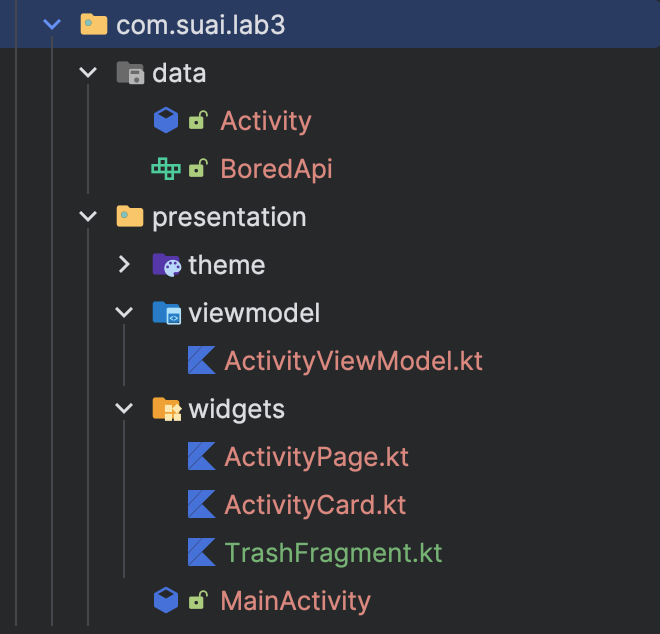
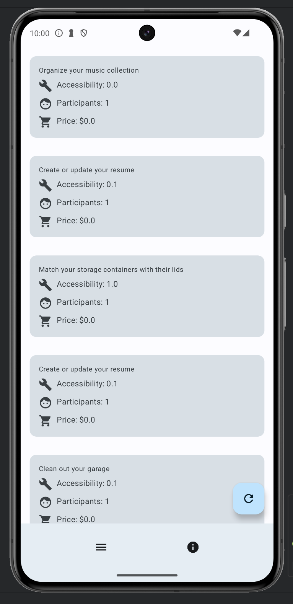
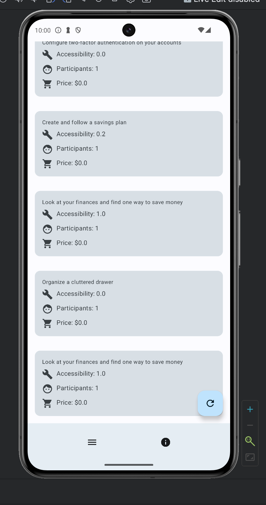
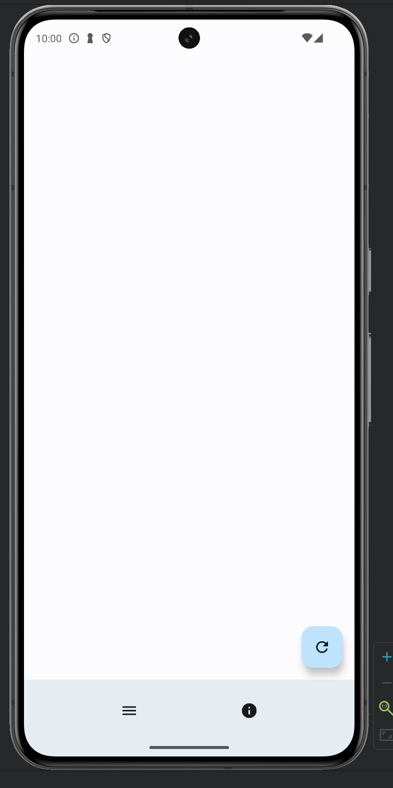

# Постановка задачи

## Цель работы

Создайте приложение, которое получает данные с открытого API (например данные о погоде) и отображает их пользователю в удобном формате. Обеспечьте обработку ошибок при отсутствии интернет-соединения.

Задание «Фрагменты»:

- Создание Navigation Drawer или Bottom Navigation в соответствии с вариантом (предметной областью) – для определенного класса.
- Реализовать навигацию по пунктам меню.
- Создать фрагмент.
- Обработка переходов между фрагментами.
- Создать список с использованием RecycleView.

# Выполнение работы

Не было найдено хорошего и бесплатного АПИ для варианта "Геометрические фигуры", поэтому было принято решение взять [BoredApi](http://www.boredapi.com).

Для выполнения работы был выбран фреймворк `Jetpack Compose` в виду простоты его использования.

Итоговая структура проекта изображена на рисунке \ref{fig:Структура проекта}

<m>

Код итогового проект доступен в Приложении и на [GitHub](https://github.com/vladcto/suai-labs/tree/main/6_semester/ИТМ/lab3).

Демонстрация работы представлена на рисунках \ref{fig:Начальная страница} - \ref{fig:Ошибка сети}. При ошибках возвращается пустой список и появляется белый экран.

<m>

<m>

<m>

# Вывод

В результате выполнения лабораторной работы было успешно разработано мобильное приложение под ОС Android на языке программирования Kotlin с использованием фреймворка Jetpack Compose. Приложение включает в себя функционал для навигации посредством BottomBar, подгрузки апи и реагирования на ошибки.

Выполненная лабораторная работа способствовала углублению знаний и навыков в области разработки мобильных приложений.

# ПРИЛОЖЕНИЕ <suaidoc-center>

```kotlin
package com.suai.lab3.presentation.widgets

import androidx.compose.foundation.layout.Column
import androidx.compose.foundation.layout.Row
import androidx.compose.foundation.layout.Spacer
import androidx.compose.foundation.layout.fillMaxWidth
import androidx.compose.foundation.layout.height
import androidx.compose.foundation.layout.padding
import androidx.compose.foundation.layout.size
import androidx.compose.foundation.layout.width
import androidx.compose.material.icons.Icons
import androidx.compose.material.icons.filled.Build
import androidx.compose.material.icons.filled.Face
import androidx.compose.material.icons.filled.ShoppingCart
import androidx.compose.material3.Card
import androidx.compose.material3.Icon
import androidx.compose.material3.MaterialTheme
import androidx.compose.material3.Text
import androidx.compose.runtime.Composable
import androidx.compose.ui.Modifier
import androidx.compose.ui.unit.dp
import com.suai.lab3.data.Activity

@Composable
fun ActivityCard(activity: Activity) {
    Card(
        modifier = Modifier
            .fillMaxWidth()
            .padding(16.dp),
    ) {
        Column(
            modifier = Modifier
                .padding(16.dp)
                .fillMaxWidth()
        ) {
            Text(
                text = activity.activity,
                style = MaterialTheme.typography.bodySmall,
                modifier = Modifier.fillMaxWidth()
            )
            Spacer(modifier = Modifier.height(8.dp))
            Row {
                Icon(
                    imageVector = Icons.Default.Build,
                    contentDescription = "Accessibility",
                    modifier = Modifier.size(24.dp)
                )
                Spacer(modifier = Modifier.width(8.dp))
                Text(
                    text = "Accessibility: ${activity.accessibility}",
                    style = MaterialTheme.typography.bodyMedium
                )
            }
            Spacer(modifier = Modifier.height(8.dp))
            Row {
                Icon(
                    imageVector = Icons.Default.Face,
                    contentDescription = "Participants",
                    modifier = Modifier.size(24.dp)
                )
                Spacer(modifier = Modifier.width(8.dp))
                Text(
                    text = "Participants: ${activity.participants}",
                    style = MaterialTheme.typography.bodyMedium
                )
            }
            Spacer(modifier = Modifier.height(8.dp))
            Row {
                Icon(
                    imageVector = Icons.Default.ShoppingCart,
                    contentDescription = "Price",
                    modifier = Modifier.size(24.dp)
                )
                Spacer(modifier = Modifier.width(8.dp))
                Text(
                    text = "Price: $${activity.price}",
                    style = MaterialTheme.typography.bodyMedium
                )
            }
        }
    }
}

package com.suai.lab3.presentation.widgets

import androidx.compose.foundation.lazy.LazyColumn
import androidx.compose.foundation.lazy.itemsIndexed
import androidx.compose.runtime.Composable
import androidx.compose.runtime.getValue
import androidx.compose.runtime.livedata.observeAsState
import androidx.compose.ui.Modifier
import com.suai.lab3.presentation.viewmodel.ActivityViewModel

@Composable
fun ActivityPage(viewModel: ActivityViewModel, modifier: Modifier) {
    val activities by viewModel.activities.observeAsState()
    LazyColumn(modifier = modifier) {
        itemsIndexed(activities ?: listOf()) { _, item ->
            ActivityCard(item)
        }
    }
}

package com.suai.lab3.presentation.viewmodel

import androidx.lifecycle.LiveData
import androidx.lifecycle.MutableLiveData
import androidx.lifecycle.ViewModel
import androidx.lifecycle.ViewModelProvider
import androidx.lifecycle.viewModelScope
import com.suai.lab3.data.Activity
import com.suai.lab3.data.BoredApi
import kotlinx.coroutines.CoroutineExceptionHandler
import kotlinx.coroutines.Dispatchers
import kotlinx.coroutines.launch
import kotlinx.coroutines.withContext
import retrofit2.Retrofit
import retrofit2.await
import retrofit2.converter.gson.GsonConverterFactory

val coroutineExceptionHandler = CoroutineExceptionHandler { _, throwable ->
    throwable.printStackTrace()
}

class ActivityViewModel(private val api: BoredApi) : ViewModel() {
    private val _activities = MutableLiveData<List<Activity>>()
    val activities: LiveData<List<Activity>> = _activities

    fun getActivity() {
        viewModelScope.launch(Dispatchers.IO + coroutineExceptionHandler) {
            val result = mutableListOf<Activity>()
            (0..20).forEach { _ ->
				try{
                	val activity = api.getActivity("busywork").await()
				}catch(_: Throwable){}
                result.add(activity)
            }
            withContext(Dispatchers.Main + coroutineExceptionHandler) {
                _activities.postValue(result)
            }
        }
    }

    companion object {
        val Factory: ViewModelProvider.Factory = object : ViewModelProvider.Factory {
            @Suppress("UNCHECKED_CAST")
            override fun <T : ViewModel> create(modelClass: Class<T>): T {
                // Ну и ладно, что не Dagger
                val retrofit = Retrofit.Builder()
                    .baseUrl("https://boredapi.com/api/")
                    .addConverterFactory(GsonConverterFactory.create())
                    .build()

                return ActivityViewModel(
                    retrofit.create(BoredApi::class.java)
                ) as T
            }
        }
    }
}

package com.suai.lab3.data

data class Activity(
    val activity: String,
    val accessibility: Double,
    val participants: Int,
    val price: Double,
)

package com.suai.lab3.data

import retrofit2.Call
import retrofit2.http.GET
import retrofit2.http.Query

interface BoredApi {
    @GET("activity")
    fun getActivity(@Query("type") type: String): Call<Activity>
}
```