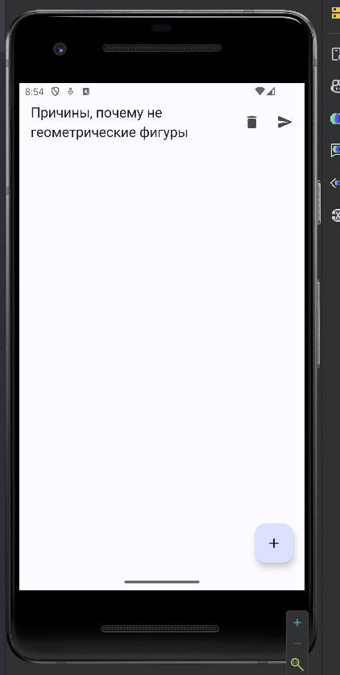
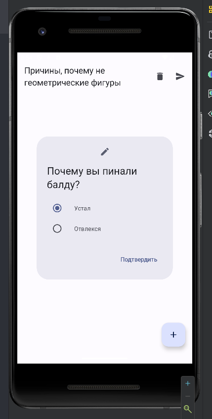
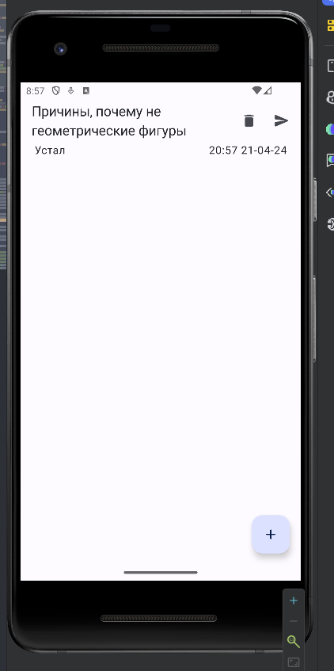
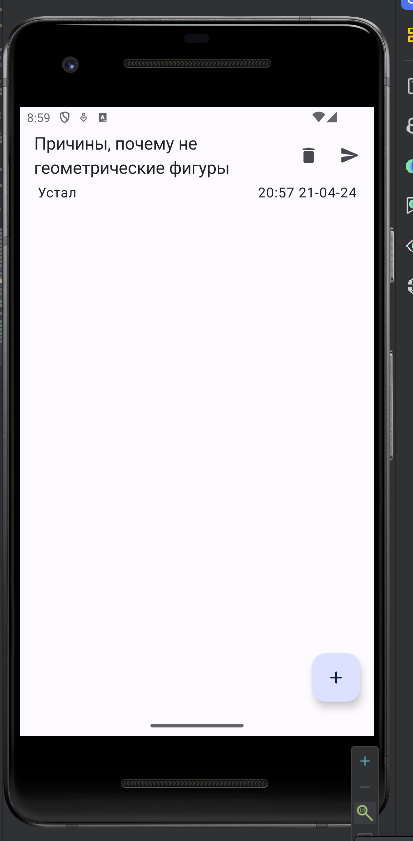
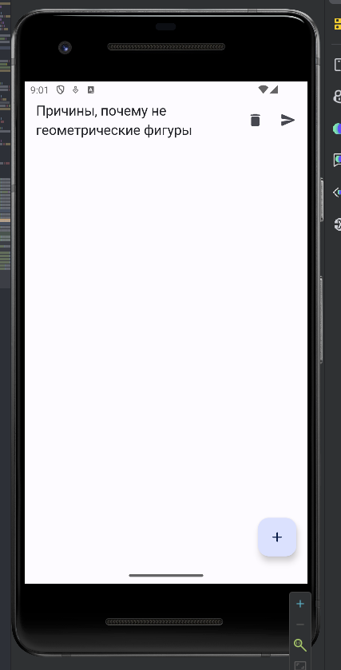
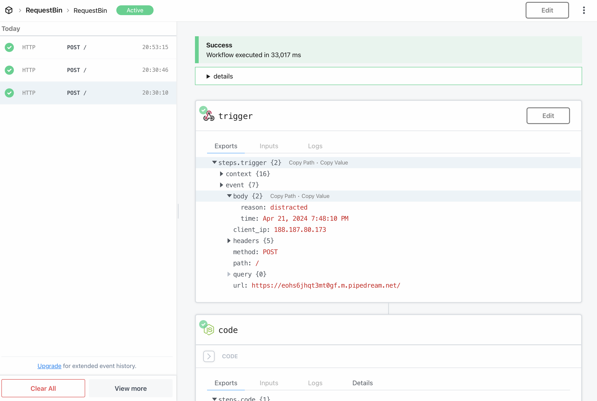
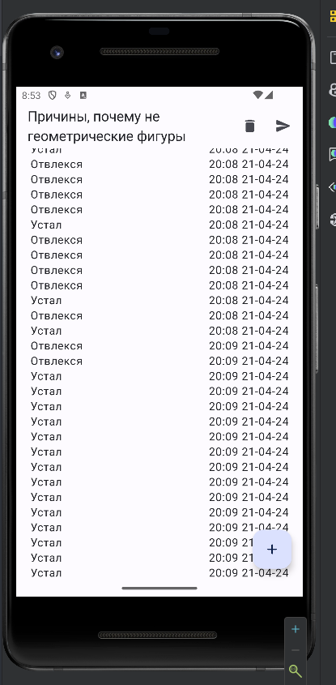

# Постановка задачи

Выполнить проектирование и разработку мобильного приложения под ОС Android на языке программирования высокого уровня Kotlin.

## Задания работы

1. Задание «БД»

- Создать БД в соответствии с вариантом (предметной областью) – для определенного класса;
- Реализовать добавление данных в БД с помощью отдельного Activity;
- Вывести данные из БД в RecyclerView. Также использовать фрагменты.
- Обработка долгого нажатия на элемент списка;
- Создание диалогового окна для выбора «Просмотр», «Удаление», «Обновление»;
- Обработка нажатия элементов диалогового окна, например, для подтверждения удаления или обновления;
- Реализовать обновление данных в БД с помощью отдельного Activity;
- Реализовать удаление данных из БД с помощью отдельного Activity;
- При работе с БД использовать библиотеку Room.

2. Задание «JSON»

 - Скачать JSON из интернета (HttpURLConnection/Retrofit);
 - Распарсить JSON;
 - Использовать Thread для работы с JSON.

# Выполнение работы

Для начала были подключены нужные зависимости для проекта в `build.gradle.kts` уровня `app`.

```Kotlin
plugins {
    alias(libs.plugins.android.application)
    alias(libs.plugins.jetbrains.kotlin.android)
    alias(libs.plugins.kapt)
    alias(libs.plugins.hilt)
}

android {
    namespace = "com.vladcto.lazymeter"
    compileSdk = 34

    defaultConfig {
        applicationId = "com.vladcto.lazymeter"
        minSdk = 24
        targetSdk = 34
        versionCode = 1
        versionName = "1.0"

        testInstrumentationRunner = "androidx.test.runner.AndroidJUnitRunner"
        vectorDrawables {
            useSupportLibrary = true
        }
    }

    buildTypes {
        release {
            isMinifyEnabled = false
            proguardFiles(
                getDefaultProguardFile("proguard-android-optimize.txt"),
                "proguard-rules.pro"
            )
        }
    }
    compileOptions {
        sourceCompatibility = JavaVersion.VERSION_1_8
        targetCompatibility = JavaVersion.VERSION_1_8
    }
    kotlinOptions {
        jvmTarget = "1.8"
//        allWarningsAsErrors = false
        freeCompilerArgs += listOf(
            "-opt-in=androidx.compose.material3.ExperimentalMaterial3Api"
        )
    }
    buildFeatures {
        compose = true
    }
    composeOptions {
        kotlinCompilerExtensionVersion = "1.5.12"
    }
    packaging {
        resources {
            excludes += "/META-INF/{AL2.0,LGPL2.1}"
        }
    }
}

kapt {
    correctErrorTypes = false
}

dependencies {

    implementation(libs.kotlin.stdlib)
    implementation(libs.androidx.core.ktx)
    implementation(libs.androidx.lifecycle.runtime.ktx)
    implementation(libs.androidx.activity.compose)
    implementation(platform(libs.androidx.compose.bom))
    implementation(libs.androidx.ui)
    implementation(libs.androidx.ui.graphics)
    implementation(libs.androidx.ui.tooling.preview)
    implementation(libs.androidx.material3)
    implementation(libs.androidx.lifecycle.viewmodel.compose)

    implementation(libs.androidx.room.runtime)
    implementation(libs.androidx.room.ktx)
    kapt(libs.androidx.room.compiler)

    implementation(libs.hilt.android)
    kapt(libs.hilt.android.compiler)

    implementation(libs.retrofit)
    implementation(libs.retrofit.converter.gson)
}
```

Затем мы приступили к написанию `data-слоя` приложения.

Для хранения данных в локальной БД была выбрана библиотека `Room`, а для работы
с сетевыми запросами - `Retrofit`. Вся работы ведется асинхронно, с помощью **корутин**. 
Выбор в сторону корутин, обусловен их поддержкой со стороны **Kotlin**.
Итоговый код доступен в Приложении.

Для DI была выбрана библиотека `Hilt`, с помощью который мы обеспечили 
внедрение зависимостей через конструктор. Код модуля представлен ниже:

```Kotlin
package com.vladcto.lazymeter.platform.di

import android.content.Context
import androidx.room.Room
import com.vladcto.lazymeter.data.lazy.infra.LazyUnitDao
import com.vladcto.lazymeter.platform.room.AppDatabase
import com.vladcto.lazymeter.platform.room.converter.RoomDateLongConverter
import dagger.Module
import dagger.Provides
import dagger.hilt.InstallIn
import dagger.hilt.android.components.ViewModelComponent
import dagger.hilt.android.qualifiers.ApplicationContext

@Module
@InstallIn(ViewModelComponent::class)
class AppModule {
    @Provides
    fun provideAppDatabase(@ApplicationContext appContext: Context): AppDatabase {
        return Room.databaseBuilder(
            context = appContext,
            AppDatabase::class.java, "lazymeter-db",
        ).build()
    }

    @Provides
    fun provideUserDao(appDatabase: AppDatabase): LazyUnitDao = appDatabase.lazyUnitDao()
}
```

Затем мы приступили к написанию UI части приложения. Для ее написания 
мы выбрали фреймворк `Jetpack Compose` и библиотеку для работы с `ViewModel`.

Исходный код доступен в Приложении. Здесь мы покажем следующий функционал:

- Начальный экран.
- Отправку данных на сервер.
- Добавление данных в БД.
- Считывание данных из БД.
- Удаление записей из БД.
- Скролл списка.

<m>

<m>

<m>

<m>

<m>



<m>

# Вывод

В результате выполнения лабораторной работы было успешно разработано мобильное приложение под ОС Android на языке программирования Kotlin с использованием фреймворка Jetpack Compose. Приложение включает в себя функционал работы с локальным хранилищем, а именно работа с БД посредством ORM `Room` и работа с сетевыми запросами с помощью `Retrofit`.

Выполненная лабораторная работа способствовала углублению знаний и навыков в области разработки мобильных приложений.

# ПРИЛОЖЕНИЕ <suaidoc-center>

```Kotlin
MainActivity.kt
// This is a sketch for a course project, so it looks so... empty?
package com.vladcto.lazymeter

import android.os.Bundle
import androidx.activity.ComponentActivity
import androidx.activity.compose.setContent
import androidx.activity.enableEdgeToEdge
import com.vladcto.lazymeter.feature.preview_lazy.ui.LazyPreviewPage
import com.vladcto.lazymeter.feature.theme.LazymeterTheme
import dagger.hilt.android.AndroidEntryPoint

@AndroidEntryPoint
class MainActivity : ComponentActivity() {
    override fun onCreate(savedInstanceState: Bundle?) {
        super.onCreate(savedInstanceState)
        enableEdgeToEdge()
        setContent {
            LazymeterTheme {
                LazyPreviewPage()
            }
        }
    }
}
AppModule.kt
package com.vladcto.lazymeter.platform.di

import android.content.Context
import androidx.room.Room
import com.vladcto.lazymeter.data.lazy.infra.LazyUnitDao
import com.vladcto.lazymeter.platform.room.AppDatabase
import com.vladcto.lazymeter.platform.room.converter.RoomDateLongConverter
import dagger.Module
import dagger.Provides
import dagger.hilt.InstallIn
import dagger.hilt.android.components.ViewModelComponent
import dagger.hilt.android.qualifiers.ApplicationContext

@Module
@InstallIn(ViewModelComponent::class)
class AppModule {
    @Provides
    fun provideAppDatabase(@ApplicationContext appContext: Context): AppDatabase {
        return Room.databaseBuilder(
            context = appContext,
            AppDatabase::class.java, "lazymeter-db",
        ).build()
    }

    @Provides
    fun provideUserDao(appDatabase: AppDatabase): LazyUnitDao = appDatabase.lazyUnitDao()
}
LazymeterApp.kt
package com.vladcto.lazymeter.platform.di

import android.app.Application
import androidx.room.Room
import com.vladcto.lazymeter.platform.room.AppDatabase
import dagger.Provides
import dagger.hilt.android.HiltAndroidApp

@HiltAndroidApp
class LazymeterApp : Application()
RoomDateLongConverter.kt
package com.vladcto.lazymeter.platform.room.converter

import androidx.room.TypeConverter
import java.util.Date

class RoomDateLongConverter {
    @TypeConverter
    fun dateToLong(date: Date?): Long? = date?.time

    @TypeConverter
    fun longToDate(value: Long?): Date? = value?.let { Date(it) }
}
AppDatabase.kt
package com.vladcto.lazymeter.platform.room

import androidx.room.Database
import androidx.room.RoomDatabase
import androidx.room.TypeConverters
import com.vladcto.lazymeter.data.lazy.infra.LazyUnitDao
import com.vladcto.lazymeter.data.lazy.infra.LazyUnitDb
import com.vladcto.lazymeter.platform.room.converter.RoomDateLongConverter

@Database(
    entities = [LazyUnitDb::class],
    version = 1
)
@TypeConverters(RoomDateLongConverter::class)
abstract class AppDatabase : RoomDatabase() {
    abstract fun lazyUnitDao(): LazyUnitDao
}
PipeDreamTiredApi.kt
package com.vladcto.lazymeter.feature.another_api_send_using_retrofit

import com.vladcto.lazymeter.data.lazy.domain.LazyUnit
import retrofit2.Retrofit
import retrofit2.converter.gson.GsonConverterFactory
import retrofit2.http.Body
import retrofit2.http.POST

// I sketched singletons out of bored.

interface LazyApi {
    @POST(".")
    suspend fun sendLazyUnit(@Body lazyUnit: LazyUnit)
}

object PipeDreamRepository {
    private const val BASE_URL = "https://eohs6jhqt3mt0gf.m.pipedream.net/"

    private val retrofit: Retrofit = Retrofit.Builder()
        .baseUrl(BASE_URL)
        .addConverterFactory(GsonConverterFactory.create())
        .build()

    private val lazyApi: LazyApi = retrofit.create(LazyApi::class.java)

    suspend fun sendLazyUnit(lazyUnit: LazyUnit) {
        try {
            lazyApi.sendLazyUnit(lazyUnit)
        } catch (_: Throwable) {
        }
    }
}
Color.kt
package com.vladcto.lazymeter.feature.theme

import androidx.compose.ui.graphics.Color

val Purple80 = Color(0xFFD0BCFF)
val PurpleGrey80 = Color(0xFFCCC2DC)
val Pink80 = Color(0xFFEFB8C8)

val Purple40 = Color(0xFF6650a4)
val PurpleGrey40 = Color(0xFF625b71)
val Pink40 = Color(0xFF7D5260)
Theme.kt
package com.vladcto.lazymeter.feature.theme

import android.app.Activity
import android.os.Build
import androidx.compose.foundation.isSystemInDarkTheme
import androidx.compose.material3.MaterialTheme
import androidx.compose.material3.darkColorScheme
import androidx.compose.material3.dynamicDarkColorScheme
import androidx.compose.material3.dynamicLightColorScheme
import androidx.compose.material3.lightColorScheme
import androidx.compose.runtime.Composable
import androidx.compose.ui.platform.LocalContext

private val DarkColorScheme = darkColorScheme(
    primary = Purple80,
    secondary = PurpleGrey80,
    tertiary = Pink80
)

private val LightColorScheme = lightColorScheme(
    primary = Purple40,
    secondary = PurpleGrey40,
    tertiary = Pink40

    /* Other default colors to override
    background = Color(0xFFFFFBFE),
    surface = Color(0xFFFFFBFE),
    onPrimary = Color.White,
    onSecondary = Color.White,
    onTertiary = Color.White,
    onBackground = Color(0xFF1C1B1F),
    onSurface = Color(0xFF1C1B1F),
    */
)

@Composable
fun LazymeterTheme(
    darkTheme: Boolean = isSystemInDarkTheme(),
    // Dynamic color is available on Android 12+
    dynamicColor: Boolean = true,
    content: @Composable () -> Unit
) {
    val colorScheme = when {
        dynamicColor && Build.VERSION.SDK_INT >= Build.VERSION_CODES.S -> {
            val context = LocalContext.current
            if (darkTheme) dynamicDarkColorScheme(context) else dynamicLightColorScheme(context)
        }

        darkTheme -> DarkColorScheme
        else -> LightColorScheme
    }

    MaterialTheme(
        colorScheme = colorScheme,
        typography = Typography,
        content = content
    )
}
Type.kt
package com.vladcto.lazymeter.feature.theme

import androidx.compose.material3.Typography
import androidx.compose.ui.text.TextStyle
import androidx.compose.ui.text.font.FontFamily
import androidx.compose.ui.text.font.FontWeight
import androidx.compose.ui.unit.sp

// Set of Material typography styles to start with
val Typography = Typography(
    bodyLarge = TextStyle(
        fontFamily = FontFamily.Default,
        fontWeight = FontWeight.Normal,
        fontSize = 16.sp,
        lineHeight = 24.sp,
        letterSpacing = 0.5.sp
    )
    /* Other default text styles to override
    titleLarge = TextStyle(
        fontFamily = FontFamily.Default,
        fontWeight = FontWeight.Normal,
        fontSize = 22.sp,
        lineHeight = 28.sp,
        letterSpacing = 0.sp
    ),
    labelSmall = TextStyle(
        fontFamily = FontFamily.Default,
        fontWeight = FontWeight.Medium,
        fontSize = 11.sp,
        lineHeight = 16.sp,
        letterSpacing = 0.5.sp
    )
    */
)
PreviewLazyViewModel.kt
package com.vladcto.lazymeter.feature.preview_lazy.viewmodel

import androidx.lifecycle.ViewModel
import androidx.lifecycle.viewModelScope
import com.vladcto.lazymeter.data.lazy.domain.LazyUnit
import com.vladcto.lazymeter.data.lazy.repository.LazyUnitRepository
import com.vladcto.lazymeter.feature.another_api_send_using_retrofit.PipeDreamRepository
import dagger.hilt.android.lifecycle.HiltViewModel
import kotlinx.coroutines.Dispatchers
import kotlinx.coroutines.async
import kotlinx.coroutines.flow.MutableStateFlow
import kotlinx.coroutines.flow.asStateFlow
import kotlinx.coroutines.flow.update
import kotlinx.coroutines.launch
import javax.inject.Inject

data class PreviewLazyState(
    val lazyUnits: List<LazyUnit>,
)

@HiltViewModel
class PreviewLazyViewModel @Inject constructor(
    private val _lazyUnitRepository: LazyUnitRepository,
) : ViewModel() {

    init {
        viewModelScope.launch {
            val result = async {
                _lazyUnitRepository.getAll()
            }.await()
            _previewState.update { _ -> PreviewLazyState(result) }
        }
    }

    private val _previewState = MutableStateFlow(
        PreviewLazyState(listOf())
    )
    val previewState = _previewState.asStateFlow()

    fun addLazyUnit(unit: LazyUnit) {
        viewModelScope.launch {
            async { _lazyUnitRepository.add(unit) }.await()
            _previewState.update { currentState ->
                PreviewLazyState(currentState.lazyUnits + unit)
            }
        }
    }

    fun sendLazyUnit(unit: LazyUnit) {
        viewModelScope.launch(context = Dispatchers.IO) {
            PipeDreamRepository.sendLazyUnit(unit)
        }
    }

    fun clear() = viewModelScope.launch {
        _lazyUnitRepository.clear()
        _previewState.update { _ -> PreviewLazyState(listOf()) }
    }

}
CreateLazyUnitDialog.kt
package com.vladcto.lazymeter.feature.preview_lazy.ui.components

import androidx.compose.foundation.layout.Column
import androidx.compose.foundation.layout.Row
import androidx.compose.foundation.layout.padding
import androidx.compose.foundation.selection.selectableGroup
import androidx.compose.material.icons.Icons
import androidx.compose.material.icons.rounded.Edit
import androidx.compose.material3.AlertDialog
import androidx.compose.material3.Icon
import androidx.compose.material3.RadioButton
import androidx.compose.material3.Text
import androidx.compose.material3.TextButton
import androidx.compose.runtime.Composable
import androidx.compose.runtime.mutableStateOf
import androidx.compose.runtime.remember
import androidx.compose.ui.Alignment
import androidx.compose.ui.Modifier
import androidx.compose.ui.unit.dp
import com.vladcto.lazymeter.data.lazy.domain.LazyReason
import com.vladcto.lazymeter.data.lazy.domain.LazyUnit
import java.util.Date

@Composable
fun CreateLazyUnitDialog(onDismissRequest: () -> Unit, onComplete: (LazyUnit) -> Unit) {
    val choiceTired = remember { mutableStateOf(true) }
    AlertDialog(
        onDismissRequest = onDismissRequest,
        icon = {
            Icon(
                Icons.Rounded.Edit,
                contentDescription = ""
            )
        },
        title = {
            Text(text = "Почему вы пинали балду?")
        },
        text = {
            Column(modifier = Modifier.selectableGroup()) {
                Row(
                    verticalAlignment = Alignment.CenterVertically
                ) {
                    RadioButton(
                        selected = choiceTired.value,
                        onClick = { choiceTired.value = true })
                    Text(text = "Устал", modifier = Modifier.padding(start = 16.dp))

                }
                Row(
                    verticalAlignment = Alignment.CenterVertically
                ) {
                    RadioButton(
                        selected = !choiceTired.value,
                        onClick = { choiceTired.value = false })
                    Text(text = "Отвлекся", modifier = Modifier.padding(start = 16.dp))
                }
            }
        },
        confirmButton = {
            TextButton(
                onClick = {
                    onComplete(
                        LazyUnit(
                            time = Date(),
                            reason = LazyReason.Tired.takeIf { choiceTired.value }
                                ?: LazyReason.Distracted
                        )
                    )
                    onDismissRequest()
                }
            ) {
                Text(text = "Подтвердить")
            }
        },
    )
}
LazyUnitCard.kt
package com.vladcto.lazymeter.feature.preview_lazy.ui.components

import androidx.compose.foundation.layout.Row
import androidx.compose.foundation.layout.fillMaxWidth
import androidx.compose.material3.Text
import androidx.compose.runtime.Composable
import androidx.compose.ui.Modifier
import androidx.compose.ui.platform.LocalConfiguration
import androidx.compose.ui.text.style.TextAlign
import com.vladcto.lazymeter.data.lazy.domain.LazyReason
import com.vladcto.lazymeter.data.lazy.domain.LazyUnit
import java.text.SimpleDateFormat

private const val DATE_PATTERN = "HH:mm dd-MM-yy"

@Composable
fun LazyUnitCard(lazyUnit: LazyUnit, modifier: Modifier) {
    val locale = LocalConfiguration.current.locales[0]
    val dateFormat = SimpleDateFormat(DATE_PATTERN, locale)
    Row(
        modifier = modifier.fillMaxWidth()
    ) {
        Text(
            text = when (lazyUnit.reason) {
                LazyReason.Tired -> "Устал"
                LazyReason.Distracted -> "Отвлекся"
            }
        )
        Text(
            modifier = Modifier.fillMaxWidth(),
            textAlign = TextAlign.End,
            text = dateFormat.format(lazyUnit.time)
        )
    }
}
PreviewLazyPage.kt
package com.vladcto.lazymeter.feature.preview_lazy.ui

import androidx.compose.foundation.layout.fillMaxHeight
import androidx.compose.foundation.layout.padding
import androidx.compose.foundation.lazy.LazyColumn
import androidx.compose.foundation.lazy.items
import androidx.compose.material.icons.Icons
import androidx.compose.material.icons.rounded.Add
import androidx.compose.material.icons.rounded.Delete
import androidx.compose.material.icons.rounded.Send
import androidx.compose.material3.FloatingActionButton
import androidx.compose.material3.Icon
import androidx.compose.material3.IconButton
import androidx.compose.material3.Scaffold
import androidx.compose.material3.Text
import androidx.compose.material3.TopAppBar
import androidx.compose.runtime.Composable
import androidx.compose.runtime.collectAsState
import androidx.compose.runtime.getValue
import androidx.compose.runtime.mutableStateOf
import androidx.compose.runtime.remember
import androidx.compose.ui.Modifier
import androidx.compose.ui.unit.dp
import androidx.compose.ui.unit.sp
import androidx.lifecycle.viewmodel.compose.viewModel
import com.vladcto.lazymeter.feature.preview_lazy.ui.components.CreateLazyUnitDialog
import com.vladcto.lazymeter.feature.preview_lazy.ui.components.LazyUnitCard
import com.vladcto.lazymeter.feature.preview_lazy.viewmodel.PreviewLazyViewModel

@Composable
fun LazyPreviewPage(
    previewLazyViewModel: PreviewLazyViewModel = viewModel()
) {
    val lazyUnitData by previewLazyViewModel.previewState.collectAsState()
    val creationDialog = remember { mutableStateOf(false) }
    Scaffold(
        topBar = {
            TopAppBar(
                title = {
                    Text(
                        "Причины, почему не геометрические фигуры",
                        fontSize = 20.sp
                    )
                },
                actions = {
                    IconButton(
                        onClick = { previewLazyViewModel.clear() }) {
                        Icon(
                            Icons.Rounded.Delete,
                            contentDescription = ""
                        )
                    }
                    IconButton(onClick = {
                        previewLazyViewModel.sendLazyUnit(lazyUnitData.lazyUnits[0])
                    }) {
                        Icon(
                            Icons.Rounded.Send,
                            contentDescription = ""
                        )
                    }
                }
            )
        },
        floatingActionButton = {
            FloatingActionButton(
                onClick = { creationDialog.value = true }
            ) {
                Icon(
                    Icons.Rounded.Add,
                    contentDescription = "",
                )
            }
        }
    ) {
        if (creationDialog.value) {
            CreateLazyUnitDialog(
                onDismissRequest = { creationDialog.value = false },
                onComplete = previewLazyViewModel::addLazyUnit,
            )
        }
        LazyColumn(
            modifier = Modifier
                .padding(it)
                .fillMaxHeight()
                .padding(horizontal = 16.dp)
        ) {
            items(lazyUnitData.lazyUnits) { unit ->
                LazyUnitCard(
                    unit,
                    modifier = Modifier.padding(horizontal = 4.dp)
                )
            }
        }
    }
}
LazyUnitRepository.kt
package com.vladcto.lazymeter.data.lazy.repository

import com.vladcto.lazymeter.data.lazy.domain.LazyReason
import com.vladcto.lazymeter.data.lazy.domain.LazyUnit
import com.vladcto.lazymeter.data.lazy.infra.LazyReasonDb
import com.vladcto.lazymeter.data.lazy.infra.LazyUnitDao
import com.vladcto.lazymeter.data.lazy.infra.LazyUnitDb
import kotlinx.coroutines.Dispatchers
import kotlinx.coroutines.async
import kotlinx.coroutines.withContext
import javax.inject.Inject

class LazyUnitRepository @Inject constructor(private val _lazyUnitDao: LazyUnitDao) {
    suspend fun getAll(): List<LazyUnit> = withContext(Dispatchers.IO) {
        val result = async {
            _lazyUnitDao.getAll()
        }.await()
        return@withContext result.map { it.toDomain() }
    }

    suspend fun clear() = withContext(Dispatchers.IO) {
        return@withContext _lazyUnitDao.clear()
    }

    suspend fun add(unit: LazyUnit) = addAll(listOf(unit))

    suspend fun addAll(units: List<LazyUnit>) = withContext(Dispatchers.IO) {
        return@withContext _lazyUnitDao.insertAll(units.map { it.toDb() })
    }
}

// Mappers

private fun LazyUnit.toDb(): LazyUnitDb = LazyUnitDb(
    time = this.time,
    reason = LazyReasonDb.valueOf(this.reason.name),
)

private fun LazyUnitDb.toDomain(): LazyUnit = LazyUnit(
    time = this.time,
    reason = LazyReason.valueOf(this.reason.name),
)

LazyUnitDao.kt
package com.vladcto.lazymeter.data.lazy.infra

import androidx.room.Dao
import androidx.room.Insert
import androidx.room.Query

@Dao
interface LazyUnitDao {
    @Query("SELECT * FROM lazyUnit")
    suspend fun getAll(): List<LazyUnitDb>

    @Query("DELETE FROM lazyUnit")
    suspend fun clear()

    @Insert
    suspend fun insertAll(units: List<LazyUnitDb>)
}
LazyUnitDb.kt
package com.vladcto.lazymeter.data.lazy.infra

import androidx.room.Entity
import androidx.room.PrimaryKey
import java.util.Date

enum class LazyReasonDb {
    Tired,
    Distracted,
}

@Entity(tableName = "lazyUnit")
data class LazyUnitDb(
    @PrimaryKey(autoGenerate = true) val uid: Int = 0,
    val reason: LazyReasonDb,
    val time: Date,
)
LazyUnit.kt
package com.vladcto.lazymeter.data.lazy.domain

import java.util.Date

enum class LazyReason {
    Tired,
    Distracted,
}

data class LazyUnit(
    val time: Date,
    val reason: LazyReason,
)
```