# Постановка задачи

**Цель работы:**

Целью работы является ознакомление с основными операциями вставки, обновления и удаления данных в базе данных с использованием SQL. Кроме того, целью работы также является получение практического опыта работы с операторами `INSERT`, `UPDATE` и `DELETE`, а также с оператором `ALTER TABLE` для изменения структуры таблиц.

**Задание:**

Выполнить вставку тестовых данных в таблицы, созданные в ходе выполнения лабораторной работы 1. В строках, вставляемых в таблицы, должны быть данные как удовлетворяющие, так и не удовлетворяющие условиям запросов, приведенных в варианте задания. В случае внесения в таблицы ошибочных данных произвести их корректировку операторами `UPDATE` и `DELETE`. При обнаружении недочетов в структуре БД произвести ее корректировку с помощью `ALTER TABLE`.

**Содержание отчета:**

1. схема БД (если изменялась);
2. наборы данных, содержащихся в таблицах БД;
3. примеры использования `INSERT`, `UPDATE` и `DELETE` для корректных и некорректных данных (нарушающих ограничения и ссылочную целостность);
4. примеры `UPDATE` и `DELETE`, вызывающих каскадные изменения и удаление данных;
5. примеры использования `ALTER TABLE` для корректировки структуры таблиц.

**Вариант задания:**

Создайте базу данных для хранения следующих сведений: ВУЗ, студент, группа, факультет, конференция, тема доклада, программа конференции.

# Выполнение работы

Для выполнения работы была выбрана СУБД `MySQL`. Версия программного обеспечения представлена на рисунке \ref{fig:Версия программного обеспечения}.

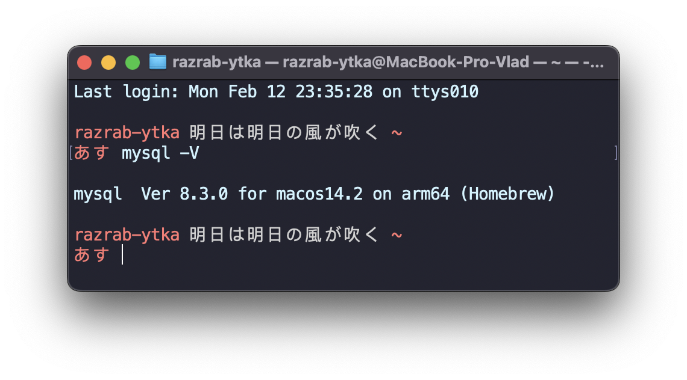

Исходный запрос для заполнения таблиц представлен в Приложении. Также исходный код запросов представлен на [GitHub](https://github.com/vladcto/suai-labs/tree/748ede66721ffe726243ad620895ce94da8024da/6_semester/%D0%9C%D0%A1%D0%9F%D0%98%D0%A1%D0%A2/2).

Результат заполнения таблиц представлен на рисунках \ref{fig:Таблица authorship} - \ref{fig:Таблица university}.

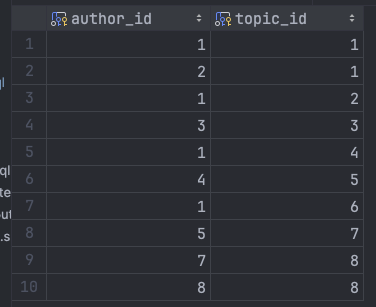

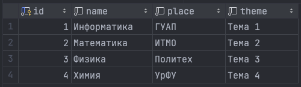

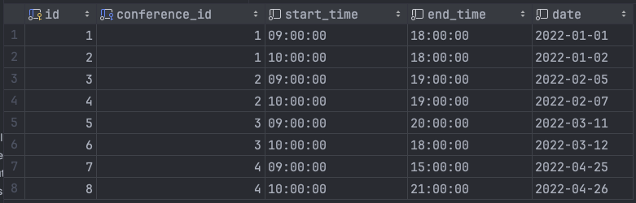

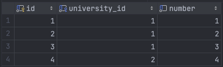

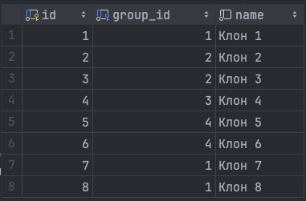<m>

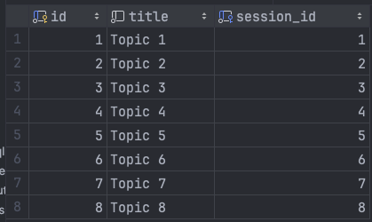<m>

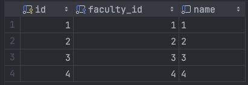<m>

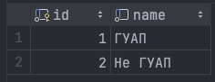<m>

## Некорректные запросы

В процессе выполнения работы были произведены операции вставки, обновления и удаления данных, как корректных, так и некорректных, для демонстрации работы с ограничениями и ссылочной целостностью базы данных.

**Листинг constraints.sql:**

\lstinputlisting{2/invalid/constraints.sql}

**Листинг reference.sql:**

\lstinputlisting{2/invalid/reference.sql}

**Листинг type.sql:**

\lstinputlisting{2/invalid/type.sql}

## Обновление данных

В ходе работы были произведены операции обновления данных для коррекции ошибочных или изменения существующих записей.

**Листинг add_column.sql:**

\lstinputlisting{2/update/add_column.sql}

**Листинг cascade_delete.sql:**

\lstinputlisting{2/update/cascade_delete.sql}

**Листинг remove_without_cascade.sql:**

\lstinputlisting{2/update/remove_without_cascade.sql}

**Листинг update_group.sql:**

\lstinputlisting{2/update/update_group.sql}

## Результат выполнения запросов

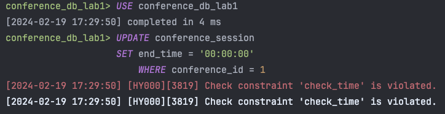<l>

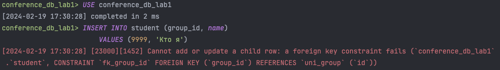<l>

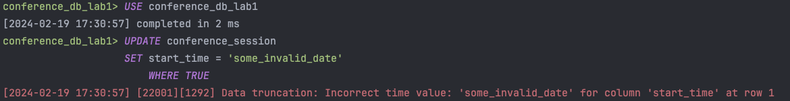<l>

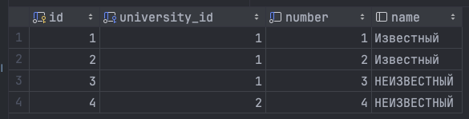<l>

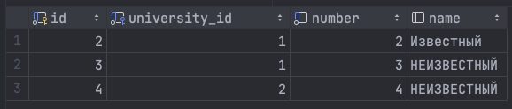<l>

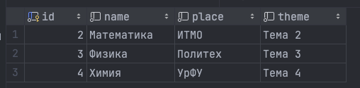<l>

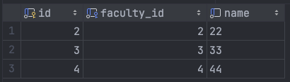<l>

\break

# Вывод

В результате выполнения лабораторной работы были получены знания и практический опыт работы с основными операциями вставки, обновления и удаления данных в базе данных с использованием SQL. Была продемонстрирована работа с ограничениями и ссылочной целостностью, а также выполнены операции каскадного удаления данных. Эти навыки и знания оказались важными для понимания работы с базами данных и их администрирования.

# Приложение <suaidoc-center>

\lstinputlisting{2/fill.sql}
