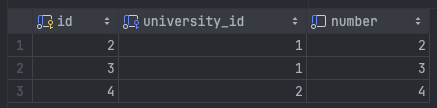

# Постановка задачи

## Цель работы

Получить навыки работы с хранимыми процедурами, хранимыми функциями и операторами.

## Задание

По аналогии с примерами, приведенными в п. 6.1, 6.2, создать в БД ХП, реализующие:

- вставку с пополнением справочников (например, вставляется информация о студенте, если указанный номер группы отсутствует в БД, запись добавляется в таблицу с перечнем групп);
- удаление с очисткой справочников (удаляется информация о студенте, если в его группе нет больше студентов, запись удаляется из таблицы с перечнем групп);
- каскадное удаление (при наличии условия ссылочной целостности no action перед удалением записи о группе удаляются записи обо всех студентах этой группы);
- вычисление и возврат значения агрегатной функции (на примере одного
из запросов из задания);
- формирование статистики во временной таблице (например, для рассматриваемой БД — для каждого факультета: количество групп, количество обучающихся студентов, количество изучаемых дисциплин, средний балл по факультету).

Самостоятельно предложить и реализовать ПЗ или ХП, демонстрирующие
использование конструкций, описанных в п. 6.1.

Самостоятельно предложить и реализовать запросы, использующие скалярную и табличную функцию по аналогии с примерами в п. 6.3.

## Содержание отчета

- текст запросов на SQL (с прояснениями/комментариями);
- наборы данных, возвращаемые запросами.

# Выполнение работы

Исходные данные взяты из лабораторной работы №2, отчет для которой есть
на [GitHub](https://github.com/vladcto/suai-labs/blob/d8c7a508971967641d8638ebcd107539c8fd618e/6_semester/%D0%9C%D0%A1%D0%9F%D0%98%D0%A1%D0%A2/%D0%BC%D1%81%D0%B8%D0%BF%D0%B8%D1%81%D1%82_2.pdf).

Исходный код доступен в приложении и в [репозитории GitHub](https://github.com/vladcto/suai-labs/tree/f380a9f5d145ba3ed6c0402c7dd570b98017a036/6_semester/%D0%9C%D0%A1%D0%9F%D0%98%D0%A1%D0%A2).

## Вставка с пополнением справочников

Для вставки с пополнением справочника мы создаем хранимую процедуру `InsertStudentWithGroupCheck`, которая принимает в качестве входных параметров имя студента, название группы и ID факультета. Процедура выполняет проверку наличия указанной группы в базе данных. Если группа отсутствует, процедура добавляет новую запись в таблицу `uni_group` и присваивает ID последней добавленной записи переменной `group_id`. В случае, если группа уже присутствует в базе данных, процедура присваивает ID этой группы переменной `group_id`. Затем процедура добавляет новую запись в таблицу `student` с именем студента и ID группы.

**Листинг insert_group.sql:**
\lstinputlisting{6/insert_group.sql}

<m>

<m>

## Удаление с очисткой справочников

Для выполнения задания мы определяем хранимую процедуру `DeleteStudentAndCleanGroup`, которая принимает идентификатор студента в качестве входного параметра. Процедура извлекает идентификатор группы этого студента, затем удаляет запись студента из таблицы `student`. После удаления студента процедура проверяет, остались ли в группе другие студенты. Если в группе не осталось студентов, процедура удаляет запись группы из таблицы `uni_group`.

**Листинг delete_student.sql:**
\lstinputlisting{6/delete_student.sql}

<m>

<m>

## Каскадное удаление

Создадим ХП(хранимую процедуру) `DeleteFacultyCascade`, которая принимает идентификатор факультета в качестве входного параметра. Процедура удаляет все записи студентов, связанных с группами, которые принадлежат указанному факультету. Затем процедура удаляет все записи групп, принадлежащих факультету. Наконец, процедура удаляет саму запись факультета.

**Листинг faculity_delete.sql:**
\lstinputlisting{6/faculity_delete.sql}

<m>

<m>

## Вычисление и возврат значения агрегатной функции

Определим хранимую функцию (ХФ) `GetReportCountForUniversity`, которая принимает идентификатор университета в качестве входного параметра и возвращает количество отчетов, созданных студентами этого университета. Функция выполняет запрос к таблицам `authorship`, `student`, `uni_group` и `faculty`, чтобы подсчитать количество отчетов, связанных с указанным университетом.

**Листинг calculate_student.sql:**
\lstinputlisting{6/calculate_student.sql}

<m>

## Формирование статистики во временной таблице

SQL запрос определяет ХП `GenerateStatistics`, которая формирует статистику по факультетам во временной таблице `faculty_statistics`. В этой таблице хранятся идентификаторы факультетов, количество групп и количество студентов для каждого факультета. Процедура выполняет запрос к таблицам `faculty`, `uni_group` и `student`, чтобы подсчитать количество групп и студентов для каждого факультета.

**Листинг generate_statistics.sql:**
\lstinputlisting{6/generate_statistics.sql}

<l>

## Запросы использующие скалярную и табличную функцию

В MySQL нельзя обьявить функцию возвращающую тип таблицы. В MSSQL для этого можно было использовать синтаксис `RETURNS TABLE AS RETURN ...` в функции. В MySQL для этого можно использовать временную таблицу \cite{ref-ref1}.

Поэтому SQL скрипт определяет функцию `GetFacultyStudentCount` и процедуру `GetFacultyStatistics`. Функция `GetFacultyStudentCount` принимает идентификатор факультета в качестве входного параметра и возвращает количество студентов, связанных с этим факультетом. Процедура `GetFacultyStatistics` создает временную таблицу `FacultyStatistics`, в которой хранятся идентификаторы факультетов, количество групп и количество студентов для каждого факультета.

**Листинг faculty_statistics.sql:**
\lstinputlisting{6/faculty_statistics.sql}

<l>

## Запросы с операторами

Запрос определяет хранимую процедуру `GetStudentsWithMoreThenNAuthorships`, которая принимает количество авторств в качестве входного параметра. Процедура извлекает каждого студента из таблицы `student` и подсчитывает количество его авторств в таблице `authorship`. Если количество авторств студента превышает указанное значение, процедура выводит идентификатор и имя этого студента.

**Листинг calculate_topics.sql:**
\lstinputlisting{6/calculate_topics.sql}

<m>

# Вывод

В результате выполнения лабораторной работы были получены навыки работы с SQL-запросами, включая использование хранимых процедур и функций. Были учтены особенности их работы, а также показан результат выполнения этих команд.

Каждый запрос был разработан с учетом поставленных задач, а также внедрены самостоятельно предложенные запросы, демонстрирующие использование различных операторов SQL.

Полученные знания и навыки будут полезны в будущих проектах и задачах, связанных с обработкой данных в среде SQL.

# СПИСОК ИСПОЛЬЗОВАННЫХ ИСТОЧНИКОВ <suaidoc-center>

<div id="refs"></div>

# ПРИЛОЖЕНИЕ <suaidoc-center>

```sql
insert_group.sql
-- ставляется информация о студенте, если указанный номер группы отсутствует 
-- в БД, запись добавляется в таблицу с перечнем групп
USE conference_db_lab1;

DELIMITER //
CREATE PROCEDURE
  InsertStudentWithGroupCheck(IN student_name VARCHAR(100),
                              IN group_name VARCHAR(50),
                              IN faculty_id_int INT)
BEGIN
  DECLARE group_id INT;

  SELECT id INTO group_id FROM uni_group WHERE name = group_name;

  IF group_id IS NULL THEN
    INSERT INTO uni_group (name, faculty_id) VALUES (group_name, faculty_id_int);
    SET group_id = LAST_INSERT_ID();
  END IF;

  INSERT INTO student (name, group_id) VALUES (student_name, group_id);
END //
DELIMITER ;
generate_statistics.sql
-- формирование статистики во временной таблице

USE conference_db_lab1;

DELIMITER //
CREATE PROCEDURE GenerateStatistics()
BEGIN
  CREATE TEMPORARY TABLE IF NOT EXISTS faculty_statistics
  (
    faculty_id    INT,
    group_count   INT,
    student_count INT
  );

  INSERT INTO faculty_statistics (faculty_id, group_count, student_count)
  SELECT f.id                 AS faculty_id,
         COUNT(DISTINCT g.id) AS group_count,
         COUNT(DISTINCT s.id) AS student_count
    FROM faculty f
           LEFT JOIN
           uni_group g ON f.id = g.faculty_id
           LEFT JOIN
           student s ON g.id = s.group_id
    GROUP BY f.id;
END//
DELIMITER ;

CALL GenerateStatistics();
# noinspection SqlResolve
SELECT *
  FROM faculty_statistics;
delete_student.sql
-- удаляется информация о студенте, если в его группе нет больше студентов, 
-- удаляется из таблицы с перечнем групп
USE conference_db_lab1;

DELIMITER //
CREATE PROCEDURE DeleteStudentAndCleanGroup(IN student_id INT)
BEGIN
  DECLARE group_id INT;

  SELECT group_id INTO group_id FROM student WHERE id = student_id;

  DELETE FROM student WHERE id = student_id;

  IF (SELECT COUNT(*) FROM student WHERE group_id = group_id) = 0 THEN
    DELETE FROM uni_group WHERE id = group_id;
  END IF;
END//
DELIMITER ;

CALL DeleteStudentAndCleanGroup(1);
faculty_statistics.sql
USE conference_db_lab1;

DELIMITER //
CREATE FUNCTION GetFacultyStudentCount(faculty_id INT) RETURNS INT
  DETERMINISTIC
BEGIN
  DECLARE student_count INT;
  SELECT COUNT(DISTINCT s.id)
    INTO student_count
    FROM student s
           INNER JOIN uni_group g ON s.group_id = g.id
    WHERE g.faculty_id = faculty_id;
  RETURN student_count;
END//
DELIMITER ;

DELIMITER //
CREATE PROCEDURE GetFacultyStatistics()
BEGIN
  CREATE TEMPORARY TABLE IF NOT EXISTS FacultyStatistics AS
  SELECT f.id                         AS faculty_id,
         COUNT(DISTINCT g.id)         AS group_count,
         GetFacultyStudentCount(f.id) AS student_count
    FROM faculty f
           LEFT JOIN
           uni_group g ON f.id = g.faculty_id
    GROUP BY f.id;

  SELECT * FROM FacultyStatistics;
END//
DELIMITER ;

CALL GetFacultyStatistics();
# noinspection SqlResolve
SELECT *
  FROM FacultyStatistics;
faculity_delete.sql
USE conference_db_lab1;

DELIMITER //
CREATE PROCEDURE DeleteFacultyCascade(IN faculty_id INT)
BEGIN
  DELETE student
    FROM student
           INNER JOIN uni_group ON student.group_id = uni_group.id
    WHERE uni_group.faculty_id = faculty_id;

  DELETE FROM uni_group WHERE uni_group.faculty_id = faculty_id;

  DELETE FROM faculty WHERE id = faculty_id;
END//
DELIMITER ;

CALL DeleteFacultyCascade(1);
calculate_topics.sql
USE conference_db_lab1;

DELIMITER //
CREATE PROCEDURE GetStudentsWithMoreThenNAuthorships(IN n_authorships INT)
BEGIN
  DECLARE total_students INT;
  DECLARE current_row INT DEFAULT 1;
  DECLARE student_id INT;
  DECLARE authorship_count INT;

  SELECT COUNT(*) INTO total_students FROM student;

  WHILE current_row <= total_students
    DO
      SELECT id INTO student_id FROM student LIMIT current_row, 1;
      SELECT COUNT(*)
        INTO authorship_count
        FROM authorship
        WHERE author_id = student_id;

      IF authorship_count > n_authorships THEN
        SELECT id, name FROM student WHERE id = student_id;
      END IF;

      SET current_row = current_row + 1;
    END WHILE;
END //
DELIMITER ;

CALL GetStudentsWithMoreThenNAuthorships(0);
calculate_student.sql
-- Вычисление и возврат значения агрегатной функции
USE conference_db_lab1;

DELIMITER //
CREATE FUNCTION GetReportCountForUniversity(university_id INT) RETURNS INT
BEGIN
  DECLARE report_count INT;

  SELECT COUNT(*)
    INTO report_count
    FROM authorship
           JOIN student ON authorship.author_id = student.id
           JOIN uni_group ON student.group_id = uni_group.id
           JOIN faculty ON uni_group.faculty_id = faculty.id
    WHERE faculty.university_id = university_id;

  RETURN report_count;
END//
DELIMITER ;

SELECT GetReportCountForUniversity(1);
```
