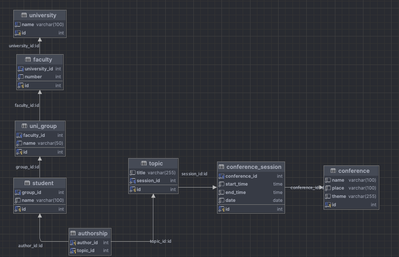

# Постановка задачи

**Цель работы:** 

Приобретение навыков создания бд и таблиц, а также настройка правил и ссылочной целостности.

**Задание:** 

Произвести создание БД и таблиц, определив правила проверки значений и задав ограничения ссылочной целостности. Структура БД должна обеспечивать хранение сведений, необходимых для выполнения запросов, указанных в варианте задания.

**Содержание отчета:**

1. схема БД;

2. скрипт SQL для создания таблиц;

3. описание структуры таблиц, ограничений на значения данных, ссылочной целостности, реализованных в БД.

**Вариант задания:**

Создайте базу данных для хранения следующих сведений: ВУЗ, студент, группа, факультет, конференция, тема доклада, программа конференции.

# Выполнение работы

Для выполнения работы была выбрана СУБД `MySQL`. Версия программного обеспечения представлена на рисунке \ref{fig:Версия программного обеспечения}.

Для создания базы данных с требуемыми таблицами был написан скрипт, доступный в Приложении и на [GitHub](https://github.com/vladcto/suai-labs/blob/797d58027114abb7d0695695adffd392b1769316/6_semester/%D0%9C%D0%A1%D0%9F%D0%98%D0%A1%D0%A2/1/init.sql).

Этот скрипт представляет собой SQL-скрипт для создания базы данных с названием `conference_db_lab1` и несколькими таблицами, предназначенными для хранения информации о студентах, университетах, факультетах, группах, конференциях и программе конференции.

Первым шагом скрипт создает базу данных `conference_db_lab1`, если она еще не существует, а затем переключается на использование этой базы данных. Затем он создает таблицу `university` для хранения данных о университетах, таблицу `faculty` для информации о факультетах, `uni_group` для хранения данных о группах, и `student` для информации о студентах.

Далее скрипт создает таблицу `conference` для хранения данных о научных конференциях, а также таблицу `topic` для хранения тем, связанных с конференциями, и информации об авторах этих тем представленных в `authorship`. Наконец, создается таблица `conference_session` для хранения программы конференции, включающей информацию о времени начала и окончания сессии, а также связи с соответствующей конференцией.

Все созданные таблицы содержат необходимые внешние ключи для поддержки целостности данных между ними, что обеспечивает связность информации в базе данных. Диаграмма БД представлена на рисунке \ref{fig:Схема БД}.

# Вывод

В результате выполнения лабораторной работы мы успешно освоили навыки создания баз данных и таблиц, а также осуществили настройку правил проверки значений и установку ограничений ссылочной целостности.

Мы начали с разработки схемы базы данных, тщательно продумывая структуру для эффективного хранения сведений о ВУЗе, студентах, группах, факультетах, конференциях, темах докладов и программах конференций. С использованием языка SQL мы создали соответствующие таблицы, применив необходимые ограничения. Описывая структуру таблиц, мы определили ограничения на значения данных, гарантируя их корректность и актуальность.

Таким образом, лабораторная работа не только позволила нам успешно реализовать поставленные задачи, но и значительно улучшила наши навыки в области проектирования баз данных. Полученный опыт будет полезен при работе с реальными проектами, где эффективная организация данных играет ключевую роль.

# Приложение <suaidoc-center>

\lstinputlisting{1/init.sql}
