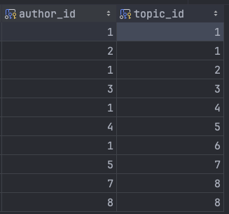
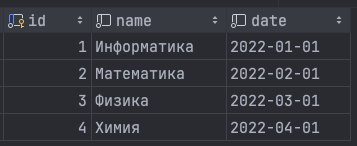
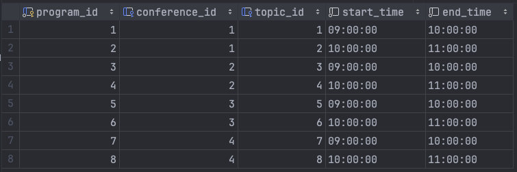
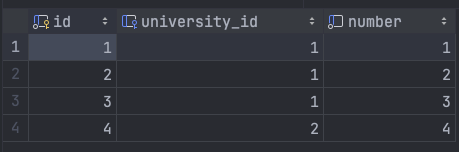
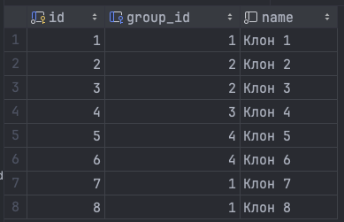
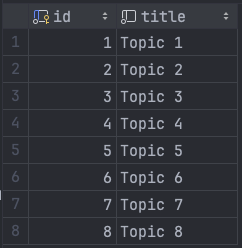
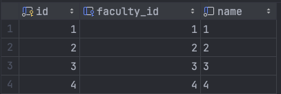

# Постановка задачи

**Цель работы:**

Целью работы является ознакомление с основными операциями вставки, обновления и удаления данных в базе данных с использованием SQL. Кроме того, целью работы также является получение практического опыта работы с операторами `INSERT`, `UPDATE` и `DELETE`, а также с оператором `ALTER TABLE` для изменения структуры таблиц.

**Задание:**

Выполнить вставку тестовых данных в таблицы, созданные в ходе выполнения лабораторной работы 1. В строках, вставляемых в таблицы, должны быть данные как удовлетворяющие, так и не удовлетворяющие условиям запросов, приведенных в варианте задания. В случае внесения в таблицы ошибочных данных произвести их корректировку операторами `UPDATE` и `DELETE`. При обнаружении недочетов в структуре БД произвести ее корректировку с помощью `ALTER TABLE`.

**Содержание отчета:**

1. схема БД (если изменялась);
2. наборы данных, содержащихся в таблицах БД;
3. примеры использования `INSERT`, `UPDATE` и `DELETE` для корректных и некорректных данных (нарушающих ограничения и ссылочную целостность);
4. примеры `UPDATE` и `DELETE`, вызывающих каскадные изменения и удаление данных;
5. примеры использования `ALTER TABLE` для корректировки структуры таблиц.

**Вариант задания:**

Создайте базу данных для хранения следующих сведений: ВУЗ, студент, группа, факультет, конференция, тема доклада, программа конференции.

# Выполнение работы

Для выполнения работы была выбрана СУБД `MySQL`. Версия программного обеспечения представлена на рисунке \ref{fig:Версия программного обеспечения}.


Исходный запрос для заполнения таблиц представлен в Приложении. Также исходный код запросов представлен на [GitHub](https://github.com/vladcto/suai-labs/tree/7c204781c51965632e1510c38f02c48c853420be/6_semester/%D0%9C%D0%A1%D0%9F%D0%98%D0%A1%D0%A2/2).

Результат заполнения таблиц представлен на рисунках \ref{fig:Таблица authorship} - \ref{fig:Таблица university}.











<m>

<m>

<m>

## Некорректные запросы

В процессе выполнения работы были произведены операции вставки, обновления и удаления данных, как корректных, так и некорректных, для демонстрации работы с ограничениями и ссылочной целостностью базы данных.

**Листинг constraints.sql:**

```sql
USE conference_db_lab1;

-- Получаем ошибку, так как end_time < start_time
UPDATE conference_program
SET end_time = '00:00:00'
    WHERE program_id = 1;
```

**Листинг reference.sql:**

```sql
USE conference_db_lab1;

-- Получаем ошибку, так как нет uni_group с ключем = 9999
INSERT INTO student (group_id, name)
    VALUES (9999, 'Кто я');
```

**Листинг type.sql:**

```sql
USE conference_db_lab1;

-- Получаем ошибку, так как неверный формат данных
UPDATE conference_program
SET start_time = 'some_invalid_date'
    WHERE TRUE;
```

## Обновление данных

В ходе работы были произведены операции обновления данных для коррекции ошибочных или изменения существующих записей.

**Листинг update:**

```sql
USE conference_db_lab1;

ALTER TABLE faculty
    ADD COLUMN name VARCHAR(255) DEFAULT ('НЕИЗВЕСТНЫЙ');

UPDATE faculty
SET name = 'Известный'
    WHERE id < 3;
```

**Листинг delete:**

```sql
USE conference_db_lab1;

-- Удаляем констрейнты, чтобы можно было спокойно удалить конференцию
ALTER TABLE conference_program
    DROP CONSTRAINT fk_conf_id_program;

DELETE
    FROM conference
    WHERE id = 1;

```

**Листинг cascade_delete:**

```sql
USE conference_db_lab1;

-- Обновляем таблицы для возможности каскадного удаления
ALTER TABLE uni_group
    DROP CONSTRAINT uni_group_ibfk_1;

ALTER TABLE uni_group
    ADD CONSTRAINT uni_group_ibfk_1
        FOREIGN KEY (faculty_id) REFERENCES faculty (id) ON DELETE CASCADE;

ALTER TABLE student
    DROP CONSTRAINT fk_group_id;

ALTER TABLE student
    ADD CONSTRAINT fk_group_id
        FOREIGN KEY (group_id) REFERENCES uni_group (id) ON DELETE CASCADE;

ALTER TABLE conference_program
    DROP CONSTRAINT fk_topic_id_program;

ALTER TABLE conference_program
    ADD CONSTRAINT fk_topic_id_program
        FOREIGN KEY (topic_id) REFERENCES topic (id) ON DELETE CASCADE;

ALTER TABLE authorship
    DROP CONSTRAINT fk_author_id;

ALTER TABLE authorship
    ADD CONSTRAINT fk_author_id FOREIGN KEY (author_id) REFERENCES student (id) ON DELETE CASCADE;

DELETE
    FROM faculty
    WHERE id = 1;
```

# Вывод

В результате выполнения лабораторной работы были получены знания и практический опыт работы с основными операциями вставки, обновления и удаления данных в базе данных с использованием SQL. Была продемонстрирована работа с ограничениями и ссылочной целостностью, а также выполнены операции каскадного удаления данных. Эти навыки и знания оказались важными для понимания работы с базами данных и их администрирования.

# Приложение <suaidoc-center>

```SQL
USE conference_db_lab1;

INSERT INTO university (name)
    VALUES ('ГУАП'),
           ('Не ГУАП');

INSERT INTO faculty (university_id, number)
    VALUES (1, 1),
           (1, 2),
           (1, 3),
           (2, 4);

INSERT INTO uni_group (faculty_id, name)
    VALUES (1, '1'),
           (2, '2'),
           (3, '3'),
           (4, '4');

INSERT INTO student (group_id, name)
    VALUES (1, 'Клон 1'),
           (2, 'Клон 2'),
           (2, 'Клон 3'),
           (3, 'Клон 4'),
           (4, 'Клон 5'),
           (4, 'Клон 6'),
           (1, 'Клон 7'),
           (1, 'Клон 8');

INSERT INTO conference (name, date)
    VALUES ('Информатика', '2022-01-01'),
           ('Математика', '2022-02-01'),
           ('Физика', '2022-03-01'),
           ('Химия', '2022-04-01');

INSERT INTO topic (title)
    VALUES ('Topic 1'),
           ('Topic 2'),
           ('Topic 3'),
           ('Topic 4'),
           ('Topic 5'),
           ('Topic 6'),
           ('Topic 7'),
           ('Topic 8');

INSERT INTO authorship (author_id, topic_id)
    VALUES (1, 1),
           (2, 1),
           (1, 2),
           (3, 3),
           (1, 4),
           (4, 5),
           (1, 6),
           (5, 7),
           (7, 8),
           (8, 8);

INSERT INTO conference_program (conference_id, topic_id, start_time, end_time)
    VALUES (1, 1, '09:00:00', '10:00:00'),
           (1, 2, '10:00:00', '11:00:00'),
           (2, 3, '09:00:00', '10:00:00'),
           (2, 4, '10:00:00', '11:00:00'),
           (3, 5, '09:00:00', '10:00:00'),
           (3, 6, '10:00:00', '11:00:00'),
           (4, 7, '09:00:00', '10:00:00'),
           (4, 8, '10:00:00', '11:00:00');
```
