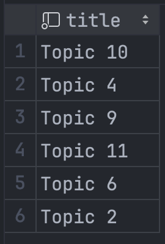
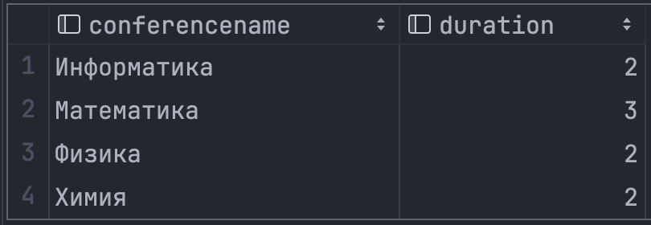
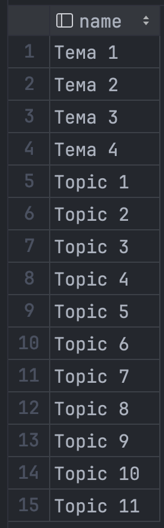

# Постановка задачи

## Цель работы

Получить навыки работы с агрегатными функциями. Освоить агрегатные директивы `count, sum, avg, min, max, group by, distinct, having`, а также `union, intersect, except`.

## Задание

По аналогии с примерами, приведенными выше:

- реализовать запросы г) .. е), указанные в варианте задания;
- самостоятельно предложить и реализовать запросы с агрегатными функциями, не использованными при выполнении варианта задания;
- самостоятельно предложить и реализовать запросы, демонстрирующие
применение каждой из директив, приведенных в п. 4.2., показать различия в получаемых результатах при выполнении теоретико-множественных операций и операций над мультимножествами.

**5 Вариант:**

Создайте базу данных для хранения следующих сведений: ВУЗ, студент,
группа, факультет, конференция, тема доклада, программа конференции.
Составьте запросы, позволяющие выбрать:

а) студентов первого факультета, выступавших на конференции Информатика;

б) темы докладов студентов для заданной группы;

в) выступления, подготовленные двумя студентами различных факультетов;

г) количество докладов для каждой конференции;

д) среднее количество докладов, сделанных студентами третьего факультета на конференциях;

е) студентов, выступивших на трех или большем числе конференций;

ж) студентов четвертого факультета, не выступавших на конференциях;

з) студентов, выступивших на всех конференциях;

и) пары студентов, всегда выступающие вместе.

## Содержание отчета

- текст запросов на SQL (с прояснениями/комментариями);
- наборы данных, возвращаемые запросами.

# Выполнение работы

Исходные данные взяты из лабораторной работы №2, отчет для которой есть на [GitHub](https://github.com/vladcto/suai-labs/blob/d8c7a508971967641d8638ebcd107539c8fd618e/6_semester/%D0%9C%D0%A1%D0%9F%D0%98%D0%A1%D0%A2/%D0%BC%D1%81%D0%B8%D0%BF%D0%B8%D1%81%D1%82_2.pdf).

## Задание 4

Ниже представлен запрос для выполнения задания 4. Мы используем оператор `JOIN` для объединения таблиц по соответствующим полям. Результаты группируются по идентификатору с помощью оператора `GROUP BY`. Затем применяется функция агрегации `COUNT` для подсчета количества докладов по каждой конференции.

**Листинг 4 задания:**
\lstinputlisting{4/4.sql}

<m>

## Задание 5

Теперь разберем запрос для задания 5. Мы используем подзапрос для подсчета количества докладов по каждой конференции, представленных студентами из факультета с номером 3. Для этого применяются операторы `JOIN` для связывания таблиц `student`, `uni_group`, `faculty`, `authorship`, `topic`, и `conference_session`. Затем, во внешнем запросе, вычисляется среднее количество докладов по каждой конференции с использованием функции `AVG`, сгруппированные по id конференции.

**Листинг 5 задания:**
\lstinputlisting{4/5.sql}

<m>

## Задание 6

В задании 6 мы используем операторы `JOIN` для связывания таблиц `student`, `authorship`, `topic`, и `conference_session`, чтобы отследить участие каждого студента в конференциях. Результаты группируются по идентификатору и имени студента. Затем применяется функция `COUNT` для подсчета уникальных конференций, в которых участвовал каждый студент. Отбор студентов, участвовавших в трех или более конференциях, осуществляется с помощью условия `HAVING`.

**Листинг 6 задания:**
\lstinputlisting{4/6.sql}

<m>

## Запросы для демонстрации

В представленном SQL-скрипте мы используем операторы `EXCEPT` и `INTERSECT` для сравнения тем, представленных двумя разными авторами. Далее применяется функция `DATEDIFF` для вычисления продолжительности каждой конференции. Наконец, оператор `UNION` используется для объединения тем и названий из двух разных таблиц в один набор данных.

**Листинг except.sql:**
\lstinputlisting{4/except.sql}

<sm>

**Листинг intersect.sql:**
\lstinputlisting{4/intersect.sql}

<sm>

**Листинг min_max.sql:**
\lstinputlisting{4/min_max.sql}

<m>

**Листинг union.sql:**
\lstinputlisting{4/union.sql}

<t>

# Вывод

В результате выполнения лабораторной работы мы приобрели навыки работы с агрегатными функциями и директивами SQL. Это включает в себя использование функций `count`, `sum`, `avg`, `min`, `max`, а также директив `group by`, `distinct`, `having`, `union`, `intersect`, `except`. Эти инструменты позволяют нам обрабатывать большие объемы данных, выполнять сложные запросы и получать ценную информацию из баз данных.

В процессе работы мы также научились реализовывать запросы используя агрегатные функции и директивы, которые не были использованы в исходном задании. Это помогло нам углубить понимание возможностей SQL и развить навыки решения сложных задач.

# ПРИЛОЖЕНИЕ <suaidoc-center>

```sql
except.sql
-- Темы, над которыми работал студент студент 1, но не студент 2
USE conference_db_lab1;

SELECT t.title
    FROM topic t
             JOIN authorship a ON t.id = a.topic_id
    WHERE a.author_id = 1

EXCEPT

SELECT t.title
    FROM topic t
             JOIN authorship a ON t.id = a.topic_id
    WHERE a.author_id = 2;
min_max.sql
-- Длительность конференции
USE conference_db_lab1;

SELECT c.name AS conferencename, DATEDIFF(MAX(cs.date), MIN(cs.date)) + 1 AS duration
    FROM conference_session cs
             JOIN conference c ON cs.conference_id = c.id
    GROUP BY c.name;
4.sql
-- количество докладов для каждой конференции;
USE conference_db_lab1;

SELECT c.id              AS conference_id,
       COUNT(a.topic_id) AS report_count
    FROM conference c
             JOIN
             conference_session cs ON c.id = cs.conference_id
             JOIN
             topic t ON cs.id = t.session_id
             JOIN
             authorship a ON t.id = a.topic_id
    GROUP BY c.id;
5.sql
-- среднее количество докладов, сделанных студентами третьего факультета на конференциях;
USE conference_db_lab1;

SELECT subquery.conference_id,
       AVG(report_count) AS average_reports
    FROM (SELECT cs.conference_id,
                 COUNT(a.topic_id) AS report_count
              FROM student s
                       JOIN
                       uni_group ug ON s.group_id = ug.id
                       JOIN
                       faculty f ON ug.faculty_id = f.id
                       JOIN
                       authorship a ON s.id = a.author_id
                       JOIN
                       topic t ON a.topic_id = t.id
                       JOIN
                       conference_session cs ON t.session_id = cs.id
              WHERE f.number = 3
              GROUP BY cs.conference_id) AS subquery
    GROUP BY conference_id;

intersect.sql
-- Темы, над которыми работал студент студент 1 и студент 2
USE conference_db_lab1;

SELECT t.title
    FROM topic t
             JOIN authorship a ON t.id = a.topic_id
    WHERE a.author_id = 1

INTERSECT

SELECT t.title
    FROM topic t
             JOIN authorship a ON t.id = a.topic_id
    WHERE a.author_id = 2;
6.sql
-- студентов, выступивших на трех или большем числе конференций
USE conference_db_lab1;

SELECT s.id                             AS student_id,
       s.name                           AS student_name,
       COUNT(DISTINCT cs.conference_id) AS conference_count
    FROM student s
             JOIN
             authorship a ON s.id = a.author_id
             JOIN
             topic t ON a.topic_id = t.id
             JOIN
             conference_session cs ON t.session_id = cs.id
    GROUP BY s.id, s.name
    HAVING conference_count >= 3;
union.sql
USE conference_db_lab1;

SELECT theme AS name FROM conference
UNION
SELECT title AS name FROM topic;
```