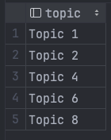
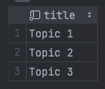
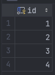
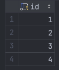

# Постановка задачи

## Цель работы

Получить навыки работы с подзапросами. Освоить подзапросы, экзистенциальные запросы, производные
таблицы и представления, а также директивы `create view, drop view, exists`.

## Задание

По аналогии с примерами, приведенными выше:

- реализовать запросы ж) .. и), указанные в варианте задания;
- самостоятельно предложить и реализовать запросы, демонстрирующие
  использование подзапросов в операторах манипулирования данными;
- с помощью `[not] exists` реализовать запросы, разработанные в п. 4 для
  иллюстрации использования теоретико-множественных операций, показать раз-
  личие в выполнении запросов с `[not] exists` и теоретико-множественными опера-
  циями при наличии в таблицах `null`-значений (п. 5.3).

**5 Вариант:**

Создайте базу данных для хранения следующих сведений: ВУЗ, студент,
группа, факультет, конференция, тема доклада, программа конференции.
Составьте запросы, позволяющие выбрать:

а) студентов первого факультета, выступавших на конференции Информатика;

б) темы докладов студентов для заданной группы;

в) выступления, подготовленные двумя студентами различных факультетов;

г) количество докладов для каждой конференции;

д) среднее количество докладов, сделанных студентами третьего факультета на конференциях;

е) студентов, выступивших на трех или большем числе конференций;

ж) студентов четвертого факультета, не выступавших на конференциях;

з) студентов, выступивших на всех конференциях;

и) пары студентов, всегда выступающие вместе.

## Содержание отчета

- текст запросов на SQL (с прояснениями/комментариями);
- наборы данных, возвращаемые запросами.

# Выполнение работы

Исходные данные взяты из лабораторной работы №2, отчет для которой есть
на [GitHub](https://github.com/vladcto/suai-labs/blob/d8c7a508971967641d8638ebcd107539c8fd618e/6_semester/%D0%9C%D0%A1%D0%9F%D0%98%D0%A1%D0%A2/%D0%BC%D1%81%D0%B8%D0%BF%D0%B8%D1%81%D1%82_2.pdf).

## Задание 1

Запрос для задания 1 позволяет получить список имен студентов первого факультета, принимавших
участие в конференции "Информатика". Для этого используется несколько `JOIN` операторов для
объединения таблиц и условия `WHERE` для фильтрации результатов по номеру факультета и названию
конференции. Ключевое слово `DISTINCT` используется для вывода уникальных имен студентов.

**Листинг 1 задания:**
\lstinputlisting{3/1.sql}

<m>

## Задание 2

Запрос 2.sql возвращает уникальные темы докладов студентов группы с указанным именем. Используются
`JOIN` операторы для объединения таблиц и условие `WHERE` для фильтрации результатов по имени
группы.
Ключевое слово `DISTINCT` применяется для вывода уникальных тем докладов.

**Листинг 2 задания:**
\lstinputlisting{3/2.sql}

<m>

## Задание 3

В запросе для 3 задания осуществляется поиск выступлений, подготовленных двумя студентами с
различных
факультетов. С использованием операторов `JOIN` объединяются таблицы, представляющие информацию о
темах докладов, авторах, студентах, группах и факультетах. Условия `WHERE` фильтруют результаты,
чтобы
выбрать только те темы, для которых студенты принадлежат разным факультетам. Результат запроса
включает название темы, имя первого и второго студента. Результаты сортируются в алфавитном порядке
по имени первого студента.

**Листинг 3 задания:**
\lstinputlisting{3/3.sql}

<m>

## Запросы для демонстрации

В ниже представленных SQL-запросах представлены ранее не использованные команды. Первый запрос
демонстрирует использование оператора `BETWEEN` для выбора тем докладов с идентификаторами от 1 до
3.

Второй запрос использует оператор `IS NOT NULL` для извлечения идентификаторов групп, у которых имя
не
равно `NULL`. Третий запрос иллюстрирует использование оператора `LIKE` с символом `%`, что
позволяет выбрать все идентификаторы групп, где имя содержит любые символы.

**Листинг between.sql:**
\lstinputlisting{3/between.sql}

<sm>

**Листинг check_null_fields.sql:**
\lstinputlisting{3/check_null_fields.sql}

<sm>

**Листинг like.sql:**
\lstinputlisting{3/like.sql}

<sm>

# Вывод

В результате выполнения лабораторной работы были получены навыки работы с SQL-запросами, включая
применение различных директив, таких
как `distinct`, `order by`, `as`, `[not] in`, `[not] between ... and ...`, `is [not] null`, `[not] like`.
Работа включала создание базы данных для хранения информации о ВУЗе, студентах, группах,
факультетах, конференциях, темах докладов и программах конференций.

Каждый запрос был разработан с учетом поставленных задач, а также внедрены самостоятельно
предложенные запросы, демонстрирующие использование различных директив SQL. В процессе выполнения
работы были охвачены такие аспекты, как фильтрация данных, сортировка
результатов, объединение таблиц и использование различных условий для точного извлечения необходимой
информации из базы данных.

Полученные знания и навыки будут полезны в будущих проектах и задачах, связанных с обработкой данных
в среде SQL.