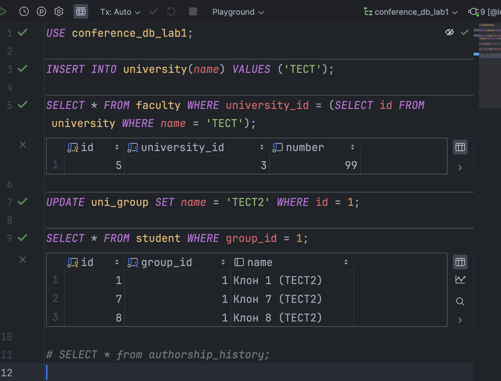
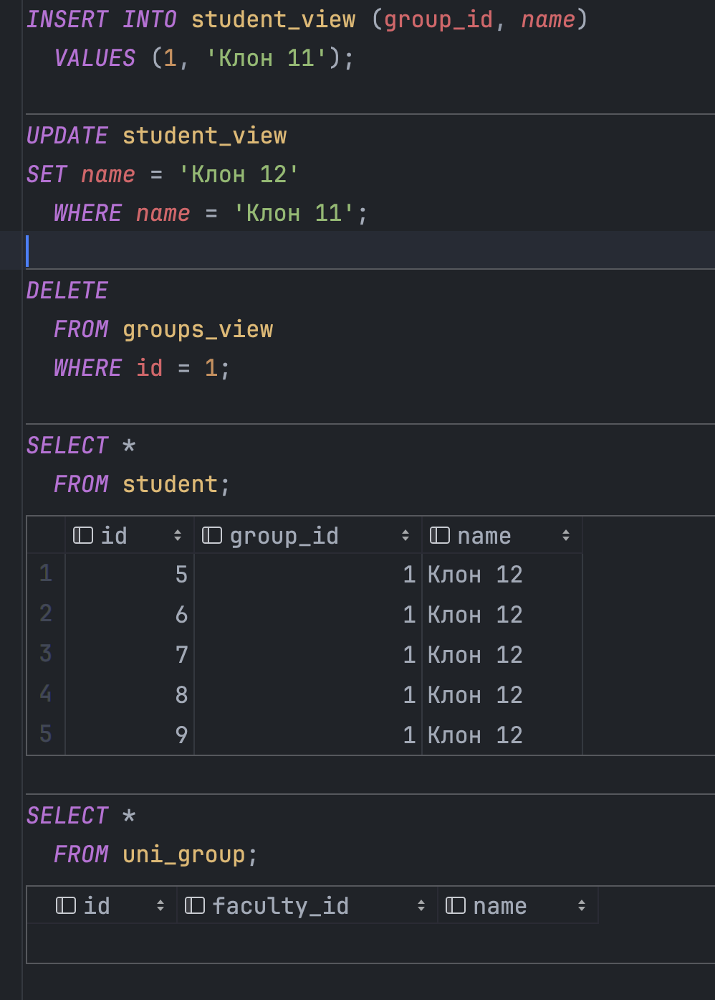

# Постановка задачи

## Задание

Реализовать:

— триггеры каждого вида (after, instead of) для каждой из операций (insert, update, delete), обеспечивающие активную целостность данных;

— триггер, реализующий вычисления или формирование статистики или ведение истории изменений в БД.

## Содержание отчета

— тексты триггеров (с пояснениями/комментариями);
— SQL операторы, вызывающие запуск триггеров, и наборы данных, иллюстрирующие их работу.

**5 Вариант:**

Создайте базу данных для хранения следующих сведений: ВУЗ, студент,
группа, факультет, конференция, тема доклада, программа конференции.
Составьте запросы, позволяющие выбрать:

а) студентов первого факультета, выступавших на конференции Информатика;

б) темы докладов студентов для заданной группы;

в) выступления, подготовленные двумя студентами различных факультетов;

г) количество докладов для каждой конференции;

д) среднее количество докладов, сделанных студентами третьего факультета на конференциях;

е) студентов, выступивших на трех или большем числе конференций;

ж) студентов четвертого факультета, не выступавших на конференциях;

з) студентов, выступивших на всех конференциях;

и) пары студентов, всегда выступающие вместе.

# Выполнение работы

Исходные данные взяты из лабораторной работы №2, отчет для которой есть на [GitHub](https://github.com/vladcto/suai-labs/blob/d8c7a508971967641d8638ebcd107539c8fd618e/6_semester/%D0%9C%D0%A1%D0%9F%D0%98%D0%A1%D0%A2/%D0%BC%D1%81%D0%B8%D0%BF%D0%B8%D1%81%D1%82_2.pdf).

Текст запросов представлен в Приложении, а также в [репозитории GitHub](https://github.com/vladcto/suai-labs/tree/1feac804866a924523979b3a271d293076b96bdf/6_semester/%D0%9C%D0%A1%D0%9F%D0%98%D0%A1%D0%A2/7).

## Демонстрация работы триггеров

Так как `MySQL` не может представить все триггеры, то было решено часть задания
реализовать используя `PostgreSQL`.

### after

Реализован триггер after_university_insert, активирующийся после операции INSERT в таблице university. Функционал данного триггера предусматривает вставку новой записи в таблицу faculty с university_id, равным вновь вставленному id, и начальным номером факультета 99 для каждой вставленной строки.

Далее, создан триггер after_uni_group_update, срабатывающий после операции UPDATE в таблице uni_group. Данный триггер обеспечивает обновление столбца name в таблице student путем конкатенации текущего значения name со новым значением name группы, заключенным в круглые скобки, для всех студентов, относящихся к обновленной группе.

```
USE conference_db_lab1;

CREATE TRIGGER after_university_insert
  AFTER INSERT
  ON university
  FOR EACH ROW
BEGIN
  INSERT INTO faculty(university_id, number)
    VALUES (NEW.id, 99);
END;

CREATE TRIGGER after_uni_group_update
  AFTER UPDATE
  ON uni_group
  FOR EACH ROW
BEGIN
  UPDATE student
  SET name = CONCAT(name, ' (', NEW.name, ')')
    WHERE group_id = NEW.id;
END;
```



### instead of

Для демонстрации работы триггера `instead of` был выбран `PostgreSQL`.

Скрипт инициализации представлен ниже.

```
INSERT INTO university (name)
  VALUES ('СПбГУ');

INSERT INTO faculty
  VALUES (1, 1, 1);

INSERT INTO uni_group (faculty_id, name)
  VALUES (1, 'Группа 1');

INSERT INTO student (group_id, name)
  VALUES (1, 'Клон 1');

INSERT INTO conference (name, place, theme)
  VALUES ('Научная конференция', 'ГУАП', 'Искусственный интеллект');

INSERT INTO conference_session (conference_id, start_time, end_time)
  VALUES (1, '2022-01-01 10:00:00', '2022-01-01 18:00:00');

INSERT INTO topic (title, session_id)
  VALUES ('Тема 1', 1);

INSERT INTO authorship (author_id, topic_id)
  VALUES (1, 1);
```

```
CREATE TABLE IF NOT EXISTS university
(
  id   SERIAL PRIMARY KEY,
  name VARCHAR(100) NOT NULL UNIQUE
);

CREATE TABLE IF NOT EXISTS faculty
(
  id            SERIAL PRIMARY KEY,
  university_id INT NOT NULL,
  number        INT NOT NULL UNIQUE
);

CREATE TABLE IF NOT EXISTS uni_group
(
  id         SERIAL PRIMARY KEY,
  faculty_id INT         NOT NULL,
  name       VARCHAR(50) NOT NULL UNIQUE
);

CREATE TABLE IF NOT EXISTS student
(
  id       SERIAL PRIMARY KEY,
  group_id INT NOT NULL,
  name     VARCHAR(100)
);

CREATE TABLE IF NOT EXISTS conference
(
  id    SERIAL PRIMARY KEY,
  name  VARCHAR(100) NOT NULL DEFAULT 'Научная конференция',
  place VARCHAR(100) NOT NULL DEFAULT 'ГУАП',
  theme VARCHAR(255) NOT NULL
);

CREATE TABLE IF NOT EXISTS conference_session
(
  id            SERIAL PRIMARY KEY,
  conference_id INT       NOT NULL,
  start_time    TIMESTAMP NOT NULL,
  end_time      TIMESTAMP NOT NULL
);

CREATE TABLE IF NOT EXISTS topic
(
  id         SERIAL PRIMARY KEY,
  title      VARCHAR(255) NOT NULL,
  session_id INT          NOT NULL
);

CREATE TABLE IF NOT EXISTS authorship
(
  author_id INT NOT NULL,
  topic_id  INT NOT NULL,
  PRIMARY KEY (author_id, topic_id)
);
```

Реализованы представления student\_view и groups\_view, предоставляющие полный набор данных из таблиц student и uni\_group соответственно. Созданы функции student\_insert() и student\_update() для вставки и обновления данных в таблице student, а также триггеры student\_insert\_trigger и student\_update\_trigger, активирующие эти функции вместо операций INSERT и UPDATE в представлении student\_view.

Для удаления групп вместе с относящимися к ним студентами создана функция group\_remove(). Реализован триггер group\_delete\_trigger, который срабатывает вместо операции DELETE в представлении groups\_view и выполняет функцию group\_remove() для каждой удаляемой строки.

```
CREATE OR REPLACE VIEW student_view AS
SELECT *
  FROM student;

CREATE OR REPLACE VIEW groups_view AS
SELECT *
  FROM uni_group;

CREATE OR REPLACE FUNCTION student_insert() RETURNS TRIGGER AS
$$
BEGIN
  INSERT INTO student(group_id, name) VALUES (new.group_id, new.name);
  RETURN new;
END;
$$ LANGUAGE plpgsql;

CREATE OR REPLACE TRIGGER student_insert_trigger
  INSTEAD OF INSERT
  ON student_view
  FOR EACH ROW
EXECUTE PROCEDURE student_insert();

CREATE OR REPLACE FUNCTION student_update() RETURNS TRIGGER AS
$$
BEGIN
  UPDATE student SET group_id = new.group_id, name = new.name WHERE id = old.id;
  RETURN new;
END;
$$ LANGUAGE plpgsql;

CREATE OR REPLACE TRIGGER student_update_trigger
  INSTEAD OF UPDATE
  ON student_view
  FOR EACH ROW
EXECUTE PROCEDURE student_update();

CREATE OR REPLACE FUNCTION group_remove() RETURNS TRIGGER AS
$$
BEGIN
  DELETE FROM student WHERE student.group_id = old.id;
  DELETE FROM uni_group WHERE uni_group.id = old.id;
  RETURN old;
END;
$$ LANGUAGE plpgsql;

CREATE OR REPLACE TRIGGER group_delete_trigger
  INSTEAD OF DELETE
  ON groups_view
  FOR EACH ROW
EXECUTE PROCEDURE group_remove();
```



## Логирование операций БД

Скрипт реализует логирование операций в таблице authorship.

Создается таблица authorship\_history с колонками: id, author\_id, topic\_id, change\_type и change\_time. Далее, создаются триггеры для фиксации операций INSERT, DELETE и UPDATE в таблице authorship: authorship\_after\_insert, authorship\_after\_delete и authorship\_after\_update. При выполнении этих операций данные о текущем изменении автором и темой, а также тип изменения ('INSERT', 'DELETE' или 'UPDATE') сохраняются в таблицу authorship\_history.

```
USE conference_db_lab1;

CREATE TABLE IF NOT EXISTS authorship_history
(
  id          INT PRIMARY KEY AUTO_INCREMENT,
  author_id   INT         NOT NULL,
  topic_id    INT         NOT NULL,
  change_type VARCHAR(10) NOT NULL,
  change_time TIMESTAMP DEFAULT CURRENT_TIMESTAMP
);

DELIMITER //
CREATE TRIGGER authorship_after_insert
  AFTER INSERT
  ON authorship
  FOR EACH ROW
BEGIN
  INSERT INTO authorship_history (author_id, topic_id, change_type)
    VALUES (NEW.author_id, NEW.topic_id, 'INSERT');
END;
//

CREATE TRIGGER authorship_after_delete
  AFTER DELETE
  ON authorship
  FOR EACH ROW
BEGIN
  INSERT INTO authorship_history (author_id, topic_id, change_type)
    VALUES (OLD.author_id, OLD.topic_id, 'DELETE');
END;
//

CREATE TRIGGER authorship_after_update
  AFTER UPDATE
  ON authorship
  FOR EACH ROW
BEGIN
  INSERT INTO authorship_history (author_id, topic_id, change_type)
    VALUES (NEW.author_id, NEW.topic_id, 'UPDATE');
END;
//
DELIMITER ;
```


# Вывод

В соответствии с поставленной задачей реализованы триггеры для обеспечения активной целостности данных и ведения истории изменений в базе данных.

Для операций INSERT, UPDATE и DELETE в таблице authorship созданы триггеры after insert, after update и after delete, которые обеспечивают сохранение информации об изменениях в таблице authorship\_history. Эти триггеры фиксируют тип изменения, идентификатор автора и темы, а также время изменения.

Также реализован триггер instead of insert для представления student\_view, который обеспечивает вставку данных в таблицу student при попытке вставки в представление. Аналогичным образом реализован триггер instead of update для этого представления, который обеспечивает обновление данных в таблице student. Для представления groups\_view реализован триггер instead of delete, который обеспечивает удаление строк из таблиц student и uni\_group при попытке удаления из представления.

Таким образом, реализованные триггеры обеспечивают активную целостность данных и ведение истории изменений в базе данных.

# ПРИЛОЖЕНИЕ <suaidoc-center>

```sql

autorship_history.sql
USE conference_db_lab1;

CREATE TABLE IF NOT EXISTS authorship_history
(
  id          INT PRIMARY KEY AUTO_INCREMENT,
  author_id   INT         NOT NULL,
  topic_id    INT         NOT NULL,
  change_type VARCHAR(10) NOT NULL,
  change_time TIMESTAMP DEFAULT CURRENT_TIMESTAMP
);

-- Создаем триггеры для отслеживания изменений в таблице authorship
DELIMITER //
CREATE TRIGGER authorship_after_insert
  AFTER INSERT
  ON authorship
  FOR EACH ROW
BEGIN
  INSERT INTO authorship_history (author_id, topic_id, change_type)
    VALUES (NEW.author_id, NEW.topic_id, 'INSERT');
END;
//

CREATE TRIGGER authorship_after_delete
  AFTER DELETE
  ON authorship
  FOR EACH ROW
BEGIN
  INSERT INTO authorship_history (author_id, topic_id, change_type)
    VALUES (OLD.author_id, OLD.topic_id, 'DELETE');
END;
//

CREATE TRIGGER authorship_after_update
  AFTER UPDATE
  ON authorship
  FOR EACH ROW
BEGIN
  INSERT INTO authorship_history (author_id, topic_id, change_type)
    VALUES (NEW.author_id, NEW.topic_id, 'UPDATE');
END;
//
DELIMITER ;
check_trigger.sql
USE conference_db_lab1;

-- Проверка триггера after_university_insert
INSERT INTO university(name) VALUES ('ТЕСТ');

SELECT * FROM faculty WHERE university_id = (SELECT id FROM university WHERE name = 'ТЕСТ');

UPDATE uni_group SET name = 'ТЕСТ2' WHERE id = 1;

SELECT * FROM student WHERE group_id = 1;

SELECT * from authorship_history;

fill.sql
INSERT INTO university (name)
  VALUES ('СПбГУ');

INSERT INTO faculty
  VALUES (1, 1, 1);

INSERT INTO uni_group (faculty_id, name)
  VALUES (1, 'Группа 1');

INSERT INTO student (group_id, name)
  VALUES (1, 'Клон 1');

INSERT INTO conference (name, place, theme)
  VALUES ('Научная конференция', 'ГУАП', 'Искусственный интеллект');

INSERT INTO conference_session (conference_id, start_time, end_time)
  VALUES (1, '2022-01-01 10:00:00', '2022-01-01 18:00:00');

INSERT INTO topic (title, session_id)
  VALUES ('Тема 1', 1);

INSERT INTO authorship (author_id, topic_id)
  VALUES (1, 1);
check_trigger.sql
INSERT INTO student_view (group_id, name)
  VALUES (1, 'Клон 11');

UPDATE student_view
SET name = 'Клон 12'
  WHERE name = 'Клон 11';

DELETE
  FROM groups_view
  WHERE id = 1;

SELECT *
  FROM student;

SELECT *
  FROM uni_group;
instead_of.sql
CREATE OR REPLACE VIEW student_view AS
SELECT *
  FROM student;

CREATE OR REPLACE VIEW groups_view AS
SELECT *
  FROM uni_group;

CREATE OR REPLACE FUNCTION student_insert() RETURNS TRIGGER AS
$$
BEGIN
  INSERT INTO student(group_id, name) VALUES (new.group_id, new.name);
  RETURN new;
END;
$$ LANGUAGE plpgsql;

CREATE OR REPLACE TRIGGER student_insert_trigger
  INSTEAD OF INSERT
  ON student_view
  FOR EACH ROW
EXECUTE PROCEDURE student_insert();

CREATE OR REPLACE FUNCTION student_update() RETURNS TRIGGER AS
$$
BEGIN
  UPDATE student SET group_id = new.group_id, name = new.name WHERE id = old.id;
  RETURN new;
END;
$$ LANGUAGE plpgsql;

CREATE OR REPLACE TRIGGER student_update_trigger
  INSTEAD OF UPDATE
  ON student_view
  FOR EACH ROW
EXECUTE PROCEDURE student_update();

CREATE OR REPLACE FUNCTION group_remove() RETURNS TRIGGER AS
$$
BEGIN
  DELETE FROM student WHERE student.group_id = old.id;
  DELETE FROM uni_group WHERE uni_group.id = old.id;
  RETURN old;
END;
$$ LANGUAGE plpgsql;

CREATE OR REPLACE TRIGGER group_delete_trigger
  INSTEAD OF DELETE
  ON groups_view
  FOR EACH ROW
EXECUTE PROCEDURE group_remove();
init.sql
CREATE TABLE IF NOT EXISTS university
(
  id   SERIAL PRIMARY KEY,
  name VARCHAR(100) NOT NULL UNIQUE
);

CREATE TABLE IF NOT EXISTS faculty
(
  id            SERIAL PRIMARY KEY,
  university_id INT NOT NULL,
  number        INT NOT NULL UNIQUE
);

CREATE TABLE IF NOT EXISTS uni_group
(
  id         SERIAL PRIMARY KEY,
  faculty_id INT         NOT NULL,
  name       VARCHAR(50) NOT NULL UNIQUE
);

CREATE TABLE IF NOT EXISTS student
(
  id       SERIAL PRIMARY KEY,
  group_id INT NOT NULL,
  name     VARCHAR(100)
);

CREATE TABLE IF NOT EXISTS conference
(
  id    SERIAL PRIMARY KEY,
  name  VARCHAR(100) NOT NULL DEFAULT 'Научная конференция',
  place VARCHAR(100) NOT NULL DEFAULT 'ГУАП',
  theme VARCHAR(255) NOT NULL
);

CREATE TABLE IF NOT EXISTS conference_session
(
  id            SERIAL PRIMARY KEY,
  conference_id INT       NOT NULL,
  start_time    TIMESTAMP NOT NULL,
  end_time      TIMESTAMP NOT NULL
);

CREATE TABLE IF NOT EXISTS topic
(
  id         SERIAL PRIMARY KEY,
  title      VARCHAR(255) NOT NULL,
  session_id INT          NOT NULL
);

CREATE TABLE IF NOT EXISTS authorship
(
  author_id INT NOT NULL,
  topic_id  INT NOT NULL,
  PRIMARY KEY (author_id, topic_id)
);
after.sql
USE conference_db_lab1;

CREATE TRIGGER after_university_insert
  AFTER INSERT
  ON university
  FOR EACH ROW
BEGIN
  INSERT INTO faculty(university_id, number)
    VALUES (NEW.id, 99);
END;

CREATE TRIGGER after_uni_group_update
  AFTER UPDATE
  ON uni_group
  FOR EACH ROW
BEGIN
  UPDATE student
  SET name = CONCAT(name, ' (', NEW.name, ')')
    WHERE group_id = NEW.id;
END;
```
