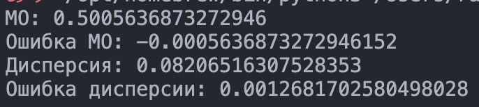
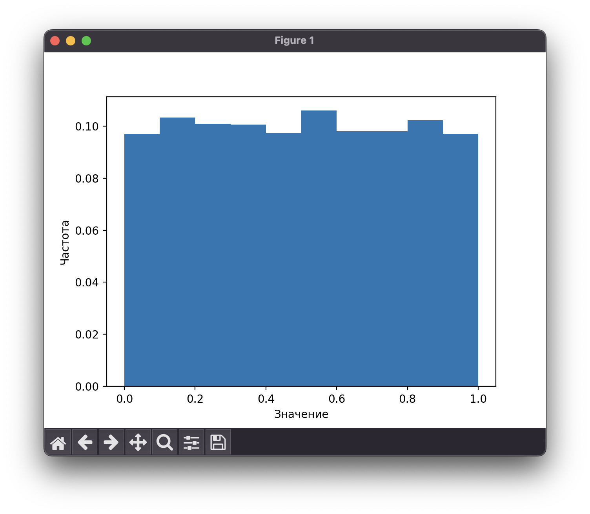
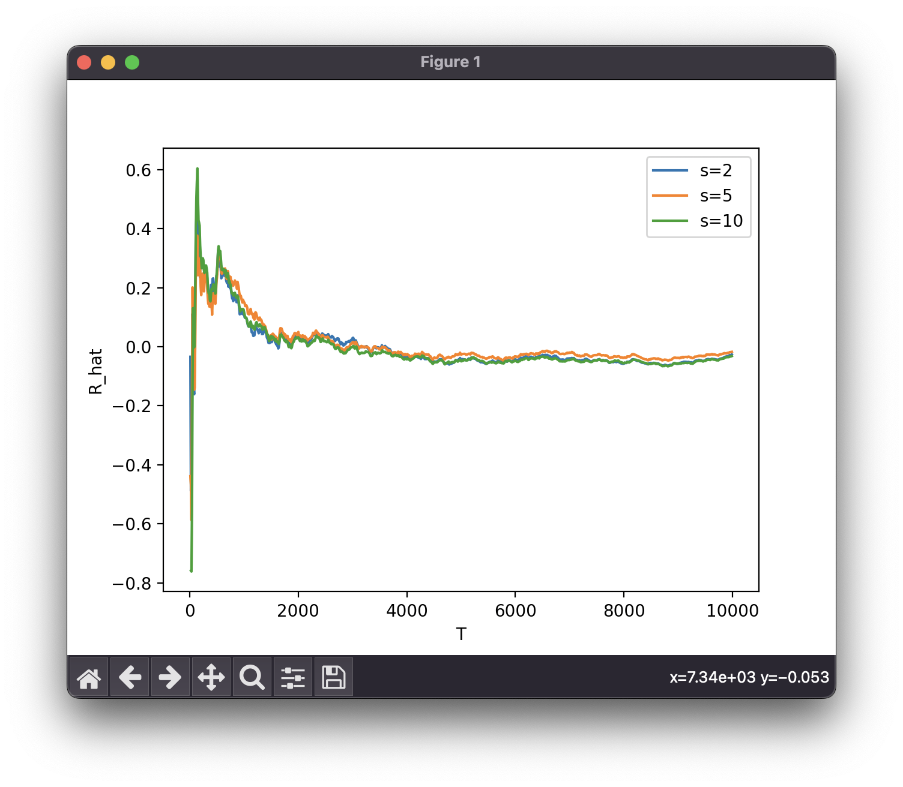

<!--markdownlint-disable ol-prefix, no-inline-html-->

# Постановка задачи

## Цель работы

Построить датчик базовой случайной величины по
заданному алгоритму и выполнить тестирование датчика на соответствие
основным свойствам базовой случайной величины.

## Содержание отчета

1. Цель, задание и последовательность выполнения работы.
2. Результаты сравнений математического ожидания и дисперсии псевдослучайных значений $z_i$ с теоретическими значениями M и D.
3. Гистограмма распределения относительных частот попаданий
   псевдослучайных величин в отрезки интервала $[0,1]$.
4. Графики зависимости коэффициента корреляции для $s=2, s=5, s=10$.
5. Выводы о результатах моделирования БСВ.

## Вариант

**5 Вариант, aддитивный генератор Fish:**

$$
A_i=(A_{i-55}+A_{i-24})\bmod(2^{32})\\
B_i=(B_{i-52}+B_{i-19})\bmod(2^{32})\\
z_i=\frac{A_i}{2^{32}},z_{i+1}=\frac{B_i}{2^{32}}
$$

Состоит из двух аддитивных генераторов $A_i$ и $B_i$, начальные состояния которых
создаются `Random`. Эти последовательности прореживаются попарно в зависимости от случая: если значение младшего значащего бита $B_i$ равно $1$, то пара используется, если $0$ - игнорируется.

# Выполнение работы

Исходный код доступен в Приложении и репозитории [GitHub](https://github.com/vladcto/suai-labs/tree/main/6_semester).

## Математическая модель

$$
M(z)=0.5,\:D(z)=1/12,
$$

где:

- $M(z)$ - математическое ожидание;
- $D(z)$ - дисперсия.

$$f(z)=1,\; (0\leq z\leq1),$$

где:

- $f(z)$ - плотность распределения;
- $z$ - непрерывная случайная величина.

$$z_{i+1}=f(z_i),$$

где:

- $f(z_i)$ - функция программного датчика БСВ.

Equation: кор

$$
\hat{R}=12\frac{1}{T-s}
(\sum_{i=1}^{T-s} z_i \cdot z_{i+s})-3,
$$

где:

- $\hat{R}$ - коэффициент корреляции для значений БСВ.

## Реализация модели

Для расчета характеристик был написан скрипт на Python, который изображен ниже.
Выбор пал на Python ввиду его простоты, удобства и хорошей поддержке математических операций.

**Листинг lcg.py:**
\lstinputlisting{lcg.py}

**Листинг fish_generator.py:**
\lstinputlisting{fish_generator.py}

## Результат моделирования

Для начала была подсчитана ошибка фактического и теоретического МО и дисперсии. Результат изображен на рисунке \ref{fig:МО и дисперсия}.

Была построена гистограмма распределения изображенная на рисунке \ref{fig:Гистограмма распределения БСВ}.

Были получены графики зависимости коэффициента корреляции $R$, полученные по формуле (\ref{eq:кор})
и представленные на рисунке \ref{fig:Графики корреляции}.

## Анализ

В результате проведенного анализа работы следует отметить, что разработанный датчик базовой случайной величины, основанный на аддитивном генераторе Fish, успешно соответствует теоретическим ожиданиям. Согласованность математического ожидания $M$ и дисперсии $D$ полученных псевдослучайных значений с соответствующими теоретическими значениями подтверждает, а также гистограмма распределения на интервале $[0,1]$ подтверждает верную реализацию aддитивного генератора Fish.

На основе графика зависимости коэффициента корреляции для различных сдвигов $s$, можно выделить, что для всех $s(2,5,10)$ графики стремятся к нулю, и имеют одинаковую кривизну. Это может говорить о том, что значения генератора являются статистически независимыми.

В целом, полученные результаты и анализ указывают на успешную разработку и тестирование датчика базовой случайной величины на основе аддитивного генератора Fish. Этот датчик представляет собой эффективный инструмент для генерации псевдослучайных последовательностей с удовлетворительными статистическими характеристиками.

# Вывод

В результате выполнения данной работы был разработан и исследован датчик базовой случайной величины (БСВ) на основе аддитивного генератора Fish. В ходе построения датчика был реализован алгоритм, объединяющий два аддитивных генератора $A_i$ и $B_i$, их начальные состояния создаются с использованием функции `Random`. Последовательности затем прореживаются попарно в зависимости от значения младшего значащего бита $B_i$. Результаты тестирования данного датчика на соответствие основным свойствам БСВ позволяют сделать вывод о его эффективности в создании псевдослучайных последовательностей.

Для оценки качества полученных псевдослучайных значений проведено сравнение математического ожидания и дисперсии с соответствующими теоретическими значениями. Предложенный датчик демонстрирует согласованность с теоретическими характеристиками, что подтверждает его пригодность для моделирования случайных величин. Гистограмма распределения относительных частот попаданий в отрезки интервала $[0,1]$ дополнительно подтверждает равномерность распределения, что является важным свойством для многих приложений в области статистики и моделирования.

Графики зависимости коэффициента корреляции для различных сдвигов $s$ позволяют оценить корреляционные свойства последовательности псевдослучайных величин. Обнаруживается устойчивость к корреляции при различных значениях $s$, что является положительным результатом. В целом, разработанный датчик базовой случайной величины на основе аддитивного генератора Fish успешно соответствует поставленной цели, предоставляя надежный инструмент для генерации случайных последовательностей в различных областях применения.

# ПРИЛОЖЕНИЕ <suaidoc-center>

\lstinputlisting{fish_generator.py}

\lstinputlisting{lcg.py}
