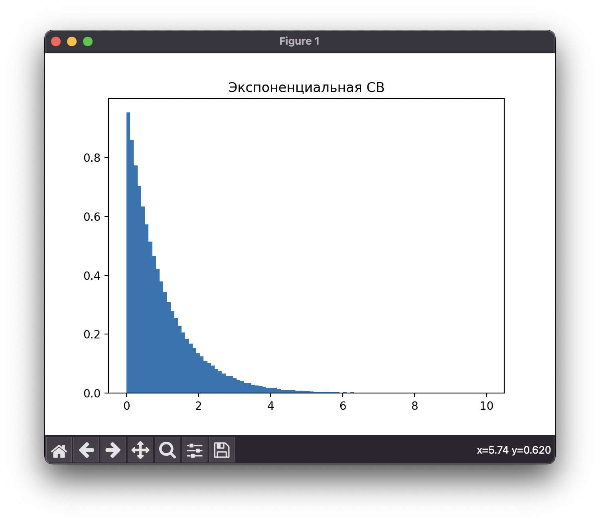
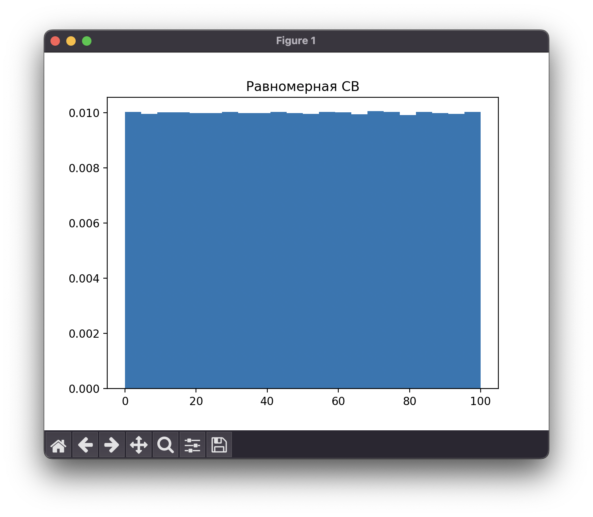
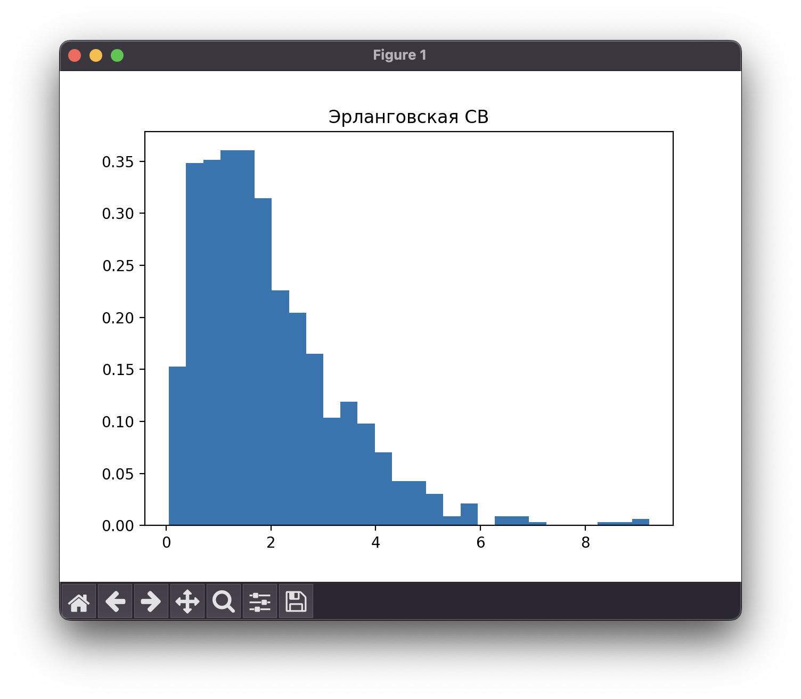
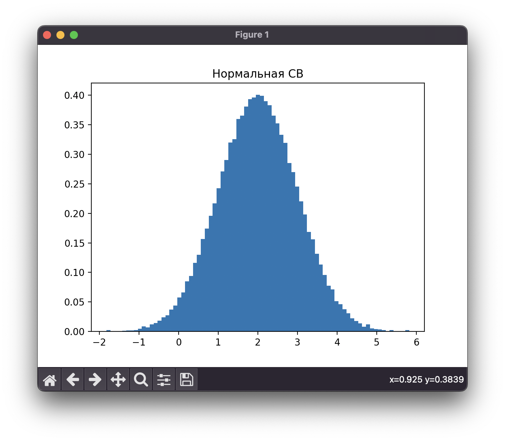
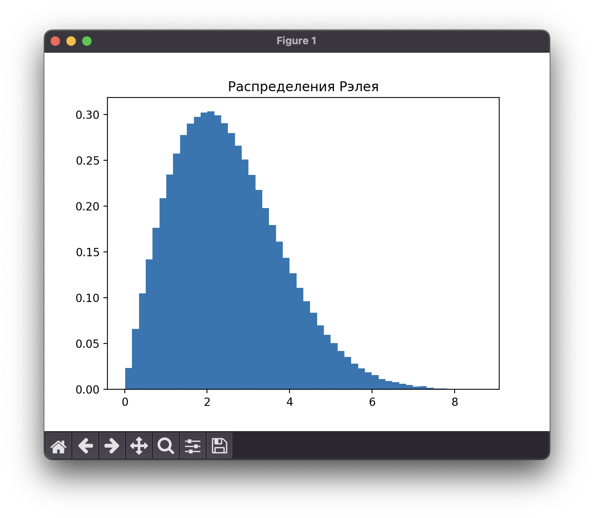

<!--markdownlint-disable ol-prefix, no-inline-html-->

# Постановка задачи

**Цель работы:** выполнить программную реализацию генератора непрерывной случайной величины с заданным законом распределения.

## Порядок выполнения работы

1. Построить на основе БСВ пять видов распределений:
   - экспоненциальное по формуле (3.5)
   - равномерное по формуле (3.7)
   - Эрланга порядка K по формуле (3.11)
   - нормальное по формуле (3.14)
   - заданное вариантом (табл. 3.1)
2. Для всех генераторов непрерывной СВ построить гистограмму
распределения вероятностей СВ.
3. Оценить M и D для всех видов распределений непрерывной СВ по формулам (3.3), (3.8), (3.10), (3.13). Сравнить полученные значения M и D с эмпирическими.

**Вариант 5:** Распределение Рэлея

## Содержание отчета

1. Цель, задание и последовательность выполнения работы.
2. Гистограммы распределений непрерывной СВ.
3. Результаты сравнений M и D, полученных эмпирическим путем с
соответствующими теоретическими значениями для распределений
непрерывной СВ.
4. Выводы о результатах моделирования БСВ.

# Выполнение работы

## Математическая модель

$$
x=F^{-1}(z)
$$

Экспоненциальная СВ:

$$
F(x)=1-e^{-\lambda x}
$$

$$
M(x) = \frac{1}{\lambda}
$$

$$
D(x) = \frac{1}{\lambda^2}
$$

Равномерная СВ:

$$
F(x)=\frac{x-A}{B-A}
$$

$$
M(x)=A+\frac{B-A}{2}
$$

$$
D(x)=\frac{(B-A)^2}{12}
$$

Эрланговская СВ:

$$
x=-\frac{1}{\lambda}\ln(z_1 ... z_k)
$$

$$
M(x) = k / \lambda
$$

$$
D(x) = k / \lambda^2
$$

Нормальная СВ:

$$
x1 = \sqrt{-2\ln z_1}sin(2\pi z_2), \\
x2 = \sqrt{-2\ln z_1}cos(2\pi z_2)
$$

$$
M(x)=m
$$

$$
D(x)=\sigma^2
$$

## Результаты моделирования

Для моделирования были реализованы скрипты на ЯП `Python`, которые представлены
в Приложении и [на GitHub](https://github.com/vladcto/suai-labs/tree/main/6_semester/МодСис).

Была реализована логика для построения графиков СВ. Результат представлен
на рисунках \ref{fig:Гистограмма экспоненциальной СВ} - \ref{fig:Гистограмма распределения Рэлея}.

Также были рассчитаны теоретические и фактические значения математического ожидания $M$ и дисперсии $D$.

Table: значения $M$ и $D$

| Распределение    | Факт МО | Факт Дисперсия | Эмп МО | Эмп Дисперсия |
| ---------------- | ------- | -------------- | ------ | ------------- |
| Экспоненциальное | 1.0     | 1.0            | 1.0    | 1.0           |
| Равномерное      | 50.0    | 833.2          | 50.0   | 833.3         |
| Эрланга          | 2.0     | 4.0            | 2.0    | 1.0           |
| Нормальное       | 2.0     | 1.0            | 2.0    | 1.0           |
| Рэлея            | 2.5     | 1.7            | 2.5    | 1.7           |

## Анализ

В ходе статистического анализа базовой случайной непрерывной величины были получены эмпирические значения математического ожидания и дисперсии для каждого из распределений. Для проверки гипотезы о соответствии эмпирических данных теоретическим моделям были проведены соответствующие расчеты.

В результате сравнения эмпирических и теоретических значений математического ожидания и дисперсии было установлено, что они соответствуют друг другу с высокой степенью точности. Кроме того, были построены гистограммы для каждого из распределений, которые демонстрируют высокую степень совпадения с эталонными распределениями.

Полученные результаты свидетельствуют о корректности моделирования базовой случайной непрерывной величины и могут быть использованы для дальнейшего анализа и исследований.

Таким образом, на основе проведенного статистического анализа можно сделать вывод, что эмпирические данные соответствуют теоретическим моделям и что моделирование базовой случайной непрерывной величины было проведено корректно с высокой степенью точности.

# Вывод

В ходе выполнения данной работы было реализовано программное моделирование генератора непрерывной случайной величины с заданным законом распределения. Были построены гистограммы распределений вероятностей СВ для экспоненциального, равномерного, эрланговского, нормального и распределения Рэлея. Также были рассчитаны теоретические и фактические значения математического ожидания и дисперсии для каждого из распределений.

В результате проведенного анализа было установлено, что теоретические и фактические значения математического ожидания и дисперсии для каждого из распределений совпадают с высокой степенью точности. Это свидетельствует о корректности реализации генератора непрерывной случайной величины.

В ходе выполнения данной работы были получены навыки программной реализации генератора непрерывной случайной величины, построения гистограмм распределений вероятностей СВ, расчета математического ожидания и дисперсии для различных распределений. Данные навыки могут быть использованы в дальнейшем для решения задач, связанных с моделированием случайных процессов.

Таким образом, цель работы была достигнута, были получены навыки программной реализации генератора непрерывной случайной величины и проведения статистического анализа результатов моделирования.

# ПРИЛОЖЕНИЕ <suaidoc-center>

\lstinputlisting{solve.py}

\lstinputlisting{generators.py}

\lstinputlisting{fish_generator.py}
