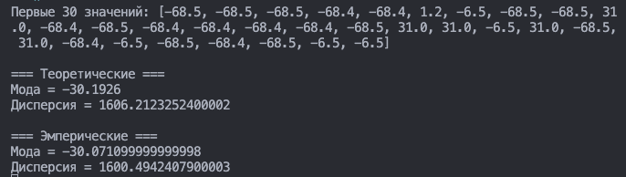
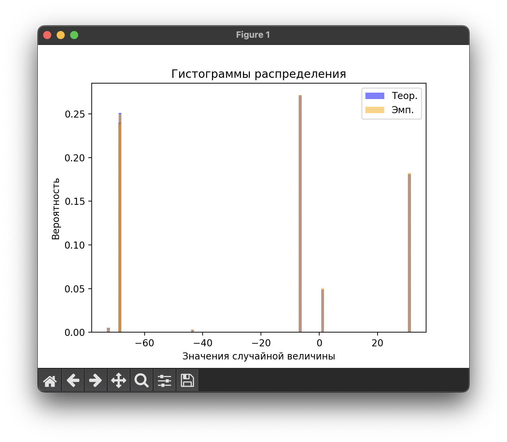

<!--markdownlint-disable ol-prefix, no-inline-html-->

# Постановка задачи

**Цель работы:** выполнить программную реализацию генератора
дискретной случайной величины.

## Порядок выполнения работы

1. Выполнить программную реализацию датчика заданной дискретной
СВ и сгенерировать выборку из 500 значений дискретной СВ xi.
2. Найти эмпирические оценки M и D и сравнить их с теоретическими
значениями, найденными по (1) и (2).
3. Построить в одном графическом окне две гистограммы: первая −
распределение эмпирических вероятностей значений случайной величины x и
вторая − распределение теоретических вероятностей СВ.
4. Дать сравнительную оценку гистограммам распределения
эмпирических и теоретических вероятностей случайной величины x.

Table: Вариант задания

| Параметры |   1   |   2   |   3   |   4   |   5   |   6   |  7   |
| :-------: | :---: | :---: | :---: | :---: | :---: | :---: | :--: |
|    $x_i$    | -72.4 | -68.5 | -68.4 | -43.5 | -6.5  |  1.2  | 31.0 |
|    $p_i$    | 0.005 | 0.240 | 0.251 | 0.003 | 0.271 | 0.049 | 0.181 |

## Содержание отчета

1. Листинг программной реализации датчика заданной дискретной СВ.
2. Первые 30 значений xi.
3. Результаты эмпирических и теоретических значений M и D.
4. Гистограммы распределения эмпирических и теоретических
вероятностей дискретной СВ.
5. Выводы по результатам сравнительной оценки распределений
эмпирических и теоретических вероятностей дискретной СВ x.

# Выполнение работы

## Теоретические сведения

$$
M(x)=\sum_{j=1}^{K}p_j x_j
$$

$$
D(x)=\sum_{j=1}^{K}p_j x_j^2 - M^2(x)
$$

## Результаты моделирования

Для моделирования были реализованы скрипты на ЯП `Python`, которые представлены
в Приложении и [на GitHub](https://github.com/vladcto/suai-labs/tree/main/6_semester/МодСис/4).

Результат расчета характеристик представлен на рисунке \ref{fig:Расчет характеристик}.

Была реализована логика для построения графиков, а также подсчета требуемых
характеристик.

Для построения графиков было взято $500$ точек. Для удобства анализа было решено
отобразить распределение случайно величины в формате полупрозрачных бар-чартов.
Результат изображен на рисунке \ref{fig:Гистограммы распределения}.

Также были рассчитаны теоретические и фактические значения математического ожидания $M$ и дисперсии $D$. Результаты представлены ниже.

Table: значения $M$ и $D$

|               | $M$        | $D$      |
| ------------- | ---------- | -------- |
| Теоретическая | $-30.1926$ | $1606.2$ |
| Эмперическая  | $-30.0710$ | $1600.5$ |

## Анализ

В результате сравнения эмпирических и теоретических значений математического ожидания и дисперсии было установлено, что они соответствуют друг другу с высокой степенью точности. Кроме того, были построены гистограммы, которые демонстрируют высокую степень совпадения с эталонными значением.

Также обратим внимание на то, что всего было взято 500 точек, и даже такое маленькое расхождение
в полученных значениях будет нивелировано с увеличением числа точек.

# Вывод

В ходе выполнения данной работы было реализовано программное моделирование ДСВ с использованием `FishGenerator`.

Были выполнены необходимые расчеты и построены гистограммы распределения эмпирических и теоретических вероятностей дискретной СВ. В ходе сравнительной оценки распределений эмпирических и теоретических вероятностей дискретной СВ x было установлено, что они соответствуют друг другу с высокой степенью точности.

В результате выполнения работы были получены навыки программной реализации генератора дискретной случайной величины, а также навыки анализа и сравнения эмпирических и теоретических значений математического ожидания и дисперсии. Таким образом, цель работы была достигнута.

# ПРИЛОЖЕНИЕ <suaidoc-center>

\lstinputlisting{solve.py}

\lstinputlisting{fish_generator.py}
