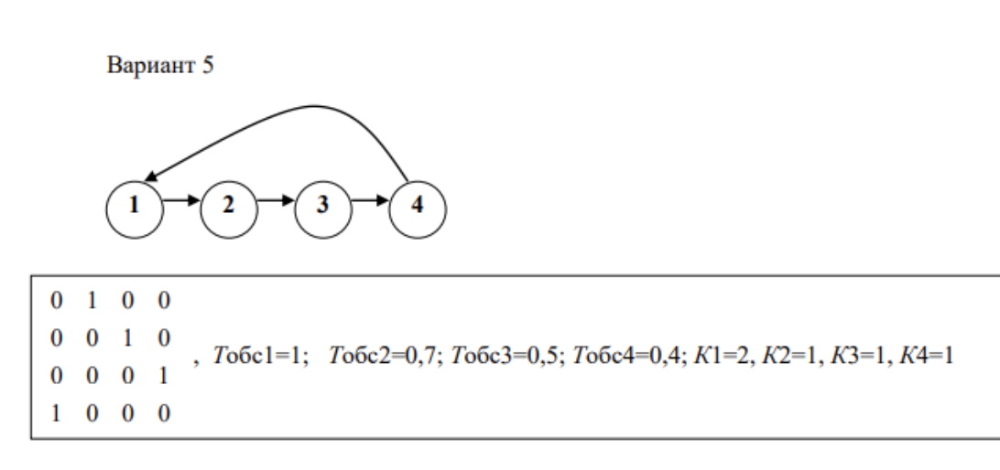
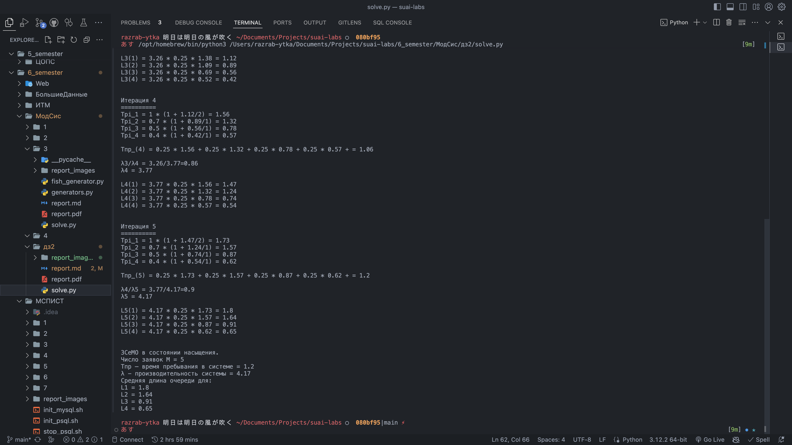

# Постановка задачи

## Задание

Найти характеристики: $Тпр$ – время пребывания в системе,  
$\lambda$ - производительность системы, $М$ – число заявок в системе.

# Выполнение работы

Для расчета характеристик было решено написать скрипт на ЯП `Python`. При выполнении
не были использованы подключаемые математические библиотеки.

Листинг доступен на [GitHub](https://github.com/vladcto/suai-labs/blob/main/6_semester/МодСис/дз2/solve.py) и в Приложении.

## Результаты моделирования

### Первая итерация: $j=1$

Simplify

$$\overline{L_1}=0,\overline{L_2}=0,\overline{L_3}=0,\overline{L_4}=0$$

Simplify

$$
\overline{T}_{пр1}=1\cdot(1+\frac{0}{2})=1c,\\
\overline{T}_{пр2}=0.7c,\\
\overline{T}_{пр3}=0.5c,\\
\overline{T}_{пр4}=0.4c
$$

Simplify

$$
\begin{cases}
a_1 + a_2 + a_3 + a_4 = 1 \\
a_1 = a_4 \\
a_2 = a_1 \\
a_3 = a_2 \\
a_4 = a_3
\end{cases}
\implies
\begin{cases}
a_1 = 1/4 \\
a_1 = 0.25 \\
a_2 = 0.25 \\
a_3 = 0.25 \\
a_4 = 0.25
\end{cases}
$$

Simplify

$$\bar{T}_{пр}(1) = 0.25\cdot1.0 + 0.25\cdot0.7 + 0.25\cdot0.5 + 0.25\cdot0.4 = 0.65$$

Simplify

$$
\lambda(1)=1.54\,заявок/c\\
\lambda(0)/\lambda(1)=\frac{1}{1.54}=0.65,\; 0.65 < 0.9
$$

\hfill \break

Simplify

$$
\bar{L}_1(1)=1.54\cdot0.25\cdot1.0 = 0.39,\\
\bar{L}_2(1)=1.54\cdot0.25\cdot0.7 = 0.27,\\
\bar{L}_3(1)=1.54\cdot0.25\cdot0.5 = 0.19,\\
\bar{L}_4(1)=1.54\cdot0.25\cdot0.4 = 0.15,\\
$$

### Вторая итерация: $j=2$

Simplify

$$
\overline{T}_{пр1}=1\cdot(1 + \frac{0.39}{2}) = 1.2c,\\
\overline{T}_{пр2}=0.7\cdot(1 + \frac{0.27}{1}) = 0.89c,\\
\overline{T}_{пр3}=0.5\cdot(1 + \frac{0.19}{1}) = 0.59c,\\
\overline{T}_{пр4}=0.4\cdot(1 + \frac{0.15}{1}) = 0.46c
$$

Simplify

$$
\bar{T}_{пр}(2) = 0.25\cdot1.2 + 0.25\cdot0.89 + 0.25\cdot0.59 + 0.25\cdot0.46 = 0.79
$$

Simplify

$$
\lambda{2} = 2.53,заявок/c\\
\lambda{1}/\lambda{2} = \frac{1.54}{2.53}=0.61,\; 0.61 < 0.9
$$

\hfill \break

Simplify

$$
\bar{L}_1(2)=2.53\cdot0.25\cdot1.2 = 0.76,\\
\bar{L}_2(2)=2.53\cdot0.25\cdot0.89 = 0.56,\\
\bar{L}_3(2)=2.53\cdot0.25\cdot0.59 = 0.37,\\
\bar{L}_4(2)=2.53\cdot0.25\cdot0.46 = 0.29,\\
$$

### Третья итерация: $j=3$

Simplify

$$
\overline{T}_{пр1}=1\cdot(1 + \frac{0.76}{2}) = 1.38c,\\
\overline{T}_{пр2}=0.7\cdot(1 + \frac{0.56}{1}) = 1.09c,\\
\overline{T}_{пр3}=0.5\cdot(1 + \frac{0.37}{1}) = 0.69c,\\
\overline{T}_{пр4}=0.4\cdot(1 + \frac{0.29}{1}) = 0.52c
$$

Simplify

$$
\bar{T}_{пр}(3)= 0.25\cdot1.38 + 0.25\cdot1.09 + 0.25\cdot0.69 + 0.25\cdot0.52 = 0.92
$$

Simplify

$$
\lambda{3} = 3.26\\
\lambda{2}/\lambda{3} = \frac{2.53}{3.26}=0.78,\; 0.79 < 0.9
$$

\hfill \break

Simplify

$$
\bar{L}_1(3)=3.26\cdot0.25\cdot1.38 = 1.12,\\
\bar{L}_2(3)=3.26\cdot0.25\cdot1.09 = 0.89,\\
\bar{L}_3(3)=3.26\cdot0.25\cdot0.69 = 0.56,\\
\bar{L}_4(3)=3.26\cdot0.25\cdot0.52 = 0.42,\\
$$

### Четвертая итерация: $j=4$

Simplify

$$
\overline{T}_{пр1}=1\cdot(1 + \frac{1.12}{2}) = 1.56c,\\
\overline{T}_{пр2}=0.7\cdot(1 + \frac{0.89}{1}) = 1.32c,\\
\overline{T}_{пр3}=0.5\cdot(1 + \frac{0.56}{1}) = 0.78c,\\
\overline{T}_{пр4}=0.4\cdot(1 + \frac{0.42}{1}) = 0.57c
$$

Simplify

$$
\bar{T}_{пр}(4)= 0.25\cdot1.56 + 0.25\cdot1.32 + 0.25\cdot0.78 + 0.25\cdot0.57 = 1.06
$$

Simplify

$$
\lambda{4} = 3.77\,заявок/c\\
\lambda{3}/\lambda{4} = \frac{3.26}{3.77}=0.86,\; 0.86 < 0.9
$$

\hfill \break

Simplify

$$
\bar{L}_1(4)=3.77\cdot0.25\cdot1.56 = 1.47,\\
\bar{L}_2(4)=3.77\cdot0.25\cdot1.32 = 1.24,\\
\bar{L}_3(4)=3.77\cdot0.25\cdot0.78 = 0.74,\\
\bar{L}_4(4)=3.77\cdot0.25\cdot0.57 = 0.54,\\
$$

### Пятая итерация: $j=5$

Simplify

$$
\overline{T}_{пр1}=1\cdot(1 + \frac{1.47}{2}) = 1.73c,\\
\overline{T}_{пр2}=0.7\cdot(1 + \frac{1.24}{1}) = 1.57c,\\
\overline{T}_{пр3}=0.5\cdot(1 + \frac{0.74}{1}) = 0.87c,\\
\overline{T}_{пр4}=0.4\cdot(1 + \frac{0.54}{1}) = 0.62c
$$

Simplify

$$
\bar{T}_{пр}(5) =  0.25\cdot1.73 + 0.25\cdot1.57 + 0.25\cdot0.87 + 0.25\cdot0.62 = 1.2
$$

Simplify

$$
\lambda{5} = 4.17\,заявок/c\\
\lambda{4}/\lambda{5} = \frac{3.77}{4.17}=0.91,\; произошло\;насыщение
$$

\hfill \break

Simplify

$$
\bar{L}_1(5)=4.17\cdot0.25\cdot1.73 = 1.8,\\
\bar{L}_2(5)=4.17\cdot0.25\cdot1.57 = 1.64,\\
\bar{L}_3(5)=4.17\cdot0.25\cdot0.87 = 0.91,\\
\bar{L}_4(5)=4.17\cdot0.25\cdot0.62 = 0.65,
$$

## Результаты

Число заявок $M = 5$

$Т_пр$ время пребывание в системе = $1.2$

$\lambda$ - производительность системы = $4.17$

# ПРИЛОЖЕНИЕ <suaidoc-center>

\lstinputlisting{solve.py}