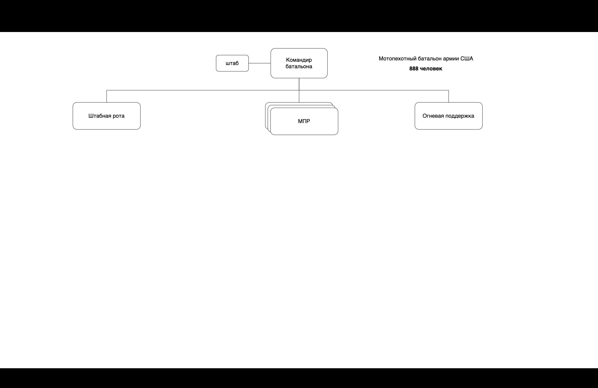
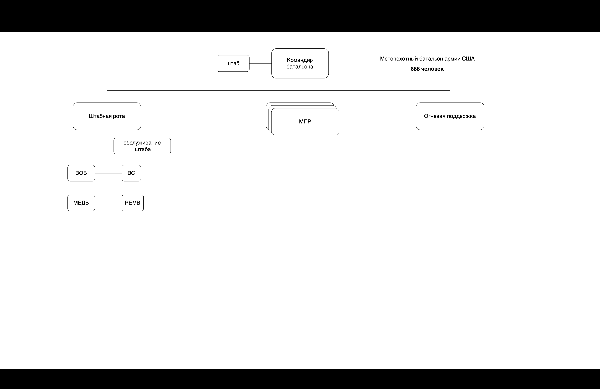
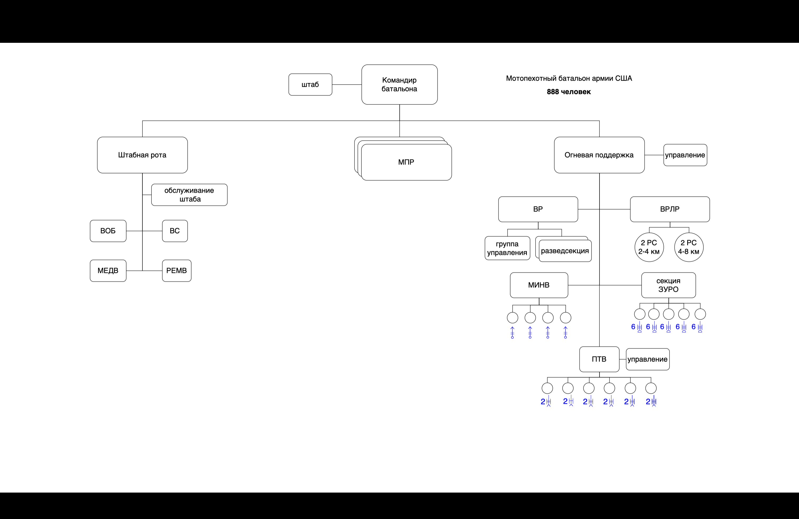
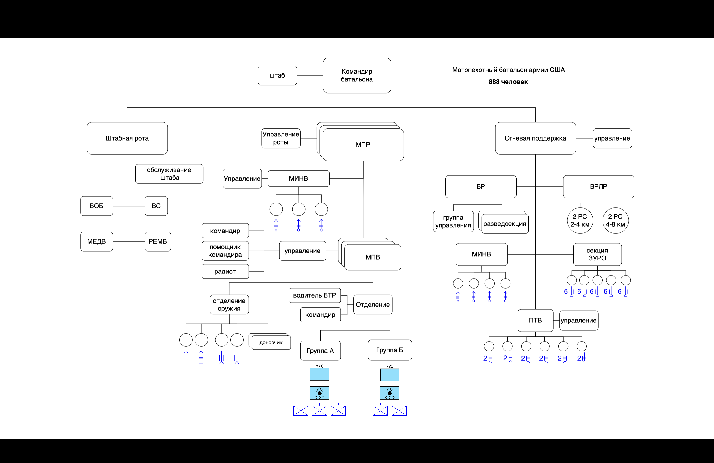

# Введение

**Цель работы:** изучить на конкретном примере построение древовидных структуры, приобрести навыки практического использования шаблонов Visio при построении простых и наглядных древовидных структур.

**Вариант 2:** В середине 70-х гг. XX в. мотопехотный батальон армии США насчитывал 888 чел. и имел следующую организацию. Во главе стоял командир батальона. Ему подчинялся штаб и 5 рот: штабная (177 чел.), огневой поддержки (144 чел.) и 3 мотопехотные (по 189 чел. в каждой).

Штабная рота состояла из 5 взводов: взвода связи, ремонтного взвода, взвода обеспечения, медицинского взвода и секции обслуживания штаба батальона.

Рота огневой поддержки состояла из управления роты, радиолокационной секции, секции зенитных ракет (ЗУРО) «Ред-Ай», взвода разведки, минометного взвода и противотанкового взвода. Радиолокационная секция имела в своем составе 4 радиолокационные станции: две — малого радиуса действия (2-4 км), две — среднего (4-8 км). Секция ЗУРО имела 5 огневых расчетов по 6 установок «Ред-Ай» в каждом. Взвод разведки делился на группу управления (6 чел.) и две разведсекции (по 12 чел.). Минометный взвод состоял из группы управления и 4 отделений (в каждом — по одному миномету калибра 106,7 мм). Противотанковый взвод состоял из группы управления и 6 отделений, каждое — из двух расчетов противотанковых управляемых ракет (ПТУРС) «Тоу».

Мотопехотная рота состояла из управления роты, минометного взвода и 3 мотопехотных взводов. Минометный взвод состоял из группы управления и трех минометных отделений, каждое из которых имело миномет калибра 81 мм. Мотопехотный взвод (47 чел.) состоял из группы управления (командир взвода, помощник командира и радист), отделения оружия (11 чел.) и 3 мотопехотных отделений (по 11 чел. в каждом). Отделение оружия состояло из командира отделения, двух пулеметных расчетов по 2 чел. в каждом, двух расчетов противотанковых ружей по 2 чел. в каждом и двух подносчиков. Мотопехотное отделение состояло из командира отделения, водителя бронетранспортера и двух групп: группы «А» (командир группы, гранатометчик и 2 стрелка) и группы «Б» (командир группы, гранатометчик и 3 стрелка).

# Выполнение работы

Для выполнения работы я решил выбрать заместо MS `PowerPoint` - `Keynote`, а заместо `MS Visio` - `приложение draw.io`. Выбор был обусловлен бесплатностью, нативностью и удобством на платформе `macOS`.

Файлы доступны в [репозитории Github](https://github.com/vladcto/suai-labs/6-semester).

В середине 70-х гг. XX в. мотопехотный батальон армии США насчитывал 888 чел. и имел следующую организацию. Во главе стоял командир батальона. Ему подчинялся штаб и 5 рот: штабная (177 чел.), огневой поддержки (144 чел.) и 3 мотопехотные (по 189 чел. в каждой).

Слайд для текста выше изображен на рисунке 2.1.

Штабная рота состояла из 5 взводов: взвода связи, ремонтного взвода, взвода обеспечения, медицинского взвода и секции обслуживания штаба батальона.

Слайд для текста выше изображен на рисунке 2.2.

Рота огневой поддержки состояла из управления роты, радиолокационной секции, секции зенитных ракет (ЗУРО) «Ред-Ай», взвода разведки, минометного взвода и противотанкового взвода. Радиолокационная секция имела в своем составе 4 радиолокационные станции: две — малого радиуса действия (2-4 км), две — среднего (4-8 км). Секция ЗУРО имела 5 огневых расчетов по 6 установок «Ред-Ай» в каждом. Взвод разведки делился на группу управления (6 чел.) и две разведсекции (по 12 чел.). Минометный взвод состоял из группы управления и 4 отделений (в каждом — по одному миномету калибра 106,7 мм). Противотанковый взвод состоял из группы управления и 6 отделений, каждое — из двух расчетов противотанковых управляемых ракет (ПТУРС) «Тоу».

Слайд для текста выше изображен на рисунке 2.3.

Мотопехотная рота состояла из управления роты, минометного взвода и 3 мотопехотных взводов. Минометный взвод состоял из группы управления и трех минометных отделений, каждое из которых имело миномет калибра 81 мм. Мотопехотный взвод (47 чел.) состоял из группы управления (командир взвода, помощник командира и радист), отделения оружия (11 чел.) и 3 мотопехотных отделений (по 11 чел. в каждом). Отделение оружия состояло из командира отделения, двух пулеметных расчетов по 2 чел. в каждом, двух расчетов противотанковых ружей по 2 чел. в каждом и двух подносчиков. Мотопехотное отделение состояло из командира отделения, водителя бронетранспортера и двух групп: группы «А» (командир группы, гранатометчик и 2 стрелка) и группы «Б» (командир группы, гранатометчик и 3 стрелка).

Слайд для текста выше изображен на рисунке 2.4.

# Вывод

В результате выполнения работы были получены практические навыки работы с
приложениями для создания структур и презентаций с учетом временных интервалов.