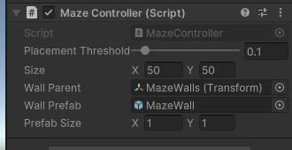
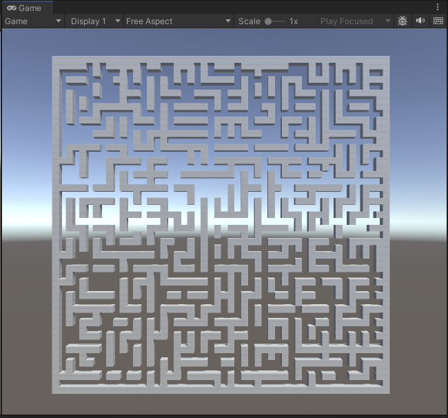
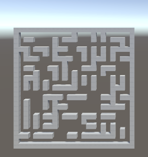

# Введение

**Цель работы:** получить навыки написания сценариев на С#
и реализации алгоритмов процедурной генерации лабиринтов.

**Задание:** 

1. Задать свой размер лабиринта.
2. Выполнить классификацию полученного алгоритма по измерению, гиперразмерности,
топологии, тесселяции, маршрутизации, текстуре и фокусу.

# Выполнение работы

Был написан сценарий на языке C#, который позволяет задать размер лабиринта и генерировать его с использованием процедурного алгоритма. В процессе работы был использован класс MazeController, который отвечает за отображение лабиринта, 
и класс MazeGenerator, который содержит логику генерации лабиринта.

В приложении представлен код сценария, написанного в ходе выполнения лабораторной работы.
Также исходный код доступен на [GitHub](https://github.com/vladcto/suai-labs/tree/main/6_semester/Мультимедия/3).

Результат представлен на рисунках ниже.

## Классификация лабиринта

Разработанный лабиринт обладает следующей классификацией:

1) Размерность – двумерный;
2) Гиперразмерность – негиперлабиринт;
3) Топология – обычный;
4) Тесселяция – ортогональный;
5) Маршрутизация – разряженный;
6) Текстура – однородный;
7) Приоритет – добавление стен.

# Вывод

В ходе выполнения лабораторной работы был разработан лабиринт, соответствующий следующей классификации: 
двумерный, не-гипермаз, обычный, ортогональный и переплетенный, разреженный, однородный с приоритетом добавления стен. 
Также были получены навыки написания сценариев на C# и реализации алгоритмов процедурной генерации лабиринтов.

# ПРИЛОЖЕНИЕ <suaidoc-center>

\lstinputlisting{mazes/Assets/Scripts/MazeGenerator.cs}

\lstinputlisting{mazes/Assets/Scripts/MazeController.cs}
