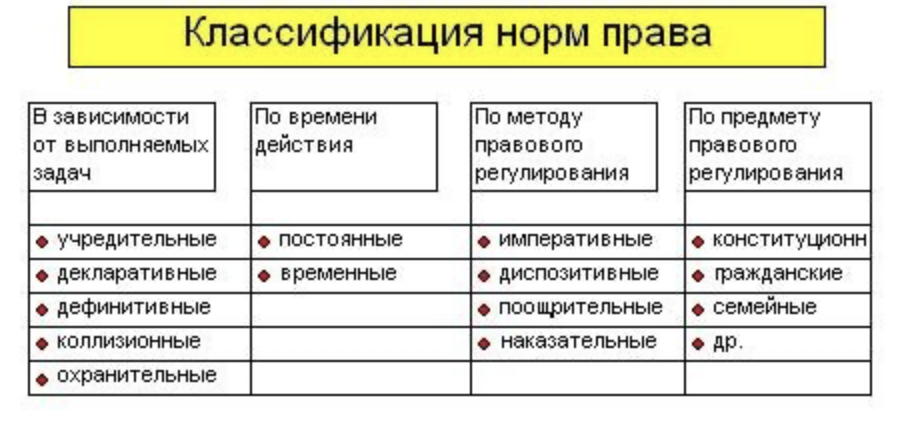
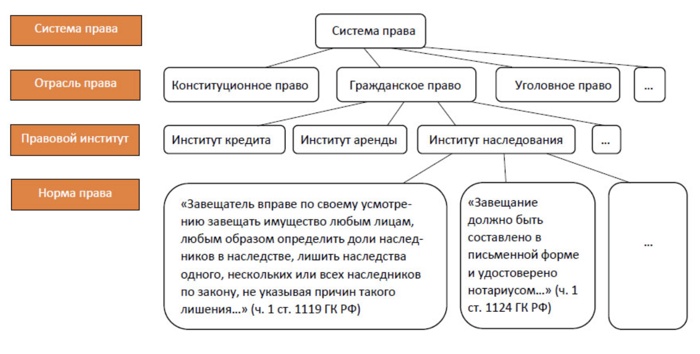

# Норма права

Норма права – это общеобязательное, установленное или санкционированное и охраняемое государством правило поведения, выражающее обусловленную материальными условиями жизни общества волю и интересы народа, активно воздействующее на общественные отношения в целях их упорядочения.
Любое государственно-организованное общество не может обойтись без норм права \cite{ref-alexeev2016norma}.

## Признаки нормы права

- норма права указывает лишь на те характерные черты поведения, которые являются существенными, то есть рассматривают поведение как вид общественного отношения. Эти признаки, включенные в текст нормы, становятся правилами поведения, обязательными к реализации.
Например, в процессе купли-продажи существенным является не то, сколько раз «приценивался» покупатель, выбирая ту или иную вещь, какое время он на это затратил. Все это – сфера житейского обыкновения. Для права важно установить признаки: когда можно признать договор купли-продажи заключенным, когда право  собственности на вещь переходит от продавца к покупателю.
- норма права является повелительным предписанием независимо от того, каков его характер: запрет, обязывание или дозволение. Предписание в любом случае находится под охраной государства; так как оно им установлено, то предусмотрены и меры принуждения в случаях его нарушения.
- норма права представляет собой определенный метод воздействия на регулируемые отношения. В этот метод включаются: обстоятельства, при которых применяется норма; круг участников, регулируемых этой нормой отношений; взаимные права и обязанности; санкции за невыполнение обязанностей.
- норма права – обязательное правило поведения. Она создается не для отдельного индивида, а для всех входящих в состав данной категории людей (общества в целом).
- норма права содержит вполне конкретное правило поведения. Например, ст. 16 ГК РФ определяет, что убытки, причиненные гражданину или юридическому лицу в результате незаконных действий (бездействия) государственных органов, органов местного самоуправления или должностных лиц этих органов, в том числе издания, не соответствующего закону или иному правовому акту, акта государственного органа или органа местного самоуправления, подлежат возмещению Российской Федерацией, соответствующими субъектами федерации или муниципальным образованием. Здесь типичный пример нормы права как формально определенного правила, означающего полноту и точность указания на признаки правила поведения. Каждый индивидуальный случай причинения убытков гражданину или юридическому лицу подпадает под действие этой нормы, то есть она регулирует все повторяющиеся индивидуальные отношения данного вида.
- содержание нормы в главном, основном определяется содержанием регулируемого отношения, то есть оно формируется под влиянием социального опыта регулирования, уровня общей и правовой культуры, нравственных и политических установок, ориентаций государства и других факторов

# Соотношение понятий норм морали и права

Право и мораль являются двумя фундаментальными системами норм, регулирующими поведение людей в обществе. Право представляет собой систему общеобязательных, формально определенных юридических норм, выражающих государственную волю и направленных на урегулирование общественных отношений. Мораль, в свою очередь, является системой исторически определенных норм, взглядов, принципов и оценок, регулирующих поведение людей с позиций добра и зла, справедливого и несправедливого, честного и бесчестного и других нравственных критериев.

Соотношение между правом и моралью весьма непростое и включает в себя анализ единства, взаимодействия, различий и противоречий между ними.

## Связь права и морали

Единство права и морали проявляется в следующем:

1. Обе системы являются универсальными регуляторами поведения людей и проникают во все области общественной жизни.
2. Право и мораль имеют сложную структуру и содержат одинаковые и взаимодействующие между собой элементы.
3. Они действуют в едином "поле" социальных отношений и служат общей цели - совершенствованию и упорядочению общественной жизни, регулированию поведения людей и поддержанию порядка.
4. Право и мораль являются социальными регуляторами, связанными с проблемами свободной воли индивида и его ответственности за свои действия.

Взаимодействие права и морали выражается в следующем:

1. Они помогают друг другу в упорядочении общественных отношений и формировании юридической и нравственной культуры.
2. Правовые и моральные требования во многом совпадают и стремятся к соблюдению законов и поддержанию высоких гражданских качеств.
3. Правовые нормы являются проводником морали и фиксируют и защищают моральные ценности, а мораль выступает в качестве ценностного критерия права.

# Система права

Система права представляет собой совокупность норм права данной страны, которые объединяются в институты, подотрасли и отрасли права. Институт права является совокупностью взаимосвязанных юридических норм, регулирующих определенный вид общественных отношений. Подотрасль права объединяет родственные институты какой-либо отрасли права, а отрасль права представляет собой совокупность взаимосвязанных юридических норм, регулирующих определенную сферу однородных общественных отношений \cite{ref-kozhevnikov2002pravo}.

Система права подразделяется на материальные и процессуальные отрасли, а также на частное и публичное право. Международное право выделяется в особую наднациональную отрасль права, регулирующую отношения между государствами \cite{ref-ilin2014sistema}.

Нормы права закрепляются в официальных письменных документах - нормативных (или правовых) актах, которые издаются органами государственной власти в особом процедурном порядке. Основным среди источников права является нормативный правовой акт.

В России источниками права являются Конституция, федеральные конституционные законы, федеральные законы, указы и распоряжения президента РФ, постановления и распоряжения Правительства РФ, ведомственные акты федеральных органов исполнительной власти, конституции (уставы) субъектов РФ, законы субъектов РФ, акты органов исполнительной власти субъектов РФ, акты органов местного самоуправления, а также международные договоры и соглашения, ратифицированные в установленном порядке.

# Заключение

Норма права является фундаментальным элементом любого государственно-организованного общества, выражающим волю и интересы народа и активно воздействующим на общественные отношения. Нормы права обладают рядом признаков, таких как общая обязательность, повелительный характер, конкретность и определенный метод воздействия на регулируемые отношения.

Право и мораль тесно связаны и взаимодействуют друг с другом, выступая в качестве универсальных регуляторов поведения людей и служа общей цели - совершенствованию и упорядочению общественной жизни.

Система права представляет собой сложную иерархическую структуру, подразделяющуюся на отрасли и институты права, и базирующуюся на нормативных правовых актах, издаваемых органами государственной власти. Источниками права в России являются Конституция, федеральные законы, указы и распоряжения президента, постановления и распоряжения Правительства, ведомственные акты, акты субъектов Федерации и муниципальные правовые акты, а также международные договоры и соглашения.

# СПИСОК ИСПОЛЬЗОВАННЫХ ИСТОЧНИКОВ <suaidoc-center>

