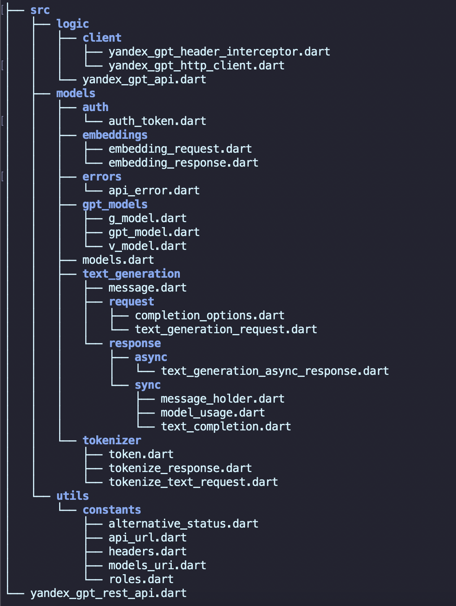
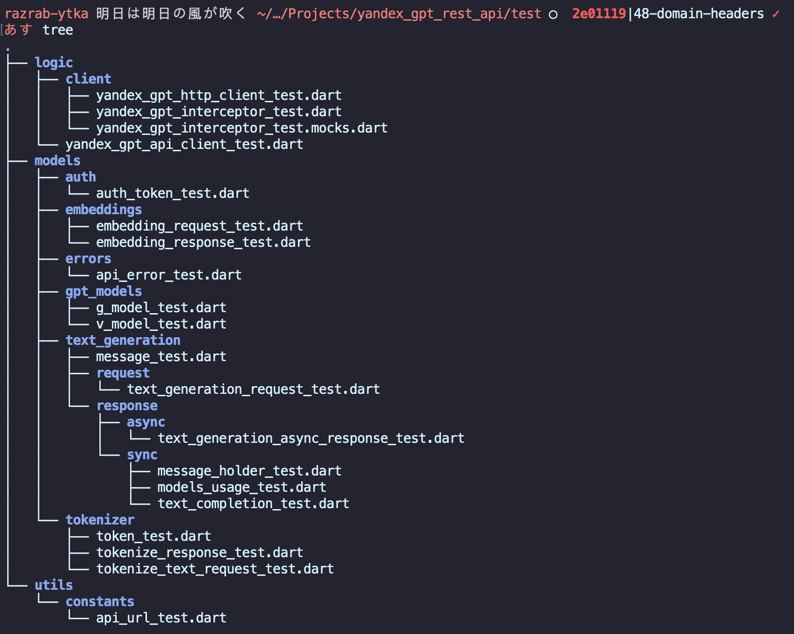

# Введение

В рамках производственной практики был осуществлен проект под названием "Реализация Dart пакета для работы с Yandex GPT API". Основной целью данного проекта являлось создание специализированного программного средства, упрощающего процесс интеграции и взаимодействия с Yandex GPT API средствами языка программирования Dart.

Современные системы искусственного интеллекта, такие как Yandex GPT, предоставляют широкие возможности для решения разнообразных задач, начиная от генерации естественного текста и заканчивая различными видами анализа данных. Для максимально эффективного использования этих возможностей необходимы инструменты, позволяющие разработчикам легко подключаться к API и использовать его функционал в своих проектах.

Процесс реализации Dart пакета включал в себя несколько ключевых этапов: исследование документации Yandex GPT API, разработку и тестирование различных функциональных модулей, а также написание сопроводительной документации для пользователей пакета. Подробное внимание уделялось обеспечению стабильности работы пакета, его производительности и удобству использования.

В ходе выполнения проекта задействовались глубокие знания в области разработки программного обеспечения, тестирования и документирования кода. Этот проект не только продемонстрировал возможность эффективной интеграции с Yandex GPT API, но и предоставил полезный инструмент для Dart-разработчиков, способных значительно сократить время и усилия на реализацию аналогичных задач.

# Цель работы

Целью работы является разработка Dart пакета для упрощения взаимодействия с Yandex GPT API, обеспечивая удобный и эффективный доступ к его функционалу для создания и интеграции решений, основанных на искусственном интеллекте, в приложениях на языке Dart.

# Постановка задачи

Требуется следующий функционал:

1. Интеграция с Yandex GPT API для аутентификации, генерации текста, асинхронных операций, эмбеддингов и токенизации.
2. Возможность создания клиента API с различными настройками HTTP, включая изменение токена.
3. Корректное добавление аутентификационных заголовков ко всем запросам, поддержка асинхронной обработки.
4. Поддержка отмены запросов с помощью CancelToken.
5. Логирование запросов и ответов, корректная обработка ошибок.
6. Реализация юнит-тестов с высоким покрытием для основных методов.
7. Написание подробной документации и примеров использования.
8. Настройка автоматизированной проверки, сборки и развертывания через CI/CD.
9. Реализация методов для работы с асинхронными операциями.
10. Обеспечение кросс-платформенной совместимости с различными платформами, поддерживаемыми Dart.

# Выполнение задания

## Методические сведения

**API (Application Programming Interface)** - набор правил и инструментов для создания программного обеспечения, который позволяет взаимодействовать между различными программными компонентами.

**RESTful API** - архитектурный стиль для сетевых сервисов, который использует HTTP запросы для операций создания, чтения, обновления и удаления (CRUD).

**Dart** - язык программирования, разработанный компанией Google, который используется для создания веб-приложений, мобильных приложений и серверных приложений.

**Dio** - популярная HTTP-клиент библиотека для Dart, обеспечивающая простое и эффективное создание HTTP-запросов.

Асинхронное программирование - модель программирования, в которой задачи выполняются параллельно с основной программой, не блокируя выполнение других операций. 

**Future** - объект в Dart, представляющий результат асинхронной операции, который будет доступен в будущем [1].

**JSON** - формат обмена данными, основанный на лёгком текстовом формате для представления структурированных данных.

**OAuth (Open Authorization)** - протокол аутентификации, позволяющий предоставлять сторонним приложениям ограниченный доступ к защищённым ресурсам.

**Токен аутентификации** - уникальная строка, используемая для идентификации и авторизации пользователя или приложения при доступе к защищенным ресурсам API.

**Покрытие кода тестами (Code Coverage)** - метрика, показывающая, какую часть кода программы проверено с помощью тестов [2] [3]. 

**CI/CD (Continuous Integration/Continuous Deployment)** - набор практик и инструментов для автоматизации процесса интеграции кода, его проверки и развертывания на рабочем сервере [4].

**HTTP-заголовки** - метаданные, отправляемые совместно с HTTP-запросами и ответами, содержащие информацию об отправителе, получателе и контенте.

**Логирование** - процесс записи событий, происходящих в программе, для последующего анализа и диагностики.

**Обработка ошибок** - процесс управления ошибками, возникающими во время выполнения программы, и предоставления информации об этих ошибках пользователю или системе.

**Кросс-платформенное развитие** - процесс разработки программного обеспечения, которое может работать на нескольких вычислительных платформах.

**Управление зависимостями** - процесс управления библиотеками и пакетами, которые использует проект для обеспечения необходимого функционала.

**Tokenize (Токенизация)** - процесс разбивки текста на отдельные элементы (токены), такие как слова, числа или другие значимые единицы.

**Embedding (Эмбеддинг)** - метод преобразования текста или слов в числовые векторы в многомерном пространстве для машинного обучения и анализа.

**Обработка естественного языка (NLP)** - область искусственного интеллекта, занимающаяся взаимодействием между компьютерами и человеческими языками.

**Асинхронная операция** - операция, результат выполнения которой становится доступен не сразу, а по завершению подсчета или выполненияЗ.

**CancelToken** - объект, используемый для отмены асинхронных операций.

**BaseOptions** - класс, используемый в Dio для настройки базовых опций HTTP-клиента (таймауты, заголовки, базовый URL и т. д.) [5].

**Yandex GPT** - модель искусственного интеллекта для генерации текста, созданная компанией Яндекс, использующая технологию GPT (Generative Pre-trained Transformer).

**HTTP-методы** - базовые методы HTTP-протокола (GET, POST, PUT, DELETE и т.д.), используемые для выполнения CRUD операций над ресурсами сервера.

**Интерсептор (Interceptor)** - компонент, который перехватывает HTTP-запросы и ответы, предоставляя возможность изменения их до того, как данные будут отправлены или получены.

**Деплоймент** (Deployment) - процесс развертывания программного обеспечения на рабочем сервере для доступности конечным пользователям.

## Разработка

Разработка велась в методологии `TDD`.

Структура папок представлена на рисунках \ref{fig:Структура проекта} и \ref{fig:Структура тестов}.

<l>



### Проработка моделей

Был создан абстрактный класс GptModel, представляющий основу для всех моделей GPT, используемый для задания URI каждой модели. Конструкторы класса позволяют задавать URI напрямую через GptModel.raw или формировать его с добавлением версии через GptModel.version, что упрощает управление версиями моделей. Переопределенный метод toString предоставляет удобный способ получения строкового представления URI модели.

Для совместимости с различными моделями генерации текста Яндекс, был создан класс GModel, который наследует GptModel и включает несколько конструкторов для разных типов моделей. Конструкторы GModel формируют специфические URI для моделей Yandex GPT, Yandex GPT Light, обобщающих моделей и моделей с пользовательским обучением, используя заданные константы для формирования URI. Это позволяет гибко и централизованно управлять URI компонентами через изменения в одном месте.

```
abstract class GptModel {
  final String uri;

  const GptModel.raw({required this.uri});

  const GptModel.version({required String uri, String? version})
      : uri = '$uri/${version ?? 'latest'}';

  @override
  String toString() => uri;
}
```

```
import 'package:yandex_gpt_rest_api/src/models/gpt_models/gpt_model.dart';
import 'package:yandex_gpt_rest_api/src/utils/constants/models_uri.dart';

/// Generation models.
///
/// Check [Yandex docs](https://cloud.yandex.ru/en/docs/yandexgpt/concepts/models#yandexgpt-generation) for more info.
class GModel extends GptModel {
  const GModel.raw(String uri) : super.raw(uri: uri);

  const GModel.yandexGpt(String folderId, {super.version})
      : super.version(uri: gptPrefix + folderId + yandexGptPostfix);

  const GModel.yandexGptLight(String folderId, {super.version})
      : super.version(uri: gptPrefix + folderId + yandexGptLitePostfix);

  const GModel.summary(String folderId, {super.version})
      : super.version(uri: gptPrefix + folderId + summaryPostfix);

  const GModel.fineTuned(String modelId) : this.raw(dsPrefix + modelId);
}
```

### Проработка ответов

Класс `TextGenerationRequest` предназначен для создания запросов на генерацию текста с использованием Yandex GPT API. Он содержит три ключевых параметра: model (представлен через GModel для указания URI модели), completionOptions (позволяет настроить параметры генерации, такие как максимальное число токенов и разнообразие текста) и messages (список сообщений, задающих контекст генерации). Конструктор класса позволяет задавать эти параметры, а для удобства сериализации и десериализации предусмотрены методы fromJson и toJson.

Метод toString был переопределён для удобного вывода информации о запросе в виде строки. Имплементация методов fromJson и toJson обеспечивает преобразование объекта в JSON и обратно, что упрощает передачу данных при взаимодействии с API. В результате, класс TextGenerationRequest предоставляет удобный и структурированный способ создания запросов для генерации текста, а также интеграцию с форматами JSON для простоты взаимодействия с Yandex GPT API.

Код всех моделей приведен в Листинге.

### Реализация HTTP клиента

Класс YandexGptHeaderInterceptor отвечает за добавление аутентификационных данных в заголовки запросов к Yandex GPT API. В конструкторе класса принимаются параметры catalog и token, которые инициализируют соответствующие поля. Метод onRequest добавляет заголовки аутентификации и идентификатор каталога к запросам, направленным на хост, указанный в ApiUrl.host. Дополнительно, метод changeToken позволяет обновлять токен аутентификации в течение жизни объекта.

Класс YandexGptHttpClient предоставляет фасад для работы с HTTP-клиентом Dio, упрощая отправку запросов и обработку ответов. Основные методы класса - post и get - выполняют соответствующие HTTP-запросы, принимая URL и данные тела запроса. Оба метода используют приватный метод _fetch для выполнения запросов и обработки ошибок. Метод _fetch пытается выполнить запрос, декодирует JSON-ответ и возвращает его в виде словаря. В случае ошибки, если ответ содержит ApiError, исключение перехватывается и выбрасывается объект ApiError.

Вместе классы YandexGptHeaderInterceptor и YandexGptHttpClient обеспечивают надежную и удобную работу с HTTP-запросами к Yandex GPT API, упрощая интеграцию и обработку аутентификации и ошибок.

```
import 'package:dio/dio.dart';
import 'package:yandex_gpt_rest_api/src/models/auth/auth_token.dart';
import 'package:yandex_gpt_rest_api/src/utils/constants/api_url.dart';
import 'package:yandex_gpt_rest_api/src/utils/constants/headers.dart';

/// Interceptor for adding authentication data to the request.
class YandexGptHeaderInterceptor extends Interceptor {
  final String _catalog;
  AuthToken _token;

  YandexGptHeaderInterceptor({
    required String catalog,
    required AuthToken token,
  })  : _catalog = catalog,
        _token = token;

  @override
  void onRequest(RequestOptions options, RequestInterceptorHandler handler) {
    if (options.uri.host == ApiUrl.host) {
      options.headers.addAll({
        authHeaderName: _token.toString(),
        catalogIdHeaderName: _catalog,
      });
    }
    handler.next(options);
  }

  void changeToken(AuthToken token) {
    _token = token;
  }
}
```

```
import 'dart:async';
import 'dart:convert';

import 'package:dio/dio.dart';
import 'package:yandex_gpt_rest_api/src/models/errors/api_error.dart';

/// Facade for working with `Dio`.
class YandexGptHttpClient {
  final Dio _dio;

  const YandexGptHttpClient(Dio dio) : _dio = dio;

  Future<Map<String, dynamic>> post(
    String url, {
    Map<String, dynamic>? body,
    CancelToken? cancelToken,
  }) =>
      _fetch(
        _dio.post<String>(
          url,
          data: jsonEncode(body),
          cancelToken: cancelToken,
        ),
      );

  Future<Map<String, dynamic>> get(
    String url, {
    Map<String, dynamic>? body,
    CancelToken? cancelToken,
  }) =>
      _fetch(
        _dio.get<String>(
          url,
          data: jsonEncode(body),
          cancelToken: cancelToken,
        ),
      );

  /// A wrapper for handling [ApiError] responses.
  Future<Map<String, dynamic>> _fetch(Future<Response<String>> request) async {
    try {
      final response = await request;
      final jsonBody = jsonDecode(response.data!) as Map<String, dynamic>;
      return jsonBody;
    } on DioException catch (e) {
      // Check if response contains [ApiError].
      final body = jsonDecode(e.response?.data as String? ?? "{}");
      final apiError =
          ApiError.tryParseJson(body is Map<String, dynamic> ? body : {});
      if (apiError == null) rethrow;
      throw apiError;
    }
  }
}
```

### Реализация API

Создан клиент YandexGptApi, который упрощает выполнение запросов к API и управление ими. Для этого внедрен класс YandexGptHeaderInterceptor, добавляющий аутентификационные заголовки в каждый запрос.

Основные функции включают генерацию текста синхронно и асинхронно, получение статуса асинхронных операций, получение текстовых эмбеддингов и токенизацию текста. Взаимодействие с API осуществляется через HTTP-клиент Dio, с обработкой запросов и ответов.

Для управления запросами и их отмены используется CancelToken. Ошибки API корректно обрабатываются и декодируются. Реализация методов была оптимизирована для надежной и быстрой работы с минимизацией задержек.

```
import 'package:dio/dio.dart';
import 'package:yandex_gpt_rest_api/src/logic/client/yandex_gpt_header_interceptor.dart';
import 'package:yandex_gpt_rest_api/src/logic/client/yandex_gpt_http_client.dart';
import 'package:yandex_gpt_rest_api/src/models/models.dart';
import 'package:yandex_gpt_rest_api/src/utils/constants/api_url.dart';

/// Client for YandexGPT RESTful API.
final class YandexGptApi {
  final YandexGptHttpClient _client;
  final YandexGptHeaderInterceptor _headerInterceptor;

  /// Create default API Client.
  ///
  /// If [catalog] is not specified, [catalog] = [AuthToken] directory.
  YandexGptApi({
    required AuthToken token,
    String? catalog,
  }) : this.withDio(dio: Dio(), token: token, catalog: catalog);

  /// Create API Client using Dio with [options].
  ///
  /// If [catalog] is not specified, [catalog] = [AuthToken] directory.
  YandexGptApi.withOptions({
    required BaseOptions options,
    required AuthToken token,
    String? catalog,
  }) : this.withDio(
          dio: Dio()..options = options,
          token: token,
          catalog: catalog,
        );

  /// Create API Client using [dio]. Adds authentication headers to all [dio] requests.
  ///
  /// ONE [dio] should only be used by ONE [YandexGptApi].
  ///
  /// If [catalog] is not specified, [catalog] = [AuthToken] directory.
  YandexGptApi.withDio({
    required Dio dio,
    required AuthToken token,
    String? catalog,
  })  : _client = YandexGptHttpClient(dio),
        _headerInterceptor = YandexGptHeaderInterceptor(
          catalog: catalog ?? "",
          token: token,
        ) {
    dio.interceptors.add(_headerInterceptor);
  }

  /// Change authentication to [token].
  ///
  /// Current requests will not be stopped.
  void changeToken(AuthToken token) {
    _headerInterceptor.changeToken(token);
  }

  Future<TextCompletion> generateText(
    TextGenerationRequest request, {
    CancelToken? cancelToken,
  }) async {
    final res = await _client.post(
      ApiUrl.textGeneration,
      body: request.toJson(),
      cancelToken: cancelToken,
    );
    return TextCompletion.fromJson(
      res['result'] as Map<String, dynamic>,
    );
  }

  Future<TextGenerationAsyncResponse> generateAsyncText(
    TextGenerationRequest request, {
    CancelToken? cancelToken,
  }) async {
    final res = await _client.post(
      ApiUrl.textGenerationAsync,
      body: request.toJson(),
      cancelToken: cancelToken,
    );
    return TextGenerationAsyncResponse.fromJson(res);
  }

  /// Get text generation operation status for [operationId].
  ///
  /// See also:
  /// - [generateAsyncText]
  Future<TextGenerationAsyncResponse> getOperationTextGenerate(
    String operationId, {
    CancelToken? cancelToken,
  }) async {
    final res = await _client.get(
      ApiUrl.operation(operationId),
      cancelToken: cancelToken,
    );
    return TextGenerationAsyncResponse.fromJson(res);
  }

  Future<EmbeddingResponse> getTextEmbedding(
    EmbeddingRequest request, {
    CancelToken? cancelToken,
  }) async {
    final res = await _client.post(
      ApiUrl.textEmbedding,
      body: request.toJson(),
      cancelToken: cancelToken,
    );
    return EmbeddingResponse.fromJson(res);
  }

  Future<TokenizeResponse> tokenizeCompletion(
    TextGenerationRequest request, {
    CancelToken? cancelToken,
  }) async {
    final res = await _client.post(
      ApiUrl.tokenizeCompletion,
      body: request.toJson(),
      cancelToken: cancelToken,
    );
    return TokenizeResponse.fromJson(res);
  }

  Future<TokenizeResponse> tokenizeText(
    TokenizeTextRequest request, {
    CancelToken? cancelToken,
  }) async {
    final res = await _client.post(
      ApiUrl.tokenizeText,
      body: request.toJson(),
      cancelToken: cancelToken,
    );
    return TokenizeResponse.fromJson(res);
  }
}
```

### Подключение CI/CD

Во время производственной практики была настроена автоматизация публикации пакетов на pub.dev и проведения непрерывной интеграции (CI) для тестирования кода. 

Для автоматизации процесса публикации был создан workflow, который запускается при пуше тегов, соответствующих шаблону версии. Это позволяет автоматически публиковать новые версии пакета на pub.dev. Workflow использует сценарий из репозитория dart-lang/setup-dart и обеспечивает аутентификацию через токен с разрешениями на запись.

Для обеспечения качества кода и стабильности была настроена система CI, запускающаяся при создании pull request и пуше в ветку main. Эта система выполняет клонирование репозитория, установку Flutter, установку зависимостей проекта и запуск тестов с измерением покрытия кода. В завершение система загружает отчеты о покрытии кода в Codecov, используя токен для аутентификации.

Настройка этих процессов позволила автоматизировать публикацию пакетов и поддерживать высокое качество кода.

```
name: Publish to pub.dev

on:
  push:
    tags:
    - 'v[0-9]+.[0-9]+.[0-9]'

jobs:
  publish:
    permissions:
      id-token: write
    uses: dart-lang/setup-dart/.github/workflows/publish.yml@v1

name: Test CI

on:
  pull_request:
    branches: [ main ]
  push:
    branches: [ main ]

jobs:
  coverage:
    runs-on: ubuntu-latest

    steps:
      - uses: actions/checkout@v3
      - uses: subosito/flutter-action@v2
        with:
          channel: 'stable'
      - run: flutter pub get

      - name: Run test coverage
        run: flutter test --coverage

      - name: Upload coverage reports to Codecov
        uses: codecov/codecov-action@v3
        if: '!cancelled()'
        with:
          directory: coverage
        env:
          CODECOV_TOKEN: ${{ secrets.CODECOV_TOKEN }}
```

### Написание тестов

Для всех классов были написаны исчерпывающие юнит тесты. Охват тестами изображен на риснуке \ref{fig:Code-coverage}.


# Заключение

В ходе производственной практики была успешно реализована библиотека для взаимодействия с Yandex GPT RESTful API, что позволило упростить выполнение запросов и управление ими. Также была настроена автоматизация процессов публикации пакетов на pub.dev и проведения непрерывной интеграции (CI) для тестирования кода.

Были достигнуты основные цели проекта:
- Создан клиент YandexGptApi с функционалом для генерации текста, получения эмбеддингов и токенизации текста.
- Внедрена автоматическая система добавления аутентификационных заголовков в запросы с использованием YandexGptHeaderInterceptor.
- Настроены workflows для автоматической публикации пакетов и проверки качества кода через CI, что обеспечило стабильность и надежность проекта.

Итоговый пакет был выложен на [pub.dev](https://pub.dev/packages/yandex_gpt_rest_api), а код доступен в репозитории [GitHub](https://github.com/vladcto/yandex-gpt-rest-api).

Таким образом, выполненная работа обеспечивает удобное взаимодействие с Yandex GPT API и поддержание высокого качества кода с минимальными затратами на ручное тестирование и управление релизами.

# СПИСОК ИСПОЛЬЗОВАННЫХ ИСТОЧНИКОВ <suaidoc-center>

<div id="refs"></div>

# ПРИЛОЖЕНИЕ <suaidoc-center>

```
yandex_gpt_http_client.dart
import 'dart:async';
import 'dart:convert';

import 'package:dio/dio.dart';
import 'package:yandex_gpt_rest_api/src/models/errors/api_error.dart';

/// Facade for working with `Dio`.
class YandexGptHttpClient {
  final Dio _dio;

  const YandexGptHttpClient(Dio dio) : _dio = dio;

  Future<Map<String, dynamic>> post(
    String url, {
    Map<String, dynamic>? body,
    CancelToken? cancelToken,
  }) =>
      _fetch(
        _dio.post<String>(
          url,
          data: jsonEncode(body),
          cancelToken: cancelToken,
        ),
      );

  Future<Map<String, dynamic>> get(
    String url, {
    Map<String, dynamic>? body,
    CancelToken? cancelToken,
  }) =>
      _fetch(
        _dio.get<String>(
          url,
          data: jsonEncode(body),
          cancelToken: cancelToken,
        ),
      );

  /// A wrapper for handling [ApiError] responses.
  Future<Map<String, dynamic>> _fetch(Future<Response<String>> request) async {
    try {
      final response = await request;
      final jsonBody = jsonDecode(response.data!) as Map<String, dynamic>;
      return jsonBody;
    } on DioException catch (e) {
      // Check if response contains [ApiError].
      final body = jsonDecode(e.response?.data as String? ?? "{}");
      final apiError =
          ApiError.tryParseJson(body is Map<String, dynamic> ? body : {});
      if (apiError == null) rethrow;
      throw apiError;
    }
  }
}

yandex_gpt_header_interceptor.dart
import 'package:dio/dio.dart';
import 'package:yandex_gpt_rest_api/src/models/auth/auth_token.dart';
import 'package:yandex_gpt_rest_api/src/utils/constants/api_url.dart';
import 'package:yandex_gpt_rest_api/src/utils/constants/headers.dart';

/// Interceptor for adding authentication data to the request.
class YandexGptHeaderInterceptor extends Interceptor {
  final String _catalog;
  AuthToken _token;

  YandexGptHeaderInterceptor({
    required String catalog,
    required AuthToken token,
  })  : _catalog = catalog,
        _token = token;

  @override
  void onRequest(RequestOptions options, RequestInterceptorHandler handler) {
    if (options.uri.host == ApiUrl.host) {
      options.headers.addAll({
        authHeaderName: _token.toString(),
        catalogIdHeaderName: _catalog,
      });
    }
    handler.next(options);
  }

  void changeToken(AuthToken token) {
    _token = token;
  }
}
```