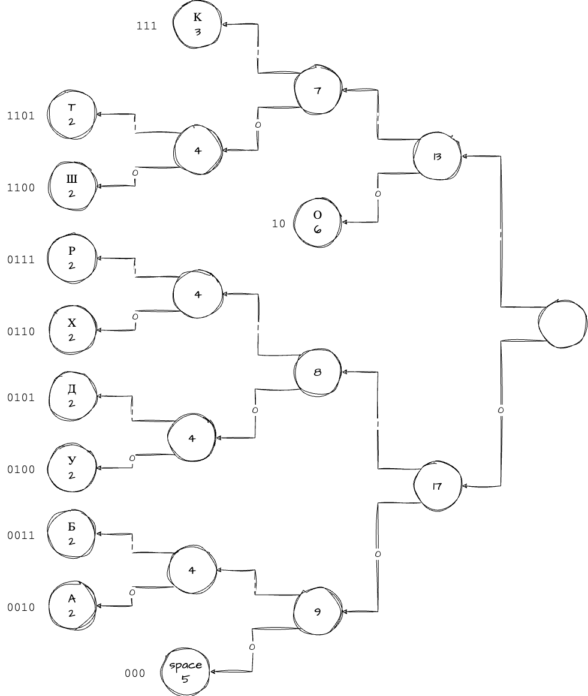
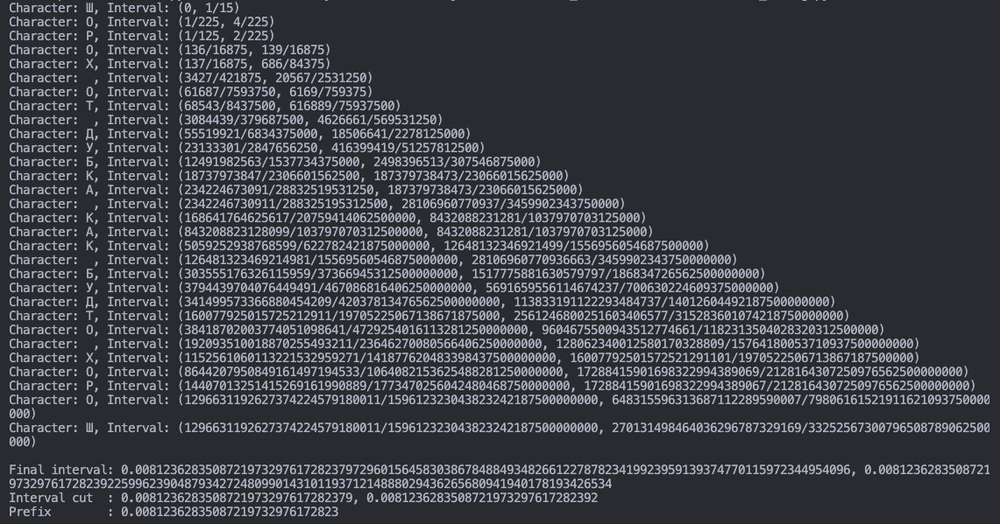
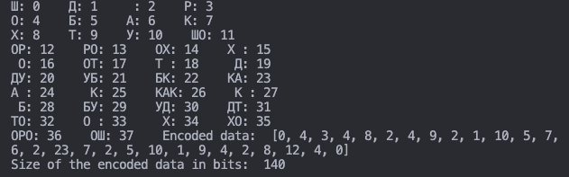

# Введение

## Цель лабораторной работы

## Задание

Выполнить сжатие текста 4 способами:

- Метод Хаффмана;
- Метод Шенона-Фано;
- Арифметическим кодированием;
- Алгоритмом LZW.

Для каждого метода рассчитать коэффициент сжатия текста.

**Вариант 5:** ШОРОХ ОТ ДУБКА КАК БУДТО ХОРОШ

# Выполнение работы

Для начала проанализируем текст.

Table: фигура

| Буква  |  Ш  |  О  |  Р  |  Х  | space |  Д  |  У  |  Б  |  К  |  А  |  Т  |
| ------ | :-: | :-: | :-: | :-: | :---: | :-: | :-: | :-: | :-: | :-: | :-: |
| Кол-во |  2  |  6  |  2  |  2  |   5   |  2  |  2  |  2  |  3  |  2  |  2  |

**Всего букв:** 30

## Метод Хаффмана

\sucsvtable{huffman.csv}{Решение методом Хаффмана}

Итоговый текст:

$[\,0111\,\,11\,\,0110\,\,11\,\,0101\,]\allowbreak101\allowbreak[\,11\,\,0000\,]\allowbreak101\allowbreak[\,0100\,\,0011\,\,0010\,\,100\,\,0001\,]\allowbreak101\allowbreak[\,100\,\,0001\,\,100\,]\allowbreak101\allowbreak[\,0010\,\,0011\,\,0100\,\,0000\,\,11\,]\allowbreak101\allowbreak[\,0101\,\,11\,\,0110\,\,11\,\,0111\,]$

Коэффициент кодирования: $100/120=0.83$

## Метод Шенона-Фано

Итоговый текст:

$[\,1100\,\,10\,\,0111\,\,10\,\,0110\,]\allowbreak000\allowbreak[\,10\,\,1101\,]\allowbreak000\allowbreak[\,0101\,\,0100\,\,0011\,\,111\,\,0010\,]\allowbreak000\allowbreak[\,111\,\,0010\,\,111\,]\allowbreak000\allowbreak[\,0011\,\,0100\,\,0101\,\,1101\,\,10\,]\allowbreak000\allowbreak[\,0110\,\,10\,\,0111\,\,10\,\,1100\,]$

Коэффициент кодирования: $100/120=0.83$

## Арифметическое кодирование

| Бв |       Ш        |       О        |       Р        |        Х        |      space      |        Д        |        У        |        Б        |        К        |        А        |
| ----- | :------------: | :------------: | :------------: | :-------------: | :-------------: | :-------------: | :-------------: | :-------------: | :-------------: | :-------------: |
| Ит.   | $\frac{2}{28}$ | $\frac{8}{28}$ | $\frac{10}{28}$ | $\frac{12}{28}$  | $\frac{17}{28}$  | $\frac{19}{28}$  | $\frac{21}{28}$  | $\frac{23}{28}$  | $\frac{26}{28}$  | $\frac{28}{28}$  |
| Н.   | $\frac{0}{28}$ | $\frac{2}{28}$ | $\frac{8}{28}$ | $\frac{10}{28}$ | $\frac{12}{28}$ | $\frac{17}{28}$ | $\frac{19}{28}$ | $\frac{21}{28}$ | $\frac{23}{28}$ | $\frac{26}{28}$ |

Видно, что получившийся полуинтервал имеет начало \seqsplit{$0.0.007491234978280553441395982224376491768148032361088748495779293270670468164890615017316007369538876504$} и конец \seqsplit{$0.007491234978280553441395982224391606091525613885464659445273216987363890074114548014936179948312863938$}.

Исходя из рисунка \ref{fig:Результат арифметического кодирования}, можно сделать вывод, что сообщение можно зашифровать числом $0.00749123497828055344139598222438_{10} = 0.00000001111010101111_2$, то есть $00000001111010101111_2$.

Коэффициент кодирования: $20/120=0.16$

## Алгоритм LZW

Коэффициент кодирования: $140/120=1.16$

# Вывод
