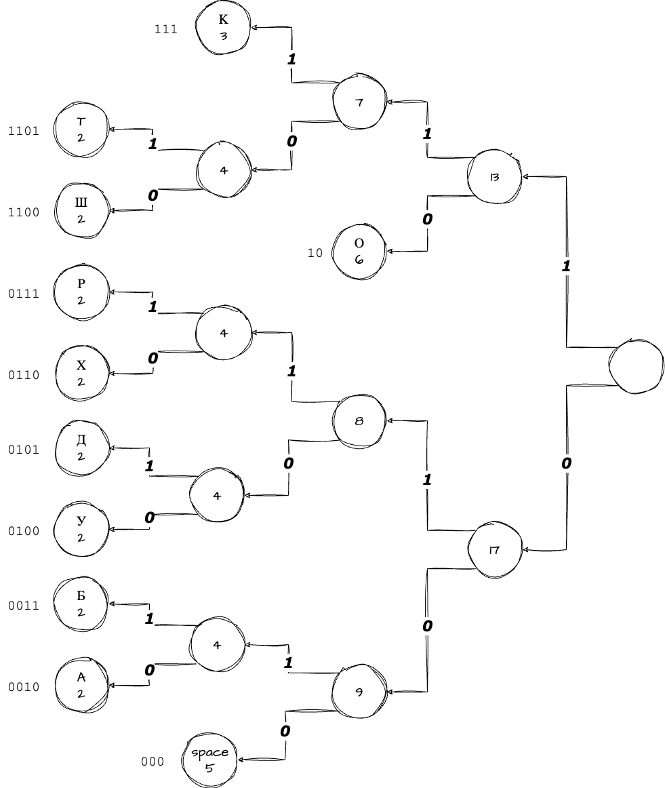

# Введение

## Цель лабораторной работы

Освоить алгоритмы для сжатия информации.

## Задание

Выполнить сжатие текста 4 способами:

- Метод Хаффмана;
- Метод Шенона-Фано;
- Арифметическим кодированием;
- Алгоритмом LZW.

Для каждого метода рассчитать коэффициент сжатия текста.

**Вариант 5:** ШОРОХ ОТ ДУБКА КАК БУДТО ХОРОШ

# Выполнение работы

## Теоретические сведения

$$
K = \frac{V_{вх}}{V_{вых}},
$$

где K - степень сжатия.

## Анализ исходного текста

Для начала проанализируем текст.

Table: Количество вхождений символов.

| Буква  |  Ш  |  О  |  Р  |  Х  | space |  Д  |  У  |  Б  |  К  |  А  |  Т  |
| ------ | :-: | :-: | :-: | :-: | :---: | :-: | :-: | :-: | :-: | :-: | :-: |
| Кол-во |  2  |  6  |  2  |  2  |   5   |  2  |  2  |  2  |  3  |  2  |  2  |

**Всего букв:** 30

## Метод Шеннона-Фано

\sucsvtable{huffman.csv}{Решение методом Шеннона-Фано}

Итоговый код:

$[\,0111\,\,11\,\,0110\,\,11\,\,0101\,]\allowbreak101\allowbreak[\,11\,\,0000\,]\allowbreak101\allowbreak[\,0100\,\,0011\,\,0010\,\,100\,\,0001\,]\allowbreak101\allowbreak[\,100\,\,0001\,\,100\,]\allowbreak101\allowbreak[\,0010\,\,0011\,\,0100\,\,0000\,\,11\,]\allowbreak101\allowbreak[\,0101\,\,11\,\,0110\,\,11\,\,0111\,]$

Коэффициент сжатия по формуле 2.1: $K=120/100=1.2$

## Метод Хаффмана

Итоговый код:

$[\,1100\,\,10\,\,0111\,\,10\,\,0110\,]\allowbreak000\allowbreak[\,10\,\,1101\,]\allowbreak000\allowbreak[\,0101\,\,0100\,\,0011\,\,111\,\,0010\,]\allowbreak000\allowbreak[\,111\,\,0010\,\,111\,]\allowbreak000\allowbreak[\,0011\,\,0100\,\,0101\,\,1101\,\,10\,]\allowbreak000\allowbreak[\,0110\,\,10\,\,0111\,\,10\,\,1100\,]$

Коэффициент сжатия по формуле 2.1: $K=120/100=1.2$

## Арифметическое кодирование

<l>

Скрипт на Python представлен в Приложении, результат его работы изображен на \ref{fig:Результат арифметического кодирования}.

Видно, что получившийся полуинтервал имеет начало \seqsplit{$0.0441034119038795609488903820451530821290744566744192886516829504916878805655507570249379945999303363152647240064389130359306227794852805966939598545145125428666525999348211959113656154842474099719851210466003976762294769287109375$} и конец \seqsplit{$0.0441034119038795609488903820451530821290744566744192923055136319621444851745026939416073769704364819281832636103168237518939100236464475654644311480088525252048969141360375214803192579532571671041552008318831212818622589111328125$}.

Исходя из рисунка \ref{fig:Результат арифметического кодирования}, можно сделать вывод, что сообщение можно закодировать количеством бит равным = $171$.

Коэффициент сжатия по формуле 2.1: $K=248/171=1.45$

## Алгоритм LZW

Скрипт на Python представлен в Приложении, результат его работы изображен на \ref{fig:Результат работы LZW}.

Коэффициент сжатия по формуле 2.1: $K=252/240=0.95$

# Вывод

В ходе выполнения лабораторной мы сжали исходную строку "ШОРОХ ОТ ДУБКА КАК БУДТО ХОРОШ" 4 разными способами. Для каждого способа мы посчитали коэффициент сжатия текста, и получили следующие значения:

1. Арифметическое кодирование = $1.45$
2. Метод Хаффмана = $1.2$
3. Метод Шенона-Фано = $1.2$
4. Алгоритм LZW = $0.95$

Как мы видим, арифмитическое кодирование имеет самую высокую степень сжатия, но тем не требует значительно большую мощность вычислительных ресурсов.

Метод Хаффмана и метод Шенона-Фано имеет одинаковую степень сжатия. Эти алгоритмы являются простыми в реализации, поэтому для некоторых задач могут быть весьма эффективными.

Алгоритм LZW имеет степень сжатия меньше единицы. Так получилось, потому что мы не учитывали то, что для предыдущих алгоритмов нужно передавать таблицу кодировок. Для алгоритма LZW этого не требуется, что является ощутимым плюсом.

Полученные навыки пригодятся нам при создании ПО чувствительного к размеру информации.

# ПРИЛОЖЕНИЕ <suaidoc-center>

**Листинг арифметического кодирования:**

\lstinputlisting{arithmetic_coding.py}

**Листинг LZW кодирования:**

\lstinputlisting{lzw_encode.py}

**Листинг кодирования по словарю:**

\lstinputlisting{fill_word.py}