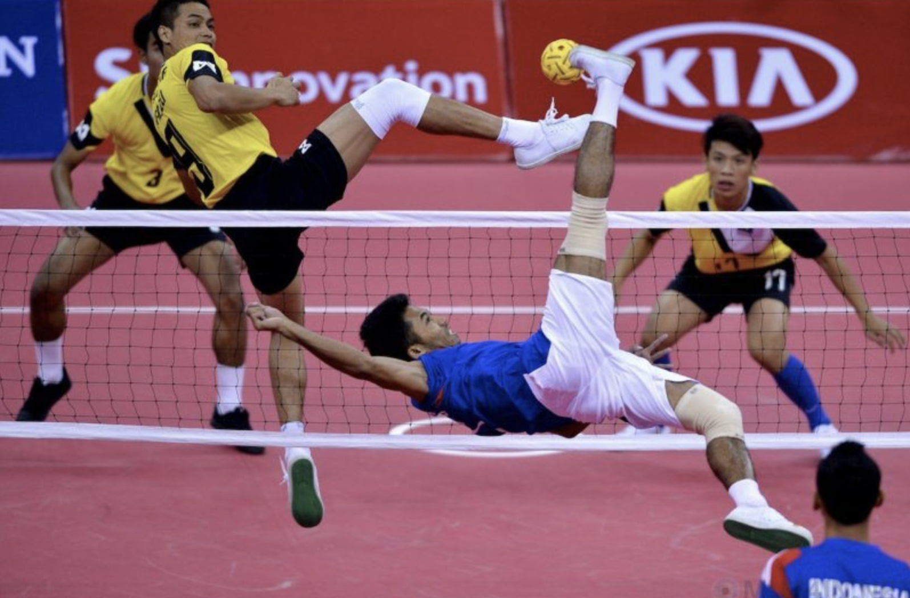
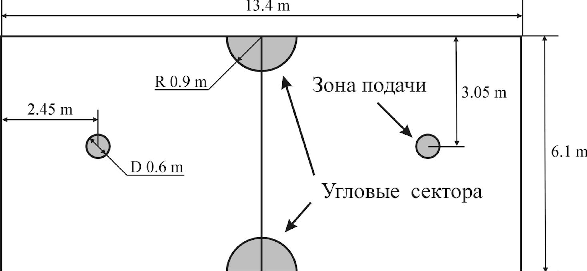
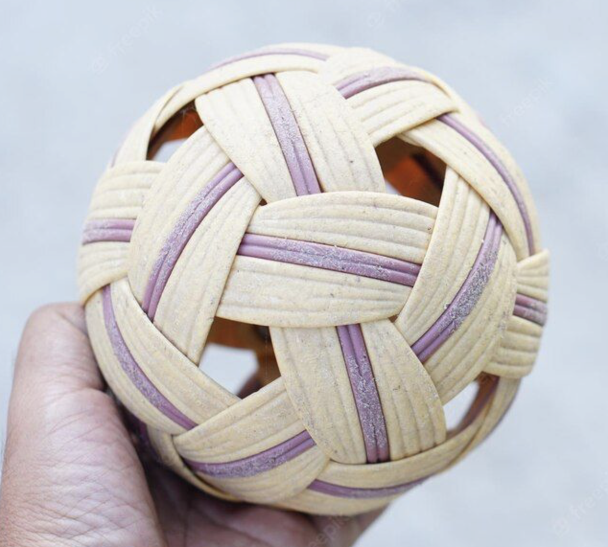
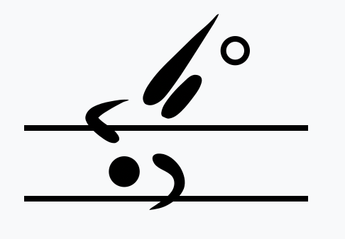

# Введение

Сепактакрау, также известный как "кик волейбол", представляет собой увлекательный и динамичный вид спорта, который сочетает элементы волейбола, футбола и гимнастики. Его популярность стремительно растет, особенно в странах Юго-Восточной Азии, таких как Таиланд, Малайзия и Индонезия, где он имеет глубокие культурные корни и традиции. Игра проводится на площадке, аналогичной волейбольной, но вместо рук игроки используют свои ноги, голову, плечи и грудь для перебрасывания мячика через сетку. Основной целью сепактакрау является забросить мяч на сторону соперника таким образом, чтобы он коснулся площадки.

Исторические корни этого спорта восходят к древним временам, когда схожие игры проводились в азиатских странах для укрепления физической выносливости и ловкости. Сепактакрау даже был включён в программу Азиатских игр как официальный вид спорта, что подчеркивает его значимость и признание на международной спортивной арене. Несмотря на свою экзотичность и специфичность, сепактакрау привлекает внимание зрителей по всему миру благодаря своей зрелищности, требующей от игроков не только физической силы, но и высокой координации движений и стратегического мышления.

В данной статье мы рассмотрим истоки этого интересного вида спорта, его правила, особенности, а также его текущее состояние и перспективы в контексте мирового спортивного сообщества.

# Правила игры

Сепактакрау придерживается строгих и специфических правил, которые обеспечивают порядок и справедливость в игре. Игра проводится на площадке размером 13.4 на 6.1 метра, разделённой сеткой, высота которой составляет 1.52 метра для мужчин и 1.42 метра для женщин. Матчи играют команды, состоящие из трех игроков: один находится в задней части площадки, называемый "теконг", и два других занимают позиции ближе к сетке, и именуются "атакующим" и "защитником".

Основная цель игры - перебрасывать мяч через сетку на сторону противника, используя исключительно ноги, голову, плечи и грудь. Ключевой особенностью сепактакрау является запрет на использование рук и кистей для касания мяча. Игра начинается с подачи мяча теконгом. Эта подача должна совершаться ногой, и она должна пересечь сетку, не касаясь её. После подачи каждая команда имеет право на три касания мяча перед тем, как его необходимо перебросить на другую сторону поля.

Очки присуждаются команде, которая успешно заставляет мяч коснуться площадки на стороне противника, либо заставляет его соперников сделать ошибку, например, перебросить мяч за пределы игровой зоны. Матч состоит из двух или трёх сетов до 21 очка. Для победы в сете команда должна опередить соперников минимум на два очка. Если счёт достигает 20:20, игра продолжается до тех пор, пока одна из команд не достигнет преимущества в два очка.

# Тактика

Тайменные удары являются отличительной тактикой сепактакрау, где акценты делаются на точность и силу удара ногами. Игроки стремятся наносить неожиданные удары, которые трудно блокировать или предсказать. Особенно важны удары типа “корк” (удар через голову), требующие высокой гибкости и акробатических навыков. Такая техника обманывает защиту противника и создает возможность для набора очков. Команды часто работают над разнообразием этих ударов, чтобы запутать соперника и заставить его ошибаться.

Также ротация и правильная расстановка игроков играют важную роль в тактике сепактакрау. Так как каждая команда состоит из трех основных игроков: нападающего (tekong), нападения (killer) и защитника (feeder), то эти игроки ротационно меняют свои позиции в зависимости от хода игры, что позволяет использовать их сильные стороны максимально эффективно. Например, tekong, обладающий отличным навыком сервиса, может временно сменить свою позицию на передней линии для выполнения атакующих ударов, создавая дополнительное давление на соперников.

# Распространенность игры

Сепактакрау, происходящий из Юго-Восточной Азии, обладает значительной популярностью в этом регионе, особенно в странах, таких как Таиланд, Малайзия, Индонезия, Сингапур и Филиппины. В каждой из этих стран существуют национальные лиги, соревнования и специализированные тренировочные центры, поддерживающие и продвигающие этот вид спорта. Например, в Таиланде сепактакрау является национальным видом спорта и регулярно включается в школьные и университетские программы физического воспитания. В Малайзии и Индонезии также существует высокий уровень поддержки сепактакрау, включая национальные лиги и региональные турниры. Сингапур и Филиппины активно развивают этот вид спорта, создавая условия для его популяризации среди молодежи.

На международной арене сепактакрау также начал набирать популярность и привлекать внимание, особенно благодаря его включению в программы Азиатских игр и чемпионатов мира по сепактакрау, которые проводятся с участием команд из различных стран. Международная федерация сепактакрау (ISTAF) активно работает над популяризацией этого вида спорта за пределами Азии, организуя международные турниры и мероприятия. Регулярные чемпионаты и международные соревнования способствуют росту популярности сепактакрау и привлекают новые страны-участницы.

Европа и Северная Америка также начали проявлять интерес к сепактакрау, хотя этот вид спорта здесь пока находится на ранней стадии развития. В некоторых европейских и североамериканских странах создаются клубы и проводятся соревнования, что способствует распространению знаний о сепактакрау и увеличению числа его поклонников. Показательные матчи и образовательные инициативы помогают привлечь внимание к этому виду спорта и стимулируют его дальнейшее развитие.

# Вывод

Сепактакрау обладает уникальностью и огромным потенциалом, делая его привлекательным как на локальном, так и на международном уровне. Его корни в культурных традициях Юго-Восточной Азии придают игре богатую историческую значимость, а акробатические элементы и физические требования делают её зрелищной и захватывающей. Строгие правила, использование исключительно ног, головы, плеч и груди для контроля мяча, а также высокие прыжки и удары через себя, демонстрируют неповторимое мастерство игроков.

На внутреннем уровне сепактакрау уже зарекомендовал себя как важная часть спортивной культуры в странах, таких как Таиланд, Малайзия, Индонезия, Сингапур и Филиппины. Регулярные национальные лиги, турниры и включение в образовательные программы способствуют его постоянному развитию и поддержке среди молодежи.

Международно сепактакрау активно продвигается при помощи Международной федерации сепактакрау (ISTAF), включения в программы таких крупных спортивных мероприятий, как Азиатские игры и чемпионаты мира, а также благодаря усилиям по организации международных турниров и показательных матчей. В Европе и Северной Америке, хотя спорт находится на ранней стадии развития, уже наблюдается растущий интерес, что открывает новые горизонты для распространения сепактакрау по всему миру.

Потенциал этого вида спорта заключается в его способности комбинировать элементы различных дисциплин — волейбола, футбола и боевых искусств, что делает его привлекательным для широкого круга спортсменов и зрителей. Стратегические и физические аспекты игры, а также её культурная значимость, обеспечивают сепактакрау устойчивую базу для дальнейшего роста и популяризации. В то время как спортивное сообщество ищет новые и захватывающие формы развлечений и соревнований, сепактакрау имеет все шансы стать одним из ведущих видов спорта на глобальной арене.