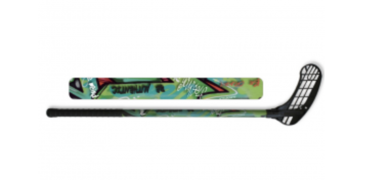
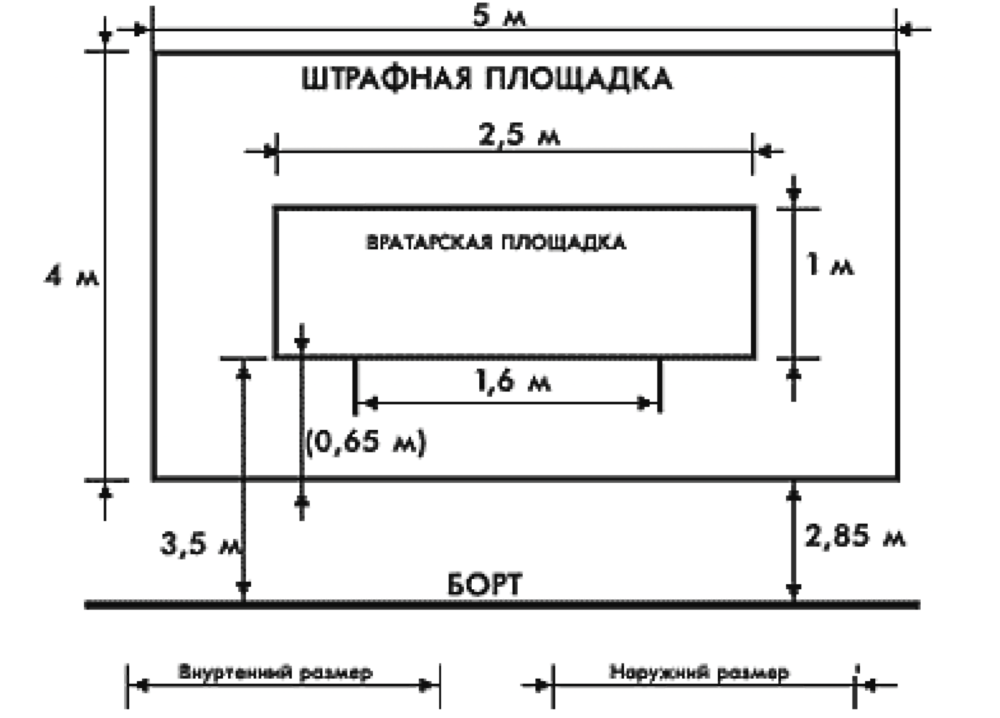

# Введение

Флорбол является одним из самых быстрорастущих видов спорта в мире. За последние десятилетия он приобрел значительную популярность как среди молодежи, так и среди взрослых, благодаря своей доступности, динамичности и относительной простоте организации. В ситуации, когда традиционные виды спорта испытывают проблемы с привлечением новой аудитории, флорбол демонстрирует впечатляющие темпы роста как на уровне любительских лиг, так и в профессиональных турнирах. По данным Международной федерации флорбола (IFF), на сегодняшний день насчитывается более 4 миллионов зарегистрированных игроков по всему миру, и это число продолжает расти ежегодно.

Причины роста популярности флорбола разнообразны и многогранны. Одной из главных причин является его универсальность: флорбол можно играть как в помещении, так и на открытом воздухе, что делает его доступным в любых климатических условиях. Этот вид спорта не требует значительных финансовых вложений ни в оборудование, ни в аренду специализированных площадок, что также способствует его распространению. Кроме того, флорбол отличается высокой степенью инклюзивности, что позволяет привлекать к участию в игре людей с различными физическими возможностями и уровнями подготовки.

В данном реферате будут рассмотрены основные аспекты, способствующие быстрому развитию флорбола. Мы проанализируем историю и эволюцию этого вида спорта, его текущее состояние и перспективы на будущее. Особое внимание будет уделено различным инициативам и программам популяризации флорбола, а также его влияние на физическое и социальное развитие участников. Через призму этих аспектов станет очевидным, почему флорбол заслуживает внимание как одного из ведущих современных видов спорта.

# Историческая справка

Флорбол берет свое начало в Швеции в 1970-х годах, когда энтузиасты начали адаптировать хоккей к играм в помещении с использованием легкого пластикового мяча и клюшек. В течение следующих десятилетий игра быстро завоевала популярность не только в Швеции, но и по всей Скандинавии, а затем и в других частях Европы и мира. В 1986 году была создана Международная федерация флорбола (IFF), что заложило основу для официального признания и организации международных соревнований.

Первый чемпионат мира по флорболу среди мужчин состоялся в 1996 году в Швеции, а среди женщин — в 1997 году в Финляндии. С тех пор популярность чемпионатов мира непрерывно растет, и на сегодняшний день они проводятся каждые два года, привлекая сотни участников и тысячи поклонников. В 2008 году IFF была признана Международным олимпийским комитетом (МОК), что стало важным шагом на пути включения флорбола в программу Олимпийских игр.

С начала 2000-х годов флорбол начал активно распространяться за пределы Европы. Появилась возможность играть в него в Северной Америке, Азии, Африке и Австралии. В частности, такие страны как Швейцария, Чехия и Финляндия стали ведущими центрами развития этого вида спорта. В последние годы флорбол также начал набирать популярность в странах с традиционно сильными хоккейными школами, такими как Канада и Россия.

# Правила игры

Флорбол — это командный игровой вид спорта, напоминающий хоккей, который проводится на твердой площадке в помещении, обычно размера стандартного баскетбольного или хоккейного корта. Игра состоит из двух команд, каждая из которых включает шесть игроков: пять полевых и один вратарь. Продолжительность матча стандартно составляет три периода по 20 минут чистого времени с перерывами между периодами. Основная цель игры — забить как можно больше голов, отправив легкий пластиковый мяч в ворота соперника с помощью специальных клюшек.

Игра начинается с вбрасывания мяча в центральном круге, после чего команды стремятся контролировать мяч, проходя его через своих игроков и пытаясь создать моменты для атаки на ворота противника. В отличие от хоккея с шайбой, в флорболе контактные действия ограничены, что делает игру менее травмоопасной и более доступной для широкой аудитории, включая детей и подростков. Все игроки, кроме вратаря, используют клюшки длиной от 85 до 100 см, а клюшку можно держать одной или двумя руками, в зависимости от ситуации на поле.

Существует несколько ключевых правил, которые необходимо соблюдать во время игры. Например, запрещается ударять по мячу выше уровня коленей, толкать соперников или держать их руками. Нарушение этих правил приводит к штрафам различной степени тяжести — от свободного удара для соперника до временного удаления игрока с поля на определенное время. Вратарь играет ключевую роль в защите ворот и может использовать руки и тело для отражения мячей, но не имеет права покидать зону вратаря с тремя активными касаниями мяча.

# Причина полярности

Флорбол активно завоевывает популярность по всему миру благодаря системе своих уникальных преимуществ. Одним из ключевых факторов является его доступность. В отличие от многих других видов спорта, флорбол требует минимального оборудования: легкого пластикового мяча, специальной клюшки и спортивного зала или площадки. Это делает данный вид спорта доступным для широкого круга людей, независимо от их финансовых возможностей или места проживания.

Ещё одним важным аспектом, способствующим росту популярности флорбола, является его инклюзивность. Это игра, в которую могут играть как дети, так и взрослые, мужчины и женщины, а также люди с различной физической подготовкой. Более того, флорбол активно пропагандирует принципы справедливой игры и взаимоуважения, что делает его привлекательным для школьников и молодежи.

Помимо социальной составляющей, флорбол оказывает значительное положительное воздействие на физическое состояние участников. Во-первых, это динамичный и интенсивный вид спорта, который способствует улучшению кардио-респираторной выносливости. Игроки постоянно находятся в движении, что требует активной работы сердца и легких, улучшая общую сердечно-сосудистую систему.

Во-вторых, флорбол требует координации и быстроты реакции, что развивает мелкую и крупную моторику. Тренировки по флорболу способствуют развитию быстрых и точных движений, улучшая общее координационное состояние игрока. Кроме того, управление клюшкой и мячом тренируют навык одновременного выполнения нескольких действий, что положительно сказывается на когнитивных функциях.

В-третьих, флорбол способствует развитию мышечной силы и гибкости. Постоянное перемещение по площадке, резкие повороты и маневрирование требуют участия различных групп мышц, что обеспечивает их тонус и силу. Активное взаимодействие с мячом и противниками также тренирует мышечную гибкость и подвижность суставов.

# Примеры

Одним из ярких примеров чемпионов по форболу является Джон Смит, известный своими невероятными навыками и стратегическим мышлением в игре. Завоевав три мировых титула подряд, Смит не только закрепил своё имя в истории спорта, но и стал символом непоколебимой воли и усердия. Его профессиональные достижения привнесли новый уровень тактической игры в форбол, благодаря чему спортсмены по всему миру начали адаптироваться и внедрять его методы.

Помимо личных успехов игроков, значительную роль в популяризации форбола играют международные турниры и лиги. Одной из первых таких лиг стала Европейская лига форбола, объединяющая команды из различных стран Европы и предоставляющая высококлассные площадки для соревнований. Этот турнир не только способствует развитию игры на континенте, но и служит платформой для выявления новых талантов. В последние годы Европейская лига форбола стала настоящим магнитом для скаутов, ищающих перспективных игроков, что ещё больше повышает её престиж и значимость.

На другом полушарии, Азиатско-Тихоокеанская лига форбола представляет собой ещё один яркий пример развития этого спорта. Лига включает в себя команды из стран, таких как Япония, Южная Корея и Австралия, и активно способствует популяризации форбола в регионе. Освещаемые крупными спортивными телеканалами, матчи Азиатско-Тихоокеанской лиги привлекают значительно больше зрителей, тем самым развивая интерес среди различных групп населения.

Кроме региональных лиг, значительную роль в популяризации форбола играют и межконтинентальные турниры, такие как Мировая лига форбола. Эти соревнования объединяют лучшие команды со всего мира, создавая зрелищные и напряженные матчи, которые привлекают миллионы болельщиков. Мировая лига не только определяет сильнейшую команду, но и способствует обмену культурными и спортивными традициями между странами-участницами.

# Вывод

В заключение, флорбол завоевал огромную популярность благодаря своей доступности, инклюзивности и динамичности. Этот вид спорта не требует значительных финансовых затрат и может быть игран практически в любых условиях, что делает его доступным для широких масс. Инклюзивность флорбола позволяет вовлекать людей разного возраста, пола и уровня физической подготовки, создавая дружелюбное и сплоченное сообщество.

Высокая динамичность и захватывающий характер игры привлекают как участников, так и зрителей. Флорбол также имеет множество преимуществ для здоровья, улучшая кардио-респираторную выносливость, координацию, силу и гибкость, а также социальные навыки.

Все эти факторы делают флорбол не только популярным, но и полезным видом спорта, который продолжает расти и вовлекать всё больше людей по всему миру.

# СПИСОК ИСПОЛЬЗОВАННЫХ ИСТОЧНИКОВ <suaidoc-center>

