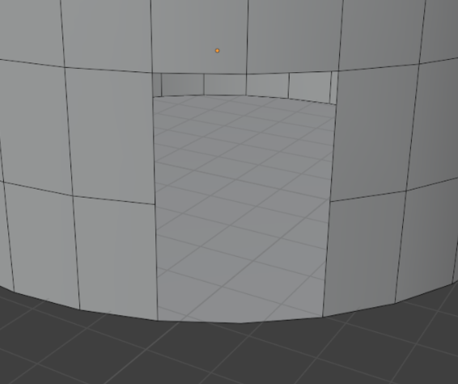
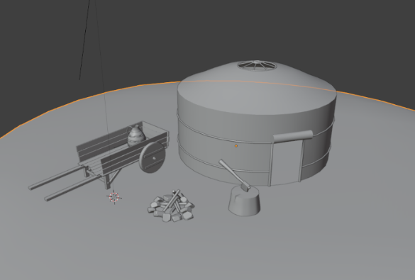

# Введение

## Задание

Построить трехмерную сцену, содержащую не менее 6 объектов, созданных при помощи следующих инструментов:

- Вращением контура
- Экструдированием
- Вычитанием объектов (Boolean)
- Сглаживанием

Объекты могут быть созданы комбинацией данных инструментов, а также при их создании могут быть использованы дополнительные инструменты. Объекты не должны быть заимствованы из приведенных в методических указаниях примеров.

## Вариант

Городская среда - привал монгольского караванщика.

# Выполнение работы

В ходе работы была создана сцена, состоящая из следующих объектов:

- Кувшин
- Топор
- Костер
- Тележка
- Юрта
- Пень для рубки дров

## Кувшин

Из `Plane` были удалены 3 вершины, а из последней с помощью инструмента `Extrude` создан контур кувшина.

Затем с помощью инструмента `Spin` создаем заготовку кувшина.

Для сглаживания здесь и далее применяется модификатор `Shade Auto Smooth`.

Дополнительно этот модификатор поправляем указывая “острые” ребра вручную.

Затем с помощью того же модификатора `Spin`, а затем ручной корректировки создаем ручку кувшина из объекта `Cube`.

Из `Circle` с помощью перемещения и инструмента `Extrude` создаем металлические обручи.

Здесь и далее для создания дополнительной геометрии использую модификатор `Subdivision`.

Затем корректирую работу модификатора с помощью указания `Edge Crease` ребрам в тех местах, где модификатор не должен сглаживать модель.

<m>

Из объекта `Circle`, тем же способом что и обручи, создаем будущее горлышко кувшина.

С помощью перемещения придаем завершенную форму горлышку.

# Костер

Из объекта Cube с помощью инструмента Bevel и перемещения создаем камень.

Затем дублируя объект, перемещая и масштабируя, создаем круг из камней для костра.

Из объекта `Circle` создаем будущую горку пепла используя инструмент `Fill` чтобы заполнить контур геометрией.

Из `Cylinder` с помощью инструментов перемещения и масштабирования создаем хворост в костре. Дополнительные ребра были созданы с помощью инструмента `Loop Cut`.

## Создание пенька для рубки дров

Из `Cylinder` с помощью инструментов перемещения, масштабирования, `Loop Cut` и `Bevel`(с помощью него были смоделированы трещины в пне) был создан пенек для рубки дров.

## Колун

Из объекта `Cylinder` с помощью инструментов перемещения и `Extrude` создано топорище для колуна.

Затем с помощью инструментов `Extrude`, `Bevel` и `Merge` создана головка топора.

Из объекта `Cube` с помощью инструментов масштабирования и перемещения был создан клин для проушины колуна.

## Юрта

Из объекта `Circle` с помощью инструмента `Extrude` и масштабирования создаем основу для юрты.

Вход в юрту был создан путем удаления лишних полигонов на заготовке.

Из `Cylinder` с помощью инструментов вращения, масштабирования, `Loop Cut` и перемещения создан рулон на выходе из юрты.

С помощью объекта `Curves` были созданы держащие обручи и дополнительные элементы юрты.

Геометрия обручам была прописана в окне `Geometry` параметром `Depth`.

## Тележка

Для создания тележки сначала была создана база из объектов `Cube`.

Из объекта `Cylinder` было создано колесо тележки. Для дополнительной детализации использовался инструмент `Extrude`.

Из `Cube` были созданы держащие доски.

Опора была создана из объекта `Cube` с помощью инструментов `Extrude`, `Loop Cut` и перемещения с масштабированием.

Дополнительная держащая рейка из объекта `Cube` после деформации инструментом масштабирования по одной оси.

Таким же способом что и рейка для опор были созданы ручки тележки.

Все необходимые объекты были продублированы на вторую сторону тележки.

## Рендер

С помощью инструментов масштабирования, перемещения и вращения была создана сцена привала каравана. Поверхность была создана из объекта `Plane` подобным образом как было создано пепелище костра.

## Материалы и текстуры

Все развертки были выполнены в режиме редактирования с помощью инструмента автоматической развертки `Smart UV Project`.

Все текстуры назначались на материалы в окне `Shading`. На некоторые объекты назначалось несколько материалов, а затем производилась выборочная покраска полигонов в окне материалов.

## Заключительный рендер

В результате проделанной работы была создана сцена привала караванщика. Он уже поставил свою юрту. Рядом с ней мы видим готовый к разжиганию костер, тележку с кувшином на ней и ступку для рубки дров с колуном.

# ВЫВОД

В результате выполнения лабораторной работы была создана сцена на заданную тему, состоящая из нескольких объектов, при создании которых использовались различные методы моделирования. Для объектов созданы разнообразные материалы, после чего произведен рендер сцены. Исходники работы доступны на [GitHub](https://github.com/vladcto/suai-labs/tree/main/7_semester/3D/1).

Были освоены базовые навыки работы в программе для 3д- моделирования Blender, изучены различные методы создания объектов, получены навыки создания материалов и построения сцены.
