# Введение

## Задание

Построить анимированную трехмерную сцену, содержащую анимацию, созданную с
использованием следующих инструментов:

- Анимация с использованием ключей
- Движение по траектории
- Движение фокуса камеры
- Моделирование процессов физики твердых тел трехмерной графики
- Система частиц

## Вариант

Городская среда - привал монгольского караванщика.

# Выполнение работы

В ходе работы с помощью различных инструментов и способов была анимирован ранее созданная сцена каравана.  Было реализовано движение фокуса камеры, физика кувшина в тележке, перемещение тележки по траектории, вращение колес тележки через ключи анимации и эффект дыма костра с помощью симуляции частиц.

## Движение фокуса камеры

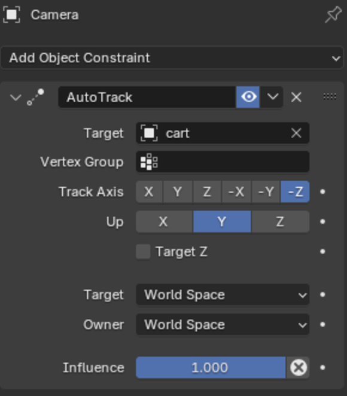

Ранее созданному объекту камеры добавляем ограничитель `AutoTrack`, а в качестве цели (`Target`) указываем повозку.

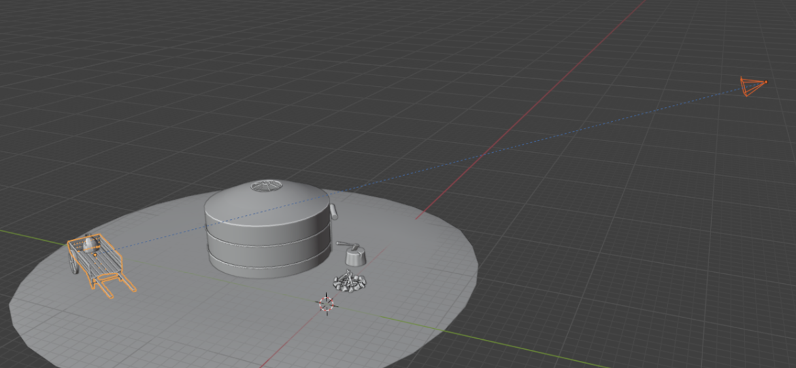

## Движение по траектории

Создаем объект `Path` и в режиме редактирование выстраиваем путь для тележки.

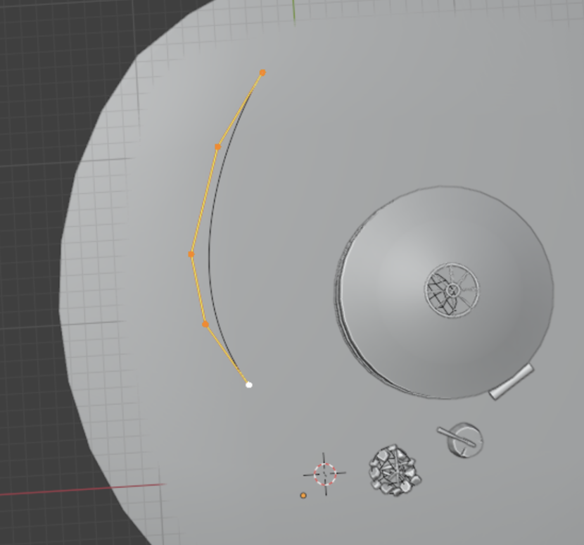

Устанавливаем колесам в качестве объекта-родителя тележку, чтобы они следовали за ней, но были все еще отдельным объектом.

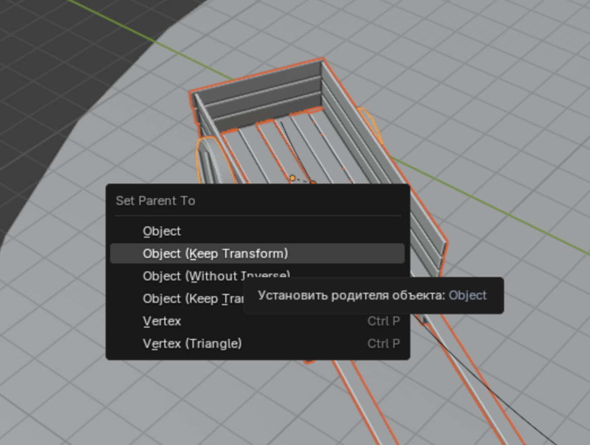

В ограничителях тележки указываем ограничитель `Follow Path`, а в качестве цели выбираем ранее созданный путь. Также указываем параметр `Follow Curve` для поворота тележки по направлению пути и нажимаем `Animate Path`.

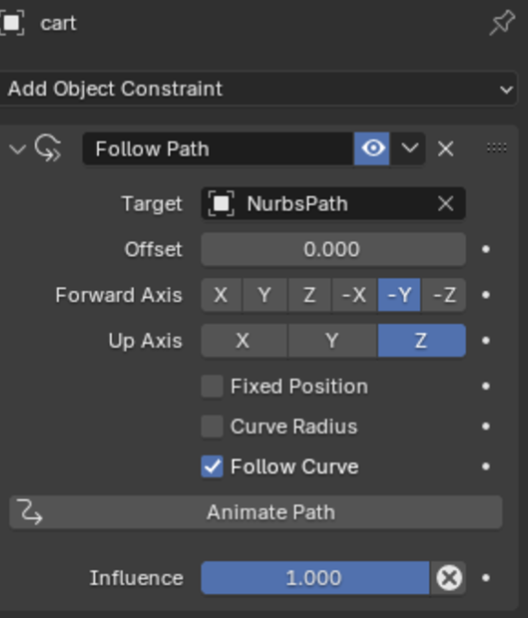

Время проигрывание анимации указываем в настройках Data объекта путь.

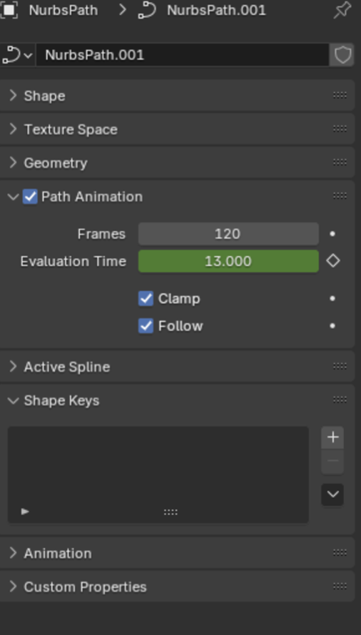<m>

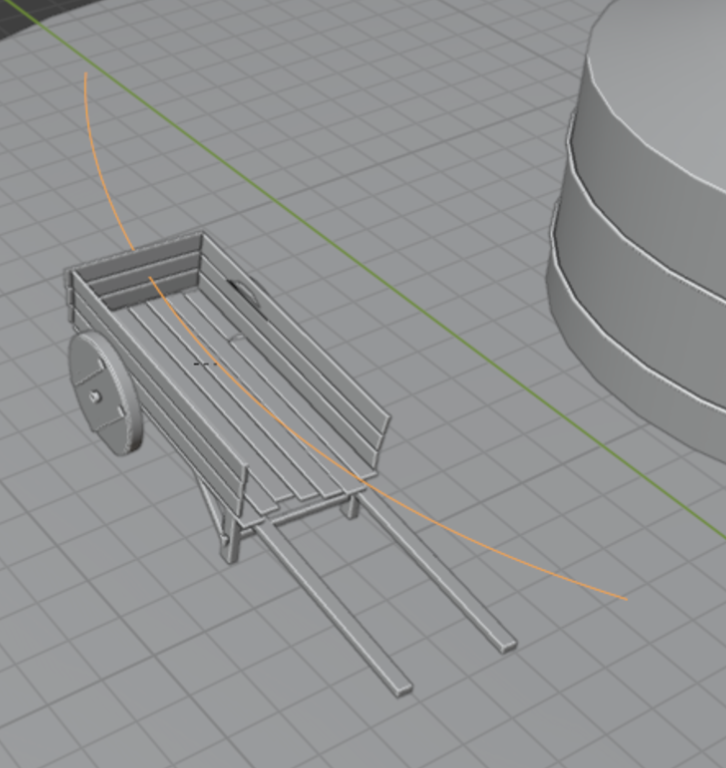

## Анимация с использование ключей

В настройках, в боковой панели, указываем режим вращения `Quaternion (WXYZ)`, который лучше подходит для вращения по локальным осям объекта колеса.

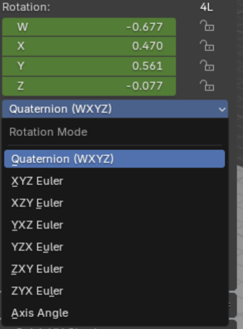

Выделяем колеса и с помощью горячей клавиши I создаем ключи, каждые несколько кадров проворачивая колеса по локальной оси Z, таким образом добиваясь вращения колес.

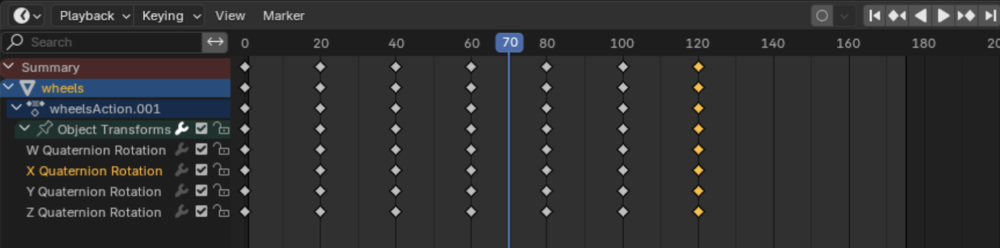

## Моделирование процессов физики твердых тел трехмерной графики

Заходим в настройки физики объекта кувшин и указываем объекту эффекты `Collision` и `Rigid Body`, позволяющие взаимодействовать объектам на физическом уровне с другими объектами, обладающие теми же эффектами. Здесь же указываем массу объекта.

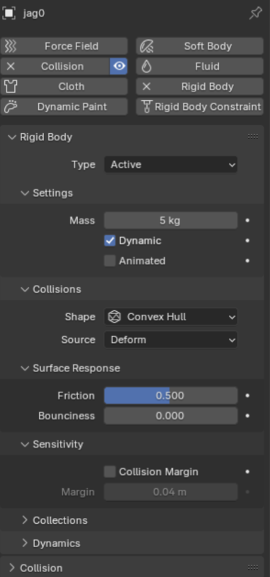<m>

Тоже самое указываем объекту тележки, но тип Rigid Body указываем Passive, так как объект управляется ключами анимации, а не симуляцией физики, как кувшин. По той же причине в настройках указываем параметр Animated, позволяя системе анимации управлять объектом тележки.

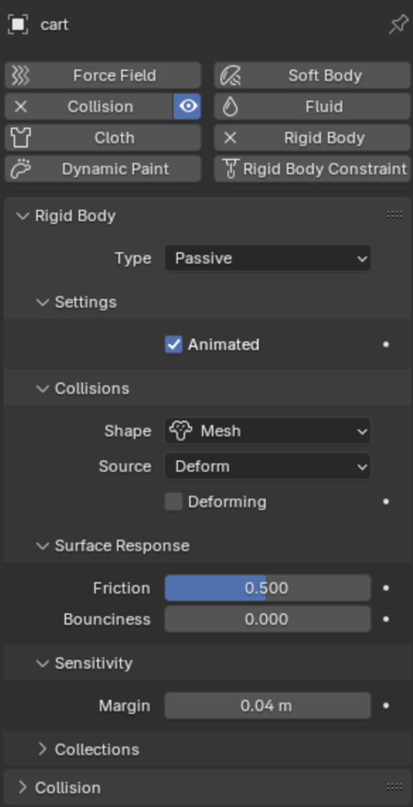<m>

Теперь кувшин и тележка взаимодействуют в симуляции физики.

## Система частиц

Для создания дыма из костра дублируем объект пепелище и придаем ему свойство `Fluid`, настраивая в параметрах объект как источник дыма.

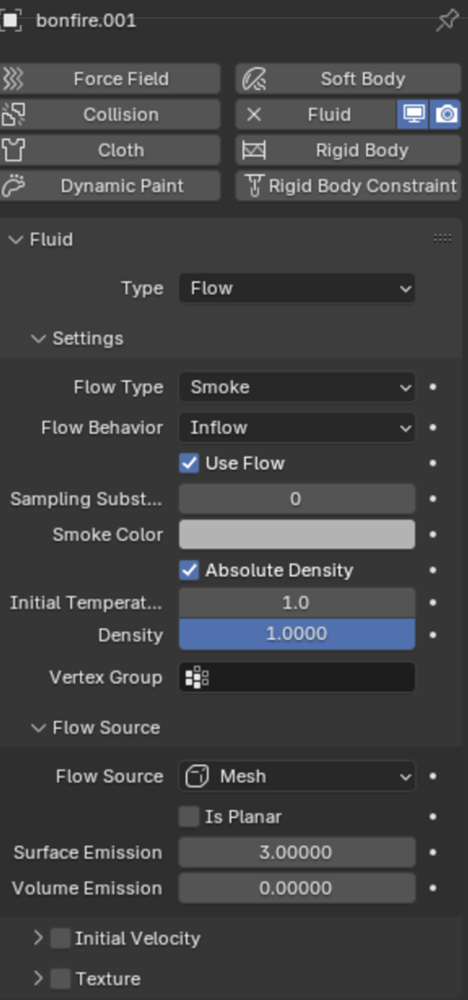<m>

Затем создаем куб, размещаем его над костром и настраиваем его как контейнер для симуляции дыма.

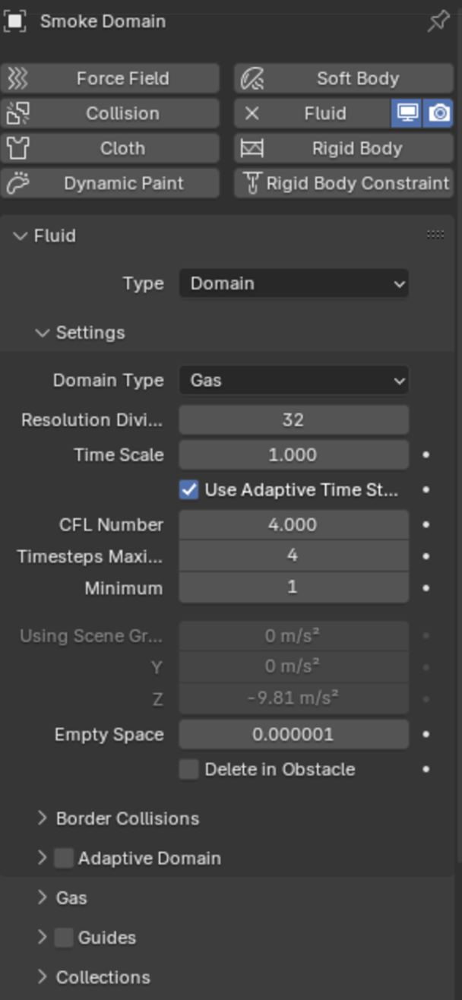<m>

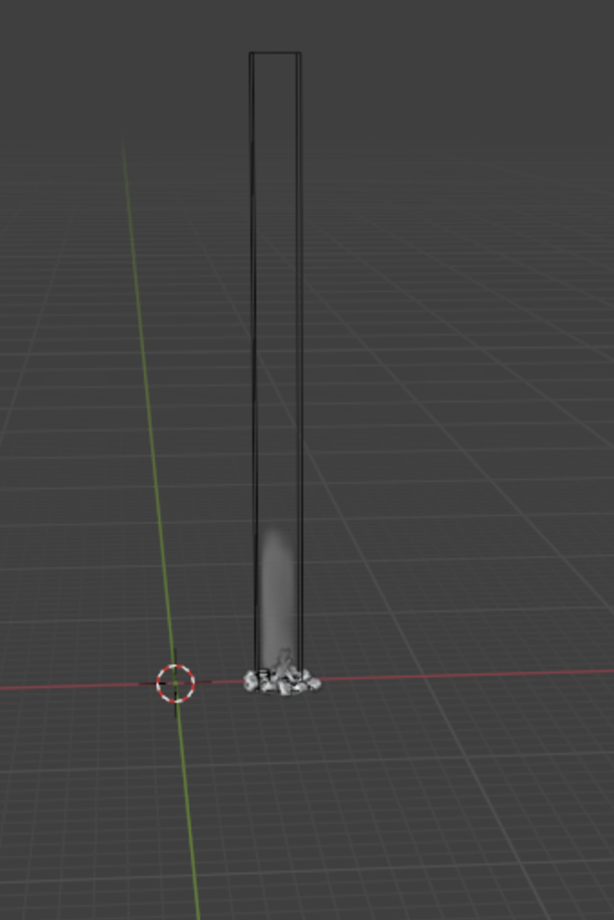
# ВЫВОД

В результате выполнения лабораторной работы была создана сцена на заданную тему, а рендер анимации был выложен на [GitHub](https://github.com/vladcto/suai-labs/tree/main/7_semester/3D/2/preview.mkv).

В процессе работы были использованы и изучены такие инструменты и способы анимации как симуляция физики твердых тел и системы частиц, а также более традиционные покадровая анимация с помощью ключей анимации, движения объекта через ограничители.
