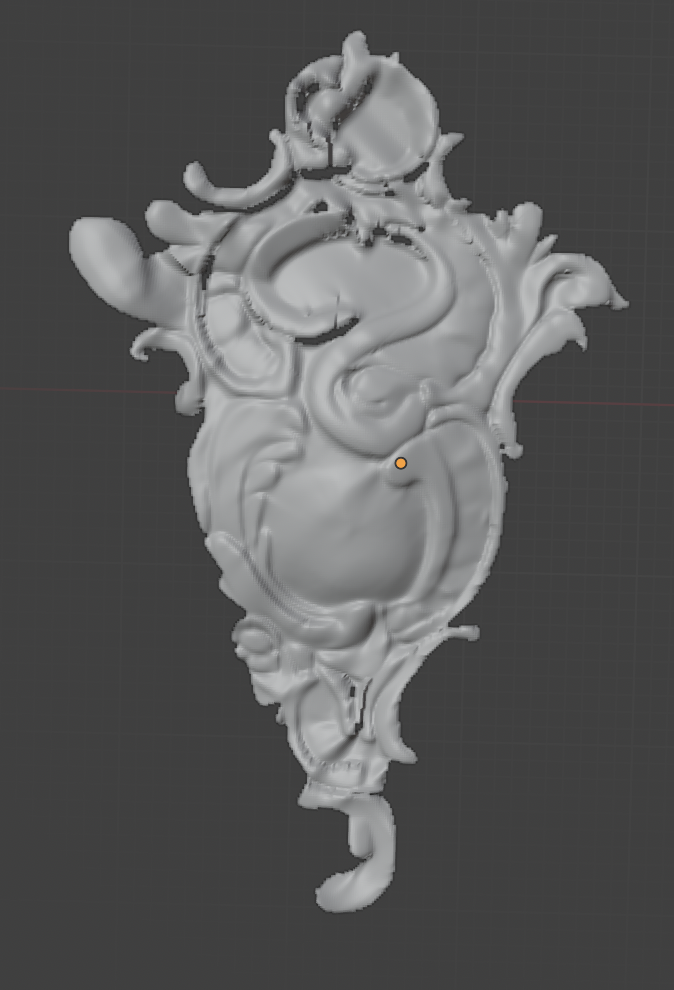

# Введение

## Задание

Разработать программу, используя язык программирования согласно
варианту, позволяющую:

1. Считать из исходного файла карту глубины заданной размерности.
Использовать исходный файл или поток данных стереокамеры.
Использование сторонних файлов bmp не допускается!
2. Визуализировать трехмерную оболочку, относящуюся к
рассматриваемому объекту (формат карты глубины представлен в разделе 1) с
использованием библиотеки OpenGL. Критерием визуализации является
возможность проверки правильности считанной карты глубины и
возможность сравнения с результатом в выходном файле.
3. Экспортировать оболочку объекта в файл в соответствии с вариантом
задания.

**Вариант 5:** `.obj`, `C#`.

## Решение о смене языка

По причине того, что:

1) Разработка велась на `MacOS`;
2) Недавнему отказу поддержки `Visual Studio` на `MacOS` ([Источник](https://devblogs.microsoft.com/visualstudio/visual-studio-for-mac-retirement-announcement/));
3) Закончившийся в этом месяце лицензии `JetBrains Rider`;
4) Cырого, неудобного тулинга `C# + NuGet` в `VS Code`.

Было решено выбрать ЯП `Python`.

# Выполнение работы

В ходе работы был реализован скрипт на Python с использованием библиотек `NumPy` и `PyOpenGl`. Программа была разделена на функции для удобства поддержки и расширения. Исходный код доступен на [GitHub](https://github.com/vladcto/suai-labs/tree/main/7_semester/3D/3) или в Приложении.

Для начала было составлена схема для `JSON`.

```json
{
  "$schema": "http://json-schema.org/draft-07/schema#",
  "title": "Depth Map Configuration",
  "type": "object",
  "properties": {
    "name": { "type": "string", "description": "Имя файла с картой глубины" }
  },
  "required": ["name"],
  "additionalProperties": false
}
```

Затем были реализованы функции для чтения `JSON` файла и его преобразовании в 2D массив карты глубины.

```python
def read_json_file(json_filename):
    with open(json_filename, 'r') as file:
        data = json.load(file)
    return data['name']


def read_depth_map(depth_map_filename):
    with open(depth_map_filename, 'rb') as file:
        height = int(np.fromfile(file, dtype=np.float64, count=1)[0])
        width = int(np.fromfile(file, dtype=np.float64, count=1)[0])
        depth_map_array = np.fromfile(
            file, dtype=np.float64).reshape((height, width))
    return depth_map_array
```

После была написана функция для конвертации 2D массива в файл формата `.obj`. Для этого мы сначала составляли список вершин,
а затем соединяли их в грани, по факту их смежности в массиве карты глубины.

```python
def export_to_obj(filename, depth_map_array):
    height, width = depth_map_array.shape
    vertices = []
    indices = {}

    with open(filename, 'w') as file:
        vertex_id = 1
        for i in range(height):
            for j in range(width):
                depth = depth_map_array[i, j]
                if depth != 0:
                    vertex = (j - width / 2, height / 2 - i, -depth)
                    indices[(i, j)] = vertex_id
                    vertices.append(vertex)
                    file.write(f'v {vertex[0]} {vertex[1]} {vertex[2]}\n')
                    vertex_id += 1

        for i in range(height - 1):
            for j in range(width - 1):
                if (depth_map_array[i, j] != 0 and
                    depth_map_array[i, j + 1] != 0 and
                    depth_map_array[i + 1, j] != 0 and
                        depth_map_array[i + 1, j + 1] != 0):

                    v1 = indices[(i, j)]
                    v2 = indices[(i, j + 1)]
                    v3 = indices[(i + 1, j + 1)]
                    v4 = indices[(i + 1, j)]

                    file.write(f"l {v1} {v2}\n")
                    file.write(f"l {v2} {v3}\n")
                    file.write(f"l {v3} {v4}\n")
                    file.write(f"l {v4} {v1}\n")

                    file.write(f"f {v1} {v2} {v3} {v4}\n")
```

После был реализован код для инициализации холста `OpenGl`. Большая часть кода избыточна, по причине того, что она используется в лабораторной работе №4. Здесь важнее всего, что мы устанавливаем перспективную проекцию, устанавливаем цветовое буферизование с использованием RGBA, а также задаем функцию для рендеринга `display_func`.

```python
def init_glut(display_func):
    glutInit()
    glutInitDisplayMode(GLUT_RGBA | GLUT_DOUBLE | GLUT_DEPTH)
    glutInitWindowSize(window_width, window_height)
    glutInitWindowPosition(100, 100)
    glutCreateWindow(b"3D Depth Map Visualization")
    glutDisplayFunc(display_func)
    glEnable(GL_DEPTH_TEST)
    glClearColor(0.0, 0.0, 0.0, 0.0)

    glMatrixMode(GL_PROJECTION)
    gluPerspective(45, (window_width / window_height), 0.1, 1000.0)
    glMatrixMode(GL_MODELVIEW)
```

Затем реализовали последнюю функцию `display_func`, в которой мы очищаем изначальный кадр, устанавливаем позицию и направление камеры, настраиваем буфер, для отрисовки граней, и наконец используя такой же способ, как и в экспорте `.obj`, рисуем грани нашей оболочки.

```python
def display(depth_map_array):
    glClear(GL_COLOR_BUFFER_BIT | GL_DEPTH_BUFFER_BIT)
    glLoadIdentity()

    glMatrixMode(GL_MODELVIEW)
    glLoadIdentity()

    # -500 as a crutch so not to deal with positioning
    gluLookAt(
        0, 0, -500,
        0, 0, 0,
        0, 1, 0,
    )

    height, width = depth_map_array.shape
    max_depth = np.max(depth_map_array) if np.max(depth_map_array) != 0 else 1
    scale_factor = 200

    glBegin(GL_QUADS)
    for i in range(height - 1):
        for j in range(width - 1):
            if (depth_map_array[i, j] != 0 and
                depth_map_array[i, j + 1] != 0 and
                depth_map_array[i + 1, j] != 0 and
                    depth_map_array[i + 1, j + 1] != 0):

                vertices = [
                    ((j - width / 2) / width, (height / 2 - i) /
                     height, -depth_map_array[i, j] / max_depth),
                    (((j + 1) - width / 2) / width, (height / 2 - i) /
                     height, -depth_map_array[i, j + 1] / max_depth),
                    (((j + 1) - width / 2) / width, (height / 2 - (i + 1)) /
                     height, -depth_map_array[i + 1, j + 1] / max_depth),
                    ((j - width / 2) / width, (height / 2 - (i + 1)) /
                     height, -depth_map_array[i + 1, j] / max_depth)
                ]

                for vertex in vertices:
                    glVertex3f(vertex[0] * scale_factor, vertex[1]
                               * scale_factor, vertex[2] * scale_factor)
    glEnd()

    glutSwapBuffers()
```

И в заключение, собираем все наши функции для выполнения программы:

```python
json_filename = 'depth_map_info.json'
depth_map_filename = read_json_file(json_filename)
depth_map_array = read_depth_map(depth_map_filename)

export_to_obj('output.obj', depth_map_array)

init_glut(lambda: display(depth_map_array))
glutMainLoop()
```

## Тестирование работы

Для тестирования мы провели следующее:

1) Составили наш тестовый `JSON` файл.
2) Проверили отрисовку нашей оболочки, используя `OpenGl`.
3) Удостоверились в верности п.2, открыв наш `.obj` файл в `Blender`.


<l>



Как мы видим - модель совпадает, а значит программа верна. Сплошная заливка белым цветом нашей модели обусловлена тем, что в этой лабораторной работе еще не настроено освещение.

# ВЫВОД <suaidoc-center>

В результате выполнения лабораторной работы была создана программа на языке `Python`, считывающая и визуализирующая карту глубины, а также преобразующая его в формат `.obj`. Также были освоены базовые навыки работы с картами глубины и библиотекой `OpenGL`.

Получившийся исходных код было выложен на [GitHub](https://github.com/vladcto/suai-labs/tree/main/7_semester/3D/3), а также представлен в Приложении.

# ПРИЛОЖЕНИЕ <suaidoc-center>

**Листинг solve.py:**

\lstinputlisting{../solve.py}

**Листинг depth_map_info.json:**

\lstinputlisting{../depth_map_info.json}
