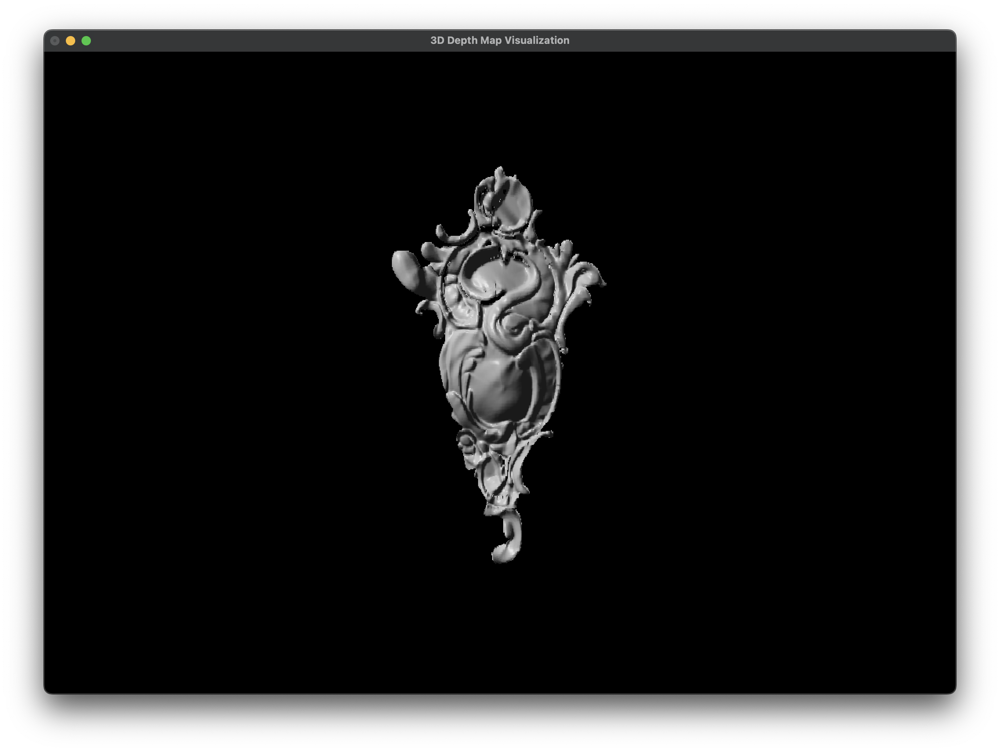
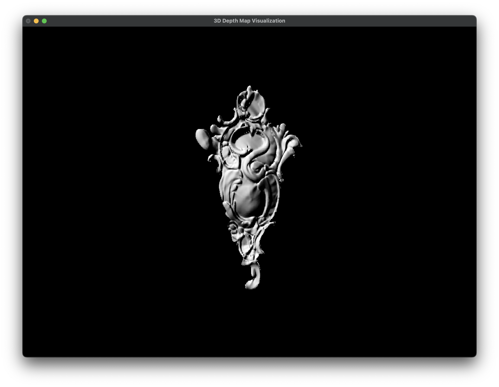
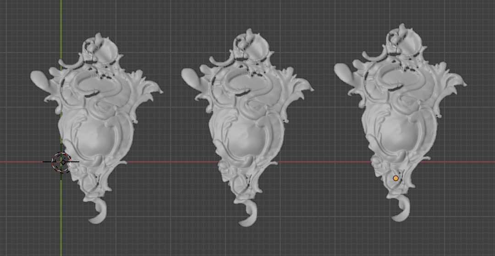
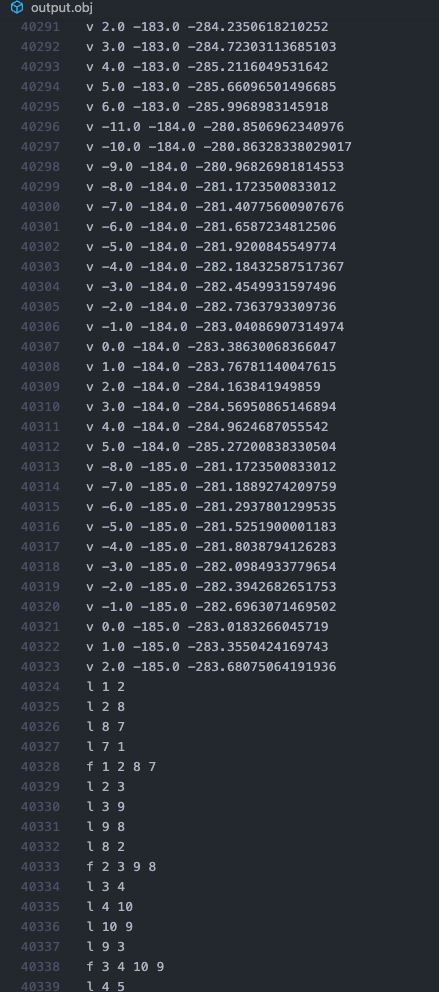
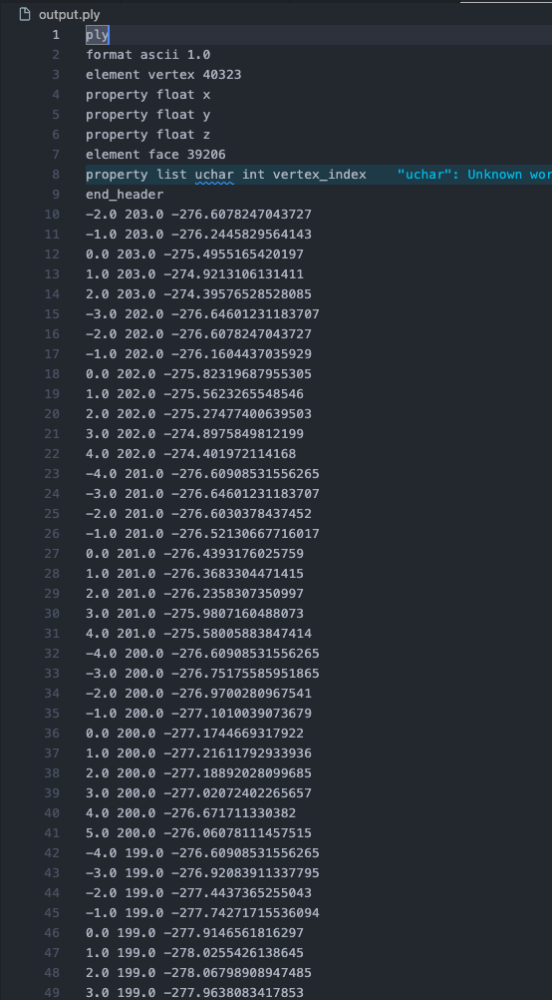
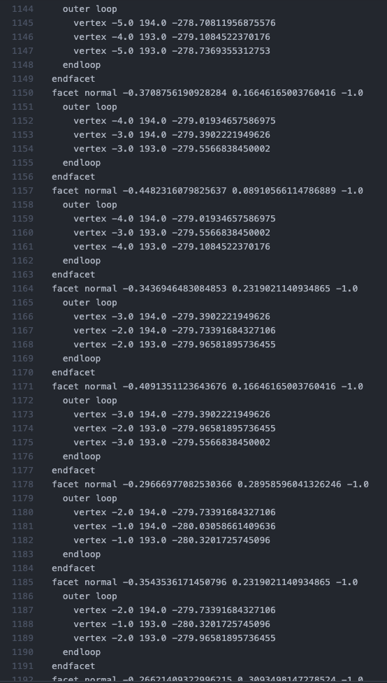

# Введение

## Задание

Разработать программу, используя язык программирования согласно
варианту, позволяющую:

1. Считать из исходного файла карту глубины заданной размерности.
Использовать исходный файл или поток данных стереокамеры, см. раздел 1.
Использование сторонних файлов bmp не допускается! Имя файла карты
глубины задается в файле JSON.
2. Визуализировать трехмерную оболочку, относящуюся к
рассматриваемому объекту (формат карты глубины представлен в разделе 1) с
использованием библиотеки OpenGL. Критерием визуализации является
возможность проверки правильности считанной карты глубины и
возможность сравнения с результатом в выходном файле. Сформировать
согласно заданным в файле JSON положению источника света и наблюдателя
изображение объекта в формате .bmp или попиксельно отобразить в Canvas в
соответствии с вариантом. Возможная модель отражения поверхности
выбираются в соответствии с вариантом и конфигурируется в файле JSON,
обработка файла конфигурации JSON позволяет осуществлять выбор одной из
трех моделей отражения.
3. Экспортировать оболочку объекта в файл в соответствии с вариантом
задания. Имя и формат выходного файла задается в файле JSON, необходимо
предоставить выбор как минимум из трех форматов выходного файла, для
хранения трехмерной оболочки.

**Вариант 5:** `.obj`, `C#`, модели отражения: Ламберта; Фонга; Торенса-Сперроу, Canvas.

Также как два дополнительных формата вывода был выбран `.stl` и `.ply`.

## Решение о смене языка

По причине того, что:

1) Разработка велась на `MacOS`;
2) Недавнему отказу поддержки `Visual Studio` на `MacOS` ([Источник](https://devblogs.microsoft.com/visualstudio/visual-studio-for-mac-retirement-announcement/));
3) Закончившийся в этом месяце лицензии `JetBrains Rider`;
4) Cырого, неудобного тулинга `C# + NuGet` в `VS Code`.

Было решено выбрать ЯП `Python`.

# Выполнение работы

В ходе работы был реализован скрипт на Python с использованием библиотек `NumPy` и `PyOpenGl`. Программа была разделена на функции для удобства поддержки и расширения. Также для соблюдения инкапсуляции было решено разделить программу на несколько библиотек. Исходный код доступен на [GitHub](https://github.com/vladcto/suai-labs/tree/main/7_semester/3D/4) или в Приложении.

Для начала была составлена схема для JSON.

```json
{
  "$schema": "http://json-schema.org/draft-07/schema#",
  "title": "Depth Map Configuration",
  "type": "object",
  "properties":
    {
      "name": { "type": "string", "description": "Имя файла с картой глубины" },
      "light_source":
        {
          "type": "object",
          "properties":
            {
              "position":
                {
                  "type": "array",
                  "description": "Трехмерная позиция источника света",
                  "items": { "type": "number" },
                  "minItems": 3,
                  "maxItems": 3
                }
            },
          "required": ["position"],
          "additionalProperties": false
        },
      "viewer":
        {
          "type": "object",
          "properties":
            {
              "position":
                {
                  "type": "array",
                  "description": "Трехмерная позиция наблюдателя",
                  "items": { "type": "number" },
                  "minItems": 3,
                  "maxItems": 3
                }
            },
          "required": ["position"],
          "additionalProperties": false
        },
      "reflection_model":
        {
          "type": "string",
          "description": "Модель отражения для использования в рендеринге",
          "enum": ["lambert", "phong", "torrance-sparrow"]
        },
      "export_format":
        {
          "type": "string",
          "description": "Формат для экспорта файлов",
          "enum": ["obj", "stl", "ply"]
        },
      "export_name":
        {
          "type": "string",
          "description": "Имя файла для экспорта без расширения"
        }
    },
  "required":
    [
      "name",
      "light_source",
      "viewer",
      "reflection_model",
      "export_format",
      "export_name"
    ],
  "additionalProperties": false
}
```

Затем были реализованы функции для чтения `JSON` файла и его преобразовании в 2D массив карты глубины.

```python
def read_json_file(json_filename):
    with open(json_filename, 'r') as file:
        data = json.load(file)
    return data['name'], data


def read_depth_map(depth_map_filename):
    with open(depth_map_filename, 'rb') as file:
        height = int(np.fromfile(file, dtype=np.float64, count=1)[0])
        width = int(np.fromfile(file, dtype=np.float64, count=1)[0])
        depth_map_array = np.fromfile(
            file, dtype=np.float64).reshape((height, width))
    return depth_map_array
```

Текущий код поддерживает настройку из `JSON` и немного забегая вперед покажем как это выглядит.

```python
# Read map
json_filename = 'depth_map_info.json'
depth_map_filename, config = read_json_file(json_filename)
depth_map_array = read_depth_map(depth_map_filename)

# Export map
export_format = config.get('export_format', 'obj')
output_filename = config.get('export_name', 'output')
export_depth_map_to_file(depth_map_array, export_format, output_filename)

# Show object
light_position = config['light_source']['position']
viewer_position = config['viewer']['position']
reflection_model = config.get('reflection_model', 'phong')
```

Затем была реализована библиотека для выбора формата экспорта карты глубины. Всего было реализовано 4 функции, 1 функция-маппер и 3 функции экспорта, составленные на основе официальной спецификации. Высокоуровневое описание работы алгоритма было представлено в лабораторной работе №3. Выбор формата и имени определяется на основе входного `JSON` файла.

```python
import numpy as np


def _calculate_normal(p1, p2, p3):
    u = np.array(p2) - np.array(p1)
    v = np.array(p3) - np.array(p1)
    return np.cross(u, v)

def _export_to_obj(filename, depth_map_array):
    height, width = depth_map_array.shape
    vertices = []
    indices = {}

    with open(filename, 'w') as file:
        vertex_id = 1
        for i in range(height):
            for j in range(width):
                depth = depth_map_array[i, j]
                if depth != 0:
                    vertex = (j - width / 2, height / 2 - i, -depth)
                    indices[(i, j)] = vertex_id
                    vertices.append(vertex)
                    file.write(f'v {vertex[0]} {vertex[1]} {vertex[2]}\n')
                    vertex_id += 1

        for i in range(height - 1):
            for j in range(width - 1):
                if (depth_map_array[i, j] != 0 and
                    depth_map_array[i, j + 1] != 0 and
                    depth_map_array[i + 1, j] != 0 and
                        depth_map_array[i + 1, j + 1] != 0):

                    v1 = indices[(i, j)]
                    v2 = indices[(i, j + 1)]
                    v3 = indices[(i + 1, j + 1)]
                    v4 = indices[(i + 1, j)]

                    file.write(f"l {v1} {v2}\n")
                    file.write(f"l {v2} {v3}\n")
                    file.write(f"l {v3} {v4}\n")
                    file.write(f"l {v4} {v1}\n")

                    file.write(f"f {v1} {v2} {v3} {v4}\n")


def _export_to_stl(filename, depth_map_array):
    # TODO: extract open file in new method
    height, width = depth_map_array.shape
    with open(filename, 'w') as file:
        file.write('solid depth_map\n')
        for i in range(height - 1):
            for j in range(width - 1):
                if (depth_map_array[i, j] != 0 and
                    depth_map_array[i, j + 1] != 0 and
                    depth_map_array[i + 1, j] != 0 and
                        depth_map_array[i + 1, j + 1] != 0):

                    vertices = [
                        [j - width / 2, height / 2 - i, -depth_map_array[i, j]],
                        [j + 1 - width / 2, height / 2 -
                            i, -depth_map_array[i, j + 1]],
                        [j + 1 - width / 2, height / 2 -
                            (i + 1), -depth_map_array[i + 1, j + 1]],
                        [j - width / 2, height / 2 -
                            (i + 1), -depth_map_array[i + 1, j]]
                    ]

                    for k in range(2):
                        triangle = (
                            vertices[0], vertices[k + 1], vertices[k + 2])
                        normal = _calculate_normal(*triangle)
                        normal_string = ' '.join(map(str, normal))
                        file.write(f'facet normal {normal_string}\n')
                        file.write('  outer loop\n')
                        for vertex in triangle:
                            vertex_string = ' '.join(map(str, vertex))
                            file.write(f'    vertex {vertex_string}\n')
                        file.write('  endloop\n')
                        file.write('endfacet\n')
        file.write('endsolid depth_map\n')


def _export_to_ply(filename, depth_map_array):
    height, width = depth_map_array.shape
    vertices = []
    indices = {}
    faces = []

    for i in range(height):
        for j in range(width):
            depth = depth_map_array[i, j]
            if depth != 0:
                vertex = (j - width / 2, height / 2 - i, -depth)
                indices[(i, j)] = len(vertices)
                vertices.append(vertex)

    for i in range(height - 1):
        for j in range(width - 1):
            if (depth_map_array[i, j] != 0 and
                depth_map_array[i, j + 1] != 0 and
                depth_map_array[i + 1, j] != 0 and
                    depth_map_array[i + 1, j + 1] != 0):

                v1 = indices[(i, j)]
                v2 = indices[(i, j + 1)]
                v3 = indices[(i + 1, j + 1)]
                v4 = indices[(i + 1, j)]

                faces.append((v1, v2, v3, v4))

    with open(filename, 'w') as file:
        file.write("ply\n")
        file.write("format ascii 1.0\n")
        file.write(f"element vertex {len(vertices)}\n")
        file.write("property float x\n")
        file.write("property float y\n")
        file.write("property float z\n")
        file.write(f"element face {len(faces)}\n")
        file.write("property list uchar int vertex_index\n")
        file.write("end_header\n")

        for vertex in vertices:
            file.write(f"{vertex[0]} {vertex[1]} {vertex[2]}\n")

        for face in faces:
            file.write(f"4 {face[0]} {face[1]} {face[2]} {face[3]}\n")


def export_depth_map_to_file(depth_map_array, export_format, output_filename):
    output_path = f"{output_filename}.{export_format}"

    if export_format == 'obj':
        _export_to_obj(output_path, depth_map_array)
    elif export_format == 'stl':
        _export_to_stl(output_path, depth_map_array)
    elif export_format == 'ply':
        _export_to_ply(output_path, depth_map_array)
```

Затем по подобию с функциями для экспорта, были составлены функции для моделей отражения. Кастомизация параметров задается напрямую в исходном коде, за исключением направления источника освещения - оно задается из `JSON`. Текущая настройка позволяет создать максимально схожую модель освещения между тремя моделями.

```python
import numpy as np


def _lambert_reflection(normal, light_source):
    light_vector = np.array(light_source) / np.linalg.norm(light_source)
    normal_vector = np.array(normal) / np.linalg.norm(normal)
    dot = np.dot(normal_vector, light_vector)
    intensity = max(dot, 0)
    return (intensity, intensity, intensity)


def _torrance_sparrow_reflection(normal, light_source, viewer):
    light_vector = np.array(light_source) / np.linalg.norm(light_source)
    normal_vector = np.array(normal) / np.linalg.norm(normal)
    viewer_vector = np.array(viewer) / np.linalg.norm(viewer)

    roughness = 0.5
    f0 = 0.04

    half_vector = (light_vector + viewer_vector) / \
        np.linalg.norm(light_vector + viewer_vector)
    dot_l_n = max(np.dot(light_vector, normal_vector), 0)
    dot_v_n = max(np.dot(viewer_vector, normal_vector), 0)
    dot_h_n = max(np.dot(half_vector, normal_vector), 0)
    dot_h_v = max(np.dot(half_vector, viewer_vector), 0)

    F = f0 + (1 - f0) * (1 - dot_h_v) ** 5

    G = min(1, min((2 * dot_h_n * dot_v_n) / dot_h_v,
            (2 * dot_h_n * dot_l_n) / dot_h_v))

    alpha = roughness ** 2
    denom = (dot_h_n ** 2) * (alpha ** 2) + (1 - (dot_h_n) ** 2)
    D = alpha ** 2 / (np.pi * (denom ** 2))

    specular_intensity = (F * D * G) / (4 * dot_l_n * dot_v_n + 1e-7)
    diffuse_intensity = dot_l_n

    intensity = 0.1 + 0.9 * (diffuse_intensity + specular_intensity)
    intensity = min(intensity, 1)

    return (intensity, intensity, intensity)


def _phong_reflection(normal, light_source, viewer):
    light_vector = np.array(light_source) / np.linalg.norm(light_source)
    normal_vector = np.array(normal) / np.linalg.norm(normal)
    viewer_vector = np.array(viewer) / np.linalg.norm(viewer)

    ambient = 0.1
    diffuse_coefficient = 0.7
    specular_coefficient = 0.2
    shininess = 32

    ambient_color = ambient

    dot_l_n = max(np.dot(light_vector, normal_vector), 0)
    diffuse_color = diffuse_coefficient * dot_l_n

    reflection_vector = 2 * normal_vector * dot_l_n - light_vector
    dot_r_v = max(np.dot(reflection_vector, viewer_vector), 0)
    specular_color = specular_coefficient * (dot_r_v ** shininess)

    intensity = ambient_color + diffuse_color + specular_color
    intensity = min(intensity, 1)

    return (intensity, intensity, intensity)

def get_color(normal, light_source, viewer, model):
    if model == 'lambert':
        return _lambert_reflection(normal, light_source)
    elif model == 'phong':
        return _phong_reflection(normal, light_source, viewer)
    elif model == 'torrance-sparrow':
        return _torrance_sparrow_reflection(normal, light_source, viewer)
```

Затем на основе библиотеки выше, мы смогли обновить код функции рендеринга для поддержки освещенности грани `get_color`. Также было добавлено управление камерой на основе входных данных. В остальном логика функции не изменилась от 3 лабораторной работы.

```python
def calculate_normal(p1, p2, p3):
    u = np.array(p2) - np.array(p1)
    v = np.array(p3) - np.array(p1)
    return np.cross(u, v)

def display(depth_map_array, light_position, viewer_position, reflection_model):
    glClear(GL_COLOR_BUFFER_BIT | GL_DEPTH_BUFFER_BIT)
    glLoadIdentity()

    glMatrixMode(GL_MODELVIEW)
    glLoadIdentity()

    gluLookAt(viewer_position[0], viewer_position[1], viewer_position[2],
              0, 0, 0,
              0, 1, 0)

    height, width = depth_map_array.shape
    max_depth = np.max(depth_map_array) if np.max(depth_map_array) != 0 else 1
    scale_factor = 200

    glBegin(GL_QUADS)
    for i in range(height - 1):
        for j in range(width - 1):
            if (depth_map_array[i, j] != 0 and
                depth_map_array[i, j + 1] != 0 and
                depth_map_array[i + 1, j] != 0 and
                    depth_map_array[i + 1, j + 1] != 0):

                vertices = [
                    ((j - width / 2) / width, (height / 2 - i) /
                     height, -depth_map_array[i, j] / max_depth),
                    (((j + 1) - width / 2) / width, (height / 2 - i) /
                     height, -depth_map_array[i, j + 1] / max_depth),
                    (((j + 1) - width / 2) / width, (height / 2 - (i + 1)) /
                     height, -depth_map_array[i + 1, j + 1] / max_depth),
                    ((j - width / 2) / width, (height / 2 - (i + 1)) /
                     height, -depth_map_array[i + 1, j] / max_depth)
                ]

                normal = calculate_normal(
                    vertices[0], vertices[1], vertices[2])
                color = get_color(normal, light_position,
                                  viewer_position, reflection_model)

                glColor3f(*color)
                for vertex in vertices:
                    glVertex3f(vertex[0] * scale_factor, vertex[1]
                               * scale_factor, vertex[2] * scale_factor)
    glEnd()

    glutSwapBuffers()
```

Затем мы подключили написанные нами библиотеки и составили программу из функций. На вход она принимает `JSON` конфигурацию, а затем на основе карты глубины составляет визуализацию модели с освещением, а также требуемый файл нужного формата.

```python
# Read map
json_filename = 'depth_map_info.json'
depth_map_filename, config = read_json_file(json_filename)
depth_map_array = read_depth_map(depth_map_filename)

# Export map
export_format = config.get('export_format', 'obj')
output_filename = config.get('export_name', 'output')
export_depth_map_to_file(depth_map_array, export_format, output_filename)

# Show object
light_position = config['light_source']['position']
viewer_position = config['viewer']['position']
reflection_model = config.get('reflection_model', 'phong')

init_glut(
    lambda: display(
        depth_map_array,
        light_position,
        viewer_position,
        reflection_model
    )
)
glutMainLoop()
```

## Тестирование работы

Для тестирования мы провели следующее:

1) Составили наш тестовый `JSON` файл. Сделали 3 дубликата, с разными типами форматов и моделей отражения.
2) Проверили отрисовку нашей оболочки используя `OpenGl`. Повторили для каждой модели отражения.
3) Проверили правильность экспорта карты глубины в 3 формата в `Blender`.








<m>

<m>

<l>

Как мы видим - модели совпадают, а освещение работает корректно => работа выполнена верно.

# ВЫВОД <suaidoc-center>

В результате выполнения лабораторной работы была создана программа на языке `Python`, считывающая и визуализирующая карту глубины, преобразующая карту глубины в формат `.obj`, `.ply`, `.stl`, а также применяющая 3 разные модели отражения. Вся конфигурация задается из `JSON` файла.

Получившийся исходный код было выложен на [GitHub](https://github.com/vladcto/suai-labs/tree/main/7_semester/3D/4), а также представлен в Приложении.

# ПРИЛОЖЕНИЕ <suaidoc-center>

**Листинг solve.py:**

\lstinputlisting{../solve.py}

**Листинг model_export.py:**

\lstinputlisting{../model_export.py}

**Листинг reflection_models.py:**

\lstinputlisting{../reflection_models.py}

**Листинг depth_map_info.json:**

\lstinputlisting{../depth_map_info.json}
