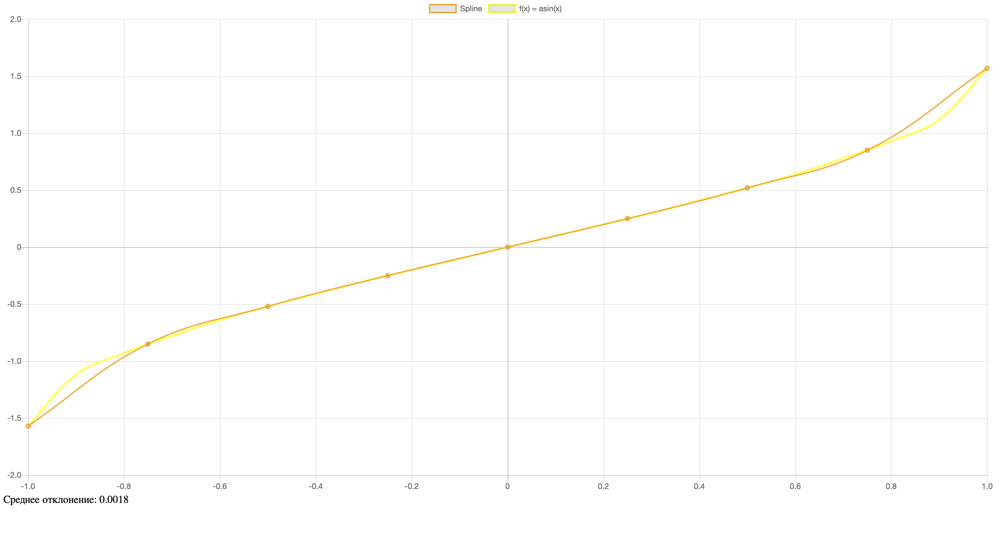
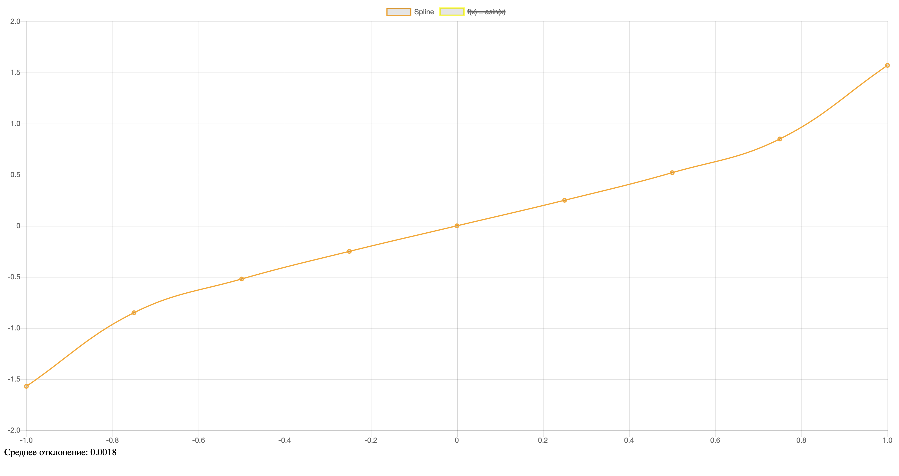
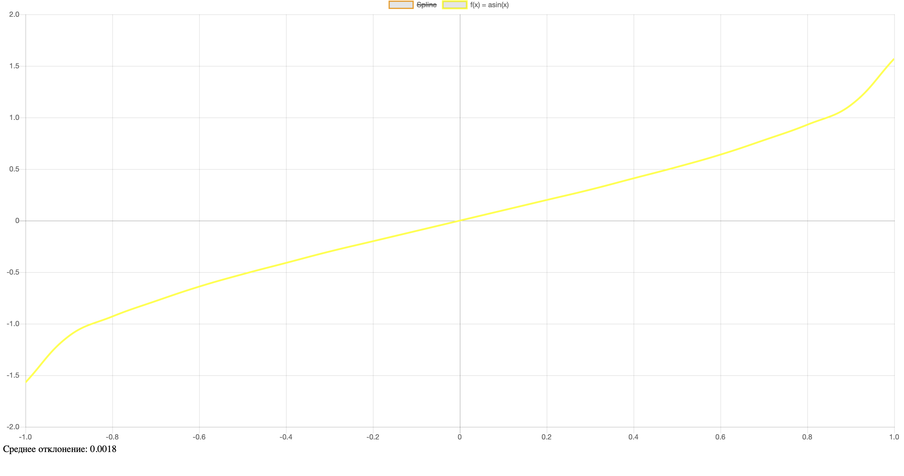

# Введение

## Цель работы

Закрепление знаний HTML, CSS и JavaScript, совершенствование навыков по алгоритмизации и программированию вычислительных задач.

Разработать web-страницу, содержащую график β-сплайна:

1. Построить график тригонометрической функции (tg, ctg, arccos, arcsin). График должен иметь оси, масштаб и легенду.
2. На периоде, где задана исходная функция, взять N опорных точек, где N равно 4 плюс номер студента в группе.
3. На основе опорных точек из пункта 2 сплайновую кривую (на том же графике, что и в пункте 1).
4. Рассчитать ошибку восстановления (погрешность) исходной функции сплайновой кривой.

Для выполнения первого задания была выбрана тригонометрическая функция arcsin. Средствами HTML и CSS был построен график.

# Выполнение работы

Для выполнения первого задания была выбрана тригонометрическая функция arcsin. Средствами HTML и CSS был построен график, изображенный на рисунке 2.1.

Для выполнения задания с построением сплайновой кривой было взято количество опорных точек, соответствующих варианту в журнале + 4. График сплайновой кривой изображен на рисунке 2.1.

На рисунке 2.3 представлен общий график сплайновой кривой и тригонометрической функции `arcsin`.

После построения была вычислена погрешность исходной функции сплайновой кривой её значение равняется `0.00018`.

# ВЫВОД <suaidoc-center>

В ходе выполнения лабораторной работы была разработана HTML-страница, на которой представлены два графика: график функции f(x)=asin(x) и график, построенный с использованием β-сплайновой кривой. Основной задаче было сравнении точности аппроксимации функции арксинуса с помощью сплайнов, что позволило оценить, насколько эффективно сплайн приближает данную функцию.

Для построения графиков была реализована функция для вычисления арксинуса, которая генерировала данные для основного графика. Также была разработана функция для построения β-сплайновой кривой на основе контрольных точек (узлов), которые были равномерно распределены по всему диапазону, что обеспечило максимально близкое построение к исходной функции.

Рассчитанное среднее отклонение показало, что сплайн достаточно близко приближает исходную функцию на заданном интервале с минимальной погрешностью – это демонстрирует высокую точность метода кубического сплайна для функции арксинуса.

Таким образом, в лабораторной работе продемонстрированы навыки создания визуализаций математических функций, использования β-сплайнов для аппроксимации и оценки ее точности .

# ПРИЛОЖЕНИЕ <suaidoc-center>

\lstinputlisting{main.html}

\lstinputlisting{script.js}

\lstinputlisting{styles.css}