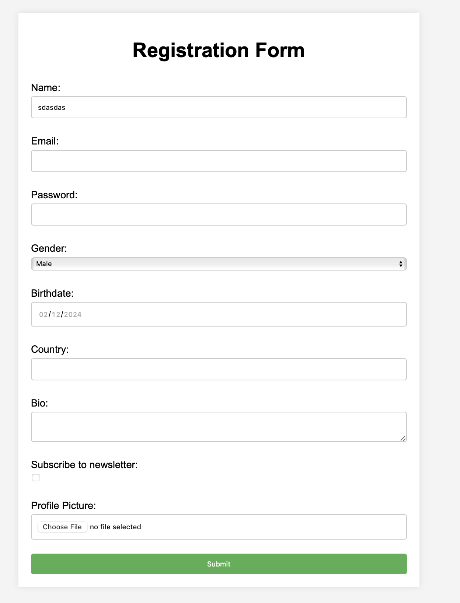
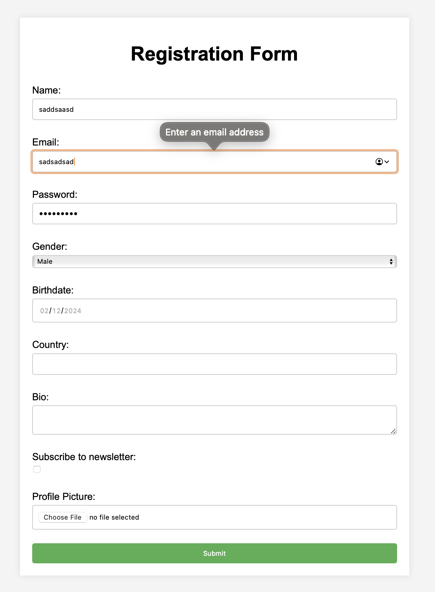

# Введение

## Цель работы

Создать папку с проектом, содержащую страницу с HTML-формой, каскадной таблицей стилей (CSS) и JS-скриптом в среде Node.JS.

- Разработать web-страницу, которая должна предлагать пользователю HTML-форму, включающую различные элементы (текстовые поля, списки, кнопки и т.д.). HTML-форма должна содержать не менее 10 различных элементов. HTML-форма должна иметь дизайн, разработанный средствами CSS. Тематика, для которой создается форма, определяется в соответствии с приложением А. HTML-форма должна иметь обязательные поля (input type="text") в соответствии с разделом «Варианты для лабораторных работ». РЕКОМЕНДУЕТСЯ использовать форму из Лабораторной работы № 5 «Создание форм в web-документах» по дисциплине «Web-технологии».

# Выполнение работы

В результате получилось создать страницы, изображенные на рис. 1-3. При неправильном вводе или отсутствии ввода там, где это необходимо, выводится соответствующее сообщение об этом. Для создания таблицы стилей для формы была использована технология flexbox. Результирующий код представлен в Приложении.

# ВЫВОД <suaidoc-center>

В ходе выполнения лабораторной работы были изучены основные принципы работы с сервером на базе Node.js. Был настроен сервер для обработки данных, отправленных через HTML-форму методом POST, что позволило эффективно обрабатывать ввод пользователя и формировать динамическую страницу с результатами. В процессе работы использовался модуль body-parser для корректного парсинга данных формы, что обеспечило корректную обработку информации, полученной от пользователя.

Данная работа позволила закрепить навыки организации серверной части приложения, обработки POST-запросов для получения данных из HTML-формы и дальнейшего формирования страницы с результатами.

# ПРИЛОЖЕНИЕ <suaidoc-center>

\lstinputlisting{public/index.html}

\lstinputlisting{public/styles.css}

\lstinputlisting{public/script.js}

\lstinputlisting{public/resultScript.js}

\lstinputlisting{public/result.html}

\lstinputlisting{index.js}