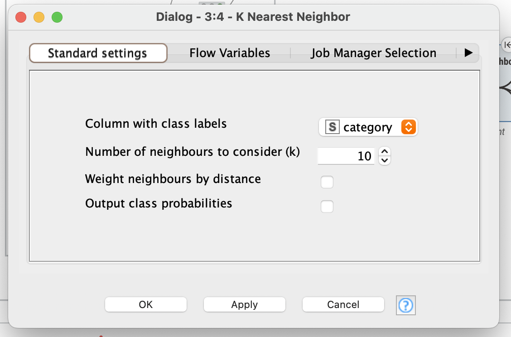
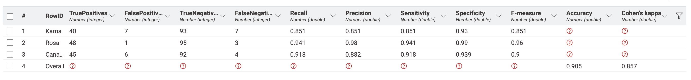

# Введение

## Цель лабораторной работы

Изучение основ организация работы с технологической платформой
для создания законченных аналитических решений KNIME, с
использованием метода k-ближайших соседей.

## Задание

1. Для набора данных выполнить классификацию методом k-ближайших соседей.

2. Выполнить оценку качества классификации.

# Выполнение работы

## Набор данных

Набор данных взят с [Kaggle](https://www.kaggle.com/datasets/sudhanshu2198/wheat-variety-classification).

Набор данных включает зерна пшеницы, принадлежащие к трем различным сортам пшеницы: **Кама, Роза и Канадская**, по 70 элементов каждый.

Для построения данных были измерены семь геометрических параметров зерен пшеницы:

1) Область — размер поверхности зерна пшеницы.
2) Периметр — общая длина внешней границы зерна.
3) Компактность — насколько форма зерна близка к идеальной круговой.
4) Длина ядра — измерение самой длинной оси внутренней части зерна пшеницы.
5) Ширина ядра — поперечное измерение внутренней части зерна.
6) Коэффициент асимметрии — отклонение формы зерна от симметричной.
7) Длина бороздки ядра — протяженность центральной линии или углубления в зерне.

Для каждого этого параметра был сопоставлен сорт пшеницы:

- **Кама** — сорт пшеницы, известный своей устойчивостью к болезням и приспособленностью к различным климатическим условиям.
- **Роза** — сорт пшеницы, который ценится за качество зерна и применяется для муки высшего сорта.
- **Канадская** — сорт пшеницы с высоким содержанием белка, используемый для производства высококачественной муки.

## Рабочий процесс

Целью создания данной системы является проверка гипотезы,
что вышеуказанных 7 параметров достаточно для определения сорта пшеницы. Гипотезу будем считать доказанной, если точность составит `95%`.

Для создания модели в программе KNIME создаём следующие узлы:

- `Excel Reader` для считывания файла;
- `Number to String` для преобразования номера сорта пшеницы в строку.
- `String Manipulation` для сопоставления номера сорта с его названием.
- `Color Manager` для цветового разделения на графике;
- `Partitioning` для разделения данных на обучающие и тестовые
(60/40);
- `K Nearest Neighbor` для поиска ближайших соседей и
прогнозирования;
- `3D Scatter Plot` для графического представления кластеров;
- `Scorer` для вычисления статистики.

На рисунке \ref{fig:Cхема в KNIME} представлена схема рабочего процесса.

Так как набор данных не слишком большой было решено выбрать k = 10. Окно настройки предсказательного блока представлено на рисунке 2.

Из 133 тестовых неверно предсказанных 14, то есть точность равна `90.476%`. На рисунке 3 представлена матрица сопряженности. На рисунке 4 – метрики оценки качества.

Из метрик оценки качества следует то, что полнота определения сорта Роза равна `0.941`, а точность `0.98`,
из чего следует, что модели удалось обучиться для определения этого сорта. Тем не менее, для сорта Кама и Канадского точность низкая - а значит не дает нам подтвердить гипотезу о 7 параметрах для однозначного определения сорта пшеницы.

Для примера также предоставим распределение сортов, в зависимости от длины/ширины/асимметрии.

# Вывод

Гипотеза не была доказана. Полученная точность `90.476%` при K ближайших соседей равном `10`. Точнее всего предсказывается сорт Роза.