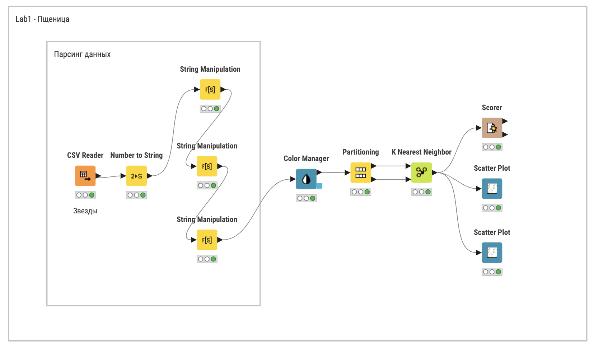
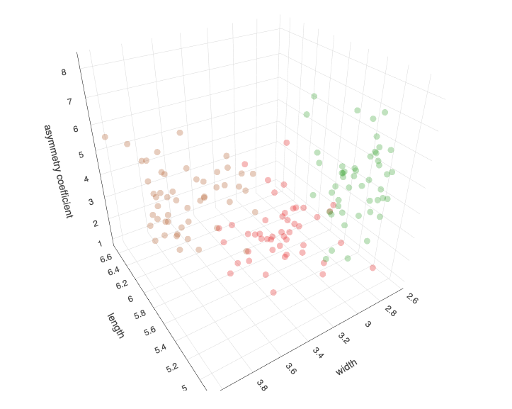
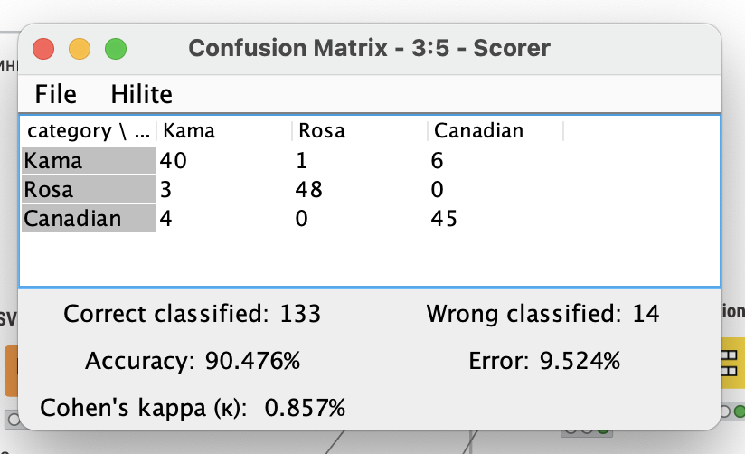
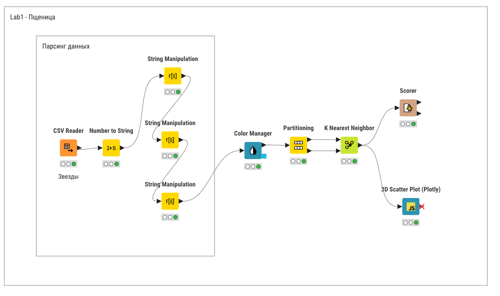
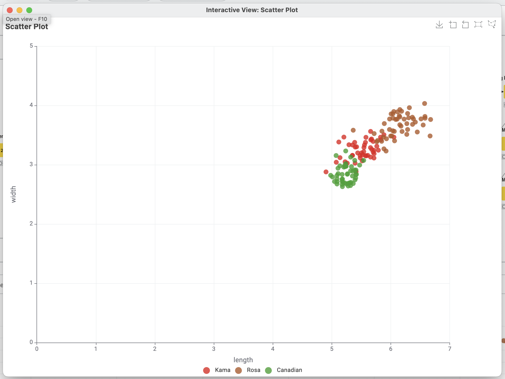

# Введение

## Цель лабораторной работы

Изучение основ организация работы с технологической платформой для создания аналитических решений KNIME, с использованием метода линейной регрессии.

## Задание

Реализовать процесс линейного анализа, используя самостоятельно выбранный набор данных и инструменты аналитической платформы KNIME.

# Ход работы

На рисунке \ref{fig:Cхема в KNIME} представлена схема рабочего процесса.

Для лабораторной работы был взят набор данных, содержащий информацию о легковых автомобилях. Набор данных состоит из 238 записей со полями:

1) Пол. 0 - мужчина, 1 - женщина
2) Возраст. 0 - до 18, 1 - после
3) Обьем мозга в $см^3$.
4) Вес мозга в граммах.

На рисунке \ref{fig:Узел Linear Regression Learner} представлена настройка узла вычисления линейной зависимости.

На рисунке \ref{fig:Результаты прогнозирования} представлены фрагмент результата прогнозирования. В столбце `Brain Weight` представлены исходные значения веса мозга, а в столбце `Predication(Brain Weight)` – прогнозируемые значения. Проанализировав результат, можно выявить следующую закономерность: чем больший обьем имеет мозг, тем больше он весит.

Коэффициент детерминации (R2) имеет приближенное значение к ~0.6, следовательно, модель можно использовать для грубых расчетов.

В лабораторной работе рассматриваем связь между одной входной (обьем мозга) и одной выходной (масса мозга) — это простая регрессия, которая описывается уравнением y=a+bx, где y-это зависимая переменная, а-свободный член линии, b – угловой коэффициент.

На рисунке \ref{fig:Графики модели} представлена визуализация распределения данных. На горизонтальной оси откладываются значения мощности двигателя (л/с), а на вертикальной – прогнозируемое значение максимальной скорости (км/ч).

Анализируя полученный график, можно явно отследить линейную зависимость массы мозга от его обьема.

# Вывод

В результате анализа набора данных была выявлена линейная зависимость между обьемом мозга и его массой. Также была оценена точность модели путём вычисления коэффициента детерминации равного ~ 0,651 из чего можно сделать вывод о том, что хоть и модель можно использовать для предсказания, тем не менее возможно для модели мозга есть неучтенные параметры или линейная регрессия не отражает зависимость веса мозга от его обьема.