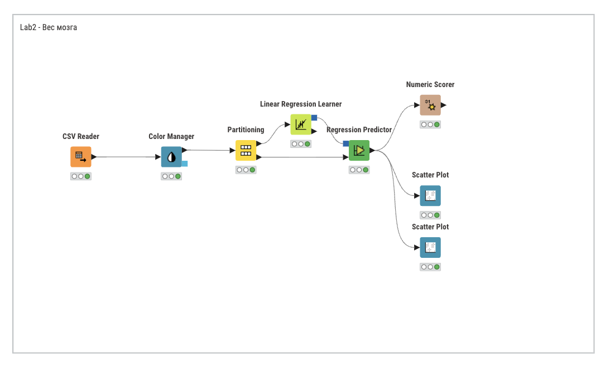
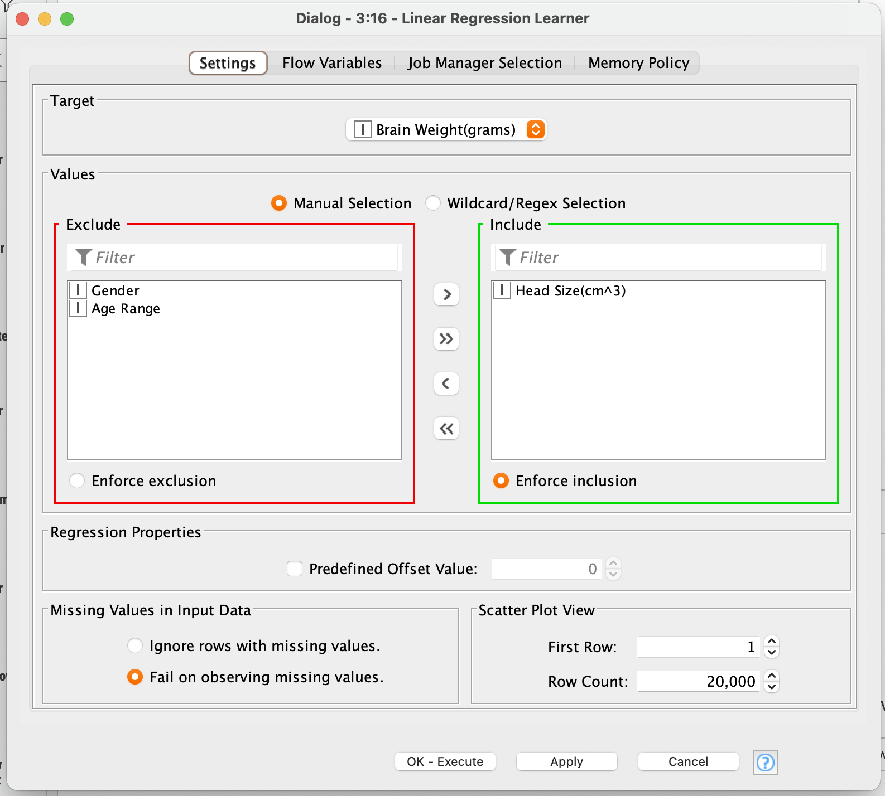
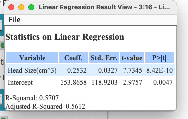
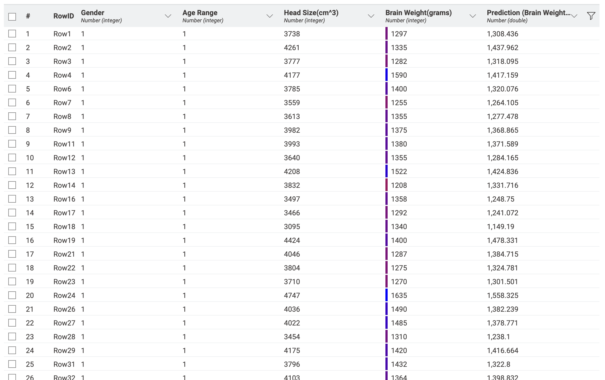
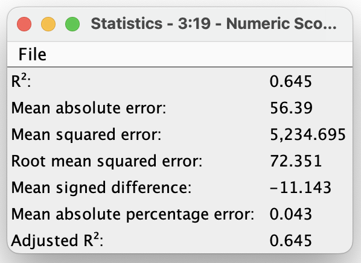
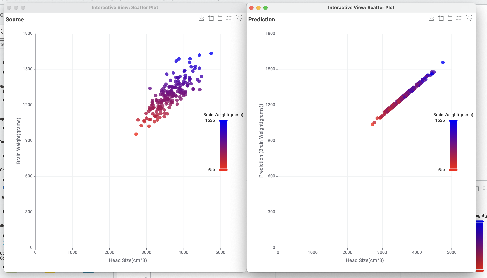

# Введение

## Цель лабораторной работы

Изучение основ организация работы с технологической платформой для создания аналитических решений KNIME, с использованием метода линейной регрессии.

## Задание

Реализовать процесс линейного анализа, используя самостоятельно выбранный набор данных и инструменты аналитической платформы KNIME.

# Ход работы

Для выполнения работы была взята задача исследовать наличие
зависимости массы мозга от его обьема.

На рисунке \ref{fig:Cхема в KNIME} представлена схема рабочего процесса для линейной регрессии.

Для лабораторной работы был взят набор данных, содержащий информацию о мозге человека. Датасет взят с [Kaggle](https://www.kaggle.com/datasets/anubhabswain/brain-weight-in-humans). Набор данных состоит из 238 записей со полями:

1) Пол. 0 - мужчина, 1 - женщина
2) Возраст. 0 - до 18, 1 - после
3) Обьем мозга в $см^3$.
4) Вес мозга в граммах.

На рисунке \ref{fig:Узел Linear Regression Learner} представлена настройка узла вычисления линейной зависимости. Линейная регрессия — это простая регрессия, которая описывается уравнением `y=a+bx`, где `y` - это зависимая переменная, `а` - свободный член линии, `b` – угловой коэффициент. В нашей модели `a = 353.8568`, а `b = 0.2532`. 

На рисунке \ref{fig:Результаты прогнозирования} представлен фрагмент результата прогнозирования. В столбце `Brain Weight` представлены исходные значения веса мозга, а в столбце `Predication(Brain Weight)` – прогнозируемые значения. Проанализировав результат, можно выявить следующую закономерность: чем больший обьем имеет мозг, тем больше он весит.

Коэффициент детерминации ($R^2$) имеет приближенное значение к `~0.6`, что опровергают гипотезу о том,
что масса мозга зависит от его размера.

На рисунке \ref{fig:Графики модели} представлена визуализация распределения данных. На горизонтальной оси откладываются значения обьема головы в $м^3$, а на вертикальной – масса мозга в граммах.

# Вывод

В результате анализа построенной модели линейной регрессии был получен коэффициент детерминации $R^2$ равный $~ 0.651$. Так как $R^2 < 0.8$, то можно сделать вывод, что изначальная гипотеза (масса мозга линейно связана с его обьемом) - опровергнута.
