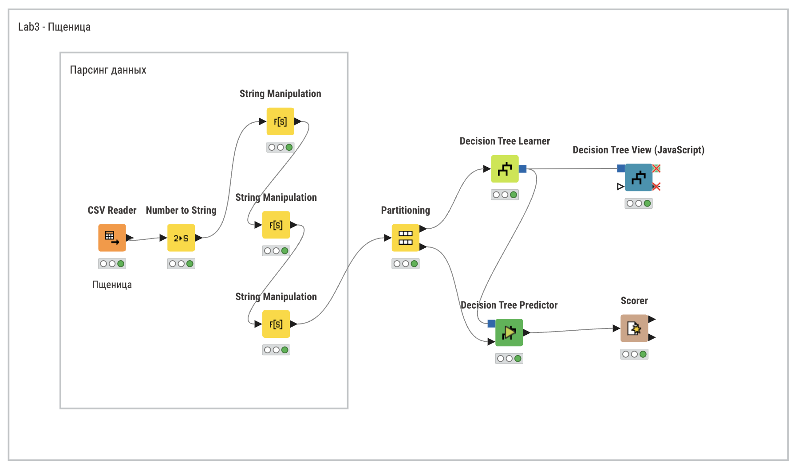
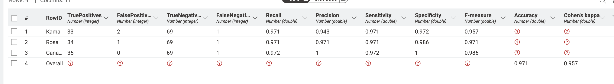

# Введение

## Цель лабораторной работы

Изучение основ организация работы с технологической платформой
для создания законченных аналитических решений KNIME, с 
использованием метода деревьев решений.

## Задание

1. Для набора данных выполнить классификацию методом дерева
решений.

2. Выполнить оценку качества классификации.

3. Построить дерево решений и выявить набор логических правил.

# Выполнение работы

## Набор данных

Набор данных взят с [Kaggle](https://www.kaggle.com/datasets/sudhanshu2198/wheat-variety-classification).

Набор данных включает зерна пшеницы, принадлежащие к трем различным сортам пшеницы: **Кама, Роза и Канадская**, по 70 элементов каждый.

Для построения данных были измерены семь геометрических параметров зерен пшеницы:

1) Область — размер поверхности зерна пшеницы.
2) Периметр — общая длина внешней границы зерна.
3) Компактность — насколько форма зерна близка к идеальной круговой.
4) Длина ядра — измерение самой длинной оси внутренней части зерна пшеницы.
5) Ширина ядра — поперечное измерение внутренней части зерна.
6) Коэффициент асимметрии — отклонение формы зерна от симметричной.
7) Длина бороздки ядра — протяженность центральной линии или углубления в зерне.

Для каждого этого параметра был сопоставлен сорт пшеницы:

- **Кама** — сорт пшеницы, известный своей устойчивостью к болезням и приспособленностью к различным климатическим условиям.
- **Роза** — сорт пшеницы, который ценится за качество зерна и применяется для муки высшего сорта.
- **Канадская** — сорт пшеницы с высоким содержанием белка, используемый для производства высококачественной муки.

## Рабочий процесс

Целью создания данной системы является проверка гипотезы,
что вышеуказанных 7 параметров достаточно для определения сорта пшеницы. Гипотезу будем считать доказанной, если точность составит `95%`.

Для создания модели в программе KNIME создаём следующие узлы:

- `Excel Reader` для считывания файла;
- `Number to String` для преобразования номера сорта пшеницы в строку.
- `String Manipulation` для сопоставления номера сорта с его названием.
- `Color Manager` для цветового разделения на графике;
- `Partitioning` для разделения данных на обучающие и тестовые(50/50). Дополнительно выбран `Linear Sampling`, так как набор данных отсортирован по сорту пшеницы;
- `Decision Tree Learner` для обучения модели
- `Decision Tree Predictor` для непосредственно прогнозирования;
- `Scorer` для вычисления статистики;
- `Decision` Tree View для графического представления дерева.

На рисунке \ref{fig:Cхема в KNIME} представлена схема рабочего процесса.

В результате выполнения процесса были получены матрица смежности и метрики для оценки качества метода.

Из полученных метрик можно сделать вывод, что ошибочных предсказаний `~ 3%`. Лучше всего предсказывался сорт Канадский. Между оставшимися двумя другими существенных различий нет.

Далее было получено дерево решений.

На основе дерева решений можно вынести следующие правила:

**Сорт Роза:**

1) Длина бороздки ядра > 5.60.

**Cорт Кама:**

1) Длина бороздки ядра =< 4.72 `И` область =< 12.71;
2) Длина бороздки ядра =< 5.60 `И` Область > 12.71 `И` периметр > 13.49 `И` коэффициент асимметрии =< 4.43;
3) Длина бороздки ядра =< 5.60 `И` Область > 12.71 `И` периметр > 13.49 `И` коэффициент асимметрии > 4.43 `И` ширина > 3.21;

**Cорт Канадский:**

1) Длина бороздки ядра > 4.72 `И` область =< 12.71;
2) Длина бороздки ядра =< 5.60 `И` Область > 12.71 `И` периметр =< 13.49;
3) Длина бороздки ядра =< 5.60 `И` Область > 12.71 `И` периметр > 13.49 `И` коэффициент асимметрии > 4.43 `И` ширина =< 3.21;

# Вывод

В ходе использования дерева решений была получена точность `97%`. Есть ложноположительные определения сорта Камы, но им можно пренебречь ввиду маленького размера данных. Вышесказанное подтверждает поставленную гипотезу, что на основе 7 параметров можно предсказать сорт пшеницы.
