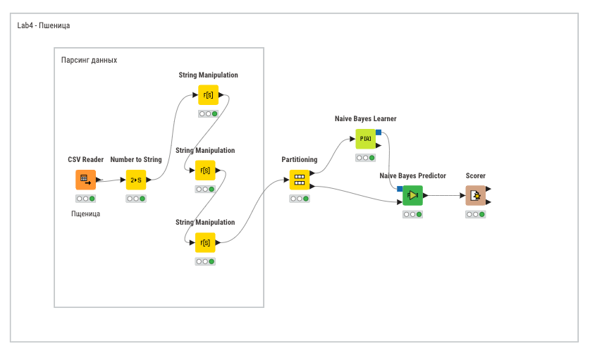
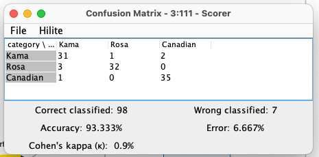
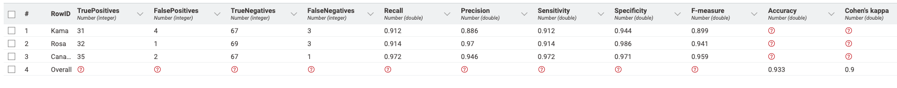
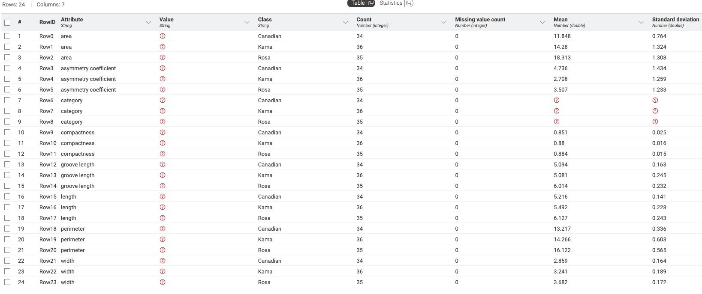
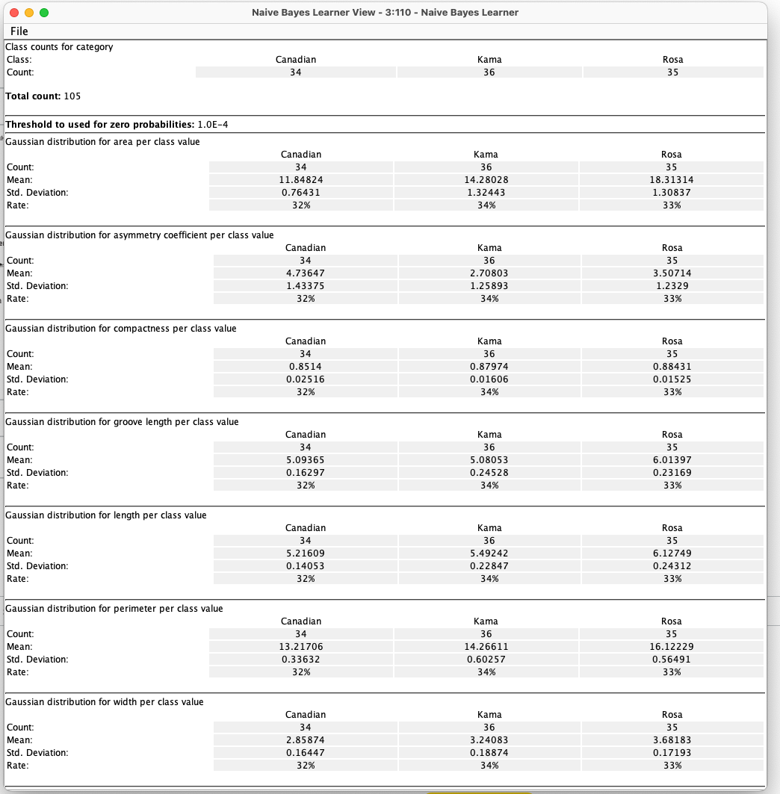

# Введение

## Цель лабораторной работы

Изучение основ организации работы с технологической платформой
для создания законченных аналитических решений использованием наивного
Байесовского подхода.

## Задание

1. Для набора данных выполнить классификацию с помощью
Байесовского подхода.
2. Выполнить оценку качества классификации.

# Выполнение работы

## Набор данных

Набор данных взят с [Kaggle](https://www.kaggle.com/datasets/sudhanshu2198/wheat-variety-classification).

Набор данных включает зерна пшеницы, принадлежащие к трем различным сортам пшеницы: **Кама, Роза и Канадская**, по 70 элементов каждый.

Для построения данных были измерены семь геометрических параметров зерен пшеницы:

1) Область — размер поверхности зерна пшеницы.
2) Периметр — общая длина внешней границы зерна.
3) Компактность — насколько форма зерна близка к идеальной круговой.
4) Длина ядра — измерение самой длинной оси внутренней части зерна пшеницы.
5) Ширина ядра — поперечное измерение внутренней части зерна.
6) Коэффициент асимметрии — отклонение формы зерна от симметричной.
7) Длина бороздки ядра — протяженность центральной линии или углубления в зерне.

Для каждого этого параметра был сопоставлен сорт пшеницы:

- **Кама** — сорт пшеницы, известный своей устойчивостью к болезням и приспособленностью к различным климатическим условиям.
- **Роза** — сорт пшеницы, который ценится за качество зерна и применяется для муки высшего сорта.
- **Канадская** — сорт пшеницы с высоким содержанием белка, используемый для производства высококачественной муки.

## Рабочий процесс

Целью создания данной системы является проверка гипотезы,
что вышеуказанных 7 параметров достаточно для определения сорта пшеницы. Гипотезу будем считать доказанной, если точность составит `95%`.

Для создания модели в программе KNIME создаём следующие узлы:

- `Excel Reader` для считывания файла;
- `Number to String` для преобразования номера сорта пшеницы в строку.
- `String Manipulation` для сопоставления номера сорта с его названием.
- `Color Manager` для цветового разделения на графике;
- `Partitioning` для разделения данных на обучающие и тестовые(50/50). Дополнительно выбран `Linear Sampling`, так как набор данных отсортирован по сорту пшеницы;
- `Naive Bayes Learner` для обучения модели;
- `Naive Bayes Predictor` непосредственно для предсказания;
- `Scorer` для вычисления статистики;

На рисунке \ref{fig:Cхема в KNIME} представлена схема рабочего процесса.

В результате из 98 тестовых записей 91 предсказаны верно, а 7 нет. Точность попадания равняется `93.333%`. На рисунке 2 представлена матрица сопряженности. На рисунке 3 – метрики оценки качества.

Из метрик оценки качества следует, что как и для метода дерево решений, лучше всего определяется сорт канадский.
У этого сорта самая высокая точность и полнота. Сорт Кама определяется хуже всего, если полнота примерно равна сорту Роза, то точность - ниже. Cорт Кама чаще всего путается с сортом Роза.

На рисунке 4 представлена таблица результатов обучения модели,
демонстрирующая средние значения атрибутов по классам и их стандартное
отклонение. Можно сделать вывод, что сорт Кама чаще всего путается с сортом Роза по таким параметрам: ширина и компактность.

# Вывод

Полученная точность `93.333%` при наивном байесовском подходе, что
больше `90.476%` при методе K ближайших соседей, но всё равно остается недостаточным
для подтверждения гипотезы. К тому же точность предсказания сорта Кама равняется `~ 85%`,
что делает модель худшей для определения этого сорта.