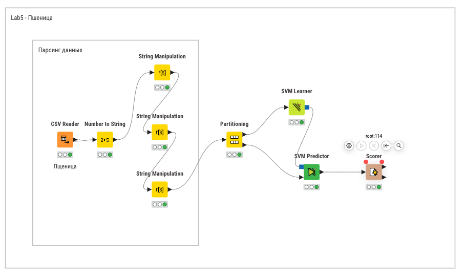
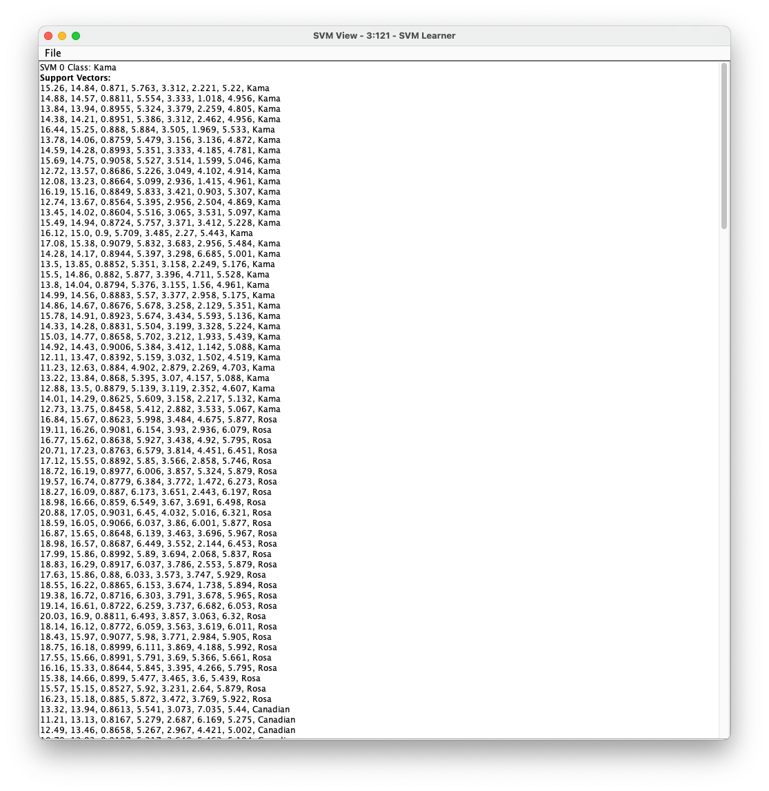
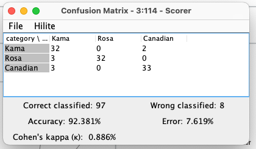
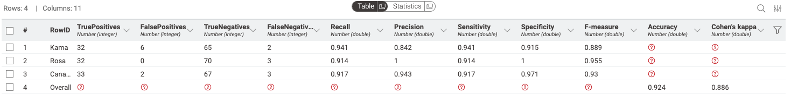

# Введение

## Цель лабораторной работы

Изучение основ организация работы с технологической платформой
для создания законченных аналитических решений использованием метода
машинных опорных векторов.

## Задание

1. Для набора данных выполнить классификацию с помощью метода
машинных опорных векторов.
2. Выполнить оценку качества классификации.

# Выполнение работы

## Набор данных

Набор данных взят с [Kaggle](https://www.kaggle.com/datasets/sudhanshu2198/wheat-variety-classification).

Набор данных включает зерна пшеницы, принадлежащие к трем различным сортам пшеницы: **Кама, Роза и Канадская**, по 70 элементов каждый.

Для построения данных были измерены семь геометрических параметров зерен пшеницы:

1) Область — размер поверхности зерна пшеницы.
2) Периметр — общая длина внешней границы зерна.
3) Компактность — насколько форма зерна близка к идеальной круговой.
4) Длина ядра — измерение самой длинной оси внутренней части зерна пшеницы.
5) Ширина ядра — поперечное измерение внутренней части зерна.
6) Коэффициент асимметрии — отклонение формы зерна от симметричной.
7) Длина бороздки ядра — протяженность центральной линии или углубления в зерне.

Для каждого этого параметра был сопоставлен сорт пшеницы:

- **Кама** — сорт пшеницы, известный своей устойчивостью к болезням и приспособленностью к различным климатическим условиям.
- **Роза** — сорт пшеницы, который ценится за качество зерна и применяется для муки высшего сорта.
- **Канадская** — сорт пшеницы с высоким содержанием белка, используемый для производства высококачественной муки.

## Рабочий процесс

Целью создания данной системы является проверка гипотезы,
что вышеуказанных 7 параметров достаточно для определения сорта пшеницы. Гипотезу будем считать доказанной, если точность составит `95%`.

Для создания модели в программе KNIME создаём следующие узлы:

- `Excel Reader` для считывания файла;
- `Number to String` для преобразования номера сорта пшеницы в строку.
- `String Manipulation` для сопоставления номера сорта с его названием.
- `Color Manager` для цветового разделения на графике;
- `Partitioning` для разделения данных на обучающие и тестовые(50/50). Дополнительно выбран `Linear Sampling`, так как набор данных отсортирован по сорту пшеницы;
- `SVM Learner` для обучения модели;
- `SVM Predictor` непосредственно для предсказания;
- `Scorer` для вычисления статистики;

На рисунке \ref{fig:Схема в KNIME} представлена схема рабочего процесса.

.

После выполнения процесса были получены: фрагмент опорных векторов, матрица смежности и метрики оценки качества.

Из метрик оценки качества следует, что определение сорта Розы на `100%` верное, тем не менее сама полнота определения сорта `~ 0.941`. Доля ошибок в определении всех сортов составляет `7.619%`. Сорт Кама в очередной раз показывает наибольшее количество ложноположительных срабатываний при исходном сорте Роза. К тому же сорт Кама обладает самой низкой точностью равной `0.842`.

# Вывод

Полученная точность составляет `92.381%`, что чуть хуже, чем у наивного
подхода Байеса и приближено к точности K-ближайших соседей. Тем не менее точность недостаточна для
подтверждения гипотезы.
